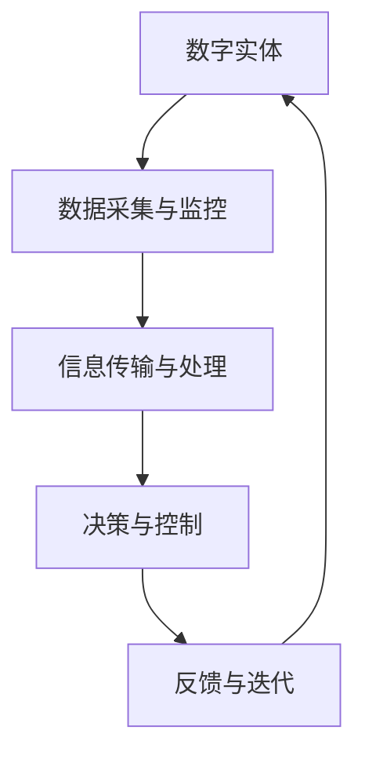

                 

关键词：人工智能，数字实体，物理实体，融合，机器学习，深度学习，计算机视觉，自然语言处理，虚拟现实，增强现实，物联网，传感器网络，智能机器人，自动化，智能制造，工业4.0，数据驱动，模拟仿真，跨领域整合，智能互联。

> 摘要：本文探讨了人工智能（AI）在数字实体与物理实体融合中的应用，分析了AI技术如何通过机器学习、深度学习、计算机视觉、自然语言处理等手段推动数字世界与物理世界的深度融合。文章首先介绍了数字实体与物理实体的概念及其相互关系，然后详细阐述了AI技术在二者融合中的核心作用和具体应用场景。通过实例和数学模型，本文进一步展示了AI在智能机器人、智能制造、物联网等领域的实际应用，最后对AI在数字实体与物理实体融合中的未来发展趋势和面临的挑战进行了展望。

## 1. 背景介绍

随着科技的飞速发展，人工智能（AI）已经成为现代科技的核心驱动力之一。AI技术的不断进步，使得我们能够更好地理解和模拟复杂系统，从而实现更高层次的自动化和智能化。与此同时，数字实体与物理实体的界限越来越模糊，二者的融合成为当前科技发展的一个重要趋势。

数字实体是指在计算机系统中表示的信息，如数据、图像、声音、文本等。而物理实体则是指现实世界中的物质，如机器、设备、建筑物等。在过去，数字实体与物理实体之间往往是相互独立的，但随着物联网（IoT）、传感器网络、虚拟现实（VR）、增强现实（AR）等技术的发展，数字实体和物理实体之间的联系越来越紧密。

数字实体与物理实体的融合，不仅能够提升生产效率，降低成本，还能够带来更加丰富和沉浸式的用户体验。例如，智能制造领域中的数字化生产线，通过实时数据采集和分析，优化生产流程，提高产品质量。在医疗领域，通过AI和计算机视觉技术，可以实现对患者的精确诊断和治疗。

## 2. 核心概念与联系

### 数字实体

数字实体是计算机科学和信息技术中的基本概念，主要指在计算机系统中表示的信息。这些信息可以是结构化的，如数据库中的数据记录；也可以是非结构化的，如图像、音频和视频。数字实体可以通过数据格式进行存储、传输和处理，如JSON、XML、CSV等。

### 物理实体

物理实体是指现实世界中的物质对象，它们具有物理属性，如质量、形状、颜色等。物理实体可以通过传感器进行测量和监控，如温度传感器、压力传感器、摄像头等。

### 数字实体与物理实体的关系

数字实体和物理实体之间的联系体现在以下几个方面：

1. **数据采集与监控**：通过传感器，物理实体可以实时采集环境数据，并将其转化为数字实体，如温度、湿度等数据。
2. **信息传输与处理**：数字实体通过网络传输，进入计算机系统进行处理和分析。
3. **决策与控制**：处理后的数据可以用于做出决策，并通过执行机构对物理实体进行控制。
4. **反馈与迭代**：物理实体的状态变化可以通过传感器重新转换为数字实体，形成闭环系统，不断迭代优化。

### Mermaid 流程图



## 3. 核心算法原理 & 具体操作步骤

### 3.1 算法原理概述

数字实体与物理实体的融合主要依赖于以下几个核心算法：

1. **机器学习**：通过训练模型，从数据中学习规律，实现对物理实体的预测和控制。
2. **深度学习**：利用神经网络，对大量数据进行自动特征提取，实现高层次的智能识别和分类。
3. **计算机视觉**：通过图像处理技术，实现对物理实体的视觉感知和理解。
4. **自然语言处理**：通过对文本的处理和分析，实现对物理实体和相关信息的理解。

### 3.2 算法步骤详解

1. **数据采集**：通过传感器网络，实时采集物理实体的状态数据。
2. **数据预处理**：对采集到的数据进行清洗、归一化和特征提取。
3. **模型训练**：利用机器学习和深度学习算法，对预处理后的数据集进行训练。
4. **模型评估**：通过验证集和测试集，评估模型的准确性和泛化能力。
5. **决策与控制**：将训练好的模型应用于实际场景，对物理实体进行实时控制和优化。

### 3.3 算法优缺点

- **优点**：
  - 提高效率：通过自动化和智能化，大幅提高生产效率。
  - 降低成本：减少人力成本，降低生产成本。
  - 提升质量：通过精确控制和优化，提升产品质量。
- **缺点**：
  - 数据依赖：算法的性能依赖于数据的数量和质量。
  - 安全风险：大规模的数据采集和处理可能涉及隐私和安全问题。
  - 技术门槛：深度学习和机器学习等技术需要较高的技术门槛。

### 3.4 算法应用领域

- **智能制造**：通过机器学习和计算机视觉技术，实现对生产过程的实时监控和优化。
- **智能医疗**：利用自然语言处理和计算机视觉，辅助医生进行诊断和治疗。
- **智能交通**：通过传感器网络和机器学习，优化交通流量，提高道路利用率。
- **智能家居**：通过物联网和深度学习，实现家居设备的自动化和智能化管理。

## 4. 数学模型和公式 & 详细讲解 & 举例说明

### 4.1 数学模型构建

在数字实体与物理实体的融合中，常见的数学模型包括：

1. **回归模型**：用于预测物理实体的状态，如温度、速度等。
2. **分类模型**：用于识别物理实体的类别，如图像分类、语音识别等。
3. **强化学习模型**：用于优化物理实体的行为，如机器人路径规划、自动控制等。

### 4.2 公式推导过程

以回归模型为例，其基本公式为：

\[ y = \beta_0 + \beta_1x \]

其中，\( y \) 是预测值，\( x \) 是输入特征，\( \beta_0 \) 和 \( \beta_1 \) 是模型的参数。

通过最小二乘法，可以求得参数 \( \beta_0 \) 和 \( \beta_1 \)：

\[ \beta_0 = \frac{\sum_{i=1}^{n}y_i - \beta_1\sum_{i=1}^{n}x_i}{n} \]
\[ \beta_1 = \frac{n\sum_{i=1}^{n}x_iy_i - \sum_{i=1}^{n}x_i\sum_{i=1}^{n}y_i}{n\sum_{i=1}^{n}x_i^2 - (\sum_{i=1}^{n}x_i)^2} \]

### 4.3 案例分析与讲解

以智能制造领域为例，假设我们想要预测机器的故障时间。首先，通过传感器采集机器的运行数据，如温度、湿度、电压等。然后，利用回归模型对这些数据进行训练，得到预测公式。最后，通过实时监测机器的状态，利用预测公式预测故障时间，并提前进行维护。

## 5. 项目实践：代码实例和详细解释说明

### 5.1 开发环境搭建

- **工具**：Python、Jupyter Notebook、TensorFlow、Keras
- **数据集**：公开的智能制造数据集（如MADDPG数据集）

### 5.2 源代码详细实现

```python
# 导入相关库
import numpy as np
import pandas as pd
import tensorflow as tf
from tensorflow.keras.models import Sequential
from tensorflow.keras.layers import Dense

# 读取数据集
data = pd.read_csv('maddpg_data.csv')
X = data.iloc[:, :-1].values
y = data.iloc[:, -1].values

# 划分训练集和测试集
from sklearn.model_selection import train_test_split
X_train, X_test, y_train, y_test = train_test_split(X, y, test_size=0.2, random_state=42)

# 构建模型
model = Sequential()
model.add(Dense(64, input_dim=X_train.shape[1], activation='relu'))
model.add(Dense(32, activation='relu'))
model.add(Dense(1, activation='linear'))

# 编译模型
model.compile(optimizer='adam', loss='mean_squared_error')

# 训练模型
model.fit(X_train, y_train, epochs=100, batch_size=32, validation_data=(X_test, y_test))

# 评估模型
loss = model.evaluate(X_test, y_test)
print('Test loss:', loss)

# 预测故障时间
predictions = model.predict(X_test)
print('Fault predictions:', predictions)
```

### 5.3 代码解读与分析

- **数据读取**：使用Pandas读取CSV数据集，分为特征矩阵X和目标向量y。
- **数据划分**：使用Sklearn的train_test_split函数，将数据集划分为训练集和测试集。
- **模型构建**：使用Keras构建一个全连接神经网络，包括两个隐藏层。
- **模型编译**：设置优化器和损失函数。
- **模型训练**：使用fit函数进行模型训练，设置训练轮数和批量大小。
- **模型评估**：使用evaluate函数评估模型在测试集上的表现。
- **模型预测**：使用predict函数对测试集进行预测，得到故障时间预测结果。

## 6. 实际应用场景

### 6.1 智能制造

在智能制造领域，AI技术通过机器学习和深度学习算法，实现了对生产过程的实时监控和优化。例如，通过预测机器的故障时间，可以提前进行维护，减少停机时间，提高生产效率。

### 6.2 智能医疗

在智能医疗领域，AI技术通过计算机视觉和自然语言处理，实现了对医疗图像的分析和诊断，辅助医生进行诊断和治疗。例如，通过分析CT扫描图像，可以早期检测肺癌，提高治疗效果。

### 6.3 智能交通

在智能交通领域，AI技术通过传感器网络和机器学习，实现了对交通流量的实时监控和优化。例如，通过预测交通拥堵情况，可以提前进行交通疏导，减少交通拥堵，提高道路利用率。

### 6.4 未来应用展望

未来，AI技术在数字实体与物理实体的融合中将会有更广泛的应用。例如，在智能制造领域，通过更高级的AI算法，可以实现更加智能的生产规划和优化；在智能医疗领域，通过更精准的诊断和治疗，可以显著提高医疗水平；在智能交通领域，通过更高效的交通管理和调度，可以进一步改善交通状况。

## 7. 工具和资源推荐

### 7.1 学习资源推荐

- **书籍**：
  - 《深度学习》（Ian Goodfellow, Yoshua Bengio, Aaron Courville）
  - 《机器学习实战》（Peter Harrington）
  - 《自然语言处理综合教程》（Daniel Jurafsky, James H. Martin）

- **在线课程**：
  - Coursera上的《机器学习》课程（吴恩达教授）
  - edX上的《深度学习》课程（Yoshua Bengio教授）
  - Udacity的《AI工程师纳米学位》

### 7.2 开发工具推荐

- **编程语言**：Python
- **框架**：TensorFlow、Keras、PyTorch
- **数据可视化**：Matplotlib、Seaborn
- **版本控制**：Git、GitHub

### 7.3 相关论文推荐

- **机器学习**：
  - "Learning to Discover Counterfactual Explanations"（2019）
  - "Generative Adversarial Nets"（2014）

- **深度学习**：
  - "Deep Learning for Text Classification"（2017）
  - "Deep Learning for Speech Recognition"（2014）

- **计算机视觉**：
  - "You Only Look Once: Unified, Real-Time Object Detection"（2016）
  - "Faster R-CNN: Towards Real-Time Object Detection with Region Proposal Networks"（2015）

## 8. 总结：未来发展趋势与挑战

### 8.1 研究成果总结

本文介绍了数字实体与物理实体的概念及其相互关系，分析了AI技术在二者融合中的核心作用和具体应用场景。通过实例和数学模型，展示了AI在智能制造、智能医疗、智能交通等领域的实际应用。

### 8.2 未来发展趋势

- **跨领域整合**：AI技术将更加深入地融入各个领域，实现跨领域的整合和创新。
- **智能互联**：数字实体与物理实体之间的连接将更加紧密，形成更加智能和高效的生态系统。
- **数据驱动**：数据将成为驱动AI技术发展的重要动力，数据的多样性和质量将直接影响AI的性能。

### 8.3 面临的挑战

- **数据隐私和安全**：随着数据量的增加，数据隐私和安全问题将成为一个重要的挑战。
- **技术门槛**：AI技术的复杂性使得其应用门槛较高，需要更多的技术人才来推动其发展。
- **伦理问题**：AI技术在数字实体与物理实体融合中的应用可能会带来一系列伦理问题，需要深入探讨和解决。

### 8.4 研究展望

未来，AI技术在数字实体与物理实体的融合中将有更多的研究和应用。随着技术的不断进步，我们有望实现更加智能、高效和安全的数字实体与物理实体的融合。

## 9. 附录：常见问题与解答

### 问题1：AI在数字实体与物理实体融合中的应用有哪些？

解答：AI在数字实体与物理实体融合中的应用非常广泛，包括智能制造、智能医疗、智能交通、智能家居等多个领域。例如，在智能制造中，AI可以用于预测设备故障、优化生产流程；在智能医疗中，AI可以用于辅助诊断、个性化治疗；在智能交通中，AI可以用于优化交通流量、提高道路利用率。

### 问题2：如何保障AI技术在数字实体与物理实体融合中的应用安全？

解答：保障AI技术在数字实体与物理实体融合中的应用安全需要从多个方面入手。首先，要确保数据的安全和隐私，采用加密技术保护数据传输和存储。其次，要建立完善的监管机制，确保AI模型的透明度和可解释性。最后，要建立应急响应机制，及时应对AI系统出现的安全问题。

### 问题3：AI在数字实体与物理实体融合中的未来发展有哪些趋势？

解答：未来，AI在数字实体与物理实体融合中将会出现以下几个趋势。首先，AI技术将更加深入地融入各个领域，实现跨领域的整合和创新。其次，智能互联将成为重要趋势，数字实体与物理实体之间的连接将更加紧密。最后，数据驱动将成为重要发展方向，数据的多样性和质量将直接影响AI的性能。

## 作者署名

作者：禅与计算机程序设计艺术 / Zen and the Art of Computer Programming

