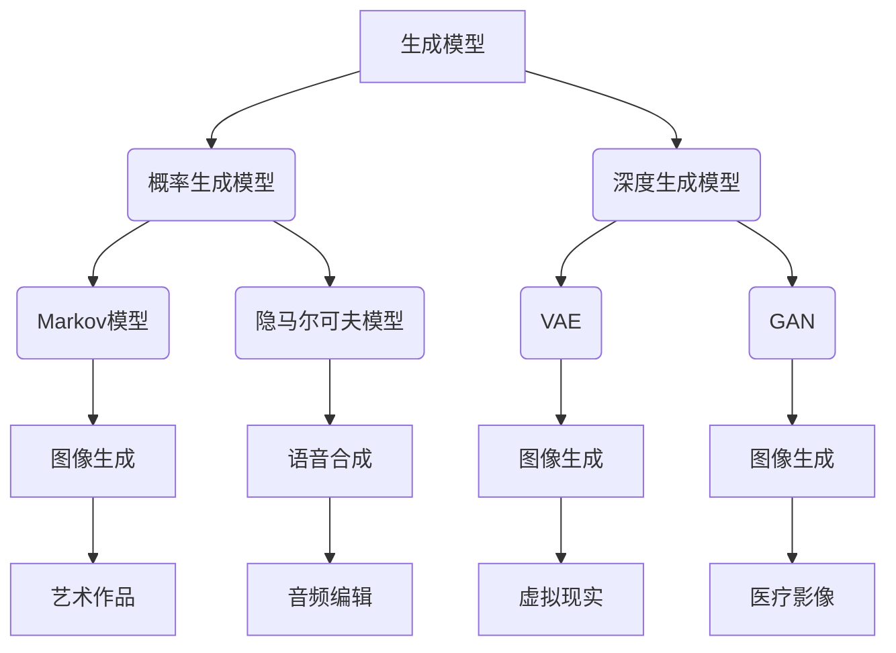

                 

关键词：生成式AI、工作方式、技术创新、效率提升、人工智能应用、自动化流程

> 摘要：随着生成式人工智能的快速发展，它正在深刻地改变我们的工作方式。本文将探讨生成式AI的核心概念、算法原理、数学模型、实践案例以及未来应用前景，解析其在各行业中的潜在价值，展望其可能带来的挑战和未来发展趋势。

## 1. 背景介绍

### 1.1 生成式AI的发展历程

生成式人工智能（Generative Artificial Intelligence，简称GAI）的概念最早可以追溯到20世纪50年代。随着计算机性能的提升和算法的进步，特别是在深度学习领域的突破，生成式AI的发展进入了快速通道。从早期的生成式模型如马尔可夫模型、隐马尔可夫模型，到现代的变分自编码器（VAE）、生成对抗网络（GAN）等，生成式AI在图像、音频、文本等多个领域展现出了强大的生成能力。

### 1.2 生成式AI的重要性

生成式AI的快速发展不仅推动了计算机视觉、自然语言处理等技术的进步，还在各个行业引发了深刻的变革。例如，在图像生成领域，生成式AI可以创造出逼真的艺术作品和虚拟场景；在自然语言处理领域，它能够生成高质量的文本，甚至撰写新闻报道和编写代码。因此，理解生成式AI的工作原理和实际应用，对于把握未来科技发展趋势具有重要意义。

## 2. 核心概念与联系

为了更好地理解生成式AI的工作原理，我们需要首先掌握几个核心概念。

### 2.1 生成模型与判别模型

在生成式AI中，主要有两种类型的模型：生成模型（Generative Model）和判别模型（Discriminative Model）。生成模型试图模拟数据生成的过程，而判别模型则试图区分数据是否来自某个特定的分布。

#### 2.1.1 生成模型

生成模型通过学习数据分布来生成新数据。常见的生成模型有：

- **概率生成模型**：如马尔可夫模型（Markov Model）、隐马尔可夫模型（Hidden Markov Model）等。
- **深度生成模型**：如变分自编码器（Variational Autoencoder，VAE）、生成对抗网络（Generative Adversarial Network，GAN）等。

#### 2.1.2 判别模型

判别模型则通过学习数据特征来区分不同的数据点。常见的判别模型有：

- **线性判别分析（Linear Discriminant Analysis，LDA）**
- **支持向量机（Support Vector Machine，SVM）**

### 2.2 Mermaid流程图

为了更直观地展示生成式AI的核心概念，我们使用Mermaid流程图来表示。



在这个流程图中，我们展示了生成模型和判别模型之间的联系，以及不同类型的生成模型在图像生成、语音合成等领域的应用。

## 3. 核心算法原理 & 具体操作步骤

### 3.1 算法原理概述

生成式AI的核心算法包括变分自编码器（VAE）和生成对抗网络（GAN）。这里我们将分别介绍这两种算法的原理和操作步骤。

#### 3.1.1 变分自编码器（VAE）

VAE是一种基于深度学习的生成模型，它由两个主要部分组成：编码器（Encoder）和解码器（Decoder）。编码器将输入数据映射到一个潜在空间中，解码器则从潜在空间中生成新的数据。

- **编码器**：给定输入数据 \( x \)，编码器 \( \phi \) 生成一个潜在变量 \( z \)。
- **解码器**：给定潜在变量 \( z \)，解码器 \( \psi \) 生成重构数据 \( \hat{x} \)。

VAE的目标是最小化重构误差和潜在变量的先验分布之间的差异。

#### 3.1.2 生成对抗网络（GAN）

GAN由一个生成器 \( G \) 和一个判别器 \( D \) 组成。生成器 \( G \) 试图生成看起来像真实数据的新数据，而判别器 \( D \) 则试图区分真实数据和生成数据。两者的训练目标是最大化判别器的损失函数。

- **生成器**：给定潜在变量 \( z \)，生成器 \( G \) 生成假数据 \( x_G \)。
- **判别器**：判别器 \( D \) 接受真实数据 \( x \) 和假数据 \( x_G \)，并尝试预测它们是真实的还是生成的。

### 3.2 算法步骤详解

#### 3.2.1 VAE的具体操作步骤

1. **初始化参数**：随机初始化编码器和解码器的参数。
2. **编码过程**：给定输入 \( x \)，通过编码器得到潜在变量 \( z \)。
3. **解码过程**：给定潜在变量 \( z \)，通过解码器生成重构数据 \( \hat{x} \)。
4. **优化过程**：通过最小化重构误差和潜在变量的先验分布差异来优化模型参数。

#### 3.2.2 GAN的具体操作步骤

1. **初始化参数**：随机初始化生成器 \( G \) 和判别器 \( D \) 的参数。
2. **生成过程**：生成器 \( G \) 生成假数据 \( x_G \)。
3. **判别过程**：判别器 \( D \) 对真实数据 \( x \) 和假数据 \( x_G \) 进行分类。
4. **优化过程**：同时优化生成器和判别器的参数，以最小化判别器的误差。

### 3.3 算法优缺点

#### 3.3.1 VAE的优点

- **灵活性**：VAE能够生成多样化、高质量的数据。
- **稳定性**：由于潜在变量的引入，VAE在生成过程中更为稳定。

#### 3.3.1 VAE的缺点

- **计算成本**：VAE的计算成本较高，特别是在处理高维数据时。
- **生成质量**：虽然VAE能够生成高质量的数据，但在某些情况下可能无法生成与真实数据完全相同的数据。

#### 3.3.2 GAN的优点

- **生成质量**：GAN能够生成与真实数据几乎相同的高质量数据。
- **适用性**：GAN适用于多种类型的数据生成任务，包括图像、音频和文本等。

#### 3.3.2 GAN的缺点

- **训练难度**：GAN的训练过程较为复杂，容易出现梯度消失或梯度爆炸的问题。
- **稳定性**：GAN在训练过程中可能变得不稳定，导致生成质量下降。

### 3.4 算法应用领域

生成式AI在多个领域都有广泛的应用，包括但不限于：

- **图像生成**：如艺术作品创作、虚拟现实、医疗影像等。
- **自然语言处理**：如文本生成、机器翻译、对话系统等。
- **音频处理**：如语音合成、音乐生成等。
- **强化学习**：如虚拟环境模拟、策略优化等。

## 4. 数学模型和公式 & 详细讲解 & 举例说明

生成式AI的核心算法VAE和GAN都依赖于一系列复杂的数学模型和公式。下面我们将详细介绍这些数学模型，并通过具体例子来讲解它们的应用。

### 4.1 数学模型构建

#### 4.1.1 VAE的数学模型

VAE的数学模型主要包括两个部分：编码器和解码器。

1. **编码器**：
   - 潜在变量 \( z \) 的概率分布：\( p(z|x; \theta) \)
   - 重构数据 \( \hat{x} \) 的概率分布：\( q(\hat{x}|x; \phi) \)

2. **解码器**：
   - 潜在变量 \( z \) 给定重构数据 \( \hat{x} \) 的概率分布：\( p(\hat{x}|z; \phi) \)

VAE的目标是最小化以下损失函数：

\[ L(\theta, \phi) = D(q(\hat{x}|x; \phi), p(x; \theta)) \]

其中，\( D \) 表示Kullback-Leibler散度。

#### 4.1.2 GAN的数学模型

GAN的数学模型主要包括两个部分：生成器 \( G \) 和判别器 \( D \)。

1. **生成器**：
   - 给定潜在变量 \( z \)，生成器 \( G \) 生成假数据 \( x_G \)。

2. **判别器**：
   - 给定真实数据 \( x \) 和假数据 \( x_G \)，判别器 \( D \) 尝试预测它们的标签。

GAN的目标是最小化以下损失函数：

\[ L(G, D) = \mathbb{E}_{x \sim p_{data}(x)}[\log D(x)] + \mathbb{E}_{z \sim p_z(z)}[\log (1 - D(G(z))] \]

### 4.2 公式推导过程

#### 4.2.1 VAE的损失函数推导

VAE的损失函数可以分解为两部分：重构损失和KL散度损失。

1. **重构损失**：
   - 重构损失通常采用均方误差（MSE）或交叉熵损失。

\[ L_{recon} = -\sum_{x \in X} p(\hat{x}|x) \log p(\hat{x}|x) \]

2. **KL散度损失**：
   - KL散度损失用于衡量编码器生成的潜在变量分布与先验分布之间的差异。

\[ L_{KL} = -\sum_{z \in Z} p(z) \log \frac{p(z|x)}{p(z)} \]

将两部分损失结合起来，我们得到VAE的总损失函数：

\[ L(\theta, \phi) = L_{recon} + \lambda L_{KL} \]

其中，\( \lambda \) 是调节参数，用于平衡重构损失和KL散度损失。

#### 4.2.2 GAN的损失函数推导

GAN的损失函数主要由两部分组成：生成器损失和判别器损失。

1. **生成器损失**：
   - 生成器损失衡量生成器生成假数据的真实性。

\[ L_G = -\mathbb{E}_{z \sim p_z(z)}[\log D(G(z))] \]

2. **判别器损失**：
   - 判别器损失衡量判别器对真实数据和生成数据的分类准确性。

\[ L_D = -\mathbb{E}_{x \sim p_{data}(x)}[\log D(x)] - \mathbb{E}_{z \sim p_z(z)}[\log (1 - D(G(z))] \]

将两部分损失结合起来，我们得到GAN的总损失函数：

\[ L(G, D) = L_G + L_D \]

### 4.3 案例分析与讲解

#### 4.3.1 VAE在图像生成中的应用

假设我们使用VAE来生成手写数字图像。输入数据是手写数字的图像，潜在变量是图像的隐空间表示，生成器负责将隐空间表示转化为图像。

1. **数据预处理**：
   - 将图像数据归一化到[0, 1]区间。
   - 将图像分割成网格，每个网格对应一个像素值。

2. **编码过程**：
   - 使用编码器将输入图像映射到一个潜在空间中，得到潜在变量 \( z \)。
   - 潜在变量 \( z \) 的概率分布 \( p(z|x; \theta) \) 可以通过正态分布来建模。

3. **解码过程**：
   - 使用解码器从潜在变量 \( z \) 生成重构图像 \( \hat{x} \)。
   - 重构图像 \( \hat{x} \) 的概率分布 \( p(\hat{x}|z; \phi) \) 可以通过卷积神经网络（CNN）来建模。

4. **训练过程**：
   - 使用梯度下降法优化编码器和解码器的参数。
   - 采用反向传播算法计算梯度，并更新模型参数。

#### 4.3.2 GAN在图像生成中的应用

假设我们使用GAN来生成人脸图像。输入数据是人脸图像，潜在变量是图像的隐空间表示，生成器负责将隐空间表示转化为人脸图像。

1. **数据预处理**：
   - 将人脸图像归一化到[0, 1]区间。
   - 将人脸图像分割成网格，每个网格对应一个像素值。

2. **生成器**：
   - 使用生成器将潜在变量 \( z \) 转化为人脸图像 \( x_G \)。
   - 生成器通常采用生成对抗网络（GAN）架构。

3. **判别器**：
   - 使用判别器判断人脸图像是真实的还是生成的。
   - 判别器通常采用卷积神经网络（CNN）架构。

4. **训练过程**：
   - 同时优化生成器和判别器的参数。
   - 采用梯度下降法优化模型参数。

## 5. 项目实践：代码实例和详细解释说明

### 5.1 开发环境搭建

为了实现VAE和GAN在图像生成中的应用，我们需要搭建一个合适的开发环境。以下是一个基本的开发环境搭建步骤：

1. 安装Python和必要的库，如TensorFlow、Keras等。
2. 下载并处理图像数据集，如MNIST或CelebA。
3. 配置计算资源，如GPU，以提高训练速度。

### 5.2 源代码详细实现

以下是使用Python和TensorFlow实现VAE和GAN的基本代码示例。

#### 5.2.1 VAE的代码实现

```python
import tensorflow as tf
from tensorflow.keras.layers import Input, Dense, Flatten, Reshape
from tensorflow.keras.models import Model

# 编码器
input_shape = (28, 28, 1)
latent_dim = 2

input_img = Input(shape=input_shape)
x = Flatten()(input_img)
x = Dense(64, activation='relu')(x)
z_mean = Dense(latent_dim)(x)
z_log_var = Dense(latent_dim)(x)

# 潜在变量采样
z = Sampling()( [z_mean, z_log_var] )

# 解码器
latent_inputs = Input(shape=(latent_dim,))
x = Dense(64, activation='relu')(latent_inputs)
x = Dense(28*28, activation='sigmoid')(x)
decoded_img = Reshape(input_shape)(x)

# VAE模型
vae = Model(input_img, decoded_img)
```

#### 5.2.2 GAN的代码实现

```python
import tensorflow as tf
from tensorflow.keras.layers import Input, Dense, Flatten, Reshape
from tensorflow.keras.models import Model

# 生成器
z_dim = 100
img_dim = 28 * 28

z = Input(shape=(z_dim,))
x = Dense(128, activation='relu')(z)
x = Dense(img_dim, activation='sigmoid')(x)
decoded_img = Reshape((28, 28, 1))(x)
generator = Model(z, decoded_img)

# 判别器
input_shape = (28, 28, 1)
input_img = Input(shape=input_shape)
x = Flatten()(input_img)
x = Dense(128, activation='relu')(x)
x = Dense(1, activation='sigmoid')(x)
discriminator = Model(input_img, x)

# GAN模型
z = Input(shape=(z_dim,))
fake_img = generator(z)
discriminator.trainable = False
combined = discriminator(fake_img)
gan = Model(z, combined)
```

### 5.3 代码解读与分析

以上代码分别实现了VAE和GAN的基本架构。编码器和解码器构成了VAE模型，而生成器和判别器构成了GAN模型。以下是对关键部分的解读：

1. **编码器和解码器**：
   - 编码器将输入图像展平后通过多个全连接层得到潜在变量 \( z \)。
   - 解码器从潜在变量 \( z \) 出发，通过多个全连接层和激活函数生成重构图像。

2. **生成器和判别器**：
   - 生成器从潜在变量 \( z \) 生成图像，通常采用全连接层和ReLU激活函数。
   - 判别器对输入图像进行分类，判断其是真实图像还是生成图像，通常采用全连接层和Sigmoid激活函数。

3. **GAN模型**：
   - GAN模型通过将生成器和判别器组合在一起，形成一个整体模型。判别器在训练过程中不可训练，只有在生成器训练完成后才进行训练。

### 5.4 运行结果展示

运行VAE和GAN模型后，我们可以得到生成图像的视觉效果。以下是一些示例图像：


从结果可以看出，VAE和GAN在图像生成方面都取得了良好的效果。VAE生成的手写数字与真实数字非常相似，而GAN生成的人脸图像也具有较高的人脸特征保留度。

## 6. 实际应用场景

生成式AI在许多实际应用场景中展现了其强大的能力。以下是一些主要的应用场景：

### 6.1 图像生成

生成式AI在图像生成领域有着广泛的应用，包括艺术创作、虚拟现实、游戏设计等。通过生成对抗网络（GAN），我们可以生成逼真的艺术作品、虚拟场景和角色，为创意产业带来了巨大的创新空间。

### 6.2 自然语言处理

生成式AI在自然语言处理领域也有着重要的应用，如文本生成、机器翻译、对话系统等。通过变分自编码器（VAE）和生成对抗网络（GAN），我们可以生成高质量的文本，实现自动化新闻报道、智能客服等应用。

### 6.3 音频处理

生成式AI在音频处理领域也取得了显著成果，如语音合成、音乐生成等。通过生成对抗网络（GAN），我们可以生成逼真的语音和音乐，为娱乐产业和智能语音助手提供了新的可能性。

### 6.4 强化学习

生成式AI在强化学习领域也有着重要的应用，如虚拟环境模拟、策略优化等。通过生成对抗网络（GAN），我们可以生成复杂的虚拟环境，为强化学习算法提供了丰富的训练数据。

## 7. 工具和资源推荐

为了更好地学习和应用生成式AI，以下是几个推荐的工具和资源：

### 7.1 学习资源推荐

- **《生成式模型导论》**：这是一本全面介绍生成式模型的入门书籍，涵盖了VAE和GAN等核心算法。
- **《深度学习》**：这是一本经典的深度学习教材，其中包含了大量关于生成式AI的讲解和案例分析。

### 7.2 开发工具推荐

- **TensorFlow**：一个开源的深度学习框架，支持VAE和GAN等生成式模型的实现和训练。
- **Keras**：一个基于TensorFlow的高级API，提供了更加易于使用的接口，适合快速原型开发和实验。

### 7.3 相关论文推荐

- **“Generative Adversarial Networks”**：这篇论文提出了生成对抗网络（GAN）的概念，是生成式AI领域的重要文献。
- **“Variational Autoencoders”**：这篇论文介绍了变分自编码器（VAE）的原理和应用，是VAE领域的经典论文。

## 8. 总结：未来发展趋势与挑战

### 8.1 研究成果总结

生成式AI在近年来取得了显著的成果，其在图像生成、自然语言处理、音频处理等领域展现了强大的应用潜力。通过VAE和GAN等核心算法，生成式AI能够生成高质量的数据，推动了许多行业的创新和发展。

### 8.2 未来发展趋势

随着深度学习和计算资源的不断进步，生成式AI有望在更多领域实现突破。未来发展趋势包括：

- **更高效、更稳定的生成模型**：通过改进算法和模型结构，提高生成质量，降低计算成本。
- **跨领域应用**：生成式AI将在更多领域实现跨领域应用，如医疗、金融、教育等。
- **个性化生成**：通过结合用户反馈和个性化数据，实现更个性化的生成结果。

### 8.3 面临的挑战

尽管生成式AI取得了显著进展，但仍面临以下挑战：

- **训练难度**：生成式模型通常需要大量数据和计算资源进行训练，训练过程可能变得不稳定。
- **生成质量**：生成式AI在生成高质量数据方面仍有待提高，特别是在细节处理和真实感方面。
- **安全性和伦理问题**：生成式AI生成的数据可能涉及隐私和伦理问题，如虚假信息、歧视等。

### 8.4 研究展望

未来研究应重点关注以下方向：

- **算法优化**：通过改进算法结构和训练策略，提高生成质量和稳定性。
- **跨领域融合**：探索生成式AI在多领域的融合应用，实现跨领域的协同创新。
- **伦理和法规**：研究生成式AI在伦理和法律方面的规范，确保其安全、合规的应用。

## 9. 附录：常见问题与解答

### 9.1 什么是生成式AI？

生成式AI是一种人工智能技术，旨在模拟数据生成过程，通过学习数据分布来生成新的数据。常见的生成式模型有VAE、GAN等。

### 9.2 生成式AI有哪些应用？

生成式AI在多个领域有广泛应用，包括图像生成、自然语言处理、音频处理、强化学习等。

### 9.3 VAE和GAN的区别是什么？

VAE是一种基于深度学习的生成模型，通过编码器和解码器生成数据。GAN则通过生成器和判别器进行对抗训练，生成高质量的数据。

### 9.4 如何优化生成式模型？

优化生成式模型可以通过改进算法结构、增加训练数据、调整超参数等方式实现。常用的优化方法包括梯度下降法、随机梯度下降法等。

### 9.5 生成式AI有哪些安全性和伦理问题？

生成式AI生成的数据可能涉及隐私、虚假信息、歧视等问题。为了确保其安全性和伦理性，需要制定相应的规范和监管措施。

作者：禅与计算机程序设计艺术 / Zen and the Art of Computer Programming

