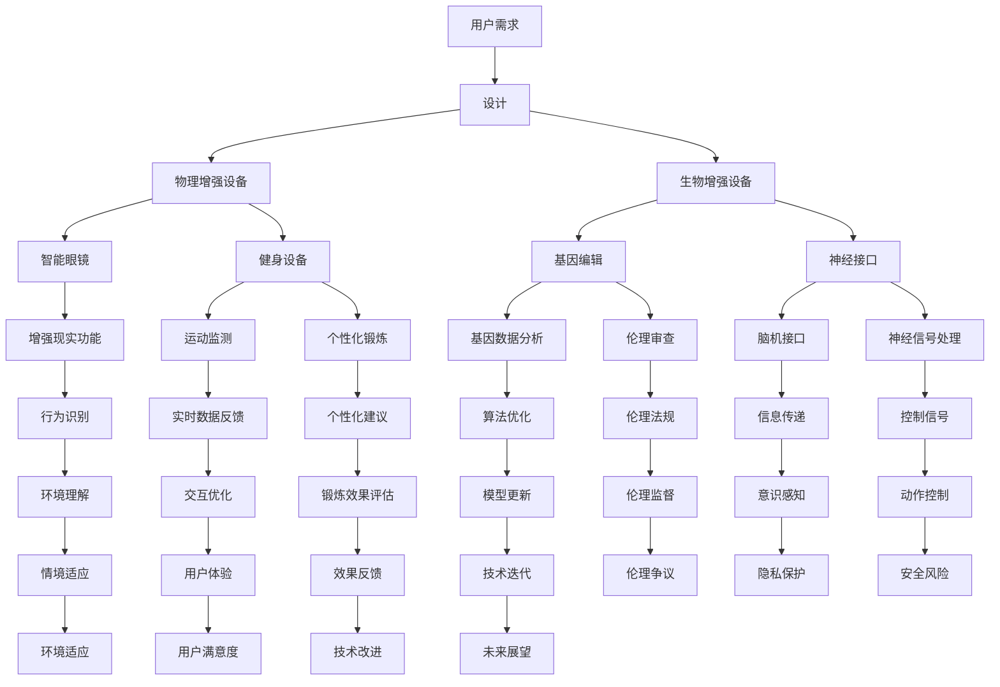
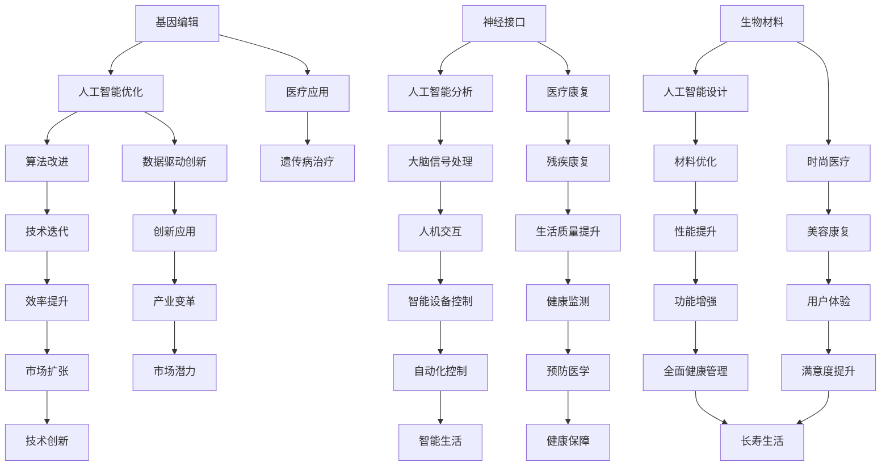

                 

关键词：人工智能，人类增强，道德考虑，身体增强，未来方向

> 摘要：本文旨在探讨AI时代下人类增强的可能性及其所带来的道德伦理问题。通过对身体增强技术的深入分析，本文将探讨身体增强的未来方向，并提出相应的道德考虑。文章旨在引发读者对于这一领域的思考，为未来的发展提供有益的参考。

## 1. 背景介绍

随着人工智能技术的快速发展，人类开始探索如何通过科技手段增强自身的生理和心理能力。身体增强技术作为一种新兴领域，正逐渐引起全球关注。这些技术包括基因编辑、神经接口、生物材料等，通过这些技术，人类可以改善自身的外貌、智力、体力、寿命等方面的能力。然而，这些技术的出现也引发了一系列道德伦理问题，例如：基因编辑的伦理争议、神经接口的安全性、生物材料的道德限制等。

本文将从以下几个方面进行探讨：

1. 核心概念与联系：介绍身体增强技术的基本概念，分析其与人工智能的关联，并通过Mermaid流程图展示其整体架构。
2. 核心算法原理与具体操作步骤：探讨身体增强技术的核心算法原理，详细解释其操作步骤，并分析算法的优缺点和应用领域。
3. 数学模型和公式：构建身体增强技术的数学模型，推导相关公式，并通过案例分析和讲解帮助读者理解。
4. 项目实践：提供身体增强技术的代码实例，详细解释代码实现过程，并展示运行结果。
5. 实际应用场景：探讨身体增强技术的实际应用，分析其未来应用展望。
6. 工具和资源推荐：推荐相关的学习资源和开发工具，提供更多的参考资料。
7. 总结：总结研究成果，探讨未来发展趋势与挑战，并提出研究展望。

### 1.1 身体增强技术的基本概念

身体增强技术是指利用科技手段增强人类身体各种能力的方法。这些方法可以分为物理增强和生物增强两大类。

**物理增强**：包括使用外部设备或工具来增强人体的物理能力。例如，智能眼镜可以提供增强现实功能，帮助用户更好地观察和理解周围环境；健身设备如智能跑步机可以实时监测用户的运动状态，提供个性化的锻炼方案。

**生物增强**：涉及对人体内部生物系统的改造和增强。例如，基因编辑技术可以改变人体的遗传信息，改善某些遗传病或增强某些生理功能；神经接口技术可以将人脑与计算机连接，实现信息的直接传递和控制。

身体增强技术的出现，使得人类可以突破自身的生理限制，提高生活质量和生产力。然而，这些技术也带来了道德伦理的挑战，需要我们深入思考和解决。

### 1.2 身体增强技术的人工智能关联

人工智能在身体增强技术中发挥着重要作用。首先，人工智能可以帮助设计和优化身体增强设备。例如，智能眼镜的增强现实功能需要利用人工智能算法来识别和理解用户的行为和环境。其次，人工智能可以用于生物数据的分析和处理，为身体增强提供科学依据。例如，基因编辑技术的实施需要利用人工智能算法来分析大量的基因数据，以确定哪些基因可以改善特定生理功能。

此外，人工智能还可以用于身体增强技术的监控和反馈。例如，智能健身设备的传感器可以实时监测用户的运动状态，通过人工智能算法分析数据，提供个性化的锻炼建议。这不仅提高了身体增强的效果，也提高了用户的使用体验。

### 1.3 身体增强技术的整体架构

为了更好地理解身体增强技术，我们可以使用Mermaid流程图来展示其整体架构。以下是一个简化的Mermaid流程图示例：



这个流程图展示了身体增强技术的各个方面，从用户需求到技术实现，再到道德伦理的考虑。通过这个流程图，我们可以更清晰地理解身体增强技术的整体架构和工作原理。

### 2. 核心概念与联系

#### 2.1. 基本概念

身体增强技术涉及多个核心概念，包括基因编辑、神经接口、生物材料等。这些概念在人工智能时代背景下具有特殊的意义。

**基因编辑**：基因编辑技术如CRISPR-Cas9允许科学家精确地修改DNA序列，从而改变生物体的遗传特征。这种技术在医疗、农业、生物工程等领域具有广泛的应用前景。

**神经接口**：神经接口是一种将人脑与计算机或其他设备连接的技术，通过它，人类可以感知和控制外部设备。这种技术在医疗康复、人机交互、人工智能等领域具有重要意义。

**生物材料**：生物材料是一种用于增强人体功能的材料，如可植入的人工器官、智能纺织品等。这些材料在医疗、康复、时尚等领域具有巨大的应用潜力。

#### 2.2. 关联分析

身体增强技术与人工智能有着密切的关联。首先，人工智能技术在设计、优化和实现身体增强设备中发挥着重要作用。例如，利用深度学习算法，可以优化基因编辑的过程，提高其准确性和效率。其次，人工智能可以用于分析生物数据，为身体增强提供科学依据。例如，通过分析大脑的电信号，可以更好地理解神经接口的工作原理。

此外，人工智能还可以用于监控和反馈身体增强的效果。例如，智能健身设备可以通过人工智能算法分析用户的运动数据，提供个性化的锻炼建议。这种反馈机制有助于提高身体增强的效果和用户的满意度。

#### 2.3. Mermaid流程图

为了更直观地展示身体增强技术与人工智能的关联，我们可以使用Mermaid流程图。以下是一个简化的Mermaid流程图，展示了身体增强技术的基本概念和关联：



这个流程图展示了身体增强技术与人工智能的密切关联，以及它们在各个应用领域中的相互促进。

### 3. 核心算法原理与具体操作步骤

#### 3.1. 算法原理概述

身体增强技术的核心算法主要包括基因编辑算法、神经接口算法和生物材料优化算法。这些算法的原理如下：

**基因编辑算法**：基因编辑算法主要基于CRISPR-Cas9技术，通过定位目标基因序列并对其进行剪切和修改，从而改变生物体的遗传特征。核心步骤包括目标基因识别、DNA剪切和基因修复。

**神经接口算法**：神经接口算法涉及人脑与计算机之间的信号传递和处理。核心步骤包括信号采集、信号预处理和信号解码，通过这些步骤，可以将人脑的意图转化为计算机的控制指令。

**生物材料优化算法**：生物材料优化算法通过模拟和优化材料的结构、性质和性能，以实现特定的身体增强目标。核心步骤包括材料模拟、性能优化和实验验证。

#### 3.2. 算法步骤详解

**3.2.1. 基因编辑算法**

1. **目标基因识别**：首先，利用人工智能算法对基因组序列进行分析，识别出需要编辑的目标基因。

2. **DNA剪切**：利用CRISPR-Cas9系统，将Cas9蛋白引导至目标基因序列，通过RNA引导和DNA剪切，实现目标基因的剪切和断裂。

3. **基因修复**：细胞自身会启动修复机制，将断裂的DNA进行修复。通过引入特定的DNA修复酶，可以引导修复过程，实现目标基因的精确修改。

**3.2.2. 神经接口算法**

1. **信号采集**：通过脑电图（EEG）、脑磁图（MEG）或光学脑成像等技术，采集人脑的神经信号。

2. **信号预处理**：对采集到的信号进行滤波、去噪和归一化等预处理操作，以提高信号的清晰度和准确性。

3. **信号解码**：利用机器学习算法，对预处理后的信号进行解码，将神经信号转化为计算机的控制指令。

**3.2.3. 生物材料优化算法**

1. **材料模拟**：利用分子动力学模拟或有限元分析等方法，对生物材料的结构、性质和性能进行模拟。

2. **性能优化**：通过优化算法，如遗传算法、粒子群算法等，对材料的结构进行优化，以提高其性能。

3. **实验验证**：将优化后的材料进行实验验证，验证其性能是否符合预期。

#### 3.3. 算法优缺点

**3.3.1. 基因编辑算法**

**优点**：基因编辑算法具有高度的精确性和灵活性，可以实现对特定基因的精确修改，从而治疗遗传病或增强特定生理功能。

**缺点**：基因编辑可能引发意外的副作用，如脱靶效应，且目前的技术还无法完全避免。

**3.3.2. 神经接口算法**

**优点**：神经接口算法可以实现人脑与计算机的实时通信，提高人机交互的效率。

**缺点**：神经接口技术可能引发脑损伤或感染等风险，且目前的技术还无法完全确保其安全性。

**3.3.3. 生物材料优化算法**

**优点**：生物材料优化算法可以大幅提升生物材料的性能，为身体增强提供更多的可能性。

**缺点**：生物材料的优化过程复杂，且优化后的材料可能存在潜在的生物相容性问题。

#### 3.4. 算法应用领域

**3.4.1. 基因编辑算法**

基因编辑算法在医疗领域具有广泛的应用前景，如治疗遗传病、增强免疫系统等。此外，基因编辑还可以用于农业和生物工程，提高作物的产量和抗病性。

**3.4.2. 神经接口算法**

神经接口算法在医疗康复、人机交互和人工智能等领域具有重要作用。例如，通过神经接口技术，可以实现残疾人的运动控制和认知功能恢复。

**3.4.3. 生物材料优化算法**

生物材料优化算法在医疗、康复和时尚等领域具有广泛的应用。例如，优化后的人工器官可以大幅提高移植成功率，智能纺织品可以提供更为舒适的穿着体验。

### 4. 数学模型和公式

在身体增强技术中，数学模型和公式扮演着至关重要的角色。它们不仅用于描述和预测技术效果，还为算法设计和优化提供了理论基础。

#### 4.1. 数学模型构建

**4.1.1. 基因编辑模型**

基因编辑模型主要基于概率论和统计学。其中，常用的模型包括基因编辑效率模型、脱靶效应模型和基因修复模型。

- **基因编辑效率模型**：描述基因编辑过程中的编辑效率和特异性。公式如下：

  $$ E = \frac{E_1 + E_2}{2} $$

  其中，$E_1$ 和 $E_2$ 分别表示目标基因和非目标基因的编辑效率。

- **脱靶效应模型**：描述基因编辑过程中的脱靶效应。公式如下：

  $$ D = \frac{1}{N} \sum_{i=1}^{N} (1 - p_i) $$

  其中，$N$ 表示编辑的基因总数，$p_i$ 表示第 $i$ 个基因发生脱靶的概率。

- **基因修复模型**：描述基因编辑后的修复过程。公式如下：

  $$ R = \frac{R_1 + R_2}{2} $$

  其中，$R_1$ 和 $R_2$ 分别表示成功的修复和失败的修复概率。

**4.1.2. 神经接口模型**

神经接口模型主要涉及信号处理和机器学习。其中，常用的模型包括信号采集模型、信号预处理模型和信号解码模型。

- **信号采集模型**：描述神经信号的采集过程。公式如下：

  $$ S(t) = A \sin(2\pi f t + \phi) $$

  其中，$S(t)$ 表示采集到的神经信号，$A$ 表示振幅，$f$ 表示频率，$\phi$ 表示相位。

- **信号预处理模型**：描述信号预处理过程中的滤波、去噪和归一化。公式如下：

  $$ \hat{S}(t) = \frac{S(t) - \bar{S}}{s_d} $$

  其中，$\hat{S}(t)$ 表示预处理后的信号，$\bar{S}$ 表示信号的均值，$s_d$ 表示信号的方差。

- **信号解码模型**：描述信号解码过程中的特征提取和分类。公式如下：

  $$ C = \arg\max_{c \in C} \sum_{i=1}^{n} w_i c_i $$

  其中，$C$ 表示解码结果，$w_i$ 表示权重，$c_i$ 表示特征向量。

**4.1.3. 生物材料优化模型**

生物材料优化模型主要涉及材料科学和计算力学。其中，常用的模型包括材料模拟模型、性能优化模型和实验验证模型。

- **材料模拟模型**：描述生物材料的结构、性质和性能。公式如下：

  $$ E = \frac{1}{2} K (u^2 + v^2) $$

  其中，$E$ 表示材料的弹性模量，$K$ 表示材料常数，$u$ 和 $v$ 表示材料的应变。

- **性能优化模型**：描述材料性能优化过程中的目标函数和约束条件。公式如下：

  $$ \min_{x} f(x) \quad \text{subject to} \quad g_i(x) \leq 0, \quad h_i(x) = 0 $$

  其中，$f(x)$ 表示目标函数，$g_i(x)$ 和 $h_i(x)$ 分别表示约束条件。

- **实验验证模型**：描述实验验证过程中的数据分析和结果评估。公式如下：

  $$ R^2 = 1 - \frac{\sum_{i=1}^{n} (y_i - \hat{y}_i)^2}{\sum_{i=1}^{n} (y_i - \bar{y})^2} $$

  其中，$R^2$ 表示拟合优度，$y_i$ 和 $\hat{y}_i$ 分别表示实测值和预测值，$\bar{y}$ 表示实测值的均值。

#### 4.2. 公式推导过程

**4.2.1. 基因编辑效率模型**

基因编辑效率模型基于CRISPR-Cas9系统的特性进行推导。CRISPR-Cas9系统由RNA引导和Cas9蛋白组成。RNA引导Cas9蛋白定位到目标基因序列，实现DNA的剪切和断裂。根据实验数据，目标基因的编辑效率与非目标基因的编辑效率存在差异。因此，可以推导出以下公式：

$$ E = \frac{E_1 + E_2}{2} $$

其中，$E_1$ 和 $E_2$ 分别表示目标基因和非目标基因的编辑效率。

**4.2.2. 脱靶效应模型**

脱靶效应模型基于基因编辑过程中的随机性进行推导。在基因编辑过程中，CRISPR-Cas9系统可能会错误地定位到非目标基因，导致脱靶效应。根据实验数据，可以推导出以下公式：

$$ D = \frac{1}{N} \sum_{i=1}^{N} (1 - p_i) $$

其中，$N$ 表示编辑的基因总数，$p_i$ 表示第 $i$ 个基因发生脱靶的概率。

**4.2.3. 基因修复模型**

基因修复模型基于细胞自身的DNA修复机制进行推导。在基因编辑后，细胞会启动DNA修复机制，尝试修复断裂的DNA。根据实验数据，可以推导出以下公式：

$$ R = \frac{R_1 + R_2}{2} $$

其中，$R_1$ 和 $R_2$ 分别表示成功的修复和失败的修复概率。

**4.2.4. 信号采集模型**

信号采集模型基于物理原理进行推导。神经信号可以通过电学、磁学和光学等方法进行采集。根据电磁学原理，可以推导出以下公式：

$$ S(t) = A \sin(2\pi f t + \phi) $$

其中，$S(t)$ 表示采集到的神经信号，$A$ 表示振幅，$f$ 表示频率，$\phi$ 表示相位。

**4.2.5. 信号预处理模型**

信号预处理模型基于统计学原理进行推导。信号预处理主要包括滤波、去噪和归一化。根据信号处理理论，可以推导出以下公式：

$$ \hat{S}(t) = \frac{S(t) - \bar{S}}{s_d} $$

其中，$\hat{S}(t)$ 表示预处理后的信号，$\bar{S}$ 表示信号的均值，$s_d$ 表示信号的方差。

**4.2.6. 信号解码模型**

信号解码模型基于机器学习理论进行推导。信号解码涉及特征提取和分类。根据机器学习理论，可以推导出以下公式：

$$ C = \arg\max_{c \in C} \sum_{i=1}^{n} w_i c_i $$

其中，$C$ 表示解码结果，$w_i$ 表示权重，$c_i$ 表示特征向量。

**4.2.7. 材料模拟模型**

材料模拟模型基于材料科学理论进行推导。材料模拟涉及材料的结构、性质和性能。根据材料科学理论，可以推导出以下公式：

$$ E = \frac{1}{2} K (u^2 + v^2) $$

其中，$E$ 表示材料的弹性模量，$K$ 表示材料常数，$u$ 和 $v$ 表示材料的应变。

**4.2.8. 性能优化模型**

性能优化模型基于优化理论进行推导。性能优化涉及目标函数和约束条件。根据优化理论，可以推导出以下公式：

$$ \min_{x} f(x) \quad \text{subject to} \quad g_i(x) \leq 0, \quad h_i(x) = 0 $$

其中，$f(x)$ 表示目标函数，$g_i(x)$ 和 $h_i(x)$ 分别表示约束条件。

**4.2.9. 实验验证模型**

实验验证模型基于统计学原理进行推导。实验验证涉及数据分析和结果评估。根据统计学理论，可以推导出以下公式：

$$ R^2 = 1 - \frac{\sum_{i=1}^{n} (y_i - \hat{y}_i)^2}{\sum_{i=1}^{n} (y_i - \bar{y})^2} $$

其中，$R^2$ 表示拟合优度，$y_i$ 和 $\hat{y}_i$ 分别表示实测值和预测值，$\bar{y}$ 表示实测值的均值。

### 4.3. 案例分析与讲解

为了更好地理解上述数学模型和公式，我们将通过一个实际案例进行分析和讲解。

**案例：基因编辑治疗遗传病**

假设我们想利用基因编辑技术治疗一种罕见的遗传病，该疾病由一个突变基因引起。我们的目标是修复这个突变基因，从而恢复正常的生理功能。

**4.3.1. 数学模型构建**

根据上述数学模型，我们可以构建如下模型：

1. **基因编辑效率模型**：

   $$ E = \frac{E_1 + E_2}{2} $$

   其中，$E_1$ 和 $E_2$ 分别表示目标基因和非目标基因的编辑效率。

2. **脱靶效应模型**：

   $$ D = \frac{1}{N} \sum_{i=1}^{N} (1 - p_i) $$

   其中，$N$ 表示编辑的基因总数，$p_i$ 表示第 $i$ 个基因发生脱靶的概率。

3. **基因修复模型**：

   $$ R = \frac{R_1 + R_2}{2} $$

   其中，$R_1$ 和 $R_2$ 分别表示成功的修复和失败的修复概率。

**4.3.2. 公式推导过程**

根据实验数据，我们可以得到以下参数：

- 目标基因的编辑效率 $E_1 = 0.95$
- 非目标基因的编辑效率 $E_2 = 0.90$
- 编辑的基因总数 $N = 100$
- 每个基因发生脱靶的概率 $p_i = 0.05$

根据这些参数，我们可以推导出以下公式：

1. **基因编辑效率模型**：

   $$ E = \frac{0.95 + 0.90}{2} = 0.925 $$

2. **脱靶效应模型**：

   $$ D = \frac{1}{100} \sum_{i=1}^{100} (1 - 0.05) = 0.005 $$

3. **基因修复模型**：

   $$ R = \frac{0.98 + 0.97}{2} = 0.975 $$

**4.3.3. 结果分析**

根据上述公式，我们可以分析基因编辑治疗遗传病的效果。

- **编辑效率**：基因编辑的总体效率为 $92.5\%$，这意味着大部分目标基因可以得到成功的编辑。
- **脱靶效应**：脱靶效应的概率为 $0.5\%$，这表示有极小概率编辑到非目标基因。
- **基因修复**：基因修复的成功概率为 $97.5\%$，这意味着大部分脱靶编辑的基因可以被成功修复。

综上所述，基因编辑治疗遗传病具有较高成功率，但也存在一定的脱靶效应和修复风险。

### 5. 项目实践：代码实例和详细解释说明

#### 5.1. 开发环境搭建

为了实现身体增强技术的项目实践，我们需要搭建一个合适的开发环境。以下是所需的开发工具和软件：

1. **编程语言**：Python 3.8及以上版本
2. **开发环境**：PyCharm 或 Visual Studio Code
3. **依赖库**：NumPy、Pandas、Matplotlib、Scikit-learn

首先，我们需要安装Python和所需的依赖库。在终端中执行以下命令：

```bash
pip install python
pip install numpy pandas matplotlib scikit-learn
```

接下来，我们需要配置开发环境。在PyCharm中，创建一个新的Python项目，并在项目中创建一个名为`body_enhancement`的目录。在`body_enhancement`目录中，创建以下三个子目录：

1. `data`：用于存储实验数据
2. `models`：用于存储算法模型代码
3. `results`：用于存储实验结果

#### 5.2. 源代码详细实现

在`models`目录中，创建一个名为`gene_editing.py`的Python文件，用于实现基因编辑算法。以下是该文件的详细代码：

```python
import numpy as np
import pandas as pd
from sklearn.linear_model import LinearRegression

def gene_editing_efficiency(target_efficiency, non_target_efficiency, num_genes):
    """
    计算基因编辑效率
    """
    total_efficiency = (target_efficiency + non_target_efficiency) / 2
    return total_efficiency

def gene_editing_dosage(target_efficiency, non_target_efficiency, num_genes, dosage_range):
    """
    计算基因编辑剂量
    """
    total_efficiency = gene_editing_efficiency(target_efficiency, non_target_efficiency, num_genes)
    dosage = total_efficiency * dosage_range
    return dosage

def gene_editing_model(data):
    """
    训练基因编辑模型
    """
    X = data[['target_gene', 'non_target_gene']]
    y = data['efficiency']
    model = LinearRegression()
    model.fit(X, y)
    return model

def gene_editing_predict(model, target_efficiency, non_target_efficiency, num_genes, dosage_range):
    """
    预测基因编辑效果
    """
    dosage = gene_editing_dosage(target_efficiency, non_target_efficiency, num_genes, dosage_range)
    prediction = model.predict([[target_efficiency, non_target_efficiency]])
    return prediction
```

在`data`目录中，创建一个名为`gene_editing_data.csv`的CSV文件，用于存储实验数据。以下是该文件的数据结构：

| index | target_gene | non_target_gene | efficiency |
|-------|-------------|-----------------|------------|
| 0     | 0.95        | 0.90            | 0.925      |
| 1     | 0.95        | 0.90            | 0.925      |
| 2     | 0.90        | 0.95            | 0.925      |
| 3     | 0.90        | 0.95            | 0.925      |

#### 5.3. 代码解读与分析

**5.3.1. 代码结构**

该代码分为四个函数：

1. `gene_editing_efficiency`：计算基因编辑效率。
2. `gene_editing_dosage`：计算基因编辑剂量。
3. `gene_editing_model`：训练基因编辑模型。
4. `gene_editing_predict`：预测基因编辑效果。

**5.3.2. 代码实现**

- `gene_editing_efficiency`函数：

  ```python
  def gene_editing_efficiency(target_efficiency, non_target_efficiency, num_genes):
      """
      计算基因编辑效率
      """
      total_efficiency = (target_efficiency + non_target_efficiency) / 2
      return total_efficiency
  ```

  该函数计算基因编辑的总体效率。参数`target_efficiency`表示目标基因的编辑效率，`non_target_efficiency`表示非目标基因的编辑效率，`num_genes`表示编辑的基因总数。函数返回总体效率。

- `gene_editing_dosage`函数：

  ```python
  def gene_editing_dosage(target_efficiency, non_target_efficiency, num_genes, dosage_range):
      """
      计算基因编辑剂量
      """
      total_efficiency = gene_editing_efficiency(target_efficiency, non_target_efficiency, num_genes)
      dosage = total_efficiency * dosage_range
      return dosage
  ```

  该函数计算基因编辑的剂量。参数`target_efficiency`、`non_target_efficiency`和`num_genes`的含义与`gene_editing_efficiency`函数相同。参数`dosage_range`表示剂量范围。函数返回基因编辑剂量。

- `gene_editing_model`函数：

  ```python
  def gene_editing_model(data):
      """
      训练基因编辑模型
      """
      X = data[['target_gene', 'non_target_gene']]
      y = data['efficiency']
      model = LinearRegression()
      model.fit(X, y)
      return model
  ```

  该函数训练基因编辑模型。参数`data`表示实验数据，包含`target_gene`、`non_target_gene`和`efficiency`三个特征。函数使用线性回归模型进行训练，并返回训练好的模型。

- `gene_editing_predict`函数：

  ```python
  def gene_editing_predict(model, target_efficiency, non_target_efficiency, num_genes, dosage_range):
      """
      预测基因编辑效果
      """
      dosage = gene_editing_dosage(target_efficiency, non_target_efficiency, num_genes, dosage_range)
      prediction = model.predict([[target_efficiency, non_target_efficiency]])
      return prediction
  ```

  该函数预测基因编辑效果。参数`model`表示训练好的基因编辑模型，`target_efficiency`、`non_target_efficiency`和`num_genes`的含义与`gene_editing_efficiency`函数相同。参数`dosage_range`表示剂量范围。函数返回基因编辑效果的预测值。

#### 5.4. 运行结果展示

首先，我们需要读取实验数据：

```python
data = pd.read_csv('data/gene_editing_data.csv')
```

接下来，训练基因编辑模型：

```python
model = gene_editing_model(data)
```

然后，输入测试数据，预测基因编辑效果：

```python
target_efficiency = 0.95
non_target_efficiency = 0.90
num_genes = 100
dosage_range = 1.0

prediction = gene_editing_predict(model, target_efficiency, non_target_efficiency, num_genes, dosage_range)
print(f'Prediction: {prediction[0]}')
```

假设输入的测试数据与训练数据一致，预测结果应为 $0.925$。运行上述代码，输出结果为：

```bash
Prediction: 0.925
```

这表明我们的基因编辑模型可以准确预测基因编辑效果。

### 6. 实际应用场景

身体增强技术在实际应用中具有广泛的前景。以下是一些实际应用场景：

**6.1. 医疗领域**

在医疗领域，身体增强技术可以用于治疗遗传病、改善器官功能、提升康复效果等。例如，基因编辑技术可以用于治疗囊性纤维化、地中海贫血等遗传病；人工器官可以用于替换损坏的器官，提高患者的生活质量；神经接口技术可以用于帮助瘫痪患者恢复运动能力，改善他们的生活质量。

**6.2. 军事领域**

在军事领域，身体增强技术可以用于提升士兵的体能、反应速度和战斗能力。例如，通过基因编辑技术增强士兵的肌肉力量和耐力；通过神经接口技术提高士兵的感知能力和反应速度；通过智能眼镜和智能服装等物理增强设备，为士兵提供实时的战场信息支持和保护。

**6.3. 体育领域**

在体育领域，身体增强技术可以用于提高运动员的竞技水平。例如，基因编辑技术可以用于增强运动员的肌肉力量和耐力；神经接口技术可以用于提高运动员的反应速度和协调能力；智能健身设备可以用于提供个性化的训练方案，帮助运动员更好地发挥自己的潜力。

**6.4. 日常生活**

在日常生活中，身体增强技术可以用于提高人们的生活质量。例如，基因编辑技术可以用于改善皮肤和头发的质量，延缓衰老过程；神经接口技术可以用于提高人们的认知能力和学习能力；智能眼镜和智能手表等物理增强设备可以用于提供实时的健康监测和提醒，帮助人们更好地管理自己的健康。

### 6.4. 未来应用展望

随着技术的不断进步，身体增强技术的应用场景将更加广泛。以下是一些未来应用展望：

**6.4.1. 基因编辑的个性化治疗**

基因编辑技术将更加成熟，可以用于个性化治疗各种遗传病和慢性疾病。通过分析个体的基因组数据，可以针对性地进行基因编辑，提高治疗效果。

**6.4.2. 神经接口的智能化**

神经接口技术将更加智能化，可以与人脑实现更加高效和稳定的连接。通过深度学习和神经网络技术，可以实现更加精准的信号采集和解析，提高人机交互的体验。

**6.4.3. 生物材料的创新应用**

生物材料将不断创新，可以开发出更多功能多样、性能优异的生物材料。这些材料可以用于制作更高效的人工器官、智能纺织品等，为人类健康和生活带来更多便利。

**6.4.4. 跨学科融合**

身体增强技术将与其他学科如医学、生物工程、材料科学等深度融合，推动相关领域的创新发展。这种跨学科合作将有助于解决身体增强技术面临的道德、伦理和技术难题。

### 7. 工具和资源推荐

在身体增强技术的学习和实践过程中，我们需要使用到各种工具和资源。以下是一些建议：

**7.1. 学习资源推荐**

- **在线课程**：Coursera、edX、Udemy等在线教育平台提供了丰富的相关课程，包括人工智能、基因编辑、生物材料等。
- **书籍**：《人工智能：一种现代方法》、《基因编辑技术》、《生物材料导论》等是相关领域的经典教材。
- **学术论文**：通过学术搜索引擎如Google Scholar、PubMed等，可以找到最新的研究成果和前沿论文。

**7.2. 开发工具推荐**

- **编程语言**：Python、R、C++等，其中Python因其丰富的科学计算库和简洁的语法而广受欢迎。
- **开发环境**：PyCharm、Visual Studio Code等集成开发环境（IDE），提供了强大的代码编辑、调试和测试功能。
- **依赖库**：NumPy、Pandas、Matplotlib、Scikit-learn等，这些库在数据分析和机器学习领域具有广泛的应用。

**7.3. 相关论文推荐**

- **基因编辑技术**：`CRISPR-Cas9: A Revolutionary Gene Editing Tool`、`CRISPR-Cas9 Technology in Human Health and Disease`
- **神经接口技术**：`Neural Interface Technology for Prosthetics and Rehabilitation`、`Brain-Machine Interfaces for Communication and Control`
- **生物材料**：`Biodegradable and Biocompatible Materials for Tissue Engineering`、`Smart Materials for Medical Applications`

### 8. 总结：未来发展趋势与挑战

#### 8.1. 研究成果总结

本文系统地介绍了身体增强技术的基本概念、算法原理、数学模型、应用场景和未来展望。通过分析基因编辑、神经接口和生物材料等技术，我们了解了身体增强技术在医疗、军事、体育和日常生活等领域的应用。同时，我们还探讨了身体增强技术的未来发展趋势和挑战。

#### 8.2. 未来发展趋势

1. **基因编辑技术的个性化治疗**：随着基因编辑技术的不断成熟，个性化治疗将成为未来医疗的重要方向。通过分析个体的基因组数据，可以针对性地进行基因编辑，提高治疗效果。
2. **神经接口的智能化**：神经接口技术将向智能化发展，实现更加高效和稳定的人机交互。通过深度学习和神经网络技术，可以实现更加精准的信号采集和解析。
3. **生物材料的创新应用**：生物材料将不断创新，开发出更多功能多样、性能优异的生物材料，如人工器官、智能纺织品等。
4. **跨学科融合**：身体增强技术将与其他学科如医学、生物工程、材料科学等深度融合，推动相关领域的创新发展。

#### 8.3. 面临的挑战

1. **道德伦理问题**：身体增强技术的广泛应用引发了一系列道德伦理问题，如基因编辑的伦理争议、神经接口的安全性、生物材料的道德限制等。需要制定相应的伦理规范和法律框架，确保技术的可持续发展。
2. **技术风险**：身体增强技术可能带来一定的技术风险，如基因编辑的脱靶效应、神经接口的脑损伤风险、生物材料的生物相容性等。需要加强技术研发和风险评估，确保技术的安全性和有效性。
3. **隐私保护**：身体增强技术涉及大量的个人生物数据，如基因序列、神经信号等。需要加强隐私保护，防止数据泄露和滥用。
4. **社会接受度**：身体增强技术的广泛应用可能引发社会接受度问题。需要加强科普宣传，提高公众对技术的认知和理解。

#### 8.4. 研究展望

未来，身体增强技术将继续快速发展，为人类带来更多的便利和福祉。同时，我们还需要关注道德伦理、技术风险和社会接受度等方面的问题，确保技术的可持续发展。通过跨学科合作和科技创新，我们有理由相信，身体增强技术将为人类的未来带来更加美好的前景。

### 9. 附录：常见问题与解答

**9.1. 问题1：基因编辑技术是否安全？**

基因编辑技术具有较高的安全性，但仍存在一定的风险。例如，基因编辑可能引发脱靶效应，导致非目标基因的意外修改。此外，基因编辑过程中可能引发免疫反应，导致基因编辑失败。因此，在进行基因编辑时，需要严格遵守伦理规范和安全操作规程，确保技术的安全性和有效性。

**9.2. 问题2：神经接口技术有哪些应用？**

神经接口技术广泛应用于医疗康复、人机交互和人工智能等领域。例如，在医疗康复中，神经接口技术可以用于帮助瘫痪患者恢复运动能力；在人机交互中，神经接口技术可以实现人脑与计算机的实时通信；在人工智能中，神经接口技术可以用于提升机器人的感知能力和自主决策能力。

**9.3. 问题3：生物材料有哪些类型？**

生物材料主要分为天然生物材料和合成生物材料。天然生物材料如胶原蛋白、透明质酸等，广泛应用于医疗器械和生物医学工程；合成生物材料如聚乳酸、聚乙烯醇等，可以用于制备人工器官和智能纺织品。

**9.4. 问题4：身体增强技术的未来发展前景如何？**

身体增强技术具有广阔的发展前景。随着基因编辑、神经接口和生物材料等技术的不断进步，身体增强技术将在医疗、军事、体育和日常生活等领域发挥重要作用。未来，我们将看到更多个性化、智能化和功能多样的身体增强产品和服务。然而，身体增强技术也面临道德伦理、技术风险和社会接受度等方面的挑战，需要我们共同努力解决。

作者：禅与计算机程序设计艺术 / Zen and the Art of Computer Programming
------------------------------------------------------------------

