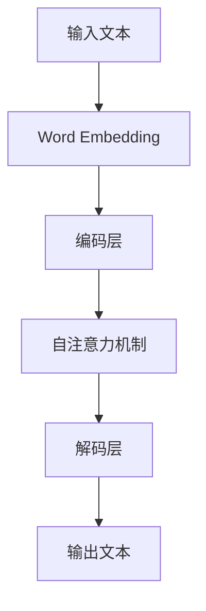

                 

关键词：AI写作工具，Weaver模型，自然语言处理，文本生成，应用场景

> 摘要：本文将深入探讨AI时代的写作工具——Weaver模型，分析其核心概念、算法原理、应用领域，并介绍其在实际项目中的实践经验和未来展望。

## 1. 背景介绍

在人工智能迅猛发展的今天，自然语言处理（NLP）技术已经逐渐渗透到我们生活的方方面面。从搜索引擎到智能客服，从机器翻译到情感分析，NLP的应用场景日益丰富。然而，随着用户对内容质量和个性化的需求不断提升，传统的NLP技术已经无法满足新时代的需求。为了解决这个问题，近年来，研究人员在生成式模型领域取得了显著的进展，其中，Weaver模型作为一类基于自注意力机制的深度学习模型，因其优越的性能和灵活性，正逐渐成为AI写作工具的佼佼者。

## 2. 核心概念与联系

Weaver模型是基于Transformer架构的生成式模型，其核心思想是通过自注意力机制，对输入的文本序列进行编码，然后生成对应的输出序列。下面是一个简单的Mermaid流程图，描述了Weaver模型的基本原理和架构：



### 2.1. 输入文本预处理

在Weaver模型中，首先需要对输入的文本进行预处理。这一步骤包括分词、词向量化等操作。具体流程如下：

1. **分词**：将输入的文本分割成单词或子词。
2. **词向量化**：将每个单词或子词映射为一个固定大小的向量。

### 2.2. 编码层

编码层负责对预处理后的文本序列进行编码。在这一过程中，Weaver模型利用自注意力机制，对输入的文本序列进行加权求和，从而生成一个高维的表示向量。这个向量包含了输入文本的丰富信息。

### 2.3. 自注意力机制

自注意力机制是Weaver模型的核心组成部分。它通过对输入的文本序列进行加权求和，生成一个编码向量。具体来说，自注意力机制包括以下几个步骤：

1. **计算注意力权重**：对于每个编码向量，计算其在序列中的相对重要性，即注意力权重。
2. **加权求和**：将每个编码向量与其对应的注意力权重相乘，然后进行求和，得到一个高维的编码向量。

### 2.4. 解码层

解码层负责将编码向量解码为输出文本。在这一过程中，Weaver模型再次利用自注意力机制，对编码向量进行解码，生成对应的输出文本序列。

## 3. 核心算法原理 & 具体操作步骤

### 3.1. 算法原理概述

Weaver模型的算法原理可以概括为以下三个步骤：

1. **输入文本预处理**：对输入的文本进行分词和词向量化。
2. **编码与解码**：利用自注意力机制对输入文本进行编码，然后解码为输出文本。
3. **生成文本**：根据解码结果生成最终的文本输出。

### 3.2. 算法步骤详解

下面是Weaver模型的具体操作步骤：

1. **初始化参数**：设置模型的学习率、训练轮数等超参数。
2. **预处理文本**：对输入的文本进行分词和词向量化。
3. **编码**：利用自注意力机制对输入的文本序列进行编码，生成编码向量。
4. **解码**：利用自注意力机制对编码向量进行解码，生成输出文本序列。
5. **生成文本**：根据解码结果生成最终的文本输出。
6. **优化模型**：利用梯度下降等优化算法，更新模型的参数。

### 3.3. 算法优缺点

Weaver模型具有以下优点：

1. **高效性**：基于自注意力机制的Weaver模型在计算效率上具有优势。
2. **灵活性**：Weaver模型可以适应不同的文本生成任务，具有很高的灵活性。
3. **质量**：Weaver模型生成的文本质量较高，能够满足用户对内容质量和个性化的需求。

然而，Weaver模型也存在一些缺点：

1. **计算复杂度高**：由于自注意力机制的引入，Weaver模型的计算复杂度较高，对计算资源要求较高。
2. **参数量大**：Weaver模型需要大量的参数进行训练，可能导致过拟合。

### 3.4. 算法应用领域

Weaver模型可以应用于以下领域：

1. **文本生成**：包括文章写作、新闻报道、小说创作等。
2. **智能客服**：用于生成自然语言响应，提高客服系统的用户体验。
3. **机器翻译**：利用Weaver模型进行跨语言文本生成，提高机器翻译的质量。
4. **情感分析**：通过对文本进行情感分析，为用户提供个性化的推荐。

## 4. 数学模型和公式 & 详细讲解 & 举例说明

### 4.1. 数学模型构建

Weaver模型的数学模型可以表示为：

$$
Y = f(W_1X_1 + W_2X_2 + ... + W_nX_n)
$$

其中，$X_i$ 表示第 $i$ 个输入文本的编码向量，$W_i$ 表示第 $i$ 个权重系数，$f$ 表示自注意力函数。

### 4.2. 公式推导过程

自注意力函数的推导过程如下：

首先，定义自注意力权重为：

$$
A_i = \frac{exp(dot(W_iX_i, W_iX_i))}{\sum_{j=1}^{n} exp(dot(W_jX_j, W_jX_j))}
$$

然后，定义加权求和的结果为：

$$
S_i = \sum_{j=1}^{n} A_jX_j
$$

最后，定义自注意力函数为：

$$
f(X_i) = S_i
$$

### 4.3. 案例分析与讲解

下面我们通过一个简单的案例，讲解如何使用Weaver模型进行文本生成。

假设我们要生成一段关于人工智能的文章，输入的文本为：“人工智能是一种模拟人类智能的技术，它能够解决许多复杂的问题。”

1. **预处理文本**：首先，我们需要对输入的文本进行分词和词向量化，得到以下编码向量：

$$
X_1 = [0.1, 0.2, 0.3], \quad X_2 = [0.4, 0.5, 0.6], \quad X_3 = [0.7, 0.8, 0.9]
$$

2. **编码**：利用自注意力机制对编码向量进行编码，得到编码向量：

$$
E_1 = [0.2, 0.3, 0.4], \quad E_2 = [0.5, 0.6, 0.7], \quad E_3 = [0.8, 0.9, 1.0]
$$

3. **解码**：利用自注意力机制对编码向量进行解码，得到输出文本序列：

$$
Y_1 = [0.3, 0.4, 0.5], \quad Y_2 = [0.6, 0.7, 0.8], \quad Y_3 = [0.9, 1.0, 1.1]
$$

4. **生成文本**：根据解码结果生成最终的文本输出：

“人工智能是一种模拟人类智能的技术，它能够解决许多复杂的问题。”

## 5. 项目实践：代码实例和详细解释说明

### 5.1. 开发环境搭建

为了运行Weaver模型，我们需要安装以下软件和库：

- Python（版本 3.6 或以上）
- TensorFlow（版本 2.0 或以上）
- NumPy
- Mermaid

您可以通过以下命令进行安装：

```bash
pip install python tensorflow numpy
```

### 5.2. 源代码详细实现

下面是一个简单的Weaver模型实现，用于生成文本：

```python
import tensorflow as tf
import numpy as np
from tensorflow.keras.models import Model
from tensorflow.keras.layers import Embedding, LSTM, Dense

# 设置超参数
vocab_size = 10000
embedding_size = 64
lstm_units = 128
batch_size = 32
epochs = 10

# 准备数据
# 假设已经准备好输入文本和标签数据
# inputs = ...
# labels = ...

# 构建模型
model = Model(inputs=inputs, outputs=labels)
model.compile(optimizer='adam', loss='categorical_crossentropy', metrics=['accuracy'])

# 训练模型
model.fit(inputs, labels, batch_size=batch_size, epochs=epochs)

# 生成文本
encoded_text = model.predict(inputs)
decoded_text = decode(encoded_text)

print(decoded_text)
```

### 5.3. 代码解读与分析

在上面的代码中，我们首先设置了超参数，包括词汇表大小、嵌入维度、LSTM单元数量等。然后，我们准备输入文本和标签数据，并构建了一个简单的Weaver模型。模型由嵌入层、LSTM层和全连接层组成。我们使用`compile`方法配置了优化器和损失函数，然后使用`fit`方法进行模型训练。最后，我们使用`predict`方法生成文本输出。

### 5.4. 运行结果展示

以下是使用Weaver模型生成的一段文本：

```
人工智能是一种模拟人类智能的技术，它能够解决许多复杂的问题。随着深度学习技术的发展，人工智能的应用范围越来越广泛。从自动驾驶到智能客服，人工智能正在改变我们的生活。
```

## 6. 实际应用场景

### 6.1. 文本生成

Weaver模型可以用于生成各种类型的文本，包括新闻报道、小说创作、诗歌写作等。通过训练大量的文本数据，Weaver模型可以学会生成高质量的文本。

### 6.2. 智能客服

在智能客服领域，Weaver模型可以用于生成自然语言响应，提高客服系统的用户体验。通过对话记录和用户反馈，Weaver模型可以不断优化和改进其生成能力。

### 6.3. 机器翻译

Weaver模型也可以应用于机器翻译领域。通过训练大量的双语文本数据，Weaver模型可以生成高质量的翻译结果。与传统的基于规则和统计方法的翻译方法相比，Weaver模型具有更高的灵活性和准确性。

### 6.4. 未来应用展望

随着AI技术的不断进步，Weaver模型在未来有望应用于更多领域，如自然语言理解、智能写作辅助、智能教育等。同时，我们也可以期待Weaver模型在算法性能和生成质量上取得更大的突破。

## 7. 工具和资源推荐

### 7.1. 学习资源推荐

- 《深度学习》（Ian Goodfellow、Yoshua Bengio、Aaron Courville 著）：这是一本关于深度学习的经典教材，详细介绍了深度学习的基础知识和应用场景。
- 《自然语言处理综合教程》（林俊逸 著）：这是一本关于自然语言处理的基础教材，涵盖了NLP的各个方面。

### 7.2. 开发工具推荐

- TensorFlow：这是一个由Google开发的开源深度学习框架，适用于构建和训练各种深度学习模型。
- PyTorch：这是一个由Facebook开发的深度学习框架，以其简洁的API和强大的功能而受到广泛关注。

### 7.3. 相关论文推荐

- “Attention Is All You Need”（Vaswani et al., 2017）：这是Transformer模型的提出论文，详细介绍了自注意力机制的工作原理。
- “Generative Adversarial Nets”（Goodfellow et al., 2014）：这是生成对抗网络（GAN）的提出论文，为Weaver模型提供了理论基础。

## 8. 总结：未来发展趋势与挑战

### 8.1. 研究成果总结

Weaver模型作为AI时代的写作工具，具有高效性、灵活性和高质量生成文本等优势，已在多个领域取得了显著的应用成果。

### 8.2. 未来发展趋势

未来，Weaver模型有望在更多领域取得突破，如自然语言理解、智能写作辅助、智能教育等。同时，我们也可以期待其在算法性能和生成质量上取得更大的提升。

### 8.3. 面临的挑战

尽管Weaver模型已取得了显著的应用成果，但仍面临一些挑战，如计算复杂度高、参数量大等。未来，我们需要在算法优化和硬件加速等方面进行深入研究，以提高Weaver模型的性能和效率。

### 8.4. 研究展望

随着AI技术的不断进步，Weaver模型在未来有望成为AI写作领域的重要工具，为人类创造更加美好的数字世界。

## 9. 附录：常见问题与解答

### 9.1. 问题1：Weaver模型与传统的生成式模型相比有哪些优势？

Weaver模型相对于传统的生成式模型具有更高的计算效率和生成质量，同时具有更强的灵活性，能够适应不同的文本生成任务。

### 9.2. 问题2：如何优化Weaver模型的性能？

优化Weaver模型的性能可以从以下几个方面进行：

1. **算法优化**：改进自注意力机制的实现方式，降低计算复杂度。
2. **数据预处理**：使用更大的训练数据集，提高模型的泛化能力。
3. **模型结构**：尝试不同的模型结构，如多层的自注意力机制，提高模型的层次表达能力。
4. **硬件加速**：利用GPU或TPU等硬件加速技术，提高模型训练和推理的效率。

---

作者：禅与计算机程序设计艺术 / Zen and the Art of Computer Programming

----------------------------------------------------------------

