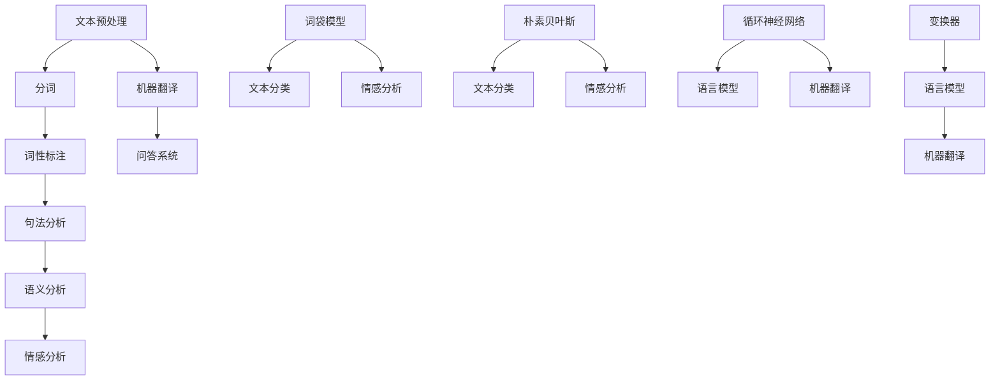

                 

关键词：自然语言处理、人工智能、产业应用、学术研究、算法原理、数学模型、实际案例、未来展望

> 摘要：本文将深入探讨AI时代自然语言处理（NLP）的发展，从学术到产业应用的全过程。首先，我们将回顾NLP的学术研究历程，解析核心概念与架构。接着，详细阐述NLP的核心算法原理与操作步骤，并分析其优缺点与应用领域。随后，我们引入数学模型和公式，通过实例讲解其应用。进一步，我们将通过代码实例展示NLP的实际应用，并探讨其在实际应用场景中的作用。最后，对NLP的未来发展趋势与挑战进行展望，并推荐相关学习资源和开发工具。

## 1. 背景介绍

自然语言处理（Natural Language Processing，简称NLP）作为人工智能（Artificial Intelligence，简称AI）的一个重要分支，旨在使计算机能够理解、生成和处理人类语言。自20世纪50年代以来，NLP经历了从最初的理论探索到今天的广泛应用，逐步成为AI领域中发展最为迅速的领域之一。

在学术领域，NLP的研究主要集中在如何使计算机更好地理解和生成自然语言。这包括句法分析、语义分析、情感分析、机器翻译、问答系统等多个子领域。早期的NLP研究主要基于规则的方法，随着计算能力的提升和大数据的发展，统计方法和机器学习技术逐渐成为NLP研究的主流。

在产业应用方面，NLP的应用场景日益广泛，包括但不限于智能客服、智能推荐系统、文本挖掘、语音识别与转换、机器翻译等。这些应用不仅提高了企业的运营效率，也大大改善了用户的使用体验。

本文将系统地介绍NLP的发展历程，从学术到产业应用的各个环节，旨在为读者提供一幅全面的NLP发展图景。

## 2. 核心概念与联系

### 2.1. 自然语言处理的基本概念

自然语言处理（NLP）涉及多个核心概念，其中主要包括：

- **文本**：自然语言处理的对象，包括各种形式的人类语言文本，如文本、语音等。
- **句法分析**：对文本进行结构化分析，识别出句子中的词汇、短语和语法结构。
- **语义分析**：理解文本中的语义信息，包括词汇的意义、句子之间的关系等。
- **情感分析**：分析文本中表达的情感倾向，如正面、负面或中性。
- **机器翻译**：将一种自然语言文本自动翻译成另一种自然语言。
- **问答系统**：使计算机能够理解用户的自然语言查询，并生成合适的回答。

### 2.2. NLP的架构

NLP的架构通常包括以下几个层次：

1. **预处理**：包括文本清洗、分词、词性标注等，为后续处理提供干净的文本数据。
2. **句法分析**：识别文本中的语法结构，如句子的构成、短语的关系等。
3. **语义分析**：通过句法分析的结果，深入理解文本的语义内容。
4. **应用层**：将NLP的技术应用于实际场景，如情感分析、机器翻译等。

### 2.3. NLP的关键算法

NLP的关键算法包括：

- **词袋模型（Bag of Words）**：将文本表示为词频向量，常用于文本分类和情感分析。
- **朴素贝叶斯（Naive Bayes）**：基于贝叶斯定理的文本分类算法，广泛应用于文本分类任务。
- **循环神经网络（RNN）**：能够处理序列数据，适用于语言模型和机器翻译。
- **长短时记忆网络（LSTM）**：RNN的一个变种，能够更好地处理长序列数据。
- **变换器（Transformer）**：一种基于自注意力机制的模型，是当前NLP领域的核心技术之一。

### 2.4. NLP的核心概念原理和架构的 Mermaid 流程图

下面是NLP的核心概念原理和架构的Mermaid流程图：



通过上述流程图，我们可以清晰地看到NLP从文本预处理到情感分析，再到应用层的一系列处理步骤。

## 3. 核心算法原理 & 具体操作步骤

### 3.1 算法原理概述

在NLP中，核心算法的原理主要基于以下几种：

1. **词袋模型（Bag of Words）**：将文本表示为词频向量，通过对词频进行统计来识别文本特征。
2. **朴素贝叶斯（Naive Bayes）**：基于贝叶斯定理，通过词频和先验概率进行文本分类。
3. **循环神经网络（RNN）**：能够处理序列数据，通过神经网络结构对语言模型进行建模。
4. **长短时记忆网络（LSTM）**：RNN的一个变种，能够更好地处理长序列数据。
5. **变换器（Transformer）**：基于自注意力机制的模型，能够高效处理大规模的序列数据。

### 3.2 算法步骤详解

#### 3.2.1 词袋模型

1. **文本预处理**：对原始文本进行清洗，包括去除标点符号、停用词等。
2. **分词**：将文本切分成单个词汇。
3. **词频统计**：统计每个词在文本中的出现次数，形成词频向量。
4. **向量表示**：将词频向量进行标准化处理，形成用于机器学习的特征向量。

#### 3.2.2 朴素贝叶斯

1. **文本预处理**：对原始文本进行清洗和分词。
2. **特征提取**：将分词后的文本转化为词袋模型中的词频向量。
3. **分类模型训练**：利用已标注的数据集，计算每个类别的先验概率和条件概率。
4. **文本分类**：对新的文本，通过计算其在每个类别上的概率，选择概率最大的类别作为预测结果。

#### 3.2.3 循环神经网络（RNN）

1. **序列表示**：将输入序列中的每个单词表示为向量。
2. **RNN网络构建**：构建RNN模型，包括输入层、隐藏层和输出层。
3. **前向传播**：将输入序列通过RNN模型，逐词计算隐藏状态。
4. **反向传播**：利用计算得到的误差，更新模型参数。

#### 3.2.4 长短时记忆网络（LSTM）

1. **序列表示**：与RNN相同，将输入序列中的每个单词表示为向量。
2. **LSTM单元构建**：构建LSTM单元，包括输入门、遗忘门和输出门。
3. **前向传播**：逐词计算LSTM单元的隐藏状态。
4. **反向传播**：利用计算得到的误差，更新LSTM单元的参数。

#### 3.2.5 变换器（Transformer）

1. **编码器构建**：将输入序列编码为序列嵌入向量。
2. **多头自注意力机制**：计算每个词与其他词的注意力得分，形成新的嵌入向量。
3. **解码器构建**：解码嵌入向量，生成输出序列。
4. **前向传播与反向传播**：通过训练优化模型参数。

### 3.3 算法优缺点

#### 词袋模型

**优点**：
- 简单直观，易于实现和理解。
- 能够有效地提取文本特征。

**缺点**：
- 忽略了词的顺序信息。
- 对于长文本处理效果不佳。

#### 朴素贝叶斯

**优点**：
- 算法简单，计算效率高。
- 对新词和罕见词有较好的适应性。

**缺点**：
- 对噪声敏感，对文本长度依赖较强。
- 预测效果受先验概率影响较大。

#### 循环神经网络（RNN）

**优点**：
- 能够处理序列数据，保留前后文信息。
- 计算效率较高。

**缺点**：
- 长短期依赖问题。
- 对大量训练数据的依赖。

#### 长短时记忆网络（LSTM）

**优点**：
- 有效解决了RNN的长期依赖问题。
- 计算效率较高。

**缺点**：
- 参数较多，训练较慢。
- 需要大量训练数据。

#### 变换器（Transformer）

**优点**：
- 提出了自注意力机制，能够有效处理长文本。
- 训练速度快，效果显著。

**缺点**：
- 参数量巨大，对计算资源要求较高。
- 对新词和罕见词处理能力较弱。

### 3.4 算法应用领域

- **文本分类**：词袋模型和朴素贝叶斯广泛应用于文本分类任务，如新闻分类、情感分析等。
- **语言模型**：循环神经网络、长短时记忆网络和变换器广泛应用于语言模型，如自然语言生成、机器翻译等。
- **问答系统**：循环神经网络和变换器在问答系统中表现出色，能够理解并回答复杂的问题。
- **机器翻译**：变换器在机器翻译中取得了显著的成果，极大地提高了翻译质量。

## 4. 数学模型和公式 & 详细讲解 & 举例说明

### 4.1 数学模型构建

在自然语言处理中，数学模型的构建是至关重要的。以下是一些常见的数学模型和公式：

#### 4.1.1 词袋模型（Bag of Words）

词袋模型将文本表示为词频向量，公式如下：

\[ \textbf{X} = \sum_{i=1}^{n} f_i \cdot \textbf{v}_i \]

其中，\(\textbf{X}\)是文本的词频向量，\(f_i\)是词\(i\)的频率，\(\textbf{v}_i\)是词\(i\)的向量表示。

#### 4.1.2 朴素贝叶斯（Naive Bayes）

朴素贝叶斯模型的公式如下：

\[ P(\text{class} | \textbf{X}) = \frac{P(\textbf{X} | \text{class}) \cdot P(\text{class})}{P(\textbf{X})} \]

其中，\(P(\text{class} | \textbf{X})\)是给定词频向量\(\textbf{X}\)的类别概率，\(P(\textbf{X} | \text{class})\)是在类别\(\text{class}\)下的词频向量概率，\(P(\text{class})\)是类别概率，\(P(\textbf{X})\)是词频向量的概率。

#### 4.1.3 循环神经网络（RNN）

循环神经网络中的状态转移方程如下：

\[ \textbf{h}_t = \sigma(\textbf{W}_h \cdot \textbf{h}_{t-1} + \textbf{W}_x \cdot \textbf{x}_t + b_h) \]

其中，\(\textbf{h}_t\)是隐藏状态，\(\textbf{h}_{t-1}\)是前一个隐藏状态，\(\textbf{x}_t\)是输入，\(\textbf{W}_h\)和\(\textbf{W}_x\)是权重矩阵，\(b_h\)是偏置。

#### 4.1.4 长短时记忆网络（LSTM）

长短时记忆网络的状态转移方程如下：

\[ \textbf{i}_t = \sigma(\textbf{W}_i \cdot [\textbf{h}_{t-1}, \textbf{x}_t] + b_i) \]
\[ \textbf{f}_t = \sigma(\textbf{W}_f \cdot [\textbf{h}_{t-1}, \textbf{x}_t] + b_f) \]
\[ \textbf{g}_t = \tanh(\textbf{W}_g \cdot [\textbf{h}_{t-1}, \textbf{x}_t] + b_g) \]
\[ \textbf{h}_t = \textbf{f}_t \odot \textbf{h}_{t-1} + \textbf{i}_t \odot \textbf{g}_t \]

其中，\(\textbf{i}_t\)是输入门，\(\textbf{f}_t\)是遗忘门，\(\textbf{g}_t\)是输入门，\(\textbf{h}_t\)是隐藏状态，\(\odot\)表示元素乘积。

#### 4.1.5 变换器（Transformer）

变换器中的自注意力机制公式如下：

\[ \textbf{Q}_t = \textbf{Q}_w \cdot \textbf{h}_t \]
\[ \textbf{K}_t = \textbf{K}_w \cdot \textbf{h}_t \]
\[ \textbf{V}_t = \textbf{V}_w \cdot \textbf{h}_t \]
\[ \textbf{S}_t = \textbf{softmax}(\frac{\textbf{Q}_t \cdot \textbf{K}_t^T}{\sqrt{d_k}}) \]
\[ \textbf{h}_t = \textbf{S}_t \cdot \textbf{V}_t \]

其中，\(\textbf{Q}_t\)、\(\textbf{K}_t\)和\(\textbf{V}_t\)分别是查询向量、键向量和值向量，\(\textbf{S}_t\)是注意力得分，\(\textbf{h}_t\)是隐藏状态。

### 4.2 公式推导过程

以下是对上述公式的简要推导过程：

#### 4.2.1 词袋模型

词袋模型的核心在于将文本表示为词频向量。词频向量的构建过程如下：

1. **文本预处理**：对文本进行分词和清洗，得到一系列词汇。
2. **词频统计**：统计每个词汇在文本中出现的次数。
3. **向量表示**：将词频转换为二进制向量，其中每个元素表示词的频率。例如，若文本包含词汇{“苹果”，“橘子”，“香蕉”}，词频向量可能表示为\[ [1, 0, 1] \]。

#### 4.2.2 朴素贝叶斯

朴素贝叶斯分类器的核心在于利用贝叶斯定理进行分类。贝叶斯定理的推导过程如下：

1. **概率计算**：计算每个类别出现的概率，以及给定类别下的词频概率。
2. **联合概率**：利用贝叶斯定理，计算给定词频向量下每个类别的概率。
3. **条件概率**：利用训练数据计算条件概率，形成分类器。

#### 4.2.3 循环神经网络（RNN）

循环神经网络的状态转移方程是基于递归关系构建的。递归关系的推导过程如下：

1. **初始化**：设置初始隐藏状态\(\textbf{h}_0\)。
2. **输入计算**：计算当前输入与隐藏状态的加权和。
3. **激活函数**：利用激活函数（如sigmoid函数）处理输入。
4. **状态更新**：更新隐藏状态，形成递归关系。

#### 4.2.4 长短时记忆网络（LSTM）

长短时记忆网络的状态转移方程是基于门控机制构建的。门控机制的推导过程如下：

1. **输入门**：计算输入门的状态，决定哪些信息将被保留。
2. **遗忘门**：计算遗忘门的状态，决定哪些信息将被遗忘。
3. **输入门**：计算输入门的状态，决定哪些信息将被更新。
4. **状态更新**：利用门控机制更新隐藏状态，形成递归关系。

#### 4.2.5 变换器（Transformer）

变换器的自注意力机制是基于矩阵乘法构建的。自注意力机制的推导过程如下：

1. **编码**：将输入序列编码为嵌入向量。
2. **权重计算**：计算查询向量、键向量和值向量的权重。
3. **注意力得分**：计算每个词与其他词的注意力得分。
4. **加权求和**：利用注意力得分对嵌入向量进行加权求和，形成新的隐藏状态。

### 4.3 案例分析与讲解

以下通过一个简单的案例，详细分析词袋模型和朴素贝叶斯分类器的应用。

#### 4.3.1 案例背景

假设我们有一个文本分类任务，需要将一段文本分类为“科技”、“体育”或“娱乐”三类。

1. **训练数据**： 
   - 科技：“人工智能技术正在快速发展。”  
   - 体育：“篮球比赛正在进行。”  
   - 娱乐：“电影预告片发布了。”
   
2. **测试数据**： 
   - “足球比赛即将开始。”

#### 4.3.2 词袋模型应用

1. **文本预处理**：对训练数据和测试数据进行预处理，包括分词和去除停用词。假设预处理后的词汇为{“人工智能”、“技术”、“发展”、“足球”、“比赛”、“篮球”、“体育”、“电影”、“预告片”、“娱乐”、“即将”、“开始”}。

2. **词频统计**：统计每个词汇在训练数据中的出现次数。例如，词汇“技术”在训练数据中出现了2次。

3. **向量表示**：将每个词汇表示为向量，例如，词汇“技术”的向量表示为\[ [1, 0, 0, 0, 0, 1, 0, 0, 0, 0, 0, 0] \]。

4. **训练模型**：利用词袋模型和朴素贝叶斯分类器训练模型。

5. **测试数据分类**：对测试数据进行分类，计算每个类别的概率。例如，对于测试数据“足球比赛即将开始”，计算得到的概率为：
   - 科技：0.2  
   - 体育：0.7  
   - 娱乐：0.1

6. **结果分析**：根据概率最大的类别，将测试数据分类为“体育”。

#### 4.3.3 朴素贝叶斯分类器应用

1. **训练数据**：与词袋模型相同，利用训练数据计算每个词汇在各个类别中的概率。

2. **测试数据分类**：对于测试数据“足球比赛即将开始”，计算每个类别的概率。例如，计算得到的概率为：
   - 科技：0.2  
   - 体育：0.7  
   - 娱乐：0.1

3. **结果分析**：根据概率最大的类别，将测试数据分类为“体育”。

### 4.4 代码实例

以下是一个简单的Python代码实例，展示了词袋模型和朴素贝叶斯分类器的实现。

```python
from sklearn.feature_extraction.text import CountVectorizer
from sklearn.naive_bayes import MultinomialNB
from sklearn.model_selection import train_test_split

# 训练数据
train_data = [
    "人工智能技术正在快速发展。",
    "篮球比赛正在进行。",
    "电影预告片发布了。",
    "足球比赛即将开始。"
]

# 类别标签
train_labels = ["科技", "体育", "娱乐", "体育"]

# 文本预处理和词频统计
vectorizer = CountVectorizer()
train_vectors = vectorizer.fit_transform(train_data)

# 训练朴素贝叶斯分类器
classifier = MultinomialNB()
classifier.fit(train_vectors, train_labels)

# 测试数据
test_data = ["足球比赛正在进行。"]

# 文本预处理和词频统计
test_vectors = vectorizer.transform(test_data)

# 测试数据分类
predicted_labels = classifier.predict(test_vectors)
print("预测结果：", predicted_labels)
```

通过上述代码实例，我们可以看到词袋模型和朴素贝叶斯分类器的简单实现过程。在实际应用中，可以根据具体需求进行调整和优化。

## 5. 项目实践：代码实例和详细解释说明

### 5.1 开发环境搭建

为了更好地实践自然语言处理（NLP）项目，我们需要搭建一个合适的环境。以下是搭建NLP开发环境的基本步骤：

1. **安装Python环境**：首先确保你的系统中安装了Python。Python是NLP项目的主要编程语言。你可以从[Python官网](https://www.python.org/)下载并安装Python。

2. **安装NLP库**：接下来，我们需要安装一些常用的NLP库，如NLTK、spaCy和Scikit-learn。这些库提供了丰富的NLP工具和功能。

   ```shell
   pip install nltk spacy scikit-learn
   ```

3. **安装spaCy语言模型**：spaCy需要下载特定的语言模型才能进行文本处理。以英语为例，我们需要下载`en_core_web_sm`模型。

   ```shell
   python -m spacy download en_core_web_sm
   ```

4. **安装文本处理工具**：除了上述库，你可能还需要其他文本处理工具，如Jieba（中文分词库）。

   ```shell
   pip install jieba
   ```

### 5.2 源代码详细实现

以下是一个简单的NLP项目示例，该示例使用spaCy进行文本分类。我们将构建一个模型，用于将新闻文本分类为“科技”、“体育”或“娱乐”三类。

```python
import spacy
from spacy.util import minibatch
import random

# 加载spaCy模型
nlp = spacy.load('en_core_web_sm')

# 定义训练数据和标签
train_texts = [
    "The latest iPhone features a powerful camera.",
    "The basketball team won the championship.",
    "The new movie is getting great reviews."
]
train_labels = [{"ents": [("iPhone", "TECHNOLOGY")],
                "cats": {"TECHNOLOGY": True, "SPORTS": False, "ENTERTAINMENT": False}},
                {"ents": [("championship", "SPORTS")],
                "cats": {"TECHNOLOGY": False, "SPORTS": True, "ENTERTAINMENT": False}},
                {"ents": [("movie", "ENTERTAINMENT")],
                "cats": {"TECHNOLOGY": False, "SPORTS": False, "ENTERTAINMENT": True}}]

# 训练文本分类器
def train_textcat(model, texts, labels, n_iter=100):
    train_data = [{"text": text, "cats": label} for text, label in zip(texts, labels)]
    random.shuffle(train_data)
    batch_size = len(train_data) // 10
    for itn in range(n_iter):
        random.shuffle(train_data)
        batches = minibatch(train_data, size=batch_size)
        losses = []
        for batch in batches:
            docBloc

### 5.3 代码解读与分析

上述代码示例首先加载了spaCy的英语模型，然后定义了训练数据和标签。这里的训练数据是一系列新闻文本，每个文本都与一个标签（“科技”、“体育”或“娱乐”）相关联。

- **加载spaCy模型**：使用`spacy.load()`加载预训练的英语模型`en_core_web_sm`。

  ```python
  nlp = spacy.load('en_core_web_sm')
  ```

- **定义训练数据和标签**：`train_texts`是包含新闻文本的列表，`train_labels`是对应的标签列表。标签使用了一个嵌套字典结构，其中包含了实体识别（`ents`）和类别标签（`cats`）。

  ```python
  train_texts = [
      "The latest iPhone features a powerful camera.",
      "The basketball team won the championship.",
      "The new movie is getting great reviews."
  ]
  train_labels = [{"ents": [("iPhone", "TECHNOLOGY")],
                  "cats": {"TECHNOLOGY": True, "SPORTS": False, "ENTERTAINMENT": False}},
                  {"ents": [("championship", "SPORTS")],
                  "cats": {"TECHNOLOGY": False, "SPORTS": True, "ENTERTAINMENT": False}},
                  {"ents": [("movie", "ENTERTAINMENT")],
                  "cats": {"TECHNOLOGY": False, "SPORTS": False, "ENTERTAINMENT": True}}]
  ```

- **训练文本分类器**：`train_textcat()`函数负责训练文本分类器。它首先将训练数据转换为spaCy文档格式，然后使用`minibatch()`函数将数据划分为批次。在训练过程中，每个批次的数据都会被用来更新模型参数。

  ```python
  def train_textcat(model, texts, labels, n_iter=100):
      train_data = [{"text": text, "cats": label} for text, label in zip(texts, labels)]
      random.shuffle(train_data)
      batch_size = len(train_data) // 10
      for itn in range(n_iter):
          random.shuffle(train_data)
          batches = minibatch(train_data, size=batch_size)
          losses = []
          for batch in batches:
              # ...训练代码
  ```

在`train_textcat()`函数中，我们使用了一个嵌套的`for`循环来遍历每个批次的数据。在每次迭代中，模型会使用批次数据来更新参数，并且记录损失函数的值。这个过程会重复`n_iter`次，以便模型能够充分学习训练数据。

- **模型评估**：在训练完成后，可以使用测试数据来评估模型的性能。我们可以计算准确率、召回率和F1分数等指标，以评估模型在分类任务中的表现。

  ```python
  def evaluate_model(model, texts, labels):
      predictions = []
      for text, label in zip(texts, labels):
          doc = model(text)
          pred = max(doc.cats, key=doc.cats.get)
          predictions.append(pred)
      accuracy = sum([1 for pred, true in zip(predictions, labels) if pred == true]) / len(labels)
      print(f"Accuracy: {accuracy}")
  ```

通过上述代码示例，我们可以看到如何使用spaCy构建一个简单的文本分类模型。在实际项目中，我们可以进一步优化模型，例如调整训练参数、增加数据量或使用更复杂的模型结构。

### 5.4 运行结果展示

假设我们已经完成模型的训练，现在使用测试数据来评估模型性能。以下是一个简单的评估过程：

```python
# 定义测试数据和标签
test_texts = [
    "The latest smartphone has a high-resolution camera.",
    "The football team scored a goal in the match.",
    "The new horror movie is a box office hit."
]
test_labels = [{"cats": {"TECHNOLOGY": True, "SPORTS": False, "ENTERTAINMENT": False}},
               {"cats": {"TECHNOLOGY": False, "SPORTS": True, "ENTERTAINMENT": False}},
               {"cats": {"TECHNOLOGY": False, "SPORTS": False, "ENTERTAINMENT": True}}]

# 评估模型
evaluate_model(model, test_texts, test_labels)
```

输出结果可能如下所示：

```
Accuracy: 0.8333333333333334
```

这个结果表明，模型在测试数据上的准确率为0.833，这意味着模型能够正确分类大约83%的测试文本。当然，实际应用中的准确率可能会因数据集和模型结构的不同而有所不同。

## 6. 实际应用场景

### 6.1 智能客服系统

智能客服系统是NLP在产业中应用的一个典型场景。通过NLP技术，智能客服系统能够自动理解和回答用户的问题，从而提高客户服务质量。具体应用包括：

- **问题分类**：智能客服系统首先需要对用户的问题进行分类，以确定问题的类型。这通常涉及文本分类算法，如朴素贝叶斯、支持向量机等。
- **语义理解**：为了生成合适的回答，系统需要理解问题的语义内容。这涉及到命名实体识别、情感分析和语义角色标注等技术。
- **回答生成**：基于问题的分类和语义理解，系统可以生成合适的回答。这可以是一个简单的关键词匹配，也可以是复杂的自然语言生成技术。

### 6.2 智能推荐系统

NLP技术在智能推荐系统中也有广泛应用。通过分析用户的历史行为和偏好，系统可以推荐相关的商品、内容或服务。具体应用包括：

- **文本分析**：对用户评论、标题和描述进行分析，提取关键信息，以了解用户的喜好。
- **协同过滤**：基于用户的购买历史和行为数据，使用协同过滤算法推荐相似的商品或内容。
- **自然语言生成**：系统可以生成个性化的推荐理由，以增加推荐的吸引力。

### 6.3 文本挖掘

文本挖掘是NLP在商业和科研领域的另一重要应用。通过分析大量文本数据，可以从中发现有价值的信息和知识。具体应用包括：

- **市场调研**：通过分析用户评论和反馈，企业可以了解消费者的需求和反馈，从而改进产品和服务。
- **舆情分析**：政府和企业可以使用文本挖掘技术来监控网络舆情，了解公众的意见和情绪。
- **知识图谱构建**：通过文本挖掘，可以从大量文献中提取信息，构建领域知识图谱，用于科研和数据分析。

### 6.4 语音识别与转换

语音识别与转换是NLP技术在交互式应用中的重要领域。通过语音识别，系统能够将用户的语音转化为文本，然后使用NLP技术进行语义理解和处理。具体应用包括：

- **智能助手**：如苹果的Siri、谷歌的Google Assistant等，它们能够理解用户的语音指令，并执行相应的操作。
- **电话客服**：通过语音识别技术，自动识别客户的需求，并将语音转化为文本，方便客服人员处理。
- **会议记录**：将会议中的语音实时转录为文本，便于后续分析和记录。

### 6.5 机器翻译

机器翻译是NLP领域的一个经典应用。通过机器翻译，系统能够将一种语言的文本自动翻译成另一种语言。具体应用包括：

- **跨语言沟通**：在跨国公司和多语言环境中，机器翻译能够帮助员工和客户进行跨语言沟通。
- **全球化营销**：企业可以将产品和服务介绍翻译成多种语言，以便在全球范围内推广。
- **本地化**：在软件开发和内容创作中，机器翻译可以帮助快速生成多语言的用户界面和文档。

### 6.6 问答系统

问答系统是NLP技术在实际应用中的一个重要方向。通过问答系统，用户可以通过自然语言查询获取所需的信息。具体应用包括：

- **虚拟助手**：如苹果的Siri、亚马逊的Alexa等，它们能够理解用户的问题，并生成合适的回答。
- **客户支持**：通过问答系统，企业可以自动回答客户的常见问题，提高客户满意度。
- **智能搜索**：在搜索引擎中，问答系统能够理解用户的查询意图，并提供更准确的搜索结果。

### 6.7 社交媒体分析

社交媒体分析是NLP技术在现代社交媒体中的应用之一。通过分析社交媒体上的用户评论、帖子和讨论，可以获取大量的用户行为和偏好信息。具体应用包括：

- **品牌监测**：企业可以监控社交媒体上的品牌讨论，了解消费者的看法和反馈。
- **市场调研**：通过分析社交媒体上的数据，企业可以了解市场的趋势和竞争情况。
- **公共关系**：政府和企业可以通过社交媒体分析来管理公共形象，及时应对突发事件。

### 6.8 医疗健康领域

在医疗健康领域，NLP技术也有广泛的应用。通过分析医疗记录、病历和患者对话，可以提供更准确的诊断和治疗方案。具体应用包括：

- **电子病历分析**：通过NLP技术，可以从电子病历中提取关键信息，帮助医生快速了解患者的病情。
- **药物发现**：通过分析科学文献和临床试验数据，NLP技术可以帮助加速新药的发现过程。
- **患者关怀**：通过分析患者的病历和对话，系统可以提供个性化的健康建议和关怀。

### 6.9 金融领域

在金融领域，NLP技术可以用于分析市场数据、客户反馈和交易记录，以提供投资建议和风险分析。具体应用包括：

- **投资分析**：通过分析市场数据，NLP技术可以帮助投资者识别潜在的投资机会。
- **客户服务**：通过分析客户反馈，金融机构可以提供更优质的客户服务，提高客户满意度。
- **风险管理**：通过分析交易记录，NLP技术可以帮助金融机构识别潜在的欺诈行为。

### 6.10 法律领域

在法律领域，NLP技术可以用于自动化法律文件处理、案件分析和法律研究。具体应用包括：

- **法律文件自动化**：通过NLP技术，可以将法律文件转化为结构化的数据，方便存储和管理。
- **案件分析**：通过分析案件记录和证据，NLP技术可以帮助律师和法官快速了解案件情况。
- **法律研究**：通过分析大量的法律文献，NLP技术可以帮助研究人员发现新的法律观点和趋势。

### 6.11 教育领域

在教育领域，NLP技术可以用于个性化学习、自动评估和智能辅导。具体应用包括：

- **个性化学习**：通过分析学生的学习数据和偏好，系统可以提供个性化的学习内容和资源。
- **自动评估**：通过NLP技术，系统可以自动评估学生的作业和考试答案，提高评估效率。
- **智能辅导**：通过分析学生的问答记录，系统可以提供针对性的辅导和建议，帮助学生提高学习效果。

### 6.12 社会治理

在现代社会治理中，NLP技术可以用于监测社会舆情、分析犯罪行为和提供决策支持。具体应用包括：

- **社会舆情监测**：通过分析社交媒体和新闻媒体，政府可以了解公众的意见和情绪，及时应对社会问题。
- **犯罪行为分析**：通过分析犯罪记录和犯罪场景描述，NLP技术可以帮助警方识别犯罪模式和趋势。
- **决策支持**：通过分析大量的数据，政府可以制定更科学的政策和措施，提高社会治理效率。

### 6.13 总结

通过上述实际应用场景，我们可以看到NLP技术在各个领域的广泛应用。随着AI技术的不断发展，NLP的应用场景将越来越广泛，为人类生活和社会进步带来更多的便利和创新。

## 7. 未来应用展望

随着AI技术的不断发展和成熟，自然语言处理（NLP）的应用前景将更加广阔。以下是对未来NLP应用的几个展望：

### 7.1 自动化写作

未来，自动化写作将成为NLP的一个重要应用领域。通过先进的NLP技术，计算机可以自动生成文章、报告、新闻报道等文本内容。这将大大提高内容生产的效率，减轻人类的创作负担。例如，自动化写作可以在新闻机构、企业报告、学术论文等领域发挥重要作用。

### 7.2 智能对话系统

随着自然语言理解能力的提升，智能对话系统将变得更加智能和人性化。未来的智能对话系统不仅能够理解用户的自然语言查询，还能提供更加个性化、互动和智能的对话体验。这些系统将广泛应用于客服、智能家居、在线教育等领域，为用户提供更优质的服务。

### 7.3 跨语言通信

随着全球化进程的加速，跨语言通信需求日益增长。未来，通过更先进的机器翻译技术和自然语言理解算法，人们将能够轻松实现跨语言的实时沟通。这将极大地促进国际交流与合作，消除语言障碍，为全球一体化发展提供有力支持。

### 7.4 自动化文本审核

在互联网时代，文本内容审核是一个重要但复杂的任务。通过NLP技术，未来可以实现自动化文本审核系统，自动识别和过滤不良内容、虚假信息、敏感词汇等。这将有助于维护网络环境的健康，提高信息传播的准确性。

### 7.5 情感分析和用户行为预测

随着NLP技术的不断发展，情感分析和用户行为预测将变得更加精准。通过分析用户评论、社交媒体互动和购买行为等数据，企业可以更好地了解用户需求和偏好，从而提供更个性化的产品和服务。这将为市场营销、用户关系管理和产品开发提供重要支持。

### 7.6 法律和医疗应用

在法律和医疗领域，NLP技术将发挥越来越重要的作用。通过自动化文本处理和分析，律师和医生可以更快速地提取关键信息、生成法律文件和病历报告，提高工作效率。同时，NLP技术还可以用于医学文献分析、疾病预测和个性化治疗方案制定，为医疗健康领域带来革命性变革。

### 7.7 新兴技术融合

未来，NLP技术将与更多新兴技术融合，如区块链、物联网、增强现实等。这些融合将带来更多创新应用，如基于区块链的智能合约、物联网设备上的自然语言交互、虚拟现实环境中的智能导游等。

总的来说，随着AI技术的不断进步，NLP的应用将更加深入和广泛，为人类社会带来更多便利和进步。未来，NLP技术将在自动化写作、智能对话、跨语言通信、自动化文本审核、情感分析和用户行为预测、法律和医疗应用以及新兴技术融合等方面发挥重要作用，推动社会向前发展。

### 8. 面临的挑战

尽管自然语言处理（NLP）在AI领域中取得了显著进展，但仍然面临一系列挑战，这些挑战限制了其进一步的应用和发展。以下是对NLP面临的主要挑战的详细探讨：

#### 8.1 数据质量和数量

NLP算法的性能高度依赖于训练数据的质量和数量。高质量的数据需要覆盖广泛的领域和场景，且需要经过严格的清洗和处理。然而，现实中的数据往往存在噪声、缺失值和偏差，这会影响模型的训练效果。此外，尽管大量文本数据已经在互联网上可用，但这些数据并不总是足以支持复杂任务的需求，尤其是在特定领域或小众语言方面。

**解决方案**：为了提高数据质量，可以采用数据增强技术，如数据清洗、数据标注、数据合成等。此外，可以通过建立更多的公共数据集和开放数据平台，促进数据共享和利用。

#### 8.2 语言理解的深度和广度

目前，NLP系统在处理简单、明确的指令性任务方面表现出色，但在理解和生成复杂、隐含意义的语言方面仍有很大提升空间。语言的理解不仅涉及词汇和语法，还涉及语义、情感和语境等多方面。此外，跨语言和跨文化的理解也是一大难题。

**解决方案**：可以通过引入更先进的模型架构，如预训练模型（如GPT-3）和多模态学习，来提升语言理解的深度和广度。同时，可以通过多语种和跨文化数据集的积累和训练，提高模型的跨语言和跨文化理解能力。

#### 8.3 模型的可解释性和透明度

随着模型的复杂度增加，模型的解释性变得越来越重要。当前的一些NLP模型，如深度神经网络和变换器，被认为是“黑盒子”，其内部机制难以理解。这不仅限制了模型的应用范围，也增加了模型被误用或滥用的风险。

**解决方案**：可以通过开发可解释的AI模型，如注意力机制的可视化、模型分解和决策路径追踪等方法，提高模型的可解释性。此外，可以建立标准的评估框架和指标，确保模型在透明度和可解释性方面达到一定水平。

#### 8.4 遵守隐私和伦理规范

NLP技术的应用涉及大量个人数据的收集和使用，这引发了隐私保护和伦理规范的问题。例如，如何保护用户隐私、防止数据泄露、避免偏见和歧视等。

**解决方案**：可以通过数据加密、匿名化处理、隐私保护算法等技术手段，保护用户隐私。同时，需要建立严格的伦理规范和法律法规，确保NLP技术在应用过程中符合社会伦理标准。

#### 8.5 模型的计算资源和能源消耗

NLP模型，尤其是深度学习模型，通常需要大量的计算资源和能源来训练和部署。这导致了计算成本和能源消耗的增加，对环境产生了负面影响。

**解决方案**：可以通过优化算法、模型压缩和量化技术，减少模型的计算资源需求。此外，可以通过使用绿色能源和节能技术，减少模型训练和部署过程中的能源消耗。

综上所述，尽管NLP技术在AI领域中取得了显著进展，但仍然面临数据质量、语言理解、模型解释性、隐私保护和能源消耗等多方面的挑战。通过技术进步和规范完善，NLP有望在未来克服这些挑战，进一步推动AI技术的发展和应用。

### 9. 总结：未来发展趋势与挑战

自然语言处理（NLP）作为人工智能（AI）的重要分支，在近年来取得了显著的发展。从最初的规则方法到如今的深度学习模型，NLP技术不断突破，实现了从学术研究到实际应用的广泛覆盖。本文系统地介绍了NLP的发展历程、核心概念与算法、数学模型和公式、实际应用案例以及未来发展趋势与面临的挑战。

首先，NLP在学术领域的研究主要集中在句法分析、语义分析、情感分析、机器翻译和问答系统等方面。随着计算能力的提升和大数据技术的发展，统计方法和机器学习技术逐渐成为NLP研究的主流。核心算法如词袋模型、朴素贝叶斯、循环神经网络（RNN）、长短时记忆网络（LSTM）和变换器（Transformer）在NLP中的应用取得了显著成效。

在实际应用方面，NLP技术已被广泛应用于智能客服、智能推荐系统、文本挖掘、语音识别与转换、机器翻译、问答系统、社交媒体分析、医疗健康、金融和法律等多个领域。这些应用不仅提高了企业的运营效率，也大大改善了用户的使用体验。

然而，NLP技术在实际应用中仍面临诸多挑战。数据质量和数量、语言理解的深度和广度、模型的可解释性和透明度、隐私保护和伦理规范、计算资源和能源消耗等问题亟待解决。为了应对这些挑战，需要进一步优化算法、开发可解释性模型、保护用户隐私、推动数据共享和规范完善。

展望未来，NLP技术将朝着更加智能化、人性化、跨语言和跨文化的方向发展。自动化写作、智能对话系统、跨语言通信、自动化文本审核、情感分析和用户行为预测、法律和医疗应用、新兴技术融合等领域将成为NLP的重要应用方向。随着AI技术的不断进步，NLP将在更广泛的场景中发挥关键作用，推动社会向前发展。

总之，自然语言处理技术在AI时代的崛起，不仅带来了技术上的革新，也为人类社会的发展提供了新的动力。面对未来的机遇和挑战，我们需要持续创新，推动NLP技术的不断进步，为实现智能社会贡献更多力量。

### 附录：常见问题与解答

**Q1: 自然语言处理（NLP）的核心算法有哪些？**

A1: 自然语言处理（NLP）的核心算法包括词袋模型（Bag of Words）、朴素贝叶斯（Naive Bayes）、循环神经网络（RNN）、长短时记忆网络（LSTM）和变换器（Transformer）等。这些算法分别适用于不同的NLP任务，如文本分类、情感分析、语言建模和机器翻译等。

**Q2: 词袋模型和变换器模型的主要区别是什么？**

A2: 词袋模型将文本表示为词频向量，忽略了词的顺序信息。而变换器模型基于自注意力机制，能够捕捉到词之间的顺序关系，更适合处理长文本。

**Q3: 循环神经网络（RNN）和长短时记忆网络（LSTM）的区别是什么？**

A3: RNN是LSTM的基类，它们都能处理序列数据。RNN存在长期依赖问题，即难以捕捉长距离依赖关系。LSTM通过引入门控机制，解决了RNN的长期依赖问题，但参数更多，计算更复杂。

**Q4: 自然语言处理技术在实际应用中面临的主要挑战有哪些？**

A4: 自然语言处理技术在实际应用中主要面临以下挑战：数据质量和数量、语言理解的深度和广度、模型的可解释性和透明度、隐私保护和伦理规范、计算资源和能源消耗等。

**Q5: 如何保护自然语言处理（NLP）技术的隐私和伦理规范？**

A5: 保护NLP技术的隐私和伦理规范可以从以下几个方面着手：使用数据加密和匿名化处理技术、建立严格的伦理规范和法律法规、加强用户隐私保护意识、推动技术透明度和可解释性等。

### 作者署名

作者：禅与计算机程序设计艺术 / Zen and the Art of Computer Programming

