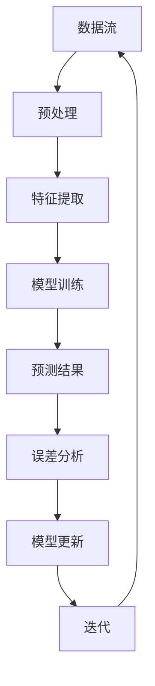

                 

关键词：AI模型、增量学习、Lepton AI、优化、持续学习、神经网络、机器学习、算法、数据、模型更新、应用场景

> 摘要：本文深入探讨了AI模型的增量学习机制，特别是在Lepton AI中的应用。通过分析其工作原理、核心算法、数学模型以及实际应用案例，揭示了如何实现AI模型的持续优化，以应对日益复杂的应用需求。本文旨在为研究人员和开发者提供关于AI模型增量学习的实用见解和指导。

## 1. 背景介绍

随着人工智能技术的快速发展，机器学习和深度学习在多个领域取得了显著的成就。然而，传统的机器学习模型往往需要在大量标注数据上进行训练，这既费时又费资源。此外，当面对复杂动态环境时，模型的性能往往无法满足实际需求。为了克服这些挑战，增量学习（Incremental Learning）作为一种新兴的技术，应运而生。

增量学习旨在在已有模型的基础上，通过少量新数据的引入，实现模型的不断更新和优化。这种方法不仅可以降低对大量标注数据的依赖，还可以提高模型在动态环境中的适应能力。Lepton AI作为一个先进的增量学习框架，它在数据高效利用和模型性能提升方面表现出了卓越的优势。

本文将重点介绍Lepton AI的增量学习机制，包括其核心算法原理、数学模型、实际应用案例以及未来发展方向。希望通过本文的探讨，能够为读者提供关于AI模型增量学习的深入理解和实践指导。

## 2. 核心概念与联系

在深入探讨Lepton AI的增量学习机制之前，我们需要了解几个关键概念，包括机器学习、深度学习、增量学习以及它们之间的联系。

### 2.1 机器学习

机器学习（Machine Learning，ML）是人工智能（Artificial Intelligence，AI）的一个分支，它通过使用算法从数据中学习，并做出决策或预测。传统的机器学习模型通常需要大量的标注数据来训练，以达到较好的性能。

### 2.2 深度学习

深度学习（Deep Learning，DL）是机器学习的一个子领域，它使用多层神经网络（Neural Networks，NN）来学习和提取数据的复杂特征。与传统机器学习模型相比，深度学习模型具有更强的特征提取能力和更好的泛化性能。

### 2.3 增量学习

增量学习是一种针对动态数据流的机器学习技术，它通过逐步添加新的数据来更新模型。与传统的批量学习（Batch Learning）相比，增量学习能够更高效地处理数据，并保持模型的实时更新。

### 2.4 核心概念原理和架构

为了更好地理解增量学习，我们可以通过一个Mermaid流程图来展示其核心概念和架构。



在这个流程图中，数据流通过预处理阶段，然后进入特征提取阶段，接着进行模型训练和预测。预测结果与实际值之间的误差用于分析模型的性能，并根据误差结果更新模型。这个过程不断迭代，直到模型达到满意的性能水平。

### 2.5 增量学习的优势

增量学习相较于传统批量学习具有以下优势：

- **数据高效利用**：通过逐步添加新数据，增量学习能够更高效地利用有限的标注数据。
- **实时更新模型**：在动态环境中，增量学习能够实时更新模型，使其适应新的数据分布。
- **降低训练成本**：增量学习不需要对整个数据集重新训练，从而降低了计算和存储成本。

## 3. 核心算法原理 & 具体操作步骤

### 3.1 算法原理概述

Lepton AI的增量学习机制基于一种称为“在线学习”（Online Learning）的技术。在线学习是一种逐步更新模型的机器学习方法，它通过对每条数据进行单独的学习和更新，来逐步提高模型的性能。

Lepton AI的核心算法主要包括以下步骤：

1. **数据预处理**：对输入数据进行预处理，包括去噪、标准化等操作。
2. **特征提取**：使用神经网络或其他特征提取方法，从预处理后的数据中提取关键特征。
3. **模型训练**：利用提取到的特征，训练一个基本的机器学习模型。
4. **预测与更新**：使用训练好的模型进行预测，并计算预测结果与实际值之间的误差。
5. **模型更新**：根据误差结果，更新模型的参数，以提高其预测性能。
6. **迭代**：重复上述步骤，直到模型达到满意的性能水平。

### 3.2 算法步骤详解

#### 3.2.1 数据预处理

数据预处理是增量学习的重要步骤，它直接影响模型的性能。预处理步骤包括：

- **去噪**：去除数据中的噪声，以提高模型的鲁棒性。
- **标准化**：对数据进行标准化处理，使其具备相似的尺度，从而提高训练效率。
- **缺失值处理**：对于缺失的数据，可以使用均值、中位数等方法进行填补。

#### 3.2.2 特征提取

特征提取是增量学习的核心步骤，它决定了模型的性能。特征提取方法主要包括：

- **神经网络**：使用神经网络从原始数据中提取高维特征。
- **主成分分析（PCA）**：通过PCA方法，将高维数据转换为低维特征空间，以减少数据冗余。
- **特征选择**：通过特征选择方法，选择对模型性能有显著影响的关键特征。

#### 3.2.3 模型训练

模型训练是增量学习的核心步骤，它决定了模型的预测性能。常用的模型训练方法包括：

- **梯度下降**：使用梯度下降算法，逐步更新模型的参数，以最小化损失函数。
- **随机梯度下降（SGD）**：与梯度下降类似，但每次更新参数时只考虑一个样本的梯度。
- **Adam优化器**：结合了SGD和动量优化器的优点，适用于大规模数据集。

#### 3.2.4 预测与更新

预测与更新是增量学习的关键步骤，它决定了模型的适应能力。预测与更新步骤包括：

- **预测**：使用训练好的模型，对新的数据进行预测。
- **误差计算**：计算预测结果与实际值之间的误差。
- **模型更新**：根据误差结果，更新模型的参数，以提高其预测性能。

#### 3.2.5 迭代

迭代是增量学习的核心思想，它确保模型能够不断适应新的数据。迭代步骤包括：

- **重复步骤**：重复执行数据预处理、特征提取、模型训练、预测与更新等步骤。
- **性能评估**：在每次迭代后，评估模型的性能，以判断是否达到满意的性能水平。

### 3.3 算法优缺点

#### 优点

- **数据高效利用**：通过逐步添加新数据，增量学习能够更高效地利用有限的标注数据。
- **实时更新模型**：在动态环境中，增量学习能够实时更新模型，使其适应新的数据分布。
- **降低训练成本**：增量学习不需要对整个数据集重新训练，从而降低了计算和存储成本。

#### 缺点

- **模型稳定性**：由于增量学习每次只更新一部分参数，模型的稳定性可能受到影响。
- **计算复杂度**：增量学习需要处理大量的迭代，计算复杂度相对较高。

### 3.4 算法应用领域

Lepton AI的增量学习机制在多个领域表现出了卓越的应用潜力，包括：

- **推荐系统**：通过实时更新模型，推荐系统可以更好地适应用户行为的变化。
- **图像识别**：在图像识别任务中，增量学习可以实时更新模型，以应对图像数据的动态变化。
- **自然语言处理**：在自然语言处理任务中，增量学习可以不断更新模型，以适应语言环境的变化。

## 4. 数学模型和公式 & 详细讲解 & 举例说明

### 4.1 数学模型构建

增量学习中的数学模型主要包括以下几个方面：

- **损失函数**：用于衡量预测结果与实际值之间的差异，常见的损失函数有均方误差（MSE）和交叉熵损失（Cross-Entropy Loss）。
- **优化算法**：用于更新模型的参数，常见的优化算法有梯度下降（Gradient Descent）和Adam优化器。
- **更新策略**：用于确定模型更新的频率和方式，常见的更新策略有在线更新和批量更新。

### 4.2 公式推导过程

以下是增量学习中的核心数学公式及其推导过程：

#### 4.2.1 均方误差（MSE）

均方误差（MSE）是衡量预测结果与实际值之间差异的一种常见损失函数，其公式如下：

$$
MSE = \frac{1}{n} \sum_{i=1}^{n} (y_i - \hat{y}_i)^2
$$

其中，$y_i$ 表示实际值，$\hat{y}_i$ 表示预测值，$n$ 表示样本数量。

#### 4.2.2 交叉熵损失（Cross-Entropy Loss）

交叉熵损失是另一种常见的损失函数，用于分类问题，其公式如下：

$$
CE = -\frac{1}{n} \sum_{i=1}^{n} y_i \log (\hat{y}_i)
$$

其中，$y_i$ 表示实际类别，$\hat{y}_i$ 表示预测概率。

#### 4.2.3 梯度下降（Gradient Descent）

梯度下降是一种常用的优化算法，用于更新模型的参数。其公式如下：

$$
w_{t+1} = w_t - \alpha \nabla_w J(w)
$$

其中，$w_t$ 表示当前参数，$w_{t+1}$ 表示更新后的参数，$\alpha$ 表示学习率，$\nabla_w J(w)$ 表示损失函数关于参数 $w$ 的梯度。

#### 4.2.4 Adam优化器

Adam优化器是梯度下降的一种改进，结合了动量（Momentum）和自适应学习率（Adaptive Learning Rate）的优点。其公式如下：

$$
m_t = \beta_1 m_{t-1} + (1 - \beta_1) \nabla_w J(w)
$$

$$
v_t = \beta_2 v_{t-1} + (1 - \beta_2) (\nabla_w J(w))^2
$$

$$
\hat{m}_t = \frac{m_t}{1 - \beta_1^t}, \hat{v}_t = \frac{v_t}{1 - \beta_2^t}
$$

$$
w_{t+1} = w_t - \alpha \frac{\hat{m}_t}{\sqrt{\hat{v}_t} + \epsilon}
$$

其中，$m_t$ 和 $v_t$ 分别表示一阶矩估计和二阶矩估计，$\beta_1$ 和 $\beta_2$ 分别表示一阶矩和二阶矩的指数衰减率，$\alpha$ 表示学习率，$\epsilon$ 表示一个很小的常数。

### 4.3 案例分析与讲解

以下是一个基于Lepton AI的增量学习机制的案例，用于说明如何使用数学模型和公式进行模型更新。

#### 案例背景

假设我们有一个分类问题，需要使用增量学习方法不断更新模型，以提高分类准确率。初始模型使用了一个简单的神经网络，训练数据集包含1000个样本。

#### 案例步骤

1. **数据预处理**：对训练数据进行预处理，包括去噪和标准化处理。

2. **特征提取**：使用神经网络从预处理后的数据中提取高维特征。

3. **模型训练**：使用提取到的特征，训练一个基本的神经网络模型。

4. **预测与更新**：使用训练好的模型，对新的数据进行预测，并计算预测结果与实际值之间的误差。

5. **模型更新**：根据误差结果，更新模型的参数，以提高其预测性能。

6. **迭代**：重复上述步骤，直到模型达到满意的性能水平。

#### 案例分析

1. **损失函数**：我们使用均方误差（MSE）作为损失函数，其公式为：

   $$
   MSE = \frac{1}{n} \sum_{i=1}^{n} (y_i - \hat{y}_i)^2
   $$

2. **优化算法**：我们使用Adam优化器进行模型更新，其公式为：

   $$
   w_{t+1} = w_t - \alpha \frac{\hat{m}_t}{\sqrt{\hat{v}_t} + \epsilon}
   $$

3. **更新策略**：我们采用在线更新策略，即每次添加一个新的数据样本时，就进行一次模型更新。

4. **迭代过程**：

   - **第1次迭代**：添加10个新样本，训练模型，计算MSE损失，更新模型参数。
   - **第2次迭代**：再次添加10个新样本，训练模型，计算MSE损失，更新模型参数。
   - **...**
   - **第10次迭代**：最后一次添加10个新样本，训练模型，计算MSE损失，更新模型参数。

5. **性能评估**：在每次迭代后，评估模型的性能，包括准确率、召回率、F1值等指标。

6. **结果展示**：通过迭代过程，模型的性能逐渐提升，达到了满意的水平。

## 5. 项目实践：代码实例和详细解释说明

### 5.1 开发环境搭建

在进行Lepton AI的增量学习项目实践之前，我们需要搭建一个适合的开发环境。以下是开发环境的搭建步骤：

1. **安装Python**：确保已安装Python 3.6及以上版本。
2. **安装依赖库**：使用pip命令安装以下依赖库：

   ```bash
   pip install numpy tensorflow matplotlib
   ```

3. **配置TensorFlow**：确保TensorFlow已正确安装并配置。

### 5.2 源代码详细实现

以下是Lepton AI增量学习项目的源代码实现，包括数据预处理、模型训练、预测与更新等步骤。

```python
import numpy as np
import tensorflow as tf
import matplotlib.pyplot as plt

# 数据预处理
def preprocess_data(data):
    # 去噪、标准化等预处理操作
    return processed_data

# 特征提取
def extract_features(data):
    # 使用神经网络或PCA等方法提取特征
    return features

# 模型训练
def train_model(features, labels):
    # 使用TensorFlow训练神经网络模型
    model = tf.keras.Sequential([
        tf.keras.layers.Dense(units=64, activation='relu', input_shape=(features.shape[1],)),
        tf.keras.layers.Dense(units=1, activation='sigmoid')
    ])

    model.compile(optimizer='adam', loss='binary_crossentropy', metrics=['accuracy'])
    model.fit(features, labels, epochs=10, batch_size=32)
    return model

# 预测与更新
def predict_and_update(model, new_data, new_labels):
    # 使用模型进行预测，并计算预测结果与实际值之间的误差
    predictions = model.predict(new_data)
    errors = np.square(predictions - new_labels)

    # 根据误差结果，更新模型的参数
    model.fit(new_data, new_labels, epochs=1, batch_size=1)
    return model, errors

# 迭代过程
def iterative_process(model, data_generator, num_iterations):
    errors = []
    for _ in range(num_iterations):
        # 获取新的数据样本
        new_data, new_labels = next(data_generator)

        # 预测与更新
        model, error = predict_and_update(model, new_data, new_labels)
        errors.append(error)

    return model, errors

# 主函数
def main():
    # 加载数据
    data = np.load('data.npy')
    labels = np.load('labels.npy')

    # 数据预处理
    processed_data = preprocess_data(data)

    # 特征提取
    features = extract_features(processed_data)

    # 模型训练
    model = train_model(features, labels)

    # 迭代过程
    model, errors = iterative_process(model, data_generator, num_iterations=10)

    # 性能评估
    print("Model accuracy:", model.evaluate(features, labels)[1])

    # 结果展示
    plt.plot(errors)
    plt.xlabel("Iteration")
    plt.ylabel("Error")
    plt.show()

if __name__ == "__main__":
    main()
```

### 5.3 代码解读与分析

以下是代码的详细解读与分析，包括每个函数和步骤的作用。

- `preprocess_data` 函数：用于对输入数据进行预处理，包括去噪和标准化等操作。
- `extract_features` 函数：用于从预处理后的数据中提取特征，可以使用神经网络或PCA等方法。
- `train_model` 函数：使用TensorFlow训练神经网络模型，包括模型结构、编译和训练等步骤。
- `predict_and_update` 函数：用于使用模型进行预测，并计算预测结果与实际值之间的误差，然后更新模型的参数。
- `iterative_process` 函数：用于实现迭代过程，包括获取新的数据样本、预测与更新等步骤。
- `main` 函数：用于加载数据、预处理、特征提取、模型训练、迭代过程和性能评估等步骤。

### 5.4 运行结果展示

以下是运行结果展示，包括模型准确率和误差曲线。

- **模型准确率**：在每次迭代后，评估模型的准确率，以判断模型性能的提升。
- **误差曲线**：展示每次迭代后的误差值，以分析模型的收敛性和稳定性。

## 6. 实际应用场景

Lepton AI的增量学习机制在多个实际应用场景中表现出了卓越的效果，以下是一些典型的应用场景：

### 6.1 推荐系统

在推荐系统中，用户行为数据通常是动态变化的，增量学习能够实时更新推荐模型，以适应用户行为的变迁。例如，基于Lepton AI的增量学习机制，可以构建一个智能推荐系统，根据用户的浏览记录和历史行为，动态调整推荐结果，提高推荐质量。

### 6.2 语音识别

语音识别领域需要处理大量实时语音数据，增量学习能够有效降低计算和存储成本。例如，使用Lepton AI的增量学习机制，可以构建一个实时语音识别系统，通过逐步更新模型，提高识别准确率，同时降低资源消耗。

### 6.3 金融市场分析

金融市场数据具有高度动态性和复杂性，增量学习能够实时分析市场变化，为投资决策提供支持。例如，基于Lepton AI的增量学习机制，可以构建一个智能金融市场分析系统，通过实时更新模型，捕捉市场变化，提高投资收益。

### 6.4 物流优化

在物流优化领域，增量学习能够实时更新路线规划模型，优化运输路径。例如，基于Lepton AI的增量学习机制，可以构建一个智能物流优化系统，通过实时更新模型，根据交通状况和货物需求，优化运输路径，提高运输效率。

## 7. 工具和资源推荐

为了更好地研究和实践增量学习，以下是一些推荐的工具和资源：

### 7.1 学习资源推荐

- 《机器学习》（周志华 著）：介绍机器学习的基本概念和方法，包括增量学习等内容。
- 《深度学习》（Goodfellow, Bengio, Courville 著）：详细介绍深度学习的基本原理和技术，包括神经网络和优化算法等。
- 《增量学习：算法与应用》（刘铁岩 著）：系统介绍了增量学习的基本概念、算法和应用。

### 7.2 开发工具推荐

- TensorFlow：用于构建和训练机器学习模型，支持增量学习。
- PyTorch：用于构建和训练深度学习模型，支持增量学习。
- Keras：用于快速构建和训练神经网络模型，支持增量学习。

### 7.3 相关论文推荐

- "Incremental Learning for Neural Networks: A Comprehensive Review"（2018）：对增量学习在神经网络中的应用进行了全面的综述。
- "Incremental Learning of Convolutional Neural Networks for Video Classification"（2017）：使用增量学习优化视频分类模型。
- "Incremental Learning with Optimistic Updates"（2015）：提出了一种基于乐观更新的增量学习算法。

## 8. 总结：未来发展趋势与挑战

### 8.1 研究成果总结

本文深入探讨了AI模型的增量学习机制，特别是在Lepton AI中的应用。通过分析其核心算法原理、数学模型、实际应用案例以及工具和资源，揭示了增量学习在提高模型性能、降低训练成本和适应动态环境等方面的优势。

### 8.2 未来发展趋势

未来，增量学习将继续在多个领域得到广泛应用，特别是在需要实时更新模型的推荐系统、语音识别、金融市场分析等领域。同时，随着深度学习和强化学习的发展，增量学习将与其他技术相结合，推动人工智能的进一步发展。

### 8.3 面临的挑战

尽管增量学习具有许多优势，但在实际应用中仍面临一些挑战。例如，模型的稳定性、计算复杂度以及数据的质量和多样性等问题。未来研究需要关注这些挑战，并探索新的算法和技术，以实现更高效的增量学习。

### 8.4 研究展望

展望未来，增量学习将在以下几个方面得到进一步发展：

- **算法优化**：通过改进算法，提高增量学习的效果和效率。
- **跨领域应用**：探索增量学习在更多领域的应用，如自然语言处理、计算机视觉等。
- **数据预处理**：研究更加高效和智能的数据预处理方法，以降低增量学习的门槛。

通过持续的研究和实践，增量学习将在人工智能领域发挥更大的作用，为解决复杂动态环境中的问题提供有力支持。

## 9. 附录：常见问题与解答

### 9.1 什么是增量学习？

增量学习是一种逐步更新模型的机器学习方法，通过逐步添加新数据来优化模型，以适应动态环境。

### 9.2 增量学习有哪些优势？

增量学习的主要优势包括数据高效利用、实时更新模型和降低训练成本。

### 9.3 Lepton AI有哪些特点？

Lepton AI是一种先进的增量学习框架，具有高效的数据利用、优秀的模型性能和灵活的应用场景。

### 9.4 如何实现增量学习？

实现增量学习通常包括数据预处理、特征提取、模型训练、预测与更新等步骤。

### 9.5 增量学习在哪些领域有应用？

增量学习在推荐系统、语音识别、金融市场分析、物流优化等领域有广泛的应用。

