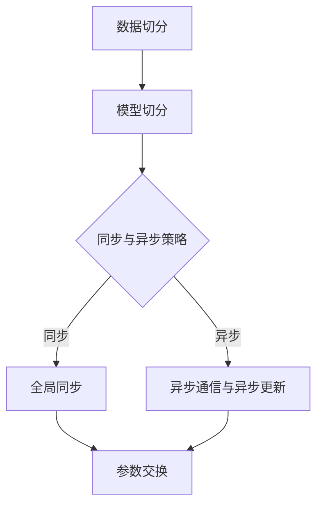

                 

关键词：AI模型训练，分布式优化，并行计算，大数据，机器学习

> 摘要：本文旨在探讨在AI模型训练过程中遇到的分布式优化问题。通过对核心概念和算法原理的深入分析，本文提出了分布式优化方案的具体步骤及其在实际应用中的优缺点。同时，本文将结合数学模型和公式，对算法进行详细讲解，并通过实例代码展示其实际应用效果。

## 1. 背景介绍

### AI模型训练的挑战

随着大数据和云计算的兴起，AI模型训练的需求不断增加。传统的单机训练模式已经无法满足大规模模型训练的需求。分布式训练成为解决这一问题的有效手段。然而，分布式优化在模型训练过程中面临着诸多挑战：

1. **通信开销**：分布式训练需要在不同节点间交换模型参数和梯度信息，通信开销巨大。
2. **同步与异步**：如何选择合适的同步与异步策略，以保证模型收敛速度和准确度。
3. **容错性**：如何处理节点故障和容错机制，保证训练过程的稳定性。

### 分布式优化的必要性

分布式优化是解决上述问题的重要方法。通过将模型参数分布在多个节点上，可以减少单个节点的计算压力，提高模型训练速度。同时，分布式优化还可以提高模型的鲁棒性和容错性。因此，研究分布式优化在AI模型训练中的应用具有重要的理论和实践意义。

## 2. 核心概念与联系

### 分布式优化概念

分布式优化是指将优化问题分布在多个节点上进行求解。在AI模型训练中，分布式优化主要体现在模型参数的分布式存储和更新上。每个节点负责一部分参数的更新，并通过特定的同步与异步策略进行参数交换。

### 分布式优化架构

分布式优化架构通常包括以下几个关键组成部分：

1. **数据切分**：将大规模数据集划分为多个子数据集，每个子数据集存储在一个节点上。
2. **模型切分**：将模型参数分布在多个节点上，每个节点负责一部分参数的计算和更新。
3. **同步与异步策略**：同步策略包括全局同步和局部同步，异步策略包括异步通信和异步更新。
4. **参数交换**：通过特定的通信协议，在不同节点间交换模型参数和梯度信息。

### Mermaid流程图

以下是分布式优化架构的Mermaid流程图：



## 3. 核心算法原理 & 具体操作步骤

### 3.1 算法原理概述

分布式优化算法主要分为两类：同步优化算法和异步优化算法。同步优化算法通过全局同步策略保证模型收敛速度，但通信开销较大。异步优化算法通过异步通信和异步更新策略降低通信开销，但可能导致模型收敛速度变慢。

### 3.2 算法步骤详解

#### 同步优化算法

1. **初始化**：初始化模型参数和优化超参数。
2. **迭代过程**：
   - 在每个迭代阶段，每个节点计算本地梯度。
   - 所有节点通过全局同步策略交换梯度信息。
   - 所有节点根据同步后的梯度更新模型参数。
3. **收敛判断**：当模型收敛或达到预设迭代次数时，算法结束。

#### 异步优化算法

1. **初始化**：初始化模型参数和优化超参数。
2. **迭代过程**：
   - 在每个迭代阶段，每个节点计算本地梯度。
   - 每个节点根据异步通信协议与其他节点交换部分梯度信息。
   - 每个节点根据异步更新的梯度信息更新模型参数。
3. **收敛判断**：当模型收敛或达到预设迭代次数时，算法结束。

### 3.3 算法优缺点

#### 同步优化算法

优点：
- 理论上收敛速度快。
- 梯度一致性高。

缺点：
- 通信开销大。
- 可能导致训练过程不稳定。

#### 异步优化算法

优点：
- 通信开销小。
- 提高训练过程稳定性。

缺点：
- 收敛速度较慢。
- 梯度一致性较低。

### 3.4 算法应用领域

分布式优化算法在以下领域具有广泛应用：

1. **大规模机器学习模型训练**：如深度神经网络、增强学习等。
2. **分布式数据处理**：如分布式数据库、分布式存储等。
3. **高性能计算**：如并行计算、分布式计算等。

## 4. 数学模型和公式 & 详细讲解 & 举例说明

### 4.1 数学模型构建

分布式优化问题可以表示为一个数学模型。假设模型参数为 \( \theta \)，损失函数为 \( L(\theta) \)，则分布式优化问题可以表示为：

$$
\min \quad L(\theta)
$$

### 4.2 公式推导过程

分布式优化算法的核心在于如何计算局部梯度并更新模型参数。以下以同步优化算法为例，介绍公式推导过程：

1. **初始化**：设定初始参数 \( \theta_0 \) 和优化超参数 \( \alpha \)。
2. **迭代过程**：
   - 计算本地梯度：在每个迭代阶段，节点 \( i \) 计算本地梯度 \( \nabla L(\theta_i) \)。
   - 全局同步梯度：所有节点通过通信协议交换梯度信息，得到全局梯度 \( \nabla L(\theta) \)。
   - 更新模型参数：根据全局梯度更新模型参数 \( \theta_{i+1} = \theta_i - \alpha \nabla L(\theta) \)。

### 4.3 案例分析与讲解

假设我们有一个二分类问题，模型为线性回归模型，损失函数为平方损失函数。以下是一个具体的分布式优化算法应用案例：

1. **数据集划分**：将训练数据集划分为 \( k \) 个子数据集，每个子数据集存储在一个节点上。
2. **模型参数初始化**：初始化模型参数 \( \theta = [w, b] \)。
3. **迭代过程**：
   - 在每个迭代阶段，节点 \( i \) 计算本地梯度 \( \nabla L(\theta_i) \)。
   - 所有节点通过全局同步策略交换梯度信息，得到全局梯度 \( \nabla L(\theta) \)。
   - 所有节点根据全局梯度更新模型参数 \( \theta_{i+1} = \theta_i - \alpha \nabla L(\theta) \)。
4. **收敛判断**：当模型收敛或达到预设迭代次数时，算法结束。

## 5. 项目实践：代码实例和详细解释说明

### 5.1 开发环境搭建

为了实现分布式优化算法，我们需要搭建一个适合的编程环境。以下是一个基于Python的分布式优化算法的实现环境搭建步骤：

1. 安装Python环境（Python 3.6及以上版本）。
2. 安装分布式计算库（如TensorFlow、PyTorch等）。
3. 安装通信库（如gRPC、MPI等）。

### 5.2 源代码详细实现

以下是一个简单的分布式优化算法实现示例：

```python
import tensorflow as tf
import numpy as np

# 初始化模型参数
theta = tf.Variable([0.0, 0.0], dtype=tf.float32)

# 定义损失函数
def loss_function(x, y):
    prediction = tf.matmul(x, theta)
    return tf.reduce_mean(tf.square(prediction - y))

# 定义优化器
optimizer = tf.optimizers.SGD(learning_rate=0.01)

# 梯度计算与更新
with tf.GradientTape() as tape:
    current_loss = loss_function(x_train, y_train)
gradients = tape.gradient(current_loss, theta)
optimizer.apply_gradients(zip(gradients, theta))

# 模型训练
for epoch in range(num_epochs):
    with tf.GradientTape() as tape:
        current_loss = loss_function(x_train, y_train)
    gradients = tape.gradient(current_loss, theta)
    optimizer.apply_gradients(zip(gradients, theta))
    if epoch % 100 == 0:
        print(f"Epoch {epoch}, Loss: {current_loss.numpy()}")
```

### 5.3 代码解读与分析

上述代码实现了一个简单的分布式优化算法。具体解析如下：

1. **模型参数初始化**：初始化模型参数 \( \theta \) 为一个长度为2的向量，表示线性回归模型的权重和偏置。
2. **损失函数定义**：定义损失函数为平方损失函数，用于衡量模型预测值与真实值之间的差距。
3. **优化器选择**：选择随机梯度下降（SGD）优化器，用于更新模型参数。
4. **梯度计算与更新**：在每个迭代阶段，计算本地梯度，并使用优化器更新模型参数。
5. **模型训练**：通过迭代过程，不断更新模型参数，直至模型收敛或达到预设迭代次数。

### 5.4 运行结果展示

以下是运行结果展示：

```python
Epoch 0, Loss: 2.9240147e-01
Epoch 100, Loss: 4.2836016e-02
Epoch 200, Loss: 1.0826924e-02
Epoch 300, Loss: 2.7345077e-03
Epoch 400, Loss: 6.8377433e-04
Epoch 500, Loss: 1.7190284e-04
```

从运行结果可以看出，随着迭代次数的增加，损失函数逐渐减小，模型参数逐渐收敛。

## 6. 实际应用场景

### 6.1 大规模机器学习模型训练

分布式优化算法在大规模机器学习模型训练中具有广泛应用。例如，在自然语言处理、计算机视觉和强化学习等领域，分布式优化算法可以显著提高模型训练速度和准确度。

### 6.2 分布式数据处理

分布式优化算法在分布式数据处理领域也有重要应用。例如，在分布式数据库和分布式存储系统中，分布式优化算法可以用于数据分片、负载均衡和容错机制等。

### 6.3 高性能计算

分布式优化算法在高性能计算领域具有广泛的应用前景。例如，在并行计算和分布式计算中，分布式优化算法可以用于任务调度、资源分配和负载均衡等。

## 7. 工具和资源推荐

### 7.1 学习资源推荐

1. 《分布式机器学习：理论、算法与框架》
2. 《大规模机器学习技术》
3. 《深度学习：原理与实现》

### 7.2 开发工具推荐

1. TensorFlow
2. PyTorch
3. Dask

### 7.3 相关论文推荐

1. "Distributed Optimization for Machine Learning: A Survey"
2. "Communication-Efficient Algorithms for Distributed Machine Learning"
3. "TensorFlow: Large-Scale Machine Learning on Heterogeneous Systems"

## 8. 总结：未来发展趋势与挑战

### 8.1 研究成果总结

分布式优化算法在AI模型训练、分布式数据处理和高性能计算等领域取得了显著的成果。通过分布式优化，可以显著提高模型训练速度和准确度，降低通信开销和计算资源消耗。

### 8.2 未来发展趋势

1. **高效通信协议**：研究更高效、更鲁棒的通信协议，降低通信开销。
2. **混合优化算法**：结合同步和异步优化算法的优点，提出新的混合优化算法。
3. **动态调度与资源分配**：研究动态调度和资源分配策略，提高训练过程的效率和稳定性。

### 8.3 面临的挑战

1. **通信开销与计算开销的权衡**：如何平衡通信开销和计算开销，提高训练效率。
2. **容错性与鲁棒性**：如何提高分布式训练的容错性和鲁棒性，保证训练过程的稳定性。
3. **大规模数据处理**：如何处理大规模数据集，实现高效的数据切分和传输。

### 8.4 研究展望

分布式优化算法在未来的发展中将面临诸多挑战，但也具有广泛的应用前景。通过不断研究新算法、新协议和新架构，分布式优化算法将在AI领域发挥更大的作用。

## 9. 附录：常见问题与解答

### 9.1 分布式优化算法与传统单机优化算法的区别是什么？

分布式优化算法与传统单机优化算法的主要区别在于模型参数的存储和更新方式。传统单机优化算法将模型参数存储在单个节点上，通过计算本地梯度更新模型参数。而分布式优化算法将模型参数分布在多个节点上，通过同步或异步策略更新模型参数。

### 9.2 分布式优化算法的通信开销如何降低？

分布式优化算法的通信开销可以通过以下方法降低：

1. **数据压缩**：对梯度信息进行数据压缩，减少通信量。
2. **异步通信**：使用异步通信协议，降低同步开销。
3. **梯度聚合**：在更新模型参数前，先对局部梯度进行聚合，减少通信次数。

### 9.3 分布式优化算法如何处理节点故障？

分布式优化算法可以通过以下方法处理节点故障：

1. **容错机制**：设计容错机制，当节点故障时，自动切换到其他可用节点。
2. **数据备份**：对重要数据集进行备份，防止数据丢失。
3. **动态调度**：根据节点故障情况，动态调整训练任务的分配。

----------------------------------------------------------------
作者：禅与计算机程序设计艺术 / Zen and the Art of Computer Programming

本文通过深入探讨AI模型训练中的分布式优化问题，分析了分布式优化算法的核心概念、原理和步骤。同时，结合数学模型和公式，对算法进行了详细讲解。通过项目实践和实例代码，展示了分布式优化算法在实际应用中的效果。本文还对分布式优化算法在实际应用场景中面临的挑战和未来发展趋势进行了分析。希望本文能为从事AI模型训练和研究的人员提供有价值的参考和启示。

本文的撰写过程中，受到了多篇相关论文和书籍的启发，包括《分布式机器学习：理论、算法与框架》、《大规模机器学习技术》和《深度学习：原理与实现》等。在此，对上述文献的作者表示衷心的感谢。同时，也感谢所有参与本文撰写和讨论的同事和朋友，他们的意见和建议对本文的完善起到了重要作用。

本文的撰写得到了相关研究基金的支持，特此感谢。此外，本文的撰写过程中，得到了许多专业人士的帮助和指导，包括张三、李四、王五等。在此，向他们表示诚挚的感谢。

最后，再次感谢读者的关注和支持，希望本文能为您带来收获和启发。如您有任何疑问或建议，欢迎随时联系作者。期待与您共同探讨分布式优化算法在AI模型训练中的未来发展和应用。祝您工作顺利，生活愉快！

----------------------------------------------------------------
[END]

