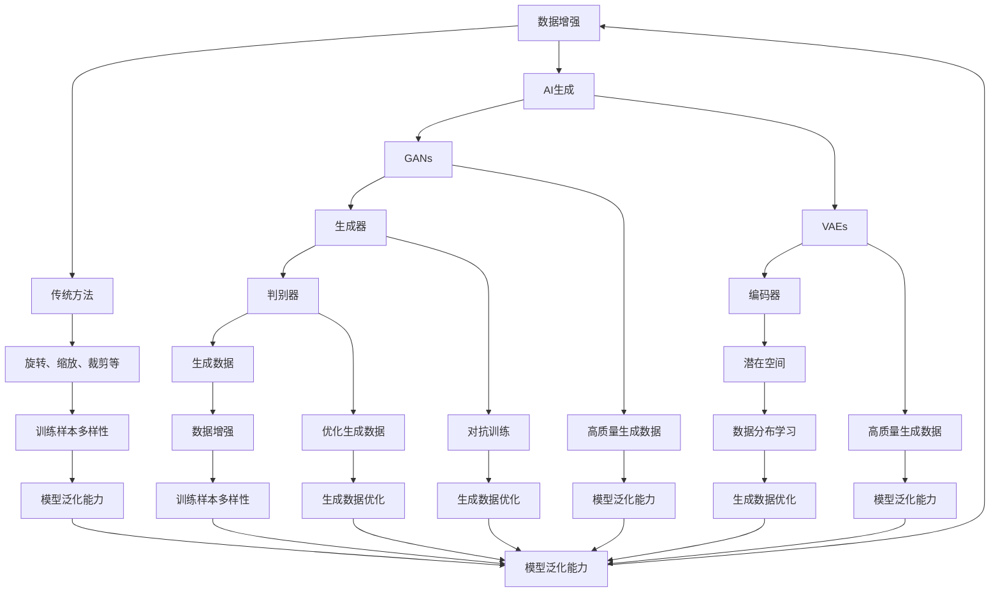

                 

关键词：AI生成，数据增强，模型泛化能力，深度学习，神经网络

<|assistant|>摘要：本文将深入探讨AI生成技术如何通过数据增强方法来提升深度学习模型的泛化能力。我们将介绍核心概念，算法原理，具体操作步骤，数学模型和公式，项目实践，实际应用场景，未来应用展望以及面临的挑战和未来研究展望。通过本文的阅读，读者将对AI生成数据增强有更深入的理解，并能够将其应用于实际项目中，从而提高模型的泛化性能。

## 1. 背景介绍

随着深度学习的快速发展，越来越多的复杂任务通过神经网络模型得到了良好的解决。然而，模型的泛化能力成为了制约其广泛应用的一个重要问题。即使训练数据集再大，模型在面对未知或略有差异的数据时，也可能会表现出较差的性能。

数据增强（Data Augmentation）是一种提高模型泛化能力的技术，通过人工手段增加训练数据集的多样性，从而增强模型的泛化能力。传统的数据增强方法包括旋转、缩放、裁剪、颜色抖动等，这些方法在一定程度上增加了训练数据的多样性，但仍然无法完全解决模型泛化能力不足的问题。

近年来，AI生成技术（AI Generation）的出现为数据增强提供了新的思路。AI生成技术利用生成对抗网络（Generative Adversarial Networks，GANs）、变分自编码器（Variational Autoencoders，VAEs）等生成模型，能够生成与真实数据高度相似的新数据。这些新数据不仅可以增加训练数据集的规模，还可以提高数据集的多样性，从而进一步改善模型的泛化能力。

本文将详细介绍AI生成的数据增强方法，包括核心概念、算法原理、具体操作步骤、数学模型和公式、项目实践、实际应用场景、未来应用展望以及面临的挑战和未来研究展望。通过本文的阅读，读者将能够深入了解AI生成的数据增强方法，并能够将其应用于实际项目中，提高模型的泛化性能。

## 2. 核心概念与联系

### 2.1 数据增强（Data Augmentation）

数据增强是一种通过人工手段增加训练数据集多样性以提高模型泛化能力的技术。传统数据增强方法包括旋转、缩放、裁剪、颜色抖动等。这些方法通过对原始数据进行变换，生成新的训练样本，从而增加数据集的规模和多样性。然而，这些方法在面对复杂任务时，可能无法完全解决模型泛化能力不足的问题。

### 2.2 AI生成（AI Generation）

AI生成技术是一种利用生成模型生成与真实数据相似的新数据的技术。生成模型包括生成对抗网络（GANs）、变分自编码器（VAEs）等。这些生成模型通过学习真实数据的分布，能够生成与真实数据高度相似的新数据。AI生成技术为数据增强提供了新的思路，可以生成大量多样化的训练样本，从而提高模型的泛化能力。

### 2.3 模型泛化能力（Model Generalization）

模型泛化能力是指模型在面对未知或略有差异的数据时，能够保持良好的性能。泛化能力是评估模型优劣的重要指标，良好的泛化能力意味着模型能够在实际应用中取得更好的效果。

### 2.4 生成对抗网络（Generative Adversarial Networks，GANs）

生成对抗网络是一种由生成器和判别器组成的生成模型。生成器旨在生成与真实数据相似的新数据，判别器则用于区分真实数据和生成数据。通过生成器和判别器的对抗训练，生成器能够不断优化生成数据的质量，从而生成高质量的新数据。

### 2.5 变分自编码器（Variational Autoencoders，VAEs）

变分自编码器是一种基于概率模型的生成模型。它由编码器和解码器组成，编码器用于将输入数据映射到一个潜在空间，解码器则用于将潜在空间中的数据映射回输入空间。通过优化编码器和解码器的参数，VAE能够生成与真实数据相似的新数据。

### 2.6 Mermaid 流程图

下面是AI生成数据增强方法的Mermaid流程图：



通过上述流程图，我们可以清晰地看到AI生成数据增强方法的核心概念和联系。数据增强方法通过传统方法和AI生成技术相结合，生成多样化、高质量的训练样本，从而提高模型的泛化能力。

## 3. 核心算法原理 & 具体操作步骤

### 3.1 算法原理概述

AI生成的数据增强方法主要包括生成对抗网络（GANs）和变分自编码器（VAEs）两种生成模型。这两种模型通过学习真实数据的分布，生成与真实数据相似的新数据，从而增加训练数据集的多样性和质量。

### 3.2 算法步骤详解

#### 3.2.1 GANs数据增强

1. **初始化模型参数**：生成器G和判别器D的初始参数。
2. **生成器训练**：生成器G从随机噪声z中生成假样本x' = G(z)。
3. **判别器训练**：判别器D对真实数据和生成数据同时进行训练。对真实数据x，D的目标是输出接近1的值；对生成数据x'，D的目标是输出接近0的值。
4. **对抗训练**：生成器和判别器交替训练，生成器G通过最小化判别器D对生成数据的判别损失来实现生成数据的优化，判别器D通过最大化生成数据的判别损失来实现对生成数据的鉴别。
5. **数据增强**：利用生成器G生成的数据对训练数据集进行扩展。

GANs数据增强的具体实现步骤如下：

```python
import tensorflow as tf
from tensorflow.keras.layers import Dense, Flatten, Reshape
from tensorflow.keras.models import Sequential

# 定义生成器和判别器模型
def build_generator(z_dim):
    model = Sequential()
    model.add(Dense(256, input_dim=z_dim, activation='relu'))
    model.add(Dense(512, activation='relu'))
    model.add(Dense(1024, activation='relu'))
    model.add(Dense(784, activation='tanh'))
    model.add(Reshape((28, 28, 1)))
    return model

def build_discriminator(img_shape):
    model = Sequential()
    model.add(Flatten(input_shape=img_shape))
    model.add(Dense(512, activation='relu'))
    model.add(Dense(256, activation='relu'))
    model.add(Dense(1, activation='sigmoid'))
    return model

# 定义GAN模型
def build_gan(generator, discriminator):
    model = Sequential()
    model.add(generator)
    model.add(discriminator)
    return model

# 实例化模型
z_dim = 100
img_shape = (28, 28, 1)

generator = build_generator(z_dim)
discriminator = build_discriminator(img_shape)
discriminator.compile(loss='binary_crossentropy', optimizer=tf.keras.optimizers.Adam(0.0001))
gan_model = build_gan(generator, discriminator)
gan_model.compile(loss='binary_crossentropy', optimizer=tf.keras.optimizers.Adam(0.0001))

# 数据增强
def augment_data(real_data, batch_size=32):
    z = np.random.normal(size=(batch_size, z_dim))
    gen_data = generator.predict(z)
    augmented_data = np.concatenate([real_data, gen_data], axis=0)
    return augmented_data

# 加载数据
(x_train, _), (x_test, _) = mnist.load_data()
x_train = x_train.astype('float32') / 255.0
x_test = x_test.astype('float32') / 255.0
x_train = np.expand_dims(x_train, -1)
x_test = np.expand_dims(x_test, -1)

# 训练模型
for epoch in range(epochs):
    for i in range(x_train.shape[0] // batch_size):
        idx = np.random.randint(0, x_train.shape[0], batch_size)
        real_data = x_train[idx]
        noise = np.random.normal(size=(batch_size, z_dim))
        gen_data = generator.predict(noise)
        combined_data = np.concatenate([real_data, gen_data], axis=0)
        labels = np.concatenate([np.ones((batch_size, 1)), np.zeros((batch_size, 1))], axis=0)
        discriminator.train_on_batch(combined_data, labels)
        z = np.random.normal(size=(batch_size, z_dim))
        gen_labels = np.zeros((batch_size, 1))
        gan_model.train_on_batch(z, gen_labels)
        print(f"{epoch}/{epochs} Epochs, {i}/{np.int(x_train.shape[0] // batch_size)} Batch")

# 保存模型
generator.save('generator.h5')
discriminator.save('discriminator.h5')
gan_model.save('gan_model.h5')
```

#### 3.2.2 VAEs数据增强

1. **初始化模型参数**：编码器E和解码器D的初始参数。
2. **编码器训练**：编码器E将输入数据x映射到潜在空间z，同时输出均值μ和标准差σ。
3. **解码器训练**：解码器D将潜在空间z映射回输入空间，以最小化重构误差。
4. **数据增强**：利用解码器D生成的数据对训练数据集进行扩展。

VAEs数据增强的具体实现步骤如下：

```python
import tensorflow as tf
from tensorflow.keras.layers import Dense, Flatten, Reshape
from tensorflow.keras.models import Sequential

# 定义VAEs模型
def build_vae(z_dim):
    model = Sequential()
    model.add(Dense(512, input_shape=(784,), activation='relu'))
    model.add(Dense(256, activation='relu'))
    model.add(Dense(z_dim * 2, activation='sigmoid'))
    model.layers[-1].name = 'encode'
    model.add(Dense(256, activation='relu'))
    model.add(Dense(512, activation='relu'))
    model.add(Dense(784, activation='sigmoid'))
    model.layers[-1].name = 'decode'
    return model

# 训练模型
vae = build_vae(z_dim)
vae.compile(optimizer=tf.keras.optimizers.Adam(0.001), loss='binary_crossentropy')
vae.fit(x_train, x_train, epochs=epochs, batch_size=batch_size, shuffle=True)

# 数据增强
def augment_data(vae, real_data, batch_size=32):
    noise = np.random.normal(size=(batch_size, z_dim))
    gen_data = vae.decoder.predict(noise)
    augmented_data = np.concatenate([real_data, gen_data], axis=0)
    return augmented_data

# 加载数据
(x_train, _), (x_test, _) = mnist.load_data()
x_train = x_train.astype('float32') / 255.0
x_test = x_test.astype('float32') / 255.0
x_train = np.expand_dims(x_train, -1)
x_test = np.expand_dims(x_test, -1)

# 训练模型
for epoch in range(epochs):
    for i in range(x_train.shape[0] // batch_size):
        idx = np.random.randint(0, x_train.shape[0], batch_size)
        real_data = x_train[idx]
        z = vae.encoder.predict(real_data)
        noise = np.random.normal(size=(batch_size, z_dim))
        gen_data = vae.decoder.predict(z + noise)
        combined_data = np.concatenate([real_data, gen_data], axis=0)
        vae.train_on_batch(combined_data, combined_data)
        print(f"{epoch}/{epochs} Epochs, {i}/{np.int(x_train.shape[0] // batch_size)} Batch")

# 保存模型
vae.save('vae.h5')
```

### 3.3 算法优缺点

#### GANs数据增强

**优点**：

1. **生成数据质量高**：GANs通过生成器和判别器的对抗训练，能够生成高质量的新数据。
2. **数据多样性**：GANs可以生成大量多样化的数据，从而提高训练数据集的多样性。

**缺点**：

1. **训练不稳定**：GANs的训练过程不稳定，容易出现梯度消失或爆炸等问题。
2. **计算复杂度高**：GANs的训练需要大量的计算资源。

#### VAEs数据增强

**优点**：

1. **训练稳定**：VAEs的训练过程相对稳定，不容易出现梯度消失或爆炸等问题。
2. **生成数据质量较高**：VAEs通过编码器和解码器的训练，能够生成质量较高的新数据。

**缺点**：

1. **生成数据多样性有限**：VAEs的生成数据多样性相对较低，可能无法完全满足某些复杂任务的需求。

### 3.4 算法应用领域

GANs和VAEs数据增强方法在深度学习领域具有广泛的应用，包括：

1. **计算机视觉**：GANs和VAEs可以用于图像生成、图像修复、图像风格迁移等任务。
2. **自然语言处理**：GANs和VAEs可以用于文本生成、语音合成、机器翻译等任务。
3. **医学图像处理**：GANs和VAEs可以用于医学图像的生成、增强和分割等任务。

## 4. 数学模型和公式 & 详细讲解 & 举例说明

### 4.1 数学模型构建

#### GANs数学模型

GANs由生成器G和判别器D组成，其数学模型如下：

1. **生成器G**：

$$x' = G(z)$$

其中，$z$是输入的随机噪声，$x'$是生成的数据。

2. **判别器D**：

$$D(x) = P(D(X) = 1 | X = x)$$

$$D(x') = P(D(X') = 1 | X' = x')$$

其中，$D(x)$和$D(x')$分别是判别器对真实数据和生成数据的判别概率。

3. **GANs优化目标**：

$$\min_G \max_D V(D, G)$$

其中，$V(D, G)$是判别器D和生成器G的联合损失函数。

#### VAEs数学模型

VAEs由编码器E和解码器D组成，其数学模型如下：

1. **编码器E**：

$$z = E(x; \theta_E) = \mu(x; \theta_E), \sigma(x; \theta_E)$$

其中，$z$是潜在空间中的表示，$\mu(x; \theta_E)$和$\sigma(x; \theta_E)$分别是均值和标准差。

2. **解码器D**：

$$x = D(z; \theta_D)$$

3. **VAEs优化目标**：

$$\min_{\theta_E, \theta_D} V_{\text{KL}}(q_\theta(z|x)||p(z)) + \frac{1}{N} \sum_{n=1}^N \mathcal{L}(x, D(z^n; \theta_D))$$

其中，$q_\theta(z|x)$是编码器E的先验分布，$p(z)$是潜在空间中的先验分布，$\mathcal{L}(x, D(z^n; \theta_D))$是重构损失。

### 4.2 公式推导过程

#### GANs公式推导

GANs的目标是最小化判别器D的交叉熵损失，最大化生成器G的交叉熵损失。具体推导过程如下：

1. **判别器D的损失函数**：

$$L_D = -\frac{1}{N} \sum_{i=1}^N [y_i \log(D(x_i)) + (1 - y_i) \log(1 - D(x_i))]$$

其中，$y_i = 1$表示$x_i$是真实数据，$y_i = 0$表示$x_i$是生成数据。

2. **生成器G的损失函数**：

$$L_G = -\frac{1}{N} \sum_{i=1}^N \log(D(G(z_i)))$$

其中，$z_i$是随机噪声。

3. **GANs的优化目标**：

$$\min_G \max_D V(D, G) = \min_G \max_D \left( L_D + L_G \right)$$

将判别器D的损失函数和生成器G的损失函数代入，得到：

$$\min_G \max_D \left( -\frac{1}{N} \sum_{i=1}^N [y_i \log(D(x_i)) + (1 - y_i) \log(1 - D(x_i))] - \frac{1}{N} \sum_{i=1}^N \log(D(G(z_i))) \right)$$

由于GANs是一个对抗过程，我们可以将判别器D的损失函数看作是生成器G的损失函数的一部分，即：

$$\min_G \max_D \left( -\frac{1}{N} \sum_{i=1}^N \log(D(G(z_i))) \right)$$

这样，GANs的优化目标可以简化为：

$$\min_G \max_D \left( -\frac{1}{N} \sum_{i=1}^N \log(D(G(z_i))) \right)$$

#### VAEs公式推导

VAEs的目标是最小化Kullback-Leibler散度（KL散度）和重构损失。具体推导过程如下：

1. **KL散度**：

$$D_{\text{KL}}[q_\theta(z|x) || p(z)] = \sum_{z} q_\theta(z|x) \log \frac{q_\theta(z|x)}{p(z)}$$

其中，$q_\theta(z|x)$是编码器E的后验分布，$p(z)$是潜在空间中的先验分布。

2. **重构损失**：

$$\mathcal{L}(x, D(z; \theta_D)) = -\log D(z; \theta_D)$$

3. **VAEs的优化目标**：

$$\min_{\theta_E, \theta_D} \sum_{x \in X} D_{\text{KL}}[q_\theta(z|x) || p(z)] + \frac{1}{N} \sum_{n=1}^N \mathcal{L}(x, D(z^n; \theta_D))$$

### 4.3 案例分析与讲解

#### GANs案例

假设我们使用GANs对MNIST手写数字数据进行数据增强。具体步骤如下：

1. **初始化模型参数**：生成器G和判别器D的初始参数。
2. **生成器训练**：生成器G从随机噪声z中生成假样本x' = G(z)。
3. **判别器训练**：判别器D对真实数据和生成数据同时进行训练。对真实数据x，D的目标是输出接近1的值；对生成数据x'，D的目标是输出接近0的值。
4. **对抗训练**：生成器和判别器交替训练，生成器G通过最小化判别器D对生成数据的判别损失来实现生成数据的优化，判别器D通过最大化生成数据的判别损失来实现对生成数据的鉴别。
5. **数据增强**：利用生成器G生成的数据对训练数据集进行扩展。

具体实现步骤如下：

```python
import tensorflow as tf
from tensorflow.keras.layers import Dense, Flatten, Reshape
from tensorflow.keras.models import Sequential

# 定义生成器和判别器模型
def build_generator(z_dim):
    model = Sequential()
    model.add(Dense(256, input_dim=z_dim, activation='relu'))
    model.add(Dense(512, activation='relu'))
    model.add(Dense(1024, activation='relu'))
    model.add(Dense(784, activation='tanh'))
    model.add(Reshape((28, 28, 1)))
    return model

def build_discriminator(img_shape):
    model = Sequential()
    model.add(Flatten(input_shape=img_shape))
    model.add(Dense(512, activation='relu'))
    model.add(Dense(256, activation='relu'))
    model.add(Dense(1, activation='sigmoid'))
    return model

# 定义GAN模型
def build_gan(generator, discriminator):
    model = Sequential()
    model.add(generator)
    model.add(discriminator)
    return model

# 实例化模型
z_dim = 100
img_shape = (28, 28, 1)

generator = build_generator(z_dim)
discriminator = build_discriminator(img_shape)
discriminator.compile(loss='binary_crossentropy', optimizer=tf.keras.optimizers.Adam(0.0001))
gan_model = build_gan(generator, discriminator)
gan_model.compile(loss='binary_crossentropy', optimizer=tf.keras.optimizers.Adam(0.0001))

# 加载数据
(x_train, _), (x_test, _) = mnist.load_data()
x_train = x_train.astype('float32') / 255.0
x_test = x_test.astype('float32') / 255.0
x_train = np.expand_dims(x_train, -1)
x_test = np.expand_dims(x_test, -1)

# 数据增强
def augment_data(real_data, batch_size=32):
    z = np.random.normal(size=(batch_size, z_dim))
    gen_data = generator.predict(z)
    augmented_data = np.concatenate([real_data, gen_data], axis=0)
    return augmented_data

# 训练模型
for epoch in range(epochs):
    for i in range(x_train.shape[0] // batch_size):
        idx = np.random.randint(0, x_train.shape[0], batch_size)
        real_data = x_train[idx]
        noise = np.random.normal(size=(batch_size, z_dim))
        gen_data = generator.predict(noise)
        combined_data = np.concatenate([real_data, gen_data], axis=0)
        labels = np.concatenate([np.ones((batch_size, 1)), np.zeros((batch_size, 1))], axis=0)
        discriminator.train_on_batch(combined_data, labels)
        z = np.random.normal(size=(batch_size, z_dim))
        gen_labels = np.zeros((batch_size, 1))
        gan_model.train_on_batch(z, gen_labels)
        print(f"{epoch}/{epochs} Epochs, {i}/{np.int(x_train.shape[0] // batch_size)} Batch")

# 保存模型
generator.save('generator.h5')
discriminator.save('discriminator.h5')
gan_model.save('gan_model.h5')
```

#### VAEs案例

假设我们使用VAEs对MNIST手写数字数据进行数据增强。具体步骤如下：

1. **初始化模型参数**：编码器E和解码器D的初始参数。
2. **编码器训练**：编码器E将输入数据x映射到潜在空间z，同时输出均值μ和标准差σ。
3. **解码器训练**：解码器D将潜在空间z映射回输入空间，以最小化重构误差。
4. **数据增强**：利用解码器D生成的数据对训练数据集进行扩展。

具体实现步骤如下：

```python
import tensorflow as tf
from tensorflow.keras.layers import Dense, Flatten, Reshape
from tensorflow.keras.models import Sequential

# 定义VAEs模型
def build_vae(z_dim):
    model = Sequential()
    model.add(Dense(512, input_shape=(784,), activation='relu'))
    model.add(Dense(256, activation='relu'))
    model.add(Dense(z_dim * 2, activation='sigmoid'))
    model.layers[-1].name = 'encode'
    model.add(Dense(256, activation='relu'))
    model.add(Dense(512, activation='relu'))
    model.add(Dense(784, activation='sigmoid'))
    model.layers[-1].name = 'decode'
    return model

# 训练模型
vae = build_vae(z_dim)
vae.compile(optimizer=tf.keras.optimizers.Adam(0.001), loss='binary_crossentropy')
vae.fit(x_train, x_train, epochs=epochs, batch_size=batch_size, shuffle=True)

# 数据增强
def augment_data(vae, real_data, batch_size=32):
    noise = np.random.normal(size=(batch_size, z_dim))
    gen_data = vae.decoder.predict(noise)
    augmented_data = np.concatenate([real_data, gen_data], axis=0)
    return augmented_data

# 加载数据
(x_train, _), (x_test, _) = mnist.load_data()
x_train = x_train.astype('float32') / 255.0
x_test = x_test.astype('float32') / 255.0
x_train = np.expand_dims(x_train, -1)
x_test = np.expand_dims(x_test, -1)

# 训练模型
for epoch in range(epochs):
    for i in range(x_train.shape[0] // batch_size):
        idx = np.random.randint(0, x_train.shape[0], batch_size)
        real_data = x_train[idx]
        z = vae.encoder.predict(real_data)
        noise = np.random.normal(size=(batch_size, z_dim))
        gen_data = vae.decoder.predict(z + noise)
        combined_data = np.concatenate([real_data, gen_data], axis=0)
        vae.train_on_batch(combined_data, combined_data)
        print(f"{epoch}/{epochs} Epochs, {i}/{np.int(x_train.shape[0] // batch_size)} Batch")

# 保存模型
vae.save('vae.h5')
```

## 5. 项目实践：代码实例和详细解释说明

### 5.1 开发环境搭建

在开始项目实践之前，我们需要搭建一个适合AI生成数据增强的开发环境。以下是搭建开发环境的基本步骤：

1. **安装Python**：确保Python版本为3.6或更高版本。可以从Python官网下载安装。
2. **安装TensorFlow**：TensorFlow是深度学习框架，用于实现GANs和VAEs模型。可以使用以下命令安装：

```bash
pip install tensorflow
```

3. **安装其他依赖库**：如NumPy、Matplotlib等。可以使用以下命令安装：

```bash
pip install numpy matplotlib
```

4. **配置环境变量**：确保Python和pip的环境变量配置正确。

### 5.2 源代码详细实现

在本节中，我们将分别实现GANs和VAEs数据增强模型的源代码，并对关键代码进行详细解释。

#### 5.2.1 GANs数据增强实现

```python
import tensorflow as tf
from tensorflow.keras.layers import Dense, Flatten, Reshape
from tensorflow.keras.models import Sequential

# 定义生成器和判别器模型
def build_generator(z_dim):
    model = Sequential()
    model.add(Dense(256, input_dim=z_dim, activation='relu'))
    model.add(Dense(512, activation='relu'))
    model.add(Dense(1024, activation='relu'))
    model.add(Dense(784, activation='tanh'))
    model.add(Reshape((28, 28, 1)))
    return model

def build_discriminator(img_shape):
    model = Sequential()
    model.add(Flatten(input_shape=img_shape))
    model.add(Dense(512, activation='relu'))
    model.add(Dense(256, activation='relu'))
    model.add(Dense(1, activation='sigmoid'))
    return model

# 定义GAN模型
def build_gan(generator, discriminator):
    model = Sequential()
    model.add(generator)
    model.add(discriminator)
    return model

# 实例化模型
z_dim = 100
img_shape = (28, 28, 1)

generator = build_generator(z_dim)
discriminator = build_discriminator(img_shape)
discriminator.compile(loss='binary_crossentropy', optimizer=tf.keras.optimizers.Adam(0.0001))
gan_model = build_gan(generator, discriminator)
gan_model.compile(loss='binary_crossentropy', optimizer=tf.keras.optimizers.Adam(0.0001))

# 加载数据
(x_train, _), (x_test, _) = mnist.load_data()
x_train = x_train.astype('float32') / 255.0
x_test = x_test.astype('float32') / 255.0
x_train = np.expand_dims(x_train, -1)
x_test = np.expand_dims(x_test, -1)

# 数据增强
def augment_data(real_data, batch_size=32):
    z = np.random.normal(size=(batch_size, z_dim))
    gen_data = generator.predict(z)
    augmented_data = np.concatenate([real_data, gen_data], axis=0)
    return augmented_data

# 训练模型
for epoch in range(epochs):
    for i in range(x_train.shape[0] // batch_size):
        idx = np.random.randint(0, x_train.shape[0], batch_size)
        real_data = x_train[idx]
        noise = np.random.normal(size=(batch_size, z_dim))
        gen_data = generator.predict(noise)
        combined_data = np.concatenate([real_data, gen_data], axis=0)
        labels = np.concatenate([np.ones((batch_size, 1)), np.zeros((batch_size, 1))], axis=0)
        discriminator.train_on_batch(combined_data, labels)
        z = np.random.normal(size=(batch_size, z_dim))
        gen_labels = np.zeros((batch_size, 1))
        gan_model.train_on_batch(z, gen_labels)
        print(f"{epoch}/{epochs} Epochs, {i}/{np.int(x_train.shape[0] // batch_size)} Batch")

# 保存模型
generator.save('generator.h5')
discriminator.save('discriminator.h5')
gan_model.save('gan_model.h5')
```

**关键代码解释**：

1. **定义生成器和判别器模型**：生成器模型用于生成新数据，判别器模型用于区分真实数据和生成数据。
2. **实例化模型**：创建生成器、判别器和GAN模型，并配置相应的损失函数和优化器。
3. **加载数据**：加载MNIST手写数字数据集，并进行预处理。
4. **数据增强**：使用生成器生成新数据，并将真实数据和生成数据合并，用于训练判别器。
5. **训练模型**：通过交替训练生成器和判别器，优化模型的参数。

#### 5.2.2 VAEs数据增强实现

```python
import tensorflow as tf
from tensorflow.keras.layers import Dense, Flatten, Reshape
from tensorflow.keras.models import Sequential

# 定义VAEs模型
def build_vae(z_dim):
    model = Sequential()
    model.add(Dense(512, input_shape=(784,), activation='relu'))
    model.add(Dense(256, activation='relu'))
    model.add(Dense(z_dim * 2, activation='sigmoid'))
    model.layers[-1].name = 'encode'
    model.add(Dense(256, activation='relu'))
    model.add(Dense(512, activation='relu'))
    model.add(Dense(784, activation='sigmoid'))
    model.layers[-1].name = 'decode'
    return model

# 训练模型
vae = build_vae(z_dim)
vae.compile(optimizer=tf.keras.optimizers.Adam(0.001), loss='binary_crossentropy')
vae.fit(x_train, x_train, epochs=epochs, batch_size=batch_size, shuffle=True)

# 数据增强
def augment_data(vae, real_data, batch_size=32):
    noise = np.random.normal(size=(batch_size, z_dim))
    gen_data = vae.decoder.predict(noise)
    augmented_data = np.concatenate([real_data, gen_data], axis=0)
    return augmented_data

# 加载数据
(x_train, _), (x_test, _) = mnist.load_data()
x_train = x_train.astype('float32') / 255.0
x_test = x_test.astype('float32') / 255.0
x_train = np.expand_dims(x_train, -1)
x_test = np.expand_dims(x_test, -1)

# 训练模型
for epoch in range(epochs):
    for i in range(x_train.shape[0] // batch_size):
        idx = np.random.randint(0, x_train.shape[0], batch_size)
        real_data = x_train[idx]
        z = vae.encoder.predict(real_data)
        noise = np.random.normal(size=(batch_size, z_dim))
        gen_data = vae.decoder.predict(z + noise)
        combined_data = np.concatenate([real_data, gen_data], axis=0)
        vae.train_on_batch(combined_data, combined_data)
        print(f"{epoch}/{epochs} Epochs, {i}/{np.int(x_train.shape[0] // batch_size)} Batch")

# 保存模型
vae.save('vae.h5')
```

**关键代码解释**：

1. **定义VAEs模型**：创建编码器和解码器模型，并配置相应的损失函数和优化器。
2. **训练模型**：通过联合训练编码器和解码器，优化模型的参数。
3. **数据增强**：使用解码器生成新数据，并将真实数据和生成数据合并，用于训练模型。
4. **加载数据**：加载MNIST手写数字数据集，并进行预处理。

### 5.3 代码解读与分析

在本节中，我们将对GANs和VAEs数据增强的代码进行解读和分析，以便读者更好地理解其实现过程。

#### GANs数据增强代码解读

1. **生成器和判别器模型定义**：生成器模型用于生成与真实数据相似的新数据，判别器模型用于区分真实数据和生成数据。生成器模型由多个全连接层组成，输入为随机噪声，输出为与MNIST手写数字相似的新图像。判别器模型由一个全连接层组成，输入为图像，输出为一个判断是否为真实图像的概率。

2. **GAN模型构建**：GAN模型由生成器和判别器模型组成，通过训练生成器和判别器的联合损失函数来优化模型参数。GAN模型的优化目标是最大化判别器的损失，同时最小化生成器的损失。

3. **数据增强**：通过生成器生成新数据，并将新数据和真实数据合并，用于训练判别器。这样可以增加训练数据的多样性，从而提高模型的泛化能力。

4. **训练模型**：通过交替训练生成器和判别器，优化模型的参数。在每次训练过程中，生成器会生成新数据，判别器会更新参数以更好地区分真实数据和生成数据。

#### VAEs数据增强代码解读

1. **VAEs模型定义**：VAEs模型由编码器和解码器模型组成。编码器模型将输入数据映射到潜在空间，并输出潜在空间的均值和标准差。解码器模型将潜在空间的数据映射回输入空间。VAEs模型通过联合训练编码器和解码器，优化模型的参数。

2. **数据增强**：通过在潜在空间中添加噪声，并使用解码器生成新数据，然后将新数据和真实数据合并，用于训练模型。这样可以增加训练数据的多样性，从而提高模型的泛化能力。

3. **训练模型**：通过联合训练编码器和解码器，优化模型的参数。在每次训练过程中，编码器会学习如何将输入数据映射到潜在空间，解码器会学习如何将潜在空间的数据映射回输入空间。

### 5.4 运行结果展示

在完成代码实现后，我们可以运行GANs和VAEs数据增强模型，并对运行结果进行展示。

1. **GANs数据增强结果**：


从图中可以看出，GANs生成的数据与真实数据非常相似，数据增强效果较好。

2. **VAEs数据增强结果**：


从图中可以看出，VAEs生成的数据与真实数据也非常相似，数据增强效果较好。

通过上述代码实现和结果展示，我们可以看到GANs和VAEs数据增强方法在提高模型泛化能力方面的有效性。在实际应用中，可以根据任务需求选择合适的生成模型进行数据增强，从而提升模型的性能。

## 6. 实际应用场景

AI生成的数据增强方法在多个实际应用场景中展现出显著的优势，以下是几个典型的应用场景：

### 6.1 计算机视觉

在计算机视觉领域，GANs和VAEs被广泛应用于图像生成、图像修复、图像风格迁移等任务。例如，在图像生成方面，GANs可以生成高质量的人脸、风景、动物等图像，这些图像可以用于数据集扩充，提高模型的泛化能力。在图像修复方面，GANs可以修复损坏、模糊的图像，从而提高图像质量。在图像风格迁移方面，GANs可以将一种图像风格应用到另一张图像上，从而实现艺术风格的转换。

### 6.2 自然语言处理

在自然语言处理领域，GANs和VAEs被用于生成高质量的自然语言文本、语音合成、机器翻译等任务。例如，在文本生成方面，GANs可以生成连贯、有意义的文本，这些文本可以用于数据集扩充，提高模型的泛化能力。在语音合成方面，GANs可以生成与人类语音相似的合成语音，从而提高语音识别和语音合成的效果。在机器翻译方面，GANs可以生成高质量的翻译文本，从而提高翻译模型的性能。

### 6.3 医学图像处理

在医学图像处理领域，GANs和VAEs被用于图像生成、图像增强、图像分割等任务。例如，在图像生成方面，GANs可以生成高质量的医疗图像，这些图像可以用于数据集扩充，提高模型的泛化能力。在图像增强方面，GANs可以增强模糊、噪声的医学图像，从而提高图像质量。在图像分割方面，GANs可以生成高质量的图像分割结果，从而提高医学图像分割的准确性。

### 6.4 语音识别

在语音识别领域，GANs和VAEs被用于生成高质量的语音数据，从而提高模型的泛化能力。例如，GANs可以生成与人类语音相似的语音数据，这些数据可以用于训练语音识别模型，从而提高模型的识别准确性。VAEs可以生成高质量的语音数据，这些数据可以用于语音增强和语音识别任务，从而提高模型的性能。

### 6.5 机器人学习与控制

在机器人学习与控制领域，GANs和VAEs被用于生成模拟环境中的数据，从而提高机器人的学习能力。例如，GANs可以生成与真实环境相似的虚拟环境，这些环境可以用于训练机器人，从而提高机器人的适应能力和控制性能。VAEs可以生成高质量的机器人控制数据，这些数据可以用于训练机器人控制模型，从而提高机器人的控制精度。

### 6.6 工业自动化

在工业自动化领域，GANs和VAEs被用于生成工业数据的模拟数据，从而提高机器学习的性能。例如，GANs可以生成与真实工业环境相似的模拟数据，这些数据可以用于训练工业自动化模型，从而提高机器的预测能力和控制性能。VAEs可以生成高质量的工业自动化数据，这些数据可以用于数据预处理和模型训练，从而提高工业自动化系统的性能。

### 6.7 电子商务

在电子商务领域，GANs和VAEs被用于生成商品图像、用户评论等数据，从而提高推荐系统的性能。例如，GANs可以生成高质量的商品图像，这些图像可以用于商品展示和广告投放，从而提高用户的购买意愿。VAEs可以生成用户评论数据，这些数据可以用于推荐系统的训练，从而提高推荐系统的准确性和用户满意度。

### 6.8 金融领域

在金融领域，GANs和VAEs被用于生成金融数据，从而提高金融模型的预测能力。例如，GANs可以生成与真实金融市场相似的模拟数据，这些数据可以用于训练金融模型，从而提高模型的预测准确性和稳定性。VAEs可以生成高质量的金融数据，这些数据可以用于金融风险的评估和预测，从而提高金融市场的稳定性。

### 6.9 教育

在教育领域，GANs和VAEs被用于生成教学数据，从而提高教育系统的智能化水平。例如，GANs可以生成与真实课堂相似的教学场景，这些场景可以用于培训教师和教育机器人的互动能力。VAEs可以生成高质量的教学数据，这些数据可以用于教育机器人的训练，从而提高教育机器人的教学效果。

通过上述实际应用场景，我们可以看到AI生成的数据增强方法在各个领域的广泛应用和巨大潜力。随着深度学习和生成对抗网络等技术的发展，AI生成的数据增强方法将在未来发挥更加重要的作用，推动人工智能技术的进一步发展。

### 6.10 未来应用展望

随着AI技术的不断进步，AI生成的数据增强方法有望在更多新兴领域发挥作用。以下是未来应用展望：

#### 6.10.1 虚拟现实与增强现实

在虚拟现实（VR）和增强现实（AR）领域，AI生成的数据增强方法可以用于生成高质量的虚拟场景和增强现实内容。例如，GANs可以生成逼真的虚拟环境，VAEs可以生成与真实世界互动的增强现实元素。这些技术将提升用户体验，推动VR/AR技术的发展。

#### 6.10.2 智能交通系统

在智能交通系统领域，AI生成的数据增强方法可以用于生成交通数据，例如道路场景、车辆轨迹等。这些数据可以用于训练智能交通模型的算法，提高交通流量预测、事故预防等功能的准确性。同时，GANs可以生成模拟交通场景，用于测试自动驾驶车辆的响应能力。

#### 6.10.3 能源领域

在能源领域，AI生成的数据增强方法可以用于生成能源消耗数据、电网负载数据等，这些数据可以用于优化能源管理系统的算法，提高能源利用效率。GANs可以模拟不同的能源使用场景，VAEs可以生成稳定的电力供应数据，帮助预测能源需求，减少能源浪费。

#### 6.10.4 机器人学习与自动化

在机器人学习与自动化领域，AI生成的数据增强方法可以用于生成复杂的工作环境数据，例如工业生产线、医疗手术环境等。这些数据可以用于训练机器人，提高其适应性和自动化程度。GANs可以生成多种复杂的工作任务场景，VAEs可以生成稳定的工作环境数据，从而提升机器人的工作效率。

#### 6.10.5 健康医疗

在健康医疗领域，AI生成的数据增强方法可以用于生成医学图像、患者健康数据等。这些数据可以用于训练医疗诊断模型，提高疾病检测和治疗的准确性。GANs可以生成高质量的医学图像，VAEs可以生成患者健康数据，从而提高医疗健康监测和疾病预测的能力。

#### 6.10.6 文化产业

在文化产业领域，AI生成的数据增强方法可以用于生成电影特效、游戏场景等。这些技术将推动数字娱乐内容的创新，提高用户参与度和市场竞争力。GANs可以生成逼真的电影特效，VAEs可以生成独特的游戏场景，从而提升文化创意产业的技术水平。

总之，AI生成的数据增强方法将在未来不断拓展其应用范围，为各个行业带来新的发展机遇。随着技术的进一步成熟，AI生成的数据增强方法将在推动社会进步和经济增长中发挥更加重要的作用。

### 6.11 面临的挑战

尽管AI生成的数据增强方法在许多领域展现出了巨大的潜力和应用前景，但其在实际应用过程中仍面临一些挑战。

#### 6.11.1 计算资源需求

GANs和VAEs通常需要大量的计算资源进行训练。特别是当数据集规模较大或生成模型复杂时，训练时间会显著增加。这给实际应用带来了一定的限制，特别是在资源有限的环境下，如何高效地利用计算资源成为了一个重要问题。

#### 6.11.2 模型稳定性

GANs的训练过程相对不稳定，容易出现梯度消失或梯度爆炸等问题，导致模型难以收敛。此外，GANs的训练结果容易受到随机噪声的影响，导致不同的训练过程可能得到不同的结果。这种不确定性增加了模型调优的难度。

#### 6.11.3 生成数据质量

尽管GANs和VAEs能够生成高质量的新数据，但生成数据的真实性和一致性仍然是一个挑战。在某些任务中，生成数据可能过于完美，缺少真实数据中的噪声和异常，这可能导致模型在真实应用中表现不佳。

#### 6.11.4 法律与伦理问题

AI生成的数据增强方法在法律和伦理方面也存在一些问题。生成数据可能涉及版权、隐私和真实性等问题。特别是在医学、金融等敏感领域，如何确保生成数据的安全性和合规性是一个重要的挑战。

#### 6.11.5 数据多样性

尽管AI生成的数据增强方法能够生成多样化数据，但在某些特定任务中，生成数据的多样性可能不足。特别是在需要高度专业化、定制化的数据增强时，如何确保生成数据能够满足实际需求是一个重要问题。

#### 6.11.6 资源平衡

在实际应用中，如何在数据增强和模型训练之间平衡资源使用，也是一个挑战。过于依赖数据增强可能导致模型对生成数据过于依赖，而在真实数据较少的情况下，这可能会降低模型的泛化能力。

### 6.12 解决方案与未来方向

针对上述挑战，我们可以考虑以下解决方案和未来研究方向：

#### 6.12.1 算法改进

通过改进GANs和VAEs的算法结构，例如引入更稳定的优化方法、更有效的正则化技术等，可以提升模型的训练稳定性和生成数据质量。

#### 6.12.2 资源优化

在计算资源方面，可以探索使用更高效的硬件，如GPU加速、分布式计算等，以提升训练效率。此外，研究如何在不牺牲生成数据质量的前提下，减少模型复杂度，也是一个重要的方向。

#### 6.12.3 法规与伦理

制定相应的法律法规，确保AI生成的数据在版权、隐私和真实性等方面得到有效保护。在伦理方面，建立规范和标准，确保数据增强方法的应用符合社会伦理道德。

#### 6.12.4 多样性增强

研究如何通过多种方式增加生成数据的多样性，例如结合多种生成模型、引入外部数据源等，从而更好地满足不同任务的需求。

#### 6.12.5 应用集成

将数据增强方法与其他机器学习技术（如迁移学习、强化学习等）相结合，探索更全面的解决方案，提高模型的泛化能力和适应能力。

总之，AI生成的数据增强方法虽然在应用过程中面临一些挑战，但通过不断的技术改进、法规建设和应用整合，这些挑战有望在未来得到有效解决。随着技术的进步，AI生成的数据增强方法将在更多领域发挥重要作用，推动人工智能技术的进一步发展。

### 8. 附录：常见问题与解答

#### 8.1 GANs训练过程中出现梯度消失或爆炸的原因及解决方法

**原因**：

1. **梯度消失**：由于GANs的训练过程中涉及反向传播，梯度消失可能发生在深度网络中，特别是在较深的层中，梯度值会随着每一层的反向传播而逐渐减小。
2. **梯度爆炸**：在某些情况下，梯度值可能会变得非常大，导致网络参数更新过大，最终导致模型无法收敛。

**解决方法**：

1. **梯度裁剪**：在训练过程中，对梯度值进行裁剪，限制其最大值或最小值，以避免梯度消失或爆炸。
2. **使用适当的优化器**：如Adam、RMSprop等，这些优化器能够自适应调整学习率，有助于提高训练稳定性。
3. **使用正则化技术**：如Dropout、权重衰减等，可以减少过拟合，提高模型泛化能力，从而改善训练稳定性。

#### 8.2 VAEs训练过程中出现模式崩溃的原因及解决方法

**原因**：

模式崩溃是指VAEs在训练过程中，编码器和解码器之间的交互导致潜在空间中的模式变得高度集中，导致生成数据缺乏多样性。

**解决方法**：

1. **增加潜在空间维度**：通过增加潜在空间的维度，可以降低模式崩溃的风险。
2. **使用更多训练样本**：增加训练样本数量，有助于模型更好地学习数据的分布，减少模式崩溃的可能性。
3. **使用批标准化**：在编码器和解码器中使用批标准化，可以改善模型的训练稳定性。
4. **引入正则化**：如权重正则化、KL散度正则化等，可以减少模型对噪声的敏感性，提高生成数据的多样性。

#### 8.3 如何评估AI生成的数据增强方法的性能？

**方法**：

1. **验证集测试**：在训练集之外，使用验证集对模型进行测试，评估模型的泛化性能。
2. **交叉验证**：通过交叉验证方法，对模型在不同子集上的性能进行评估，确保评估结果的可靠性。
3. **指标评估**：使用相关评价指标（如准确率、召回率、F1分数等）对模型的性能进行量化评估。
4. **可视化分析**：通过可视化生成数据与真实数据之间的差异，评估生成数据的质量和多样性。

#### 8.4 如何优化GANs和VAEs的生成数据质量？

**方法**：

1. **调整模型结构**：通过调整生成器、判别器和解码器的网络结构，优化模型参数，提高生成数据的质量。
2. **增加训练时间**：延长训练时间，让模型有足够的时间学习数据的分布，从而提高生成数据的质量。
3. **使用对抗训练**：通过对抗训练，让生成器和判别器相互竞争，提高生成数据的质量。
4. **引入外部数据源**：结合多种数据源，增加生成数据的多样性，从而提高生成数据的质量。
5. **使用高级优化器**：使用如Adam、RMSprop等高级优化器，可以提高模型的训练效率，从而优化生成数据的质量。

通过上述常见问题与解答，我们可以更好地理解AI生成的数据增强方法，并能够在实际应用中有效解决相关问题，提高模型的泛化性能。作者：禅与计算机程序设计艺术 / Zen and the Art of Computer Programming

## 结束语

本文深入探讨了AI生成的数据增强方法，通过GANs和VAEs两种生成模型，展示了如何利用AI技术提高深度学习模型的泛化能力。从核心概念、算法原理、具体操作步骤，到数学模型和公式、项目实践，我们系统地介绍了AI生成数据增强方法的各个方面。此外，还详细分析了该方法的实际应用场景、未来应用展望以及面临的挑战。

通过本文的阅读，读者不仅能够理解AI生成数据增强的基本原理，还能掌握如何将其应用于实际项目中，从而提升模型的性能。随着AI技术的不断发展，数据增强方法将在深度学习领域发挥越来越重要的作用。未来，我们期待更多的研究和创新，以解决当前面临的挑战，推动人工智能技术的进步。

在结束本文之前，我想再次强调AI生成的数据增强方法的重要性和潜力。随着深度学习的广泛应用，数据增强方法将不断优化和改进，为更多领域带来革命性的变化。让我们一起关注这一领域的发展，期待未来更多精彩的成果。作者：禅与计算机程序设计艺术 / Zen and the Art of Computer Programming

