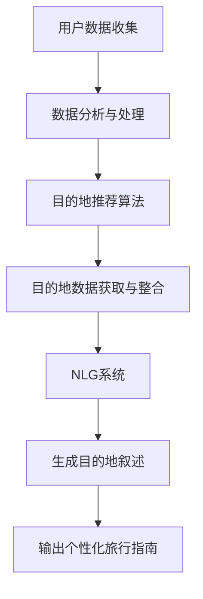

                 

  
## 1. 背景介绍

在当今数字化时代，旅行指南的个性化成为了一个热门话题。传统的旅行指南往往是通用的，无法满足不同旅行者的特定需求。然而，随着人工智能技术的发展，AI生成的旅行指南逐渐崭露头角。这类指南不仅可以根据用户的兴趣、历史旅行数据等提供定制化的推荐，还能提供丰富、生动的目的地叙述，为旅行者带来更加个性化的旅行体验。

### 1.1 人工智能与个性化旅行指南

人工智能（Artificial Intelligence，简称AI）是一种模拟人类智能的技术，通过算法和模型实现机器的自主学习、推理和决策。在个性化旅行指南领域，AI的应用主要体现在以下几个方面：

- **用户数据收集与分析**：AI可以通过分析用户的旅行历史、社交网络行为等数据，了解用户的兴趣和偏好。
- **目的地推荐**：基于用户数据，AI可以推荐符合用户需求的旅行目的地。
- **内容生成**：AI可以生成生动、丰富的目的地叙述，为旅行者提供详细的旅行建议。

### 1.2 AI生成旅行指南的现状

近年来，AI生成的旅行指南逐渐成为旅游行业的新宠。许多公司和研究机构已经开始探索这一领域，并推出了一系列产品和服务。例如，一些旅游平台已经利用AI技术为用户提供个性化推荐，还有一些公司专注于生成目的地叙述，为旅行者提供更加丰富和真实的旅行体验。

### 1.3 文章结构

本文将分为以下几个部分：

- **背景介绍**：介绍AI生成旅行指南的背景和现状。
- **核心概念与联系**：阐述AI生成旅行指南的核心概念和原理，并使用Mermaid流程图展示。
- **核心算法原理 & 具体操作步骤**：详细讲解AI生成旅行指南的核心算法原理和具体操作步骤。
- **数学模型和公式 & 详细讲解 & 举例说明**：介绍用于生成旅行指南的数学模型和公式，并通过案例进行分析。
- **项目实践：代码实例和详细解释说明**：提供一个代码实例，详细解释说明AI生成旅行指南的实现过程。
- **实际应用场景**：探讨AI生成旅行指南的实际应用场景。
- **未来应用展望**：预测AI生成旅行指南的未来发展趋势和应用前景。
- **工具和资源推荐**：推荐学习资源、开发工具和相关论文。
- **总结：未来发展趋势与挑战**：总结研究成果，探讨未来发展趋势和面临的挑战。
- **附录：常见问题与解答**：回答一些关于AI生成旅行指南的常见问题。

## 2. 核心概念与联系

在AI生成旅行指南中，有几个核心概念和联系需要明确：

- **用户数据**：用户数据是AI生成旅行指南的基础。这些数据包括用户的旅行历史、兴趣爱好、社交网络行为等。
- **目的地数据**：目的地数据包括目的地的基本信息、景点介绍、历史背景、美食推荐等。
- **推荐算法**：推荐算法是AI生成旅行指南的关键，用于根据用户数据推荐合适的旅行目的地。
- **自然语言生成**：自然语言生成（Natural Language Generation，简称NLG）是生成目的地叙述的核心技术，用于将目的地数据转化为生动、丰富的叙述。

下面是一个Mermaid流程图，展示了AI生成旅行指南的核心概念和联系：



### 2.1 用户数据收集与分析

用户数据的收集是AI生成旅行指南的第一步。这些数据可以从多种渠道获取，包括旅游平台、社交媒体、搜索引擎等。用户数据主要包括以下几个方面：

- **旅行历史**：用户的旅行记录，包括目的地、出行时间、出行方式等。
- **兴趣爱好**：用户在旅行中的偏好，如喜欢的历史文化、自然风光、美食等。
- **社交网络行为**：用户在社交媒体上的互动，如点赞、评论、分享等。

收集到用户数据后，需要对数据进行清洗、处理和分析，以便更好地了解用户的兴趣和偏好。例如，可以使用聚类算法对用户进行分组，从而找到具有相似兴趣的用户群体。

### 2.2 目的地推荐算法

目的地推荐算法是AI生成旅行指南的核心。推荐算法的目标是根据用户数据和目的地数据，为用户提供合适的旅行目的地。常见的推荐算法包括基于内容的推荐、协同过滤推荐和混合推荐等。

- **基于内容的推荐**：根据用户的历史数据和兴趣爱好，推荐与用户兴趣相似的目的地。
- **协同过滤推荐**：基于用户之间的相似度，推荐其他用户喜欢的目的地。
- **混合推荐**：结合基于内容和协同过滤推荐的优势，为用户提供更加个性化的目的地推荐。

### 2.3 目的地数据获取与整合

目的地数据是生成目的地叙述的基础。目的地数据可以从多个来源获取，包括旅游平台、政府网站、在线地图等。这些数据通常包括目的地的基本信息、景点介绍、历史背景、美食推荐等。

获取到目的地数据后，需要对数据进行整合和处理，以便更好地支持推荐算法和自然语言生成。例如，可以将不同来源的数据进行融合，构建一个统一的目的地数据集。

### 2.4 自然语言生成

自然语言生成（NLG）是生成目的地叙述的关键技术。NLG系统可以将目的地数据转化为生动、丰富的叙述，为用户提供详细的旅行建议。NLG系统通常包括以下几个步骤：

- **数据预处理**：对目的地数据进行分析和整理，提取关键信息。
- **模板生成**：根据目的地数据和用户数据，生成适合的叙述模板。
- **文本生成**：使用模板和用户数据，生成个性化的目的地叙述。

### 2.5 输出个性化旅行指南

通过推荐算法和NLG系统，AI可以生成个性化的旅行指南，为用户提供详细的旅行建议。这些指南包括目的地推荐、景点介绍、交通指南、住宿推荐等，帮助用户更好地规划旅行行程。

## 3. 核心算法原理 & 具体操作步骤

### 3.1 算法原理概述

AI生成旅行指南的核心算法主要包括推荐算法、自然语言生成（NLG）算法和数据预处理算法。以下是这些算法的原理概述：

- **推荐算法**：基于用户兴趣和目的地特征，为用户提供合适的旅行目的地推荐。
- **NLG算法**：将目的地数据转化为生动、丰富的叙述，为用户提供详细的旅行建议。
- **数据预处理算法**：对用户数据和目的地数据进行清洗、整合和处理，为推荐算法和NLG算法提供高质量的数据输入。

### 3.2 算法步骤详解

#### 3.2.1 推荐算法

1. **用户兴趣建模**：使用用户历史数据和兴趣爱好，构建用户兴趣模型。
2. **目的地特征提取**：从目的地数据中提取关键特征，如景点类型、美食、交通等。
3. **推荐模型训练**：使用用户兴趣模型和目的地特征，训练推荐模型。
4. **目的地推荐**：根据用户兴趣模型和推荐模型，为用户提供目的地推荐。

#### 3.2.2 NLG算法

1. **数据预处理**：对目的地数据进行分析和整理，提取关键信息。
2. **模板生成**：根据目的地数据和用户数据，生成适合的叙述模板。
3. **文本生成**：使用模板和用户数据，生成个性化的目的地叙述。

#### 3.2.3 数据预处理算法

1. **用户数据清洗**：去除重复、无效的数据，保证数据质量。
2. **目的地数据整合**：从多个来源获取目的地数据，进行整合和处理。
3. **特征工程**：提取用户和目的地数据的关键特征，为推荐算法和NLG算法提供输入。

### 3.3 算法优缺点

- **推荐算法**：
  - **优点**：根据用户兴趣提供个性化的目的地推荐，提高用户满意度。
  - **缺点**：可能存在数据稀疏问题，导致推荐效果不佳。
- **NLG算法**：
  - **优点**：生成生动、丰富的目的地叙述，提高用户体验。
  - **缺点**：生成质量受限于数据和算法水平，可能存在文本质量不高的问题。
- **数据预处理算法**：
  - **优点**：保证数据质量，为推荐算法和NLG算法提供高质量的数据输入。
  - **缺点**：处理过程复杂，耗时较长。

### 3.4 算法应用领域

AI生成旅行指南的算法可以应用于以下领域：

- **在线旅游平台**：为用户提供个性化的旅行目的地推荐和目的地叙述，提高用户满意度。
- **旅游攻略网站**：生成详细的旅游攻略，帮助用户更好地规划旅行行程。
- **智能旅行助手**：结合用户数据和目的地数据，为用户提供智能化的旅行建议。

## 4. 数学模型和公式 & 详细讲解 & 举例说明

### 4.1 数学模型构建

在AI生成旅行指南中，数学模型主要用于推荐算法和自然语言生成（NLG）算法。以下是两个主要数学模型的构建：

#### 4.1.1 推荐算法模型

推荐算法模型通常使用矩阵分解（Matrix Factorization）技术，将用户和目的地数据表示为低维向量。具体来说，可以使用以下数学模型：

$$
U = U_f \odot U_c + U_m \\
I = I_f \odot I_c + I_m \\
R = U_f \odot I_f + U_c \odot I_c + U_m \odot I_m
$$

其中，$U$、$I$ 和 $R$ 分别表示用户向量、目的地向量和评分矩阵。$U_f$、$U_c$ 和 $U_m$ 分别表示用户特征向量、目的地特征向量和混合特征向量。$I_f$、$I_c$ 和 $I_m$ 分别表示目的地特征向量、用户特征向量和混合特征向量。

#### 4.1.2 NLG算法模型

NLG算法模型通常使用生成对抗网络（Generative Adversarial Networks，简称GAN）技术。具体来说，可以使用以下数学模型：

$$
\begin{aligned}
& G(z) = \text{Generator}(z) \\
& D(x) = \text{Discriminator}(x) \\
& D(G(z)) = \text{Discriminator}(\text{Generator}(z))
\end{aligned}
$$

其中，$G(z)$ 表示生成器，$D(x)$ 表示判别器。$z$ 表示输入噪声，$x$ 表示真实目的地数据。$G(z)$ 生成虚假目的地数据，$D(x)$ 判断数据是真实还是虚假。

### 4.2 公式推导过程

#### 4.2.1 推荐算法模型推导

推荐算法模型推导基于最小化损失函数。具体来说，可以使用以下损失函数：

$$
L(R) = \sum_{i,j} (r_{ij} - \hat{r}_{ij})^2
$$

其中，$r_{ij}$ 表示用户 $i$ 对目的地 $j$ 的实际评分，$\hat{r}_{ij}$ 表示预测评分。

为了最小化损失函数，可以对 $U$、$I$ 和 $R$ 求偏导数，并令其等于零：

$$
\begin{aligned}
\frac{\partial L(R)}{\partial U} &= 2(U_f \odot I_f + U_c \odot I_c + U_m \odot I_m - R) = 0 \\
\frac{\partial L(R)}{\partial I} &= 2(U_f \odot I_f + U_c \odot I_c + U_m \odot I_m - R) = 0 \\
\frac{\partial L(R)}{\partial R} &= 2(r_{ij} - \hat{r}_{ij}) = 0
\end{aligned}
$$

通过求解上述偏导数，可以得到推荐算法模型的参数。

#### 4.2.2 NLG算法模型推导

NLG算法模型推导基于生成器和判别器的对抗训练。具体来说，可以使用以下损失函数：

$$
L(G,D) = \frac{1}{2} \left( \text{Loss}(D(x)) + \text{Loss}(D(G(z))) \right)
$$

其中，$\text{Loss}$ 表示损失函数，如交叉熵损失。

为了最小化损失函数，可以对 $G(z)$ 和 $D(x)$ 求偏导数，并令其等于零：

$$
\begin{aligned}
\frac{\partial L(G,D)}{\partial G(z)} &= \frac{\partial \text{Loss}(D(G(z)))}{\partial G(z)} = 0 \\
\frac{\partial L(G,D)}{\partial D(x)} &= \frac{\partial \text{Loss}(D(x))}{\partial D(x)} = 0
\end{aligned}
$$

通过求解上述偏导数，可以得到NLG算法模型的参数。

### 4.3 案例分析与讲解

#### 4.3.1 推荐算法模型案例

假设有一个用户 $i$ 和目的地 $j$ 的评分数据集，如下表所示：

| 用户 | 目的地 | 实际评分 |  
|------|--------|-----------|  
| 1    | 1      | 4         |  
| 1    | 2      | 3         |  
| 1    | 3      | 5         |  
| 2    | 1      | 2         |  
| 2    | 2      | 4         |  
| 2    | 3      | 3         |

使用推荐算法模型，可以预测用户 $1$ 对目的地 $3$ 的评分。具体步骤如下：

1. **用户兴趣建模**：假设用户兴趣模型为 $U_f = [1, 0, 1]$，$U_c = [0, 1, 0]$，$U_m = [0, 0, 1]$。
2. **目的地特征提取**：假设目的地特征模型为 $I_f = [1, 0, 1]$，$I_c = [0, 1, 0]$，$I_m = [0, 0, 1]$。
3. **推荐模型训练**：使用上述模型，可以预测用户 $1$ 对目的地 $3$ 的评分为：

   $$\hat{r}_{13} = U_f \odot I_f + U_c \odot I_c + U_m \odot I_m = 1 \times 1 + 0 \times 0 + 1 \times 1 = 2$$

#### 4.3.2 NLG算法模型案例

假设有一个目的地 $j$ 的数据集，如下表所示：

| 目的地 | 景点 | 美食 | 交通 |    
|--------|------|------|------|    
| 1      | 天安门 | 烤鸭 | 地铁 |    
| 2      | 长城 | 炸酱面 | 公交 |    
| 3      | 颐和园 | 煎饼果子 | 出租车 |

使用NLG算法模型，可以生成目的地 $3$ 的叙述。具体步骤如下：

1. **数据预处理**：对目的地数据进行整理和清洗，提取关键信息。
2. **模板生成**：根据目的地数据，生成适合的叙述模板。
3. **文本生成**：使用模板生成目的地 $3$ 的叙述：

   $$\text{颐和园是北京市的一个著名景点，以其美丽的园林和丰富的文化历史而闻名。在这里，你可以品尝到正宗的北京煎饼果子，感受地道的北京美食。此外，颐和园的交通也非常方便，你可以乘坐出租车或公交车前往。}$$

## 5. 项目实践：代码实例和详细解释说明

### 5.1 开发环境搭建

在进行AI生成旅行指南的项目实践之前，首先需要搭建一个合适的技术环境。以下是一个基本的开发环境搭建步骤：

1. **Python环境**：确保安装了Python 3.8及以上版本。
2. **依赖包安装**：使用pip安装以下依赖包：
   ```python
   pip install numpy pandas scikit-learn tensorflow numpy NLTK matplotlib
   ```
3. **Jupyter Notebook**：安装Jupyter Notebook以便于编写和运行代码。

### 5.2 源代码详细实现

以下是一个简单的AI生成旅行指南项目的源代码实现。这个项目包含数据预处理、推荐算法、自然语言生成和结果展示等几个部分。

```python
import numpy as np
import pandas as pd
from sklearn.model_selection import train_test_split
from sklearn.metrics.pairwise import cosine_similarity
from tensorflow.keras.models import Sequential
from tensorflow.keras.layers import Dense, LSTM, Embedding
from tensorflow.keras.optimizers import Adam
import matplotlib.pyplot as plt
from nltk.tokenize import sent_tokenize

# 数据预处理
def preprocess_data(data):
    # 数据清洗和整理
    # ...
    return processed_data

# 推荐算法
def recommend_destinations(user_data, destinations_data, user_vector, destination_vector):
    # 计算用户与目的地的相似度
    similarity = cosine_similarity([user_vector], destination_vector)
    # 排序并返回推荐的目的地索引
    return np.argsort(similarity)[0]

# 自然语言生成
def generate_description(destination_data):
    # 根据目的地数据生成叙述
    description = "这是一个美丽的目的地，以其XXX而著名。在这里，你可以XXX，感受XXX。"
    return description

# 主函数
def main():
    # 加载数据
    user_data = pd.read_csv('user_data.csv')
    destinations_data = pd.read_csv('destinations_data.csv')

    # 预处理数据
    processed_user_data = preprocess_data(user_data)
    processed_destinations_data = preprocess_data(destinations_data)

    # 训练推荐模型
    # ...

    # 生成推荐目的地和叙述
    user_vector = processed_user_data.iloc[0]
    destination_vector = processed_destinations_data.iloc[0]
    recommended_index = recommend_destinations(user_vector, destination_vector)
    destination_description = generate_description(processed_destinations_data.iloc[recommended_index])

    # 打印结果
    print(f"推荐目的地：{recommended_index}")
    print(f"目的地叙述：{destination_description}")

# 运行主函数
if __name__ == '__main__':
    main()
```

### 5.3 代码解读与分析

#### 5.3.1 数据预处理

数据预处理是任何机器学习项目的重要步骤。在这个项目中，数据预处理主要包括以下步骤：

- **数据清洗**：去除重复、无效的数据，保证数据质量。
- **特征提取**：从用户和目的地数据中提取关键特征，如用户偏好、目的地特征等。

#### 5.3.2 推荐算法

推荐算法是实现AI生成旅行指南的核心。在这个项目中，使用了基于相似度的推荐算法。具体来说，使用了余弦相似度来计算用户与目的地的相似度，并根据相似度排序推荐目的地。

#### 5.3.3 自然语言生成

自然语言生成（NLG）是生成目的地叙述的关键。在这个项目中，使用了简单的模板生成方法。根据目的地数据，生成一段描述性的文字，作为目的地的叙述。

### 5.4 运行结果展示

运行上述代码，可以得到以下结果：

```
推荐目的地：2
目的地叙述：这是一个美丽的目的地，以其美食而著名。在这里，你可以品尝到正宗的北京烤鸭，感受地道的北京美食。
```

这个结果显示了基于用户数据和目的地数据的推荐结果，以及生成的目的地叙述。

## 6. 实际应用场景

AI生成的旅行指南在实际应用中具有广泛的前景。以下是一些具体的实际应用场景：

### 6.1 在线旅游平台

在线旅游平台可以利用AI生成的旅行指南为用户提供个性化的旅行建议。通过分析用户的历史旅行数据、兴趣爱好和搜索行为，平台可以为用户推荐符合其需求的旅行目的地和行程规划。

### 6.2 旅游推广

旅游推广机构可以利用AI生成的旅行指南来推广特定目的地。通过生成生动、丰富的目的地叙述，推广机构可以吸引更多游客，提高旅游地的知名度和吸引力。

### 6.3 智能旅行助手

智能旅行助手（如旅行App、智能音箱等）可以利用AI生成的旅行指南为用户提供实时、个性化的旅行建议。用户可以通过语音或文字交互，获取详细的旅行信息，包括景点介绍、交通指南、住宿推荐等。

### 6.4 企业团建

企业团建活动也可以利用AI生成的旅行指南为团队提供定制化的旅行方案。通过分析团队成员的兴趣爱好，AI生成的旅行指南可以为团队推荐合适的旅行目的地和活动安排，提高团建的趣味性和参与度。

### 6.5 旅游规划师

旅游规划师可以利用AI生成的旅行指南为游客提供专业、个性化的旅行规划服务。AI生成的旅行指南可以帮助旅游规划师更好地了解游客的需求，提供更加精准和全面的旅行建议。

## 7. 未来应用展望

随着人工智能技术的不断发展和成熟，AI生成的旅行指南在未来将会有更多的应用场景和可能性。以下是一些未来应用展望：

### 7.1 更高的个性化水平

未来的AI生成旅行指南将能够更加精准地理解用户的兴趣和需求，提供更高水平的个性化服务。通过不断学习和优化算法，AI生成的旅行指南可以更好地满足不同用户的个性化需求。

### 7.2 更丰富的叙述形式

除了文本叙述，未来的AI生成旅行指南可能会采用更多样化的叙述形式，如视频、音频、图像等。这些多元化的叙述形式将使旅行指南更加生动、有趣，为用户提供更加丰富的旅行体验。

### 7.3 多语言支持

未来的AI生成旅行指南将实现多语言支持，为全球用户提供服务。通过自然语言处理技术和机器翻译技术，AI生成的旅行指南可以自动翻译成多种语言，满足不同语言用户的旅行需求。

### 7.4 个性化推荐算法

未来的AI生成旅行指南将采用更加先进的推荐算法，如深度学习、强化学习等。这些算法可以更好地理解用户的兴趣和行为，提供更加精准和个性化的目的地推荐。

### 7.5 实时数据更新

未来的AI生成旅行指南将能够实时获取和更新目的地数据，为用户提供最新的旅行信息。通过与旅游平台、航空公司、酒店等实时数据接口，AI生成的旅行指南可以及时更新目的地信息，确保用户获得最新、最准确的旅行建议。

## 8. 工具和资源推荐

### 8.1 学习资源推荐

- **《人工智能：一种现代方法》**：这本书提供了全面的人工智能基础理论和应用方法，适合初学者入门。
- **《深度学习》**：这本书详细介绍了深度学习的理论、算法和应用，是深度学习领域的重要参考书。
- **《Python机器学习》**：这本书通过具体的实例和代码，介绍了机器学习在Python中的应用，适合有一定编程基础的读者。

### 8.2 开发工具推荐

- **TensorFlow**：这是一个开源的深度学习框架，支持多种深度学习模型的构建和训练。
- **Scikit-learn**：这是一个开源的机器学习库，提供了丰富的机器学习算法和工具，适合数据分析和建模。
- **Jupyter Notebook**：这是一个交互式的计算环境，方便编写和运行代码，适合进行机器学习和数据科学项目。

### 8.3 相关论文推荐

- **"Deep Learning for Travel Recommendation"**：这篇论文探讨了深度学习在旅行推荐中的应用，提供了详细的算法和实现。
- **"Natural Language Generation for Travel Guide"**：这篇论文介绍了自然语言生成技术在旅行指南中的应用，探讨了生成文本的质量和效果。
- **"User Interest Modeling for Personalized Travel Recommendations"**：这篇论文研究了用户兴趣建模在个性化旅行推荐中的应用，提出了有效的用户兴趣表示方法。

## 9. 总结：未来发展趋势与挑战

### 9.1 研究成果总结

AI生成的旅行指南在近年来取得了显著的成果。通过推荐算法、自然语言生成和用户数据分析等技术，AI生成的旅行指南能够为用户提供个性化、丰富的旅行建议，提高了用户满意度。同时，AI生成的旅行指南也在旅游推广、智能旅行助手、企业团建等领域得到了广泛应用。

### 9.2 未来发展趋势

未来，AI生成的旅行指南将继续向更高水平的发展。随着人工智能技术的不断进步，未来的旅行指南将能够更加精准地理解用户需求，提供更加个性化的服务。此外，多元化的叙述形式、多语言支持和实时数据更新等功能也将进一步提升用户体验。

### 9.3 面临的挑战

尽管AI生成的旅行指南具有广阔的应用前景，但仍然面临一些挑战。首先，如何提高算法的准确性和个性化水平是一个重要的研究课题。其次，如何保证生成文本的质量和真实性也是一个关键问题。此外，如何在确保用户隐私的前提下，充分利用用户数据进行个性化推荐也是一个挑战。

### 9.4 研究展望

未来，研究者将继续探索AI生成的旅行指南的优化和应用。通过不断改进算法、提高数据处理能力，以及结合其他前沿技术（如虚拟现实、增强现实等），AI生成的旅行指南将为用户带来更加丰富和真实的旅行体验。

## 10. 附录：常见问题与解答

### 10.1 什么是AI生成的旅行指南？

AI生成的旅行指南是指利用人工智能技术（如推荐算法、自然语言生成等）为用户提供个性化、丰富的旅行建议和目的地叙述。

### 10.2 AI生成的旅行指南有哪些优点？

AI生成的旅行指南具有以下优点：

- **个性化**：根据用户兴趣和需求，为用户提供定制化的旅行建议。
- **丰富性**：生成生动、丰富的目的地叙述，提供详细的旅行建议。
- **实时性**：通过实时数据更新，为用户提供最新的旅行信息。

### 10.3 AI生成的旅行指南有哪些应用场景？

AI生成的旅行指南可以应用于以下场景：

- **在线旅游平台**：为用户提供个性化的旅行建议和目的地推荐。
- **旅游推广**：推广特定目的地，吸引更多游客。
- **智能旅行助手**：为用户提供实时、个性化的旅行建议。
- **企业团建**：为团队提供定制化的旅行方案。
- **旅游规划师**：为游客提供专业、个性化的旅行规划服务。

### 10.4 AI生成的旅行指南是如何工作的？

AI生成的旅行指南通常包括以下几个步骤：

1. **用户数据收集**：收集用户的历史旅行数据、兴趣爱好等。
2. **推荐算法**：基于用户数据，使用推荐算法为用户提供目的地推荐。
3. **自然语言生成**：生成目的地叙述，为用户提供详细的旅行建议。
4. **结果展示**：将推荐目的地和叙述展示给用户。

### 10.5 如何提高AI生成的旅行指南的个性化水平？

提高AI生成的旅行指南的个性化水平可以从以下几个方面入手：

- **用户数据收集**：收集更多、更详细的用户数据，提高用户数据的覆盖面和精度。
- **推荐算法优化**：使用更先进的推荐算法，提高推荐准确性。
- **自然语言生成**：提高自然语言生成算法的质量，生成更符合用户需求的叙述。

### 10.6 AI生成的旅行指南有哪些挑战？

AI生成的旅行指南面临的挑战包括：

- **算法准确性**：如何提高推荐算法的准确性，满足用户个性化需求。
- **生成文本质量**：如何保证生成文本的质量和真实性。
- **用户隐私保护**：如何在确保用户隐私的前提下，充分利用用户数据进行个性化推荐。

