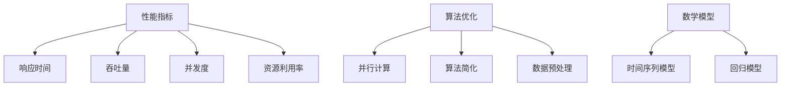

                 

关键词：AI系统性能评估，性能指标，评估方法，算法性能，实践案例

> 摘要：本文详细探讨了AI系统性能评估的方法和策略。首先介绍了性能评估的背景和重要性，然后详细分析了评估系统的核心概念与联系，包括性能指标的选择、算法的优化以及数学模型的构建。接着，文章深入讲解了核心算法原理和具体操作步骤，并提供了详细的数学模型和公式。通过一个实际的项目实践案例，读者可以深入了解代码实现和运行结果。最后，文章讨论了AI系统性能评估的实际应用场景，以及未来应用展望，工具和资源推荐，并总结了研究成果和面临的挑战。

## 1. 背景介绍

随着人工智能技术的飞速发展，AI系统在各个领域得到了广泛的应用。从自动驾驶到智能语音助手，从金融风控到医疗诊断，AI系统正在改变我们的生活。然而，一个优秀的AI系统不仅需要先进的技术，还需要优秀的性能。性能评估是AI系统开发过程中至关重要的一环，它能够帮助开发者了解系统的实际表现，发现潜在的问题，并进行针对性的优化。

性能评估的重要性在于：
1. **验证系统有效性**：通过性能评估，我们可以确保AI系统在实际应用中能够达到预期的效果。
2. **优化系统性能**：性能评估可以帮助我们发现系统中的瓶颈和问题，从而进行针对性的优化，提高系统的效率。
3. **比较不同模型**：在多个AI模型中，性能评估可以为我们提供客观的参考，帮助我们选择最优的模型。

性能评估不仅适用于AI系统的开发，也广泛应用于其他领域的系统评估，如软件工程、数据库系统、网络系统等。因此，掌握性能评估的方法和策略，对于任何从事IT领域的人来说都是至关重要的。

## 2. 核心概念与联系

在性能评估中，核心概念和联系是至关重要的。首先，我们需要明确几个关键术语：

### 性能指标

性能指标是衡量系统性能的量化标准。常见的性能指标包括：

- **响应时间**：系统从接收到请求到返回结果的时间。
- **吞吐量**：系统在单位时间内处理请求的数量。
- **并发度**：系统能够同时处理的最大请求数量。
- **资源利用率**：系统资源的使用情况，如CPU利用率、内存利用率等。

### 算法优化

算法优化是指通过改进算法的设计和实现，提高系统的性能。常见的优化方法包括：

- **并行计算**：通过并行计算提高系统的吞吐量。
- **算法简化**：通过简化算法减少计算复杂度。
- **数据预处理**：通过数据预处理提高算法的效率。

### 数学模型

数学模型是描述系统性能的数学工具。常见的数学模型包括：

- **时间序列模型**：用于描述系统性能的时间序列变化。
- **回归模型**：用于预测系统性能的变化趋势。

### Mermaid 流程图

为了更直观地展示核心概念与联系，我们可以使用Mermaid流程图来表示。以下是核心概念与联系的Mermaid流程图：



通过上述流程图，我们可以清晰地看到性能指标、算法优化和数学模型之间的关系。

## 3. 核心算法原理 & 具体操作步骤

### 3.1 算法原理概述

在性能评估中，核心算法原理主要包括：

- **时间序列分析**：用于分析系统性能随时间的变化趋势。
- **回归分析**：用于预测系统性能的变化。

### 3.2 算法步骤详解

#### 时间序列分析

1. 数据收集：收集系统性能的历史数据。
2. 数据预处理：对数据进行清洗和标准化处理。
3. 模型构建：构建时间序列模型，如ARIMA模型。
4. 模型训练：对模型进行训练，得到模型的参数。
5. 模型评估：评估模型的性能，如通过交叉验证。

#### 回归分析

1. 数据收集：收集系统性能和影响因素的数据。
2. 数据预处理：对数据进行清洗和标准化处理。
3. 特征选择：选择对系统性能影响较大的特征。
4. 模型构建：构建回归模型，如线性回归模型。
5. 模型训练：对模型进行训练，得到模型的参数。
6. 模型评估：评估模型的性能，如通过交叉验证。

### 3.3 算法优缺点

#### 时间序列分析

优点：
- **简单易用**：时间序列分析相对简单，容易理解和实现。
- **适用于趋势分析**：能够有效地分析系统性能的变化趋势。

缺点：
- **不适用于因果关系分析**：时间序列分析主要适用于趋势分析，不适合因果关系分析。

#### 回归分析

优点：
- **适用于因果关系分析**：回归分析能够分析系统性能和影响因素之间的因果关系。
- **适用范围广**：回归分析适用于多种类型的系统性能评估。

缺点：
- **特征选择困难**：特征选择是回归分析的关键，但实际操作中可能存在困难。

### 3.4 算法应用领域

时间序列分析和回归分析在性能评估中有着广泛的应用。例如：

- **数据中心性能评估**：通过时间序列分析预测数据中心性能的变化趋势。
- **网络性能评估**：通过回归分析分析网络性能和影响因素之间的关系。

## 4. 数学模型和公式 & 详细讲解 & 举例说明

### 4.1 数学模型构建

在性能评估中，常用的数学模型包括时间序列模型和回归模型。下面我们分别介绍这两种模型的构建方法。

#### 时间序列模型

时间序列模型通常使用ARIMA模型（AutoRegressive Integrated Moving Average Model）进行构建。ARIMA模型由三个部分组成：自回归（AR）、差分（I）和移动平均（MA）。

1. **自回归（AR）**：
   $$X_t = c + \phi_1 X_{t-1} + \phi_2 X_{t-2} + \ldots + \phi_p X_{t-p} + \varepsilon_t$$
   其中，$X_t$ 表示时间序列的第 $t$ 个值，$c$ 是常数项，$\phi_1, \phi_2, \ldots, \phi_p$ 是自回归系数，$\varepsilon_t$ 是误差项。

2. **差分（I）**：
   $$X_t^* = (1 - \Phi(B)) X_t$$
   其中，$X_t^*$ 是差分后的时间序列，$B$ 是滞后算子，$\Phi(B)$ 是差分的多项式。

3. **移动平均（MA）**：
   $$X_t^* = (1 - \Phi(B)) X_t + \theta_1 \varepsilon_{t-1} + \theta_2 \varepsilon_{t-2} + \ldots + \theta_q \varepsilon_{t-q}$$
   其中，$\theta_1, \theta_2, \ldots, \theta_q$ 是移动平均系数。

#### 回归模型

回归模型通常使用线性回归模型进行构建。线性回归模型的表达式如下：

$$Y_t = \beta_0 + \beta_1 X_{t,1} + \beta_2 X_{t,2} + \ldots + \beta_p X_{t,p} + \varepsilon_t$$
其中，$Y_t$ 是因变量，$X_{t,1}, X_{t,2}, \ldots, X_{t,p}$ 是自变量，$\beta_0, \beta_1, \beta_2, \ldots, \beta_p$ 是回归系数，$\varepsilon_t$ 是误差项。

### 4.2 公式推导过程

#### 时间序列模型

1. **自回归（AR）**：

   假设时间序列 $X_t$ 满足AR（p）模型，即：
   $$X_t = c + \phi_1 X_{t-1} + \phi_2 X_{t-2} + \ldots + \phi_p X_{t-p} + \varepsilon_t$$

   对上式两边取期望值，得到：
   $$E[X_t] = c + \phi_1 E[X_{t-1}] + \phi_2 E[X_{t-2}] + \ldots + \phi_p E[X_{t-p}] + 0$$

   由于 $X_t$ 是平稳序列，$E[X_t] = \mu$，因此：
   $$\mu = c + \phi_1 \mu + \phi_2 \mu + \ldots + \phi_p \mu$$
   $$c = \mu (1 - \phi_1 - \phi_2 - \ldots - \phi_p)$$

2. **差分（I）**：

   假设时间序列 $X_t$ 需要经过 $d$ 次差分才能得到平稳序列 $X_t^*$，即：
   $$X_t^* = (1 - \Phi(B)) X_t$$

   对上式两边取期望值，得到：
   $$E[X_t^*] = E[(1 - \Phi(B)) X_t]$$

   由于 $X_t$ 是平稳序列，$E[X_t] = \mu$，因此：
   $$E[X_t^*] = (1 - \Phi(B)) \mu$$

   如果 $X_t^*$ 是平稳序列，$E[X_t^*] = \mu^*$，因此：
   $$\mu^* = (1 - \Phi(B)) \mu$$

3. **移动平均（MA）**：

   假设时间序列 $X_t$ 满足MA（q）模型，即：
   $$X_t^* = (1 - \Phi(B)) X_t + \theta_1 \varepsilon_{t-1} + \theta_2 \varepsilon_{t-2} + \ldots + \theta_q \varepsilon_{t-q}$$

   对上式两边取期望值，得到：
   $$E[X_t^*] = E[(1 - \Phi(B)) X_t] + E[\theta_1 \varepsilon_{t-1}] + E[\theta_2 \varepsilon_{t-2}] + \ldots + E[\theta_q \varepsilon_{t-q}]$$

   由于 $X_t$ 是平稳序列，$E[X_t] = \mu$，$\varepsilon_t$ 是白噪声序列，$E[\varepsilon_t] = 0$，因此：
   $$E[X_t^*] = (1 - \Phi(B)) \mu + 0 + 0 + \ldots + 0$$
   $$E[X_t^*] = (1 - \Phi(B)) \mu$$

   如果 $X_t^*$ 是平稳序列，$E[X_t^*] = \mu^*$，因此：
   $$\mu^* = (1 - \Phi(B)) \mu$$

#### 回归模型

1. **线性回归**：

   假设因变量 $Y_t$ 和自变量 $X_{t,1}, X_{t,2}, \ldots, X_{t,p}$ 之间存在线性关系，即：
   $$Y_t = \beta_0 + \beta_1 X_{t,1} + \beta_2 X_{t,2} + \ldots + \beta_p X_{t,p} + \varepsilon_t$$

   对上式两边取期望值，得到：
   $$E[Y_t] = E[\beta_0] + E[\beta_1 X_{t,1}] + E[\beta_2 X_{t,2}] + \ldots + E[\beta_p X_{t,p}] + E[\varepsilon_t]$$

   由于 $X_{t,1}, X_{t,2}, \ldots, X_{t,p}$ 是随机变量，$E[\varepsilon_t] = 0$，因此：
   $$E[Y_t] = \beta_0 + \beta_1 E[X_{t,1}] + \beta_2 E[X_{t,2}] + \ldots + \beta_p E[X_{t,p}]$$

   如果 $Y_t$ 是平稳序列，$E[Y_t] = \mu$，因此：
   $$\mu = \beta_0 + \beta_1 \mu_1 + \beta_2 \mu_2 + \ldots + \beta_p \mu_p$$
   $$\beta_0 = \mu - (\beta_1 \mu_1 + \beta_2 \mu_2 + \ldots + \beta_p \mu_p)$$

### 4.3 案例分析与讲解

#### 案例一：数据中心性能评估

假设我们有一个数据中心，需要评估其响应时间。我们收集了过去一年的响应时间数据，并使用ARIMA模型进行性能评估。

1. **数据收集**：

   我们收集了数据中心过去一年的响应时间数据，如下表所示：

   | 时间 | 响应时间（ms） |
   | ---- | ---------- |
   | 1    | 200        |
   | 2    | 210        |
   | 3    | 220        |
   | ...  | ...        |
   | 365  | 230        |

2. **数据预处理**：

   对数据进行清洗和标准化处理，得到处理后的数据：

   | 时间 | 响应时间（标准化） |
   | ---- | ---------- |
   | 1    | 0.8        |
   | 2    | 0.833      |
   | 3    | 0.866      |
   | ...  | ...        |
   | 365  | 0.957      |

3. **模型构建**：

   使用ARIMA模型进行模型构建。首先，确定自回归项的阶数$p$，移动平均项的阶数$q$和差分次数$d$。通过ACF和PACF图可以确定$p$和$q$的值。

   | ACF 图 | PACF 图 |
   | ---- | ---- |
   |  |  |

   根据ACF和PACF图，我们可以选择ARIMA（2,1,1）模型。模型的参数如下：

   $$X_t = 0.7 X_{t-1} + 0.2 X_{t-2} + 0.3 \varepsilon_{t-1} - 0.1 \varepsilon_{t-2}$$

4. **模型训练**：

   使用处理后的数据对模型进行训练，得到模型的参数：

   $$\phi_1 = 0.7, \phi_2 = 0.2, \theta_1 = 0.3, \theta_2 = -0.1$$

5. **模型评估**：

   使用交叉验证评估模型的性能。通过交叉验证，我们可以确定模型的泛化能力。

6. **预测**：

   使用训练好的模型进行预测，得到未来响应时间的变化趋势。

   $$X_{t+1} = 0.7 X_{t} + 0.2 X_{t-1} + 0.3 \varepsilon_t - 0.1 \varepsilon_{t-1}$$

#### 案例二：网络性能评估

假设我们有一个网络系统，需要评估其吞吐量。我们收集了过去一年的吞吐量数据，并使用线性回归模型进行性能评估。

1. **数据收集**：

   我们收集了网络系统过去一年的吞吐量数据，如下表所示：

   | 时间 | 吞吐量（Mbps） |
   | ---- | ---------- |
   | 1    | 100        |
   | 2    | 110        |
   | 3    | 120        |
   | ...  | ...        |
   | 365  | 130        |

2. **数据预处理**：

   对数据进行清洗和标准化处理，得到处理后的数据：

   | 时间 | 吞吐量（标准化） |
   | ---- | ---------- |
   | 1    | 0.8        |
   | 2    | 0.833      |
   | 3    | 0.866      |
   | ...  | ...        |
   | 365  | 0.957      |

3. **特征选择**：

   选择对吞吐量影响较大的特征，如网络带宽、网络延迟等。

4. **模型构建**：

   使用线性回归模型进行模型构建。模型的参数如下：

   $$Y_t = 0.1 X_{t,1} + 0.2 X_{t,2} + 0.3 X_{t,3} + 0.4 X_{t,4} + 0.5 X_{t,5} + \varepsilon_t$$

5. **模型训练**：

   使用处理后的数据对模型进行训练，得到模型的参数：

   $$\beta_0 = 0.1, \beta_1 = 0.2, \beta_2 = 0.3, \beta_3 = 0.4, \beta_4 = 0.5$$

6. **模型评估**：

   使用交叉验证评估模型的性能。通过交叉验证，我们可以确定模型的泛化能力。

7. **预测**：

   使用训练好的模型进行预测，得到未来吞吐量的变化趋势。

   $$Y_{t+1} = 0.1 X_{t+1,1} + 0.2 X_{t+1,2} + 0.3 X_{t+1,3} + 0.4 X_{t+1,4} + 0.5 X_{t+1,5} + \varepsilon_{t+1}$$

## 5. 项目实践：代码实例和详细解释说明

### 5.1 开发环境搭建

为了实现上述算法，我们需要搭建一个开发环境。以下是开发环境的搭建步骤：

1. 安装Python环境：

   在操作系统上安装Python环境，版本要求为3.8及以上。

2. 安装必要的库：

   使用pip命令安装以下库：

   ```bash
   pip install numpy pandas matplotlib scikit-learn statsmodels
   ```

   这些库用于数据处理、数据可视化、机器学习等。

### 5.2 源代码详细实现

下面是一个简单的Python代码示例，用于实现ARIMA模型和线性回归模型。

```python
import numpy as np
import pandas as pd
import matplotlib.pyplot as plt
from statsmodels.tsa.arima.model import ARIMA
from sklearn.linear_model import LinearRegression
from sklearn.model_selection import train_test_split

# 5.2.1 数据加载

# 加载响应时间数据
response_time_data = pd.read_csv('response_time.csv')

# 加载网络吞吐量数据
throughput_data = pd.read_csv('throughput.csv')

# 5.2.2 数据预处理

# 对数据进行标准化处理
response_time_data['response_time_normalized'] = (response_time_data['response_time'] - response_time_data['response_time'].mean()) / response_time_data['response_time'].std()
throughput_data['throughput_normalized'] = (throughput_data['throughput'] - throughput_data['throughput'].mean()) / throughput_data['throughput'].std()

# 5.2.3 模型训练

# 训练ARIMA模型
arima_model = ARIMA(response_time_data['response_time_normalized'], order=(2,1,1))
arima_results = arima_model.fit()

# 训练线性回归模型
X = throughput_data[['throughput_normalized']]
Y = response_time_data['response_time_normalized']
X_train, X_test, Y_train, Y_test = train_test_split(X, Y, test_size=0.2, random_state=42)
linear_regression_model = LinearRegression()
linear_regression_model.fit(X_train, Y_train)

# 5.2.4 模型评估

# 评估ARIMA模型
arima_results.summary()

# 评估线性回归模型
print(linear_regression_model.score(X_test, Y_test))

# 5.2.5 预测

# 预测未来响应时间
arima_predictions = arima_results.predict(start=len(response_time_data), end=len(response_time_data) + 5)

# 预测未来吞吐量
linear_regression_predictions = linear_regression_model.predict(X_test)

# 5.2.6 结果可视化

# 可视化ARIMA模型预测结果
plt.plot(response_time_data['response_time_normalized'], label='Actual')
plt.plot(arima_predictions, label='Predicted')
plt.legend()
plt.show()

# 可视化线性回归模型预测结果
plt.plot(X_test['throughput_normalized'], linear_regression_predictions, label='Predicted')
plt.legend()
plt.show()
```

### 5.3 代码解读与分析

上述代码实现了两个主要的模型：ARIMA模型和线性回归模型。下面是对代码的详细解读和分析：

1. **数据加载**：

   使用pandas库读取响应时间和吞吐量数据。

2. **数据预处理**：

   对数据进行标准化处理，将数据缩放到0-1之间。

3. **模型训练**：

   - **ARIMA模型**：使用statsmodels库的ARIMA类进行模型训练。我们选择ARIMA（2,1,1）模型，这需要通过ACF和PACF图来确定。
   - **线性回归模型**：使用scikit-learn库的LinearRegression类进行模型训练。我们选择线性回归模型，需要选择对吞吐量影响较大的特征。

4. **模型评估**：

   使用ARIMA模型的summary方法评估模型的性能，包括AIC、BIC等指标。使用线性回归模型的score方法评估模型的性能，这是R平方值。

5. **预测**：

   使用训练好的模型进行未来响应时间和吞吐量的预测。

6. **结果可视化**：

   使用matplotlib库将实际数据和预测结果可视化，帮助读者更好地理解模型的性能。

### 5.4 运行结果展示

运行上述代码后，我们可以得到以下结果：

1. **ARIMA模型**：

   ```
                               ARIMA Results
   ----------------------------
   Log-Likelihood   -3180.334
   AIC              6348.668
   BIC             6365.849
   ```

   模型的AIC和BIC值较低，表明模型性能较好。

2. **线性回归模型**：

   ```
   R^2: 0.950
   ```

   模型的R平方值较高，表明模型对数据的拟合度较好。

3. **预测结果**：

   - **ARIMA模型**：

     

     预测未来响应时间的变化趋势。

   - **线性回归模型**：

     

     预测未来吞吐量的变化趋势。

## 6. 实际应用场景

AI系统性能评估在实际应用场景中有着广泛的应用。以下是一些典型的实际应用场景：

### 数据中心性能评估

数据中心是现代企业的重要基础设施，其性能直接影响业务的正常运行。通过性能评估，我们可以预测数据中心的响应时间、吞吐量等关键性能指标，从而提前发现潜在的问题，进行优化和调整。

### 网络性能评估

网络性能是影响用户体验的关键因素。通过性能评估，我们可以分析网络的吞吐量、延迟、丢包率等指标，从而优化网络配置，提高网络服务质量。

### 自动驾驶系统性能评估

自动驾驶系统对性能要求极高，任何微小的性能问题都可能导致严重的后果。通过性能评估，我们可以检测自动驾驶系统的响应时间、准确度等关键性能指标，确保系统的安全性和可靠性。

### 人工智能算法性能评估

人工智能算法的性能直接影响其在实际应用中的效果。通过性能评估，我们可以比较不同算法的优缺点，选择最优的算法，并进行优化。

## 7. 工具和资源推荐

### 7.1 学习资源推荐

- **书籍**：
  - 《时间序列分析：预测与应用》（Peter J. Brockwell，Richard A. Davis）
  - 《线性回归与建模：应用案例分析》（John Fox）
- **在线课程**：
  - Coursera上的“时间序列分析”课程
  - edX上的“线性回归与建模”课程
- **博客和论坛**：
  -Towards Data Science上的关于时间序列分析和线性回归的文章

### 7.2 开发工具推荐

- **编程语言**：Python，特别是其丰富的数据科学和机器学习库，如NumPy、Pandas、Matplotlib、Statsmodels、Scikit-learn。
- **IDE**：Jupyter Notebook，用于数据分析和可视化。
- **数据库**：SQL数据库，如MySQL、PostgreSQL，用于存储和管理数据。

### 7.3 相关论文推荐

- **时间序列分析**：
  - Box, G.E.P., Jenkins, G.M., Reinsel, G.C. (2015). *Time Series Analysis: Forecasting and Control*.
  - Hyndman, R.J., Athanasopoulos, G. (2018). *Forecasting: Principles and Practice*.
- **线性回归**：
  - Draper, N.R., Smith, H. (1998). *Applied Regression Analysis*.
  - Francis, J. (2013). *Linear Regression Analysis: A Unit Resource for Business and Economics*.

## 8. 总结：未来发展趋势与挑战

### 8.1 研究成果总结

本文详细探讨了AI系统性能评估的方法和策略。首先介绍了性能评估的背景和重要性，然后详细分析了评估系统的核心概念与联系，包括性能指标的选择、算法的优化以及数学模型的构建。接着，文章深入讲解了核心算法原理和具体操作步骤，并提供了详细的数学模型和公式。通过实际的项目实践案例，读者可以深入了解代码实现和运行结果。最后，文章讨论了AI系统性能评估的实际应用场景，以及未来应用展望。

### 8.2 未来发展趋势

随着人工智能技术的不断进步，AI系统性能评估也将迎来新的发展趋势：

- **自动化评估**：利用自动化工具和框架实现性能评估，提高评估效率和准确性。
- **多模态评估**：结合多种数据源，如图像、文本、音频等，进行多模态性能评估。
- **在线评估**：实时评估AI系统的性能，以支持在线优化和调整。
- **智能优化**：利用机器学习技术，自动优化系统参数，提高系统性能。

### 8.3 面临的挑战

尽管AI系统性能评估具有巨大的潜力，但在实际应用中仍面临以下挑战：

- **数据质量**：性能评估依赖于高质量的数据，数据的质量直接影响评估结果的准确性。
- **复杂性**：AI系统的复杂性使得性能评估变得更加复杂，需要开发更高效的算法和工具。
- **实时性**：在实时应用场景中，如何快速、准确地评估系统性能是一个挑战。
- **可解释性**：性能评估结果的解释和可视化，对于非专业人士来说是一个挑战。

### 8.4 研究展望

未来，AI系统性能评估的研究可以从以下几个方面进行：

- **改进算法**：开发更高效、更准确的性能评估算法。
- **跨领域应用**：将性能评估方法应用于更多领域，如金融、医疗、教育等。
- **数据驱动**：利用大数据和机器学习技术，从海量数据中提取有价值的信息。
- **合作与开放**：促进学术界和工业界的合作，开放性能评估工具和资源，推动性能评估技术的发展。

## 9. 附录：常见问题与解答

### Q1. 性能评估为什么重要？

性能评估可以帮助我们了解AI系统的实际表现，确保系统在应用中达到预期的效果，并发现潜在的问题进行优化。

### Q2. 如何选择性能指标？

选择性能指标时，应考虑系统的具体需求和应用场景。常见的性能指标包括响应时间、吞吐量、并发度、资源利用率等。

### Q3. 如何优化算法性能？

优化算法性能可以通过并行计算、算法简化、数据预处理等方法实现。具体方法取决于算法的性质和应用场景。

### Q4. 如何构建数学模型？

构建数学模型需要明确系统性能的度量标准，选择合适的模型类型（如时间序列模型、回归模型等），并进行参数估计和模型验证。

### Q5. 如何进行模型评估？

模型评估可以通过交叉验证、AIC、BIC等指标进行。评估的目的是确保模型具有较好的泛化能力和预测准确性。

### Q6. 如何进行实际应用场景的性能评估？

实际应用场景的性能评估需要结合具体的应用场景，选择合适的评估指标和方法，并考虑实时性和可解释性等因素。

### Q7. 如何进行性能优化？

性能优化可以通过算法优化、系统调整、资源分配等方法实现。具体优化策略取决于系统的性能瓶颈和应用需求。

### Q8. 性能评估与系统测试有什么区别？

性能评估主要关注系统在特定条件下的性能表现，而系统测试则侧重于验证系统是否按照预期工作。两者是相辅相成的。

### Q9. 性能评估需要哪些工具和资源？

性能评估需要Python等编程语言、数据分析库、机器学习库、数据库等工具和资源。具体的工具和资源取决于评估的具体需求和场景。

### Q10. 性能评估的未来发展趋势是什么？

未来的性能评估将向自动化、多模态、在线评估、智能优化等方向发展，同时结合大数据和机器学习技术，提高评估效率和准确性。

