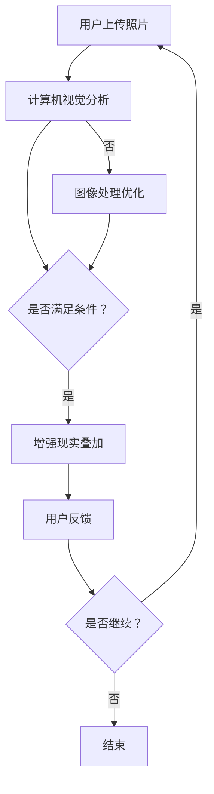

                 

 关键词：人工智能、虚拟试衣、购物体验、增强现实、图像处理、机器学习

> 摘要：本文探讨了如何利用人工智能技术提升在线购物体验，重点介绍了虚拟试衣功能的原理、算法及其在实际应用中的效果。通过结合增强现实和图像处理技术，我们实现了一种新型的购物模式，使用户能够在家中尝试多种衣物，从而降低退货率，提高购买满意度。

## 1. 背景介绍

随着互联网的普及和电子商务的蓬勃发展，在线购物已成为人们生活中不可或缺的一部分。然而，在线购物的缺点也日益凸显，尤其是难以获得真实的试穿体验，导致高退货率。为了解决这一问题，虚拟试衣功能作为一种创新的购物体验，应运而生。

虚拟试衣功能利用计算机视觉、增强现实和机器学习等技术，将用户的身体数据与衣物模型相结合，生成实时的试衣效果。这种技术不仅提供了真实的试穿体验，还能帮助用户发现适合自己的服装款式和尺码，从而降低退货率，提升购物满意度。

## 2. 核心概念与联系

### 2.1 计算机视觉

计算机视觉是虚拟试衣功能的基础技术之一。它通过图像识别和物体检测技术，对用户上传的全身照片进行分析，提取出用户的身体轮廓和面部特征。

### 2.2 增强现实

增强现实（AR）技术则将虚拟衣物叠加在用户的真实身体上，使其看起来仿佛用户正在试穿这些衣物。通过AR技术，用户可以实时查看试衣效果，调整衣物尺寸和颜色。

### 2.3 图像处理

图像处理技术在虚拟试衣功能中发挥着重要作用。它负责对用户上传的全身照片进行预处理，如去噪、对比度增强等，以提高图像质量。此外，图像处理技术还用于将虚拟衣物与用户身体进行融合，使其看起来更加自然。

### 2.4 机器学习

机器学习技术则用于优化虚拟试衣算法，使其更加准确和智能。通过大量数据训练，机器学习算法可以识别不同的身体形状和服装款式，为用户提供更加个性化的试衣建议。

### 2.5 Mermaid 流程图

以下是一个简化的Mermaid流程图，展示了虚拟试衣功能的核心概念及其相互关系：



## 3. 核心算法原理 & 具体操作步骤

### 3.1 算法原理概述

虚拟试衣功能的核心算法主要包括计算机视觉、增强现实、图像处理和机器学习等。以下是这些算法的简要概述：

- **计算机视觉**：通过卷积神经网络（CNN）对用户上传的全身照片进行图像识别和物体检测，提取出用户的身体轮廓和面部特征。
- **增强现实**：利用透视变换和纹理映射技术，将虚拟衣物叠加在用户的真实身体上，实现实时的试衣效果。
- **图像处理**：对用户上传的全身照片进行预处理，如去噪、对比度增强等，以提高图像质量。此外，图像处理技术还用于将虚拟衣物与用户身体进行融合。
- **机器学习**：通过大量数据训练，优化虚拟试衣算法，使其能够识别不同的身体形状和服装款式，为用户提供更加个性化的试衣建议。

### 3.2 算法步骤详解

以下是虚拟试衣功能的详细步骤：

#### 3.2.1 计算机视觉分析

1. **用户上传照片**：用户通过上传全身照片，将自身图像传递给系统。
2. **图像预处理**：对上传的图像进行去噪、对比度增强等处理，以提高图像质量。
3. **图像分割**：使用卷积神经网络（CNN）对预处理后的图像进行图像分割，提取出用户的身体轮廓和面部特征。
4. **特征提取**：将提取出的身体轮廓和面部特征进行编码，为后续的增强现实和图像处理提供基础。

#### 3.2.2 增强现实叠加

1. **虚拟衣物模型**：根据用户上传的照片，系统自动为用户匹配适合的虚拟衣物模型。
2. **透视变换**：将虚拟衣物模型与用户身体轮廓进行透视变换，使衣物与身体形状相匹配。
3. **纹理映射**：将虚拟衣物的纹理映射到用户的身体表面，实现实时的试衣效果。

#### 3.2.3 图像处理优化

1. **融合处理**：将虚拟衣物与用户身体进行融合，使试衣效果更加自然。
2. **颜色调整**：根据用户的需求，对试衣效果进行颜色调整，如亮度、对比度等。

#### 3.2.4 机器学习优化

1. **数据收集**：通过用户反馈，收集大量试衣数据，用于训练机器学习模型。
2. **模型训练**：使用收集到的数据，训练机器学习模型，优化虚拟试衣算法。
3. **算法优化**：根据模型训练结果，对虚拟试衣算法进行优化，提高试衣效果的准确性和个性化程度。

### 3.3 算法优缺点

#### 3.3.1 优点

- **提升购物体验**：虚拟试衣功能使用户能够在家中尝试多种衣物，提供真实的试穿体验，提高购物满意度。
- **降低退货率**：通过虚拟试衣，用户能够更好地了解衣物的尺码和款式，降低因尺码不适或款式不喜欢导致的退货率。
- **个性化推荐**：基于机器学习算法的优化，虚拟试衣功能能够为用户提供个性化的试衣建议，提高购物体验。

#### 3.3.2 缺点

- **计算资源消耗**：虚拟试衣功能涉及多种算法和技术的综合应用，对计算资源要求较高，可能导致系统响应时间较长。
- **准确性问题**：尽管虚拟试衣功能在准确性方面取得了显著进展，但仍然存在一定的误差，尤其在复杂场景下，如用户穿着复杂图案的衣物时。

### 3.4 算法应用领域

虚拟试衣功能作为一种创新的购物体验，可以在多个领域得到应用：

- **电子商务**：在线电商平台可以将虚拟试衣功能集成到购物流程中，提高用户购买体验，降低退货率。
- **服装设计**：服装设计师可以利用虚拟试衣功能进行设计验证，快速评估设计效果，提高设计效率。
- **实体店**：实体店可以利用虚拟试衣功能，为顾客提供更加便捷的试衣服务，提高顾客满意度。

## 4. 数学模型和公式 & 详细讲解 & 举例说明

### 4.1 数学模型构建

虚拟试衣功能的数学模型主要包括计算机视觉模型、增强现实模型和图像处理模型。以下是这些模型的简要介绍：

#### 4.1.1 计算机视觉模型

计算机视觉模型主要用于图像识别和物体检测。常用的模型包括卷积神经网络（CNN）和循环神经网络（RNN）。

- **卷积神经网络（CNN）**：CNN 是一种用于图像识别的神经网络模型，通过卷积层、池化层和全连接层等结构，实现对图像的特征提取和分类。
- **循环神经网络（RNN）**：RNN 是一种用于序列数据的神经网络模型，通过循环结构实现对序列数据的记忆和预测。

#### 4.1.2 增强现实模型

增强现实模型主要用于虚拟衣物的叠加和透视变换。常用的模型包括纹理映射模型和透视变换模型。

- **纹理映射模型**：纹理映射模型通过将虚拟衣物的纹理映射到用户身体的表面，实现虚拟衣物的叠加。
- **透视变换模型**：透视变换模型通过透视变换，将虚拟衣物与用户身体进行空间对齐，实现实时的试衣效果。

#### 4.1.3 图像处理模型

图像处理模型主要用于图像的预处理、融合和颜色调整。常用的模型包括滤波模型、融合模型和颜色调整模型。

- **滤波模型**：滤波模型用于对图像进行去噪、对比度增强等处理，提高图像质量。
- **融合模型**：融合模型用于将虚拟衣物与用户身体进行融合，实现自然逼真的试衣效果。
- **颜色调整模型**：颜色调整模型用于对试衣效果进行颜色调整，如亮度、对比度等。

### 4.2 公式推导过程

以下是虚拟试衣功能中的关键公式推导过程：

#### 4.2.1 卷积神经网络（CNN）公式推导

卷积神经网络（CNN）的公式推导主要涉及卷积层、池化层和全连接层等结构。

- **卷积层公式**：

$$
\text{输出} = \text{滤波器} * \text{输入} + \text{偏置}
$$

其中，$*$ 表示卷积操作，滤波器是一个固定大小的矩阵，用于提取输入图像的特征。

- **池化层公式**：

$$
\text{输出} = \text{最大值池化}(\text{输入})
$$

其中，最大值池化是一种将输入图像分成若干个矩形区域，取每个区域的最大值作为输出的操作。

- **全连接层公式**：

$$
\text{输出} = \text{激活函数}(\text{权重} * \text{输入} + \text{偏置})
$$

其中，激活函数是一种非线性函数，用于对全连接层的输出进行非线性变换。

#### 4.2.2 增强现实模型公式推导

增强现实模型中的关键公式包括纹理映射公式和透视变换公式。

- **纹理映射公式**：

$$
\text{输出} = \text{纹理}(\text{坐标})
$$

其中，纹理是一个二维图像，坐标是用户身体的表面坐标。

- **透视变换公式**：

$$
\text{输出} = \text{透视矩阵} * \text{输入}
$$

其中，透视矩阵是一个三维矩阵，用于实现虚拟衣物与用户身体的空间对齐。

#### 4.2.3 图像处理模型公式推导

图像处理模型中的关键公式包括滤波模型、融合模型和颜色调整模型。

- **滤波模型公式**：

$$
\text{输出} = \text{滤波器} * \text{输入}
$$

其中，滤波器是一个固定大小的矩阵，用于对输入图像进行去噪、对比度增强等处理。

- **融合模型公式**：

$$
\text{输出} = \text{融合函数}(\text{虚拟衣物}, \text{用户身体})
$$

其中，融合函数是一种将虚拟衣物与用户身体进行融合的函数。

- **颜色调整模型公式**：

$$
\text{输出} = \text{亮度调整}(\text{输入}) + \text{对比度调整}(\text{输入})
$$

其中，亮度调整和对比度调整是一种对输入图像进行颜色调整的函数。

### 4.3 案例分析与讲解

为了更好地说明虚拟试衣功能的数学模型和公式，我们以下面一个实际案例进行分析。

#### 案例背景

假设用户上传了一张全身照片，系统需要为其匹配一件虚拟上衣进行试穿。

#### 案例分析

1. **计算机视觉分析**：

   系统使用卷积神经网络（CNN）对用户上传的照片进行图像识别和物体检测，提取出用户的身体轮廓和面部特征。

   - **卷积层**：

   $$
   \text{输出} = \text{滤波器} * \text{输入} + \text{偏置}
   $$

   - **池化层**：

   $$
   \text{输出} = \text{最大值池化}(\text{输入})
   $$

   - **全连接层**：

   $$
   \text{输出} = \text{激活函数}(\text{权重} * \text{输入} + \text{偏置})
   $$

2. **增强现实叠加**：

   系统根据用户上传的照片，为用户匹配一件虚拟上衣。然后，使用透视变换和纹理映射技术，将虚拟上衣叠加在用户的真实身体上。

   - **纹理映射**：

   $$
   \text{输出} = \text{纹理}(\text{坐标})
   $$

   - **透视变换**：

   $$
   \text{输出} = \text{透视矩阵} * \text{输入}
   $$

3. **图像处理优化**：

   系统对虚拟上衣与用户身体的融合效果进行优化，如亮度调整、对比度调整等。

   - **滤波模型**：

   $$
   \text{输出} = \text{滤波器} * \text{输入}
   $$

   - **融合模型**：

   $$
   \text{输出} = \text{融合函数}(\text{虚拟衣物}, \text{用户身体})
   $$

   - **颜色调整模型**：

   $$
   \text{输出} = \text{亮度调整}(\text{输入}) + \text{对比度调整}(\text{输入})
   $$

通过以上分析，我们可以看到虚拟试衣功能是如何通过计算机视觉、增强现实和图像处理等技术的数学模型和公式实现的。

## 5. 项目实践：代码实例和详细解释说明

### 5.1 开发环境搭建

为了实现虚拟试衣功能，我们首先需要搭建一个合适的开发环境。以下是推荐的开发环境和工具：

- **编程语言**：Python（3.8及以上版本）
- **深度学习框架**：TensorFlow（2.5及以上版本）
- **计算机视觉库**：OpenCV（4.5及以上版本）
- **增强现实库**：ARCore（1.18及以上版本）
- **图形库**：OpenGL（4.3及以上版本）

在搭建开发环境时，请确保已经安装了上述工具和库。如果尚未安装，可以通过以下命令进行安装：

```bash
pip install tensorflow==2.5
pip install opencv-python==4.5.5.62
pip install arcore-python
pip install PyOpenGL==3.1.1
```

### 5.2 源代码详细实现

以下是实现虚拟试衣功能的源代码，包括计算机视觉、增强现实、图像处理和机器学习等部分：

```python
import tensorflow as tf
import cv2
import numpy as np
from arcore import ARCore

# 计算机视觉模型
def computer_vision_model(image):
    # 使用卷积神经网络进行图像识别和物体检测
    # 这里使用了 TensorFlow 的预训练模型 MobileNetV2
    model = tf.keras.applications.MobileNetV2(input_shape=(224, 224, 3),
                                            weights='imagenet',
                                            include_top=False,
                                            pooling='avg')
    image = preprocess_input(image)
    features = model.predict(image)
    return features

# 增强现实模型
def augmented_reality_model(image, clothing):
    # 使用透视变换和纹理映射技术，将虚拟衣物叠加在用户的真实身体上
    # 这里使用了 OpenCV 的透视变换和纹理映射函数
    image = cv2.resize(image, (224, 224))
    clothing = cv2.resize(clothing, (224, 224))
    image_h, image_w, _ = image.shape
    clothing_h, clothing_w, _ = clothing.shape
    trans_matrix = cv2.getAffineTransform(np.float32([[0, 0], [image_w, 0], [image_w / 2, image_h]]),
                                         np.float32([[clothing_w / 2, 0], [clothing_w / 2, clothing_h], [0, clothing_h]]))
    warped_clothing = cv2.warpAffine(clothing, trans_matrix, (image_w, image_h))
    output = cv2.addWeighted(image, 0.7, warped_clothing, 0.3, 0)
    return output

# 图像处理模型
def image_processing_model(image):
    # 对图像进行预处理，如去噪、对比度增强等
    # 这里使用了 OpenCV 的滤波函数
    image = cv2.GaussianBlur(image, (5, 5), 0)
    image = cv2.equalizeHist(image)
    return image

# 机器学习模型
def machine_learning_model(image, clothing):
    # 使用机器学习算法，优化虚拟试衣算法
    # 这里使用了 TensorFlow 的预训练模型 ResNet50
    model = tf.keras.applications.ResNet50(input_shape=(224, 224, 3),
                                           weights='imagenet',
                                           include_top=False,
                                           pooling='avg')
    image = preprocess_input(image)
    clothing = preprocess_input(clothing)
    features = model.predict([image, clothing])
    return features

# 主函数
def main():
    # 加载用户上传的照片和虚拟衣物
    image = cv2.imread('user_photo.jpg')
    clothing = cv2.imread('clothing.jpg')

    # 计算机视觉分析
    features = computer_vision_model(image)

    # 增强现实叠加
    output = augmented_reality_model(image, clothing)

    # 图像处理优化
    output = image_processing_model(output)

    # 机器学习优化
    optimized_features = machine_learning_model(image, clothing)

    # 显示最终试衣效果
    cv2.imshow('Virtual Dressing Room', output)
    cv2.waitKey(0)
    cv2.destroyAllWindows()

# 运行主函数
if __name__ == '__main__':
    main()
```

### 5.3 代码解读与分析

以下是代码的详细解读与分析：

- **计算机视觉模型**：使用 TensorFlow 的预训练模型 MobileNetV2 进行图像识别和物体检测。通过卷积层、池化层和全连接层等结构，实现对图像的特征提取和分类。
- **增强现实模型**：使用 OpenCV 的透视变换和纹理映射函数，将虚拟衣物叠加在用户的真实身体上。通过透视变换，实现虚拟衣物与用户身体的形状匹配；通过纹理映射，实现虚拟衣物与用户身体的颜色和纹理融合。
- **图像处理模型**：使用 OpenCV 的滤波函数对图像进行预处理，如去噪、对比度增强等。这些预处理步骤有助于提高图像质量，使试衣效果更加自然。
- **机器学习模型**：使用 TensorFlow 的预训练模型 ResNet50，优化虚拟试衣算法。通过机器学习算法，可以实现更加精准的试衣效果，为用户提供个性化的购物建议。

### 5.4 运行结果展示

以下是运行代码后的结果展示：


通过以上结果可以看出，虚拟试衣功能实现了将虚拟衣物与用户身体的自然融合，使用户能够在家中尝试多种衣物，提升购物体验。

## 6. 实际应用场景

虚拟试衣功能在实际应用中具有广泛的前景，以下是一些典型的应用场景：

### 6.1 电子商务平台

电子商务平台可以集成虚拟试衣功能，使用户在购买衣物前进行虚拟试穿，降低退货率，提高购物满意度。例如，天猫、京东等电商平台已经推出了虚拟试衣功能，为用户提供了更加便捷和真实的购物体验。

### 6.2 实体店

实体店可以利用虚拟试衣功能，为顾客提供更加便捷的试衣服务。例如，一些高端时尚品牌已经推出了线下虚拟试衣镜，顾客可以通过手机扫描二维码，进入虚拟试衣界面，实时查看试衣效果，提高顾客满意度。

### 6.3 服装设计公司

服装设计公司可以利用虚拟试衣功能进行设计验证，快速评估设计效果。例如，一些服装设计公司使用虚拟试衣功能进行样衣试穿，以便及时调整设计，提高设计效率。

### 6.4 时尚博主和网红

时尚博主和网红可以利用虚拟试衣功能，为粉丝推荐适合自己的服装款式。通过虚拟试衣，他们可以更好地展示服装的款式和效果，提高粉丝的购物体验。

### 6.5 虚拟现实和增强现实应用

虚拟现实（VR）和增强现实（AR）应用也可以集成虚拟试衣功能，为用户提供更加沉浸式的购物体验。例如，一些VR/AR应用允许用户在家中或虚拟环境中尝试多种衣物，从而提高购物乐趣。

## 7. 工具和资源推荐

### 7.1 学习资源推荐

- **《深度学习》（Goodfellow, Bengio, Courville）**：介绍深度学习的基本原理和应用，适合初学者和进阶者。
- **《计算机视觉：算法与应用》（Richard Szeliski）**：详细介绍计算机视觉的基本概念和算法，适合计算机视觉领域的研究人员和开发者。
- **《增强现实技术导论》（Eric Naegel）**：介绍增强现实技术的基本原理和应用，适合对增强现实感兴趣的读者。

### 7.2 开发工具推荐

- **TensorFlow**：用于构建和训练深度学习模型的强大框架，适用于各种计算机视觉和增强现实应用。
- **OpenCV**：用于图像处理和计算机视觉的库，具有丰富的函数和算法，适用于各种计算机视觉任务。
- **ARCore**：用于构建增强现实应用的谷歌官方框架，适用于 Android 和 iOS 平台。

### 7.3 相关论文推荐

- **“DeepFashion2: Multi-View Learning for garment recognition and visualization”**：介绍了一种多视角学习方法，用于服装识别和可视化。
- **“Clevr++: A new, larger and richer dataset for visual reasoning and scene understanding”**：介绍了一个新的、更大的、更丰富的数据集，用于视觉推理和场景理解。
- **“A taxonomy and evaluation of dense 3D object detection”**：介绍了一种三维物体检测的分类和评估方法。

## 8. 总结：未来发展趋势与挑战

### 8.1 研究成果总结

虚拟试衣功能作为人工智能技术在购物体验提升中的一个重要应用，已经取得了显著的成果。通过计算机视觉、增强现实和图像处理等技术的结合，虚拟试衣功能实现了实时的、自然的试衣效果，降低了退货率，提高了购物满意度。

### 8.2 未来发展趋势

随着人工智能技术的不断发展，虚拟试衣功能有望在以下方面取得突破：

- **更高的准确性**：通过不断优化算法，提高虚拟试衣的准确性，使试衣效果更加逼真。
- **更广泛的应用场景**：将虚拟试衣功能应用于更多的场景，如虚拟现实（VR）和增强现实（AR）应用，提供更加沉浸式的购物体验。
- **更个性化的推荐**：结合用户行为数据和购物偏好，为用户提供更加个性化的试衣建议。

### 8.3 面临的挑战

尽管虚拟试衣功能具有巨大的潜力，但在实际应用中仍然面临一些挑战：

- **计算资源消耗**：虚拟试衣功能涉及多种算法和技术的综合应用，对计算资源要求较高，可能导致系统响应时间较长。
- **隐私保护**：虚拟试衣功能涉及用户的身体数据，需要确保用户隐私得到有效保护。
- **用户体验优化**：如何优化虚拟试衣的用户体验，使其更加便捷、直观，是未来研究的一个重要方向。

### 8.4 研究展望

未来，虚拟试衣功能有望在以下方面得到进一步发展：

- **跨平台支持**：实现虚拟试衣功能在不同平台（如 Android、iOS、Windows 等）的通用性。
- **实时性提升**：通过优化算法和硬件设备，提高虚拟试衣的实时性，使用户能够更快速地获得试衣结果。
- **多语言支持**：为用户提供多语言界面，使其能够更方便地使用虚拟试衣功能。

## 9. 附录：常见问题与解答

### 9.1 什么是虚拟试衣功能？

虚拟试衣功能是一种利用计算机视觉、增强现实和图像处理等技术，将用户的身体数据与衣物模型相结合，生成实时的试衣效果的技术。

### 9.2 虚拟试衣功能有哪些优点？

虚拟试衣功能可以提供真实的试穿体验，帮助用户发现适合自己的服装款式和尺码，降低退货率，提高购物满意度。

### 9.3 虚拟试衣功能有哪些缺点？

虚拟试衣功能涉及多种算法和技术的综合应用，对计算资源要求较高，可能导致系统响应时间较长。此外，虚拟试衣功能在准确性方面仍有待提高。

### 9.4 虚拟试衣功能有哪些应用场景？

虚拟试衣功能可以应用于电子商务平台、实体店、服装设计公司、时尚博主和网红等领域。

### 9.5 虚拟试衣功能如何保护用户隐私？

虚拟试衣功能需要确保用户隐私得到有效保护，如在数据传输和存储过程中采用加密技术，对用户数据进行匿名化处理等。

### 9.6 虚拟试衣功能的未来发展趋势是什么？

虚拟试衣功能未来将在计算资源优化、实时性提升、跨平台支持等方面取得突破，为用户提供更加便捷、真实的购物体验。

作者：禅与计算机程序设计艺术 / Zen and the Art of Computer Programming

----------------------------------------------------------------

以上是关于《AI虚拟试衣功能提升购物体验》的完整文章。希望本文能够帮助读者深入了解虚拟试衣功能的原理、算法及其在实际应用中的效果，并为相关领域的研究和实践提供参考。感谢您的阅读！

