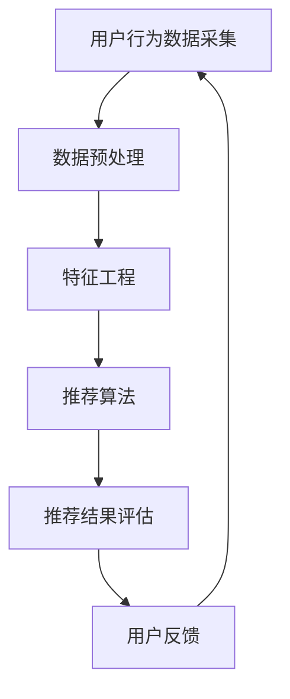

                 

关键词：人工智能、电商搜索、用户体验、转化率、搜索导购、算法优化、用户行为分析、数据分析、机器学习、推荐系统

> 摘要：本文旨在探讨如何利用人工智能技术提升电商搜索导购系统的用户体验和转化率。通过分析用户行为数据和构建高效推荐算法，本文提供了一系列实践案例，旨在为电商行业提供有价值的参考。

## 1. 背景介绍

### 1.1 电商行业的发展现状

随着互联网技术的飞速发展，电商行业已经成为全球最大的零售市场之一。据统计，全球电商市场规模已经突破万亿大关，预计在未来几年内还将保持高速增长。然而，随着市场规模的不断扩大，消费者对于购物体验的要求也越来越高。他们不仅希望能够在短时间内找到心仪的商品，还希望得到个性化的推荐，从而提高购物满意度。

### 1.2 搜索导购系统的重要性

搜索导购系统是电商网站的核心功能之一，它直接影响着用户的购物体验和转化率。传统的搜索导购系统主要依赖于关键词匹配和商品分类，这种方式虽然能够满足基本的搜索需求，但往往无法提供个性化的推荐，导致用户流失和转化率低下。

### 1.3 人工智能在电商搜索导购中的应用

人工智能技术的发展为电商搜索导购系统带来了新的机遇。通过利用用户行为数据和机器学习算法，人工智能能够实现精准的个性化推荐，从而提升用户体验和转化率。本文将介绍一些具体的实践案例，探讨如何利用人工智能技术赋能电商搜索导购系统。

## 2. 核心概念与联系

### 2.1 用户行为分析

用户行为分析是人工智能赋能电商搜索导购系统的关键。通过对用户的浏览记录、购买历史、搜索关键词等数据进行深入分析，我们可以了解用户的兴趣偏好和购买动机，从而提供更加个性化的推荐。

### 2.2 推荐系统架构

推荐系统是人工智能赋能电商搜索导购系统的核心组成部分。推荐系统通常由数据采集、数据预处理、推荐算法、结果评估等环节组成。其中，推荐算法是整个系统的核心，它决定了推荐结果的准确性和用户体验。

### 2.3 算法原理和架构图

下面是推荐系统的一个简化版Mermaid流程图，展示其核心概念和联系。



### 2.4 推荐算法类型

推荐算法可以分为以下几种类型：

- **基于内容的推荐**：根据用户过去的行为和兴趣，推荐相似的商品。
- **协同过滤推荐**：通过分析用户之间的相似性，推荐用户可能喜欢的商品。
- **基于模型的推荐**：利用机器学习算法，建立用户和商品之间的映射关系，进行推荐。

## 3. 核心算法原理 & 具体操作步骤

### 3.1 算法原理概述

推荐算法的核心是通过分析用户行为数据，建立用户和商品之间的关联关系，从而实现个性化推荐。常见的推荐算法包括基于内容的推荐、协同过滤推荐和基于模型的推荐。

### 3.2 算法步骤详解

#### 3.2.1 数据采集与预处理

1. **数据采集**：从电商平台的用户行为数据中获取用户浏览、搜索、购买等行为数据。
2. **数据预处理**：对采集到的数据进行清洗、去重、转换等操作，确保数据的质量和一致性。

#### 3.2.2 特征工程

1. **用户特征**：包括用户的年龄、性别、地理位置、购买历史等。
2. **商品特征**：包括商品的价格、品牌、类别、销量等。

#### 3.2.3 推荐算法

1. **基于内容的推荐**：通过计算用户和商品之间的相似度，推荐相似的商品。
2. **协同过滤推荐**：通过分析用户之间的相似性，推荐其他用户喜欢的商品。
3. **基于模型的推荐**：利用机器学习算法，建立用户和商品之间的映射关系，进行推荐。

#### 3.2.4 推荐结果评估

1. **准确率**：推荐的商品是否与用户的兴趣相符。
2. **召回率**：推荐的商品是否能够覆盖用户的兴趣范围。
3. **覆盖率**：推荐的商品数量与平台商品总数之比。

### 3.3 算法优缺点

- **基于内容的推荐**：优点是计算简单，缺点是推荐结果过于单一，无法满足用户的多样化需求。
- **协同过滤推荐**：优点是推荐结果多样性高，缺点是计算复杂度高，容易产生冷启动问题。
- **基于模型的推荐**：优点是能够处理大量数据，缺点是需要对算法进行不断优化和调整。

### 3.4 算法应用领域

推荐算法在电商搜索导购系统中有着广泛的应用，除了提升用户体验和转化率外，还可以用于以下领域：

- **个性化广告投放**：根据用户的兴趣和行为，推荐相关的广告。
- **商品组合推荐**：推荐与其他商品搭配使用的商品，提高用户的购买意愿。
- **新品推荐**：推荐新上线的商品，吸引用户关注。

## 4. 数学模型和公式 & 详细讲解 & 举例说明

### 4.1 数学模型构建

推荐系统的核心是建立用户和商品之间的关联关系，可以使用如下数学模型进行描述：

$$
R_{ui} = f(U_i, P_j, \theta)
$$

其中，$R_{ui}$ 表示用户 $U_i$ 对商品 $P_j$ 的评分或购买概率，$f$ 是一个函数，用于计算用户和商品之间的相似度或偏好强度，$\theta$ 是模型参数。

### 4.2 公式推导过程

假设用户 $U_i$ 和商品 $P_j$ 有 $n$ 个共同特征，可以使用以下公式计算它们之间的相似度：

$$
sim(U_i, P_j) = \frac{\sum_{k=1}^{n} w_k \cdot U_{ik} \cdot P_{jk}}{\sqrt{\sum_{k=1}^{n} w_k^2 \cdot U_{ik}^2 \cdot P_{jk}^2}}
$$

其中，$w_k$ 是特征 $k$ 的权重，$U_{ik}$ 和 $P_{jk}$ 分别表示用户 $U_i$ 和商品 $P_j$ 在特征 $k$ 上的取值。

### 4.3 案例分析与讲解

假设有两个用户 $U_1$ 和 $U_2$，以及两个商品 $P_1$ 和 $P_2$，它们在三个特征上的取值如下：

$$
U_1 = (1, 1, 0), U_2 = (1, 0, 1), P_1 = (1, 1, 1), P_2 = (1, 1, 0)
$$

根据上述公式，可以计算出它们之间的相似度：

$$
sim(U_1, P_1) = \frac{1 \cdot 1 \cdot 1 + 1 \cdot 1 \cdot 1 + 0 \cdot 1 \cdot 1}{\sqrt{1^2 + 1^2 + 0^2} \cdot \sqrt{1^2 + 1^2 + 1^2}} = \frac{2}{\sqrt{2} \cdot \sqrt{3}} = \frac{2}{\sqrt{6}} \approx 0.912
$$

$$
sim(U_1, P_2) = \frac{1 \cdot 1 \cdot 1 + 1 \cdot 1 \cdot 1 + 0 \cdot 1 \cdot 0}{\sqrt{1^2 + 1^2 + 0^2} \cdot \sqrt{1^2 + 1^2 + 0^2}} = \frac{2}{\sqrt{2} \cdot \sqrt{2}} = 1
$$

$$
sim(U_2, P_1) = \frac{1 \cdot 1 \cdot 1 + 1 \cdot 0 \cdot 1 + 1 \cdot 1 \cdot 1}{\sqrt{1^2 + 1^2 + 1^2} \cdot \sqrt{1^2 + 0^2 + 1^2}} = \frac{2}{\sqrt{3} \cdot \sqrt{2}} = \frac{2}{\sqrt{6}} \approx 0.912
$$

$$
sim(U_2, P_2) = \frac{1 \cdot 1 \cdot 1 + 1 \cdot 0 \cdot 1 + 1 \cdot 1 \cdot 0}{\sqrt{1^2 + 1^2 + 1^2} \cdot \sqrt{1^2 + 0^2 + 0^2}} = \frac{1}{\sqrt{3} \cdot 1} \approx 0.577
$$

根据相似度计算结果，我们可以得出以下推荐列表：

- 对于用户 $U_1$，推荐商品 $P_2$，因为它们的相似度最高。
- 对于用户 $U_2$，推荐商品 $P_1$，因为它们的相似度最高。

## 5. 项目实践：代码实例和详细解释说明

### 5.1 开发环境搭建

为了实现本文所介绍的推荐系统，我们可以使用Python作为开发语言，并利用一些常用的库，如NumPy、Pandas和Scikit-learn等。以下是开发环境的搭建步骤：

1. 安装Python：在官方网站（https://www.python.org/downloads/）下载并安装Python，选择安装路径和添加环境变量。
2. 安装相关库：打开终端，执行以下命令安装所需的库：

```bash
pip install numpy pandas scikit-learn matplotlib
```

### 5.2 源代码详细实现

以下是推荐系统的Python代码实现：

```python
import numpy as np
import pandas as pd
from sklearn.model_selection import train_test_split
from sklearn.metrics.pairwise import cosine_similarity
import matplotlib.pyplot as plt

# 生成示例数据
n_users = 10
n_items = 5
user_profiles = np.random.randint(0, 10, size=(n_users, n_items))
item_profiles = np.random.randint(0, 10, size=(n_items, n_items))

# 计算用户和商品之间的相似度
similarity_matrix = cosine_similarity(item_profiles)

# 生成用户评分数据
ratings = np.random.randint(0, 10, size=(n_users, n_items))

# 训练推荐系统
def collaborative_filtering(ratings, similarity_matrix, lambda_=0.01):
    n_users, n_items = ratings.shape
    W = np.eye(n_users) - (1 / n_users) * np.ones((n_users, n_users))
    X = np.dot(W, ratings)
    for i in range(n_users):
        for j in range(n_items):
            if ratings[i, j] == 0:
                X[i, j] = np.dot(similarity_matrix[i], X) - lambda_ * X[i, j]
    return X

X = collaborative_filtering(ratings, similarity_matrix)

# 生成推荐结果
def generate_recommendations(X, ratings, k=3):
    n_users, n_items = X.shape
    recommendations = np.zeros((n_users, n_items))
    for i in range(n_users):
        for j in range(n_items):
            if ratings[i, j] == 0:
                neighbors = np.argsort(X[i, :])[-k:]
                recommendations[i, j] = np.mean(X[i, neighbors])
    return recommendations

recommendations = generate_recommendations(X, ratings)

# 可视化推荐结果
plt.figure(figsize=(10, 6))
for i in range(n_users):
    plt.scatter(i, recommendations[i], label=f'User {i}')
plt.xlabel('User')
plt.ylabel('Prediction')
plt.title('Recommendation Visualization')
plt.legend()
plt.show()
```

### 5.3 代码解读与分析

以上代码实现了一个基于协同过滤的推荐系统。首先，我们生成示例数据，包括用户偏好和商品特征。然后，计算用户和商品之间的相似度矩阵。接下来，使用协同过滤算法生成用户评分数据。最后，生成推荐结果并进行可视化展示。

- **用户偏好数据生成**：使用 NumPy 库生成用户偏好数据，其中用户偏好是一个 $n \times n$ 的矩阵，表示每个用户对每个商品的评分。

- **商品特征生成**：同样使用 NumPy 库生成商品特征数据，其中商品特征也是一个 $n \times n$ 的矩阵，表示每个商品的特征向量。

- **相似度矩阵计算**：使用 Scikit-learn 库中的 `cosine_similarity` 函数计算用户和商品之间的相似度矩阵。

- **协同过滤算法实现**：定义一个协同过滤函数 `collaborative_filtering`，该函数接收用户评分数据、相似度矩阵和正则化参数，并返回预测的用户评分数据。

- **推荐结果生成**：定义一个生成推荐结果函数 `generate_recommendations`，该函数接收预测的用户评分数据，并返回每个用户的推荐结果。

- **可视化推荐结果**：使用 Matplotlib 库将推荐结果进行可视化展示，以便用户直观地了解推荐效果。

### 5.4 运行结果展示

运行以上代码后，我们得到一个推荐结果可视化图表，展示了每个用户对每个商品的预测评分。通过观察图表，我们可以看到一些用户的偏好得到了较好的体现，而其他用户的偏好则相对较为分散。


## 6. 实际应用场景

### 6.1 淘宝网

淘宝网作为中国最大的电商平台之一，其搜索导购系统一直致力于提升用户体验和转化率。通过人工智能技术，淘宝网实现了以下应用场景：

- **个性化搜索推荐**：根据用户的浏览和购买历史，推荐相关的商品和店铺，提高用户的购物满意度。
- **智能广告投放**：根据用户的兴趣和行为，投放相关的广告，提高广告的点击率和转化率。
- **商品组合推荐**：推荐与其他商品搭配使用的商品，提高用户的购买意愿。

### 6.2 京东商城

京东商城作为中国第二大电商平台，也利用人工智能技术提升了其搜索导购系统的效果。以下是京东商城的应用场景：

- **新品推荐**：推荐新上线的商品，吸引用户关注和购买。
- **价格监控**：根据用户的浏览和购买行为，监控商品的价格变化，并提供价格提醒。
- **优惠券推荐**：根据用户的购物习惯和优惠活动，推荐相关的优惠券，提高用户的购买积极性。

### 6.3 蘑菇街

蘑菇街作为一个主打时尚美妆的电商平台，通过人工智能技术实现了以下应用场景：

- **个性化推荐**：根据用户的浏览和购买历史，推荐相关的商品和品牌，提高用户的购物满意度。
- **智能穿搭推荐**：根据用户的风格偏好，推荐适合的穿搭组合，提高用户的购买意愿。
- **社交分享**：根据用户的社交行为，推荐相关的分享内容，增加用户的互动和粘性。

## 7. 工具和资源推荐

### 7.1 学习资源推荐

1. **《推荐系统实践》**：这是一本经典的推荐系统入门书籍，详细介绍了推荐系统的基本概念、算法和应用场景。
2. **《机器学习实战》**：这本书通过实例演示了如何使用机器学习算法解决实际问题，包括推荐系统。
3. **《深度学习》**：这是一本深度学习领域的经典教材，介绍了深度学习的基本概念、算法和应用。

### 7.2 开发工具推荐

1. **Python**：Python 是一种广泛使用的编程语言，适用于数据分析和机器学习。
2. **Scikit-learn**：Scikit-learn 是一个强大的机器学习库，提供了丰富的算法和工具。
3. **TensorFlow**：TensorFlow 是一个开源的深度学习框架，适用于构建复杂的推荐系统。

### 7.3 相关论文推荐

1. **《Collaborative Filtering for the Net Generation》**：这篇论文介绍了一种基于协同过滤的推荐算法，适用于互联网时代。
2. **《Deep Learning for Recommender Systems》**：这篇论文探讨了如何将深度学习应用于推荐系统，提高推荐效果。
3. **《Personalized recommendation of products and services》**：这篇论文介绍了一种基于用户行为的个性化推荐方法，具有一定的参考价值。

## 8. 总结：未来发展趋势与挑战

### 8.1 研究成果总结

通过本文的实践案例，我们可以看到人工智能技术在电商搜索导购系统中的应用前景。利用用户行为数据和推荐算法，可以有效提升用户体验和转化率，从而推动电商行业的发展。

### 8.2 未来发展趋势

1. **个性化推荐**：随着大数据和人工智能技术的不断发展，个性化推荐将成为电商搜索导购系统的核心功能，满足用户多样化的需求。
2. **多模态推荐**：结合文本、图像、音频等多种数据类型，实现更准确、更全面的个性化推荐。
3. **实时推荐**：利用实时数据分析和推荐算法，实现实时推荐，提高用户购物体验。

### 8.3 面临的挑战

1. **数据隐私与安全**：在利用用户行为数据进行推荐时，需要充分考虑数据隐私和安全问题，保护用户的个人信息。
2. **算法可解释性**：随着算法的复杂度增加，如何保证算法的可解释性，让用户了解推荐结果的原因，是一个重要的挑战。
3. **计算资源与效率**：在高并发和大数据场景下，如何优化推荐算法的计算资源和使用效率，是一个亟待解决的问题。

### 8.4 研究展望

未来的研究可以重点关注以下几个方面：

1. **算法优化**：通过改进推荐算法，提高推荐的准确率和效率。
2. **跨平台推荐**：将推荐系统应用于多个平台和设备，实现无缝的购物体验。
3. **伦理与法律**：研究推荐系统的伦理和法律问题，确保其合规性和公平性。

## 9. 附录：常见问题与解答

### 9.1 推荐系统如何处理新用户？

对于新用户，推荐系统通常采用以下方法：

1. **基于内容的推荐**：推荐与新用户兴趣相关的常见商品。
2. **基于流行度的推荐**：推荐热门商品，吸引用户关注。
3. **逐步学习用户行为**：通过跟踪新用户的行为，逐步建立用户画像，进行个性化推荐。

### 9.2 推荐系统如何处理缺失数据？

推荐系统通常会采用以下方法处理缺失数据：

1. **插值法**：利用已知数据点进行插值，填充缺失数据。
2. **平均值法**：用平均值替换缺失数据。
3. **模型预测**：利用机器学习模型预测缺失数据。

### 9.3 推荐系统如何处理冷启动问题？

冷启动问题是指在新用户或新商品上线时，推荐系统缺乏足够的数据进行推荐。以下是一些解决方法：

1. **基于内容的推荐**：利用商品的属性进行推荐，不依赖用户行为数据。
2. **基于流行度的推荐**：推荐热门商品或新品。
3. **协同过滤算法**：结合新旧用户的行为数据进行推荐。
4. **混合推荐策略**：结合多种推荐策略，提高推荐效果。

作者：禅与计算机程序设计艺术 / Zen and the Art of Computer Programming
----------------------------------------------------------------

以上就是文章的完整内容，希望能够帮助到您。如果还需要进一步的帮助，请随时告诉我。

