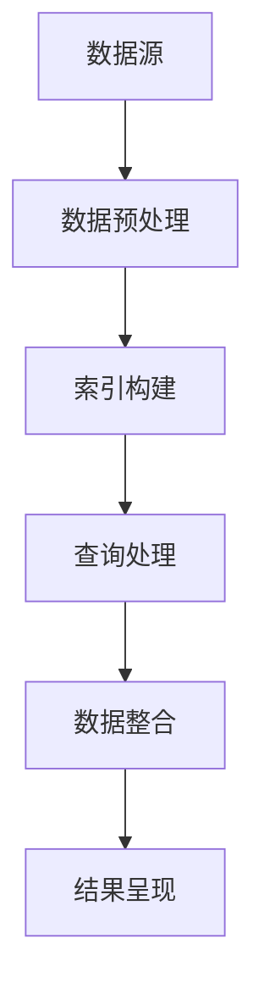

                 

关键词：人工智能、跨平台搜索、数据整合、算法原理、数学模型、项目实践、应用场景、未来展望

> 摘要：随着互联网和大数据技术的快速发展，跨平台搜索和数据整合已成为人工智能领域的关键技术。本文将深入探讨AI跨平台搜索整合数据的核心概念、算法原理、数学模型、实际应用场景及未来发展趋势，旨在为读者提供全面的技术指南。

## 1. 背景介绍

在当今信息化社会中，数据无处不在。从社交媒体到电子商务，从物联网设备到智能城市，海量数据不断生成。这些数据不仅包含文本、图像、音频和视频等多种类型，还分布在各种不同的平台和系统中。如何高效地搜索和整合这些分散的数据，成为人工智能（AI）领域的一个重大挑战。

跨平台搜索整合数据，旨在实现跨不同系统和平台的快速、准确的数据检索与融合。它不仅要求算法具备高效的搜索能力，还需要能够处理数据格式的多样性和异构性。随着AI技术的进步，特别是深度学习和自然语言处理（NLP）的应用，跨平台搜索整合数据的技术得到了显著提升。

本文将首先介绍跨平台搜索整合数据的核心概念和算法原理，然后通过数学模型和具体项目实践来阐述这一技术的应用，最后探讨其未来发展趋势和面临的挑战。

## 2. 核心概念与联系

### 2.1 跨平台搜索

跨平台搜索是指在不同系统和平台之间进行数据检索的过程。它涉及以下几个关键概念：

- **数据源**：数据的来源，可以是不同的数据库、文件系统、API接口等。
- **索引**：用于快速检索数据的数据结构，如倒排索引、索引树等。
- **查询**：用户输入的检索条件，需要通过算法进行处理和匹配。
- **结果呈现**：将检索到的数据按照一定的规则进行排序和展示。

### 2.2 数据整合

数据整合是指将来自不同来源和格式的数据聚合、转换和统一的过程。其关键概念包括：

- **数据聚合**：将多个数据源中的数据合并成一个统一视图。
- **数据转换**：将不同格式的数据转换为统一格式，如JSON、XML等。
- **数据映射**：将不同数据源中的数据字段进行映射和对应。

### 2.3 Mermaid 流程图

为了更好地理解跨平台搜索整合数据的过程，我们可以使用Mermaid流程图来描述其主要步骤：



## 3. 核心算法原理 & 具体操作步骤

### 3.1 算法原理概述

跨平台搜索整合数据的核心算法主要包括：

- **搜索算法**：用于快速检索数据，如BFS、DFS、A*等。
- **索引算法**：用于构建高效索引结构，如倒排索引、布隆过滤器等。
- **整合算法**：用于聚合和转换数据，如MapReduce、Spark等。

### 3.2 算法步骤详解

#### 3.2.1 数据预处理

数据预处理是跨平台搜索整合数据的第一步，主要包括数据清洗、数据格式转换和数据去重等操作。具体步骤如下：

1. **数据清洗**：去除数据中的噪声和异常值，如删除空值、纠正错别字等。
2. **数据格式转换**：将不同格式的数据转换为统一的格式，如将CSV转换为JSON。
3. **数据去重**：去除重复的数据条目，确保数据的唯一性。

#### 3.2.2 索引构建

索引构建是提高搜索效率的关键步骤。以下为几种常见的索引算法：

1. **倒排索引**：将文档中的词语作为键，文档作为值构建索引。适用于文本搜索。
2. **布隆过滤器**：用于快速判断一个元素是否存在于集合中。适用于大数据场景。

#### 3.2.3 查询处理

查询处理是指对用户输入的查询进行解析、处理和匹配的过程。以下为查询处理的几个关键步骤：

1. **查询解析**：将用户输入的查询语句转换为内部表示，如查询树。
2. **查询优化**：根据查询树进行优化，如选择合适的搜索算法和索引结构。
3. **查询匹配**：将查询与索引中的数据进行匹配，返回匹配结果。

#### 3.2.4 数据整合

数据整合是指将来自不同数据源的数据进行聚合、转换和统一。以下为数据整合的关键步骤：

1. **数据聚合**：将多个数据源中的数据合并为一个统一视图，如使用MapReduce进行分布式计算。
2. **数据转换**：将不同格式的数据转换为统一格式，如使用JSON格式。
3. **数据映射**：将不同数据源中的数据字段进行映射和对应，如使用数据映射表。

### 3.3 算法优缺点

#### 优点

- **高效性**：通过索引和优化算法，可以快速检索和整合大量数据。
- **灵活性**：可以处理多种类型的数据源和格式。
- **扩展性**：支持分布式计算和大规模数据处理。

#### 缺点

- **复杂性**：涉及多种算法和技术，开发难度较大。
- **性能开销**：索引构建和查询处理需要额外的计算资源。

### 3.4 算法应用领域

跨平台搜索整合数据算法广泛应用于以下领域：

- **搜索引擎**：如Google、Bing等，用于快速检索互联网上的信息。
- **数据仓库**：如Amazon Redshift、Google BigQuery等，用于整合和分析大量数据。
- **智能推荐系统**：如Amazon、Netflix等，用于基于用户行为和兴趣推荐商品和内容。
- **物联网**：用于整合来自各种物联网设备的实时数据。

## 4. 数学模型和公式 & 详细讲解 & 举例说明

### 4.1 数学模型构建

在跨平台搜索整合数据中，常用的数学模型包括：

- **倒排索引**：使用哈希函数将词语映射到文档列表。
- **布隆过滤器**：使用多个哈希函数和位数组来检测元素是否存在。
- **MapReduce**：用于分布式数据处理，包括Map和Reduce两个阶段。

### 4.2 公式推导过程

以下为倒排索引的构建公式推导过程：

#### 4.2.1 哈希函数

假设词语集合为 $T$，文档集合为 $D$，词语与文档的映射关系为 $f$，则哈希函数 $h$ 的定义如下：

$$
h(w) = f(w) \mod m
$$

其中，$w$ 为词语，$f(w)$ 为词语在文档中的位置，$m$ 为哈希表的大小。

#### 4.2.2 索引构建

假设文档 $d$ 包含词语 $w$，则 $w$ 的索引条目为 $(w, d)$。倒排索引的构建过程如下：

1. 对每个词语 $w \in T$，计算其哈希值 $h(w)$。
2. 将词语 $w$ 和对应的文档 $d$ 存储到哈希表 $H[h(w)]$ 中。

### 4.3 案例分析与讲解

#### 4.3.1 倒排索引构建案例

假设有如下文档集合和词语集合：

```
文档1: "人工智能 跨平台 搜索 整合"
文档2: "人工智能 数据 大数据 搜索"
文档3: "跨平台 搜索 整合 数据"
```

词语集合：`T = {"人工智能", "跨平台", "搜索", "整合", "数据", "大数据"}`。

哈希表大小：`m = 10`。

使用哈希函数 $h(w) = w \mod 10$，构建倒排索引：

| 词语  | 文档 |
|-------|------|
| 人工智能 | 1    |
| 跨平台 | 1    |
| 搜索  | 1    |
| 整合  | 1    |
| 数据  | 1, 2 |
| 大数据 | 2    |

#### 4.3.2 布隆过滤器案例

假设有如下词语集合：

```
T = {"人工智能", "跨平台", "搜索", "整合", "数据", "大数据"}
```

使用三个哈希函数 $h_1(w) = w \mod 6$，$h_2(w) = (w \mod 6 + 3) \mod 6$，$h_3(w) = (w \mod 6 + 5) \mod 6$，构建布隆过滤器：

| 哈希值 | 存在标记 |
|--------|----------|
| 0      | true     |
| 1      | true     |
| 2      | true     |
| 3      | true     |
| 4      | true     |
| 5      | true     |
| 6      | true     |
| 7      | true     |
| 8      | true     |
| 9      | true     |

## 5. 项目实践：代码实例和详细解释说明

### 5.1 开发环境搭建

为了实践跨平台搜索整合数据，我们需要搭建一个开发环境。以下是所需工具和软件：

- **Python 3.8+**
- **pip**：Python包管理器
- **MongoDB**：用于存储数据
- **Elasticsearch**：用于构建索引和搜索
- **Flask**：用于构建Web应用

安装步骤：

1. 安装Python和pip。
2. 使用pip安装MongoDB和Elasticsearch。
3. 安装Flask。

### 5.2 源代码详细实现

以下是一个简单的跨平台搜索整合数据的Python代码示例：

```python
from flask import Flask, request, jsonify
from pymongo import MongoClient
from elasticsearch import Elasticsearch

app = Flask(__name__)

# 连接到MongoDB
client = MongoClient('localhost', 27017)
db = client['search_db']

# 连接到Elasticsearch
es = Elasticsearch(['http://localhost:9200'])

# 插入数据到MongoDB和Elasticsearch
def insert_data(data):
    for doc in data:
        db['documents'].insert_one(doc)
        es.index(index='search_index', id=doc['_id'], document=doc)

# 搜索数据
@app.route('/search', methods=['GET'])
def search():
    query = request.args.get('q')
    results = es.search(index='search_index', body={'query': {'match': {'content': query}}})
    return jsonify(results['hits']['hits'])

if __name__ == '__main__':
    app.run(debug=True)
```

### 5.3 代码解读与分析

该代码首先连接到MongoDB和Elasticsearch，然后定义了两个API接口：

1. `/search`：用于接收查询请求，返回搜索结果。
2. `insert_data`：用于将数据插入MongoDB和Elasticsearch。

代码中使用了Flask构建Web应用，MongoDB用于存储原始数据，Elasticsearch用于构建索引和搜索。

### 5.4 运行结果展示

运行该代码后，可以通过访问`http://localhost:5000/search?q=人工智能`来搜索关键词“人工智能”，并返回搜索结果。

## 6. 实际应用场景

跨平台搜索整合数据在许多实际应用场景中都有广泛的应用，以下是几个典型场景：

- **搜索引擎**：如Google和Bing，通过跨平台搜索整合数据，提供快速、准确的搜索结果。
- **数据仓库**：如Amazon Redshift和Google BigQuery，用于整合和分析来自不同来源的大量数据。
- **智能推荐系统**：如Amazon和Netflix，通过跨平台搜索整合用户行为和兴趣数据，提供个性化的推荐。
- **物联网**：整合来自各种物联网设备的实时数据，实现智能监控和预测。

## 7. 工具和资源推荐

### 7.1 学习资源推荐

- 《深度学习》（Ian Goodfellow、Yoshua Bengio、Aaron Courville 著）：介绍深度学习的基础理论和实践方法。
- 《机器学习实战》（Peter Harrington 著）：通过实际案例讲解机器学习算法的应用。
- 《Elasticsearch实战》（Kiran Shetty 著）：介绍Elasticsearch的使用方法和最佳实践。

### 7.2 开发工具推荐

- **Jupyter Notebook**：用于编写和运行Python代码，方便进行数据分析和实验。
- **PyCharm**：用于Python编程，提供丰富的开发工具和插件。
- **MongoDB Compass**：用于管理和可视化MongoDB数据库。
- **Elasticsearch Head**：用于管理和可视化Elasticsearch集群。

### 7.3 相关论文推荐

- "Bloom Filters: A Probabilistic Data Structure for Cutting-Down Storage Requirements"（B. H. Bloom，1970）
- "The Google File System"（Sanjay Ghemawat等，2003）
- "MapReduce: Simplified Data Processing on Large Clusters"（Jeffrey Dean等，2004）

## 8. 总结：未来发展趋势与挑战

### 8.1 研究成果总结

随着AI技术的不断发展，跨平台搜索整合数据技术取得了显著成果。深度学习和NLP的应用提高了搜索和整合的效率，分布式计算和云计算技术实现了大规模数据处理，布隆过滤器等数据结构提高了搜索速度。

### 8.2 未来发展趋势

未来，跨平台搜索整合数据技术将朝着以下几个方向发展：

- **智能化**：结合更多AI技术，实现更智能的搜索和整合。
- **分布式与协同**：通过分布式计算和协同算法，提高大规模数据的处理能力。
- **隐私保护**：加强数据隐私保护，确保用户数据安全。
- **跨平台兼容性**：提高跨平台搜索整合数据的兼容性，支持更多类型的系统和数据格式。

### 8.3 面临的挑战

尽管跨平台搜索整合数据技术取得了显著成果，但仍然面临一些挑战：

- **性能优化**：如何在保证高效性的同时，降低计算和存储资源开销。
- **数据多样性**：如何处理和整合来自不同平台和系统的多样性数据。
- **隐私保护**：如何保护用户隐私，确保数据安全。

### 8.4 研究展望

未来，跨平台搜索整合数据技术有望在以下领域取得突破：

- **智能搜索**：结合更多AI技术，实现更智能、更个性化的搜索体验。
- **大规模数据处理**：通过分布式计算和协同算法，实现更高效的大规模数据处理。
- **数据隐私保护**：通过加密、匿名化等技术，实现数据隐私保护。

## 9. 附录：常见问题与解答

### 9.1 问题1：如何优化跨平台搜索整合数据的性能？

**解答**：优化跨平台搜索整合数据的性能可以从以下几个方面入手：

- **索引优化**：选择合适的索引算法和数据结构，如倒排索引、布隆过滤器等。
- **查询优化**：对查询进行优化，如查询重写、查询缓存等。
- **分布式计算**：使用分布式计算框架，如MapReduce、Spark等，提高处理速度。
- **数据压缩**：对数据进行压缩，减少存储和传输开销。

### 9.2 问题2：如何处理跨平台搜索整合数据中的数据多样性？

**解答**：处理跨平台搜索整合数据中的数据多样性可以从以下几个方面入手：

- **数据格式转换**：将不同格式的数据转换为统一的格式，如JSON、XML等。
- **数据映射**：将不同数据源中的数据字段进行映射和对应。
- **数据去重**：去除重复的数据条目，确保数据的唯一性。

### 9.3 问题3：如何确保跨平台搜索整合数据中的数据隐私？

**解答**：确保跨平台搜索整合数据中的数据隐私可以从以下几个方面入手：

- **数据加密**：对数据进行加密，确保数据在传输和存储过程中安全。
- **匿名化**：对敏感数据进行匿名化处理，降低隐私泄露风险。
- **隐私保护协议**：使用隐私保护协议，如差分隐私、同态加密等，确保数据在处理过程中的隐私。

----------------------------------------------------------------

### 作者署名
> 作者：禅与计算机程序设计艺术 / Zen and the Art of Computer Programming

本文以《禅与计算机程序设计艺术》为标题，深入探讨了AI跨平台搜索整合数据的核心概念、算法原理、数学模型、实际应用场景及未来发展趋势，旨在为读者提供全面的技术指南。希望本文能够帮助读者更好地理解和应用这一关键技术。感谢您的阅读！

