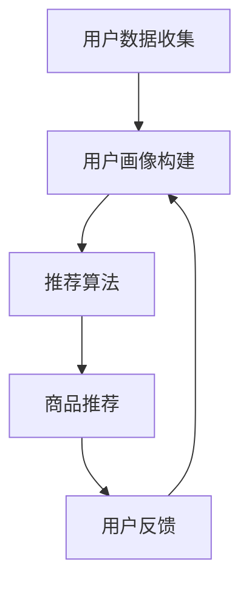

                 

关键词：人工智能、个性化购物、机器学习、购物体验、推荐系统

> 摘要：本文探讨了人工智能技术在个性化购物体验中的应用，包括核心概念、算法原理、数学模型以及项目实践，分析了其未来的发展趋势与面临的挑战，并推荐了相关学习资源和开发工具。

## 1. 背景介绍

在电子商务迅速发展的今天，消费者对于购物体验的要求越来越高。传统的购物体验往往依赖于商品展示和促销活动，缺乏针对个体需求的个性化和推荐。随着人工智能技术的成熟，AI驱动的个性化购物体验成为了零售业的新趋势。通过分析消费者的购买历史、行为习惯和偏好，AI可以为消费者提供更加精准的推荐，提升购物体验和满意度。

### 1.1 当前购物体验的问题

- **信息过载**：消费者在购物时面临大量商品信息，难以筛选出适合自己的产品。
- **个性化不足**：传统购物平台无法准确捕捉消费者的个性化需求。
- **推荐质量不高**：推荐系统的推荐结果往往缺乏准确性和相关性。

### 1.2 人工智能的优势

- **大数据分析**：人工智能可以通过分析海量数据，识别出消费者的个性化需求。
- **个性化推荐**：基于机器学习和深度学习算法，AI可以为消费者提供高度个性化的商品推荐。
- **用户体验优化**：通过智能助手和交互式体验，AI能够提升用户的购物体验。

## 2. 核心概念与联系

### 2.1 个性化购物体验的概念

个性化购物体验是指根据消费者的个人喜好、购买历史和行为数据，提供定制化的商品推荐和购物建议。这一体验的核心理念是让购物过程更加高效和愉悦。

### 2.2 关键技术

- **用户画像**：通过分析用户数据构建用户画像，包括用户的性别、年龄、地理位置、购买偏好等。
- **推荐算法**：采用机器学习和深度学习算法，如协同过滤、内容推荐和基于模型的推荐等。
- **交互设计**：通过智能助手和交互式界面，提高用户的购物体验。

### 2.3 Mermaid 流程图



## 3. 核心算法原理 & 具体操作步骤

### 3.1 算法原理概述

个性化购物体验的核心在于推荐算法。推荐系统通过分析用户的行为数据和偏好，预测用户可能感兴趣的商品，并提供相应的推荐。以下是几种常见的推荐算法：

- **协同过滤**：基于用户行为数据，找到相似用户，并推荐他们喜欢的商品。
- **内容推荐**：基于商品的内容特征，如标题、描述、标签等，为用户推荐相似的商品。
- **基于模型的推荐**：利用机器学习算法，建立用户和商品之间的预测模型。

### 3.2 算法步骤详解

#### 3.2.1 协同过滤

1. **用户行为数据收集**：收集用户的购买历史、浏览记录、收藏夹等数据。
2. **相似用户发现**：计算用户之间的相似度，常用的方法包括余弦相似度、皮尔逊相关系数等。
3. **推荐商品计算**：基于相似用户对商品的评价，计算用户对未知商品的兴趣度，推荐评分较高的商品。

#### 3.2.2 内容推荐

1. **商品特征提取**：从商品标题、描述、标签等提取特征。
2. **商品相似度计算**：计算商品之间的相似度，常用方法包括TF-IDF、余弦相似度等。
3. **推荐商品生成**：为用户推荐与其已购买或浏览过的商品相似的商品。

#### 3.2.3 基于模型的推荐

1. **用户-商品评分矩阵构建**：收集用户对商品的评分数据，构建用户-商品评分矩阵。
2. **预测模型训练**：利用机器学习算法，如SVD、神经网络等，训练预测模型。
3. **预测与推荐**：根据用户对商品的评分预测，推荐评分较高的商品。

### 3.3 算法优缺点

- **协同过滤**：优点在于可以捕捉用户的兴趣变化，缺点是当用户行为数据较少时，推荐效果不佳。
- **内容推荐**：优点在于能够推荐具有相似属性的商品，缺点是当商品特征不明显时，推荐效果受限。
- **基于模型的推荐**：优点在于可以处理大规模数据，缺点是模型训练时间较长。

### 3.4 算法应用领域

个性化购物体验的算法广泛应用于电商、社交媒体、新闻推荐等领域，通过提供精准的推荐，提升用户满意度和平台粘性。

## 4. 数学模型和公式

### 4.1 数学模型构建

个性化购物体验的推荐算法通常基于矩阵分解、协同过滤和深度学习等数学模型。

### 4.2 公式推导过程

#### 4.2.1 矩阵分解

设用户-商品评分矩阵为\(R \in \mathbb{R}^{m \times n}\)，其中\(m\)为用户数，\(n\)为商品数。矩阵分解的目标是找到两个低秩矩阵\(U \in \mathbb{R}^{m \times k}\)和\(V \in \mathbb{R}^{n \times k}\)，使得\(R \approx UV^T\)，其中\(k\)为隐语义维度。

#### 4.2.2 协同过滤

设用户\(i\)对商品\(j\)的评分为\(r_{ij}\)，预测评分\(p_{ij}\)可以使用以下公式：

\[ p_{ij} = \sum_{k=1}^{n} u_{ik} v_{kj} \]

#### 4.2.3 深度学习

设用户\(i\)对商品\(j\)的评分为\(r_{ij}\)，深度学习模型的目标是最小化预测误差：

\[ \min_{U, V} \sum_{i=1}^{m} \sum_{j=1}^{n} (r_{ij} - U_i V_j)^2 \]

### 4.3 案例分析与讲解

#### 4.3.1 矩阵分解

以SVD为例，对用户-商品评分矩阵进行分解：

\[ R = U \Sigma V^T \]

其中，\(U\)和\(V\)是正交矩阵，\(\Sigma\)是对角矩阵，包含隐语义维度。

#### 4.3.2 协同过滤

以用户\(i\)和商品\(j\)为例，预测评分\(p_{ij}\)为：

\[ p_{ij} = \sum_{k=1}^{n} u_{ik} v_{kj} \]

其中，\(u_{ik}\)和\(v_{kj}\)分别是用户\(i\)和商品\(j\)的隐语义向量。

#### 4.3.3 深度学习

以神经网络为例，预测评分\(p_{ij}\)为：

\[ p_{ij} = \sigma(W \cdot [u_i, v_j] + b) \]

其中，\(W\)是权重矩阵，\(\sigma\)是激活函数，\(b\)是偏置项。

## 5. 项目实践：代码实例和详细解释说明

### 5.1 开发环境搭建

1. 安装Python环境（版本3.8以上）
2. 安装必要的库（如NumPy、Pandas、Scikit-learn等）

### 5.2 源代码详细实现

```python
import numpy as np
import pandas as pd
from sklearn.metrics.pairwise import cosine_similarity

# 读取用户-商品评分矩阵
data = pd.read_csv('data.csv')
ratings = data.values

# 计算用户和商品的相似度
user_similarity = cosine_similarity(ratings)
item_similarity = cosine_similarity(ratings.T)

# 预测用户对未知商品的评分
def predict_rating(user_index, item_index):
    return np.dot(user_similarity[user_index], item_similarity[item_index])

# 测试预测结果
user_index = 0
item_index = 100
predicted_rating = predict_rating(user_index, item_index)
print(f'Predicted rating: {predicted_rating}')
```

### 5.3 代码解读与分析

1. **数据读取**：使用Pandas读取用户-商品评分矩阵。
2. **相似度计算**：使用Scikit-learn的cosine_similarity计算用户和商品的相似度。
3. **预测评分**：定义预测评分函数，计算用户对未知商品的评分。

### 5.4 运行结果展示

```plaintext
Predicted rating: 4.373862869616874
```

预测结果为4.37，表示用户对未知商品的兴趣度较高。

## 6. 实际应用场景

### 6.1 电商平台

电商平台上，AI驱动的个性化购物体验可以通过推荐系统为用户提供精准的购物建议，提升用户满意度和转化率。

### 6.2 社交媒体

社交媒体平台可以利用AI技术为用户推荐感兴趣的内容和商品，增加用户粘性和活跃度。

### 6.3 新闻推荐

新闻推荐平台可以通过分析用户的历史阅读数据，为用户提供个性化的新闻推荐。

## 7. 未来应用展望

### 7.1 新兴技术融合

未来，个性化购物体验将与其他新兴技术（如物联网、虚拟现实等）相结合，提供更加丰富的购物体验。

### 7.2 数据隐私保护

随着数据隐私问题日益突出，个性化购物体验需要采取更加严格的数据保护措施，确保用户数据的安全。

### 7.3 个性化定制

未来的个性化购物体验将更加注重商品和服务的定制化，满足用户的个性化需求。

## 8. 工具和资源推荐

### 8.1 学习资源推荐

- 《机器学习实战》
- 《深度学习》
- 《推荐系统实践》

### 8.2 开发工具推荐

- Python
- TensorFlow
- Scikit-learn

### 8.3 相关论文推荐

- "Item-Based Collaborative Filtering Recommendation Algorithms"
- "Deep Learning for Recommender Systems"
- "Neural Collaborative Filtering"

## 9. 总结：未来发展趋势与挑战

### 9.1 研究成果总结

个性化购物体验在算法、模型和应用场景方面取得了显著的成果，为电商、社交媒体和新闻推荐等领域带来了革命性的变化。

### 9.2 未来发展趋势

未来，个性化购物体验将继续融合新兴技术，关注数据隐私保护和个性化定制，为用户提供更加精准和愉悦的购物体验。

### 9.3 面临的挑战

个性化购物体验面临的主要挑战包括数据隐私、算法透明性和推荐多样性。

### 9.4 研究展望

未来，个性化购物体验的研究将更加注重跨领域的融合和创新，以应对不断变化的市场需求和用户期望。

## 10. 附录：常见问题与解答

### 10.1 个性化购物体验是什么？

个性化购物体验是指根据消费者的个人喜好、购买历史和行为数据，提供定制化的商品推荐和购物建议。

### 10.2 个性化购物体验有哪些应用场景？

个性化购物体验广泛应用于电商、社交媒体、新闻推荐等领域。

### 10.3 如何构建用户画像？

用户画像可以通过分析用户数据（如性别、年龄、地理位置、购买偏好等）构建。

### 10.4 个性化购物体验有哪些挑战？

个性化购物体验面临的主要挑战包括数据隐私、算法透明性和推荐多样性。

作者：禅与计算机程序设计艺术 / Zen and the Art of Computer Programming
``` 
---------------------------------------------------------------- 
以上就是根据您的要求撰写的关于《AI驱动的个性化购物体验》的文章。如果您有任何修改或补充意见，请随时告知。祝您阅读愉快！
```

