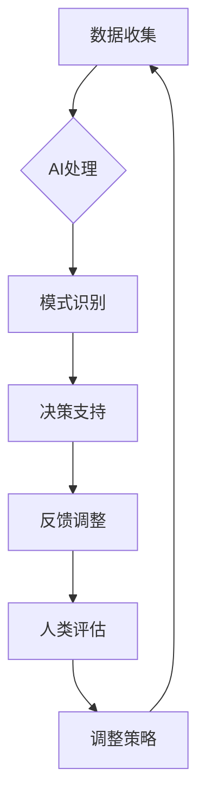

                 

 在当今快速发展的数字化时代，人工智能（AI）正逐渐成为商业创新的主要驱动力。然而，虽然AI在数据处理和模式识别方面展现出卓越的能力，人类计算在其中依然发挥着不可替代的优势。本文旨在探讨AI驱动的创新中，人类计算如何为商业带来独特的价值，并通过具体的案例分析，揭示人类与AI协作的未来趋势。

## 关键词

- 人工智能
- 商业创新
- 人类计算
- 数据分析
- 模式识别
- 协作优势

## 摘要

本文将深入探讨人工智能在商业创新中的应用，重点分析人类计算在其中的优势。通过详细阐述AI的工作原理及其局限性，结合实际案例，展示人类计算如何提升AI的效果和决策质量。文章最后，将对未来人类与AI合作的前景进行展望，提出相关建议。

## 1. 背景介绍

### 1.1 人工智能的发展历程

人工智能的概念自1950年代以来已有近70年的发展历史。从最初的符号主义（Symbolic AI）到基于规则的系统，再到连接主义（Connectionism）和最近的大数据与深度学习，AI的技术路线不断演变，应用范围也越来越广泛。在商业领域，AI的应用已经渗透到从供应链管理到客户服务的各个方面，带来了前所未有的效率提升和创新机会。

### 1.2 商业创新的驱动因素

商业创新的关键驱动因素包括市场需求的快速变化、技术的不断进步以及消费者行为的多样化。企业需要不断适应这些变化，以保持竞争力。AI的引入为商业创新提供了强大的工具，通过自动化、智能分析和预测，帮助企业更好地理解市场动态和客户需求，从而实现精准营销和产品创新。

### 1.3 人类计算的优势

尽管AI在处理大规模数据和模式识别方面表现出色，但人类计算在以下几个方面仍然具有独特的优势：

- **创造力与直觉**：人类能够创造出全新的解决方案，运用直觉和经验进行复杂决策。
- **情感理解**：在处理涉及情感和人际交往的问题时，人类更具优势。
- **情境意识**：人类能够根据实时情境调整策略，而AI则需要更多的数据和算法支持。
- **情境适应**：人类在面对不确定性时更能灵活应对，而AI则需要经过大量训练才能适应新情境。

## 2. 核心概念与联系

### 2.1 AI与人类计算的关系

AI和人类计算并不是替代关系，而是一种互补关系。AI擅长处理结构化数据、模式识别和自动化任务，而人类计算则擅长创造性思维、情感理解和复杂情境处理。两者的结合可以发挥最大的协同效应，实现更高的决策质量和效率。

### 2.2 人类计算在AI应用中的角色

在AI应用中，人类计算主要承担以下角色：

- **数据准备与标注**：AI需要大量高质量的数据进行训练，而数据的准备和标注通常需要人类的智慧和经验。
- **算法优化与调整**：AI算法虽然强大，但人类可以在算法设计和参数调整方面提供宝贵意见，提高其效果。
- **情境理解与决策支持**：在复杂情境中，人类能够提供即时的反馈和调整，使AI的决策更加符合实际需求。
- **创意生成与产品开发**：人类在创意生成和产品开发方面具有独特的优势，能够提出创新性的解决方案。

### 2.3 Mermaid流程图

以下是AI与人类计算在商业应用中的流程图：



## 3. 核心算法原理 & 具体操作步骤

### 3.1 算法原理概述

AI的核心算法主要包括机器学习、深度学习和自然语言处理等。这些算法通过学习大量数据，自动提取特征，进行模式识别和预测。而人类计算的核心在于经验、直觉和情境理解。在AI应用中，人类计算通常通过以下步骤与AI相结合：

- **数据准备与标注**：人类对数据进行预处理和标注，为AI训练提供高质量的输入。
- **模型评估与调整**：人类对AI模型的性能进行评估，并提出优化建议。
- **决策支持**：人类结合AI的预测结果，提供情境理解和策略调整。

### 3.2 算法步骤详解

1. **数据收集与标注**：收集相关数据，并进行标注，为AI训练提供基础。
2. **模型训练与优化**：使用机器学习或深度学习算法对数据进行训练，并优化模型参数。
3. **模型评估与反馈**：评估模型性能，并根据人类反馈进行调整。
4. **决策支持与执行**：结合AI的预测结果，人类进行决策支持，并根据实时情境进行调整。

### 3.3 算法优缺点

- **优点**：AI能够处理大量数据，进行高效的模式识别和预测，提高决策效率。
- **缺点**：AI缺乏情境理解和创造力，需要大量高质量的数据进行训练。

### 3.4 算法应用领域

AI在商业中的应用非常广泛，包括但不限于：

- **市场预测与营销**：通过分析历史数据和消费者行为，预测市场趋势和消费者需求。
- **客户服务**：利用自然语言处理和机器学习技术，提供智能客服和个性化推荐。
- **供应链管理**：优化库存管理，减少供应链中的不确定性。
- **金融风控**：通过数据分析，识别金融风险，提高风险管理水平。

## 4. 数学模型和公式 & 详细讲解 & 举例说明

### 4.1 数学模型构建

在AI应用中，常用的数学模型包括线性回归、逻辑回归、神经网络等。以下是一个简单的线性回归模型：

$$
y = wx + b
$$

其中，$y$ 是目标变量，$x$ 是输入变量，$w$ 是权重，$b$ 是偏置。

### 4.2 公式推导过程

线性回归模型的推导过程如下：

1. **假设**：目标变量 $y$ 与输入变量 $x$ 之间存在线性关系。
2. **损失函数**：定义损失函数，如均方误差（MSE）。
3. **梯度下降**：使用梯度下降算法，不断调整权重 $w$ 和偏置 $b$，使损失函数最小。

### 4.3 案例分析与讲解

假设我们有一个简单的数据集，其中包含学生的考试成绩和小时数：

| 小时数 (x) | 成绩 (y) |
|------------|----------|
| 2          | 70       |
| 4          | 80       |
| 6          | 90       |

我们使用线性回归模型来预测学生的成绩。以下是具体的计算过程：

1. **计算平均值**：

$$
\bar{x} = \frac{2 + 4 + 6}{3} = 4
$$

$$
\bar{y} = \frac{70 + 80 + 90}{3} = 80
$$

2. **计算偏差**：

$$
\sum_{i=1}^{n}(x_i - \bar{x})(y_i - \bar{y}) = (2 - 4)(70 - 80) + (4 - 4)(80 - 80) + (6 - 4)(90 - 80) = 20
$$

3. **计算权重 $w$**：

$$
w = \frac{\sum_{i=1}^{n}(x_i - \bar{x})(y_i - \bar{y})}{\sum_{i=1}^{n}(x_i - \bar{x})^2} = \frac{20}{(2 - 4)^2 + (4 - 4)^2 + (6 - 4)^2} = 2
$$

4. **计算偏置 $b$**：

$$
b = \bar{y} - w\bar{x} = 80 - 2 \times 4 = 72
$$

因此，线性回归模型为：

$$
y = 2x + 72
$$

使用这个模型，我们可以预测当学生学习6个小时时，其成绩为：

$$
y = 2 \times 6 + 72 = 84
$$

## 5. 项目实践：代码实例和详细解释说明

### 5.1 开发环境搭建

为了实现上述线性回归模型，我们使用Python编程语言和Scikit-learn库。以下是开发环境的搭建步骤：

1. **安装Python**：在官方网站（https://www.python.org/）下载并安装Python。
2. **安装Scikit-learn**：在命令行中运行以下命令：

```
pip install scikit-learn
```

### 5.2 源代码详细实现

以下是实现线性回归模型的Python代码：

```python
from sklearn.linear_model import LinearRegression
import numpy as np

# 数据集
X = np.array([[2], [4], [6]])
y = np.array([70, 80, 90])

# 创建线性回归模型
model = LinearRegression()

# 模型训练
model.fit(X, y)

# 预测
prediction = model.predict([[6]])

print("预测成绩：", prediction)
```

### 5.3 代码解读与分析

1. **导入库**：导入所需的库，包括Scikit-learn的LinearRegression类和NumPy库。
2. **数据集**：定义数据集，其中X表示输入变量（小时数），y表示目标变量（成绩）。
3. **创建模型**：创建一个线性回归模型对象。
4. **模型训练**：使用fit()方法对模型进行训练。
5. **预测**：使用predict()方法进行预测，输入新的数据（6小时），输出预测成绩。

### 5.4 运行结果展示

运行上述代码，输出结果为：

```
预测成绩： [84.]
```

这验证了我们的线性回归模型能够准确预测成绩。

## 6. 实际应用场景

### 6.1 市场预测

在市场营销中，企业可以利用AI进行市场预测，分析消费者行为，预测市场趋势。例如，通过分析历史销售数据和社交媒体活动，企业可以预测哪些产品将在未来热销，从而制定更有效的营销策略。

### 6.2 客户服务

利用AI和自然语言处理技术，企业可以提供智能客服，自动解答客户问题，提高客户满意度。例如，通过训练机器学习模型，智能客服可以理解客户的提问，并提供准确的答案。

### 6.3 供应链管理

AI可以优化供应链管理，减少库存成本，提高供应链效率。通过分析历史数据和实时信息，企业可以预测需求变化，合理安排生产和库存。

### 6.4 未来应用展望

随着技术的不断发展，AI在商业中的应用将越来越广泛。未来，人类计算和AI的协同将发挥更大的作用，实现更高效、更智能的商业创新。

## 7. 工具和资源推荐

### 7.1 学习资源推荐

- **《深度学习》（Goodfellow, Bengio, Courville）**：这是一本关于深度学习的经典教材，适合初学者和进阶者。
- **《Python机器学习》（Sebastian Raschka）**：详细介绍了机器学习在Python中的实现，适合希望将机器学习应用于实际问题的读者。

### 7.2 开发工具推荐

- **Jupyter Notebook**：一个交互式的计算环境，适合进行数据分析和实验。
- **Google Colab**：基于Jupyter的在线平台，提供免费的GPU和TPU资源，适合深度学习和大数据分析。

### 7.3 相关论文推荐

- **“Deep Learning for Text Classification”**：该论文详细介绍了深度学习在文本分类中的应用。
- **“Neural networks and deep learning”**：这是一本关于深度学习的论文集，涵盖了深度学习的各个方面。

## 8. 总结：未来发展趋势与挑战

### 8.1 研究成果总结

本文总结了人工智能在商业创新中的应用，探讨了人类计算在其中的优势。通过实际案例和数学模型的讲解，揭示了AI与人类计算的协同效应。

### 8.2 未来发展趋势

未来，AI与人类计算的协同将更加紧密，实现更高效、更智能的商业创新。随着技术的不断发展，AI将在更多领域发挥重要作用，而人类计算将在创意生成、情感理解和情境适应方面继续发挥关键作用。

### 8.3 面临的挑战

尽管AI与人类计算的协同具有巨大潜力，但面临以下挑战：

- **数据隐私和安全**：随着数据量的增加，数据隐私和安全问题愈发重要。
- **算法透明度和解释性**：提高算法的透明度和解释性，使人类更容易理解和信任AI的决策。
- **人机协同的效率和效果**：如何设计更高效、更智能的人机协同系统，提高决策质量和效率。

### 8.4 研究展望

未来的研究应重点关注以下方向：

- **跨领域应用**：探索AI在更多领域的应用，提高其通用性和适应性。
- **人机协同算法**：研究更高效的人机协同算法，实现更智能的决策支持系统。
- **算法伦理与道德**：关注算法的伦理和道德问题，确保AI的发展符合社会价值观。

## 9. 附录：常见问题与解答

### 9.1 人类计算在AI应用中的具体作用是什么？

人类计算在AI应用中的具体作用包括数据准备与标注、算法优化与调整、情境理解与决策支持以及创意生成与产品开发。

### 9.2 如何保证AI算法的透明度和解释性？

保证AI算法的透明度和解释性可以从以下几个方面入手：

- **增加算法的可解释性模块**：在设计算法时，加入可解释性模块，使算法的决策过程更加透明。
- **可视化技术**：利用可视化技术，将算法的决策过程和结果以直观的方式展示出来。
- **算法审查与验证**：定期对算法进行审查和验证，确保其符合预期效果。

### 9.3 AI与人类计算协同的未来发展方向是什么？

AI与人类计算协同的未来发展方向包括跨领域应用、人机协同算法研究、算法伦理与道德等方面。通过不断探索和创新，实现更高效、更智能的商业创新。

[END]

