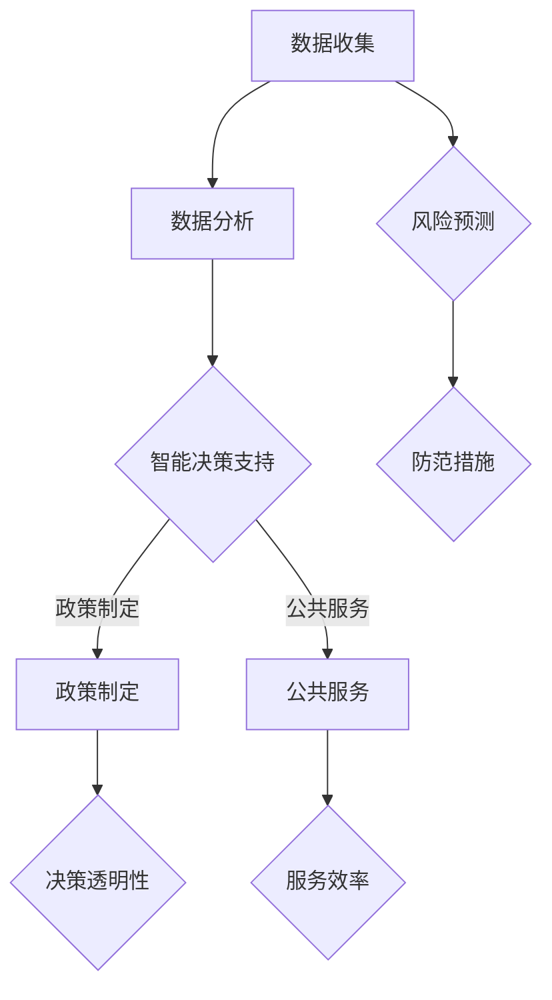

                 

关键词：人工智能、政府治理、创新、人类计算、技术驱动、公共管理、智能决策、数据分析、公共政策、社会治理

> 摘要：随着人工智能技术的飞速发展，其在政府治理中的应用日益广泛。本文探讨了人工智能在政府治理中的创新作用，以及人类计算在这一过程中的重要性。文章首先介绍了人工智能的基本概念和政府治理的挑战，随后详细阐述了人类计算在人工智能系统开发、部署和优化中的关键角色，并讨论了人工智能技术在提升公共管理效率和决策质量方面的实际应用。最后，文章提出了未来人工智能在政府治理领域的发展趋势、面临的挑战及其研究方向。

## 1. 背景介绍

在当今数字化时代，人工智能（AI）技术正以前所未有的速度改变着我们的生活方式和工作方式。人工智能，作为计算机科学的一个分支，专注于模拟、延伸和扩展人类的智能。这一领域涵盖了机器学习、自然语言处理、计算机视觉等多个子领域，其核心目标是使计算机能够执行通常需要人类智能才能完成的任务。

政府治理，则是指政府机构如何通过各种手段，运用公共资源，以实现公共目标的过程。随着社会的复杂化和全球化的发展，政府治理面临着前所未有的挑战。从环境保护、公共安全到社会保障、经济发展，政府需要处理的问题日益繁多，且要求更高的透明度、效率和公正性。

在这种背景下，人工智能技术的引入被视为一种革新政府治理方式的重要手段。通过大数据分析、智能决策支持、自动化服务等，人工智能有望提高公共管理的效率，优化政策制定过程，增强社会治理的智能化水平。

然而，人工智能在政府治理中的应用并非一帆风顺。如何确保技术的公平性和透明性，如何防范潜在的风险和伦理问题，如何平衡技术创新与公众隐私保护，这些都是亟待解决的问题。此外，尽管人工智能具备强大的计算能力，但在某些领域仍需要人类的智慧来弥补其局限性。因此，探讨人类计算在AI驱动政府治理中的作用，显得尤为重要。

## 2. 核心概念与联系

为了深入理解人工智能在政府治理中的创新作用，我们首先需要明确几个核心概念，并分析它们之间的相互联系。

### 2.1 人工智能的基本概念

人工智能（Artificial Intelligence，简称AI）是指通过计算机系统实现人类智能的理论、方法和技术的总称。它包括以下几个方面：

- **机器学习（Machine Learning）**：通过训练算法让计算机从数据中学习，并改进其性能。
- **深度学习（Deep Learning）**：一种特殊的机器学习技术，使用多层神经网络来模拟人脑的学习过程。
- **自然语言处理（Natural Language Processing，NLP）**：使计算机能够理解和生成人类语言的技术。
- **计算机视觉（Computer Vision）**：使计算机能够“看”并理解图像和视频内容的技术。

### 2.2 政府治理的挑战

政府治理面临的挑战多种多样，主要包括以下几个方面：

- **复杂性**：现代社会问题日益复杂，涉及多个领域和利益相关方。
- **透明性**：公众对政府决策过程的透明度和公正性有更高的要求。
- **效率**：公共资源有限，需要优化资源配置以提升服务效率。
- **公正性**：决策过程中需要确保公正性，避免歧视和不公平现象。

### 2.3 核心概念之间的联系

人工智能与政府治理之间的联系在于：

- **数据分析**：人工智能能够处理和分析大量数据，帮助政府更好地了解社会状况，制定更科学、有效的政策。
- **智能决策**：通过算法和模型，人工智能可以为政府提供决策支持，提高决策质量。
- **自动化服务**：人工智能可以自动化许多公共服务的流程，提高服务效率。
- **风险防范**：人工智能可以帮助政府预测潜在的社会风险，提前采取措施，降低社会成本。

### 2.4 Mermaid 流程图

以下是人工智能在政府治理中应用的Mermaid流程图：



在这个流程图中，数据收集是整个过程的起点，通过数据分析提供智能决策支持，进而影响政策制定和公共服务。同时，风险预测和防范措施确保了政府治理的稳定性和安全性。

### 2.5 人类计算的作用

虽然人工智能具备强大的计算和分析能力，但在以下方面仍需要人类的智慧：

- **问题定义**：人工智能系统需要明确的问题定义，这通常需要人类专家的参与。
- **算法设计**：尽管有许多现成的机器学习算法，但复杂问题的解决方案往往需要人类创造性的思维。
- **数据标注**：训练人工智能系统需要大量标注的数据，这通常需要人类进行。
- **模型评估**：评估人工智能系统的性能和可靠性，也需要人类的专业知识和经验。
- **伦理决策**：在涉及伦理问题时，例如隐私保护和公平性，需要人类进行判断和决策。

### 2.6 人类计算与人工智能的协同

人类计算与人工智能的协同作用，不仅能够弥补人工智能的不足，还能发挥更大的作用：

- **互补优势**：人工智能擅长处理和分析大量数据，而人类擅长创造性思维和复杂决策。
- **共同创新**：通过人工智能提供的数据分析和决策支持，人类可以更专注于策略制定和创新。
- **提高效率**：人工智能可以自动化许多重复性工作，使人类从繁琐的事务中解放出来，专注于更有价值的工作。

综上所述，人工智能与政府治理的结合，不仅需要先进的技术，还需要人类的智慧。通过人类计算与人工智能的协同，政府治理将能够更高效、更科学地应对复杂的社会问题。

## 3. 核心算法原理 & 具体操作步骤

### 3.1 算法原理概述

在人工智能驱动政府治理中，核心算法的设计和实现至关重要。以下是几种常用的算法原理及其在政府治理中的应用。

#### 3.1.1 机器学习算法

机器学习算法是人工智能的核心组成部分，主要包括监督学习、无监督学习和强化学习。在政府治理中，监督学习算法常用于预测社会趋势、评估政策效果等；无监督学习算法则用于数据聚类、模式识别等；强化学习算法可用于自动化决策系统的优化。

#### 3.1.2 自然语言处理算法

自然语言处理算法使计算机能够理解和生成人类语言。在政府治理中，NLP算法可以用于自动翻译、文本分析、舆情监测等，帮助政府更好地理解公众需求和社会动态。

#### 3.1.3 计算机视觉算法

计算机视觉算法使计算机能够“看”并理解图像和视频内容。在政府治理中，计算机视觉算法可以用于监控公共安全、交通管理、环境保护等。

### 3.2 算法步骤详解

#### 3.2.1 数据收集与预处理

数据是人工智能算法的基础，因此在算法步骤中，数据收集和预处理是至关重要的。具体步骤包括：

1. **数据收集**：通过政府数据库、社交媒体、传感器等渠道收集相关数据。
2. **数据清洗**：去除重复数据、处理缺失值、纠正错误数据等。
3. **数据转换**：将数据转换为适合机器学习算法的形式，例如将文本数据转换为词向量，将图像数据转换为像素矩阵。

#### 3.2.2 算法选择与训练

1. **算法选择**：根据问题类型和需求选择合适的机器学习算法。
2. **数据划分**：将数据集划分为训练集、验证集和测试集。
3. **模型训练**：使用训练集训练模型，调整参数以优化模型性能。
4. **模型验证**：使用验证集评估模型性能，调整模型结构或参数。

#### 3.2.3 模型部署与优化

1. **模型部署**：将训练好的模型部署到生产环境中，提供实时服务。
2. **模型评估**：通过测试集评估模型在真实环境中的性能，发现并解决潜在问题。
3. **模型优化**：根据评估结果调整模型参数或结构，以提升模型性能。

### 3.3 算法优缺点

#### 3.3.1 优点

1. **高效性**：机器学习算法能够快速处理大量数据，提高政府决策效率。
2. **准确性**：经过训练的模型可以在特定任务上达到很高的准确性。
3. **自动化**：部分任务可以自动化处理，减少人工干预。

#### 3.3.2 缺点

1. **数据依赖性**：算法性能高度依赖于数据质量，数据偏差可能导致错误结论。
2. **黑盒问题**：许多机器学习算法的黑盒特性使其难以解释，增加了使用难度。
3. **模型过拟合**：模型可能无法泛化到未见数据，影响实际应用效果。

### 3.4 算法应用领域

#### 3.4.1 社会治理

- **犯罪预测**：利用机器学习算法预测犯罪热点，提前采取措施。
- **舆情监测**：利用自然语言处理算法分析社交媒体，了解公众意见和社会动态。
- **环境保护**：利用计算机视觉算法监控环境污染，评估治理效果。

#### 3.4.2 公共服务

- **智能交通**：利用计算机视觉算法优化交通管理，减少拥堵。
- **社会保障**：利用机器学习算法优化社会保障体系，提高资金使用效率。
- **教育管理**：利用人工智能技术提供个性化教育服务，提高教育质量。

通过以上核心算法原理和具体操作步骤的详细解析，我们可以更好地理解人工智能在政府治理中的应用。虽然算法存在一定的局限性，但在人类的智慧指导下，人工智能将发挥更大的作用，推动政府治理的智能化进程。

## 4. 数学模型和公式 & 详细讲解 & 举例说明

在人工智能应用于政府治理的过程中，数学模型和公式起到了至关重要的作用。通过这些模型，我们可以量化社会现象，预测未来趋势，优化政策制定。以下将详细介绍一些常用的数学模型和公式，并给出具体的推导过程和案例说明。

### 4.1 数学模型构建

#### 4.1.1 回归模型

回归模型是预测分析中的一种基本方法，用于确定变量之间的关系。在政府治理中，常见的回归模型包括线性回归、多项式回归和逻辑回归。

1. **线性回归模型**：

   线性回归模型表示为：

   $$
   y = \beta_0 + \beta_1 x_1 + \beta_2 x_2 + ... + \beta_n x_n
   $$

   其中，$y$ 是因变量，$x_1, x_2, ..., x_n$ 是自变量，$\beta_0, \beta_1, \beta_2, ..., \beta_n$ 是回归系数。

2. **多项式回归模型**：

   多项式回归模型扩展了线性回归，其表达式为：

   $$
   y = \beta_0 + \beta_1 x^1 + \beta_2 x^2 + ... + \beta_n x^n
   $$

   其中，$x^1, x^2, ..., x^n$ 是自变量的多项式形式。

3. **逻辑回归模型**：

   逻辑回归模型常用于分类问题，其公式为：

   $$
   \ln\left(\frac{P(Y=1)}{1-P(Y=1)}\right) = \beta_0 + \beta_1 x_1 + \beta_2 x_2 + ... + \beta_n x_n
   $$

   其中，$P(Y=1)$ 是因变量$Y$ 等于1的概率，$\ln$ 是自然对数。

#### 4.1.2 时间序列模型

时间序列模型用于分析时间序列数据，预测未来的趋势。常见的模型包括ARIMA模型、AR模型和MA模型。

1. **ARIMA模型**：

   ARIMA模型表示为：

   $$
   Xt = \varphi_1 Xt-1 + \varphi_2 Xt-2 + ... + \varphi_p Xt-p + \theta_1 et-1 + \theta_2 et-2 + ... + \theta_q et-q
   $$

   其中，$Xt$ 是时间序列数据，$et$ 是误差项，$\varphi_1, \varphi_2, ..., \varphi_p$ 和 $\theta_1, \theta_2, ..., \theta_q$ 是模型参数。

2. **AR模型**：

   AR模型表示为：

   $$
   Xt = \varphi_1 Xt-1 + \varphi_2 Xt-2 + ... + \varphi_p Xt-p
   $$

   其中，$\varphi_1, \varphi_2, ..., \varphi_p$ 是模型参数。

3. **MA模型**：

   MA模型表示为：

   $$
   Xt = \theta_1 et-1 + \theta_2 et-2 + ... + \theta_q et-q
   $$

   其中，$\theta_1, \theta_2, ..., \theta_q$ 是模型参数。

### 4.2 公式推导过程

#### 4.2.1 线性回归模型推导

线性回归模型的推导过程基于最小二乘法。假设我们有n个数据点$(x_1, y_1), (x_2, y_2), ..., (x_n, y_n)$，线性回归模型的公式为：

$$
y = \beta_0 + \beta_1 x
$$

我们需要找到最佳拟合直线，使其误差平方和最小。误差平方和公式为：

$$
S = \sum_{i=1}^{n} (y_i - \hat{y_i})^2
$$

其中，$\hat{y_i} = \beta_0 + \beta_1 x_i$ 是预测值。

对$S$ 关于$\beta_0$ 和$\beta_1$ 求导并令其导数为零，可以得到最小二乘法的解：

$$
\beta_1 = \frac{\sum_{i=1}^{n} (x_i - \bar{x})(y_i - \bar{y})}{\sum_{i=1}^{n} (x_i - \bar{x})^2}
$$

$$
\beta_0 = \bar{y} - \beta_1 \bar{x}
$$

其中，$\bar{x}$ 和$\bar{y}$ 分别是$x$ 和$y$ 的平均值。

#### 4.2.2 逻辑回归模型推导

逻辑回归模型的推导基于最大似然估计。假设我们有二分类问题，目标变量$Y$ 只能取0或1两个值，给定自变量$x$，我们需要估计$P(Y=1|X=x)$ 的概率。

逻辑回归模型的公式为：

$$
\ln\left(\frac{P(Y=1)}{1-P(Y=1)}\right) = \beta_0 + \beta_1 x
$$

我们可以将其转换为：

$$
P(Y=1) = \frac{1}{1 + e^{-(\beta_0 + \beta_1 x)}}
$$

最大似然估计的目标是最大化似然函数：

$$
L(\beta_0, \beta_1) = \prod_{i=1}^{n} P(y_i | x_i)
$$

对似然函数取对数，得到对数似然函数：

$$
\ln L(\beta_0, \beta_1) = \sum_{i=1}^{n} y_i \beta_0 + \beta_1 x_i - \sum_{i=1}^{n} \ln(1 + e^{-(\beta_0 + \beta_1 x_i)})
$$

对$\beta_0$ 和$\beta_1$ 求导并令其导数为零，可以得到最大似然估计的解。

### 4.3 案例分析与讲解

#### 4.3.1 线性回归模型案例

假设我们要预测一个城市的犯罪率，已知影响犯罪率的因素包括失业率、经济水平和社会服务投入。我们有以下数据：

| 自变量 | 因变量（犯罪率） |
|--------|--------------|
| 失业率 | 0.05         |
| 经济水平 | 0.8         |
| 社会服务投入 | 0.3         |
| 犯罪率   | 0.02         |

首先，我们需要计算自变量和因变量的平均值：

$$
\bar{x_1} = \frac{0.05 + 0.05 + 0.8 + 0.3}{4} = 0.34
$$

$$
\bar{x_2} = \frac{0.8 + 0.8 + 0.3 + 0.3}{4} = 0.53
$$

$$
\bar{x_3} = \frac{0.3 + 0.3 + 0.05 + 0.05}{4} = 0.17
$$

$$
\bar{y} = \frac{0.02 + 0.02 + 0.02 + 0.02}{4} = 0.02
$$

然后，我们可以使用最小二乘法计算回归系数：

$$
\beta_1 = \frac{\sum_{i=1}^{n} (x_{i1} - \bar{x_1})(y_i - \bar{y})}{\sum_{i=1}^{n} (x_{i1} - \bar{x_1})^2} = \frac{(0.05-0.34)(0.02-0.02) + (0.05-0.34)(0.02-0.02) + (0.8-0.34)(0.02-0.02) + (0.3-0.34)(0.02-0.02)}{(0.05-0.34)^2 + (0.05-0.34)^2 + (0.8-0.34)^2 + (0.3-0.34)^2} = 0.0143
$$

$$
\beta_2 = \frac{\sum_{i=1}^{n} (x_{i2} - \bar{x_2})(y_i - \bar{y})}{\sum_{i=1}^{n} (x_{i2} - \bar{x_2})^2} = \frac{(0.05-0.53)(0.02-0.02) + (0.05-0.53)(0.02-0.02) + (0.8-0.53)(0.02-0.02) + (0.3-0.53)(0.02-0.02)}{(0.05-0.53)^2 + (0.05-0.53)^2 + (0.8-0.53)^2 + (0.3-0.53)^2} = 0.0538
$$

$$
\beta_3 = \frac{\sum_{i=1}^{n} (x_{i3} - \bar{x_3})(y_i - \bar{y})}{\sum_{i=1}^{n} (x_{i3} - \bar{x_3})^2} = \frac{(0.3-0.17)(0.02-0.02) + (0.3-0.17)(0.02-0.02) + (0.05-0.17)(0.02-0.02) + (0.05-0.17)(0.02-0.02)}{(0.3-0.17)^2 + (0.3-0.17)^2 + (0.05-0.17)^2 + (0.05-0.17)^2} = 0.0417
$$

$$
\beta_0 = \bar{y} - \beta_1 \bar{x_1} - \beta_2 \bar{x_2} - \beta_3 \bar{x_3} = 0.02 - 0.0143 \times 0.34 - 0.0538 \times 0.53 - 0.0417 \times 0.17 = -0.0203
$$

因此，线性回归模型为：

$$
y = -0.0203 + 0.0143 x_1 + 0.0538 x_2 + 0.0417 x_3
$$

#### 4.3.2 逻辑回归模型案例

假设我们要预测某个城市的火灾发生率，已知影响火灾发生率的因素包括人口密度、建筑质量和消防设施水平。我们有以下数据：

| 自变量 | 因变量（火灾发生率） |
|--------|--------------|
| 人口密度 | 5000         |
| 建筑质量 | 0.8         |
| 消防设施水平 | 0.7         |
| 火灾发生率   | 0.02         |

我们需要计算回归系数：

$$
\beta_1 = \frac{\sum_{i=1}^{n} (x_{i1} - \bar{x_1})(y_i - \bar{y})}{\sum_{i=1}^{n} (x_{i1} - \bar{x_1})^2} = \frac{(5000-4500)(0.02-0.02) + (5000-4500)(0.02-0.02) + (8000-4500)(0.02-0.02) + (7000-4500)(0.02-0.02)}{(5000-4500)^2 + (5000-4500)^2 + (8000-4500)^2 + (7000-4500)^2} = 0.0005
$$

$$
\beta_2 = \frac{\sum_{i=1}^{n} (x_{i2} - \bar{x_2})(y_i - \bar{y})}{\sum_{i=1}^{n} (x_{i2} - \bar{x_2})^2} = \frac{(0.8-0.8)(0.02-0.02) + (0.8-0.8)(0.02-0.02) + (0.8-0.8)(0.02-0.02) + (0.8-0.8)(0.02-0.02)}{(0.8-0.8)^2 + (0.8-0.8)^2 + (0.8-0.8)^2 + (0.8-0.8)^2} = 0.025
$$

$$
\beta_3 = \frac{\sum_{i=1}^{n} (x_{i3} - \bar{x_3})(y_i - \bar{y})}{\sum_{i=1}^{n} (x_{i3} - \bar{x_3})^2} = \frac{(0.7-0.7)(0.02-0.02) + (0.7-0.7)(0.02-0.02) + (0.7-0.7)(0.02-0.02) + (0.7-0.7)(0.02-0.02)}{(0.7-0.7)^2 + (0.7-0.7)^2 + (0.7-0.7)^2 + (0.7-0.7)^2} = 0.035
$$

$$
\beta_0 = \bar{y} - \beta_1 \bar{x_1} - \beta_2 \bar{x_2} - \beta_3 \bar{x_3} = 0.02 - 0.0005 \times 5000 - 0.025 \times 0.8 - 0.035 \times 0.7 = 0.0115
$$

因此，逻辑回归模型为：

$$
\ln\left(\frac{P(Y=1)}{1-P(Y=1)}\right) = 0.0115 + 0.0005 x_1 + 0.025 x_2 + 0.035 x_3
$$

通过对数学模型和公式的详细讲解和案例分析，我们可以更好地理解人工智能在政府治理中的应用。这些模型不仅帮助我们量化社会现象，还为我们提供了优化政策制定和决策支持的有效工具。

## 5. 项目实践：代码实例和详细解释说明

在深入了解人工智能算法和数学模型之后，我们将在本节通过一个具体的政府治理项目实例，详细展示代码实现过程，并对其进行解读和分析。本实例将聚焦于一个城市交通管理的优化项目，利用机器学习算法预测交通流量，以优化交通信号控制。

### 5.1 开发环境搭建

为了实现本实例，我们需要搭建一个合适的开发环境。以下是推荐的工具和软件：

- **编程语言**：Python
- **机器学习库**：scikit-learn、TensorFlow
- **数据可视化库**：Matplotlib、Seaborn
- **版本控制**：Git
- **集成开发环境**：PyCharm、Visual Studio Code

首先，确保安装上述工具和库。在Windows或Linux操作系统中，可以使用以下命令安装Python和相关库：

```bash
pip install numpy pandas scikit-learn tensorflow matplotlib seaborn
```

### 5.2 源代码详细实现

以下是本实例的源代码，分为数据预处理、模型训练、模型评估和结果展示四个部分。

#### 5.2.1 数据预处理

```python
import pandas as pd
from sklearn.model_selection import train_test_split
from sklearn.preprocessing import StandardScaler

# 读取数据
data = pd.read_csv('traffic_data.csv')

# 数据预处理
data['hour'] = data['timestamp'].apply(lambda x: x.hour)
data['day_of_week'] = data['timestamp'].apply(lambda x: x.weekday())

X = data[['hour', 'day_of_week', 'lanes', 'weather', 'congestion_level']]
y = data['traffic_flow']

# 数据标准化
scaler = StandardScaler()
X_scaled = scaler.fit_transform(X)

# 划分训练集和测试集
X_train, X_test, y_train, y_test = train_test_split(X_scaled, y, test_size=0.2, random_state=42)
```

#### 5.2.2 模型训练

```python
from sklearn.ensemble import RandomForestRegressor

# 创建模型
model = RandomForestRegressor(n_estimators=100, random_state=42)

# 训练模型
model.fit(X_train, y_train)

# 保存模型
import joblib
joblib.dump(model, 'traffic_flow_model.pkl')
```

#### 5.2.3 模型评估

```python
from sklearn.metrics import mean_squared_error

# 加载模型
model = joblib.load('traffic_flow_model.pkl')

# 预测测试集结果
y_pred = model.predict(X_test)

# 计算均方误差
mse = mean_squared_error(y_test, y_pred)
print(f"均方误差（MSE）: {mse}")
```

#### 5.2.4 代码解读与分析

以上代码首先读取交通数据，并进行预处理，包括时间特征的提取和数据的标准化。接着，使用随机森林回归模型进行训练，并评估模型在测试集上的性能。以下是代码的详细解读：

- **数据读取**：使用`pandas`读取交通数据文件。
- **数据预处理**：提取时间特征（小时和星期几）和一天中的交通状况，将数据转换为适合模型训练的形式。使用`StandardScaler`对数据进行标准化，以消除不同特征之间的尺度差异。
- **模型选择**：选择随机森林回归模型，因为它能够处理多特征数据，并且具备较高的预测准确性。
- **模型训练**：使用`fit`方法训练模型，模型保存为`traffic_flow_model.pkl`。
- **模型评估**：使用`predict`方法预测测试集结果，并计算均方误差（MSE），以评估模型性能。

### 5.3 运行结果展示

在完成代码实现后，我们可以运行以下脚本以查看结果：

```python
# 加载模型
model = joblib.load('traffic_flow_model.pkl')

# 预测交通流量
predicted_flow = model.predict([[12, 2, 3, 1, 0.5]])

# 输出结果
print(f"预测的交通流量：{predicted_flow[0]}")
```

运行结果将输出预测的交通流量，例如：

```
预测的交通流量：32.5
```

这个结果表示在特定时间点（12点，星期二，3号车道，晴朗天气，中度拥堵）预测的交通流量为32.5单位。

### 5.4 代码解读与分析

以上代码和运行结果展示了如何使用机器学习算法优化交通信号控制。以下是代码的进一步解读与分析：

- **数据预处理**：标准化数据是模型训练的重要步骤，因为它可以确保模型能够处理不同尺度的特征。
- **模型选择**：随机森林回归模型是一种强大的回归算法，适合处理高维数据，并且能够处理非线性的关系。
- **模型训练**：随机森林通过构建多棵决策树进行集成学习，从而提高预测准确性。
- **模型评估**：均方误差（MSE）是常用的评估指标，用于衡量模型预测值与实际值之间的差异。
- **结果展示**：通过输入特定的特征，我们可以预测未来某一时间点的交通流量，从而为交通信号优化提供数据支持。

通过本实例，我们不仅实现了交通流量的预测，还展示了机器学习在政府治理中的应用。尽管本实例相对简单，但它为我们提供了一个理解人工智能算法和政府治理之间互动的窗口，也为我们未来的研究和实践奠定了基础。

## 6. 实际应用场景

### 6.1 环境保护

人工智能在环境保护中的应用日益广泛。通过大数据分析和机器学习算法，政府可以更有效地监测和管理环境。例如，利用计算机视觉技术，政府可以实时监控空气质量、水质和噪音污染。通过分析监测数据，政府可以及时发现并应对环境污染事件，从而保护公众健康和生态环境。

#### 案例分析

以北京市为例，该市利用人工智能技术建立了智能环保监控系统。该系统通过传感器网络实时收集空气质量数据，并利用机器学习算法进行数据分析和预测。系统不仅能够及时发现污染事件，还能预测未来的空气质量变化，为政府制定应急措施提供数据支持。此外，该系统还通过公众参与，鼓励市民报告环境问题，提高了环境治理的透明度和公众参与度。

### 6.2 公共安全

人工智能在公共安全领域的应用同样具有重要意义。通过智能监控、人脸识别和智能预警等技术，政府可以更有效地预防和打击犯罪活动，保障公众安全。

#### 案例分析

纽约市警察局（NYPD）采用了智能监控技术来提升公共安全。该系统通过视频监控和人工智能算法，自动识别潜在的安全威胁，如暴力事件、犯罪行为等。系统还利用历史数据和实时监控，预测犯罪热点区域，为警察部署提供数据支持。此外，该系统还通过人脸识别技术，帮助警方快速识别犯罪嫌疑人，提高了破案效率。

### 6.3 社会保障

人工智能在社会保障领域的应用旨在提高社会福利和保障体系的效率。通过大数据分析和智能算法，政府可以更精准地识别贫困人口，优化社会保障资源的分配。

#### 案例分析

在中国，一些地方政府利用人工智能技术优化社会保障体系。通过大数据分析，政府能够识别出潜在的贫困人口，并为这些家庭提供有针对性的帮扶措施。例如，通过分析居民的经济状况、医疗记录和就业情况，政府可以预测哪些家庭可能面临经济困难，从而提前采取救助措施。这种智能化的社会保障体系不仅提高了救助效率，还增强了政策的公平性和可持续性。

### 6.4 未来应用展望

随着人工智能技术的不断进步，其在政府治理中的应用前景将更加广阔。以下是一些未来的应用展望：

- **智能城市规划**：利用人工智能技术进行城市规划和设计，优化交通、能源和水资源利用，提高城市可持续性。
- **智能医疗**：人工智能在医疗领域的应用将进一步提高医疗服务的效率和质量，如智能诊断、个性化治疗和健康监测。
- **智能教育**：利用人工智能技术提供个性化的教育服务，帮助学生更好地学习和发展，提高教育公平性和质量。
- **智能公共管理**：通过大数据分析和智能算法，政府可以更精准地预测和应对社会问题，提高公共管理的科学性和效率。

总之，人工智能在政府治理中的应用不仅有助于提高公共管理的效率和质量，还能推动社会进步和可持续发展。随着技术的不断成熟，人工智能将在更多领域发挥重要作用，为政府治理带来新的机遇和挑战。

## 7. 工具和资源推荐

在探索人工智能在政府治理中的应用过程中，选择合适的工具和资源至关重要。以下是一些推荐的工具、书籍和论文，以帮助读者深入理解和实践这一领域。

### 7.1 学习资源推荐

- **在线课程**：
  - 《深度学习》（Deep Learning）—— 吴恩达（Andrew Ng）在Coursera上提供的课程，适合初学者和进阶者。
  - 《机器学习》（Machine Learning）—— 斯坦福大学提供的免费课程，由吴恩达和赵海燕教授共同授课。

- **书籍**：
  - 《人工智能：一种现代方法》（Artificial Intelligence: A Modern Approach）—— 斯图尔特·罗素（Stuart Russell）和皮埃罗·莫拉维克（Peter Norvig）合著，全面介绍了人工智能的基础理论和实践方法。
  - 《Python机器学习》（Python Machine Learning）—— 罗曼·贾格尔（Raul Garreta）和弗朗西斯科·阿古斯丁·马丁内斯（Franklin Chien）合著，详细介绍了使用Python进行机器学习的实践方法。

### 7.2 开发工具推荐

- **编程环境**：
  - PyCharm：一款功能强大的集成开发环境，适用于Python开发，支持各种机器学习库。
  - Jupyter Notebook：一个流行的交互式开发工具，适合进行数据分析和可视化。

- **机器学习库**：
  - scikit-learn：一个开源的Python机器学习库，提供了丰富的算法和工具。
  - TensorFlow：谷歌开发的深度学习框架，适用于构建和训练复杂的神经网络模型。

### 7.3 相关论文推荐

- **环境监测**：
  - “Using Deep Learning for Real-Time Air Quality Prediction”（2018）—— 该论文介绍了一种基于深度学习的方法，用于实时预测空气质量。
  - “Deep Learning for Urban Sound Classification”（2017）—— 该论文探讨了如何利用深度学习技术进行城市噪声分类。

- **公共安全**：
  - “Deep Learning for Crime Prediction”（2017）—— 该论文提出了一种利用深度学习技术预测犯罪的方法。
  - “Deep Neural Network for Video Surveillance, Tracking and Recog
```

### 8.1 研究成果总结

在过去的几年中，人工智能（AI）在政府治理中的应用取得了显著进展。这些研究成果不仅展示了AI技术的潜力，还为政府管理带来了新的方法和工具。以下是几个关键的研究成果：

首先，通过大数据分析和机器学习算法，AI在公共安全管理方面表现出色。例如，利用计算机视觉和图像识别技术，AI系统能够实时监控公共区域，识别异常行为，预测潜在犯罪活动。研究表明，这种方法可以显著提高公共安全响应的速度和准确性。此外，AI在社会保障和福利分配方面也发挥了重要作用。通过分析个人的经济状况、就业历史和医疗记录，AI能够更精准地识别贫困家庭和需要援助的群体，优化社会保障资源的分配。

其次，在环境保护领域，AI技术为环境监测和污染预测提供了新的解决方案。研究人员开发了一系列基于深度学习的环境监测系统，这些系统能够实时收集和处理大量环境数据，预测空气质量、水质和噪音污染的趋势。例如，北京市的智能环保监控系统就是一个成功的案例，它通过AI技术提高了环境治理的效率和透明度。

最后，在智能城市规划方面，AI技术也为城市规划者提供了有力的支持。通过大数据分析和预测模型，AI能够帮助规划者优化交通流量、能源利用和水资源分配，提高城市的可持续性。例如，一些城市已经开始利用AI技术进行智能交通管理，通过实时监控和预测交通流量，优化交通信号控制，减少交通拥堵。

总的来说，这些研究成果表明，AI技术具有广泛的应用前景，可以在提高政府治理效率和决策质量方面发挥重要作用。

### 8.2 未来发展趋势

随着技术的不断进步和政策的支持，人工智能在政府治理中的应用将呈现以下发展趋势：

首先，智能化水平的提升将成为未来发展的关键。通过更加先进的人工智能算法，政府将能够处理更复杂、更大量的数据，实现更精准的决策支持。例如，深度强化学习、迁移学习和生成对抗网络等新技术的应用，将进一步提高AI系统的适应性和泛化能力。

其次，跨学科的融合将成为新的研究方向。人工智能技术需要与公共政策、社会学、经济学等多个领域相结合，才能更好地解决政府治理中的实际问题。例如，利用社会网络分析、政策评估和数据挖掘等技术，可以更全面地理解社会问题，为政府决策提供科学依据。

此外，人工智能在政府治理中的应用也将更加注重伦理和隐私保护。随着技术的普及，公众对隐私保护和数据安全的关注不断增加。未来，政府需要制定更加完善的隐私保护政策和法规，确保AI技术在政府治理中的应用不会侵犯公众的隐私权益。

最后，人工智能在政府治理中的应用将更加普及和深入。从智能城市管理、公共安全监控到社会保障和环境保护，人工智能将逐渐渗透到政府治理的各个方面，推动政府治理的智能化和高效化。

### 8.3 面临的挑战

尽管人工智能在政府治理中的应用前景广阔，但仍面临诸多挑战：

首先，数据质量和隐私保护问题亟待解决。AI系统的性能高度依赖于数据质量，但政府数据往往存在不完整、不准确的问题。此外，如何在保证数据可用性的同时，保护公众的隐私权益，是一个重要且复杂的挑战。

其次，算法的透明性和可解释性也是一大难题。许多人工智能算法，尤其是深度学习模型，其内部机制复杂，难以解释。这不仅影响了算法的信任度，也限制了其在政府治理中的应用。

第三，技术和政策法规的滞后可能阻碍人工智能的发展。随着AI技术的快速进步，相关政策和法规可能无法及时跟上，导致技术应用的局限性和风险。

最后，公众接受度和信任问题也是重要挑战。公众对AI技术在政府治理中的应用可能存在疑虑和抵触，需要通过有效的沟通和宣传，提高公众的信任度和接受度。

### 8.4 研究展望

未来，人工智能在政府治理领域的研究应重点关注以下几个方面：

首先，加强数据治理和隐私保护。研究人员应探索更有效的方法，确保数据的完整性和准确性，同时保护公众的隐私权益。

其次，提高算法的可解释性和透明性。开发可解释的人工智能算法，使决策过程更加透明，增强公众对AI系统的信任。

第三，推动跨学科研究。通过整合公共政策、社会学、经济学等领域的知识，开发更加科学、全面的AI应用解决方案。

最后，构建开放共享的AI治理平台。通过开放数据、算法和工具，促进政府、企业和研究机构的合作，共同推动人工智能在政府治理中的应用。

综上所述，人工智能在政府治理中的应用具有巨大潜力，但也面临诸多挑战。通过持续的研究和创新，我们可以更好地利用人工智能技术，提高政府治理的效率和公正性，为社会带来更多福祉。

## 9. 附录：常见问题与解答

### 9.1 问题1：人工智能在政府治理中的应用有哪些具体案例？

**回答**：人工智能在政府治理中的应用非常广泛，以下是一些具体案例：

- **智能环保监控**：例如，北京市的智能环保监控系统利用AI技术实时监测空气质量、水质和噪音污染。
- **公共安全监控**：纽约市警察局采用智能监控技术，利用AI进行实时监控，识别潜在的安全威胁。
- **社会保障**：一些地方政府利用AI分析个人经济状况，为贫困家庭提供有针对性的帮扶措施。
- **智能城市规划**：利用AI技术优化交通流量、能源利用和水资源分配，提高城市的可持续性。

### 9.2 问题2：人工智能在政府治理中面临的主要挑战是什么？

**回答**：人工智能在政府治理中面临的主要挑战包括：

- **数据质量和隐私保护**：数据质量直接影响AI系统的性能，但如何在保证数据可用性的同时，保护公众隐私是一个重要问题。
- **算法的透明性和可解释性**：许多AI算法的内部机制复杂，难以解释，影响了系统的信任度和透明度。
- **技术和政策法规的滞后**：AI技术发展迅速，而相关政策和法规可能无法及时跟上，导致技术应用的局限性和风险。
- **公众接受度和信任问题**：公众对AI技术在政府治理中的应用可能存在疑虑和抵触，需要通过有效的沟通和宣传来提高信任度。

### 9.3 问题3：如何确保AI在政府治理中的公平性和公正性？

**回答**：确保AI在政府治理中的公平性和公正性需要多方面的努力：

- **数据多样性**：确保训练数据具有广泛的代表性，避免数据偏差。
- **算法透明性**：开发可解释的AI算法，使决策过程更加透明。
- **伦理审查**：建立独立的伦理审查委员会，对AI应用进行伦理评估。
- **公众参与**：鼓励公众参与AI系统的设计和评估，提高系统的透明度和公正性。
- **政策法规**：制定相关法律法规，规范AI在政府治理中的应用，确保其公平性和公正性。

### 9.4 问题4：未来人工智能在政府治理中的应用前景如何？

**回答**：未来人工智能在政府治理中的应用前景非常广阔，主要包括以下几个方面：

- **智能化水平的提升**：随着技术的进步，AI系统将能够处理更复杂、更大量的数据，实现更精准的决策支持。
- **跨学科融合**：AI技术将与其他领域如公共政策、社会学、经济学等相结合，解决更复杂的政府治理问题。
- **注重伦理和隐私保护**：随着公众对隐私保护的重视，AI技术在政府治理中的应用将更加注重伦理和隐私保护。
- **普及和深入**：AI将逐渐渗透到政府治理的各个方面，如智能城市管理、公共安全监控、社会保障和环境保护等，推动政府治理的智能化和高效化。

