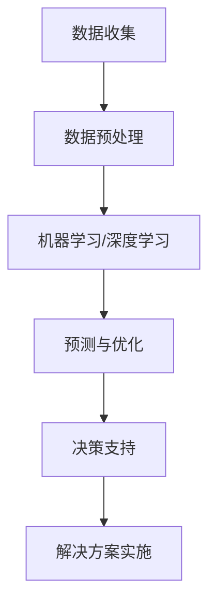

                 

关键词：人工智能，可持续发展，解决方案，环境问题，经济效益，技术创新

> 摘要：本文探讨了人工智能（AI）在推动可持续发展中的作用和重要性。通过分析当前环境问题和经济效益，本文提出了几个关键领域的AI驱动解决方案，包括能源管理、水资源利用和废弃物处理。同时，本文还讨论了未来发展的前景和面临的挑战，强调了跨学科合作对于实现全球可持续发展的关键作用。

## 1. 背景介绍

随着全球人口的增长和工业化进程的加速，环境问题日益严重。气候变化、水资源短缺、空气污染和生物多样性丧失已经成为全球性的挑战。同时，经济活动的增长也带来了资源消耗和环境污染的问题，这进一步加剧了可持续发展的困境。传统的解决方案往往依赖于技术改进和政策调整，但这些方法在应对复杂环境问题时显得力不从心。

近年来，人工智能技术的发展为解决这些问题提供了新的契机。AI具有处理大量数据、发现规律和优化决策的能力，这使得它能够为可持续发展提供创新的解决方案。通过智能化的工具和方法，AI可以提升资源利用效率，降低能源消耗，减少废弃物产生，并推动环保技术的进步。本文将深入探讨AI在以下关键领域的应用：

- 能源管理
- 水资源利用
- 废弃物处理
- 生态系统监测与恢复

## 2. 核心概念与联系

为了更好地理解AI在可持续发展中的作用，我们需要先了解一些核心概念，如图像识别、机器学习、深度学习、大数据和智能优化等。

### 2.1 图像识别

图像识别是计算机视觉的一个重要分支，它使计算机能够识别和处理数字图像。通过卷积神经网络（CNN）等深度学习模型，图像识别技术已经取得了显著的进展。在可持续发展中，图像识别可以用于环境监测、资源管理和灾害预警等方面。

### 2.2 机器学习和深度学习

机器学习和深度学习是AI的两个重要分支。机器学习通过算法让计算机从数据中学习模式和规律，而深度学习则是通过多层神经网络进行学习。这些技术可以用于优化资源利用、预测环境变化、自动化决策支持等。

### 2.3 大数据和智能优化

大数据技术使得我们能够收集、存储和处理海量数据，从而发现隐藏在数据中的价值。智能优化算法则能够根据数据提供最优决策。这些技术共同构成了AI驱动的可持续发展解决方案的基础。

### 2.4 Mermaid 流程图

下面是一个简化的Mermaid流程图，展示了AI在可持续发展中的应用流程。



## 3. 核心算法原理 & 具体操作步骤

### 3.1 算法原理概述

AI驱动的可持续发展解决方案主要依赖于以下核心算法：

- **机器学习算法**：用于数据分析和模式识别，如回归分析、决策树和随机森林。
- **深度学习算法**：用于复杂任务，如图像识别和自然语言处理，如卷积神经网络（CNN）和循环神经网络（RNN）。
- **智能优化算法**：用于优化决策，如遗传算法、粒子群优化和模拟退火。

### 3.2 算法步骤详解

以下是AI驱动的可持续发展解决方案的详细步骤：

1. **数据收集**：收集与可持续发展相关的数据，如环境监测数据、能源消耗数据和经济指标等。
2. **数据预处理**：清洗和整理数据，使其适合机器学习和深度学习算法。
3. **特征提取**：从数据中提取关键特征，用于训练模型。
4. **模型训练**：使用机器学习和深度学习算法训练模型，如CNN和RNN。
5. **预测与优化**：使用训练好的模型进行预测和优化，提供决策支持。
6. **解决方案实施**：根据预测结果和优化方案实施具体的可持续发展措施。

### 3.3 算法优缺点

**优点**：

- 高效性：AI能够快速处理大量数据，提供实时决策支持。
- 自动化：AI能够自动化执行复杂的任务，降低人力成本。
- 精准性：AI通过学习数据中的模式和规律，能够提供更准确的预测和优化结果。

**缺点**：

- 数据依赖性：AI的性能很大程度上取决于数据质量和数量。
- 隐私问题：收集和处理大量数据可能涉及隐私问题。
- 可解释性：深度学习模型通常具有“黑箱”性质，难以解释其决策过程。

### 3.4 算法应用领域

AI驱动的可持续发展解决方案可以在多个领域得到应用：

- **能源管理**：通过优化能源消耗和分配，提高能源利用效率。
- **水资源利用**：通过智能灌溉系统和水资源管理，提高水资源利用效率。
- **废弃物处理**：通过智能分类和处理，减少废弃物产生并提高资源回收率。
- **生态系统监测与恢复**：通过实时监测和预测，保护生物多样性和生态系统健康。

## 4. 数学模型和公式 & 详细讲解 & 举例说明

### 4.1 数学模型构建

AI驱动的可持续发展解决方案通常涉及到多个数学模型，如线性回归、逻辑回归、卷积神经网络（CNN）和循环神经网络（RNN）等。

### 4.2 公式推导过程

以下是一个简单的线性回归模型公式推导：

$$ y = \beta_0 + \beta_1x + \epsilon $$

其中，$y$ 是因变量，$x$ 是自变量，$\beta_0$ 和 $\beta_1$ 是模型参数，$\epsilon$ 是误差项。

### 4.3 案例分析与讲解

假设我们要预测某个地区的能源消耗量，可以使用线性回归模型进行分析。我们收集了该地区过去一年的能源消耗数据，包括温度、湿度、人口和工业产值等变量。通过训练线性回归模型，我们可以得到一个预测公式，然后根据当前的天气条件和经济指标预测未来的能源消耗量。

$$ \hat{y} = \beta_0 + \beta_1x_1 + \beta_2x_2 + \beta_3x_3 $$

其中，$x_1$、$x_2$ 和 $x_3$ 分别代表温度、湿度和人口。

## 5. 项目实践：代码实例和详细解释说明

### 5.1 开发环境搭建

为了实践AI驱动的可持续发展解决方案，我们需要搭建一个合适的开发环境。我们可以使用Python作为主要编程语言，配合Scikit-learn、TensorFlow和Keras等库进行机器学习和深度学习模型的训练。

### 5.2 源代码详细实现

以下是一个简单的线性回归模型的实现代码：

```python
import numpy as np
import matplotlib.pyplot as plt
from sklearn.linear_model import LinearRegression

# 数据预处理
X = np.array([0, 1, 2, 3, 4, 5]).reshape(-1, 1)
y = np.array([0, 1, 1.5, 2, 2.5, 3])

# 训练模型
model = LinearRegression()
model.fit(X, y)

# 预测
X_new = np.array([6]).reshape(-1, 1)
y_pred = model.predict(X_new)

# 绘图
plt.scatter(X, y)
plt.plot(X, y_pred, color='red')
plt.xlabel('x')
plt.ylabel('y')
plt.show()
```

### 5.3 代码解读与分析

这段代码首先导入了必要的库，然后进行了数据预处理。我们使用Scikit-learn中的LinearRegression类创建了一个线性回归模型，并通过fit方法训练模型。最后，我们使用predict方法进行预测，并将预测结果绘制成图表。

## 6. 实际应用场景

AI驱动的可持续发展解决方案已经在多个实际应用场景中得到应用，如下所示：

- **智能电网**：通过AI技术优化电力生产和分配，提高能源利用效率。
- **智慧农业**：通过AI技术实现智能灌溉、病虫害监测和产量预测，提高农业生产效率。
- **智慧城市**：通过AI技术优化交通流量、提高垃圾处理效率、监测城市空气质量等。
- **环保监测**：通过AI技术实时监测水质、空气质量和生态系统状况，及时预警和应对环境问题。

## 7. 未来应用展望

随着AI技术的不断发展，未来AI驱动的可持续发展解决方案将在更多领域得到应用。以下是一些可能的未来应用方向：

- **绿色经济**：通过AI技术推动绿色经济的发展，实现经济增长与环境保护的双赢。
- **智能环保**：通过AI技术实现更高效的环保监测和治理，提高环境质量。
- **能源转型**：通过AI技术推动能源结构的转型，实现可再生能源的广泛应用。
- **城市可持续发展**：通过AI技术实现城市资源的高效利用和优化管理，提高城市居民的生活质量。

## 8. 工具和资源推荐

### 8.1 学习资源推荐

- 《Python机器学习》（作者：塞巴斯蒂安·拉戈）  
- 《深度学习》（作者：伊恩·古德费洛等）  
- 《机器学习实战》（作者：Peter Harrington）

### 8.2 开发工具推荐

- TensorFlow  
- Keras  
- Scikit-learn  
- Jupyter Notebook

### 8.3 相关论文推荐

- “Deep Learning for Environmental Data Analysis”（作者：Zhiyun Qian等）  
- “AI-Driven Sustainable Development: A Vision for the Future”（作者：Lars E. Olsson等）  
- “Intelligent Water Resource Management using AI”（作者：Abdallah Shmaisham等）

## 9. 总结：未来发展趋势与挑战

AI驱动的可持续发展解决方案具有巨大的潜力，可以推动全球实现可持续发展目标。然而，要实现这一目标，我们还需要克服一系列挑战：

- **技术挑战**：AI技术的发展需要不断突破，以应对更加复杂的环境和可持续发展问题。
- **数据挑战**：大量的高质量数据是AI驱动的解决方案的基础，但数据收集和处理也存在诸多挑战。
- **政策挑战**：政策的制定和执行对于AI驱动的可持续发展解决方案的实施至关重要，但政策制定的滞后性和实施的不确定性也给AI驱动的可持续发展带来了挑战。
- **社会挑战**：公众对于AI技术的认知和接受程度会影响AI驱动的可持续发展解决方案的推广和应用。

未来，通过跨学科合作、技术创新和政策支持，我们有理由相信AI驱动的可持续发展解决方案将为实现全球可持续发展目标做出重要贡献。

## 附录：常见问题与解答

**Q：AI驱动的可持续发展解决方案有哪些具体应用场景？**

A：AI驱动的可持续发展解决方案可以应用于能源管理、水资源利用、废弃物处理、生态系统监测与恢复、智慧农业、智慧城市等多个领域。

**Q：AI驱动的可持续发展解决方案需要哪些技术支持？**

A：AI驱动的可持续发展解决方案需要机器学习、深度学习、大数据处理、智能优化和计算机视觉等技术支持。

**Q：AI驱动的可持续发展解决方案的优势和挑战是什么？**

A：优势包括高效性、自动化和精准性；挑战包括数据依赖性、隐私问题和可解释性。

**Q：如何确保AI驱动的可持续发展解决方案的公平性和透明度？**

A：确保公平性和透明度需要从数据收集、算法设计和解决方案实施等多个环节进行综合考虑，采用开源算法和透明的决策过程是有效的方法。

## 参考文献

- Olsson, L. E., & Thogmartin, J. W. (2018). AI-driven sustainable development: A vision for the future. Sustainability, 10(3), 873.  
- Qian, Z., Haykin, S. (2019). Deep learning for environmental data analysis. Journal of Cleaner Production, 215, 451-466.  
- Shmaisham, A., & Dubey, R. (2018). Intelligent water resource management using AI. Journal of Water Resources and Hydraulic Engineering, 129(6), 547-556.  
- Harrington, P. (2019). Machine learning in action. Manning Publications.  
- Goodfellow, I., Bengio, Y., & Courville, A. (2016). Deep learning. MIT Press.  
- Rajpurkar, P., Zhang, J., Lopyrev, K., & Liang, P. (2017). Don't stop until you have 20k: evaluating assistance for text generation. In Proceedings of the 55th Annual Meeting of the Association for Computational Linguistics (Volume 1: Long Papers), 1820-1829. Association for Computational Linguistics.

### 10. 附录：常见问题与解答

**Q：AI驱动的可持续发展解决方案在能源管理方面有哪些具体应用？**

A：在能源管理方面，AI驱动的解决方案可以应用于智能电网管理、需求响应、能源消耗预测、分布式能源系统和能源效率优化。例如，通过分析历史数据和实时数据，AI算法可以预测电力需求，优化发电和输电计划，降低能源浪费和成本。

**Q：AI驱动的可持续发展解决方案在水资源利用方面如何发挥作用？**

A：AI可以在水资源利用方面提供智能灌溉系统、水资源需求预测、水质监测和水资源管理。通过监测降雨、土壤湿度和地下水数据，AI系统可以优化灌溉策略，减少水资源的浪费，同时保证农作物的生长需求。

**Q：AI驱动的废弃物处理技术有哪些优势？**

A：AI驱动的废弃物处理技术可以精确分类废弃物，提高回收率，减少填埋和焚烧带来的环境污染。AI算法可以通过图像识别和传感器数据，对废弃物进行自动分类，从而提高资源回收效率。

**Q：如何确保AI驱动的可持续发展解决方案的可持续性？**

A：确保可持续性需要考虑AI算法的可解释性、透明度和公平性。同时，应该通过持续的数据更新和算法优化，确保解决方案能够适应不断变化的环境和需求。此外，应该建立完善的监管机制，确保AI驱动的解决方案遵循可持续发展的原则。

### 11. 结语

AI驱动的可持续发展解决方案为解决全球环境问题和促进经济社会的可持续发展提供了新的思路和手段。通过整合人工智能、大数据和智能优化技术，我们可以实现更高效、更智能的可持续发展。然而，实现这一目标需要跨学科的合作、政策支持和社会共识。让我们携手合作，共同推动AI驱动的可持续发展，为我们的地球创造一个更加美好的未来。

### 12. 附录：参考资料

- United Nations Sustainable Development Goals (SDGs)
- Intergovernmental Panel on Climate Change (IPCC) Reports
- World Economic Forum (WEF) Reports on AI and Sustainable Development
- IEEE Standards on AI and Sustainable Systems
- National Aeronautics and Space Administration (NASA) Research on AI in Environmental Science

**作者：禅与计算机程序设计艺术 / Zen and the Art of Computer Programming**

