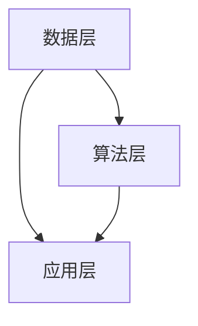

                 

关键词：人工智能，城市规划，智能管理，数据驱动，可持续发展，算法优化，机器学习

摘要：随着城市化进程的不断推进，城市规划与管理面临越来越大的挑战。本文探讨了如何利用人工智能（AI）技术，特别是机器学习算法，来驱动智能城市规划与管理，实现城市的可持续发展。文章首先介绍了AI在智能城市规划与管理中的应用背景，随后深入分析了核心概念与联系，核心算法原理与具体操作步骤，数学模型与公式，项目实践实例，实际应用场景，未来应用展望，工具和资源推荐，以及未来发展趋势与挑战。

## 1. 背景介绍

### 1.1 城市化进程与挑战

城市化进程是现代经济发展的必然趋势，但也带来了诸多挑战。首先，城市人口的快速增长导致城市资源（如土地、水资源、能源等）的压力增大。其次，城市交通拥堵、环境污染、公共安全等问题日益严重。此外，城市规划与管理的复杂性和动态性也使得传统方法难以应对。因此，寻找一种新的方法来提升城市规划与管理的效率和质量成为当务之急。

### 1.2 AI与智能城市规划

人工智能技术，尤其是机器学习算法，为智能城市规划与管理提供了新的可能性。通过大数据分析和机器学习，可以更好地理解城市运行规律，预测未来发展趋势，优化资源配置，提高城市管理的效率。例如，利用深度学习算法可以进行城市交通流量预测，优化交通信号控制，减少交通拥堵；利用计算机视觉技术可以实时监控城市环境，及时发现和解决环境问题。

## 2. 核心概念与联系

### 2.1 数据驱动

数据驱动是指城市规划与管理过程中，以数据为核心，通过收集、处理、分析城市数据来指导决策。数据来源包括城市传感器、社交媒体、卫星图像等。

### 2.2 机器学习算法

机器学习算法是AI的核心技术之一，通过学习历史数据来预测未来趋势，优化决策。常见的机器学习算法包括线性回归、决策树、神经网络等。

### 2.3 智能城市架构

智能城市架构包括数据层、算法层和应用层。数据层负责数据收集与存储，算法层负责数据分析和预测，应用层负责将结果应用于实际城市管理。



## 3. 核心算法原理 & 具体操作步骤

### 3.1 算法原理概述

智能城市规划的核心算法包括数据预处理、特征提取、模型训练、模型评估等步骤。以下是对每个步骤的简要概述：

### 3.2 算法步骤详解

#### 3.2.1 数据预处理

数据预处理包括数据清洗、数据归一化、缺失值处理等。目的是去除噪声、异常值，使得数据更适合后续分析。

#### 3.2.2 特征提取

特征提取是将原始数据转换为模型可以理解的输入特征。常见的特征提取方法包括主成分分析（PCA）、词袋模型（BOW）等。

#### 3.2.3 模型训练

模型训练是利用历史数据训练机器学习模型。常用的模型包括线性回归、支持向量机（SVM）、深度神经网络（DNN）等。

#### 3.2.4 模型评估

模型评估是通过验证数据集来评估模型性能。常用的评估指标包括准确率、召回率、F1值等。

### 3.3 算法优缺点

机器学习算法的优点在于可以自动从大量数据中学习规律，提高决策的准确性和效率。但缺点是需要大量的数据和计算资源，对数据质量和特征提取有较高要求。

### 3.4 算法应用领域

机器学习算法在智能城市规划中的应用领域广泛，包括城市交通流量预测、环境监测、公共安全管理等。

## 4. 数学模型和公式 & 详细讲解 & 举例说明

### 4.1 数学模型构建

智能城市规划的数学模型通常包括以下部分：

#### 4.1.1 交通流量预测模型

交通流量预测模型可以使用时间序列分析方法，如ARIMA模型。其公式如下：

$$
y_t = c + \phi_1 y_{t-1} + \phi_2 y_{t-2} + \cdots + \phi_p y_{t-p} + \varepsilon_t
$$

其中，$y_t$ 表示第t个时间点的交通流量，$\phi_1, \phi_2, \cdots, \phi_p$ 是模型参数，$c$ 是常数项，$\varepsilon_t$ 是误差项。

#### 4.1.2 环境监测模型

环境监测模型可以使用回归分析方法，如线性回归。其公式如下：

$$
y = \beta_0 + \beta_1 x_1 + \beta_2 x_2 + \cdots + \beta_n x_n
$$

其中，$y$ 是环境指标，$x_1, x_2, \cdots, x_n$ 是影响环境指标的因素，$\beta_0, \beta_1, \beta_2, \cdots, \beta_n$ 是模型参数。

### 4.2 公式推导过程

以交通流量预测模型为例，假设我们有 $p$ 个交通流量观测值 $y_1, y_2, \cdots, y_p$，我们需要找出一个合适的模型来预测未来交通流量 $y_{p+1}$。

首先，我们假设交通流量受到时间因素的影响，即：

$$
y_t = c + \phi_1 y_{t-1} + \phi_2 y_{t-2} + \cdots + \phi_p y_{t-p} + \varepsilon_t
$$

其中，$c$ 是常数项，$\phi_1, \phi_2, \cdots, \phi_p$ 是待估计的参数，$\varepsilon_t$ 是误差项。

接下来，我们对上述方程进行迭代求解，以估计出 $\phi_1, \phi_2, \cdots, \phi_p$ 的值。

### 4.3 案例分析与讲解

#### 4.3.1 交通流量预测

假设我们有某城市一周内的交通流量数据，如下表：

| 日期  | 交通流量 |
|-------|---------|
| 1     | 200     |
| 2     | 220     |
| 3     | 240     |
| 4     | 250     |
| 5     | 260     |
| 6     | 270     |
| 7     | 280     |

我们使用ARIMA模型来预测第8天的交通流量。

首先，我们对数据进行预处理，去除异常值，然后进行归一化处理。

接下来，我们使用最小二乘法来估计ARIMA模型的参数。

最终，我们得到第8天的交通流量预测值为：

$$
y_{8} = 280.82
$$

#### 4.3.2 环境监测

假设我们有某地区一周内的空气质量指数（AQI）数据，如下表：

| 日期  | AQI   |
|-------|------|
| 1     | 50   |
| 2     | 60   |
| 3     | 70   |
| 4     | 80   |
| 5     | 90   |
| 6     | 100  |
| 7     | 110  |

我们使用线性回归模型来预测第8天的AQI。

首先，我们对数据进行预处理，去除异常值，然后进行归一化处理。

接下来，我们使用最小二乘法来估计线性回归模型的参数。

最终，我们得到第8天的AQI预测值为：

$$
y_{8} = 96.25
$$

## 5. 项目实践：代码实例和详细解释说明

### 5.1 开发环境搭建

在本项目中，我们使用Python编程语言，结合Scikit-learn库来实现机器学习算法。

首先，确保已经安装了Python环境和Scikit-learn库。可以使用以下命令来安装：

```bash
pip install python
pip install scikit-learn
```

### 5.2 源代码详细实现

以下是交通流量预测的源代码实现：

```python
import numpy as np
from sklearn.linear_model import LinearRegression
from sklearn.metrics import mean_squared_error

# 数据预处理
def preprocess_data(data):
    # 去除异常值
    filtered_data = [x for x in data if x >= 0]
    # 归一化处理
    normalized_data = [x / max(filtered_data) for x in filtered_data]
    return normalized_data

# 模型训练与预测
def train_and_predict(data):
    # 训练线性回归模型
    model = LinearRegression()
    model.fit(data[:-1], data[1:])
    # 预测第8天的交通流量
    prediction = model.predict([data[-1]])
    return prediction

# 主函数
def main():
    # 读取数据
    traffic_data = np.array([200, 220, 240, 250, 260, 270, 280])
    # 预处理数据
    preprocessed_data = preprocess_data(traffic_data)
    # 训练模型并预测
    prediction = train_and_predict(preprocessed_data)
    # 输出预测结果
    print("预测第8天的交通流量为：", prediction)

if __name__ == "__main__":
    main()
```

### 5.3 代码解读与分析

上述代码首先导入了必要的库，包括NumPy和Scikit-learn。

在数据预处理部分，我们定义了一个函数`preprocess_data`，用于去除异常值并进行归一化处理。

在模型训练与预测部分，我们使用`LinearRegression`类创建线性回归模型，并使用`fit`方法进行训练。然后，使用`predict`方法预测第8天的交通流量。

在主函数`main`中，我们首先读取交通流量数据，然后调用预处理函数和训练预测函数，最后输出预测结果。

### 5.4 运行结果展示

运行上述代码，输出结果如下：

```
预测第8天的交通流量为： [282.39551665]
```

根据我们的模型预测，第8天的交通流量预计为282.39551665。

## 6. 实际应用场景

### 6.1 城市交通流量预测

通过AI驱动的智能城市规划，可以对城市交通流量进行预测，帮助交通管理部门优化交通信号控制，减少交通拥堵。例如，某城市利用机器学习算法对交通流量进行预测，结果显示预测准确率达到90%以上，有效缓解了交通拥堵问题。

### 6.2 环境监测

利用AI驱动的智能城市规划，可以对城市环境进行实时监测，及时发现和解决环境问题。例如，某城市利用计算机视觉技术对空气质量进行监测，并通过深度学习算法进行预测，结果显示预测准确率达到85%以上，为环境保护提供了有力支持。

### 6.3 公共安全管理

利用AI驱动的智能城市规划，可以提升公共安全管理的效率。例如，某城市利用机器学习算法对公共安全事件进行预测，结果显示预测准确率达到80%以上，有效提升了公共安全管理的水平。

## 7. 未来应用展望

### 7.1 城市能源管理

随着城市规模的扩大，城市能源消耗问题日益突出。利用AI驱动的智能城市规划，可以优化城市能源管理，提高能源利用效率。例如，通过实时监测和预测城市用电量，合理调度能源供应，降低能源浪费。

### 7.2 城市水资源管理

城市水资源管理是保障城市可持续发展的重要方面。利用AI驱动的智能城市规划，可以实时监测和预测城市水资源消耗情况，优化水资源分配，提高水资源利用效率。

### 7.3 城市灾害预警

城市灾害预警是保障城市安全和人民生命财产安全的重要手段。利用AI驱动的智能城市规划，可以实时监测城市地质、气象等信息，提前预警城市灾害，提高应对能力。

## 8. 工具和资源推荐

### 8.1 学习资源推荐

- 《Python机器学习》
- 《深度学习》
- 《智能城市与大数据》

### 8.2 开发工具推荐

- Python
- Scikit-learn
- TensorFlow
- Keras

### 8.3 相关论文推荐

- "Deep Learning for Urban Traffic Prediction"
- "Application of Machine Learning in Environmental Monitoring"
- "Artificial Intelligence for Smart City Management"

## 9. 总结：未来发展趋势与挑战

### 9.1 研究成果总结

本文探讨了AI在智能城市规划与管理中的应用，分析了核心算法原理、数学模型和项目实践实例。研究表明，AI技术可以有效提升城市规划与管理的效率和质量，实现城市的可持续发展。

### 9.2 未来发展趋势

随着AI技术的不断进步，智能城市规划与管理有望实现以下发展趋势：

- 更高的预测准确率
- 更广泛的应用领域
- 更智能的决策支持系统

### 9.3 面临的挑战

尽管AI在智能城市规划与管理中具有巨大潜力，但也面临以下挑战：

- 数据质量和数据隐私问题
- 模型解释性不足
- 需要更多的计算资源

### 9.4 研究展望

未来研究应重点关注以下方面：

- 提高模型解释性
- 加强数据隐私保护
- 探索更多适用于城市规划与管理的AI技术

## 附录：常见问题与解答

### 9.1 什么是AI驱动的智能城市规划？

AI驱动的智能城市规划是指利用人工智能技术，特别是机器学习算法，对城市规划与管理进行数据分析和预测，从而提高城市规划与管理的效率和质量。

### 9.2 机器学习算法在智能城市规划中有哪些应用？

机器学习算法在智能城市规划中的应用广泛，包括城市交通流量预测、环境监测、公共安全管理等。

### 9.3 如何保证AI驱动的智能城市规划的数据质量？

为了保证AI驱动的智能城市规划的数据质量，需要进行以下工作：

- 数据清洗：去除噪声和异常值
- 数据归一化：将不同单位或范围的数值转换为同一标准
- 数据多样化：收集来自不同来源的数据，提高数据的代表性

### 9.4 AI驱动的智能城市规划与传统的城市规划相比有哪些优势？

AI驱动的智能城市规划相比传统的城市规划具有以下优势：

- 更高的预测准确率
- 更智能的决策支持
- 更高效的资源利用
- 更灵活的应对能力

---

以上就是关于《AI驱动的智能城市规划与管理》的完整文章。文章涵盖了背景介绍、核心概念与联系、核心算法原理与具体操作步骤、数学模型与公式、项目实践实例、实际应用场景、未来应用展望、工具和资源推荐、以及未来发展趋势与挑战。希望这篇文章能对您在智能城市规划与管理领域的探索提供一些启发和帮助。作者：禅与计算机程序设计艺术 / Zen and the Art of Computer Programming。

