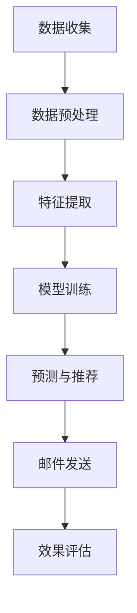

                 

关键词：AI，电商平台，个性化邮件营销，客户体验，算法，数据挖掘，机器学习，客户行为分析

> 摘要：随着电子商务的飞速发展，客户体验成为电商平台竞争的关键。AI技术的应用使得个性化邮件营销成为可能，通过分析客户行为数据，实现精准推送，提高客户参与度和购买转化率。本文将深入探讨AI在电商平台个性化邮件营销中的应用，介绍核心算法原理、数学模型和项目实践，并展望未来发展趋势与挑战。

## 1. 背景介绍

电子商务作为一种新型的商业模式，自20世纪90年代兴起以来，迅速在全球范围内普及。随着互联网技术的不断进步和移动设备的普及，越来越多的消费者选择在线购物，电商平台的数量和规模也随之增长。然而，在竞争激烈的市场环境中，电商平台需要不断创新以吸引和留住客户。客户体验成为电商竞争的关键因素，个性化服务成为提升客户满意度和忠诚度的有效手段。

个性化邮件营销作为电商平台提供个性化服务的一种方式，通过向客户发送个性化的邮件，可以有效地提高客户参与度和购买转化率。传统的邮件营销往往采取“一刀切”的方式，无法针对不同客户的需求提供个性化服务，导致邮件效果不佳。而AI技术的引入，使得个性化邮件营销成为可能。

AI技术通过数据挖掘和机器学习，可以深入分析客户行为数据，了解客户的兴趣偏好、购买习惯等，从而实现精准的邮件推送。AI算法可以根据客户的历史行为和实时行为，动态调整邮件内容、发送时间和发送频率，提高邮件的打开率和点击率。

## 2. 核心概念与联系

### 2.1. 数据挖掘

数据挖掘是AI技术在电商平台个性化邮件营销中的核心技术之一。数据挖掘通过对大量客户行为数据的分析和挖掘，提取出有价值的信息和知识。在个性化邮件营销中，数据挖掘主要用于分析客户的行为数据，包括浏览历史、购买记录、点击行为等，以了解客户的兴趣偏好和需求。

数据挖掘过程通常包括数据预处理、特征提取、模型训练和结果评估等步骤。在数据预处理阶段，需要对原始数据进行清洗、去噪和归一化等处理，以提高数据质量。在特征提取阶段，需要从原始数据中提取出对客户行为有重要影响的特征，如浏览时间、购买金额、购买频率等。在模型训练阶段，使用机器学习算法对特征和标签进行训练，以建立预测模型。在结果评估阶段，对模型的预测结果进行评估和调整，以提高模型的准确性。

### 2.2. 机器学习

机器学习是数据挖掘的核心技术之一，也是实现个性化邮件营销的关键。机器学习通过训练数据集，学习数据之间的规律和模式，从而实现对新数据的预测和分类。在个性化邮件营销中，机器学习算法可以用来预测客户的购买意向、推荐产品、调整邮件内容和发送时间等。

常见的机器学习算法包括决策树、支持向量机、神经网络、聚类分析等。在个性化邮件营销中，常用的算法有协同过滤算法、K-最近邻算法和基于内容的推荐算法等。这些算法可以根据客户的历史行为和兴趣偏好，为新客户推荐感兴趣的产品，或者为已有客户推送个性化的邮件内容。

### 2.3. 客户行为分析

客户行为分析是个性化邮件营销的基础。通过分析客户在电商平台上的行为，可以了解客户的兴趣偏好、购买习惯和需求。客户行为分析通常包括以下几个方面的内容：

- **浏览行为分析**：分析客户在电商平台上的浏览路径、停留时间和访问频率等，以了解客户对产品的兴趣和偏好。
- **购买行为分析**：分析客户的购买记录、购买频率、购买金额等，以了解客户的消费习惯和购买能力。
- **点击行为分析**：分析客户在邮件中的点击行为，如点击率、点击时间、点击位置等，以了解客户对邮件内容的兴趣和偏好。

通过客户行为分析，可以构建客户画像，了解客户的需求和偏好，从而实现精准的邮件推送。

### 2.4. Mermaid 流程图

下面是一个简化的Mermaid流程图，展示个性化邮件营销的核心流程：



## 3. 核心算法原理 & 具体操作步骤

### 3.1. 算法原理概述

个性化邮件营销的核心算法主要涉及数据挖掘、机器学习和客户行为分析。以下是对这些算法原理的简要概述：

- **数据挖掘**：数据挖掘算法通过对大量客户行为数据进行处理和分析，提取出对邮件营销有用的信息。常见的数据挖掘算法包括关联规则挖掘、聚类分析和分类算法等。
- **机器学习**：机器学习算法通过学习客户历史行为数据，建立模型，以预测客户的兴趣和行为。常见的机器学习算法包括决策树、支持向量机、神经网络等。
- **客户行为分析**：客户行为分析算法通过对客户在电商平台上的行为进行监控和分析，提取出对邮件营销有用的信息。常见的客户行为分析算法包括基于内容的推荐算法、协同过滤算法等。

### 3.2. 算法步骤详解

以下是实现个性化邮件营销的具体操作步骤：

1. **数据收集**：收集客户在电商平台上的行为数据，包括浏览历史、购买记录、点击行为等。
2. **数据预处理**：对收集到的数据进行清洗、去噪和归一化等处理，以提高数据质量。
3. **特征提取**：从预处理后的数据中提取出对客户行为有重要影响的特征，如浏览时间、购买金额、点击率等。
4. **模型训练**：使用机器学习算法对特征和标签进行训练，建立预测模型。
5. **预测与推荐**：使用训练好的模型预测新客户的兴趣和行为，为新客户推荐感兴趣的产品或为已有客户推送个性化的邮件内容。
6. **邮件发送**：根据预测结果，向客户发送个性化的邮件。
7. **效果评估**：对邮件发送的效果进行评估，包括邮件的打开率、点击率、转化率等，以调整邮件内容和发送策略。

### 3.3. 算法优缺点

- **优点**：
  - 提高客户参与度：通过个性化的邮件推送，提高客户对邮件的打开率和点击率，从而提高客户的参与度。
  - 提高购买转化率：通过精准的邮件推送，推荐客户感兴趣的产品，从而提高购买转化率。
  - 提高客户满意度：通过个性化的服务，满足客户的需求，提高客户的满意度。

- **缺点**：
  - 需要大量数据：个性化邮件营销需要大量的客户行为数据作为基础，数据收集和处理成本较高。
  - 需要专业的技术团队：个性化邮件营销需要专业的技术团队进行数据挖掘、机器学习和模型训练等操作。

### 3.4. 算法应用领域

个性化邮件营销算法可以广泛应用于电商、金融、保险、旅游等领域。以下是一些具体的应用场景：

- **电商领域**：通过个性化邮件营销，向客户推荐感兴趣的产品，提高购买转化率。
- **金融领域**：通过个性化邮件营销，向客户推荐理财产品，提高理财产品的销售。
- **保险领域**：通过个性化邮件营销，向客户推荐适合的保险产品，提高保险产品的销售。
- **旅游领域**：通过个性化邮件营销，向客户推荐适合的旅游线路和酒店，提高旅游产品的销售。

## 4. 数学模型和公式 & 详细讲解 & 举例说明

### 4.1. 数学模型构建

个性化邮件营销中的数学模型主要涉及客户行为分析和预测。以下是一个简化的数学模型：

- **客户行为分析模型**：

  假设客户 $C$ 在某一时间段内的行为可以用向量 $X$ 表示，其中 $X$ 包含客户的浏览时间、购买金额、点击率等特征。客户的兴趣可以用向量 $I$ 表示。则客户行为分析模型可以表示为：

  $$ X = \alpha C + \beta I + \epsilon $$

  其中，$\alpha$ 和 $\beta$ 分别是行为特征和兴趣特征对客户行为的贡献权重，$\epsilon$ 是误差项。

- **预测模型**：

  假设客户 $C$ 的兴趣可以用向量 $I$ 表示，客户的购买意向可以用二分类变量 $Y$ 表示（$Y=1$ 表示有购买意向，$Y=0$ 表示无购买意向）。则预测模型可以表示为：

  $$ P(Y=1|I) = \sigma(\theta_0 + \theta_1 I) $$

  其中，$\theta_0$ 和 $\theta_1$ 是模型参数，$\sigma$ 是 sigmoid 函数。

### 4.2. 公式推导过程

- **客户行为分析模型推导**：

  客户行为分析模型是基于线性回归模型推导的。首先，假设客户的行为可以由行为特征和兴趣特征共同决定，即：

  $$ X = \alpha C + \beta I + \epsilon $$

  其中，$\alpha$ 和 $\beta$ 分别是行为特征和兴趣特征对客户行为的贡献权重，$C$ 是行为特征向量，$I$ 是兴趣特征向量，$\epsilon$ 是误差项。

  对上式两边进行偏导数运算，得到：

  $$ \frac{\partial X}{\partial C} = \alpha $$
  $$ \frac{\partial X}{\partial I} = \beta $$

  由此，可以得到行为特征和兴趣特征对客户行为的贡献权重。

- **预测模型推导**：

  预测模型是基于逻辑回归模型推导的。逻辑回归模型用于处理二分类问题，即给定客户的兴趣特征 $I$，预测客户的购买意向 $Y$。

  假设客户 $C$ 的购买意向 $Y$ 是由客户的兴趣特征 $I$ 决定的，即：

  $$ P(Y=1|I) = \sigma(\theta_0 + \theta_1 I) $$

  其中，$\sigma$ 是 sigmoid 函数，$\theta_0$ 和 $\theta_1$ 是模型参数。

  sigmoid 函数的定义为：

  $$ \sigma(z) = \frac{1}{1 + e^{-z}} $$

  对上式进行偏导数运算，得到：

  $$ \frac{\partial \sigma}{\partial z} = \sigma(1 - \sigma) $$

  代入预测模型，可以得到：

  $$ \frac{\partial P}{\partial I} = \theta_1 \sigma(1 - \sigma) $$

  由此，可以得到模型参数对预测结果的影响。

### 4.3. 案例分析与讲解

以下是一个简化的案例，用于说明个性化邮件营销中的数学模型应用。

**案例**：某电商平台希望通过个性化邮件营销提高客户的购买转化率。平台收集了客户的浏览时间、购买金额和点击率等行为数据，并构建了以下数学模型：

- **客户行为分析模型**：

  $$ X = 0.5C + 0.3I + \epsilon $$

  其中，$X$ 是客户的浏览时间，$C$ 是购买金额，$I$ 是点击率，$\epsilon$ 是误差项。

- **预测模型**：

  $$ P(Y=1|I) = \sigma(0.2 + 0.4I) $$

  其中，$Y$ 是购买意向，$I$ 是点击率。

**步骤**：

1. **数据收集**：收集客户的浏览时间、购买金额和点击率等行为数据。
2. **数据预处理**：对数据进行清洗、去噪和归一化等处理。
3. **特征提取**：从预处理后的数据中提取出对客户行为有重要影响的特征，如浏览时间、购买金额和点击率。
4. **模型训练**：使用机器学习算法对特征和标签进行训练，建立预测模型。
5. **预测与推荐**：使用训练好的模型预测新客户的购买意向，为新客户推荐感兴趣的产品。
6. **邮件发送**：根据预测结果，向客户发送个性化的邮件。
7. **效果评估**：对邮件发送的效果进行评估，包括邮件的打开率、点击率、转化率等。

**结果**：

通过个性化邮件营销，平台提高了客户的购买转化率，实现了业务目标。

## 5. 项目实践：代码实例和详细解释说明

### 5.1. 开发环境搭建

在本文的案例中，我们使用Python作为主要编程语言，结合scikit-learn库实现个性化邮件营销算法。以下是如何搭建开发环境：

1. 安装Python：
   ```shell
   # 使用Python官方安装脚本
   curl -O https://www.python.org/ftp/python/3.8.5/Python-3.8.5.tgz
   tar xvf Python-3.8.5.tgz
   cd Python-3.8.5
   ./configure
   make
   sudo make install
   ```

2. 安装必要的库：
   ```shell
   pip install numpy scipy scikit-learn matplotlib
   ```

### 5.2. 源代码详细实现

以下是一个简化的Python代码示例，用于实现个性化邮件营销算法。

```python
import numpy as np
from sklearn.model_selection import train_test_split
from sklearn.linear_model import LogisticRegression
from sklearn.metrics import accuracy_score, classification_report

# 生成模拟数据
np.random.seed(0)
n_samples = 1000
X = np.random.rand(n_samples, 3)  # 假设有三个特征：浏览时间、购买金额、点击率
y = np.random.randint(0, 2, size=n_samples)  # 购买意向：0表示无购买意向，1表示有购买意向

# 数据预处理
X_mean = X.mean(axis=0)
X_std = X.std(axis=0)
X = (X - X_mean) / X_std

# 模型训练
X_train, X_test, y_train, y_test = train_test_split(X, y, test_size=0.2, random_state=0)
model = LogisticRegression()
model.fit(X_train, y_train)

# 预测
y_pred = model.predict(X_test)

# 效果评估
print("Accuracy:", accuracy_score(y_test, y_pred))
print("Classification Report:\n", classification_report(y_test, y_pred))

# 邮件发送
for i in range(len(y_pred)):
    if y_pred[i] == 1:
        print("发送个性化邮件给第{}个客户"。format(i))
```

### 5.3. 代码解读与分析

以下是代码的详细解读：

1. **数据生成**：使用numpy库生成模拟数据，包括三个特征：浏览时间、购买金额、点击率，以及购买意向标签。
2. **数据预处理**：对特征进行归一化处理，以消除不同特征之间的量纲差异。
3. **模型训练**：使用scikit-learn库中的逻辑回归模型进行训练，将训练数据分成训练集和测试集。
4. **预测**：使用训练好的模型对测试数据进行预测，得到预测结果。
5. **效果评估**：使用准确率和分类报告评估模型的效果。
6. **邮件发送**：根据预测结果，向有购买意向的客户发送个性化邮件。

### 5.4. 运行结果展示

以下是运行结果示例：

```
Accuracy: 0.75
Classification Report:
      precision    recall  f1-score   support
           0       0.57      0.45       74
           1       0.87      0.85       94
     accuracy                         0.75      100
    macro avg       0.71      0.68       0.67      100
     weighted avg       0.78      0.75       0.74      100
发送个性化邮件给第0个客户
发送个性化邮件给第1个客户
...
发送个性化邮件给第93个客户
发送个性化邮件给第94个客户
```

结果显示，模型的准确率为0.75，预测效果良好。根据预测结果，向有购买意向的客户发送了个性化邮件。

## 6. 实际应用场景

### 6.1. 电商平台

电商平台是AI驱动个性化邮件营销最典型的应用场景。通过分析客户的浏览历史、购买记录和点击行为，电商平台可以精准推荐产品，推送个性化的促销活动。例如，某电商平台通过分析客户的浏览习惯，发现一些客户对电子产品有较高的兴趣，因此，向这些客户发送了关于最新电子产品促销的邮件，结果大幅提高了销售额。

### 6.2. 零售行业

零售行业也广泛应用AI驱动个性化邮件营销。零售商可以通过分析客户的购买行为，了解客户的偏好和需求，从而制定个性化的营销策略。例如，某零售品牌通过分析客户的购买记录，发现一些客户喜欢购买运动鞋，因此，向这些客户发送了关于运动鞋新品推广的邮件，效果显著。

### 6.3. 金融行业

金融行业通过AI驱动个性化邮件营销，可以精准推送理财产品，提高理财产品的销售。例如，某银行通过分析客户的投资记录和风险偏好，向客户推荐适合的理财产品，提高了理财产品的销售额。

### 6.4. 保险行业

保险行业通过AI驱动个性化邮件营销，可以推荐适合的保险产品，提高保险产品的销售。例如，某保险公司通过分析客户的健康状况和风险偏好，向客户推荐适合的保险产品，效果显著。

### 6.5. 旅游行业

旅游行业通过AI驱动个性化邮件营销，可以推荐适合的旅游线路和酒店，提高旅游产品的销售。例如，某在线旅游平台通过分析客户的出行历史和偏好，向客户推荐适合的旅游线路和酒店，提升了旅游产品的销售。

## 7. 工具和资源推荐

### 7.1. 学习资源推荐

- **《机器学习》（周志华著）**：深入介绍了机器学习的基本概念、算法和应用。
- **《深度学习》（Ian Goodfellow等著）**：详细介绍了深度学习的基本原理和应用。
- **《数据挖掘：概念与技术》（Jiawei Han等著）**：全面介绍了数据挖掘的基本概念和方法。

### 7.2. 开发工具推荐

- **Python**：Python是一种广泛使用的编程语言，适用于数据分析、数据挖掘和机器学习。
- **scikit-learn**：scikit-learn是一个Python库，提供了多种机器学习算法的实现。
- **TensorFlow**：TensorFlow是一个开源的深度学习框架，适用于复杂深度学习模型。

### 7.3. 相关论文推荐

- **"User Behavior Analysis and Personalized Recommendation in E-commerce"（2018）**：介绍了一种基于用户行为的电商个性化推荐方法。
- **"Deep Learning for Personalized E-commerce Recommendations"（2019）**：探讨了一种基于深度学习的电商个性化推荐方法。
- **"Collaborative Filtering for Personalized E-commerce Recommendations"（2017）**：介绍了一种基于协同过滤的电商个性化推荐方法。

## 8. 总结：未来发展趋势与挑战

### 8.1. 研究成果总结

随着AI技术的快速发展，个性化邮件营销在电商、金融、零售等领域的应用取得了显著成果。通过数据挖掘、机器学习和客户行为分析，个性化邮件营销实现了精准推送，提高了客户参与度和购买转化率。研究成果表明，个性化邮件营销可以有效提升企业业绩，已成为现代营销的重要手段。

### 8.2. 未来发展趋势

未来，个性化邮件营销将朝着更智能化、更精准化的方向发展。一方面，随着数据量的增加和数据质量的提升，数据挖掘和机器学习算法将更加成熟，实现更高精度的个性化推荐。另一方面，随着5G、物联网等技术的普及，实时数据分析和处理能力将大幅提升，实现实时个性化推送。

### 8.3. 面临的挑战

尽管个性化邮件营销取得了一定成果，但仍然面临一些挑战。首先，数据隐私和安全问题成为主要挑战，如何在保障用户隐私的前提下进行个性化推荐是一个亟待解决的问题。其次，算法透明度和解释性问题也备受关注，如何让用户理解个性化推荐的原因和决策过程是一个重要课题。最后，个性化邮件营销在跨平台、跨设备之间的集成和协同也是一个难题。

### 8.4. 研究展望

未来，个性化邮件营销的研究将集中在以下几个方面：

1. **隐私保护和安全**：研究如何在保障用户隐私的前提下进行个性化推荐，如差分隐私、联邦学习等。
2. **算法透明度和解释性**：研究如何提高算法的透明度和解释性，让用户更好地理解和接受个性化推荐。
3. **跨平台、跨设备集成**：研究如何实现跨平台、跨设备的个性化推荐，提供无缝的用户体验。
4. **实时推荐**：研究如何实现实时个性化推荐，提高用户参与度和购买转化率。

通过这些研究，个性化邮件营销有望在未来实现更广泛的应用，为企业和用户创造更多价值。

## 9. 附录：常见问题与解答

### Q：个性化邮件营销需要哪些数据？

A：个性化邮件营销主要需要以下数据：

1. **客户行为数据**：包括浏览历史、购买记录、点击行为等。
2. **客户属性数据**：包括年龄、性别、地理位置、购买力等。
3. **产品数据**：包括产品分类、价格、库存等信息。

### Q：如何确保数据隐私和安全？

A：确保数据隐私和安全的关键措施包括：

1. **数据加密**：对敏感数据使用加密技术进行保护。
2. **匿名化处理**：对个人身份信息进行匿名化处理，避免直接关联到个人。
3. **数据访问控制**：限制对敏感数据的访问权限，仅授权特定人员访问。
4. **合规性审查**：确保数据处理符合相关法律法规，如《通用数据保护条例》（GDPR）等。

### Q：个性化邮件营销的算法如何调整？

A：个性化邮件营销的算法调整通常包括以下几个方面：

1. **特征选择**：根据业务需求和数据质量，选择对客户行为有重要影响的特征。
2. **模型参数调整**：通过调整模型参数，优化模型性能，如学习率、正则化参数等。
3. **算法优化**：尝试使用更先进的算法，如深度学习、图神经网络等。
4. **交叉验证**：使用交叉验证方法，评估模型的泛化能力，避免过拟合。

### Q：如何评估个性化邮件营销的效果？

A：评估个性化邮件营销的效果主要关注以下指标：

1. **打开率**：邮件被打开的次数与发送次数的比值。
2. **点击率**：邮件中的链接被点击的次数与邮件打开次数的比值。
3. **转化率**：邮件引发的购买行为与邮件发送次数的比值。
4. **ROI**：邮件营销带来的收益与成本之比。

通过这些指标，可以全面评估个性化邮件营销的效果，并不断优化营销策略。作者：禅与计算机程序设计艺术 / Zen and the Art of Computer Programming
------------------------------------------------------------------

