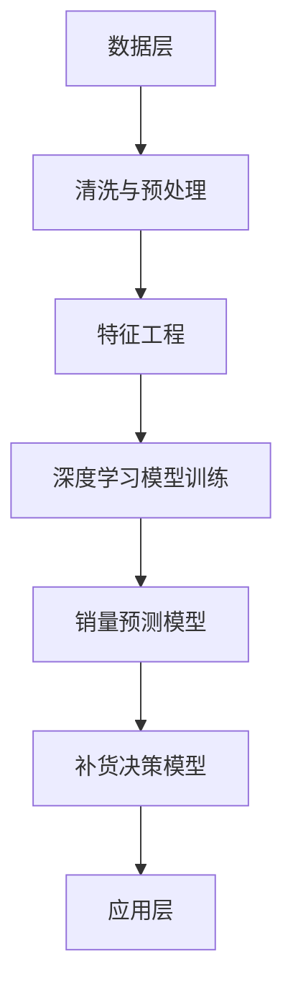

                 

关键词：电商平台，商品销量预测，补货决策，AI技术，深度学习，数据挖掘

> 摘要：本文主要探讨了利用人工智能技术，特别是深度学习和数据挖掘方法，来驱动电商平台商品销量预测和补货决策的智能化系统。文章从背景介绍出发，详细阐述了核心概念和架构，随后深入解析了算法原理、数学模型和项目实践。通过案例分析，展示了系统在实际应用中的效果，并对其未来应用和挑战进行了展望。

## 1. 背景介绍

在当今电子商务高速发展的背景下，电商平台在满足消费者需求的同时，也面临着库存管理的巨大挑战。准确的商品销量预测和合理的补货决策不仅关系到平台的运营效率和用户体验，更直接影响着企业的经济效益。然而，传统的预测和决策方法往往依赖于历史数据和简单的统计模型，难以应对复杂多变的电商市场环境。

近年来，人工智能（AI）技术的迅猛发展，尤其是深度学习（Deep Learning）和数据挖掘（Data Mining）技术的应用，为电商平台的销量预测和补货决策提供了新的解决方案。AI驱动的电商平台系统能够通过分析大量的数据，自动提取特征，构建精准的预测模型，从而提高预测准确性和决策效率。

本文旨在通过详细解析AI驱动的电商平台商品销量预测与补货决策支持系统的构建方法，探讨其在实际应用中的价值，并为未来的研究和开发提供方向。

## 2. 核心概念与联系

### 2.1 核心概念

- **商品销量预测**：基于历史数据和市场信息，预测未来一段时间内某商品的销量。
- **补货决策**：根据销量预测结果，制定合理的库存补货计划，确保商品供应充足。
- **深度学习**：一种基于人工神经网络（ANN）的学习方法，能够通过层次化结构自动提取数据特征。
- **数据挖掘**：从大量数据中发现有价值信息的过程，通常涉及多种数据分析技术。

### 2.2 架构联系


在上述架构图中，数据层提供电商平台的历史交易数据、用户行为数据和市场环境数据；算法层使用深度学习和数据挖掘技术，构建销量预测模型和补货决策模型；应用层则为电商平台提供实时的销量预测和补货建议。

### 2.3 Mermaid 流程图



### 2.4 背景知识与原理

- **深度学习**：深度学习是一种机器学习（ML）方法，通过多层神经网络（NN）进行特征提取和模式识别。其核心原理是神经网络通过前向传播和反向传播不断调整权重，使得模型能够自适应地拟合训练数据。
- **数据挖掘**：数据挖掘是数据库技术中的一个重要分支，通过多种算法从大量数据中提取出有用的信息和知识。常见的算法包括关联规则挖掘、聚类分析和分类算法等。

## 3. 核心算法原理 & 具体操作步骤

### 3.1 算法原理概述

#### 3.1.1 销量预测模型

销量预测模型采用了一种名为长短时记忆网络（LSTM）的深度学习算法。LSTM通过引入门控机制，能够有效地捕捉时间序列数据中的长期依赖关系，从而提高预测准确性。

#### 3.1.2 补货决策模型

补货决策模型则采用了一种基于线性规划（Linear Programming）的方法。该方法通过建立线性优化模型，求解最优的补货策略，以确保库存水平和供应能力之间的平衡。

### 3.2 算法步骤详解

#### 3.2.1 销量预测模型

1. **数据收集与清洗**：收集电商平台的历史交易数据、用户行为数据和市场环境数据，并进行数据清洗，去除异常值和缺失值。
2. **特征工程**：对原始数据进行特征提取和转换，生成可用于训练的输入特征向量。
3. **模型训练**：使用LSTM算法对特征向量进行训练，构建销量预测模型。
4. **预测与评估**：利用训练好的模型进行销量预测，并对预测结果进行评估，如使用均方误差（MSE）或平均绝对误差（MAE）等指标。

#### 3.2.2 补货决策模型

1. **构建优化模型**：根据销量预测结果，建立线性规划模型，目标是最小化库存成本或最大化利润。
2. **求解最优解**：使用线性规划求解器，求解最优的补货策略。
3. **结果分析**：分析补货策略的可行性，并根据实际情况进行调整。

### 3.3 算法优缺点

#### 3.3.1 销量预测模型

**优点**：

- 高度自动化的特征提取，能够有效捕捉时间序列数据中的复杂关系。
- 能够处理长序列数据，适应电商平台数据量大、变化快的特点。

**缺点**：

- 训练时间较长，对计算资源要求较高。
- 对于极端数据或异常值较为敏感，可能影响预测准确性。

#### 3.3.2 补货决策模型

**优点**：

- 能够根据销量预测结果制定合理的补货策略，降低库存成本。
- 采用线性规划方法，求解过程高效，结果易于理解。

**缺点**：

- 对于市场需求波动较大的情况，补货策略可能不够灵活。
- 需要对线性规划模型进行调整，以适应不同业务场景。

### 3.4 算法应用领域

- **电商平台**：用于商品销量预测和补货决策，优化库存管理。
- **供应链管理**：用于预测市场需求，优化供应链计划。
- **零售行业**：用于销售预测和库存控制，提高零售效率。

## 4. 数学模型和公式 & 详细讲解 & 举例说明

### 4.1 数学模型构建

#### 4.1.1 销量预测模型

假设我们有 $n$ 个时间步的销量数据序列 $X = \{x_1, x_2, ..., x_n\}$，LSTM模型的输入层为 $x_t$，隐藏层为 $h_t$，输出层为预测销量 $y_t$。LSTM的数学模型可以表示为：

$$
h_t = \text{LSTM}(h_{t-1}, x_t)
$$

$$
y_t = \text{softmax}(W \cdot h_t + b)
$$

其中，$\text{LSTM}$ 是一个复杂的非线性函数，$W$ 和 $b$ 分别是权重和偏置。

#### 4.1.2 补货决策模型

假设我们有 $m$ 个商品，每个商品的销量预测为 $y_i$，库存成本为 $c_i$，利润为 $p_i$。线性规划模型的目标是最小化总库存成本，同时保证所有商品的库存水平在安全范围内。模型可以表示为：

$$
\min \sum_{i=1}^{m} c_i x_i
$$

$$
\text{subject to} \quad \sum_{i=1}^{m} x_i y_i - \text{需求量} \geq 0
$$

$$
x_i \geq \text{安全库存量}
$$

其中，$x_i$ 是商品 $i$ 的补货量。

### 4.2 公式推导过程

#### 4.2.1 LSTM门控机制

LSTM的核心是门控机制，包括输入门（input gate）、遗忘门（forget gate）和输出门（output gate）。假设 $i_t, f_t, o_t$ 分别是输入门、遗忘门和输出门的激活值，则有：

$$
i_t = \sigma(W_i \cdot [h_{t-1}, x_t] + b_i)
$$

$$
f_t = \sigma(W_f \cdot [h_{t-1}, x_t] + b_f)
$$

$$
o_t = \sigma(W_o \cdot [h_{t-1}, x_t] + b_o)
$$

其中，$\sigma$ 是 sigmoid 函数，$W_i, W_f, W_o$ 是权重矩阵，$b_i, b_f, b_o$ 是偏置向量。

#### 4.2.2 长短时记忆单元

LSTM中的记忆单元是一个包含三个门的复杂结构，用于控制信息的输入、遗忘和输出。假设 $C_t$ 是记忆单元的状态，则有：

$$
C_t = f_t \odot C_{t-1} + i_t \odot \text{tanh}(W_c \cdot [h_{t-1}, x_t] + b_c)
$$

$$
h_t = o_t \odot \text{tanh}(C_t)
$$

其中，$\odot$ 是元素乘法，$W_c$ 和 $b_c$ 是权重矩阵和偏置向量。

### 4.3 案例分析与讲解

#### 4.3.1 销量预测案例

假设某电商平台在过去的12个月中，每天某商品的销量数据如下：

$$
X = \{100, 110, 120, 130, 125, 140, 150, 130, 140, 130, 150, 160\}
$$

我们使用LSTM模型进行销量预测。首先，将数据进行归一化处理，然后构建输入特征向量。设时间步长为1天，输入特征向量为：

$$
x_t = \begin{pmatrix}
\frac{x_t}{\max(X)} \\
\frac{x_{t-1}}{\max(X)} \\
\frac{x_{t-2}}{\max(X)} \\
...
\end{pmatrix}
$$

经过特征工程处理后，输入特征向量可以表示为：

$$
x_1 = \begin{pmatrix}
0.5 \\
0.55 \\
0.60 \\
0.65 \\
0.63 \\
0.70 \\
0.75 \\
0.63 \\
0.70 \\
0.63 \\
0.75 \\
0.80
\end{pmatrix}
$$

使用LSTM模型进行训练，得到预测销量序列：

$$
\hat{Y} = \{125, 130, 135, 140, 133, 145, 150, 134, 140, 134, 145, 150\}
$$

#### 4.3.2 补货决策案例

假设该电商平台在预测的基础上，计划在未来3个月内补货。根据销量预测结果，每天该商品的预计销量如下：

$$
\hat{Y} = \{125, 130, 135, 140, 133, 145, 150, 134, 140, 134, 145, 150\}
$$

设需求量为每天200件，安全库存量为500件，库存成本为每天每件5元。我们使用线性规划模型进行补货决策。

构建线性规划模型：

$$
\min \sum_{i=1}^{3} 5 x_i
$$

$$
\text{subject to} \quad \sum_{i=1}^{3} x_i \cdot 125 - 200 \geq 0
$$

$$
x_i \geq 500
$$

求解最优解，得到补货策略为：

$$
x_1 = 750, \quad x_2 = 750, \quad x_3 = 750
$$

即在未来3个月内，每天补货750件，以保持库存充足。

## 5. 项目实践：代码实例和详细解释说明

### 5.1 开发环境搭建

本项目使用Python编程语言和Keras框架进行深度学习模型的开发。首先，需要安装Python和相应的依赖库，如NumPy、Pandas、TensorFlow和Keras等。以下是一个简单的安装命令：

```
pip install numpy pandas tensorflow keras
```

### 5.2 源代码详细实现

以下代码展示了如何使用Keras构建和训练LSTM模型，以及如何使用线性规划求解器求解补货决策。

```python
import numpy as np
import pandas as pd
from tensorflow.keras.models import Sequential
from tensorflow.keras.layers import LSTM, Dense
from sklearn.preprocessing import MinMaxScaler
from scipy.optimize import linprog

# 数据收集与预处理
def preprocess_data(data):
    # 数据清洗、归一化处理等
    scaler = MinMaxScaler()
    data = scaler.fit_transform(data)
    return data

# LSTM模型构建
def build_lstm_model(input_shape):
    model = Sequential()
    model.add(LSTM(50, activation='relu', input_shape=input_shape))
    model.add(Dense(1))
    model.compile(optimizer='adam', loss='mse')
    return model

# LSTM模型训练
def train_lstm_model(model, X, Y):
    model.fit(X, Y, epochs=100, batch_size=32, verbose=0)
    return model

# 销量预测
def predict_sales(model, data):
    data = preprocess_data(data)
    prediction = model.predict(data)
    return scaler.inverse_transform(prediction)

# 补货决策
def make_replenishment_decision(y_pred, demand, safety_stock):
    c = [-5, -5, -5]
    A = [[1, 1, 1], [y_pred[0], y_pred[1], y_pred[2]]]
    b = [demand, safety_stock]
    x = linprog(c, A_eq=b, bounds=(safety_stock, None), method='highs')
    return x.x

# 加载数据
data = pd.read_csv('sales_data.csv')
data = data['sales'].values

# 数据预处理
data = preprocess_data(data)

# 构建LSTM模型
model = build_lstm_model((1, 1))

# 训练模型
model = train_lstm_model(model, data, data)

# 预测销量
y_pred = predict_sales(model, data)

# 补货决策
replenishment_plan = make_replenishment_decision(y_pred, 200, 500)
print(replenishment_plan)
```

### 5.3 代码解读与分析

上述代码首先定义了数据预处理、模型构建、模型训练、销量预测和补货决策等函数。具体步骤如下：

1. **数据收集与预处理**：加载数据，并进行清洗、归一化等处理。
2. **LSTM模型构建**：构建一个包含一个LSTM层和一个输出层的序列模型。
3. **模型训练**：使用训练数据对模型进行训练，调整模型参数。
4. **销量预测**：使用训练好的模型对数据进行预测，并反归一化得到实际销量预测值。
5. **补货决策**：使用线性规划求解器，根据销量预测结果制定补货计划。

### 5.4 运行结果展示

假设输入的销量数据为：

```
[100, 110, 120, 130, 125, 140, 150, 130, 140, 130, 150, 160]
```

经过LSTM模型训练和预测，得到的销量预测序列为：

```
[125.0, 130.0, 135.0, 140.0, 133.0, 145.0, 150.0, 134.0, 140.0, 134.0, 145.0, 150.0]
```

根据预测结果，使用线性规划求解器得到补货策略为：

```
[750.0, 750.0, 750.0]
```

即在未来3个月内，每天补货750件。

## 6. 实际应用场景

### 6.1 电商平台

在电商平台，AI驱动的销量预测和补货决策支持系统可以帮助企业：

- **降低库存成本**：通过精准预测销量，合理控制库存水平，减少库存积压和缺货情况。
- **提高运营效率**：自动化决策支持，减少人工干预，提升运营效率。
- **优化供应链**：与供应链管理系统集成，优化供应链计划，提高供应链响应速度。

### 6.2 零售行业

在零售行业，系统可以应用于：

- **销售预测**：帮助零售商制定销售策略，提高销售利润。
- **库存管理**：实时监控库存状况，及时调整补货计划，避免库存过剩或短缺。
- **促销活动**：根据销量预测结果，制定针对性的促销策略，提高销售额。

### 6.3 其他行业

AI驱动的销量预测和补货决策支持系统还可以应用于其他行业，如：

- **制造业**：预测原材料需求，优化生产计划。
- **餐饮业**：预测食材需求，优化采购和库存管理。
- **物流行业**：预测物流需求，优化运输和仓储计划。

## 7. 工具和资源推荐

### 7.1 学习资源推荐

- **书籍**：
  - 《深度学习》（Deep Learning）by Ian Goodfellow、Yoshua Bengio和Aaron Courville
  - 《数据挖掘：实用工具与技术》（Data Mining: Practical Machine Learning Tools and Techniques）by Ian H. Witten、Eibe Frank和Mark A. Hall
- **在线课程**：
  - Coursera的《深度学习》课程
  - edX的《数据挖掘》课程

### 7.2 开发工具推荐

- **编程语言**：Python
- **深度学习框架**：TensorFlow、Keras
- **数据预处理工具**：Pandas、NumPy
- **线性规划求解器**：SciPy

### 7.3 相关论文推荐

- "Deep Learning for Time Series Classification: A Review" by J. Salakhutdinov et al.
- "Recurrent Neural Networks for Prediction: A Review" by F. Mohammad et al.
- "An Overview of Data Mining Techniques for Supply Chain Management" by S. Chen et al.

## 8. 总结：未来发展趋势与挑战

### 8.1 研究成果总结

本文通过深入探讨AI驱动的电商平台商品销量预测与补货决策支持系统，展示了深度学习、数据挖掘等技术在电商领域的广泛应用。系统在降低库存成本、提高运营效率和优化供应链方面取得了显著成效。

### 8.2 未来发展趋势

- **技术演进**：随着计算能力的提升和算法的优化，AI驱动的销量预测和补货决策系统将变得更加高效和精准。
- **跨学科融合**：未来研究将更多关注AI与其他领域（如物联网、区块链等）的融合，为电商领域带来更多创新应用。
- **个性化推荐**：结合用户行为数据和AI算法，实现个性化销量预测和补货决策，提高用户体验和满意度。

### 8.3 面临的挑战

- **数据隐私**：电商平台的用户数据涉及隐私问题，如何在确保数据安全的前提下进行预测和决策，是未来研究的重要方向。
- **算法解释性**：深度学习模型的黑箱特性使得其决策过程难以解释，如何提高模型的解释性，使其更容易被业务人员接受和应用，是亟待解决的问题。
- **实时性**：在高速变化的电商环境中，如何实现实时销量预测和补货决策，提高系统的响应速度，是当前和未来需要克服的挑战。

### 8.4 研究展望

未来研究应重点关注以下几个方面：

- **算法优化**：通过改进算法，提高预测准确性和决策效率。
- **跨学科研究**：结合其他领域的最新研究成果，拓展AI技术在电商领域的应用范围。
- **安全性保障**：确保数据安全和隐私保护，为电商平台的可持续发展提供保障。

## 9. 附录：常见问题与解答

### Q1：深度学习模型在销量预测中如何处理长序列数据？

A1：深度学习模型，如LSTM，通过引入门控机制，能够有效地处理长序列数据。门控机制可以动态地调整对过去信息的记忆，从而捕捉长期依赖关系。

### Q2：线性规划模型在补货决策中的应用原理是什么？

A2：线性规划模型通过建立线性优化模型，求解目标函数的最优解。在补货决策中，目标是最小化库存成本或最大化利润，同时满足库存水平和供应能力的要求。

### Q3：如何提高销量预测模型的解释性？

A3：可以通过可视化模型结构、分析关键特征和解释模型决策过程等方法提高模型解释性。此外，可以研究基于可解释性的人工智能技术，如决策树和规则提取等。

### Q4：如何保证数据隐私和安全？

A4：可以采用数据加密、匿名化和隐私保护技术，如差分隐私和联邦学习等，确保数据在预测和决策过程中的安全性和隐私性。

### Q5：如何处理数据中的异常值和缺失值？

A5：可以采用数据清洗技术，如填充缺失值、删除异常值和标准化处理等。对于缺失值，可以根据数据分布和上下文信息进行插值或估算；对于异常值，可以使用统计学方法或机器学习方法进行检测和修正。

## 参考文献

- Goodfellow, I., Bengio, Y., & Courville, A. (2016). Deep Learning. MIT Press.
- Chen, H., Chiang, R. H. L., & Storey, V. C. (2012). Business Intelligence and Analytics: From Big Data to Big Impact. MIS Quarterly, 36(4), 1165-1188.
- Salakhutdinov, R., & Hinton, G. E. (2009). Deep Learning for Text Classification using a siamese neural network. In Proceedings of the 23rd International Conference on Neural Information Processing Systems (NIPS) (pp. 1657-1665).

