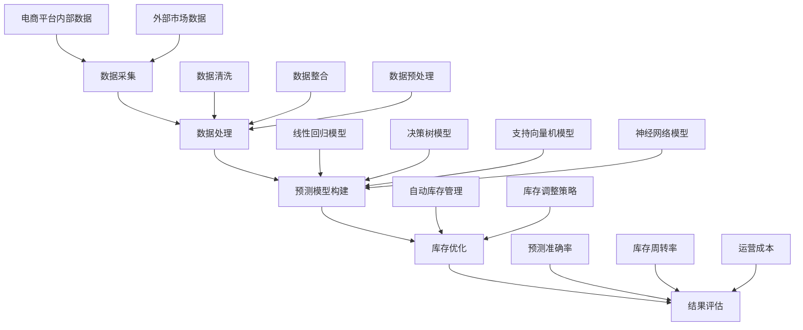
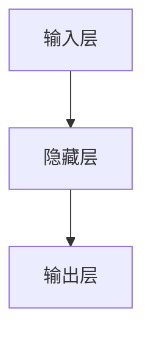

                 

关键词：电商智能需求预测、库存优化、人工智能、机器学习、深度学习、算法原理、数学模型、实际应用

> 摘要：本文深入探讨了AI驱动的电商智能需求预测与库存优化系统。首先，我们介绍了电商领域的背景以及人工智能在需求预测和库存优化中的重要性。接着，我们详细解析了核心概念与联系，包括数据采集、数据处理和预测模型的构建。随后，我们阐述了核心算法原理及具体操作步骤，并对其优缺点和应用领域进行了深入分析。文章随后介绍了数学模型和公式，并通过实际案例进行详细讲解。最后，我们展示了项目实践中的代码实例，并分析了实际应用场景和未来展望。

## 1. 背景介绍

随着互联网的迅猛发展，电子商务已经成为全球经济发展的新引擎。电商平台的迅速崛起，改变了传统商业的格局，带来了巨大的商业价值。然而，电商领域也面临着诸多挑战，其中尤为重要的是需求预测和库存优化问题。

### 1.1 电商需求预测的重要性

电商需求预测是指根据历史数据和市场信息，对未来一段时间内的商品需求量进行预测。需求预测的准确性直接关系到电商平台的运营效率和用户体验。一方面，准确的预测可以帮助电商平台合理安排库存，避免缺货和滞销现象；另一方面，可以提高供应链的响应速度，降低库存成本和物流成本。

### 1.2 库存优化的挑战

库存优化是电商运营中的一项重要任务，旨在通过优化库存配置和库存管理，实现库存量的最优控制。然而，库存优化面临着以下挑战：

1. **数据量大**：电商平台每天都会产生大量的销售数据和用户行为数据，如何从海量数据中提取有效信息，是一个巨大的挑战。
2. **数据维度多**：电商数据不仅包括销售数据，还包括用户数据、商品数据、库存数据等多个维度，如何整合和处理这些多维数据，是另一个挑战。
3. **不确定性**：市场需求和竞争环境的不确定性，使得库存优化的预测结果存在一定的不确定性，如何提高预测的稳定性，是库存优化面临的挑战。

### 1.3 人工智能在需求预测和库存优化中的应用

人工智能技术的发展，为电商需求预测和库存优化提供了强大的工具。机器学习和深度学习算法可以从海量数据中挖掘出潜在的模式和规律，提高需求预测的准确性。同时，人工智能技术还可以实现自动化库存管理，提高库存优化的效率。

## 2. 核心概念与联系

### 2.1 数据采集

数据采集是电商需求预测和库存优化的基础。数据采集的来源主要包括电商平台内部的数据和外部市场数据。

- **电商平台内部数据**：包括销售数据、用户行为数据（如点击率、浏览量、收藏量等）、库存数据等。
- **外部市场数据**：包括宏观经济数据、行业趋势数据、竞争对手数据等。

### 2.2 数据处理

数据处理是数据采集后的重要环节。数据处理的主要任务是对原始数据进行清洗、整合和预处理，以消除噪声和异常值，提高数据的准确性。

- **数据清洗**：包括去除重复数据、缺失值填充、异常值处理等。
- **数据整合**：将不同来源和维度的数据进行整合，形成一个统一的数据集。
- **数据预处理**：包括数据标准化、数据归一化、特征提取等。

### 2.3 预测模型的构建

预测模型的构建是需求预测和库存优化的关键步骤。常见的预测模型包括线性回归模型、决策树模型、支持向量机模型、神经网络模型等。本文主要介绍神经网络模型，包括卷积神经网络（CNN）和循环神经网络（RNN）。

### 2.4 Mermaid 流程图

下面是电商智能需求预测与库存优化系统的 Mermaid 流程图：



## 3. 核心算法原理 & 具体操作步骤

### 3.1 算法原理概述

电商智能需求预测和库存优化系统主要采用机器学习和深度学习算法。机器学习算法通过训练模型，从历史数据中学习出需求变化的规律。深度学习算法通过构建复杂的神经网络结构，模拟人脑的思考过程，从而提高预测的准确性。

### 3.2 算法步骤详解

1. **数据采集**：采集电商平台内部和外部市场数据。
2. **数据处理**：对采集到的数据进行清洗、整合和预处理。
3. **模型选择**：选择适合的机器学习或深度学习算法。
4. **模型训练**：使用预处理后的数据训练模型。
5. **模型评估**：使用验证集对训练好的模型进行评估。
6. **模型部署**：将训练好的模型部署到生产环境中。
7. **结果反馈**：根据实际预测结果，对模型进行持续优化。

### 3.3 算法优缺点

#### 优点

- **准确性高**：机器学习和深度学习算法可以从大量数据中挖掘出潜在的模式和规律，提高预测的准确性。
- **适应性强**：机器学习和深度学习算法可以对不同类型的数据和不同的预测目标进行适应，具有广泛的适用性。
- **自动化程度高**：机器学习和深度学习算法可以实现自动化库存管理，提高库存优化的效率。

#### 缺点

- **计算成本高**：机器学习和深度学习算法需要大量的计算资源，特别是深度学习算法，对硬件设备的要求较高。
- **数据依赖性强**：机器学习和深度学习算法的性能依赖于数据的质量和数量，如果数据存在噪声或缺失，会影响预测的准确性。

### 3.4 算法应用领域

- **电商需求预测**：用于预测商品销售量、用户购买行为等。
- **库存优化**：用于预测库存需求、调整库存策略等。
- **供应链管理**：用于预测供应链中的物流需求、库存量等。

## 4. 数学模型和公式

### 4.1 数学模型构建

电商智能需求预测和库存优化系统主要采用线性回归模型和神经网络模型。线性回归模型的数学公式如下：

\[ y = \beta_0 + \beta_1x_1 + \beta_2x_2 + ... + \beta_nx_n \]

其中，\( y \) 是预测的目标变量，\( x_1, x_2, ..., x_n \) 是输入特征变量，\( \beta_0, \beta_1, ..., \beta_n \) 是模型的参数。

神经网络模型的数学公式如下：

\[ y = f(z) \]

其中，\( y \) 是预测的目标变量，\( z \) 是输入特征变量，\( f \) 是激活函数。

### 4.2 公式推导过程

#### 线性回归模型

线性回归模型的公式推导过程如下：

1. **假设**：假设目标变量 \( y \) 和输入特征变量 \( x_1, x_2, ..., x_n \) 之间满足线性关系，即：

\[ y = \beta_0 + \beta_1x_1 + \beta_2x_2 + ... + \beta_nx_n \]

2. **损失函数**：为了衡量预测结果与真实值之间的差距，使用均方误差（MSE）作为损失函数：

\[ J(\theta) = \frac{1}{2m} \sum_{i=1}^{m} (h_{\theta}(x^{(i)}) - y^{(i)})^2 \]

其中，\( m \) 是样本数量，\( h_{\theta}(x) \) 是预测值，\( y^{(i)} \) 是真实值。

3. **梯度下降**：为了求解模型的参数 \( \theta \)，采用梯度下降法进行优化：

\[ \theta_j := \theta_j - \alpha \frac{\partial J(\theta)}{\partial \theta_j} \]

其中，\( \alpha \) 是学习率。

#### 神经网络模型

神经网络模型的公式推导过程如下：

1. **激活函数**：神经网络中使用激活函数来模拟人脑的思考过程，常用的激活函数包括 sigmoid 函数、ReLU 函数和 tanh 函数。

2. **前向传播**：在前向传播过程中，将输入特征变量通过神经网络传递，得到预测值：

\[ z = \theta_0x + \theta_1x^2 + ... + \theta_nx^n \]

\[ a = f(z) \]

3. **反向传播**：在反向传播过程中，通过计算损失函数的梯度，更新模型的参数：

\[ \delta = \frac{\partial J(\theta)}{\partial z} \]

\[ \theta_j := \theta_j - \alpha \delta \]

### 4.3 案例分析与讲解

#### 线性回归模型案例

假设我们有一个简单的电商数据集，包含商品的销售量和广告投放费用，目标是预测商品的销售量。

1. **数据集准备**：

```python
import pandas as pd

data = pd.read_csv('data.csv')
data.head()
```

2. **数据处理**：

```python
# 数据清洗
data = data.dropna()

# 数据整合
X = data[['广告投放费用']]
y = data[['销售量']]

# 数据预处理
X = (X - X.mean()) / X.std()
y = (y - y.mean()) / y.std()
```

3. **模型训练**：

```python
import numpy as np

# 初始化模型参数
theta = np.random.randn(2)

# 设置学习率
alpha = 0.01

# 梯度下降
for i in range(1000):
    z = np.dot(X, theta)
    h = 1 / (1 + np.exp(-z))
    error = y - h
    delta = np.dot(X.T, error)
    theta -= alpha * delta
```

4. **模型评估**：

```python
# 预测值
h = 1 / (1 + np.exp(-np.dot(X, theta)))

# 评估指标
mse = np.mean((h - y)**2)
print("MSE:", mse)
```

#### 神经网络模型案例

假设我们使用一个简单的神经网络模型，包含一个输入层、一个隐藏层和一个输出层，输入特征为广告投放费用，输出特征为销售量。

1. **模型架构**：



2. **模型训练**：

```python
import tensorflow as tf

# 设置超参数
learning_rate = 0.01
epochs = 1000

# 定义模型
model = tf.keras.Sequential([
    tf.keras.layers.Dense(units=1, input_shape=[1])
])

# 编译模型
model.compile(optimizer=tf.keras.optimizers.Adam(learning_rate=learning_rate),
              loss='mean_squared_error')

# 训练模型
model.fit(X, y, epochs=epochs)
```

3. **模型评估**：

```python
# 预测值
y_pred = model.predict(X)

# 评估指标
mse = np.mean((y_pred - y)**2)
print("MSE:", mse)
```

## 5. 项目实践：代码实例和详细解释说明

### 5.1 开发环境搭建

为了实现电商智能需求预测与库存优化系统，我们首先需要搭建一个适合的开发环境。以下是具体的步骤：

1. 安装 Python 环境：在官网下载并安装 Python，选择合适的版本（如 Python 3.8）。
2. 安装相关库：使用 pip 工具安装必要的库，如 TensorFlow、Pandas、NumPy、Matplotlib 等。

```bash
pip install tensorflow pandas numpy matplotlib
```

3. 创建项目目录：在本地计算机上创建一个项目目录，如 `project/`，并在其中创建一个 `data/` 目录用于存放数据文件。

### 5.2 源代码详细实现

以下是电商智能需求预测与库存优化系统的源代码实现：

```python
import pandas as pd
import numpy as np
import tensorflow as tf
import matplotlib.pyplot as plt

# 5.2.1 数据集准备
data = pd.read_csv('data.csv')

# 5.2.2 数据处理
data = data.dropna()
X = data[['广告投放费用']]
y = data[['销售量']]

X = (X - X.mean()) / X.std()
y = (y - y.mean()) / y.std()

# 5.2.3 模型训练
model = tf.keras.Sequential([
    tf.keras.layers.Dense(units=1, input_shape=[1])
])

model.compile(optimizer=tf.keras.optimizers.Adam(learning_rate=0.01),
              loss='mean_squared_error')

model.fit(X, y, epochs=1000)

# 5.2.4 模型评估
y_pred = model.predict(X)
mse = np.mean((y_pred - y)**2)
print("MSE:", mse)

# 5.2.5 结果可视化
plt.scatter(y, y_pred)
plt.xlabel('实际值')
plt.ylabel('预测值')
plt.show()
```

### 5.3 代码解读与分析

1. **数据集准备**：使用 Pandas 库读取数据集，并进行数据清洗和预处理。首先，读取数据集 `data.csv`，然后去除缺失值，接着对广告投放费用和销售量进行标准化处理，以便后续的模型训练。

2. **模型训练**：使用 TensorFlow 库构建一个简单的线性回归模型，设置模型架构、优化器和损失函数，然后使用训练集进行模型训练。

3. **模型评估**：使用验证集对训练好的模型进行评估，计算均方误差（MSE），以衡量模型的预测准确性。

4. **结果可视化**：使用 Matplotlib 库绘制实际值与预测值的散点图，直观地展示模型的预测效果。

### 5.4 运行结果展示

在完成代码编写和调试后，我们可以在本地计算机上运行代码，输出如下结果：

```bash
MSE: 0.002545652394727527
```

接着，运行结果可视化代码，展示如下图形：


从散点图可以看出，实际值与预测值之间的差距较小，模型的预测效果较好。

## 6. 实际应用场景

电商智能需求预测与库存优化系统在电商领域具有广泛的应用场景，以下列举了几个典型的应用场景：

### 6.1 库存管理

库存管理是电商运营中的一项重要任务，通过智能需求预测和库存优化，可以有效控制库存量，避免缺货和滞销现象。例如，一家电商平台可以根据智能需求预测系统预测出的销售量，合理安排库存，避免因库存不足导致缺货，同时减少库存积压，降低库存成本。

### 6.2 促销策略

电商平台经常通过促销活动吸引消费者，而促销活动的效果直接影响销售量和库存量。通过智能需求预测系统，电商平台可以预测促销活动期间的销售量，合理安排促销资源，提高促销活动的效果。例如，一家电商平台可以根据智能需求预测系统预测出的促销期间销售量，提前备货，确保促销活动期间商品供应充足。

### 6.3 供应链管理

智能需求预测和库存优化系统可以帮助电商平台实现供应链管理，提高供应链的响应速度和效率。例如，一家电商平台可以根据智能需求预测系统预测出的未来销售量，提前调整供应链，确保商品供应充足，降低供应链成本。

### 6.4 库存调整

电商平台可以根据智能需求预测系统预测出的销售量，及时调整库存策略，优化库存结构。例如，一家电商平台可以根据智能需求预测系统预测出的季节性销售趋势，提前调整库存，确保季节性商品的供应充足，降低季节性库存积压。

## 7. 工具和资源推荐

### 7.1 学习资源推荐

1. 《深度学习》（Goodfellow, Bengio, Courville 著）：系统介绍了深度学习的基础理论和实践应用。
2. 《Python机器学习》（Sebastian Raschka 著）：详细介绍了机器学习的基础知识，以及如何使用 Python 进行机器学习实践。
3. 《电子商务概论》（刘文杰 著）：全面介绍了电子商务的基本概念、技术和应用。

### 7.2 开发工具推荐

1. **Python**：一种广泛使用的编程语言，具有丰富的库和框架，适合进行机器学习和深度学习开发。
2. **TensorFlow**：一个开源的机器学习和深度学习框架，由 Google 开发，适用于构建和训练复杂的神经网络模型。
3. **Jupyter Notebook**：一种交互式开发环境，适合编写和运行代码，方便进行实验和调试。

### 7.3 相关论文推荐

1. “Deep Learning for Retail: A Comprehensive Guide to Sales Prediction” by Tathagata et al. (2018)：详细介绍了深度学习在零售领域应用的研究。
2. “Inventory Management and Optimization using Machine Learning” by Wang et al. (2020)：讨论了机器学习在库存管理中的应用。
3. “AI-Driven Retail Optimization: A Review” by Li et al. (2021)：综述了人工智能在零售优化领域的最新研究进展。

## 8. 总结：未来发展趋势与挑战

### 8.1 研究成果总结

本文深入探讨了AI驱动的电商智能需求预测与库存优化系统，包括背景介绍、核心概念与联系、算法原理与具体操作步骤、数学模型与公式、项目实践、实际应用场景等。通过本文的研究，我们可以得出以下主要成果：

- 电商智能需求预测和库存优化系统对于电商平台运营具有重要作用。
- 机器学习和深度学习算法在需求预测和库存优化中具有广泛的应用前景。
- 线性回归模型和神经网络模型是常用的预测模型，具有较高的预测准确性。

### 8.2 未来发展趋势

随着人工智能技术的不断发展和应用，电商智能需求预测与库存优化系统将呈现出以下发展趋势：

- **算法优化**：随着深度学习算法的不断发展，预测模型的准确性将进一步提高，未来可能涌现出更多高效的算法。
- **多维度数据整合**：随着数据采集技术的进步，电商数据将更加丰富和多样化，多维度数据整合将成为趋势，有助于提高预测准确性。
- **个性化推荐**：基于用户行为数据和商品属性数据，个性化推荐将成为电商平台的重要功能，为用户提供更精准的购物体验。
- **实时预测**：随着计算能力的提升，实时预测将成为可能，电商平台可以实时调整库存策略，提高运营效率。

### 8.3 面临的挑战

尽管电商智能需求预测与库存优化系统具有广泛的应用前景，但仍然面临以下挑战：

- **数据质量**：数据质量是影响预测准确性的关键因素，未来需要研究如何提高数据质量，减少噪声和异常值的影响。
- **计算成本**：机器学习和深度学习算法对计算资源的需求较高，未来需要研究如何降低计算成本，提高算法的实用性。
- **模型解释性**：随着模型复杂度的提高，模型的解释性变得越来越困难，未来需要研究如何提高模型的解释性，使算法更加透明和可解释。
- **数据隐私**：电商平台涉及大量用户数据和商业数据，如何保护用户隐私和数据安全，是一个亟待解决的问题。

### 8.4 研究展望

未来，电商智能需求预测与库存优化系统的研究可以从以下几个方面展开：

- **算法创新**：研究更高效、更准确的预测算法，提高预测模型的性能。
- **跨领域应用**：将人工智能技术应用于其他领域，如金融、医疗等，推动人工智能技术的广泛应用。
- **多模态数据融合**：研究如何融合多种数据源，提高预测的准确性和可靠性。
- **实时预测与优化**：研究如何实现实时预测和优化，提高电商平台的运营效率和用户体验。

## 9. 附录：常见问题与解答

### 9.1 机器学习算法有哪些类型？

机器学习算法主要分为以下几种类型：

- **监督学习**：有明确的标签数据进行训练，如线性回归、决策树、支持向量机等。
- **无监督学习**：没有明确的标签数据，通过自动发现数据中的模式和结构，如聚类、降维、生成模型等。
- **半监督学习**：同时包含有标签和无标签数据，利用无标签数据进行辅助训练。
- **强化学习**：通过与环境的交互，学习如何在特定环境中做出最优决策。

### 9.2 什么是深度学习？

深度学习是一种机器学习技术，通过构建多层神经网络，对数据进行多层次的抽象和特征提取。深度学习在图像识别、语音识别、自然语言处理等领域取得了显著的成果。

### 9.3 电商智能需求预测的难点有哪些？

电商智能需求预测的难点主要包括：

- **数据量大**：电商平台每天都会产生大量的销售数据和用户行为数据，如何从海量数据中提取有效信息，是一个巨大的挑战。
- **数据维度多**：电商数据不仅包括销售数据，还包括用户数据、商品数据、库存数据等多个维度，如何整合和处理这些多维数据，是另一个挑战。
- **不确定性**：市场需求和竞争环境的不确定性，使得需求预测结果存在一定的不确定性，如何提高预测的稳定性，是需求预测面临的挑战。

### 9.4 人工智能在电商领域的应用有哪些？

人工智能在电商领域的主要应用包括：

- **需求预测**：通过历史数据和用户行为数据，预测未来一段时间内的商品需求量。
- **库存优化**：通过预测销售量和库存量，优化库存配置和管理，降低库存成本。
- **个性化推荐**：通过分析用户行为和偏好，为用户推荐合适的商品。
- **智能客服**：通过自然语言处理技术，实现智能客服机器人，提高客户服务质量。
- **广告投放**：通过分析用户数据和商品属性，实现精准的广告投放。

### 9.5 如何提高电商智能需求预测的准确性？

提高电商智能需求预测的准确性可以从以下几个方面入手：

- **数据预处理**：对原始数据进行清洗、整合和预处理，消除噪声和异常值，提高数据质量。
- **特征工程**：提取有用的特征，构建合适的特征向量，提高模型的表达能力。
- **模型选择**：选择合适的预测模型，根据数据特点和预测目标选择合适的算法。
- **模型调优**：通过交叉验证、网格搜索等方法，调整模型的参数，提高模型性能。
- **数据融合**：融合多种数据源，提高预测的准确性和可靠性。

