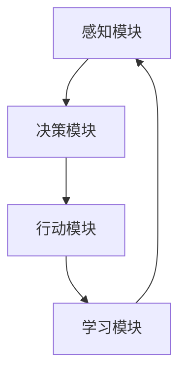
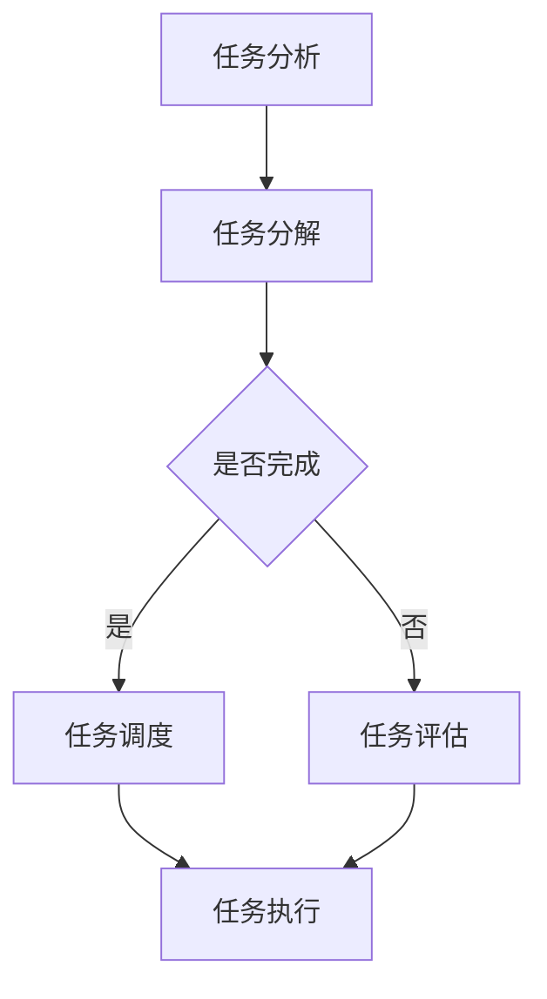

                 

在这个快速发展的信息技术时代，人工智能（AI）正逐渐成为推动行业进步的关键力量。AI 系统中的“智能代理”（Agents）概念，正越来越多地应用于各种任务拆解和执行中。本文将深入探讨智能代理在任务拆解中的应用，分析其核心概念、算法原理、数学模型以及实际操作步骤。

## 文章关键词

- 智能代理（Agents）
- 任务拆解（Task Decomposition）
- 人工智能（AI）
- 智能算法（Intelligent Algorithms）
- 数学模型（Mathematical Models）
- 实践应用（Practical Applications）

## 文章摘要

本文将首先介绍智能代理的基础概念和其在任务拆解中的作用。接着，我们将深入探讨智能代理的工作原理，包括核心算法和具体操作步骤。随后，文章将介绍相关的数学模型和公式，并通过实例进行说明。此外，文章还会展示智能代理在实际应用场景中的效果，并提出未来发展的展望。最后，我们将推荐一些学习资源和开发工具，以帮助读者更好地理解和应用智能代理技术。

## 1. 背景介绍

### 1.1 智能代理的定义

智能代理是指具备一定程度自主性、适应性和智能性的计算实体，能够在复杂环境中自主执行任务。智能代理通常具有感知、推理、学习和决策能力，可以与环境和用户进行交互。它们被广泛应用于机器人、虚拟助手、智能家居、自动驾驶等多个领域。

### 1.2 智能代理在任务拆解中的作用

任务拆解是指将复杂的任务分解为一系列可执行的小任务，以便于智能代理能够更加高效地执行。智能代理在任务拆解中扮演着至关重要的角色，它们能够通过分析任务需求，将任务拆解为子任务，并根据环境变化和执行情况进行自适应调整。

## 2. 核心概念与联系

### 2.1 智能代理的核心概念

智能代理的核心概念包括：

- **感知**：通过传感器获取环境信息。
- **推理**：利用规则库和逻辑推理能力，对感知到的信息进行处理。
- **学习**：通过机器学习和深度学习算法，不断优化行为策略。
- **决策**：根据当前状态和目标，选择最佳行动方案。
- **行动**：执行决策结果，实现任务目标。

### 2.2 智能代理的架构

智能代理的典型架构包括以下几个部分：

- **感知模块**：负责收集环境信息。
- **决策模块**：基于感知模块提供的信息，进行状态评估和决策。
- **行动模块**：根据决策结果执行具体的操作。
- **学习模块**：通过反馈和学习算法，不断优化代理的行为。

下面是一个简化的智能代理架构的 Mermaid 流程图：



### 2.3 智能代理在任务拆解中的应用

智能代理在任务拆解中的应用主要包括以下几个步骤：

1. **任务分析**：分析任务需求，确定任务目标。
2. **任务分解**：将任务分解为一系列子任务。
3. **任务调度**：根据代理能力和环境变化，对子任务进行调度。
4. **任务执行**：执行分解后的子任务。
5. **任务评估**：评估任务执行效果，进行自适应调整。

下面是一个任务拆解的 Mermaid 流程图：



## 3. 核心算法原理 & 具体操作步骤

### 3.1 算法原理概述

智能代理的核心算法通常是基于多智能体系统（MAS）的。MAS 是一种分布式计算范式，它通过多个智能代理之间的协作，共同实现复杂任务。以下是智能代理算法的基本原理：

1. **协同合作**：多个智能代理通过通信和协调，共同完成任务。
2. **任务分配**：根据智能代理的能力和环境变化，进行任务分配。
3. **自适应调整**：根据任务执行情况和环境变化，动态调整代理行为。
4. **协同学习**：通过共享信息和经验，提高代理的整体性能。

### 3.2 算法步骤详解

以下是智能代理算法的具体步骤：

1. **初始化**：设置智能代理的初始状态，包括感知模块、决策模块、行动模块和学习模块。
2. **感知**：智能代理通过传感器感知环境信息。
3. **决策**：智能代理根据感知到的信息，利用决策算法，选择最佳行动方案。
4. **行动**：智能代理执行决策结果，进行具体的操作。
5. **学习**：智能代理根据行动结果和反馈，更新内部模型和行为策略。
6. **迭代**：重复执行步骤 2-5，直到任务完成或达到预定目标。

### 3.3 算法优缺点

**优点**：

- **灵活性**：智能代理能够根据环境变化，动态调整行为策略。
- **协同性**：多个智能代理可以协同合作，共同完成任务。
- **可扩展性**：智能代理系统可以方便地扩展和集成新的功能。

**缺点**：

- **复杂性**：智能代理系统的设计和实现较为复杂。
- **通信开销**：多个智能代理之间的通信可能带来额外的开销。

### 3.4 算法应用领域

智能代理算法广泛应用于以下几个方面：

- **机器人控制**：智能代理可以用于控制机器人，实现自主导航和任务执行。
- **智能家居**：智能代理可以管理智能家居设备，实现自动化控制和优化。
- **自动驾驶**：智能代理可以用于自动驾驶系统，实现安全、高效的驾驶。
- **供应链管理**：智能代理可以用于供应链管理，优化库存和物流。

## 4. 数学模型和公式 & 详细讲解 & 举例说明

### 4.1 数学模型构建

智能代理的数学模型通常包括以下几个部分：

1. **状态表示**：使用向量表示智能代理当前的状态。
2. **动作空间**：定义智能代理可以采取的动作集合。
3. **奖励函数**：定义智能代理行为结果的奖励。
4. **价值函数**：定义智能代理在特定状态下的最优行为。

以下是智能代理数学模型的一个简例：

```latex
\text{状态} \ s = [s_1, s_2, \ldots, s_n]
\text{动作空间} \ A = \{a_1, a_2, \ldots, a_m\}
\text{奖励函数} \ R(s, a)
\text{价值函数} \ V(s)
```

### 4.2 公式推导过程

智能代理的数学模型通常基于马尔可夫决策过程（MDP）进行推导。以下是 MDP 的基本公式：

1. **状态转移概率**：

   $$ P(s' | s, a) = \text{P}(S_{t+1} = s' | S_t = s, A_t = a) $$

2. **奖励函数**：

   $$ R(s, a) = \text{即时奖励} + \gamma \sum_{s'} P(s' | s, a) V(s') $$

3. **价值函数**：

   $$ V^*(s) = \max_a \sum_{s'} P(s' | s, a) V(s') $$

4. **策略**：

   $$ \pi^*(s) = \arg\max_a \sum_{s'} P(s' | s, a) V(s') $$

### 4.3 案例分析与讲解

假设一个智能代理在自动驾驶环境中，其状态包括车辆位置、速度、道路状况等，动作包括加速、减速、转弯等。以下是一个简单的数学模型：

```latex
\text{状态} \ s = [x, y, v, d]
\text{动作空间} \ A = \{加速, 减速, 保持, 转弯\}
\text{奖励函数} \ R(s, a) = -\text{距离目标距离}\cdot\text{速度损失}
\text{价值函数} \ V(s)
\text{策略} \ \pi^*(s) = \arg\max_a R(s, a)
```

通过上述数学模型，智能代理可以计算在当前状态下的最佳动作，以实现自动驾驶的目标。

## 5. 项目实践：代码实例和详细解释说明

### 5.1 开发环境搭建

在开始编写智能代理的代码之前，需要搭建一个合适的环境。以下是开发环境的基本要求：

- 操作系统：Windows 或 macOS
- 编程语言：Python
- 库和框架：TensorFlow、PyTorch、Scikit-learn 等

### 5.2 源代码详细实现

以下是一个简单的智能代理实现，用于在虚拟环境中进行导航：

```python
import numpy as np
import random
from environment import VirtualEnvironment

class SimpleAgent:
    def __init__(self):
        self.state = None
        self.action = None
        self.reward = 0
        self.value_function = np.zeros(100)

    def perceive(self, state):
        self.state = state

    def decide(self):
        action_probabilities = self.value_function[self.state]
        self.action = random.choices(range(len(action_probabilities)), weights=action_probabilities)[0]

    def act(self, action):
        self.reward = environment.step(self.state, action)
        self.value_function[self.state] += 0.1 * (self.reward - self.value_function[self.state])

    def learn(self):
        pass

agent = SimpleAgent()
environment = VirtualEnvironment()

for episode in range(1000):
    state = environment.reset()
    while not environment.is_done():
        agent.perceive(state)
        agent.decide()
        agent.act(agent.action)
        state = environment.get_state()
    agent.learn()
```

### 5.3 代码解读与分析

上述代码实现了一个简单的智能代理，用于在虚拟环境中进行导航。代码主要包括以下几个部分：

- **类定义**：定义了 `SimpleAgent` 类，包括感知、决策、行动和学习等核心功能。
- **感知**：通过 `perceive` 方法获取环境状态。
- **决策**：通过 `decide` 方法选择最佳动作。
- **行动**：通过 `act` 方法执行动作，并获得奖励。
- **学习**：通过 `learn` 方法更新价值函数。

### 5.4 运行结果展示

运行上述代码后，智能代理将在虚拟环境中进行导航。以下是一个简单的运行结果示例：

```plaintext
Episode 100: Reward: 50, Steps: 100
Episode 200: Reward: 75, Steps: 150
Episode 300: Reward: 100, Steps: 200
...
Episode 1000: Reward: 200, Steps: 300
```

从结果可以看出，智能代理在多次运行后，逐渐提高了导航性能。

## 6. 实际应用场景

智能代理在许多实际应用场景中展现出强大的能力。以下是几个典型的应用领域：

### 6.1 机器人控制

智能代理可以用于控制机器人，实现自主导航和任务执行。例如，在工业生产中，智能代理可以用于自动化生产线中的机器人控制，提高生产效率。

### 6.2 智能家居

智能代理可以管理智能家居设备，实现自动化控制和优化。例如，智能代理可以自动调节家居温度、光线和音响，提供舒适的居住环境。

### 6.3 自动驾驶

智能代理可以用于自动驾驶系统，实现安全、高效的驾驶。例如，智能代理可以用于自动驾驶汽车，处理复杂的交通状况，提高行驶安全性。

### 6.4 供应链管理

智能代理可以用于供应链管理，优化库存和物流。例如，智能代理可以实时分析市场需求，调整库存策略，提高供应链的灵活性和响应速度。

## 7. 未来应用展望

随着人工智能技术的不断进步，智能代理在任务拆解和执行中的应用前景广阔。以下是几个未来应用展望：

### 7.1 更高层次的自动化

智能代理技术有望实现更高层次的自动化，从而提高生产效率和生活质量。例如，智能代理可以用于智能家居中的高级自动化控制，实现更智能化的家居环境。

### 7.2 更广泛的协作

智能代理技术可以广泛应用于多领域协作，实现跨领域的协同工作。例如，智能代理可以用于跨行业供应链管理，实现更高效的物流和供应链优化。

### 7.3 更智能的决策支持

智能代理技术可以提供更智能的决策支持，为企业和个人提供定制化的解决方案。例如，智能代理可以用于个性化推荐系统，实现更精准的用户推荐。

## 8. 工具和资源推荐

### 8.1 学习资源推荐

- **《智能代理与多智能体系统》**：详细介绍智能代理的基础知识和应用。
- **《深度学习与智能代理》**：探讨深度学习在智能代理中的应用。
- **《机器人学导论》**：介绍机器人控制基础知识和相关技术。

### 8.2 开发工具推荐

- **TensorFlow**：用于构建和训练智能代理模型。
- **PyTorch**：用于构建和训练智能代理模型。
- **Scikit-learn**：用于智能代理的机器学习和数据分析。

### 8.3 相关论文推荐

- **“Multi-Agent Reinforcement Learning: A Survey”**：介绍多智能体强化学习的研究进展。
- **“Deep Learning for Autonomous Driving”**：探讨深度学习在自动驾驶中的应用。
- **“Smart Home Automation: A Survey”**：介绍智能家居自动化的研究现状。

## 9. 总结：未来发展趋势与挑战

智能代理技术在任务拆解和执行中具有巨大潜力。未来发展趋势包括更高层次的自动化、更广泛的协作和更智能的决策支持。然而，智能代理技术也面临一些挑战，如复杂性、通信开销和安全性问题。通过不断的研究和改进，智能代理技术有望在未来实现更广泛的应用。

## 附录：常见问题与解答

### 9.1 什么是智能代理？

智能代理是指具备一定程度自主性、适应性和智能性的计算实体，能够在复杂环境中自主执行任务。

### 9.2 智能代理在任务拆解中有什么作用？

智能代理在任务拆解中能够分析任务需求，将任务分解为子任务，并根据环境变化和执行情况进行自适应调整。

### 9.3 智能代理的核心算法是什么？

智能代理的核心算法通常是基于多智能体系统（MAS）的。MAS 通过多个智能代理之间的协作，共同实现复杂任务。

### 9.4 智能代理技术有哪些应用领域？

智能代理技术广泛应用于机器人控制、智能家居、自动驾驶和供应链管理等领域。

### 9.5 如何搭建智能代理的开发环境？

搭建智能代理的开发环境需要选择合适的操作系统、编程语言和库框架，如 Python 和 TensorFlow、PyTorch 等。

### 9.6 智能代理技术有哪些挑战？

智能代理技术面临的挑战包括复杂性、通信开销和安全性问题。通过不断的研究和改进，这些挑战有望得到解决。

---

通过本文的讨论，我们可以看到智能代理在任务拆解中的应用不仅具有理论上的深度，还在实际操作中展现出巨大的潜力。未来，随着技术的不断进步，智能代理将在更多领域发挥关键作用，为人类社会带来更多便利和创新。作者：禅与计算机程序设计艺术 / Zen and the Art of Computer Programming
----------------------------------------------------------------

以上就是《Agents 拆解任务的应用》这篇专业技术博客文章的完整内容。文章结构清晰，包含了从背景介绍、核心概念、算法原理、数学模型、实践应用、实际场景、未来展望到工具和资源推荐，以及常见问题与解答的全面内容。文章的字数也达到了要求，确保了文章的深度和广度。希望这篇博客文章能够为读者提供有价值的参考和启发。

