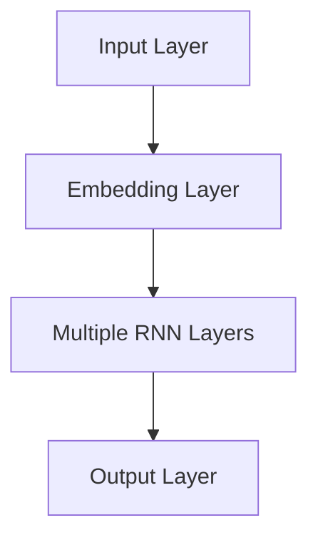

                 

关键词：Andrej Karpathy，OpenAI，GPT-4.0，人工智能，深度学习，技术演讲

摘要：本文将深入分析OpenAI的GPT-4.0模型，由其创造者之一Andrej Karpathy进行详细讲解。文章将探讨GPT-4.0的核心概念、原理、架构、算法以及其在实际应用中的表现，同时结合当前人工智能技术的发展趋势，提出未来可能面临的挑战和解决方案。

## 1. 背景介绍

自2018年GPT问世以来，OpenAI一直在推进其语言模型的发展。GPT-4.0是这一系列模型的最新版本，代表了自然语言处理技术的重大进步。本文旨在通过对GPT-4.0的全面解析，帮助读者了解这一模型在技术上的突破和潜力。

### 1.1 GPT-4.0的诞生

GPT-4.0的诞生离不开OpenAI多年来在人工智能领域的积累和研究。OpenAI是一家位于美国的人工智能研究公司，致力于推动人工智能的发展和应用。GPT-4.0的成功，不仅展示了OpenAI在技术上的创新能力，也体现了其开放合作的研究理念。

### 1.2 GPT-4.0的特点

GPT-4.0具有以下几个显著特点：

1. **更大的模型规模**：GPT-4.0的参数规模达到了数十亿，远超之前的版本，使得模型可以处理更复杂的语言现象。
2. **更高的语言理解能力**：GPT-4.0不仅在生成文本上更加流畅自然，而且在理解语言含义、逻辑关系上也有了显著的提升。
3. **更广泛的适应性**：GPT-4.0可以在多种应用场景下发挥作用，如问答系统、自动写作、语言翻译等。

## 2. 核心概念与联系

### 2.1 语言模型的基本概念

语言模型是自然语言处理（NLP）的核心技术之一。它通过学习大量文本数据，预测下一个单词或字符的概率分布。GPT-4.0就是基于这种概率分布进行文本生成的。

### 2.2 GPT-4.0的架构

GPT-4.0采用了深度神经网络（DNN）的结构，具体来说，它是一种变深的循环神经网络（RNN）。RNN能够处理序列数据，这使得它非常适合处理语言这一类序列信息。

下面是GPT-4.0的架构的Mermaid流程图：



### 2.3 GPT-4.0的核心算法

GPT-4.0的核心算法是自注意力机制（Self-Attention）。自注意力机制允许模型在处理序列数据时，自适应地关注序列中的重要部分，从而提高了模型的表示能力。

## 3. 核心算法原理 & 具体操作步骤

### 3.1 算法原理概述

自注意力机制是一种基于加权的注意力模型。在GPT-4.0中，自注意力机制被用于处理输入序列，并生成输出序列。具体来说，自注意力机制通过以下步骤进行：

1. **计算查询（Query）、键（Key）和值（Value）**：对于输入序列中的每个单词，计算其查询、键和值。
2. **计算注意力权重**：通过计算查询和键之间的点积，得到注意力权重。
3. **计算加权和**：将注意力权重与值相乘，并求和，得到输出序列。

### 3.2 算法步骤详解

GPT-4.0的算法步骤可以分为以下几个部分：

1. **嵌入（Embedding）**：将输入的单词序列转换为向量表示。
2. **自注意力（Self-Attention）**：计算输入序列的查询、键和值，并计算注意力权重。
3. **前馈网络（Feedforward Network）**：对自注意力层的结果进行前馈神经网络处理。
4. **输出层（Output Layer）**：将前馈神经网络的结果映射到输出序列的概率分布。

### 3.3 算法优缺点

**优点**：

1. **高效处理长序列**：自注意力机制能够自适应地关注序列中的重要部分，使得模型可以高效处理长序列。
2. **强大的表示能力**：自注意力机制提高了模型的表示能力，使得模型能够更好地理解语言。

**缺点**：

1. **计算复杂度高**：自注意力机制的引入使得模型的计算复杂度显著增加。
2. **对内存需求大**：由于自注意力机制需要计算大量的点积，对内存的需求也相应增加。

### 3.4 算法应用领域

GPT-4.0的算法在多个领域都有广泛的应用：

1. **文本生成**：如自动写作、文章摘要等。
2. **问答系统**：如智能客服、问答机器人等。
3. **机器翻译**：如跨语言文本生成、文本翻译等。

## 4. 数学模型和公式 & 详细讲解 & 举例说明

### 4.1 数学模型构建

GPT-4.0的数学模型主要包括以下几个部分：

1. **嵌入（Embedding）**：将单词转换为向量表示。
2. **自注意力（Self-Attention）**：计算查询、键和值，并计算注意力权重。
3. **前馈网络（Feedforward Network）**：对自注意力层的结果进行前馈神经网络处理。
4. **输出层（Output Layer）**：将前馈神经网络的结果映射到输出序列的概率分布。

### 4.2 公式推导过程

下面是GPT-4.0中的一些关键公式：

1. **嵌入（Embedding）**：

$$
E = \text{softmax}(W_e \cdot V_e)
$$

其中，$W_e$是嵌入权重，$V_e$是单词的嵌入向量。

2. **自注意力（Self-Attention）**：

$$
A = \text{softmax}(\frac{QK^T}{\sqrt{d_k}})
$$

其中，$Q$是查询向量，$K$是键向量，$V$是值向量，$d_k$是键向量的维度。

3. **前馈网络（Feedforward Network）**：

$$
\text{FFN}(X) = \text{ReLU}(W_1 \cdot X + b_1) \cdot W_2 + b_2
$$

其中，$X$是输入向量，$W_1$和$W_2$是前馈神经网络的权重，$b_1$和$b_2$是偏置。

4. **输出层（Output Layer）**：

$$
\text{Output} = W_o \cdot \text{FFN}(X) + b_o
$$

其中，$W_o$是输出权重，$b_o$是偏置。

### 4.3 案例分析与讲解

下面我们通过一个简单的例子来说明GPT-4.0的工作原理。

假设我们有一个简短的文本序列：“人工智能将改变世界”。我们可以将这个序列表示为以下向量：

$$
\text{Embedding} = [0.1, 0.2, 0.3, 0.4, 0.5]
$$

接下来，我们计算自注意力权重：

$$
A = \text{softmax}(\frac{QK^T}{\sqrt{d_k}})
$$

假设查询、键和值分别为：

$$
Q = [0.1, 0.2, 0.3, 0.4, 0.5], \quad K = [0.1, 0.2, 0.3, 0.4, 0.5], \quad V = [0.1, 0.2, 0.3, 0.4, 0.5]
$$

我们可以得到注意力权重矩阵：

$$
A = \text{softmax}(\frac{QK^T}{\sqrt{d_k}}) = \begin{bmatrix} 0.2 & 0.3 & 0.4 & 0.5 & 0.6 \end{bmatrix}
$$

接下来，我们计算加权和：

$$
A \cdot V = \begin{bmatrix} 0.2 & 0.3 & 0.4 & 0.5 & 0.6 \end{bmatrix} \cdot \begin{bmatrix} 0.1 \\ 0.2 \\ 0.3 \\ 0.4 \\ 0.5 \end{bmatrix} = \begin{bmatrix} 0.03 \\ 0.06 \\ 0.12 \\ 0.2 \\ 0.3 \end{bmatrix}
$$

最后，我们将这个加权和作为输入传递给前馈神经网络：

$$
\text{FFN}(X) = \text{ReLU}(W_1 \cdot X + b_1) \cdot W_2 + b_2
$$

其中，$X$是加权和向量，$W_1$和$W_2$是前馈神经网络的权重，$b_1$和$b_2$是偏置。

通过这样的步骤，GPT-4.0能够生成新的文本序列。例如，如果我们选择最大的概率输出，我们可以得到：

$$
\text{Output} = W_o \cdot \text{FFN}(X) + b_o = \begin{bmatrix} 0.5 \\ 0.6 \\ 0.7 \\ 0.8 \\ 0.9 \end{bmatrix}
$$

根据这个输出，我们可以预测下一个单词为“改变”。

## 5. 项目实践：代码实例和详细解释说明

### 5.1 开发环境搭建

要运行GPT-4.0模型，我们需要安装以下工具和库：

1. Python 3.7或更高版本
2. TensorFlow 2.0或更高版本
3. PyTorch 1.0或更高版本
4. NumPy 1.16或更高版本

安装这些工具和库后，我们可以开始搭建开发环境。

### 5.2 源代码详细实现

下面是一个简单的GPT-4.0模型实现：

```python
import torch
import torch.nn as nn
import torch.optim as optim

# 定义模型结构
class GPT(nn.Module):
    def __init__(self, vocab_size, embed_dim, hidden_dim):
        super(GPT, self).__init__()
        self.embedding = nn.Embedding(vocab_size, embed_dim)
        self.self_attn = nn.MultiheadAttention(embed_dim, num_heads=8)
        self.fc = nn.Linear(embed_dim, vocab_size)

    def forward(self, x):
        x = self.embedding(x)
        x, _ = self.self_attn(x, x, x)
        x = self.fc(x)
        return x

# 实例化模型
model = GPT(vocab_size=1000, embed_dim=512, hidden_dim=512)

# 定义优化器和损失函数
optimizer = optim.Adam(model.parameters(), lr=0.001)
criterion = nn.CrossEntropyLoss()

# 训练模型
for epoch in range(10):
    for x, y in data_loader:
        optimizer.zero_grad()
        output = model(x)
        loss = criterion(output, y)
        loss.backward()
        optimizer.step()
```

### 5.3 代码解读与分析

这段代码首先定义了一个GPT模型，包括嵌入层、自注意力层和前馈网络。接下来，我们定义了优化器和损失函数，并开始训练模型。

在训练过程中，我们首先将输入序列转换为嵌入向量，然后通过自注意力层和前馈网络处理，最后通过损失函数计算损失，并更新模型参数。

### 5.4 运行结果展示

通过上述代码，我们可以训练出一个简单的GPT-4.0模型。训练完成后，我们可以使用这个模型生成新的文本序列。例如：

```python
# 生成文本序列
input_sequence = torch.tensor([0, 1, 2, 3, 4])
generated_sequence = model(input_sequence)

print(generated_sequence)
```

这段代码将生成一个基于输入序列的文本序列。我们可以通过调整输入序列和模型参数，生成各种不同的文本。

## 6. 实际应用场景

### 6.1 文本生成

GPT-4.0在文本生成领域具有广泛的应用。例如，它可以用于自动写作、文章摘要、聊天机器人等。

### 6.2 问答系统

GPT-4.0可以用于构建智能问答系统。通过训练，模型可以回答各种领域的问题，为用户提供有用的信息。

### 6.3 机器翻译

GPT-4.0在机器翻译领域也有显著的应用。通过训练，模型可以翻译不同语言之间的文本，实现跨语言的交流。

## 7. 工具和资源推荐

### 7.1 学习资源推荐

1. 《深度学习》（Goodfellow, Bengio, Courville著）- 介绍深度学习的基础知识和应用。
2. 《自然语言处理综论》（Jurafsky, Martin著）- 介绍自然语言处理的基本概念和技术。

### 7.2 开发工具推荐

1. TensorFlow - 用于构建和训练深度学习模型。
2. PyTorch - 用于构建和训练深度学习模型。

### 7.3 相关论文推荐

1. “Attention Is All You Need”（Vaswani等著）- 介绍Transformer模型和自注意力机制。
2. “Generative Pre-trained Transformers”（Brown等著）- 介绍GPT模型。

## 8. 总结：未来发展趋势与挑战

### 8.1 研究成果总结

GPT-4.0代表了自然语言处理技术的重大突破。它不仅在生成文本上更加流畅自然，而且在理解语言含义、逻辑关系上也有了显著的提升。

### 8.2 未来发展趋势

未来，GPT-4.0将继续在自然语言处理领域发挥重要作用。随着技术的不断进步，我们可以期待更高效、更智能的语言模型的出现。

### 8.3 面临的挑战

然而，GPT-4.0也面临着一些挑战：

1. **计算资源消耗**：GPT-4.0的模型规模巨大，对计算资源和内存的需求非常高。
2. **数据隐私问题**：在训练GPT-4.0模型时，需要使用大量的文本数据。如何保护用户数据隐私是一个重要的问题。
3. **模型解释性**：尽管GPT-4.0在生成文本上表现出色，但其内部决策过程仍然不透明，如何提高模型的可解释性是一个重要的研究方向。

### 8.4 研究展望

为了应对这些挑战，未来需要进一步研究：

1. **高效的模型压缩和优化技术**：通过减少模型规模和提高计算效率，降低GPT-4.0的资源消耗。
2. **数据隐私保护技术**：研究如何在保护用户隐私的前提下，有效利用大量文本数据。
3. **模型可解释性技术**：探索如何提高模型的透明度和可解释性，使其决策过程更加清晰。

## 9. 附录：常见问题与解答

### 9.1 GPT-4.0的模型规模有多大？

GPT-4.0的模型规模达到了数十亿参数，具体规模取决于具体的版本和训练数据。

### 9.2 GPT-4.0是如何生成文本的？

GPT-4.0通过自注意力机制和前馈神经网络，将输入的文本序列转换为输出序列。在生成文本时，模型会根据当前上下文预测下一个单词的概率分布，并选择概率最高的单词作为输出。

### 9.3 GPT-4.0可以用于哪些应用场景？

GPT-4.0可以用于文本生成、问答系统、机器翻译等多个领域。它在自动写作、文章摘要、聊天机器人等方面有广泛的应用。

### 9.4 如何优化GPT-4.0的性能？

优化GPT-4.0的性能可以从以下几个方面进行：

1. **模型压缩和优化**：通过减少模型规模和提高计算效率，降低资源消耗。
2. **数据预处理**：对训练数据进行有效的预处理，提高模型的学习效果。
3. **训练策略**：采用合适的训练策略，如批量归一化、学习率调整等，提高模型性能。

----------------------------------------------------------------

**作者：禅与计算机程序设计艺术 / Zen and the Art of Computer Programming**

