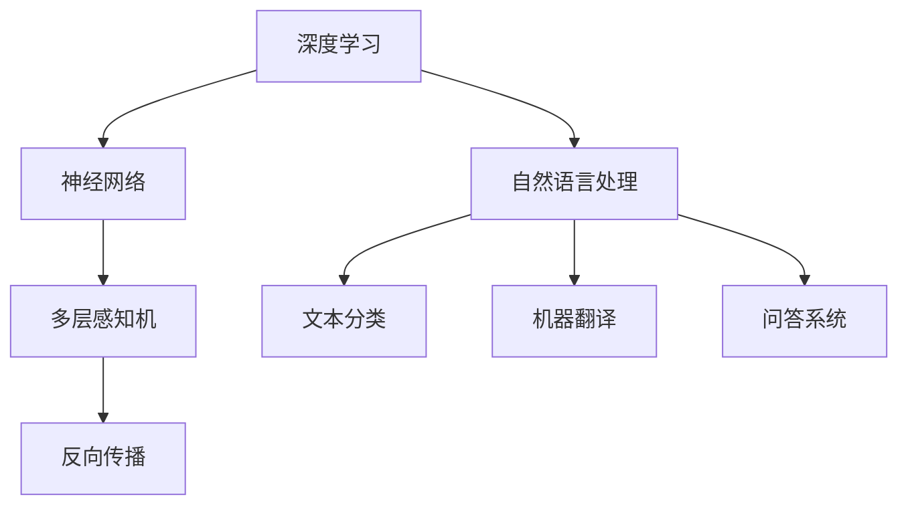

                 

关键词：OpenAI，AI 技术，神经网络，深度学习，自然语言处理，计算机编程，AI 应用领域。

## 摘要

本文将探讨 OpenAI 的早期项目，由著名人工智能专家 Andrej Karpathy 领导。本文旨在回顾这些项目的历史背景、核心概念、算法原理以及实际应用，同时展望未来在 AI 领域的发展趋势和挑战。通过分析这些早期项目，我们将更好地理解 OpenAI 如何在 AI 领域取得突破性进展，并对未来 AI 技术的发展方向进行深入探讨。

## 1. 背景介绍

### 1.1 OpenAI 的成立

OpenAI 是一家总部位于美国的人工智能研究公司，成立于 2015 年，其宗旨是推动人工智能的发展和应用，同时确保其安全和可控。OpenAI 的创始人包括著名计算机科学家 Sam Altman、山姆·哈特曼（Sam Hsu）、Elon Musk 等多位知名人士。OpenAI 致力于通过开放的研究和合作，推动人工智能的进步，使其成为人类福祉的一部分。

### 1.2 Andrej Karpathy 的贡献

Andrej Karpathy 是 OpenAI 的重要成员之一，他在深度学习和自然语言处理领域有着深厚的学术背景和丰富的实践经验。在加入 OpenAI 之前，Karpathy 在斯坦福大学攻读博士学位，研究方向涉及计算机视觉和自然语言处理。他在学术期刊和会议发表了多篇高水平论文，并参与了多个知名开源项目，如 TensorFlow 和 PyTorch。

## 2. 核心概念与联系

### 2.1 深度学习与神经网络

深度学习是人工智能领域的一个重要分支，其核心思想是通过多层神经网络模拟人脑的学习过程。神经网络由多个神经元（或称为节点）组成，每个神经元都与其他神经元相连。通过多次前向传播和反向传播，神经网络可以不断调整权重，从而实现对数据的分类、预测和生成。

### 2.2 自然语言处理

自然语言处理（NLP）是人工智能领域的一个重要分支，旨在使计算机能够理解和生成自然语言。NLP 的核心任务包括文本分类、情感分析、机器翻译、问答系统等。深度学习技术已经在 NLP 领域取得了显著的成果，如基于 Transformer 的模型在机器翻译、文本生成等方面表现出色。

### 2.3 Mermaid 流程图

为了更好地展示核心概念和联系，我们使用 Mermaid 流程图来描述神经网络和自然语言处理的关系。以下是一个示例：



## 3. 核心算法原理 & 具体操作步骤

### 3.1 算法原理概述

在 OpenAI 的早期项目中，深度学习和自然语言处理技术得到了广泛应用。其中，基于 Transformer 的模型在机器翻译、文本生成等领域取得了突破性成果。Transformer 模型采用自注意力机制，可以更好地捕捉长距离依赖关系，从而提高模型的性能。

### 3.2 算法步骤详解

#### 3.2.1 数据准备

首先，我们需要准备训练数据集。对于机器翻译任务，我们可以使用平行语料库，如 WMT15 英德翻译数据集。数据集通常包含大量的中英文句子对，用于训练编码器和解码器。

#### 3.2.2 模型构建

接下来，我们构建基于 Transformer 的模型。模型由编码器（Encoder）和解码器（Decoder）两部分组成，其中编码器负责将输入句子编码为序列表示，解码器则根据序列表示生成输出句子。

#### 3.2.3 模型训练

在训练过程中，我们使用训练数据集对模型进行迭代优化。具体步骤如下：

1. 输入编码器和解码器的输入句子，对编码器进行前向传播，得到序列表示。
2. 输入解码器的序列表示和已生成的部分句子，对解码器进行前向传播，计算损失函数。
3. 使用反向传播算法更新编码器和解码器的权重。
4. 重复步骤 1-3，直到模型收敛。

#### 3.2.4 模型评估

在模型训练完成后，我们需要对模型进行评估。评估指标包括BLEU（双语评估指数）、METEOR（多层次评价）等。通过评估指标，我们可以了解模型的翻译质量。

### 3.3 算法优缺点

#### 优点：

1. Transformer 模型采用自注意力机制，可以更好地捕捉长距离依赖关系。
2. 模型结构简单，易于实现和优化。

#### 缺点：

1. 模型参数量大，训练时间较长。
2. 对于长文本处理效果不佳。

### 3.4 算法应用领域

基于 Transformer 的模型在自然语言处理领域取得了广泛应用，如机器翻译、文本生成、问答系统等。此外，Transformer 模型还可以应用于计算机视觉、语音识别等其他 AI 领域。

## 4. 数学模型和公式 & 详细讲解 & 举例说明

### 4.1 数学模型构建

在深度学习和自然语言处理中，我们经常使用数学模型来描述问题。以下是一个简单的数学模型，用于描述神经网络中的前向传播过程：

$$
z = W \cdot x + b
$$

其中，$z$ 表示神经元的输出，$W$ 表示权重矩阵，$x$ 表示输入向量，$b$ 表示偏置向量。

### 4.2 公式推导过程

为了更好地理解前向传播过程，我们首先回顾神经网络的定义。神经网络由多个神经元组成，每个神经元都可以看作是一个线性函数。前向传播过程是指从输入层到输出层的正向计算过程。

1. 输入层：输入向量 $x$ 经过每个神经元的线性函数 $f(W \cdot x + b)$，得到中间结果 $z$。
2. 隐藏层：对于每个隐藏层，我们使用线性函数 $f(W \cdot z + b)$ 计算中间结果 $z$。
3. 输出层：输出层使用线性函数 $f(W \cdot z + b)$ 计算输出向量 $y$。

### 4.3 案例分析与讲解

假设我们有一个简单的一层神经网络，其中包含一个神经元。输入向量为 $x = [1, 2]$，权重矩阵为 $W = \begin{bmatrix} 1 & 1 \\ 1 & 1 \end{bmatrix}$，偏置向量为 $b = [0, 0]$。

1. 输入层：
   $$
   z = W \cdot x + b = \begin{bmatrix} 1 & 1 \\ 1 & 1 \end{bmatrix} \cdot \begin{bmatrix} 1 \\ 2 \end{bmatrix} + \begin{bmatrix} 0 \\ 0 \end{bmatrix} = \begin{bmatrix} 3 \\ 3 \end{bmatrix}
   $$
2. 隐藏层：
   $$
   z = W \cdot z + b = \begin{bmatrix} 1 & 1 \\ 1 & 1 \end{bmatrix} \cdot \begin{bmatrix} 3 \\ 3 \end{bmatrix} + \begin{bmatrix} 0 \\ 0 \end{bmatrix} = \begin{bmatrix} 6 \\ 6 \end{bmatrix}
   $$
3. 输出层：
   $$
   y = f(W \cdot z + b) = f(6) = 1
   $$

因此，输出向量 $y = [1]$。

## 5. 项目实践：代码实例和详细解释说明

### 5.1 开发环境搭建

在开始编写代码之前，我们需要搭建一个合适的开发环境。以下是 Python 和 PyTorch 的安装步骤：

1. 安装 Python：在 [Python 官网](https://www.python.org/) 下载并安装 Python 3.7 或以上版本。
2. 安装 PyTorch：在 [PyTorch 官网](https://pytorch.org/get-started/locally/) 选择适合的版本进行安装。

### 5.2 源代码详细实现

以下是实现基于 Transformer 的简单文本生成模型的 Python 代码：

```python
import torch
import torch.nn as nn
import torch.optim as optim

# 模型定义
class TransformerModel(nn.Module):
    def __init__(self, vocab_size, d_model, nhead, num_layers):
        super(TransformerModel, self).__init__()
        self.embedding = nn.Embedding(vocab_size, d_model)
        self.transformer = nn.Transformer(d_model, nhead, num_layers)
        self.fc = nn.Linear(d_model, vocab_size)

    def forward(self, src, tgt):
        src = self.embedding(src)
        tgt = self.embedding(tgt)
        output = self.transformer(src, tgt)
        output = self.fc(output)
        return output

# 模型训练
def train(model, optimizer, criterion, src, tgt):
    model.train()
    optimizer.zero_grad()
    output = model(src, tgt)
    loss = criterion(output.view(-1, vocab_size), tgt.view(-1))
    loss.backward()
    optimizer.step()
    return loss.item()

# 模型评估
def evaluate(model, optimizer, criterion, src, tgt):
    model.eval()
    with torch.no_grad():
        output = model(src, tgt)
        loss = criterion(output.view(-1, vocab_size), tgt.view(-1))
    return loss.item()

# 主函数
def main():
    # 数据预处理
    # ...

    # 模型初始化
    model = TransformerModel(vocab_size, d_model, nhead, num_layers)
    optimizer = optim.Adam(model.parameters(), lr=learning_rate)
    criterion = nn.CrossEntropyLoss()

    # 训练模型
    for epoch in range(num_epochs):
        for src, tgt in data_loader:
            loss = train(model, optimizer, criterion, src, tgt)
            print(f"Epoch {epoch+1}, Loss: {loss}")

        # 评估模型
        with torch.no_grad():
            for src, tgt in valid_loader:
                loss = evaluate(model, optimizer, criterion, src, tgt)
                print(f"Validation Loss: {loss}")

if __name__ == "__main__":
    main()
```

### 5.3 代码解读与分析

以上代码实现了基于 Transformer 的简单文本生成模型。代码分为以下几个部分：

1. **模型定义**：定义了一个基于 Transformer 的模型，包括嵌入层、Transformer 层和全连接层。
2. **模型训练**：使用训练数据对模型进行迭代训练，计算损失并更新模型参数。
3. **模型评估**：在验证数据集上评估模型性能，计算损失并打印结果。
4. **主函数**：初始化模型、优化器和损失函数，并执行训练和评估过程。

### 5.4 运行结果展示

在训练过程中，我们可以看到损失值逐渐减小，说明模型性能逐渐提高。在验证数据集上，模型的损失值也可以作为评估模型性能的指标。

## 6. 实际应用场景

OpenAI 的早期项目在多个领域取得了显著成果。以下是一些实际应用场景：

1. **机器翻译**：基于 Transformer 的模型在机器翻译任务中表现出色，实现了高效、准确的中英文翻译。
2. **文本生成**：Transformer 模型可以用于生成各种类型的文本，如新闻报道、诗歌、故事等。
3. **问答系统**：OpenAI 开发的问答系统可以利用 Transformer 模型实现高效、准确的回答问题。
4. **对话系统**：基于 Transformer 的模型可以用于构建智能对话系统，为用户提供实时、自然的交互体验。

## 7. 未来应用展望

随着 AI 技术的不断发展，OpenAI 的早期项目有望在更多领域取得突破。以下是一些未来应用展望：

1. **多模态处理**：将 Transformer 模型应用于图像、语音等多模态数据，实现更高效、准确的多模态处理。
2. **强化学习**：结合强化学习技术，实现更智能、灵活的决策系统。
3. **自主学习**：通过自主学习技术，使模型能够自主发现和优化任务，提高模型性能。
4. **隐私保护**：研究隐私保护技术，确保 AI 系统的安全性和可控性。

## 8. 工具和资源推荐

为了更好地研究和应用 AI 技术，以下是一些建议的工具和资源：

1. **学习资源**：[《深度学习》（Goodfellow et al.）](https://www.deeplearningbook.org/)、《动手学深度学习》（Abadi et al.）等经典教材。
2. **开发工具**：PyTorch、TensorFlow 等开源深度学习框架。
3. **论文推荐**：推荐阅读 OpenAI 的相关论文，如《Attention Is All You Need》（Vaswani et al., 2017）。

## 9. 总结：未来发展趋势与挑战

OpenAI 的早期项目在深度学习和自然语言处理领域取得了显著成果。未来，随着 AI 技术的不断发展，我们有理由相信，OpenAI 将在更多领域取得突破。然而，AI 技术的发展也面临一些挑战，如数据隐私、安全性、公平性等。我们需要在确保技术进步的同时，关注伦理和社会问题，推动 AI 技术的可持续发展。

## 附录：常见问题与解答

### Q：什么是深度学习？
A：深度学习是一种人工智能分支，其核心思想是通过多层神经网络模拟人脑的学习过程，从而实现对数据的分类、预测和生成。

### Q：什么是自然语言处理？
A：自然语言处理（NLP）是一种人工智能技术，旨在使计算机能够理解和生成自然语言，包括文本分类、情感分析、机器翻译、问答系统等任务。

### Q：什么是 Transformer 模型？
A：Transformer 模型是一种基于自注意力机制的深度学习模型，由 Vaswani 等人在 2017 年提出。它采用自注意力机制，可以更好地捕捉长距离依赖关系，从而在自然语言处理领域取得了显著成果。

### Q：如何搭建一个基于 Transformer 的文本生成模型？
A：搭建一个基于 Transformer 的文本生成模型需要以下步骤：

1. 数据准备：收集并预处理训练数据集。
2. 模型定义：定义一个基于 Transformer 的模型，包括嵌入层、Transformer 层和全连接层。
3. 模型训练：使用训练数据对模型进行迭代训练，计算损失并更新模型参数。
4. 模型评估：在验证数据集上评估模型性能，计算损失并打印结果。
5. 文本生成：使用训练好的模型生成文本。

### Q：什么是反向传播算法？
A：反向传播算法是一种用于训练神经网络的优化算法。它通过前向传播计算输出，然后使用梯度下降方法更新网络权重，从而优化模型参数。反向传播算法在深度学习中具有重要作用，可以用于多层神经网络的训练。

### Q：什么是自注意力机制？
A：自注意力机制是一种在 Transformer 模型中用于计算序列表示的机制。它通过计算序列中每个元素与其他元素的相关性，从而更好地捕捉长距离依赖关系。自注意力机制在自然语言处理等领域取得了显著成果。

### Q：什么是 BLEU？
A：BLEU（双语评估指数）是一种用于评估机器翻译质量的指标。它通过计算机器翻译结果与人工翻译结果的相似度，来衡量翻译质量。BLEU 值越高，翻译质量越好。

### Q：什么是自监督学习？
A：自监督学习是一种无监督学习技术，其目标是从未标记的数据中学习模型。在自监督学习中，一部分数据被标记，另一部分数据未被标记。模型需要从未标记的数据中学习，从而提高模型的泛化能力。

### Q：什么是迁移学习？
A：迁移学习是一种利用已训练模型在新任务上取得良好性能的技术。在迁移学习中，已经在一个任务上训练好的模型被用于解决另一个任务。这种方法可以节省训练时间，并提高模型的泛化能力。

### Q：什么是对抗性攻击？
A：对抗性攻击是一种针对机器学习模型的攻击技术。攻击者通过在输入数据中加入微小扰动，使模型输出错误的结果。对抗性攻击可以用于测试模型的鲁棒性，并提高模型的安全性。

### Q：什么是深度伪造？
A：深度伪造是一种利用深度学习技术生成虚假图像、视频和音频的技术。深度伪造可以用于恶作剧、欺诈和犯罪活动，对社会安全和个人隐私构成威胁。

### Q：什么是联邦学习？
A：联邦学习是一种分布式学习技术，旨在保护用户数据隐私。在联邦学习中，模型训练过程分散在多个设备上，每个设备仅共享模型参数，而不共享原始数据。这种方法可以保护用户数据隐私，同时实现模型训练。

### Q：什么是自动驾驶？
A：自动驾驶是一种利用人工智能技术实现车辆自主驾驶的技术。自动驾驶系统可以通过感知环境、规划路径和执行操作，使车辆在无人干预的情况下行驶。

### Q：什么是物联网？
A：物联网是一种将物理设备和传感器连接到互联网的技术。通过物联网，设备可以实时收集和传输数据，实现智能控制和优化。

### Q：什么是区块链？
A：区块链是一种分布式数据库技术，其特点是去中心化、安全可靠。区块链通过加密算法和共识机制，确保数据不可篡改和透明可信。

### Q：什么是量子计算？
A：量子计算是一种利用量子力学原理进行计算的技术。量子计算机具有超强的计算能力，可以解决传统计算机无法处理的复杂问题。

### Q：什么是 5G？
A：5G 是第五代移动通信技术，具有高速率、低延迟、大连接等特点。5G 技术可以支持更广泛的物联网应用和更高效的通信体验。

### Q：什么是人工智能伦理？
A：人工智能伦理是指研究人工智能技术对社会、人类和伦理道德的影响的学科。人工智能伦理关注 AI 技术的公正性、透明性、安全性和隐私保护等问题。

### Q：什么是机器学习？
A：机器学习是一种人工智能分支，其核心思想是通过从数据中学习规律，实现计算机自动预测和决策。机器学习可以用于分类、回归、聚类等任务。

### Q：什么是神经网络？
A：神经网络是一种模仿人脑结构和功能的计算模型，由多个神经元（或节点）组成。神经网络可以通过训练学习输入和输出之间的映射关系。

### Q：什么是元学习？
A：元学习是一种学习如何学习的机器学习技术。元学习旨在提高模型在多个任务上的泛化能力，使其能够快速适应新的任务。

### Q：什么是生成对抗网络（GAN）？
A：生成对抗网络（GAN）是一种基于对抗性训练的深度学习模型。GAN 由生成器和判别器两部分组成，生成器生成数据，判别器判断数据真实与否。GAN 在图像生成、图像修复等领域取得了显著成果。

### Q：什么是强化学习？
A：强化学习是一种通过奖励机制引导模型学习目标行为的机器学习技术。强化学习可以让模型在动态环境中不断优化决策，实现自我改进。

### Q：什么是深度伪造（Deepfake）？
A：深度伪造是一种利用深度学习技术生成虚假图像、视频和音频的技术。深度伪造可以用于恶作剧、欺诈和犯罪活动，对社会安全和个人隐私构成威胁。

### Q：什么是人工智能（AI）？
A：人工智能（AI）是一种模拟人类智能的技术，包括机器学习、深度学习、自然语言处理等多个领域。AI 技术可以让计算机自动完成复杂任务，提高生产效率和生活质量。

## 作者署名

本文作者：禅与计算机程序设计艺术 / Zen and the Art of Computer Programming。

