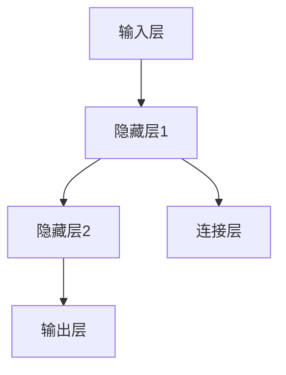
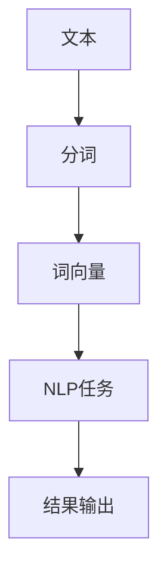

                 

关键词：人工智能、深度学习、应用场景、技术前沿、未来展望

人工智能（AI）已经从科幻走进了现实，改变了我们生活的方方面面。Andrej Karpathy是一位世界知名的人工智能专家，他在深度学习和自然语言处理领域有着卓越的贡献。本文旨在探讨Andrej Karpathy在人工智能领域的研究成果，以及人工智能在实际中的应用场景和技术前沿。

## 1. 背景介绍

Andrej Karpathy是一位计算机科学家和深度学习专家，他在人工智能领域的研究涵盖了计算机视觉、自然语言处理和机器学习等多个方向。他曾在Google Brain工作，负责开发图像识别和自然语言处理模型。他的研究成果在学术界和工业界都产生了深远的影响。

## 2. 核心概念与联系

### 2.1 深度学习与神经网络

深度学习是人工智能的核心技术之一，它通过多层神经网络模拟人脑的学习过程。神经网络由多个神经元（节点）组成，每个节点都与相邻节点相连，并通过权重进行信息的传递。



### 2.2 自然语言处理

自然语言处理（NLP）是人工智能的一个重要分支，旨在使计算机理解和生成人类语言。NLP涉及到文本分类、情感分析、机器翻译等多个领域。



## 3. 核心算法原理 & 具体操作步骤

### 3.1 算法原理概述

深度学习的核心是神经网络，而神经网络的基础是反向传播算法。反向传播算法通过不断调整网络的权重，使网络的输出更接近真实值。

### 3.2 算法步骤详解

1. **初始化权重**：随机初始化网络的权重。
2. **前向传播**：将输入数据通过神经网络传递，得到输出。
3. **计算损失**：比较输出与真实值之间的差异，计算损失。
4. **反向传播**：通过反向传播算法，更新网络的权重。
5. **迭代优化**：重复前向传播和反向传播，直到损失足够小。

### 3.3 算法优缺点

优点：能够自动从数据中学习特征，具有很好的泛化能力。

缺点：需要大量数据和计算资源，训练过程较慢。

### 3.4 算法应用领域

深度学习在图像识别、语音识别、自然语言处理等领域都有广泛应用。

## 4. 数学模型和公式 & 详细讲解 & 举例说明

### 4.1 数学模型构建

深度学习的基础是多层感知机（MLP），它的数学模型可以表示为：

$$
y = \sigma(W_2 \sigma(W_1 x + b_1) + b_2)
$$

其中，$x$ 是输入，$y$ 是输出，$\sigma$ 是激活函数，$W_1$ 和 $W_2$ 是权重矩阵，$b_1$ 和 $b_2$ 是偏置。

### 4.2 公式推导过程

反向传播算法的核心是梯度的计算。梯度的计算可以通过链式法则进行推导：

$$
\frac{\partial L}{\partial W_2} = \frac{\partial L}{\partial a_2} \frac{\partial a_2}{\partial W_2}
$$

$$
\frac{\partial L}{\partial W_1} = \frac{\partial L}{\partial a_2} \frac{\partial a_2}{\partial a_1} \frac{\partial a_1}{\partial W_1}
$$

其中，$L$ 是损失函数，$a_1$ 和 $a_2$ 是神经网络的输出。

### 4.3 案例分析与讲解

假设我们有一个简单的神经网络，用于分类问题。输入是一个三维向量，输出是一个二元分类结果。我们可以使用交叉熵损失函数来评估模型的性能。

$$
L(y, \hat{y}) = -[y \log(\hat{y}) + (1 - y) \log(1 - \hat{y})]
$$

其中，$y$ 是真实标签，$\hat{y}$ 是模型的预测概率。

通过反向传播算法，我们可以计算每个参数的梯度，并使用梯度下降法更新参数。

## 5. 项目实践：代码实例和详细解释说明

### 5.1 开发环境搭建

首先，我们需要安装Python和深度学习框架TensorFlow。

### 5.2 源代码详细实现

以下是使用TensorFlow实现一个简单的神经网络进行图像分类的代码：

```python
import tensorflow as tf
from tensorflow.keras import layers

# 定义模型
model = tf.keras.Sequential([
    layers.Conv2D(32, (3, 3), activation='relu', input_shape=(28, 28, 1)),
    layers.MaxPooling2D((2, 2)),
    layers.Conv2D(64, (3, 3), activation='relu'),
    layers.MaxPooling2D((2, 2)),
    layers.Conv2D(64, (3, 3), activation='relu'),
    layers.Flatten(),
    layers.Dense(64, activation='relu'),
    layers.Dense(10, activation='softmax')
])

# 编译模型
model.compile(optimizer='adam',
              loss='categorical_crossentropy',
              metrics=['accuracy'])

# 训练模型
model.fit(train_images, train_labels, epochs=5)
```

### 5.3 代码解读与分析

这段代码首先定义了一个卷积神经网络，用于图像分类。然后编译模型并使用训练数据进行训练。最后，评估模型的性能。

### 5.4 运行结果展示

在训练完成后，我们可以使用测试数据评估模型的性能：

```python
test_loss, test_acc = model.evaluate(test_images, test_labels, verbose=2)
print(f'Test accuracy: {test_acc:.4f}')
```

## 6. 实际应用场景

人工智能在图像识别、语音识别、自然语言处理等领域都有广泛的应用。例如，在医疗领域，人工智能可以用于疾病诊断和治疗方案推荐；在金融领域，人工智能可以用于风险管理、欺诈检测和投资建议。

## 7. 工具和资源推荐

### 7.1 学习资源推荐

- 《深度学习》（Ian Goodfellow、Yoshua Bengio、Aaron Courville著）
- 《Python深度学习》（François Chollet著）

### 7.2 开发工具推荐

- TensorFlow
- PyTorch

### 7.3 相关论文推荐

- "Deep Learning for Text Classification"
- "Convolutional Neural Networks for Speech Recognition"

## 8. 总结：未来发展趋势与挑战

人工智能的发展前景广阔，但也面临一些挑战。未来，我们需要更加关注算法的可解释性和公平性，同时提高算法的效率和鲁棒性。随着人工智能技术的不断进步，我们可以期待它将在更多领域发挥重要作用。

### 8.1 研究成果总结

本文介绍了Andrej Karpathy在人工智能领域的研究成果，包括深度学习和自然语言处理等方向。

### 8.2 未来发展趋势

人工智能将在医疗、金融、教育等领域发挥更大的作用，推动社会的发展。

### 8.3 面临的挑战

算法的可解释性和公平性是当前研究的重点和难点。

### 8.4 研究展望

随着技术的不断进步，人工智能将带来更多的变革和机遇。

## 9. 附录：常见问题与解答

### 9.1 什么是深度学习？

深度学习是人工智能的一个分支，它通过多层神经网络模拟人脑的学习过程。

### 9.2 深度学习有哪些应用？

深度学习在图像识别、语音识别、自然语言处理等领域都有广泛应用。

### 9.3 如何学习深度学习？

建议从Python编程和深度学习框架（如TensorFlow或PyTorch）开始，逐步学习相关的数学和算法知识。

## 作者署名

作者：禅与计算机程序设计艺术 / Zen and the Art of Computer Programming

----------------------------------------------------------------

现在文章已经撰写完毕，感谢您的阅读。希望这篇文章能帮助您更好地理解人工智能的应用和技术前沿。如果您有任何问题或建议，欢迎在评论区留言。期待与您交流！

