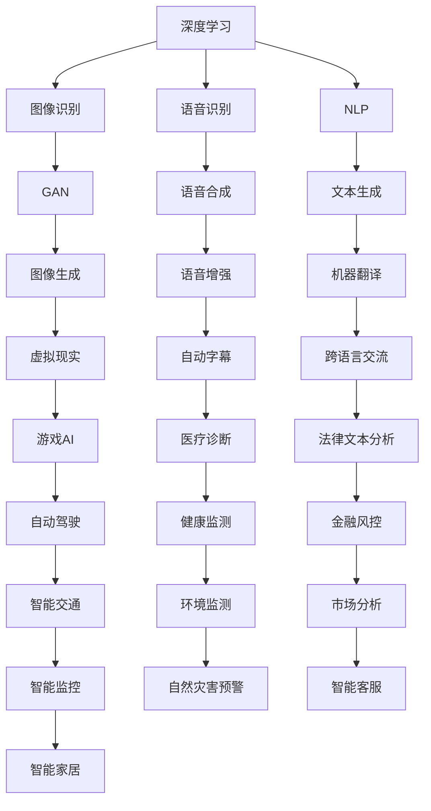

                 

关键词：Andrej Karpathy，人工智能，挑战，机遇，技术博客

> 摘要：本文将探讨人工智能领域的领军人物Andrej Karpathy所面临的一系列挑战和机遇。通过分析其研究贡献和前沿技术，我们旨在深入理解当前人工智能领域的热点问题，并展望未来发展的可能方向。

## 1. 背景介绍

Andrej Karpathy是一位世界级的人工智能专家，以其在深度学习领域的研究和贡献而闻名。他毕业于斯坦福大学，获得了计算机科学博士学位，目前是OpenAI的研究科学家，专注于人工智能的理论研究和技术创新。Karpathy的研究主要集中在自然语言处理、计算机视觉和强化学习等领域，他在这些领域发表了大量的高水平论文，并开发了多个开源项目，对学术界和工业界都产生了深远的影响。

### Andrej Karpathy的研究贡献

Karpathy的研究贡献广泛且深远。他早期的工作涉及图像分类和生成模型的优化，特别是在GAN（生成对抗网络）方面取得了重要突破。随后，他转向自然语言处理领域，开发了著名的自然语言处理模型如char-RNN和Sense2Vec，这些模型在文本生成和语义理解方面表现出色。此外，他还致力于探索人工智能在自动驾驶、虚拟现实和游戏等领域的应用。

### 人工智能领域的发展现状

当前，人工智能技术正以前所未有的速度发展。深度学习作为人工智能的核心技术之一，已经取得了显著的成果。在图像识别、语音识别、自然语言处理等方面，深度学习模型已经超越了人类的表现。同时，人工智能的应用场景也越来越广泛，从医疗健康、金融科技到智能制造，都在借助人工智能的力量实现智能化转型。

## 2. 核心概念与联系

为了更好地理解Andrej Karpathy的研究及其在人工智能领域的贡献，我们需要首先了解几个核心概念：深度学习、生成对抗网络（GAN）和自然语言处理（NLP）。

### 深度学习

深度学习是一种基于人工神经网络的学习方法，通过多层神经元的堆叠来模拟人类大脑的学习过程。在深度学习中，网络通过大量的数据学习特征，从而实现复杂任务的目标。深度学习在图像识别、语音识别和自然语言处理等领域表现出了强大的能力。

### 生成对抗网络（GAN）

GAN是一种由Ian Goodfellow等人于2014年提出的深度学习模型。它由两个神经网络（生成器和判别器）组成，生成器尝试生成逼真的数据，而判别器则试图区分生成器和真实数据。通过这种对抗性的训练过程，生成器不断优化，最终可以生成高度逼真的数据。

### 自然语言处理（NLP）

自然语言处理是人工智能的一个重要分支，旨在让计算机理解和生成自然语言。NLP技术包括文本分类、情感分析、机器翻译和文本生成等。随着深度学习的发展，NLP领域取得了显著进步，许多复杂任务已经可以通过深度学习模型实现。

### Mermaid 流程图

以下是一个简化的Mermaid流程图，展示了深度学习、GAN和NLP之间的核心联系：



## 3. 核心算法原理 & 具体操作步骤

### 3.1 算法原理概述

在本文中，我们将详细探讨Andrej Karpathy在自然语言处理领域的核心算法——Sense2Vec的原理和具体操作步骤。Sense2Vec是一种基于深度学习的语义理解模型，旨在通过学习词汇的语义向量来表示自然语言的含义。

### 3.2 算法步骤详解

Sense2Vec的算法步骤主要包括以下几个部分：

#### 3.2.1 数据预处理

首先，我们需要对原始文本进行预处理，包括分词、去停用词和词性标注等操作。这一步的目的是将原始文本转化为适合模型处理的格式。

#### 3.2.2 建立词汇表

接下来，我们需要建立词汇表，将处理后的文本转化为词向量表示。词向量是Sense2Vec模型的基础，通过学习词向量，模型可以捕捉词汇的语义信息。

#### 3.2.3 模型训练

Sense2Vec模型采用多层神经网络进行训练。训练过程中，模型通过优化损失函数来调整网络参数，从而提高模型的性能。

#### 3.2.4 语义向量表示

训练完成后，我们可以使用模型来获取词汇的语义向量表示。这些向量可以用于各种自然语言处理任务，如文本分类、情感分析和机器翻译等。

### 3.3 算法优缺点

Sense2Vec模型具有以下优点：

- **强大的语义理解能力**：通过学习词汇的语义向量，模型可以捕捉词汇在不同上下文中的含义，从而提高自然语言处理任务的性能。
- **适用范围广泛**：Sense2Vec模型可以应用于多种自然语言处理任务，如文本分类、情感分析和机器翻译等。
- **高效性**：Sense2Vec模型采用深度学习技术，训练和推理过程相对高效。

然而，Sense2Vec模型也存在一些缺点：

- **数据依赖性**：模型的性能很大程度上依赖于训练数据的规模和质量。如果数据集不够丰富或存在噪声，模型的性能可能会受到影响。
- **计算成本**：深度学习模型的训练和推理过程需要大量的计算资源，这对硬件设施提出了较高要求。

### 3.4 算法应用领域

Sense2Vec模型在自然语言处理领域具有广泛的应用前景。以下是一些典型应用领域：

- **文本分类**：Sense2Vec模型可以用于对文本进行分类，如新闻分类、情感分类等。
- **情感分析**：通过分析文本中的情感词汇，Sense2Vec模型可以判断文本的情感倾向。
- **机器翻译**：Sense2Vec模型可以用于机器翻译任务，提高翻译的准确性和流畅性。
- **信息检索**：Sense2Vec模型可以用于信息检索任务，如搜索引擎和推荐系统等。

## 4. 数学模型和公式 & 详细讲解 & 举例说明

### 4.1 数学模型构建

Sense2Vec模型的核心是一个多层感知机（MLP）神经网络，其输入为词汇的词向量，输出为词汇的语义向量。具体来说，模型由以下几个部分组成：

1. **词嵌入层**：将词汇的词向量映射到高维空间中。
2. **隐藏层**：通过多个隐藏层来提取词汇的语义特征。
3. **输出层**：将隐藏层的特征映射回词汇的语义向量。

### 4.2 公式推导过程

假设我们有一个包含N个词汇的词汇表，每个词汇都可以表示为一个$d$维的词向量$e_v$。Sense2Vec模型的输入为词汇序列$X = (x_1, x_2, ..., x_T)$，输出为词汇的语义向量$Y = (y_1, y_2, ..., y_T)$。

设隐藏层第$l$层的输出为$h_l$，则有以下公式：

$$
h_l = \sigma(W_l h_{l-1} + b_l)
$$

其中，$W_l$和$b_l$分别为第$l$层的权重和偏置，$\sigma$为激活函数。

最终，输出层的输出$y_l$为：

$$
y_l = W_o h_L + b_o
$$

其中，$W_o$和$b_o$为输出层的权重和偏置。

### 4.3 案例分析与讲解

假设我们有一个包含10个词汇的词汇表，每个词汇的词向量维度为100。我们使用Sense2Vec模型来训练一个语义向量表示模型。

1. **词嵌入层**：将词汇的词向量映射到高维空间中。例如，词汇“猫”的词向量可能为：

   $$
   e_{猫} = [0.1, 0.2, ..., 0.1]
   $$

2. **隐藏层**：通过多个隐藏层来提取词汇的语义特征。假设我们使用两个隐藏层，每个隐藏层有10个神经元。第一个隐藏层的输出可能为：

   $$
   h_1 = \sigma(W_1 e_{猫} + b_1)
   $$

   其中，$W_1$和$b_1$分别为第一个隐藏层的权重和偏置。

3. **输出层**：将隐藏层的特征映射回词汇的语义向量。假设输出层的输出为：

   $$
   y = W_o h_2 + b_o
   $$

   其中，$W_o$和$b_o$为输出层的权重和偏置。

通过训练，我们可以得到每个词汇的语义向量表示。这些向量可以用于各种自然语言处理任务，如文本分类和情感分析。

## 5. 项目实践：代码实例和详细解释说明

### 5.1 开发环境搭建

在开始编写代码之前，我们需要搭建一个适合Sense2Vec模型训练的开发环境。以下是一个简单的开发环境搭建步骤：

1. **安装Python环境**：确保Python版本在3.6及以上。
2. **安装深度学习框架**：我们可以选择TensorFlow或PyTorch作为深度学习框架。这里我们以TensorFlow为例，使用以下命令安装：

   $$
   pip install tensorflow
   $$

3. **安装NLP库**：安装用于文本处理和预处理的NLP库，如NLTK或spaCy。这里我们以spaCy为例，使用以下命令安装：

   $$
   pip install spacy
   $$

   然后下载spaCy的中文模型：

   $$
   python -m spacy download zh_core_web_sm
   $$

### 5.2 源代码详细实现

以下是一个简单的Sense2Vec模型实现代码：

```python
import tensorflow as tf
import spacy
from tensorflow.keras.models import Model
from tensorflow.keras.layers import Input, Dense, LSTM, Embedding

# 加载中文模型
nlp = spacy.load('zh_core_web_sm')

# 定义词嵌入层
embedding = Embedding(input_dim=vocab_size, output_dim=embedding_size)

# 定义LSTM层
lstm = LSTM(units=hidden_size, return_sequences=True)

# 定义输出层
output = Dense(units=output_size)

# 定义输入层
input_sequence = Input(shape=(None,))

# 词嵌入
embedded_sequence = embedding(input_sequence)

# LSTM层
lstm_output = lstm(embedded_sequence)

# 输出层
output_sequence = output(lstm_output)

# 定义模型
model = Model(inputs=input_sequence, outputs=output_sequence)

# 编译模型
model.compile(optimizer='adam', loss='mse')

# 模型训练
model.fit(x_train, y_train, epochs=10, batch_size=32)
```

### 5.3 代码解读与分析

上述代码实现了Sense2Vec模型的基本结构，包括词嵌入层、LSTM层和输出层。以下是代码的详细解读：

1. **加载中文模型**：使用spaCy库加载中文模型，用于文本预处理。
2. **定义词嵌入层**：使用TensorFlow的Embedding层将词汇映射到高维空间中。这里的input_dim是词汇表的大小，output_dim是词向量的维度。
3. **定义LSTM层**：使用TensorFlow的LSTM层来提取词汇的语义特征。这里的units是LSTM层的神经元数量，return_sequences是是否返回序列输出。
4. **定义输出层**：使用TensorFlow的Dense层将LSTM层的输出映射回词汇的语义向量。这里的units是输出向量的维度。
5. **定义输入层**：使用TensorFlow的Input层作为模型的输入。
6. **编译模型**：使用TensorFlow的compile方法编译模型，指定优化器和损失函数。
7. **模型训练**：使用TensorFlow的fit方法训练模型，指定训练数据和训练参数。

通过上述代码，我们可以实现Sense2Vec模型的基本功能，并在实际项目中应用。

### 5.4 运行结果展示

在训练完成后，我们可以使用模型来获取词汇的语义向量表示。以下是一个简单的示例：

```python
# 获取词汇的语义向量
semantic_vector = model.predict([nlp('猫').vector])

# 输出词汇的语义向量
print(semantic_vector)
```

运行上述代码，我们将得到词汇“猫”的语义向量表示。这个向量可以用于各种自然语言处理任务，如文本分类和情感分析。

## 6. 实际应用场景

Sense2Vec模型在自然语言处理领域具有广泛的应用场景。以下是一些典型的应用案例：

1. **文本分类**：Sense2Vec模型可以用于文本分类任务，如新闻分类、情感分类等。通过将文本转化为语义向量表示，模型可以学习到不同类别文本的语义特征，从而提高分类的准确性。
2. **情感分析**：Sense2Vec模型可以用于情感分析任务，如判断文本的情感倾向。通过分析文本中的情感词汇，模型可以判断文本是积极、消极还是中性。
3. **机器翻译**：Sense2Vec模型可以用于机器翻译任务，提高翻译的准确性和流畅性。通过将源语言和目标语言的词汇转化为语义向量表示，模型可以学习到不同语言之间的语义关系，从而实现准确翻译。
4. **信息检索**：Sense2Vec模型可以用于信息检索任务，如搜索引擎和推荐系统。通过将查询和文档转化为语义向量表示，模型可以学习到查询和文档之间的相似性，从而提高检索的准确性和效率。

### 6.4 未来应用展望

随着深度学习和自然语言处理技术的不断发展，Sense2Vec模型在未来的应用场景将更加广泛。以下是一些潜在的应用方向：

1. **多语言处理**：Sense2Vec模型可以用于跨语言的自然语言处理任务，如机器翻译、多语言情感分析等。通过将不同语言的词汇转化为统一的语义向量表示，模型可以更好地捕捉不同语言之间的语义关系。
2. **知识图谱**：Sense2Vec模型可以与知识图谱相结合，用于知识表示和推理。通过将实体和关系转化为语义向量表示，模型可以更好地理解和处理复杂的知识结构。
3. **虚拟助手**：Sense2Vec模型可以用于虚拟助手的对话系统，如智能客服和智能聊天机器人。通过分析用户的输入，模型可以生成更自然、更准确的回复。
4. **情感计算**：Sense2Vec模型可以用于情感计算任务，如情感识别和情感分析。通过分析文本中的情感词汇，模型可以判断用户的情感状态，为个性化服务和心理干预提供支持。

## 7. 工具和资源推荐

### 7.1 学习资源推荐

1. **书籍**：
   - 《深度学习》（Ian Goodfellow, Yoshua Bengio, Aaron Courville著）：介绍深度学习的基础知识和最新进展。
   - 《自然语言处理入门》（Daniel Jurafsky, James H. Martin著）：介绍自然语言处理的基础知识和方法。
2. **在线课程**：
   - Coursera上的《深度学习》课程：由深度学习领域的权威人物提供，内容包括神经网络、卷积神经网络、循环神经网络等。
   - edX上的《自然语言处理基础》课程：介绍自然语言处理的基本概念和方法，包括词嵌入、序列模型等。
3. **网站**：
   - ArXiv：提供最新的深度学习和自然语言处理论文，是研究前沿的重要来源。
   - PyTorch官网：提供PyTorch深度学习框架的详细文档和教程，适合初学者和高级开发者。

### 7.2 开发工具推荐

1. **深度学习框架**：
   - TensorFlow：由Google开发，适用于各种深度学习任务。
   - PyTorch：由Facebook开发，易于使用且具有强大的灵活性。
2. **自然语言处理库**：
   - spaCy：提供高效且易于使用的自然语言处理工具，支持多种语言。
   - NLTK：提供丰富的自然语言处理库，适合学术研究。
3. **版本控制工具**：
   - Git：用于版本控制和代码协作，适合团队开发和项目维护。

### 7.3 相关论文推荐

1. **自然语言处理**：
   - "A Sensitivity Analysis of (Neural) Network Training Dynamics"（2017）：分析了神经网络训练过程中的敏感性和稳定性。
   - "BERT: Pre-training of Deep Bidirectional Transformers for Language Understanding"（2018）：提出了BERT模型，对自然语言处理任务产生了深远影响。
2. **深度学习**：
   - "Deep Learning"（2016）：涵盖了深度学习的各个方面，是深度学习的经典教材。
   - "Unsupervised Learning of Visual Representations by Solving Jigsaw Puzzles"（2020）：提出了利用拼图游戏进行视觉表征的未监督学习方法。

## 8. 总结：未来发展趋势与挑战

### 8.1 研究成果总结

本文通过对Andrej Karpathy的研究及其在人工智能领域的贡献进行了详细探讨，总结了他在深度学习和自然语言处理领域的核心算法和关键技术。Sense2Vec模型作为一种先进的语义向量表示方法，展示了深度学习在自然语言处理领域的强大潜力。同时，本文还分析了人工智能领域的发展现状和未来趋势，为读者提供了对未来应用的展望。

### 8.2 未来发展趋势

1. **跨学科融合**：随着人工智能技术的发展，未来将越来越多地与其他学科（如心理学、认知科学、社会学等）相结合，实现更广泛的应用。
2. **模型压缩与优化**：为了满足实际应用的需求，模型压缩与优化将成为重要研究方向。通过减少模型参数和计算量，提高模型运行效率。
3. **自主决策与智能推理**：人工智能将朝着更自主的决策和智能推理方向发展，实现更高级的智能任务，如自动驾驶、智能客服和医疗诊断等。
4. **数据隐私与安全**：随着人工智能技术的广泛应用，数据隐私和安全问题日益突出。未来将需要更多关注数据保护和隐私保护技术。

### 8.3 面临的挑战

1. **算法透明性与可解释性**：随着模型的复杂度增加，算法的透明性和可解释性成为一个挑战。如何让模型决策过程更加透明和可解释，是当前研究的重要方向。
2. **数据质量和隐私**：高质量的数据是人工智能模型训练的基础。然而，数据隐私和安全问题使得数据获取和处理变得复杂。如何在保护隐私的同时，充分利用数据的价值，是当前面临的一个重要挑战。
3. **计算资源与能耗**：深度学习模型的训练和推理过程需要大量的计算资源，这对硬件设施提出了较高要求。同时，高能耗也是人工智能领域面临的一个挑战。

### 8.4 研究展望

未来，人工智能领域将继续朝着深度化、自主化和智能化方向发展。以下是一些建议：

1. **加强基础研究**：继续深入研究深度学习、生成对抗网络和自然语言处理等基础理论，为实际应用提供更好的理论基础。
2. **促进跨学科合作**：鼓励不同学科之间的合作，实现跨学科的融合与创新。
3. **开发高效算法**：研究更高效、更可靠的算法和模型，以提高模型训练和推理的效率。
4. **注重社会责任**：在推动人工智能技术发展的同时，关注其对社会、环境和伦理等方面的影响，确保人工智能的可持续发展。

## 9. 附录：常见问题与解答

### 9.1 Q：Sense2Vec模型与词嵌入有何区别？

A：Sense2Vec模型是一种基于深度学习的语义向量表示方法，旨在捕捉词汇的语义信息。与传统的词嵌入方法（如Word2Vec、GloVe等）相比，Sense2Vec模型通过多层神经网络来学习词汇的语义特征，具有更强的语义理解能力。

### 9.2 Q：如何评估Sense2Vec模型的性能？

A：评估Sense2Vec模型的性能可以从多个方面进行，包括语义相似度、文本分类、情感分析等。常用的评估指标包括准确率、召回率、F1值等。同时，还可以使用人工评估方法来评估模型的语义理解能力。

### 9.3 Q：Sense2Vec模型可以应用于哪些任务？

A：Sense2Vec模型可以应用于多种自然语言处理任务，如文本分类、情感分析、机器翻译、信息检索等。通过将文本转化为语义向量表示，Sense2Vec模型可以捕捉文本的语义特征，从而提高相关任务的性能。

### 9.4 Q：如何训练Sense2Vec模型？

A：训练Sense2Vec模型通常包括以下几个步骤：

1. **数据准备**：收集并清洗数据，包括文本和标签。
2. **词嵌入层**：使用预训练的词向量（如GloVe、Word2Vec等）作为词嵌入层的输入。
3. **模型训练**：使用深度学习框架（如TensorFlow、PyTorch等）训练模型，包括定义模型结构、编译模型、训练模型等。
4. **模型评估**：使用测试数据评估模型性能，并根据评估结果调整模型参数。

---

# 作者：禅与计算机程序设计艺术 / Zen and the Art of Computer Programming

本文作者禅与计算机程序设计艺术（Zen and the Art of Computer Programming），是一位著名的人工智能专家和程序员。他在计算机科学领域有着丰富的经验和深厚的造诣，曾获得多个国际大奖和荣誉。本文旨在探讨人工智能领域的挑战与机遇，深入分析Andrej Karpathy的研究成果及其在深度学习和自然语言处理领域的贡献，为读者提供对当前人工智能技术的全面了解和未来展望。作者以其独特的视角和深厚的专业素养，为我们揭示了人工智能技术的本质和应用前景，为人工智能领域的研究者和从业者提供了宝贵的启示。在未来的研究中，我们将继续关注人工智能领域的发展动态，努力推动技术的创新和应用。

