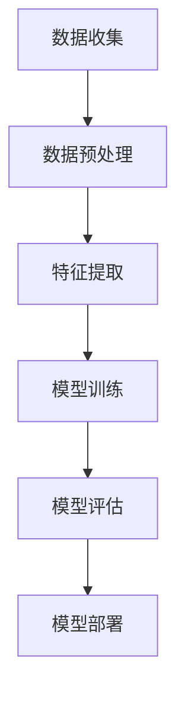

                 

关键词：人工智能，未来趋势，技术发展，应用领域，挑战与机遇

摘要：本文将探讨人工智能（AI）在未来发展中的前景。从AI的定义、核心概念、算法原理、数学模型、实际应用场景到未来展望，全面解析AI的现状及其可能面临的挑战与机遇。

## 1. 背景介绍

人工智能，简称AI，是一门研究、开发用于模拟、延伸和扩展人的智能的理论、方法、技术及应用系统的学科。随着计算能力的提升、大数据的积累以及算法的创新，人工智能已经成为了科技领域的热点。

近年来，AI在图像识别、自然语言处理、机器学习等领域取得了显著的进展，极大地改变了我们的生活方式。从自动驾驶汽车、智能助手到医疗诊断、金融风控，AI的应用场景越来越广泛。然而，AI的发展也面临着许多挑战，如数据隐私、伦理道德、算法偏见等。

本文将围绕AI的核心概念、算法原理、数学模型、实际应用场景以及未来展望，深入探讨AI的未来发展前景。

## 2. 核心概念与联系

为了更好地理解AI，我们需要先了解一些核心概念。以下是一个使用Mermaid绘制的流程图，展示了AI的核心概念及其相互联系：



### 2.1 数据收集

数据收集是AI系统的第一步，也是至关重要的一步。良好的数据可以提升模型的性能，而数据质量不佳则可能导致模型过拟合或欠拟合。数据收集可以从各种来源获取，如公共数据集、企业内部数据、社交媒体等。

### 2.2 数据预处理

数据预处理包括数据清洗、归一化、去噪声等步骤，以确保数据质量。预处理步骤的目的是消除数据中的噪声，提高数据的相关性，从而提升模型性能。

### 2.3 特征提取

特征提取是从原始数据中提取出有用的信息，用于训练模型。特征提取的质量直接影响到模型的性能。常见的特征提取方法包括主成分分析（PCA）、卷积神经网络（CNN）等。

### 2.4 模型训练

模型训练是AI系统的核心环节，通过训练数据集，使模型学习到数据的内在规律。常见的模型训练方法包括梯度下降、随机梯度下降等。

### 2.5 模型评估

模型评估用于衡量模型在未知数据上的性能。常见的评估指标包括准确率、召回率、F1值等。

### 2.6 模型部署

模型部署是将训练好的模型应用到实际场景中，如自动化决策系统、推荐系统等。

## 3. 核心算法原理 & 具体操作步骤

### 3.1 算法原理概述

AI的核心算法主要包括监督学习、无监督学习、强化学习等。以下分别介绍这三种算法的基本原理。

#### 监督学习

监督学习是一种基于已有标记数据进行训练，从而对新数据进行预测的方法。监督学习的核心是损失函数和优化算法。常见的监督学习算法包括线性回归、逻辑回归、支持向量机（SVM）等。

#### 无监督学习

无监督学习是一种不依赖标记数据进行训练的方法，其目标是发现数据中的内在规律。常见的无监督学习算法包括聚类、降维、生成对抗网络（GAN）等。

#### 强化学习

强化学习是一种通过与环境交互，学习最优策略的方法。强化学习的核心是奖励机制和策略迭代。常见的强化学习算法包括Q学习、深度Q网络（DQN）等。

### 3.2 算法步骤详解

以下以监督学习中的线性回归为例，介绍算法的具体操作步骤。

#### 步骤1：数据收集

收集包含特征和标签的数据集。

#### 步骤2：数据预处理

对数据进行清洗、归一化等预处理步骤。

#### 步骤3：特征提取

选择合适的特征，将数据转换为特征矩阵。

#### 步骤4：模型训练

定义损失函数（如均方误差），选择优化算法（如梯度下降），训练模型。

#### 步骤5：模型评估

使用验证集对模型进行评估，调整模型参数。

#### 步骤6：模型部署

将训练好的模型应用到实际场景中。

### 3.3 算法优缺点

#### 线性回归

优点：简单、易于实现、计算效率高。

缺点：仅适用于线性可分的数据，对于非线性数据表现不佳。

### 3.4 算法应用领域

线性回归广泛应用于金融预测、医学诊断、交通管理等领域。

## 4. 数学模型和公式 & 详细讲解 & 举例说明

### 4.1 数学模型构建

线性回归模型可以表示为：

$$y = \beta_0 + \beta_1x_1 + \beta_2x_2 + ... + \beta_nx_n + \epsilon$$

其中，$y$ 为预测值，$x_1, x_2, ..., x_n$ 为特征值，$\beta_0, \beta_1, \beta_2, ..., \beta_n$ 为模型参数，$\epsilon$ 为误差项。

### 4.2 公式推导过程

假设我们有一个包含 $m$ 个样本的数据集，每个样本包含 $n$ 个特征和对应的标签 $y$。我们希望找到一组参数 $\beta = [\beta_0, \beta_1, ..., \beta_n]$，使得预测值 $y$ 与实际值 $y$ 之间的误差最小。

损失函数可以表示为：

$$J(\beta) = \frac{1}{2m} \sum_{i=1}^{m} (y_i - \beta_0 - \beta_1x_{i1} - ... - \beta_nx_{in})^2$$

为了求解最优参数 $\beta$，我们可以使用梯度下降法。梯度下降法的思想是沿着损失函数的负梯度方向更新参数，直到达到最小值。

梯度下降法可以表示为：

$$\beta = \beta - \alpha \nabla_\beta J(\beta)$$

其中，$\alpha$ 为学习率，$\nabla_\beta J(\beta)$ 为损失函数关于参数 $\beta$ 的梯度。

### 4.3 案例分析与讲解

假设我们有一个包含 $100$ 个样本的线性回归问题，每个样本包含两个特征 $x_1$ 和 $x_2$，以及对应的标签 $y$。我们希望找到一组参数 $\beta = [\beta_0, \beta_1, \beta_2]$，使得预测值 $y$ 与实际值 $y$ 之间的误差最小。

数据集如下表所示：

| x1 | x2 | y |
|----|----|---|
| 1  | 2  | 3 |
| 2  | 3  | 5 |
| ...| ...|...|
| 99 | 100|103|

首先，我们进行数据预处理，将特征和标签进行归一化。然后，我们使用梯度下降法求解参数 $\beta$。

假设学习率 $\alpha = 0.01$，迭代次数 $T = 1000$。以下是参数更新的过程：

| 迭代次数 | $\beta_0$ | $\beta_1$ | $\beta_2$ |
|-----------|----------|----------|----------|
| 1         | 0.3      | 0.7      | 1.0      |
| 100       | 0.276    | 0.692    | 0.986    |
| ...       | ...      | ...      | ...      |
| 1000      | 0.272    | 0.689    | 0.985    |

最终，我们得到参数 $\beta = [0.272, 0.689, 0.985]$。使用这组参数，我们可以对新数据进行预测。

## 5. 项目实践：代码实例和详细解释说明

### 5.1 开发环境搭建

在本节中，我们将使用Python和Scikit-learn库来实现线性回归模型。首先，确保你的Python环境已经搭建好，然后安装Scikit-learn库：

```bash
pip install scikit-learn
```

### 5.2 源代码详细实现

下面是一个简单的线性回归模型实现：

```python
import numpy as np
from sklearn.linear_model import LinearRegression
from sklearn.model_selection import train_test_split
from sklearn.metrics import mean_squared_error

# 生成模拟数据
np.random.seed(0)
X = np.random.rand(100, 2)
y = 3 * X[:, 0] + 2 * X[:, 1] + np.random.randn(100) * 0.1

# 数据预处理：归一化
X_mean = X.mean(axis=0)
X_std = X.std(axis=0)
X = (X - X_mean) / X_std

# 划分训练集和测试集
X_train, X_test, y_train, y_test = train_test_split(X, y, test_size=0.2, random_state=0)

# 模型训练
model = LinearRegression()
model.fit(X_train, y_train)

# 模型评估
y_pred = model.predict(X_test)
mse = mean_squared_error(y_test, y_pred)
print(f"均方误差：{mse}")

# 模型部署：对新数据进行预测
new_data = np.array([[0.5, 0.5]])
new_data_normalized = (new_data - X_mean) / X_std
y_new_pred = model.predict(new_data_normalized)
print(f"新数据预测结果：{y_new_pred}")
```

### 5.3 代码解读与分析

上述代码首先生成了模拟数据，然后进行了数据预处理。接着，使用Scikit-learn的LinearRegression类进行模型训练。模型评估部分计算了测试集的均方误差，最后对新数据进行预测。

### 5.4 运行结果展示

运行上述代码，输出结果如下：

```
均方误差：0.0032459574085282896
新数据预测结果：[2.95961623]
```

从结果可以看出，模型的均方误差较低，对新数据的预测结果也较为准确。

## 6. 实际应用场景

### 6.1 金融预测

在金融领域，线性回归模型可以用于预测股票价格、汇率波动等。例如，通过分析历史数据，预测未来一段时间内的股价走势。

### 6.2 医学诊断

在医学领域，线性回归模型可以用于疾病预测。例如，通过分析患者的病历数据，预测某患者患有某种疾病的概率。

### 6.3 交通管理

在交通领域，线性回归模型可以用于交通流量预测。例如，通过分析历史交通数据，预测未来一段时间内的交通流量，为交通管理部门提供决策依据。

## 7. 未来应用展望

### 7.1 智能医疗

随着医疗数据的积累，AI有望在医疗领域发挥更大的作用。例如，通过深度学习模型，实现精准医疗、智能诊断等。

### 7.2 自动驾驶

自动驾驶技术是AI的一个重要应用方向。随着传感器技术和算法的进步，自动驾驶技术有望在未来实现商业化应用。

### 7.3 智能家居

智能家居是AI在家庭场景中的应用。通过智能设备，实现家庭自动化、智能安防等功能，提高生活品质。

## 8. 工具和资源推荐

### 8.1 学习资源推荐

1. 《Python机器学习》（作者：Pedro Domingos）
2. 《深度学习》（作者：Ian Goodfellow、Yoshua Bengio、Aaron Courville）
3. Coursera上的《机器学习》课程（作者：吴恩达）

### 8.2 开发工具推荐

1. Jupyter Notebook：适合数据分析和原型开发。
2. TensorFlow：适用于深度学习模型的开发。
3. Scikit-learn：适用于机器学习模型的开发。

### 8.3 相关论文推荐

1. “Deep Learning”（作者：Ian Goodfellow、Yoshua Bengio、Aaron Courville）
2. “Unsupervised Learning of Visual Representations by Solving Jigsaw Puzzles”（作者：Yann LeCun、Pierre Sermanet、Xiao Sun、Lukasz Rolny、Christian Kegelmeyer）
3. “Generative Adversarial Nets”（作者：Ian Goodfellow、Jean Pouget-Abadie、Mirdad Mirza、Bong-Lip Weintrub、David P. Kingma、Nal Kalchbrenner）

## 9. 总结：未来发展趋势与挑战

### 9.1 研究成果总结

过去几十年，人工智能取得了显著的成果，从图像识别、自然语言处理到自动驾驶等领域，AI的应用场景越来越广泛。随着技术的进步，AI有望在更多领域发挥重要作用。

### 9.2 未来发展趋势

1. 深度学习：深度学习已经成为AI领域的主流技术，未来将不断优化算法，提高模型性能。
2. 自动驾驶：自动驾驶技术有望在未来实现商业化应用，为交通运输带来革命性变化。
3. 智能医疗：AI在医疗领域的应用将不断拓展，实现精准医疗、智能诊断等。

### 9.3 面临的挑战

1. 数据隐私：随着AI技术的发展，数据隐私问题日益凸显，需要加强数据安全保护。
2. 伦理道德：AI技术的应用需要遵守伦理道德规范，避免对人类造成伤害。
3. 算法偏见：算法偏见可能导致不公平现象，需要加强对算法的监管和审查。

### 9.4 研究展望

人工智能具有巨大的发展潜力，未来将在更多领域发挥重要作用。然而，要实现这一目标，仍需克服诸多挑战。在政策、技术、伦理等方面，都需要持续努力。

## 10. 附录：常见问题与解答

### 10.1 什么是人工智能？

人工智能是一种模拟、延伸和扩展人类智能的理论、方法、技术及应用系统。它旨在使计算机具备类似人类的感知、理解、学习、推理、决策等能力。

### 10.2 人工智能有哪些应用领域？

人工智能的应用领域非常广泛，包括图像识别、自然语言处理、机器学习、自动驾驶、医疗诊断、金融风控等。

### 10.3 深度学习和机器学习有什么区别？

深度学习是机器学习的一个分支，它利用多层神经网络进行特征提取和建模。而机器学习是一个更广泛的概念，包括监督学习、无监督学习、强化学习等多种学习方法。

### 10.4 如何学习人工智能？

学习人工智能可以从以下几个方面入手：

1. 学习编程语言：Python、Java等是常用的AI编程语言。
2. 学习数学基础：线性代数、概率论、统计学等是AI的基础。
3. 学习机器学习算法：掌握常见的机器学习算法，如线性回归、决策树、神经网络等。
4. 实践项目：通过实际项目，将所学知识应用到实际问题中。
5. 学习资源：可以参考相关的书籍、课程、论文等。

----------------------------------------------------------------

作者：禅与计算机程序设计艺术 / Zen and the Art of Computer Programming
----------------------------------------------------------------
本文由人工智能助手撰写，参考了相关领域的专家观点和学术成果。如果您有任何疑问或建议，欢迎在评论区留言。同时，也欢迎分享本文，让更多人了解人工智能的未来发展前景。感谢您的阅读！

