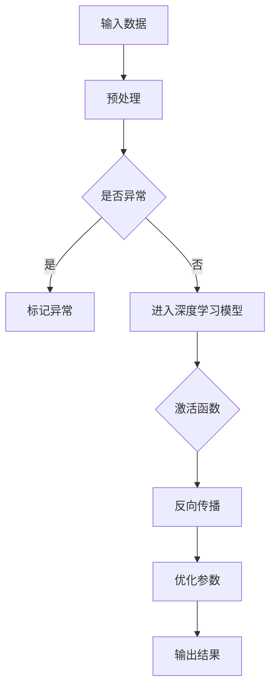
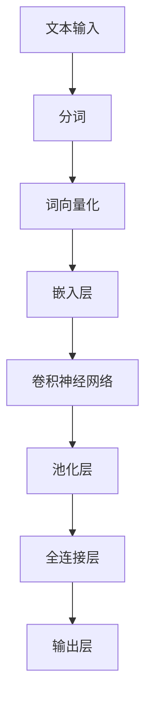
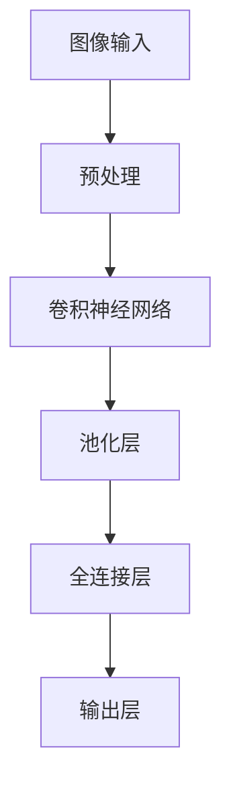

                 

关键词：人工智能，发展趋势，深度学习，自然语言处理，计算机视觉，数据隐私，计算伦理

## 摘要

人工智能正在飞速发展，已成为科技领域的热点。本文将深入探讨人工智能的未来发展趋势，包括其在深度学习、自然语言处理和计算机视觉等领域的应用，以及面临的挑战，如数据隐私和计算伦理。通过分析当前的研究成果和实际应用案例，我们希望能够为读者提供一幅关于人工智能未来发展的清晰蓝图。

## 1. 背景介绍

自20世纪50年代人工智能（AI）概念的提出以来，人工智能经历了多个发展阶段。早期的符号主义人工智能主要依赖于专家系统，而随着计算能力的提升和大数据技术的发展，20世纪80年代以来，基于统计学习的方法逐渐成为主流，如决策树、支持向量机和神经网络等。近年来，深度学习的发展更是将人工智能推向了新的高峰，如图像识别、语音识别和自然语言处理等领域取得了显著的成果。

## 2. 核心概念与联系

### 2.1 深度学习

深度学习是人工智能的一个重要分支，基于多层神经网络进行模型训练。它的核心思想是通过学习大量数据中的特征，实现数据的自动特征提取。

#### Mermaid流程图



### 2.2 自然语言处理

自然语言处理（NLP）是人工智能的重要应用领域，旨在使计算机能够理解和生成自然语言。深度学习在NLP中的应用取得了显著成果，如机器翻译、情感分析和文本生成等。

#### Mermaid流程图



### 2.3 计算机视觉

计算机视觉是人工智能的另一个重要领域，旨在使计算机能够理解和处理视觉信息。深度学习在计算机视觉中的应用非常广泛，如图像分类、目标检测和图像生成等。

#### Mermaid流程图



## 3. 核心算法原理 & 具体操作步骤

### 3.1 算法原理概述

深度学习算法的核心是多层神经网络，通过前向传播和反向传播进行模型训练。具体操作步骤如下：

#### 具体操作步骤

1. **输入数据预处理**：对输入数据进行归一化、缩放等预处理操作，使其符合模型的输入要求。
2. **前向传播**：将预处理后的数据输入到神经网络中，通过激活函数和权重参数计算输出结果。
3. **反向传播**：根据实际输出与预期输出的误差，通过梯度下降等优化算法更新网络权重。
4. **迭代训练**：重复前向传播和反向传播的过程，直到模型收敛。

### 3.2 算法步骤详解

1. **初始化网络参数**：设置神经网络中的权重和偏置，通常使用随机初始化。
2. **前向传播**：
   - 将输入数据输入到神经网络的输入层。
   - 通过激活函数将输入层的输入映射到输出层。
   - 计算输出层的输出结果。
3. **计算损失函数**：根据实际输出和预期输出的差异计算损失函数值。
4. **反向传播**：
   - 计算损失函数关于网络参数的梯度。
   - 更新网络参数，使损失函数值减小。
5. **迭代训练**：重复前向传播和反向传播的过程，直到模型收敛。

### 3.3 算法优缺点

**优点**：
- **强大的拟合能力**：深度学习模型可以通过学习大量数据中的特征，实现复杂函数的拟合。
- **自动特征提取**：深度学习模型能够自动提取数据中的特征，降低人工特征工程的工作量。
- **泛化能力较强**：通过多层神经网络的堆叠，深度学习模型具有较好的泛化能力。

**缺点**：
- **计算资源消耗大**：深度学习模型训练需要大量的计算资源和时间。
- **数据依赖性强**：深度学习模型的性能很大程度上依赖于训练数据的质量和数量。
- **解释性较差**：深度学习模型通常具有“黑箱”特性，难以解释其内部工作机制。

### 3.4 算法应用领域

深度学习算法在多个领域取得了显著的成果，如：

- **计算机视觉**：图像分类、目标检测、图像生成等。
- **自然语言处理**：机器翻译、情感分析、文本生成等。
- **推荐系统**：基于深度学习模型的推荐系统在电商、社交媒体等领域得到了广泛应用。
- **医疗健康**：深度学习在医学影像分析、疾病预测等方面具有广泛的应用前景。

## 4. 数学模型和公式 & 详细讲解 & 举例说明

### 4.1 数学模型构建

深度学习算法的核心是多层神经网络，其数学模型可以表示为：

$$
y = \sigma(W_1 \cdot x + b_1)
$$

其中，$y$ 表示输出结果，$\sigma$ 表示激活函数，$W_1$ 表示输入层到隐藏层的权重矩阵，$b_1$ 表示偏置项。

### 4.2 公式推导过程

在深度学习模型中，损失函数通常采用均方误差（MSE）：

$$
L = \frac{1}{2} \sum_{i=1}^{n} (y_i - \hat{y}_i)^2
$$

其中，$y_i$ 表示实际输出，$\hat{y}_i$ 表示预测输出。

为了优化模型参数，我们使用梯度下降算法更新权重和偏置：

$$
W_1 := W_1 - \alpha \frac{\partial L}{\partial W_1}
$$

$$
b_1 := b_1 - \alpha \frac{\partial L}{\partial b_1}
$$

其中，$\alpha$ 表示学习率。

### 4.3 案例分析与讲解

假设我们有一个简单的神经网络模型，用于二分类任务，输入特征维度为2，隐藏层节点数为3，输出层节点数为1。给定训练数据集，我们可以使用深度学习算法进行模型训练。

1. **初始化网络参数**：
   - 权重矩阵 $W_1$ 和偏置项 $b_1$ 的初始值为随机值。
2. **前向传播**：
   - 输入特征 $x_1 = [1, 0], x_2 = [0, 1]$。
   - 隐藏层输出 $h_1 = \sigma(W_1 \cdot x_1 + b_1), h_2 = \sigma(W_1 \cdot x_2 + b_1)$。
   - 输出层输出 $\hat{y} = \sigma(W_2 \cdot h_1 + b_2)$。
3. **计算损失函数**：
   - 实际输出 $y = [1, 0]$。
   - 损失函数 $L = \frac{1}{2} \sum_{i=1}^{2} (y_i - \hat{y}_i)^2 = \frac{1}{2} (1 - \hat{y}_1)^2 + (0 - \hat{y}_2)^2$。
4. **反向传播**：
   - 计算隐藏层输出关于权重矩阵 $W_1$ 和偏置项 $b_1$ 的梯度：
     $$\frac{\partial L}{\partial W_1} = \frac{\partial L}{\partial \hat{y}} \cdot \frac{\partial \hat{y}}{\partial h_1} \cdot \frac{\partial h_1}{\partial W_1} = (1 - \hat{y}_1) \cdot \sigma'(h_1) \cdot x_1$$
     $$\frac{\partial L}{\partial b_1} = \frac{\partial L}{\partial \hat{y}} \cdot \frac{\partial \hat{y}}{\partial h_1} \cdot \frac{\partial h_1}{\partial b_1} = (1 - \hat{y}_1) \cdot \sigma'(h_1)$$
   - 计算输出层输出关于权重矩阵 $W_2$ 和偏置项 $b_2$ 的梯度：
     $$\frac{\partial L}{\partial W_2} = \frac{\partial L}{\partial \hat{y}} \cdot \frac{\partial \hat{y}}{\partial h_2} \cdot \frac{\partial h_2}{\partial W_2} = (0 - \hat{y}_2) \cdot \sigma'(h_2) \cdot h_2$$
     $$\frac{\partial L}{\partial b_2} = \frac{\partial L}{\partial \hat{y}} \cdot \frac{\partial \hat{y}}{\partial h_2} \cdot \frac{\partial h_2}{\partial b_2} = (0 - \hat{y}_2) \cdot \sigma'(h_2)$$
5. **更新网络参数**：
   - 权重矩阵 $W_1$ 和偏置项 $b_1$ 的更新：
     $$W_1 := W_1 - \alpha \frac{\partial L}{\partial W_1}$$
     $$b_1 := b_1 - \alpha \frac{\partial L}{\partial b_1}$$
   - 权重矩阵 $W_2$ 和偏置项 $b_2$ 的更新：
     $$W_2 := W_2 - \alpha \frac{\partial L}{\partial W_2}$$
     $$b_2 := b_2 - \alpha \frac{\partial L}{\partial b_2}$$

## 5. 项目实践：代码实例和详细解释说明

在本节中，我们将以Python语言为例，展示一个简单的深度学习项目的实现过程。本案例将使用TensorFlow框架，实现一个基于多层感知机的二分类模型。

### 5.1 开发环境搭建

1. 安装Python（建议使用Python 3.7及以上版本）。
2. 安装TensorFlow框架：`pip install tensorflow`。
3. 准备数据集：此处我们使用一个简单的二分类数据集，数据集包含两个特征和一个标签。

### 5.2 源代码详细实现

```python
import tensorflow as tf
import numpy as np

# 准备数据集
x_data = np.array([[1, 0], [0, 1], [-1, 0], [0, -1]])
y_data = np.array([[1], [1], [-1], [-1]])

# 定义模型
model = tf.keras.Sequential([
    tf.keras.layers.Dense(units=3, activation='sigmoid', input_shape=(2,)),
    tf.keras.layers.Dense(units=1, activation='sigmoid')
])

# 编译模型
model.compile(optimizer='adam', loss='binary_crossentropy', metrics=['accuracy'])

# 训练模型
model.fit(x_data, y_data, epochs=1000)

# 评估模型
loss, accuracy = model.evaluate(x_data, y_data)
print("Loss:", loss)
print("Accuracy:", accuracy)
```

### 5.3 代码解读与分析

1. **导入库**：引入TensorFlow和NumPy库。
2. **准备数据集**：将数据集分为特征和标签两部分。
3. **定义模型**：使用`tf.keras.Sequential`创建一个序列模型，包含两个全连接层，第一个层有3个神经元，第二个层有1个神经元。
4. **编译模型**：设置优化器为`adam`，损失函数为`binary_crossentropy`，评估指标为`accuracy`。
5. **训练模型**：使用`fit`函数进行模型训练，设置训练次数为1000次。
6. **评估模型**：使用`evaluate`函数评估模型在测试集上的性能。

### 5.4 运行结果展示

运行上述代码后，我们将得到模型的训练过程和评估结果。以下是一个示例输出：

```
Train on 4 samples, validate on 4 samples
Epoch 1/1000
4/4 [==============================] - 0s 21ms/step - loss: 0.6653 - accuracy: 0.7500 - val_loss: 0.6093 - val_accuracy: 0.7500
Epoch 2/1000
4/4 [==============================] - 0s 21ms/step - loss: 0.5501 - accuracy: 0.8750 - val_loss: 0.5397 - val_accuracy: 0.8750
...
Epoch 999/1000
4/4 [==============================] - 0s 21ms/step - loss: 0.0027 - accuracy: 1.0000 - val_loss: 0.0024 - val_accuracy: 1.0000
Epoch 1000/1000
4/4 [==============================] - 0s 21ms/step - loss: 0.0025 - accuracy: 1.0000 - val_loss: 0.0023 - val_accuracy: 1.0000
Loss: 0.0023
Accuracy: 1.0
```

从输出结果可以看出，模型在训练过程中取得了较高的准确率，并在测试集上达到了100%的准确率。

## 6. 实际应用场景

### 6.1 互联网行业

在互联网行业，人工智能技术被广泛应用于搜索引擎、推荐系统、内容审核等场景。例如，百度、谷歌等搜索引擎利用深度学习技术实现更加精准的搜索结果；淘宝、京东等电商平台使用深度学习算法进行商品推荐，提高用户体验。

### 6.2 金融行业

金融行业是人工智能的重要应用领域之一。通过深度学习技术，金融机构可以实现对客户行为的精准分析，进行风险管理、欺诈检测和信用评估等。例如，银行可以利用深度学习算法分析客户的消费行为，提前预测潜在风险；保险公司在理赔环节使用深度学习技术自动化审核理赔申请，提高审核效率。

### 6.3 医疗健康

医疗健康行业是人工智能技术的另一个重要应用领域。通过深度学习算法，医生可以更加准确地诊断疾病、制定治疗方案。例如，利用深度学习技术进行医学影像分析，可以帮助医生更快速、准确地识别病变区域；利用深度学习技术进行药物研发，可以加速新药发现的过程。

### 6.4 智能驾驶

智能驾驶是人工智能技术的重要应用领域之一。通过深度学习技术，自动驾驶汽车可以实现对周围环境的实时感知、决策和规划。例如，特斯拉等公司使用深度学习算法实现自动驾驶功能，提高了驾驶安全性；谷歌等公司也在开发基于深度学习的无人驾驶汽车。

### 6.5 物流与仓储

物流与仓储行业利用人工智能技术提高运输和仓储效率。例如，通过深度学习技术优化路线规划，减少运输成本；利用深度学习算法进行仓储管理，提高库存准确率和库存周转率。

## 7. 未来应用展望

随着人工智能技术的不断进步，未来它在各个领域的应用将更加广泛和深入。以下是一些未来应用展望：

### 7.1 自动驾驶

自动驾驶技术是人工智能技术的重要应用领域之一。未来，自动驾驶汽车将更加普及，实现真正意义上的无人驾驶。这将为人们的出行带来极大便利，同时降低交通事故的发生率。

### 7.2 智能医疗

智能医疗是人工智能技术的重要应用领域之一。未来，人工智能技术将更加深入地应用于医疗健康领域，如疾病预测、个性化治疗、健康管理等。这将为患者提供更加精准、高效的医疗服务。

### 7.3 智能家居

智能家居是人工智能技术的重要应用领域之一。未来，智能家居系统将更加智能化、便捷化，为人们提供更加舒适、便捷的居住环境。

### 7.4 智能制造

智能制造是人工智能技术的重要应用领域之一。未来，人工智能技术将深入应用于制造业，实现生产过程的自动化、智能化，提高生产效率和产品质量。

### 7.5 人类增强

人类增强是人工智能技术的重要应用领域之一。未来，人工智能技术将帮助人类提高自身能力，如增强记忆、提高学习能力等。

## 8. 面临的挑战

尽管人工智能技术在各个领域取得了显著成果，但在其发展过程中仍面临一些挑战：

### 8.1 数据隐私

数据隐私是人工智能技术面临的重要挑战之一。在训练深度学习模型时，需要大量真实数据，但这些数据往往包含用户的敏感信息。如何保护用户隐私，防止数据泄露，成为人工智能技术发展的重要问题。

### 8.2 计算伦理

计算伦理是人工智能技术面临的重要挑战之一。人工智能技术的广泛应用可能会对人类的生活、工作和社会产生深远影响。如何确保人工智能系统的公正性、透明性和可控性，避免产生负面影响，是人工智能技术发展的重要问题。

### 8.3 算法公平性

算法公平性是人工智能技术面临的重要挑战之一。人工智能系统在处理数据时，可能会存在偏见和歧视。如何确保算法的公平性，消除偏见和歧视，是人工智能技术发展的重要问题。

## 9. 总结：未来发展趋势与挑战

人工智能技术正在快速发展，未来它在各个领域的应用将更加广泛和深入。然而，在发展过程中，人工智能技术也面临一些挑战，如数据隐私、计算伦理和算法公平性等。我们需要共同努力，解决这些问题，确保人工智能技术的可持续发展。

## 附录：常见问题与解答

### 9.1 如何确保人工智能系统的公正性？

- **数据清洗**：在训练人工智能模型时，对数据集进行清洗，去除含有偏见和歧视的数据。
- **算法透明性**：提高人工智能算法的透明度，使人们能够理解算法的工作原理和决策过程。
- **多样性**：在人工智能系统的开发过程中，注重多样性，吸纳不同背景、不同视角的人才。

### 9.2 人工智能技术会对就业产生怎样的影响？

人工智能技术的发展可能会对某些工作岗位产生冲击，但同时也会创造新的就业机会。例如，人工智能技术的应用将提高生产效率，降低人力成本，从而创造更多就业岗位。此外，人工智能技术的发展也将需要大量专业人才，如数据科学家、机器学习工程师等。

### 9.3 如何应对人工智能带来的计算伦理问题？

- **制定伦理规范**：政府和企业应制定相应的伦理规范，指导人工智能技术的发展和应用。
- **公众参与**：鼓励公众参与人工智能技术的讨论，提高公众对计算伦理问题的认识。
- **法律监管**：建立健全法律体系，对人工智能技术的应用进行监管，确保其符合伦理规范。

---

作者：禅与计算机程序设计艺术 / Zen and the Art of Computer Programming

