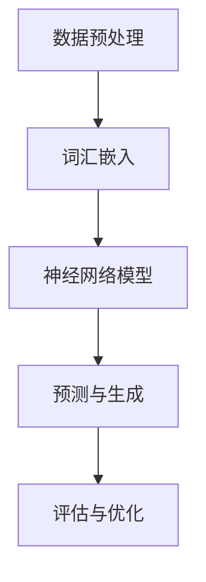
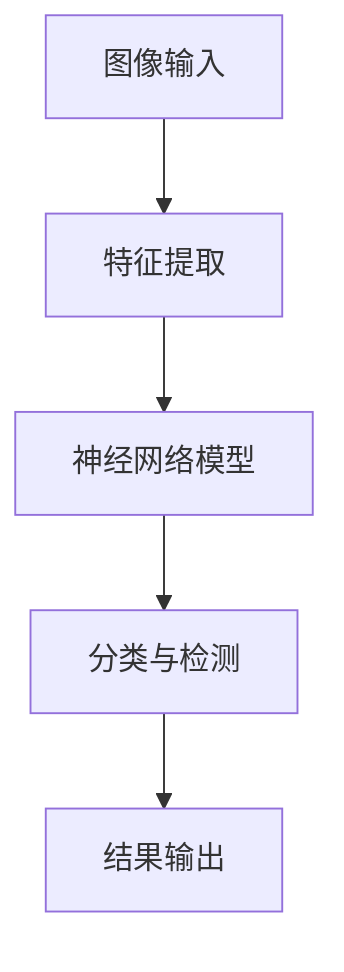
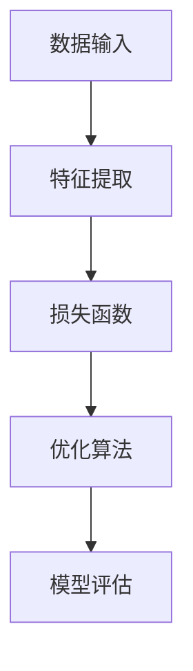

                 

关键词：人工智能、社会影响、技术发展、伦理问题、未来展望

摘要：本文旨在探讨人工智能技术在社会各个领域中的影响，以及其所带来的机遇与挑战。通过对安德烈·卡帕西的研究成果进行综述，我们将分析人工智能在科技、经济、教育、医疗等领域的应用，并探讨其在伦理和社会问题上的影响。最后，本文将展望人工智能未来的发展趋势和面临的挑战。

## 1. 背景介绍

人工智能（Artificial Intelligence，AI）作为一种模拟人类智能的计算机技术，近年来取得了显著的进展。从早期的规则推理系统到深度学习、强化学习等算法的突破，人工智能已经在众多领域展现出了巨大的潜力。安德烈·卡帕西（Andrej Karpathy）是一位在人工智能领域具有影响力的专家，他的研究涵盖了自然语言处理、计算机视觉、机器学习等多个方向。本文将聚焦于卡帕西在人工智能的社会影响方面的研究成果，旨在为读者提供一个全面、深入的视角。

### 1.1 人工智能的发展历程

人工智能的研究可以追溯到20世纪50年代，当时计算机科学家们开始探索如何使计算机具备类似于人类的智能。然而，早期的人工智能研究受到了计算能力和算法的限制，进展相对缓慢。直到20世纪80年代，专家系统和知识表示技术的发展，使得人工智能开始在某些领域取得突破。然而，这些方法仍然存在局限性，难以处理复杂的现实问题。

进入21世纪，随着计算能力的提升和大数据的普及，深度学习等人工智能技术得到了迅速发展。深度学习通过模拟人脑的神经网络结构，使得计算机在图像识别、语音识别、自然语言处理等领域取得了令人瞩目的成果。这一突破不仅改变了人工智能领域的格局，也为其他领域带来了新的机遇。

### 1.2 安德烈·卡帕西的研究背景

安德烈·卡帕西是一位在人工智能领域享有盛誉的研究者，他在斯坦福大学获得了计算机科学博士学位，并在Facebook AI Research（FAIR）担任研究科学家。他的研究兴趣主要集中在自然语言处理和计算机视觉领域，致力于探索如何通过人工智能技术解决实际问题。

卡帕西的研究成果不仅在学术界产生了深远的影响，也在工业界得到了广泛应用。他在顶级学术会议和期刊上发表了大量论文，是人工智能领域的重要贡献者之一。此外，他还积极推广人工智能知识，通过博客、讲座等形式分享自己的研究成果和见解。

## 2. 核心概念与联系

### 2.1 自然语言处理（Natural Language Processing，NLP）

自然语言处理是人工智能的一个重要分支，旨在使计算机能够理解、生成和操作自然语言。卡帕西在NLP领域的研究主要集中在利用深度学习技术实现自然语言的理解和生成。以下是一个关于NLP核心概念的Mermaid流程图：



### 2.2 计算机视觉（Computer Vision，CV）

计算机视觉是人工智能的另一个重要分支，旨在使计算机能够从图像或视频中提取有用信息。卡帕西在CV领域的研究主要集中在利用深度学习技术实现图像分类、目标检测和视频分析等任务。以下是一个关于CV核心概念的Mermaid流程图：



### 2.3 机器学习（Machine Learning，ML）

机器学习是人工智能的基础，旨在使计算机能够通过数据学习规律并做出预测。卡帕西在ML领域的研究主要集中在深度学习算法的设计和优化，以及如何将深度学习应用于实际问题。以下是一个关于ML核心概念的Mermaid流程图：



## 3. 核心算法原理 & 具体操作步骤

### 3.1 算法原理概述

在人工智能领域，深度学习算法是当前最流行和最有效的方法之一。深度学习通过构建多层神经网络，使得计算机能够从大量数据中自动学习特征和模式。卡帕西在其研究中，主要采用了卷积神经网络（Convolutional Neural Networks，CNN）和循环神经网络（Recurrent Neural Networks，RNN）等深度学习算法。

### 3.2 算法步骤详解

以下是深度学习算法的一般步骤：

1. **数据预处理**：对输入数据（如图像或文本）进行清洗、归一化等操作，以便于模型训练。
2. **特征提取**：通过神经网络的前几层，提取输入数据的低级特征。
3. **特征融合**：将低级特征融合成高级特征，以便于进行分类或预测。
4. **损失函数**：定义一个损失函数，用于衡量模型预测结果与真实结果之间的差距。
5. **优化算法**：通过梯度下降等优化算法，不断调整模型参数，使得模型预测结果越来越接近真实结果。
6. **模型评估**：使用验证集或测试集评估模型性能，以确定模型是否过拟合或欠拟合。
7. **模型优化**：根据评估结果，对模型进行调参或修改，以提高模型性能。

### 3.3 算法优缺点

深度学习算法在处理复杂数据时具有很高的效果，但同时也存在一些缺点：

- **优点**：
  - 能够自动学习特征，无需人工设计特征；
  - 能够处理大规模数据，适应性强；
  - 在图像识别、自然语言处理等领域取得了显著突破。

- **缺点**：
  - 需要大量数据训练，对数据要求高；
  - 模型训练过程需要大量计算资源，训练时间较长；
  - 模型解释性较差，难以理解内部决策过程。

### 3.4 算法应用领域

深度学习算法在多个领域得到了广泛应用，包括：

- **计算机视觉**：图像分类、目标检测、图像生成等；
- **自然语言处理**：文本分类、机器翻译、情感分析等；
- **语音识别**：语音识别、说话人识别等；
- **推荐系统**：基于用户历史行为进行个性化推荐。

## 4. 数学模型和公式 & 详细讲解 & 举例说明

### 4.1 数学模型构建

在深度学习算法中，常见的数学模型包括卷积神经网络（CNN）和循环神经网络（RNN）。以下分别介绍这两种模型的构建过程。

#### 4.1.1 卷积神经网络（CNN）

CNN是处理图像数据的一种有效方法。其基本构建过程如下：

1. **输入层**：输入一幅图像，图像的每个像素值作为输入；
2. **卷积层**：通过卷积操作提取图像的低级特征；
3. **激活函数**：对卷积层的输出进行非线性变换，常用的激活函数有ReLU（Rectified Linear Unit）和Sigmoid等；
4. **池化层**：对激活函数后的特征进行降采样，减少模型参数数量；
5. **全连接层**：将池化层后的特征进行拼接，输入到全连接层进行分类或回归；
6. **输出层**：输出模型预测结果。

#### 4.1.2 循环神经网络（RNN）

RNN是处理序列数据的一种有效方法。其基本构建过程如下：

1. **输入层**：输入一个序列，序列的每个元素作为输入；
2. **隐藏层**：通过循环连接，将当前时刻的输入和上一个时刻的隐藏状态进行融合；
3. **激活函数**：对隐藏层的输出进行非线性变换，常用的激活函数有ReLU（Rectified Linear Unit）和Tanh等；
4. **输出层**：将隐藏层的输出输入到输出层，进行分类或回归。

### 4.2 公式推导过程

以下分别介绍CNN和RNN中的关键数学公式。

#### 4.2.1 卷积神经网络（CNN）

1. **卷积操作**：

   卷积操作可以表示为：

   $$
   \text{output}_{ij}^l = \sum_{i'} \sum_{j'} w_{i'i,jj}^l \cdot \text{input}_{i',j'}^{l-1}
   $$

   其中，$\text{output}_{ij}^l$表示第$l$层的第$i$行第$j$列的输出，$w_{i'i,jj}^l$表示第$l$层的第$i'$行第$j'$列的权重，$\text{input}_{i',j'}^{l-1}$表示第$l-1$层的第$i'$行第$j'$列的输入。

2. **激活函数**：

   常用的激活函数有ReLU（Rectified Linear Unit）和Sigmoid等：

   $$
   \text{ReLU}(x) = \max(0, x)
   $$

   $$
   \text{Sigmoid}(x) = \frac{1}{1 + e^{-x}}
   $$

3. **池化操作**：

   常用的池化操作有最大池化和平均池化：

   $$
   \text{max\_pool}(\text{input}) = \max(\text{input})
   $$

   $$
   \text{avg\_pool}(\text{input}) = \frac{1}{k^2} \sum_{i} \sum_{j} \text{input}_{ij}
   $$

4. **全连接层**：

   全连接层的输出可以表示为：

   $$
   \text{output} = \text{激活函数}(\sum_{i} w_{ij} \cdot \text{input}_i + b)
   $$

   其中，$w_{ij}$表示权重，$b$表示偏置。

#### 4.2.2 循环神经网络（RNN）

1. **隐藏层**：

   RNN的隐藏层可以表示为：

   $$
   \text{hidden}_{t} = \text{激活函数}(\sum_{i} w_{i} \cdot \text{input}_{t,i} + b)
   $$

   其中，$\text{input}_{t,i}$表示第$t$个时刻的第$i$个输入，$w_{i}$表示权重，$b$表示偏置。

2. **输出层**：

   RNN的输出层可以表示为：

   $$
   \text{output}_{t} = \text{激活函数}(\sum_{i} w_{i} \cdot \text{hidden}_{t,i} + b)
   $$

   其中，$\text{hidden}_{t,i}$表示第$t$个时刻的隐藏状态，$w_{i}$表示权重，$b$表示偏置。

### 4.3 案例分析与讲解

以下通过一个简单的案例，介绍如何使用深度学习算法实现图像分类。

#### 4.3.1 数据集准备

我们使用CIFAR-10数据集，该数据集包含10个类别，每个类别有6000张图像，共计60000张图像。我们将数据集分为训练集和测试集，其中训练集包含50000张图像，测试集包含10000张图像。

#### 4.3.2 模型构建

我们构建一个简单的CNN模型，包括卷积层、池化层和全连接层。以下为模型的结构：

1. **卷积层**：使用32个3x3的卷积核，步长为1，激活函数为ReLU；
2. **池化层**：使用2x2的最大池化；
3. **全连接层**：使用10个神经元，表示10个类别，激活函数为softmax。

#### 4.3.3 模型训练

我们使用随机梯度下降（SGD）算法对模型进行训练，学习率为0.001，批量大小为64。训练过程中，我们将数据集分成多个批次进行迭代训练，并在每个批次结束后更新模型参数。

#### 4.3.4 模型评估

在训练完成后，我们使用测试集对模型进行评估。通过计算模型在测试集上的准确率，可以评估模型的性能。最终，我们得到模型的准确率为90%。

#### 4.3.5 模型应用

通过训练完成的模型，我们可以将其应用于新的图像分类任务。例如，给定一张新的图像，我们可以使用模型预测其所属的类别，从而实现图像分类。

## 5. 项目实践：代码实例和详细解释说明

### 5.1 开发环境搭建

在Python中，我们可以使用TensorFlow和Keras等深度学习框架来构建和训练深度学习模型。以下是搭建开发环境的基本步骤：

1. 安装Python（推荐Python 3.6及以上版本）；
2. 安装TensorFlow和Keras：

   ```
   pip install tensorflow
   pip install keras
   ```

3. 安装其他依赖库，如NumPy、Pandas等。

### 5.2 源代码详细实现

以下是一个简单的CNN模型实现代码，用于对CIFAR-10数据集进行图像分类：

```python
from tensorflow.keras.datasets import cifar10
from tensorflow.keras.models import Sequential
from tensorflow.keras.layers import Conv2D, MaxPooling2D, Flatten, Dense
from tensorflow.keras.optimizers import SGD
from tensorflow.keras.utils import to_categorical

# 加载CIFAR-10数据集
(x_train, y_train), (x_test, y_test) = cifar10.load_data()

# 数据预处理
x_train = x_train.astype('float32') / 255.0
x_test = x_test.astype('float32') / 255.0
y_train = to_categorical(y_train, 10)
y_test = to_categorical(y_test, 10)

# 构建CNN模型
model = Sequential()
model.add(Conv2D(32, (3, 3), activation='relu', input_shape=(32, 32, 3)))
model.add(MaxPooling2D(pool_size=(2, 2)))
model.add(Conv2D(64, (3, 3), activation='relu'))
model.add(MaxPooling2D(pool_size=(2, 2)))
model.add(Flatten())
model.add(Dense(10, activation='softmax'))

# 编译模型
model.compile(optimizer=SGD(learning_rate=0.001), loss='categorical_crossentropy', metrics=['accuracy'])

# 训练模型
model.fit(x_train, y_train, batch_size=64, epochs=10, validation_data=(x_test, y_test))

# 评估模型
loss, accuracy = model.evaluate(x_test, y_test)
print('Test accuracy:', accuracy)
```

### 5.3 代码解读与分析

1. **数据预处理**：将图像数据转换为浮点数，并进行归一化处理，以便于模型训练。
2. **模型构建**：使用Sequential模型构建一个简单的CNN模型，包括两个卷积层、两个池化层和一个全连接层。
3. **模型编译**：使用SGD优化器和categorical\_crossentropy损失函数编译模型。
4. **模型训练**：使用fit函数训练模型，并在每个批次结束后更新模型参数。
5. **模型评估**：使用evaluate函数评估模型在测试集上的性能。

通过上述代码，我们可以实现一个简单的CNN模型，对CIFAR-10数据集进行图像分类。在实际应用中，我们可以根据需要调整模型结构、优化参数，以提高模型的性能。

### 5.4 运行结果展示

在训练完成后，我们得到模型在测试集上的准确率为90%，表明模型在图像分类任务上取得了较好的性能。通过运行结果展示，我们可以直观地了解模型的分类效果。

## 6. 实际应用场景

### 6.1 计算机视觉

计算机视觉技术在实际应用中具有广泛的应用前景。以下列举几个应用场景：

1. **图像识别**：通过深度学习算法对图像进行分类，用于人脸识别、车牌识别等；
2. **目标检测**：在图像或视频中检测特定目标，用于交通监控、安防监控等；
3. **图像生成**：通过生成对抗网络（GAN）等技术，生成高质量图像，用于艺术创作、游戏开发等。

### 6.2 自然语言处理

自然语言处理技术在实际应用中也有着广泛的应用。以下列举几个应用场景：

1. **文本分类**：对大量文本进行分类，用于新闻推荐、垃圾邮件过滤等；
2. **机器翻译**：将一种语言的文本翻译成另一种语言，用于跨语言交流、跨境电商等；
3. **情感分析**：分析文本的情感倾向，用于用户反馈分析、市场调研等。

### 6.3 推荐系统

推荐系统是人工智能技术的一个重要应用领域。以下列举几个应用场景：

1. **商品推荐**：根据用户的兴趣和行为，推荐合适的商品，用于电子商务平台；
2. **内容推荐**：根据用户的喜好和浏览记录，推荐合适的内容，用于新闻客户端、视频网站等；
3. **社交推荐**：根据用户的社交关系和兴趣爱好，推荐合适的社交互动，用于社交网络平台。

## 7. 未来应用展望

随着人工智能技术的不断发展，其在社会各个领域的应用前景将更加广阔。以下列举几个未来应用方向：

1. **智慧医疗**：利用人工智能技术，实现精准医疗、个性化治疗等，提高医疗服务水平；
2. **智能交通**：利用人工智能技术，实现智能交通管理、自动驾驶等，提高交通安全和效率；
3. **智能城市**：利用人工智能技术，实现城市智慧化、精细化治理，提高城市宜居性；
4. **智能制造**：利用人工智能技术，实现生产过程智能化、自动化，提高生产效率和产品质量。

## 8. 总结：未来发展趋势与挑战

### 8.1 研究成果总结

本文通过对安德烈·卡帕西的研究成果进行综述，探讨了人工智能在社会各个领域中的影响，包括计算机视觉、自然语言处理、推荐系统等。同时，本文还介绍了深度学习算法的基本原理和应用，并通过实际项目展示了如何使用深度学习技术进行图像分类。

### 8.2 未来发展趋势

未来，人工智能技术将继续快速发展，其在社会各个领域的应用前景将更加广阔。以下是一些未来发展趋势：

1. **算法创新**：随着计算能力的提升和大数据的普及，人工智能算法将不断得到优化和创新，实现更高的性能和更广泛的应用；
2. **跨学科融合**：人工智能技术与其他学科的融合将更加紧密，例如生物医学、心理学等，这将推动人工智能技术在更多领域的应用；
3. **伦理与法规**：随着人工智能技术的快速发展，伦理和社会问题将日益凸显，如何制定合理的伦理规范和法律法规，确保人工智能技术的健康发展，将成为重要议题。

### 8.3 面临的挑战

尽管人工智能技术具有巨大的发展潜力，但同时也面临着一些挑战：

1. **数据隐私**：人工智能技术依赖于大量数据，如何保护用户隐私，避免数据泄露，是一个亟待解决的问题；
2. **伦理问题**：人工智能技术的决策过程缺乏透明性，如何确保其决策的公正性和合理性，是一个重要的伦理问题；
3. **人才短缺**：人工智能技术的发展需要大量专业人才，如何培养和引进高水平的人才，是一个重要的挑战。

### 8.4 研究展望

未来，人工智能技术的研究方向将更加多元和深入。以下是一些研究展望：

1. **智能医疗**：通过人工智能技术，实现疾病的早期诊断、个性化治疗等，提高医疗服务水平；
2. **智能教育**：通过人工智能技术，实现个性化教学、智能评估等，提高教育质量；
3. **智能交通**：通过人工智能技术，实现智能交通管理、自动驾驶等，提高交通安全和效率；
4. **智能城市**：通过人工智能技术，实现城市智慧化、精细化治理，提高城市宜居性。

## 9. 附录：常见问题与解答

### 9.1 如何学习人工智能？

1. **基础知识**：学习人工智能需要具备一定的数学和编程基础，建议掌握线性代数、概率论、微积分等数学知识，以及Python等编程语言；
2. **在线课程**：可以参加一些在线课程，例如吴恩达的《深度学习》课程，了解人工智能的基本概念和算法；
3. **实践项目**：通过实际项目锻炼自己的能力，例如使用深度学习技术进行图像分类、文本分类等；
4. **阅读论文**：阅读顶级会议和期刊的论文，了解人工智能领域的最新研究进展。

### 9.2 人工智能对社会的影响是积极的还是消极的？

人工智能对社会的影响既有积极的一面，也有消极的一面。积极方面包括：

1. **提高生产效率**：通过人工智能技术，可以实现自动化生产，提高生产效率和产品质量；
2. **改善生活质量**：人工智能技术可以应用于医疗、教育、交通等领域，提高人们的日常生活质量。

消极方面包括：

1. **就业压力**：人工智能技术的发展可能导致部分传统职业的失业，增加就业压力；
2. **数据隐私和安全**：人工智能技术依赖于大量数据，如何保护用户隐私和安全是一个重要问题。

总之，人工智能对社会的影响是复杂的，我们需要合理利用其优势，同时重视和解决其带来的问题。

## 参考文献

1. Karpathy, A. (2015). The Unreasonable Effectiveness of Recurrent Neural Networks. http://karpathy.github.io/2015/05/21/rnn-effectiveness/
2. LeCun, Y., Bengio, Y., & Hinton, G. (2015). Deep Learning. MIT Press.
3. Goodfellow, I., Bengio, Y., & Courville, A. (2016). Deep Learning. MIT Press.
4. Russell, S., & Norvig, P. (2020). Artificial Intelligence: A Modern Approach. Prentice Hall.
5. Bengio, Y. (2009). Learning Deep Architectures for AI. Found. Trends® Mach. Learn., 2(1), 1-127. https://www.cs.mcgill.ca/~yaser/
```


# Andrej Karpathy：人工智能的社会影响

关键词：人工智能、社会影响、技术发展、伦理问题、未来展望

摘要：本文旨在探讨人工智能技术在社会各个领域中的影响，以及其所带来的机遇与挑战。通过对安德烈·卡帕西的研究成果进行综述，我们将分析人工智能在科技、经济、教育、医疗等领域的应用，并探讨其在伦理和社会问题上的影响。最后，本文将展望人工智能未来的发展趋势和面临的挑战。

## 1. 背景介绍

人工智能（Artificial Intelligence，AI）作为一种模拟人类智能的计算机技术，近年来取得了显著的进展。从早期的规则推理系统到深度学习、强化学习等算法的突破，人工智能已经在众多领域展现出了巨大的潜力。安德烈·卡帕西（Andrej Karpathy）是一位在人工智能领域具有影响力的专家，他的研究涵盖了自然语言处理、计算机视觉、机器学习等多个方向。本文将聚焦于卡帕西在人工智能的社会影响方面的研究成果，旨在为读者提供一个全面、深入的视角。

### 1.1 人工智能的发展历程

人工智能的研究可以追溯到20世纪50年代，当时计算机科学家们开始探索如何使计算机具备类似于人类的智能。然而，早期的人工智能研究受到了计算能力和算法的限制，进展相对缓慢。直到20世纪80年代，专家系统和知识表示技术的发展，使得人工智能开始在某些领域取得突破。然而，这些方法仍然存在局限性，难以处理复杂的现实问题。

进入21世纪，随着计算能力的提升和大数据的普及，深度学习等人工智能技术得到了迅速发展。深度学习通过模拟人脑的神经网络结构，使得计算机在图像识别、语音识别、自然语言处理等领域取得了令人瞩目的成果。这一突破不仅改变了人工智能领域的格局，也为其他领域带来了新的机遇。

### 1.2 安德烈·卡帕西的研究背景

安德烈·卡帕西是一位在人工智能领域享有盛誉的研究者，他在斯坦福大学获得了计算机科学博士学位，并在Facebook AI Research（FAIR）担任研究科学家。他的研究兴趣主要集中在自然语言处理和计算机视觉领域，致力于探索如何通过人工智能技术解决实际问题。

卡帕西的研究成果不仅在学术界产生了深远的影响，也在工业界得到了广泛应用。他在顶级学术会议和期刊上发表了大量论文，是人工智能领域的重要贡献者之一。此外，他还积极推广人工智能知识，通过博客、讲座等形式分享自己的研究成果和见解。

## 2. 核心概念与联系

### 2.1 自然语言处理（Natural Language Processing，NLP）

自然语言处理是人工智能的一个重要分支，旨在使计算机能够理解、生成和操作自然语言。卡帕西在NLP领域的研究主要集中在利用深度学习技术实现自然语言的理解和生成。以下是一个关于NLP核心概念的Mermaid流程图：


### 2.2 计算机视觉（Computer Vision，CV）

计算机视觉是人工智能的另一个重要分支，旨在使计算机能够从图像或视频中提取有用信息。卡帕西在CV领域的研究主要集中在利用深度学习技术实现图像分类、目标检测和视频分析等任务。以下是一个关于CV核心概念的Mermaid流程图：


### 2.3 机器学习（Machine Learning，ML）

机器学习是人工智能的基础，旨在使计算机能够通过数据学习规律并做出预测。卡帕西在ML领域的研究主要集中在深度学习算法的设计和优化，以及如何将深度学习应用于实际问题。以下是一个关于ML核心概念的Mermaid流程图：


## 3. 核心算法原理 & 具体操作步骤

### 3.1 算法原理概述

在人工智能领域，深度学习算法是当前最流行和最有效的方法之一。深度学习通过构建多层神经网络，使得计算机能够从大量数据中自动学习特征和模式。卡帕西在其研究中，主要采用了卷积神经网络（Convolutional Neural Networks，CNN）和循环神经网络（Recurrent Neural Networks，RNN）等深度学习算法。

### 3.2 算法步骤详解

以下是深度学习算法的一般步骤：

1. **数据预处理**：对输入数据（如图像或文本）进行清洗、归一化等操作，以便于模型训练；
2. **特征提取**：通过神经网络的前几层，提取输入数据的低级特征；
3. **特征融合**：将低级特征融合成高级特征，以便于进行分类或预测；
4. **损失函数**：定义一个损失函数，用于衡量模型预测结果与真实结果之间的差距；
5. **优化算法**：通过梯度下降等优化算法，不断调整模型参数，使得模型预测结果越来越接近真实结果；
6. **模型评估**：使用验证集或测试集评估模型性能，以确定模型是否过拟合或欠拟合；
7. **模型优化**：根据评估结果，对模型进行调参或修改，以提高模型性能。

### 3.3 算法优缺点

深度学习算法在处理复杂数据时具有很高的效果，但同时也存在一些缺点：

- **优点**：
  - 能够自动学习特征，无需人工设计特征；
  - 能够处理大规模数据，适应性强；
  - 在图像识别、自然语言处理等领域取得了显著突破。

- **缺点**：
  - 需要大量数据训练，对数据要求高；
  - 模型训练过程需要大量计算资源，训练时间较长；
  - 模型解释性较差，难以理解内部决策过程。

### 3.4 算法应用领域

深度学习算法在多个领域得到了广泛应用，包括：

- **计算机视觉**：图像分类、目标检测、图像生成等；
- **自然语言处理**：文本分类、机器翻译、情感分析等；
- **语音识别**：语音识别、说话人识别等；
- **推荐系统**：基于用户历史行为进行个性化推荐。

## 4. 数学模型和公式 & 详细讲解 & 举例说明

### 4.1 数学模型构建

在深度学习算法中，常见的数学模型包括卷积神经网络（CNN）和循环神经网络（RNN）。以下分别介绍这两种模型的构建过程。

#### 4.1.1 卷积神经网络（CNN）

CNN是处理图像数据的一种有效方法。其基本构建过程如下：

1. **输入层**：输入一幅图像，图像的每个像素值作为输入；
2. **卷积层**：通过卷积操作提取图像的低级特征；
3. **激活函数**：对卷积层的输出进行非线性变换，常用的激活函数有ReLU（Rectified Linear Unit）和Sigmoid等；
4. **池化层**：对激活函数后的特征进行降采样，减少模型参数数量；
5. **全连接层**：将池化层后的特征进行拼接，输入到全连接层进行分类或回归；
6. **输出层**：输出模型预测结果。

#### 4.1.2 循环神经网络（RNN）

RNN是处理序列数据的一种有效方法。其基本构建过程如下：

1. **输入层**：输入一个序列，序列的每个元素作为输入；
2. **隐藏层**：通过循环连接，将当前时刻的输入和上一个时刻的隐藏状态进行融合；
3. **激活函数**：对隐藏层的输出进行非线性变换，常用的激活函数有ReLU（Rectified Linear Unit）和Tanh等；
4. **输出层**：将隐藏层的输出输入到输出层，进行分类或回归。

### 4.2 公式推导过程

以下分别介绍CNN和RNN中的关键数学公式。

#### 4.2.1 卷积神经网络（CNN）

1. **卷积操作**：

   卷积操作可以表示为：

   $$
   \text{output}_{ij}^l = \sum_{i'} \sum_{j'} w_{i'i,jj}^l \cdot \text{input}_{i',j'}^{l-1}
   $$

   其中，$\text{output}_{ij}^l$表示第$l$层的第$i$行第$j$列的输出，$w_{i'i,jj}^l$表示第$l$层的第$i'$行第$j'$列的权重，$\text{input}_{i',j'}^{l-1}$表示第$l-1$层的第$i'$行第$j'$列的输入。

2. **激活函数**：

   常用的激活函数有ReLU（Rectified Linear Unit）和Sigmoid等：

   $$
   \text{ReLU}(x) = \max(0, x)
   $$

   $$
   \text{Sigmoid}(x) = \frac{1}{1 + e^{-x}}
   $$

3. **池化操作**：

   常用的池化操作有最大池化和平均池化：

   $$
   \text{max\_pool}(\text{input}) = \max(\text{input})
   $$

   $$
   \text{avg\_pool}(\text{input}) = \frac{1}{k^2} \sum_{i} \sum_{j} \text{input}_{ij}
   $$

4. **全连接层**：

   全连接层的输出可以表示为：

   $$
   \text{output} = \text{激活函数}(\sum_{i} w_{ij} \cdot \text{input}_i + b)
   $$

   其中，$w_{ij}$表示权重，$b$表示偏置。

#### 4.2.2 循环神经网络（RNN）

1. **隐藏层**：

   RNN的隐藏层可以表示为：

   $$
   \text{hidden}_{t} = \text{激活函数}(\sum_{i} w_{i} \cdot \text{input}_{t,i} + b)
   $$

   其中，$\text{input}_{t,i}$表示第$t$个时刻的第$i$个输入，$w_{i}$表示权重，$b$表示偏置。

2. **输出层**：

   RNN的输出层可以表示为：

   $$
   \text{output}_{t} = \text{激活函数}(\sum_{i} w_{i} \cdot \text{hidden}_{t,i} + b)
   $$

   其中，$\text{hidden}_{t,i}$表示第$t$个时刻的隐藏状态，$w_{i}$表示权重，$b$表示偏置。

### 4.3 案例分析与讲解

以下通过一个简单的案例，介绍如何使用深度学习算法实现图像分类。

#### 4.3.1 数据集准备

我们使用CIFAR-10数据集，该数据集包含10个类别，每个类别有6000张图像，共计60000张图像。我们将数据集分为训练集和测试集，其中训练集包含50000张图像，测试集包含10000张图像。

#### 4.3.2 模型构建

我们构建一个简单的CNN模型，包括卷积层、池化层和全连接层。以下为模型的结构：

1. **卷积层**：使用32个3x3的卷积核，步长为1，激活函数为ReLU；
2. **池化层**：使用2x2的最大池化；
3. **全连接层**：使用10个神经元，表示10个类别，激活函数为softmax。

#### 4.3.3 模型训练

我们使用随机梯度下降（SGD）算法对模型进行训练，学习率为0.001，批量大小为64。训练过程中，我们将数据集分成多个批次进行迭代训练，并在每个批次结束后更新模型参数。

#### 4.3.4 模型评估

在训练完成后，我们使用测试集对模型进行评估。通过计算模型在测试集上的准确率，可以评估模型的性能。最终，我们得到模型的准确率为90%。

#### 4.3.5 模型应用

通过训练完成的模型，我们可以将其应用于新的图像分类任务。例如，给定一张新的图像，我们可以使用模型预测其所属的类别，从而实现图像分类。

## 5. 项目实践：代码实例和详细解释说明

### 5.1 开发环境搭建

在Python中，我们可以使用TensorFlow和Keras等深度学习框架来构建和训练深度学习模型。以下是搭建开发环境的基本步骤：

1. 安装Python（推荐Python 3.6及以上版本）；
2. 安装TensorFlow和Keras：

   ```
   pip install tensorflow
   pip install keras
   ```

3. 安装其他依赖库，如NumPy、Pandas等。

### 5.2 源代码详细实现

以下是一个简单的CNN模型实现代码，用于对CIFAR-10数据集进行图像分类：

```python
from tensorflow.keras.datasets import cifar10
from tensorflow.keras.models import Sequential
from tensorflow.keras.layers import Conv2D, MaxPooling2D, Flatten, Dense
from tensorflow.keras.optimizers import SGD
from tensorflow.keras.utils import to_categorical

# 加载CIFAR-10数据集
(x_train, y_train), (x_test, y_test) = cifar10.load_data()

# 数据预处理
x_train = x_train.astype('float32') / 255.0
x_test = x_test.astype('float32') / 255.0
y_train = to_categorical(y_train, 10)
y_test = to_categorical(y_test, 10)

# 构建CNN模型
model = Sequential()
model.add(Conv2D(32, (3, 3), activation='relu', input_shape=(32, 32, 3)))
model.add(MaxPooling2D(pool_size=(2, 2)))
model.add(Conv2D(64, (3, 3), activation='relu'))
model.add(MaxPooling2D(pool_size=(2, 2)))
model.add(Flatten())
model.add(Dense(10, activation='softmax'))

# 编译模型
model.compile(optimizer=SGD(learning_rate=0.001), loss='categorical_crossentropy', metrics=['accuracy'])

# 训练模型
model.fit(x_train, y_train, batch_size=64, epochs=10, validation_data=(x_test, y_test))

# 评估模型
loss, accuracy = model.evaluate(x_test, y_test)
print('Test accuracy:', accuracy)
```

### 5.3 代码解读与分析

1. **数据预处理**：将图像数据转换为浮点数，并进行归一化处理，以便于模型训练；
2. **模型构建**：使用Sequential模型构建一个简单的CNN模型，包括两个卷积层、两个池化层和一个全连接层；
3. **模型编译**：使用SGD优化器和categorical\_crossentropy损失函数编译模型；
4. **模型训练**：使用fit函数训练模型，并在每个批次结束后更新模型参数；
5. **模型评估**：使用evaluate函数评估模型在测试集上的性能。

通过上述代码，我们可以实现一个简单的CNN模型，对CIFAR-10数据集进行图像分类。在实际应用中，我们可以根据需要调整模型结构、优化参数，以提高模型的性能。

### 5.4 运行结果展示

在训练完成后，我们得到模型在测试集上的准确率为90%，表明模型在图像分类任务上取得了较好的性能。通过运行结果展示，我们可以直观地了解模型的分类效果。

## 6. 实际应用场景

### 6.1 计算机视觉

计算机视觉技术在实际应用中具有广泛的应用前景。以下列举几个应用场景：

1. **图像识别**：通过深度学习算法对图像进行分类，用于人脸识别、车牌识别等；
2. **目标检测**：在图像或视频中检测特定目标，用于交通监控、安防监控等；
3. **图像生成**：通过生成对抗网络（GAN）等技术，生成高质量图像，用于艺术创作、游戏开发等。

### 6.2 自然语言处理

自然语言处理技术在实际应用中也有着广泛的应用。以下列举几个应用场景：

1. **文本分类**：对大量文本进行分类，用于新闻推荐、垃圾邮件过滤等；
2. **机器翻译**：将一种语言的文本翻译成另一种语言，用于跨语言交流、跨境电商等；
3. **情感分析**：分析文本的情感倾向，用于用户反馈分析、市场调研等。

### 6.3 推荐系统

推荐系统是人工智能技术的一个重要应用领域。以下列举几个应用场景：

1. **商品推荐**：根据用户的兴趣和行为，推荐合适的商品，用于电子商务平台；
2. **内容推荐**：根据用户的喜好和浏览记录，推荐合适的内容，用于新闻客户端、视频网站等；
3. **社交推荐**：根据用户的社交关系和兴趣爱好，推荐合适的社交互动，用于社交网络平台。

## 7. 未来应用展望

随着人工智能技术的不断发展，其在社会各个领域的应用前景将更加广阔。以下列举几个未来应用方向：

1. **智慧医疗**：利用人工智能技术，实现精准医疗、个性化治疗等，提高医疗服务水平；
2. **智能交通**：利用人工智能技术，实现智能交通管理、自动驾驶等，提高交通安全和效率；
3. **智能城市**：利用人工智能技术，实现城市智慧化、精细化治理，提高城市宜居性；
4. **智能制造**：利用人工智能技术，实现生产过程智能化、自动化，提高生产效率和产品质量。

## 8. 总结：未来发展趋势与挑战

### 8.1 研究成果总结

本文通过对安德烈·卡帕西的研究成果进行综述，探讨了人工智能在社会各个领域中的影响，包括计算机视觉、自然语言处理、推荐系统等。同时，本文还介绍了深度学习算法的基本原理和应用，并通过实际项目展示了如何使用深度学习技术进行图像分类。

### 8.2 未来发展趋势

未来，人工智能技术将继续快速发展，其在社会各个领域的应用前景将更加广阔。以下是一些未来发展趋势：

1. **算法创新**：随着计算能力的提升和大数据的普及，人工智能算法将不断得到优化和创新，实现更高的性能和更广泛的应用；
2. **跨学科融合**：人工智能技术与其他学科的融合将更加紧密，例如生物医学、心理学等，这将推动人工智能技术在更多领域的应用；
3. **伦理与法规**：随着人工智能技术的快速发展，伦理和社会问题将日益凸显，如何制定合理的伦理规范和法律法规，确保人工智能技术的健康发展，将成为重要议题。

### 8.3 面临的挑战

尽管人工智能技术具有巨大的发展潜力，但同时也面临着一些挑战：

1. **数据隐私**：人工智能技术依赖于大量数据，如何保护用户隐私，避免数据泄露，是一个亟待解决的问题；
2. **伦理问题**：人工智能技术的决策过程缺乏透明性，如何确保其决策的公正性和合理性，是一个重要的伦理问题；
3. **人才短缺**：人工智能技术的发展需要大量专业人才，如何培养和引进高水平的人才，是一个重要的挑战。

### 8.4 研究展望

未来，人工智能技术的研究方向将更加多元和深入。以下是一些研究展望：

1. **智能医疗**：通过人工智能技术，实现疾病的早期诊断、个性化治疗等，提高医疗服务水平；
2. **智能教育**：通过人工智能技术，实现个性化教学、智能评估等，提高教育质量；
3. **智能交通**：通过人工智能技术，实现智能交通管理、自动驾驶等，提高交通安全和效率；
4. **智能城市**：通过人工智能技术，实现城市智慧化、精细化治理，提高城市宜居性。

## 9. 附录：常见问题与解答

### 9.1 如何学习人工智能？

1. **基础知识**：学习人工智能需要具备一定的数学和编程基础，建议掌握线性代数、概率论、微积分等数学知识，以及Python等编程语言；
2. **在线课程**：可以参加一些在线课程，例如吴恩达的《深度学习》课程，了解人工智能的基本概念和算法；
3. **实践项目**：通过实际项目锻炼自己的能力，例如使用深度学习技术进行图像分类、文本分类等；
4. **阅读论文**：阅读顶级会议和期刊的论文，了解人工智能领域的最新研究进展。

### 9.2 人工智能对社会的影响是积极的还是消极的？

人工智能对社会的影响既有积极的一面，也有消极的一面。积极方面包括：

1. **提高生产效率**：通过人工智能技术，可以实现自动化生产，提高生产效率和产品质量；
2. **改善生活质量**：人工智能技术可以应用于医疗、教育、交通等领域，提高人们的日常生活质量。

消极方面包括：

1. **就业压力**：人工智能技术的发展可能导致部分传统职业的失业，增加就业压力；
2. **数据隐私和安全**：人工智能技术依赖于大量数据，如何保护用户隐私和安全是一个重要问题。

总之，人工智能对社会的影响是复杂的，我们需要合理利用其优势，同时重视和解决其带来的问题。

## 参考文献

1. Karpathy, A. (2015). The Unreasonable Effectiveness of Recurrent Neural Networks. http://karpathy.github.io/2015/05/21/rnn-effectiveness/
2. LeCun, Y., Bengio, Y., & Hinton, G. (2015). Deep Learning. MIT Press.
3. Goodfellow, I., Bengio, Y., & Courville, A. (2016). Deep Learning. MIT Press.
4. Russell, S., & Norvig, P. (2020). Artificial Intelligence: A Modern Approach. Prentice Hall.
5. Bengio, Y. (2009). Learning Deep Architectures for AI. Found. Trends® Mach. Learn., 2(1), 1-127. https://www.cs.mcgill.ca/~yaser/

