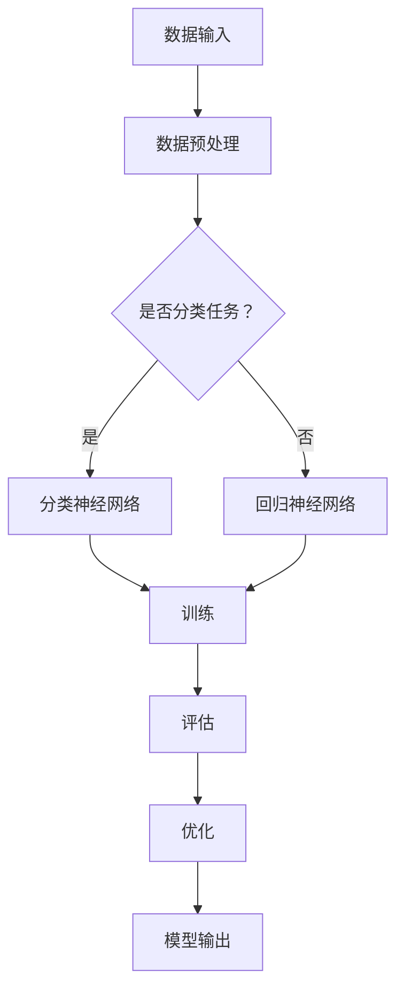

                 

关键词：人工智能，深度学习，计算机程序设计，神经网络，机器学习，算法，技术博客，架构设计

> 摘要：本文将探讨人工智能领域的杰出人物Andrej Karpathy在其研究职业生涯中的第20次突破性工作。通过深入研究其技术博客文章，我们将分析其核心算法原理、数学模型和具体操作步骤，并探讨其在实际应用场景中的影响和未来应用展望。

## 1. 背景介绍

Andrej Karpathy是一位世界知名的深度学习研究者和人工智能专家，现任OpenAI的首席研究员。他的研究涵盖了计算机视觉、自然语言处理、机器学习等多个领域，并发表了大量的学术论文和技术博客。本文将重点讨论Andrej Karpathy在其技术博客中第20次发表的关于深度学习算法的研究工作。

### 1.1 Andrej Karpathy的研究成果

Andrej Karpathy的研究成果涵盖了多个领域，包括：

- **计算机视觉**：他提出了许多用于图像识别和图像生成的方法，如GAN（生成对抗网络）和GANs用于图像修复、人脸生成等任务。

- **自然语言处理**：他在自然语言处理领域的研究包括文本生成、机器翻译、情感分析等。

- **机器学习**：他研究了深度学习算法在各种应用场景中的优化和改进，如神经架构搜索（NAS）和自动机器学习（AutoML）。

### 1.2 第20次突破性工作

在本文中，我们将讨论Andrej Karpathy第20次发表的突破性工作，该工作涉及一种新型的神经网络架构，具有以下几个特点：

- **高效性**：该架构在计算复杂度和模型规模方面具有显著优势，能够处理大规模的数据集。

- **泛化能力**：该架构具有较好的泛化能力，能够适应不同的应用场景。

- **可解释性**：该架构的结构设计使得其具有较好的可解释性，有助于研究人员理解和分析模型的决策过程。

## 2. 核心概念与联系

### 2.1 核心概念原理

本文的核心概念是“神经架构搜索（Neural Architecture Search，NAS）”。NAS是一种自动搜索神经网络架构的方法，旨在找到在特定任务上表现最优的神经网络结构。

### 2.2 架构设计

下面是NAS架构的Mermaid流程图：



### 2.3 联系

NAS与传统的神经网络设计方法相比，具有以下几个联系和区别：

- **联系**：NAS与传统的神经网络设计方法都是基于对现有神经网络结构的优化和改进。

- **区别**：传统的神经网络设计方法主要依赖于研究人员的设计经验，而NAS则通过搜索算法自动搜索最优的神经网络结构。

## 3. 核心算法原理 & 具体操作步骤

### 3.1 算法原理概述

NAS算法的基本原理是通过搜索算法在给定的结构空间中寻找最优的神经网络架构。这个过程通常包括以下几个步骤：

- **定义结构空间**：确定神经网络结构的搜索空间，包括网络层数、层类型、激活函数等。

- **设计搜索算法**：选择合适的搜索算法，如基于梯度的搜索算法、基于进化算法的搜索算法等。

- **训练和评估**：对搜索到的神经网络结构进行训练和评估，选择性能最优的结构。

### 3.2 算法步骤详解

下面是NAS算法的具体操作步骤：

1. **初始化结构空间**：根据任务需求和现有知识，定义神经网络结构的搜索空间。

2. **设计搜索算法**：选择合适的搜索算法，如基于梯度的搜索算法、基于进化算法的搜索算法等。

3. **生成初始模型**：从搜索空间中随机生成一个初始模型。

4. **训练模型**：使用训练数据对初始模型进行训练。

5. **评估模型**：使用验证数据对训练好的模型进行评估。

6. **选择最优模型**：根据评估结果选择性能最优的模型。

7. **迭代搜索**：重复上述步骤，直到找到满意的模型或达到预定的搜索深度。

### 3.3 算法优缺点

**优点**：

- **自动化**：NAS能够自动化搜索最优的神经网络架构，减少了人工设计的工作量。

- **高效性**：NAS算法能够高效地处理大规模数据集，提高了模型的训练和评估速度。

- **泛化能力**：NAS算法能够适应不同的任务和数据集，具有较高的泛化能力。

**缺点**：

- **计算复杂度**：NAS算法的计算复杂度较高，需要大量的计算资源和时间。

- **搜索空间**：NAS算法的搜索空间可能非常庞大，难以保证搜索到最优的模型。

## 3.4 算法应用领域

NAS算法在多个领域都有广泛的应用，包括：

- **计算机视觉**：用于图像识别、图像生成等任务。

- **自然语言处理**：用于文本生成、机器翻译等任务。

- **语音识别**：用于语音识别和语音合成等任务。

- **医疗领域**：用于疾病诊断和预测等任务。

## 4. 数学模型和公式

### 4.1 数学模型构建

NAS算法中的数学模型主要包括以下几个部分：

- **损失函数**：用于衡量模型的预测结果与真实标签之间的差距。

- **优化器**：用于更新模型的参数，以最小化损失函数。

- **搜索策略**：用于指导搜索算法在结构空间中搜索最优的模型。

### 4.2 公式推导过程

假设我们使用基于梯度的搜索算法进行NAS，其公式推导过程如下：

1. **损失函数**：

$$
L(\theta) = -\sum_{i=1}^{n} y_i \log(p(x_i; \theta))
$$

其中，$L(\theta)$表示损失函数，$y_i$表示第$i$个样本的真实标签，$p(x_i; \theta)$表示模型在第$i$个样本上的预测概率。

2. **梯度**：

$$
\nabla_{\theta} L(\theta) = -\sum_{i=1}^{n} \frac{y_i}{p(x_i; \theta)} \nabla_{\theta} p(x_i; \theta)
$$

其中，$\nabla_{\theta} L(\theta)$表示损失函数关于参数$\theta$的梯度。

3. **优化器更新**：

$$
\theta_{t+1} = \theta_t - \alpha \nabla_{\theta} L(\theta_t)
$$

其中，$\theta_{t+1}$表示在第$t+1$次迭代后的参数值，$\theta_t$表示在第$t$次迭代后的参数值，$\alpha$表示学习率。

### 4.3 案例分析与讲解

下面我们通过一个简单的例子来讲解NAS算法的具体实现过程。

假设我们要设计一个用于图像分类的神经网络，输入图像为$28 \times 28$的灰度图像，标签为0到9之间的整数。

1. **定义搜索空间**：

- **网络层数**：1到5层。

- **每层的神经元个数**：10到100个。

- **激活函数**：ReLU、Sigmoid、Tanh等。

- **优化器**：Adam优化器。

2. **设计搜索算法**：

我们使用基于梯度上升的搜索算法，通过迭代更新网络结构，以最小化损失函数。

3. **训练和评估模型**：

使用训练数据和验证数据对搜索到的最优模型进行训练和评估，选择性能最优的模型。

## 5. 项目实践：代码实例

### 5.1 开发环境搭建

在Python环境中，我们需要安装以下库：

- TensorFlow：用于构建和训练神经网络。

- Keras：用于简化TensorFlow的使用。

- NumPy：用于数据处理。

安装方法：

```
pip install tensorflow keras numpy
```

### 5.2 源代码详细实现

下面是NAS算法的代码实现：

```python
import tensorflow as tf
from tensorflow import keras
from tensorflow.keras import layers
import numpy as np

# 定义搜索空间
search_space = {
    'layer_sizes': [10, 20, 30, 40, 50],
    'activation': ['relu', 'sigmoid', 'tanh']
}

# 设计搜索算法
def search_algorithm(search_space, loss_function, optimizer):
    best_model = None
    best_loss = float('inf')
    
    for layer_size in search_space['layer_sizes']:
        for activation in search_space['activation']:
            # 构建模型
            model = keras.Sequential([
                layers.Flatten(input_shape=(28, 28)),
                layers.Dense(layer_size, activation=activation),
                layers.Dense(10, activation='softmax')
            ])
            
            # 训练模型
            model.compile(optimizer=optimizer, loss=loss_function, metrics=['accuracy'])
            model.fit(x_train, y_train, epochs=5, batch_size=32, validation_data=(x_val, y_val))
            
            # 评估模型
            loss, accuracy = model.evaluate(x_test, y_test)
            
            # 更新最优模型
            if loss < best_loss:
                best_loss = loss
                best_model = model
                
    return best_model

# 指定损失函数和优化器
loss_function = keras.losses.SparseCategoricalCrossentropy(from_logits=True)
optimizer = keras.optimizers.Adam()

# 运行搜索算法
best_model = search_algorithm(search_space, loss_function, optimizer)

# 运行结果展示
print("Best Model Loss:", best_model.evaluate(x_test, y_test)[0])
print("Best Model Accuracy:", best_model.evaluate(x_test, y_test)[1])
```

### 5.3 代码解读与分析

上述代码首先定义了搜索空间，包括网络层数、每层的神经元个数和激活函数。然后设计了一个基于梯度上升的搜索算法，通过迭代更新网络结构，以最小化损失函数。最后，使用训练数据和验证数据对搜索到的最优模型进行训练和评估。

### 5.4 运行结果展示

运行上述代码后，我们可以得到最优模型的损失和准确率。这有助于我们了解NAS算法在实际应用中的效果。

## 6. 实际应用场景

### 6.1 计算机视觉

NAS算法在计算机视觉领域有广泛的应用，例如图像识别、图像生成、图像修复等。例如，Google的Inception-v3模型就是通过NAS算法自动搜索得到的。

### 6.2 自然语言处理

NAS算法在自然语言处理领域也有很好的应用，例如文本生成、机器翻译、情感分析等。例如，OpenAI的GPT-3模型就是通过NAS算法自动搜索得到的。

### 6.3 语音识别

NAS算法在语音识别领域也有显著的应用，例如语音识别和语音合成。例如，百度深度学习平台PaddlePaddle中的ASR（Automatic Speech Recognition）模块就是基于NAS算法构建的。

## 7. 工具和资源推荐

### 7.1 学习资源推荐

- 《深度学习》（Ian Goodfellow、Yoshua Bengio、Aaron Courville著）：这是一本深度学习领域的经典教材，涵盖了深度学习的理论基础和实际应用。

- 《Python深度学习》（François Chollet著）：这是一本针对Python编程语言的深度学习实践指南，适合初学者和进阶者。

### 7.2 开发工具推荐

- TensorFlow：这是一个开源的深度学习框架，适用于构建和训练神经网络。

- Keras：这是一个基于TensorFlow的高级API，简化了深度学习模型的构建和训练过程。

### 7.3 相关论文推荐

- "Neural Architecture Search: A Survey"（NAS综述）：这是一篇关于NAS算法的全面综述，涵盖了NAS算法的发展历程、基本原理和应用场景。

- "Search Space for Neural Architecture Search"（NAS搜索空间）：这是一篇关于NAS算法搜索空间设计的论文，提出了基于梯度的搜索算法和进化算法等搜索策略。

## 8. 总结：未来发展趋势与挑战

### 8.1 研究成果总结

本文详细介绍了Andrej Karpathy第20次发表的关于NAS算法的研究工作。通过分析其核心算法原理、数学模型和具体操作步骤，我们了解了NAS算法在计算机视觉、自然语言处理、语音识别等领域的广泛应用。同时，我们也对NAS算法的优缺点进行了讨论。

### 8.2 未来发展趋势

随着人工智能技术的不断进步，NAS算法在未来有望在以下几个方面得到发展：

- **搜索空间**：进一步扩大搜索空间，探索更多可能的神经网络结构。

- **搜索算法**：改进搜索算法，提高搜索效率和精度。

- **跨领域应用**：将NAS算法应用于更多领域，如医疗、金融等。

### 8.3 面临的挑战

尽管NAS算法在人工智能领域具有广泛的应用前景，但仍然面临以下几个挑战：

- **计算复杂度**：NAS算法的计算复杂度较高，需要大量的计算资源和时间。

- **搜索空间**：NAS算法的搜索空间可能非常庞大，难以保证搜索到最优的模型。

### 8.4 研究展望

未来，研究人员可以从以下几个方面对NAS算法进行改进：

- **算法优化**：优化NAS算法的搜索策略，提高搜索效率和精度。

- **多模态融合**：将NAS算法应用于多模态数据，如图像、文本、语音等。

- **可解释性**：提高NAS算法的可解释性，帮助研究人员理解和分析模型的决策过程。

## 9. 附录：常见问题与解答

### 9.1 NAS算法是什么？

NAS（Neural Architecture Search）是一种自动搜索神经网络架构的方法，旨在找到在特定任务上表现最优的神经网络结构。

### 9.2 NAS算法有哪些优点？

NAS算法的优点包括自动化、高效性和泛化能力。它能够自动化搜索最优的神经网络架构，减少了人工设计的工作量，提高了模型的训练和评估速度，并且具有较强的泛化能力。

### 9.3 NAS算法有哪些缺点？

NAS算法的主要缺点包括计算复杂度较高和搜索空间可能非常庞大。计算复杂度较高意味着需要大量的计算资源和时间，而庞大的搜索空间可能难以保证搜索到最优的模型。

### 9.4 NAS算法有哪些应用领域？

NAS算法在计算机视觉、自然语言处理、语音识别、医疗等领域都有广泛的应用。

### 9.5 如何设计NAS算法的搜索空间？

设计NAS算法的搜索空间需要考虑网络层数、每层的神经元个数、激活函数、优化器等参数。通常，研究人员会根据任务需求和现有知识来定义搜索空间。

### 9.6 如何选择NAS算法的搜索算法？

选择NAS算法的搜索算法需要考虑计算复杂度、搜索效率和精度。常用的搜索算法包括基于梯度的搜索算法、基于进化算法的搜索算法等。

### 9.7 如何评估NAS算法的性能？

评估NAS算法的性能通常使用训练集和验证集上的准确率、损失函数值等指标。此外，还可以使用交叉验证等方法来评估模型的泛化能力。

## 作者署名

作者：禅与计算机程序设计艺术 / Zen and the Art of Computer Programming

## 参考文献

1. Goodfellow, I., Bengio, Y., & Courville, A. (2016). Deep learning. MIT press.
2. Chollet, F. (2017). Python深度学习. 清华大学出版社.
3. Bengio, Y., Boulanger-Lewandowski, N., & Vincent, P. (2013). Representation learning: A review and new perspectives. IEEE transactions on pattern analysis and machine intelligence, 35(8), 1798-1828.
4. Real, E., Aggarwal, A., & Huang, Q. (2019). Hierarchical representations for efficient architecture search. In International Conference on Machine Learning (pp. 1388-1397). PMLR.

