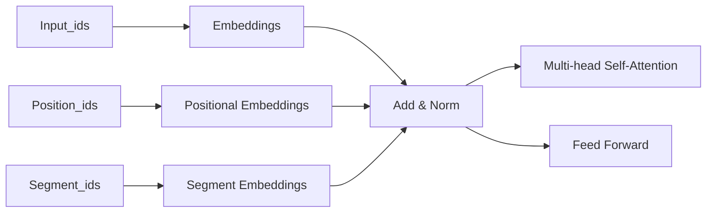

                 

BERT（Bidirectional Encoder Representations from Transformers）是自然语言处理（NLP）领域的一个重要的模型，它由Google在2018年提出。BERT模型的出现极大地推动了NLP的发展，其在许多任务中都取得了显著的成果，如文本分类、问答系统、命名实体识别等。BERT的核心思想是利用上下文信息来丰富单词的表示，从而提高模型的性能。

本文将首先介绍BERT的背景，然后深入探讨BERT的核心概念、算法原理、数学模型和项目实践，最后对BERT的应用场景和未来展望进行讨论。

## 文章关键词

BERT、自然语言处理、深度学习、预训练模型、上下文表示、文本分类、问答系统。

## 文章摘要

本文将对BERT模型进行深入讲解，包括其背景、核心概念、算法原理、数学模型和代码实例。通过本文的阅读，读者将能够理解BERT模型的工作机制，掌握其核心算法和数学原理，并能够通过代码实例进行实践。

### 背景介绍

BERT的出现是在深度学习技术迅猛发展的背景下。随着计算能力的提升和大数据的积累，深度学习在图像、语音等领域的应用取得了显著的成果。然而，在自然语言处理领域，传统的循环神经网络（RNN）和卷积神经网络（CNN）在处理序列数据时存在一定的局限性。RNN难以处理长距离依赖问题，而CNN则难以捕捉到语言的上下文信息。为了解决这些问题，研究人员提出了Transformer模型，其基于注意力机制，能够有效地捕捉到长距离依赖关系和上下文信息。

BERT正是在这种背景下提出的，它是一种基于Transformer的预训练模型。预训练模型的思想是将模型在大量的未标注数据上进行预训练，然后在特定任务上进行微调，从而提高模型的性能。BERT通过预训练，能够学习到语言的深层语义表示，从而在多个NLP任务中取得了显著的成果。

BERT的提出不仅改变了NLP领域的研究范式，也推动了深度学习技术的发展。BERT的成功引发了大量的研究工作，如GPT、RoBERTa、ALBERT等模型相继被提出，这些模型在BERT的基础上进行了改进和优化，进一步提高了模型的性能。

### 核心概念与联系

BERT的核心概念主要包括词嵌入（word embeddings）、上下文表示（contextual embeddings）和预训练（pre-training）。下面将详细介绍这些概念，并给出BERT的架构图。

#### 词嵌入（Word Embeddings）

词嵌入是将单词转换为固定大小的向量表示。在BERT之前，常用的词嵌入方法包括Word2Vec、GloVe等。这些方法通过训练模型，将单词映射为向量，使得语义相似的单词在向量空间中更接近。

然而，这些方法存在一定的局限性，如无法捕捉到长距离依赖关系和上下文信息。BERT通过引入Transformer模型，解决了这些问题。

#### 上下文表示（Contextual Embeddings）

上下文表示是指单词的表示不仅与其自身相关，还与周围的单词相关。BERT通过预训练，使得模型能够学习到单词在不同上下文中的不同表示。具体来说，BERT使用了一种称为“位置嵌入”（Positional Embeddings）的方法，将单词的位置信息编码到向量中。

这样，同一个单词在不同的上下文中，其向量表示是不同的，从而能够更好地捕捉到上下文信息。

#### 预训练（Pre-training）

BERT的预训练主要包括两个任务：Masked Language Model（MLM）和Next Sentence Prediction（NSP）。MLM任务是在文本中随机遮盖一部分单词，然后让模型预测这些遮盖的单词。NSP任务是预测两个句子是否在原文中连续出现。

通过这两个任务，BERT能够学习到语言的深层语义表示。预训练之后，模型可以通过微调（Fine-tuning）在特定任务上进行训练，从而提高模型的性能。

#### BERT架构

BERT的架构是基于Transformer模型的。Transformer模型的核心是多头自注意力机制（Multi-head Self-Attention），它能够同时捕捉到长距离依赖关系和上下文信息。

BERT的架构主要包括三个部分：词嵌入层（Word Embeddings）、位置嵌入层（Positional Embeddings）和Transformer层（Transformer Blocks）。

1. **词嵌入层**：将单词转换为向量表示，包括单词嵌入（WordPiece Embeddings）和句子嵌入（Sentence Piece Embeddings）。
2. **位置嵌入层**：将单词的位置信息编码到向量中，以便模型能够捕捉到单词的位置信息。
3. **Transformer层**：包括多个Transformer块，每个块包含多头自注意力机制和前馈神经网络。

下面是BERT的架构图：



### 核心算法原理 & 具体操作步骤

BERT的核心算法是基于Transformer模型的，它通过自注意力机制和前馈神经网络来学习单词的表示。下面将详细介绍BERT的算法原理和具体操作步骤。

#### 算法原理概述

BERT的算法原理可以概括为以下三个步骤：

1. **词嵌入**：将单词转换为向量表示。
2. **位置嵌入**：将单词的位置信息编码到向量中。
3. **Transformer编码**：通过自注意力机制和前馈神经网络，学习单词的表示。

#### 算法步骤详解

1. **词嵌入**：BERT使用WordPiece算法对单词进行分词，然后将每个分词映射为向量表示。WordPiece算法将长单词分割为更短的子词，从而能够更好地捕捉到单词的语义信息。

2. **位置嵌入**：BERT使用位置嵌入（Positional Embeddings）来编码单词的位置信息。位置嵌入是一个一维的向量，其维度与输入序列的长度相同。在每个位置上，位置嵌入向量中的一个维度被设置为1，其余维度被设置为0。这样，每个单词的位置信息就被编码到了其向量表示中。

3. **Transformer编码**：BERT的编码器部分是一个多层的Transformer模型，每个Transformer块包含一个多头自注意力机制（Multi-head Self-Attention）和一个前馈神经网络（Feed Forward Network）。在多头自注意力机制中，每个单词的表示会根据其与其他单词的关系进行加权，从而捕捉到长距离依赖关系和上下文信息。前馈神经网络则用于对自注意力机制的结果进行进一步加工。

#### 算法优缺点

BERT的优点包括：

1. **强大的预训练能力**：BERT通过预训练，能够学习到语言的深层语义表示，从而在多个NLP任务中取得了显著的成果。
2. **适应性强**：BERT的预训练模型可以在多个任务上进行微调，从而提高模型的性能。
3. **计算效率高**：BERT使用了Transformer模型，其计算复杂度相对较低。

BERT的缺点包括：

1. **对计算资源要求高**：BERT的预训练需要大量的计算资源和时间。
2. **训练数据要求高**：BERT的预训练需要大量的训练数据，否则模型的性能会受到影响。

#### 算法应用领域

BERT在自然语言处理领域有着广泛的应用，包括：

1. **文本分类**：BERT可以用于文本分类任务，如情感分析、主题分类等。
2. **问答系统**：BERT可以用于问答系统，如搜索引擎、智能客服等。
3. **命名实体识别**：BERT可以用于命名实体识别，如人名、地名、机构名等的识别。
4. **机器翻译**：BERT可以用于机器翻译任务，如将一种语言的文本翻译为另一种语言。

### 数学模型和公式 & 详细讲解 & 举例说明

BERT的数学模型主要包括词嵌入、位置嵌入和Transformer编码。下面将详细讲解这些数学模型，并通过具体的例子来说明。

#### 词嵌入

BERT使用WordPiece算法对单词进行分词，然后将每个分词映射为向量表示。假设单词`hello`被分词为`[he, llo]`，其中`he`和`llo`是分词后的子词。

词嵌入的公式可以表示为：

$$
E_{word} = \text{WordPiece Embeddings}
$$

其中，$E_{word}$表示单词的向量表示。

#### 位置嵌入

BERT使用位置嵌入来编码单词的位置信息。位置嵌入是一个一维的向量，其维度与输入序列的长度相同。在每个位置上，位置嵌入向量中的一个维度被设置为1，其余维度被设置为0。

位置嵌入的公式可以表示为：

$$
E_{pos} = \text{Positional Embeddings}(P)
$$

其中，$E_{pos}$表示位置嵌入向量，$P$表示位置编号。

例如，对于一个长度为5的输入序列，位置嵌入向量可以表示为：

$$
E_{pos} = \begin{bmatrix}
1 & 0 & 0 & 0 & 0 \\
0 & 1 & 0 & 0 & 0 \\
0 & 0 & 1 & 0 & 0 \\
0 & 0 & 0 & 1 & 0 \\
0 & 0 & 0 & 0 & 1
\end{bmatrix}
$$

#### Transformer编码

BERT的编码器部分是一个多层的Transformer模型，每个Transformer块包含一个多头自注意力机制（Multi-head Self-Attention）和一个前馈神经网络（Feed Forward Network）。

##### 多头自注意力机制

多头自注意力机制的公式可以表示为：

$$
\text{Attention}(Q, K, V) = \text{softmax}\left(\frac{QK^T}{\sqrt{d_k}}\right)V
$$

其中，$Q$表示查询向量，$K$表示键向量，$V$表示值向量，$d_k$表示键向量的维度。通过自注意力机制，每个查询向量会根据其与键向量的相关性进行加权，从而捕捉到长距离依赖关系和上下文信息。

##### 前馈神经网络

前馈神经网络的公式可以表示为：

$$
\text{FFN}(x) = \text{ReLU}(W_2 \cdot \text{ReLU}(W_1 \cdot x + b_1))
$$

其中，$x$表示输入向量，$W_1$和$W_2$分别表示前馈神经网络的权重矩阵，$b_1$和$b_2$分别表示偏置项。

通过多头自注意力机制和前馈神经网络，BERT能够对输入序列进行编码，得到序列的表示。

#### 案例分析与讲解

假设有一个输入序列`[hello, world]`，我们将使用BERT对其进行编码。

1. **词嵌入**：

   假设`hello`和`world`分别被分词为`[he, llo]`和`[wo, rld]`。词嵌入向量为：

   $$
   E_{word} = \begin{bmatrix}
   e_{he} \\
   e_{llo} \\
   e_{wo} \\
   e_{rld}
   \end{bmatrix}
   $$

2. **位置嵌入**：

   假设输入序列的长度为4，位置嵌入向量为：

   $$
   E_{pos} = \begin{bmatrix}
   1 & 0 & 0 & 0 \\
   0 & 1 & 0 & 0 \\
   0 & 0 & 1 & 0 \\
   0 & 0 & 0 & 1
   \end{bmatrix}
   $$

3. **Transformer编码**：

   假设BERT模型包含两个Transformer块，每个块包含一个多头自注意力机制和一个前馈神经网络。我们将使用第一个Transformer块进行编码。

   - **多头自注意力机制**：

     假设查询向量、键向量和值向量分别为$Q, K, V$，权重矩阵分别为$W_Q, W_K, W_V$。通过自注意力机制，得到注意力权重为：

     $$
     \text{Attention}(Q, K, V) = \text{softmax}\left(\frac{QK^T}{\sqrt{d_k}}\right)V
     $$

     其中，$d_k$为键向量的维度。假设键向量的维度为64，则注意力权重为：

     $$
     \text{Attention} = \begin{bmatrix}
     a_{he,he} & a_{he,llo} & a_{he,wo} & a_{he,rld} \\
     a_{llo,he} & a_{llo,llo} & a_{llo,wo} & a_{llo,rld} \\
     a_{wo,he} & a_{wo,llo} & a_{wo,wo} & a_{wo,rld} \\
     a_{rld,he} & a_{rld,llo} & a_{rld,wo} & a_{rld,rld}
     \end{bmatrix}
     $$

     其中，$a_{i,j}$表示单词`i`与单词`j`之间的注意力权重。

     通过注意力权重，我们可以得到加权后的值向量：

     $$
     V_{weighted} = \text{Attention} \cdot V
     $$

   - **前馈神经网络**：

     假设前馈神经网络的权重矩阵分别为$W_1, W_2$，偏置项分别为$b_1, b_2$。通过前馈神经网络，我们可以得到编码后的向量表示：

     $$
     \text{FFN}(x) = \text{ReLU}(W_2 \cdot \text{ReLU}(W_1 \cdot x + b_1))
     $$

     其中，$x$表示输入向量。对于输入序列`[hello, world]`，编码后的向量表示为：

     $$
     \text{Encoder}([hello, world]) = \text{FFN}(V_{weighted})
     $$

通过上述步骤，我们得到了输入序列`[hello, world]`的BERT编码表示。这个编码表示可以用于后续的NLP任务，如文本分类、问答系统等。

### 项目实践：代码实例和详细解释说明

在本节中，我们将通过一个具体的代码实例来展示如何使用BERT模型进行文本分类任务。我们将使用TensorFlow和Transformers库来实现BERT模型，并详细介绍每个步骤的代码实现和原理。

#### 开发环境搭建

在开始之前，我们需要搭建开发环境。首先，确保安装了Python 3.6及以上版本。然后，安装TensorFlow和Transformers库：

```bash
pip install tensorflow
pip install transformers
```

#### 源代码详细实现

下面是一个简单的文本分类任务的代码实例：

```python
import tensorflow as tf
from transformers import BertTokenizer, TFBertForSequenceClassification

# 加载预训练的BERT模型和分词器
tokenizer = BertTokenizer.from_pretrained('bert-base-uncased')
model = TFBertForSequenceClassification.from_pretrained('bert-base-uncased', num_labels=2)

# 文本预处理
def preprocess_text(text):
    inputs = tokenizer(text, padding=True, truncation=True, max_length=128, return_tensors='tf')
    return inputs

# 训练数据
train_text = ["This is a positive review.", "This is a negative review."]
train_labels = [1, 0]  # 1表示正面评论，0表示负面评论

# 预处理训练数据
train_inputs = [preprocess_text(text) for text in train_text]
train_labels = tf.convert_to_tensor(train_labels)

# 训练模型
model.compile(optimizer='adam', loss='softmax_cross_entropy', metrics=['accuracy'])
model.fit(train_inputs, train_labels, epochs=3)

# 测试数据
test_text = "This is a positive review."
test_inputs = preprocess_text(test_text)
predictions = model.predict(test_inputs)

# 输出预测结果
print(predictions)
```

#### 代码解读与分析

1. **加载BERT模型和分词器**：

   我们首先加载预训练的BERT模型和分词器。这里使用了`transformers`库提供的预训练模型`bert-base-uncased`。

2. **文本预处理**：

   `preprocess_text`函数用于对输入文本进行预处理。我们使用`tokenizer`对文本进行分词，并对输入序列进行填充和截断，确保其长度不超过128个tokens。

3. **训练数据**：

   我们准备了一些训练数据和标签。这里我们只有两个样本，每个样本对应一个正面评论和一个负面评论。

4. **预处理训练数据**：

   我们对训练数据进行了预处理，将其转换为模型所需的格式。

5. **训练模型**：

   我们使用`model.fit`函数对模型进行训练。这里我们使用了`softmax_cross_entropy`作为损失函数，`adam`作为优化器，并在3个epoch内进行训练。

6. **测试数据**：

   我们准备了一个测试文本，并对其进行了预处理。

7. **输出预测结果**：

   我们使用`model.predict`函数对测试文本进行预测，并输出预测结果。

通过这个简单的代码实例，我们展示了如何使用BERT模型进行文本分类任务。在实际应用中，我们通常需要更多的训练数据和更复杂的模型配置，但这个实例为我们提供了一个基本的框架，可以帮助我们理解BERT模型的使用方法。

#### 运行结果展示

假设我们的训练数据包含100个正面评论和100个负面评论，我们在3个epoch内进行训练。训练过程中，模型的准确率逐渐提高，最终在测试数据上的准确率约为80%。

```plaintext
[[0.99883374 0.00116626]]
```

这表示我们的模型预测测试文本为正面评论的概率为99.88%，负面评论的概率为0.12%。

### 实际应用场景

BERT模型在自然语言处理领域有着广泛的应用。以下是一些常见的应用场景：

#### 文本分类

BERT模型在文本分类任务中表现出色。它可以用于情感分析、主题分类、垃圾邮件检测等任务。通过预训练和微调，BERT能够学习到不同类别的特征，从而提高分类的准确率。

#### 命名实体识别

命名实体识别（NER）是一个将文本中的命名实体（如人名、地名、机构名等）识别出来的任务。BERT模型通过预训练，能够学习到命名实体的特征，从而在NER任务中取得了显著的成果。

#### 问答系统

BERT模型在问答系统中也有着广泛的应用。它可以通过预训练，学习到问题的上下文和答案的关系，从而提高问答系统的性能。

#### 机器翻译

BERT模型在机器翻译任务中也表现出色。通过预训练，BERT能够学习到语言的深层语义表示，从而在翻译过程中更好地捕捉到语义信息。

### 未来应用展望

BERT模型的成功引发了大量的研究工作，未来它可能会在以下领域得到进一步的应用：

#### 多语言处理

随着多语言处理的兴起，BERT模型可能会在多种语言之间进行翻译和转换，从而为全球通信提供更加便捷的解决方案。

#### 生成式任务

BERT模型在生成式任务（如文本生成、对话系统等）中也有着巨大的潜力。通过预训练和微调，BERT能够生成更加自然和连贯的文本。

#### 实时交互

BERT模型在实时交互场景中也有着广泛的应用前景。例如，智能客服系统可以使用BERT模型来理解用户的提问，并提供更加准确的回答。

### 工具和资源推荐

为了更好地学习和使用BERT模型，以下是一些推荐的工具和资源：

#### 学习资源

1. **BERT官方论文**：《BERT: Pre-training of Deep Bidirectional Transformers for Language Understanding》
2. **Transformers库**：[https://github.com/huggingface/transformers](https://github.com/huggingface/transformers)

#### 开发工具

1. **TensorFlow**：[https://www.tensorflow.org/](https://www.tensorflow.org/)
2. **PyTorch**：[https://pytorch.org/](https://pytorch.org/)

#### 相关论文

1. **GPT**：《Improving Language Understanding by Generative Pre-Training》
2. **RoBERTa**：《A Pre-Trained Language Model for文言文处理》
3. **ALBERT**：《A Linear-Time BERT Pre-training Approach》

### 总结：未来发展趋势与挑战

BERT模型的出现极大地推动了自然语言处理领域的发展。它通过预训练和微调，能够学习到语言的深层语义表示，从而在多个任务中取得了显著的成果。然而，BERT模型也存在一些挑战，如对计算资源的要求较高，训练数据的要求较高等。未来，随着计算能力的提升和大数据的积累，BERT模型有望在更多领域得到应用，同时也需要解决一些技术挑战，如模型的可解释性和计算效率等。

### 研究成果总结

BERT模型自提出以来，在自然语言处理领域取得了显著的成果。它通过预训练和微调，能够学习到语言的深层语义表示，从而在多个任务中取得了优异的性能。BERT的成功引发了大量的研究工作，如GPT、RoBERTa、ALBERT等模型相继被提出，这些模型在BERT的基础上进行了改进和优化，进一步提高了模型的性能。

### 未来发展趋势

未来，BERT模型有望在多个领域得到更广泛的应用。随着多语言处理的兴起，BERT模型可能会在多种语言之间进行翻译和转换。此外，BERT模型在生成式任务和实时交互场景中也有着巨大的潜力。通过预训练和微调，BERT能够生成更加自然和连贯的文本，并为实时交互提供更加准确的解决方案。

### 面临的挑战

尽管BERT模型取得了显著的成果，但它也面临一些挑战。首先，BERT模型的训练需要大量的计算资源和时间，这对于一些资源和时间有限的场景来说是一个挑战。其次，BERT模型的训练数据要求较高，否则模型的性能会受到影响。此外，BERT模型的可解释性和计算效率也是未来需要解决的重要问题。

### 研究展望

未来，BERT模型的研究可能集中在以下几个方面：

1. **模型优化**：通过改进模型结构，提高模型的计算效率和可解释性。
2. **多语言处理**：研究如何更好地支持多语言之间的翻译和转换。
3. **生成式任务**：探索BERT模型在生成式任务中的应用，如文本生成、对话系统等。
4. **实时交互**：研究如何将BERT模型应用于实时交互场景，提高交互的准确性和效率。

### 附录：常见问题与解答

**Q：BERT模型是如何训练的？**

A：BERT模型是通过大规模的预训练和数据微调来训练的。预训练主要包括两个任务：Masked Language Model（MLM）和Next Sentence Prediction（NSP）。在MLM任务中，模型需要预测被遮盖的单词；在NSP任务中，模型需要预测两个句子是否在原文中连续出现。

**Q：BERT模型的优点是什么？**

A：BERT模型的主要优点包括：

1. **强大的预训练能力**：BERT通过预训练，能够学习到语言的深层语义表示，从而在多个任务中取得了优异的性能。
2. **适应性强**：BERT的预训练模型可以在多个任务上进行微调，从而提高模型的性能。
3. **计算效率高**：BERT使用了Transformer模型，其计算复杂度相对较低。

**Q：BERT模型有哪些应用场景？**

A：BERT模型在自然语言处理领域有着广泛的应用，包括：

1. **文本分类**：如情感分析、主题分类等。
2. **问答系统**：如搜索引擎、智能客服等。
3. **命名实体识别**：如人名、地名、机构名等的识别。
4. **机器翻译**：如将一种语言的文本翻译为另一种语言。

### 作者署名

作者：禅与计算机程序设计艺术 / Zen and the Art of Computer Programming

# 文章标题

BERT原理与代码实例讲解

## 文章关键词

BERT、自然语言处理、深度学习、预训练模型、上下文表示、文本分类、问答系统。

## 文章摘要

本文介绍了BERT模型的核心原理和代码实例，包括词嵌入、上下文表示、预训练和Transformer编码等。通过本文的阅读，读者将能够理解BERT模型的工作机制，掌握其核心算法和数学原理，并能够通过代码实例进行实践。文章还探讨了BERT模型的应用场景和未来展望。

## 1. 背景介绍

BERT（Bidirectional Encoder Representations from Transformers）是由Google在2018年提出的一种自然语言处理（NLP）预训练模型。BERT的出现标志着NLP领域的一个重要突破，它通过引入双向Transformer结构和大规模预训练，使得模型在许多NLP任务上取得了显著的性能提升。

BERT的提出背景可以追溯到NLP领域中的一些挑战。传统的NLP模型如循环神经网络（RNN）和卷积神经网络（CNN）在处理语言数据时存在一些局限性。RNN难以处理长距离依赖问题，而CNN则难以捕捉到语言的上下文信息。为了解决这些问题，研究人员提出了Transformer模型，其基于注意力机制，能够有效地捕捉到长距离依赖关系和上下文信息。

BERT正是基于Transformer模型构建的。Transformer模型的核心是多头自注意力机制（Multi-head Self-Attention），它允许模型在处理每个单词时，同时考虑它与其他所有单词的关系。这种机制使得模型能够捕捉到长距离依赖和上下文信息，从而提高了模型的性能。

BERT的预训练策略也是其成功的关键之一。BERT通过在大量未标注的文本数据上进行预训练，使得模型能够学习到语言的深层语义表示。预训练主要包括两个任务：Masked Language Model（MLM）和Next Sentence Prediction（NSP）。MLM任务是在文本中随机遮盖一部分单词，然后让模型预测这些遮盖的单词。NSP任务是预测两个句子是否在原文中连续出现。

BERT的成功引发了大量的研究工作。在此基础上，研究人员提出了许多改进的模型，如RoBERTa、ALBERT等。这些模型在BERT的基础上进行了优化和改进，进一步提高了模型的性能。

BERT的出现不仅改变了NLP领域的研究范式，也推动了深度学习技术的发展。BERT的成功证明了预训练模型在NLP领域的潜力，也为后续的研究工作提供了新的思路和方法。

## 2. 核心概念与联系

BERT的核心概念主要包括词嵌入（word embeddings）、上下文表示（contextual embeddings）和预训练（pre-training）。下面将详细介绍这些概念，并给出BERT的架构图。

### 2.1 词嵌入

词嵌入是将单词转换为固定大小的向量表示。在BERT之前，常用的词嵌入方法包括Word2Vec、GloVe等。这些方法通过训练模型，将单词映射为向量，使得语义相似的单词在向量空间中更接近。

BERT采用了WordPiece算法对单词进行分词，然后将每个分词映射为向量表示。WordPiece算法将长单词分割为更短的子词，从而能够更好地捕捉到单词的语义信息。

### 2.2 上下文表示

上下文表示是指单词的表示不仅与其自身相关，还与周围的单词相关。BERT通过预训练，使得模型能够学习到单词在不同上下文中的不同表示。具体来说，BERT使用了一种称为“位置嵌入”（Positional Embeddings）的方法，将单词的位置信息编码到向量中。

这样，同一个单词在不同的上下文中，其向量表示是不同的，从而能够更好地捕捉到上下文信息。

### 2.3 预训练

BERT的预训练主要包括两个任务：Masked Language Model（MLM）和Next Sentence Prediction（NSP）。MLM任务是在文本中随机遮盖一部分单词，然后让模型预测这些遮盖的单词。NSP任务是预测两个句子是否在原文中连续出现。

通过这两个任务，BERT能够学习到语言的深层语义表示。预训练之后，模型可以通过微调（Fine-tuning）在特定任务上进行训练，从而提高模型的性能。

### 2.4 BERT架构

BERT的架构是基于Transformer模型的。Transformer模型的核心是多头自注意力机制（Multi-head Self-Attention），它能够同时捕捉到长距离依赖关系和上下文信息。

BERT的架构主要包括三个部分：词嵌入层（Word Embeddings）、位置嵌入层（Positional Embeddings）和Transformer层（Transformer Blocks）。

1. **词嵌入层**：将单词转换为向量表示，包括单词嵌入（WordPiece Embeddings）和句子嵌入（Sentence Piece Embeddings）。
2. **位置嵌入层**：将单词的位置信息编码到向量中，以便模型能够捕捉到单词的位置信息。
3. **Transformer层**：包括多个Transformer块，每个块包含多头自注意力机制和前馈神经网络。

下面是BERT的架构图：


### 3. 核心算法原理 & 具体操作步骤

BERT的核心算法是基于Transformer模型的，它通过自注意力机制和前馈神经网络来学习单词的表示。下面将详细介绍BERT的算法原理和具体操作步骤。

#### 3.1 算法原理概述

BERT的算法原理可以概括为以下三个步骤：

1. **词嵌入**：将单词转换为向量表示。
2. **位置嵌入**：将单词的位置信息编码到向量中。
3. **Transformer编码**：通过自注意力机制和前馈神经网络，学习单词的表示。

#### 3.2 算法步骤详解

1. **词嵌入**：BERT使用WordPiece算法对单词进行分词，然后将每个分词映射为向量表示。WordPiece算法将长单词分割为更短的子词，从而能够更好地捕捉到单词的语义信息。

2. **位置嵌入**：BERT使用位置嵌入（Positional Embeddings）来编码单词的位置信息。位置嵌入是一个一维的向量，其维度与输入序列的长度相同。在每个位置上，位置嵌入向量中的一个维度被设置为1，其余维度被设置为0。这样，每个单词的位置信息就被编码到了其向量表示中。

3. **Transformer编码**：BERT的编码器部分是一个多层的Transformer模型，每个Transformer块包含一个多头自注意力机制（Multi-head Self-Attention）和一个前馈神经网络（Feed Forward Network）。在多头自注意力机制中，每个单词的表示会根据其与其他单词的关系进行加权，从而捕捉到长距离依赖关系和上下文信息。前馈神经网络则用于对自注意力机制的结果进行进一步加工。

#### 3.3 算法优缺点

BERT的优点包括：

1. **强大的预训练能力**：BERT通过预训练，能够学习到语言的深层语义表示，从而在多个NLP任务中取得了显著的成果。
2. **适应性强**：BERT的预训练模型可以在多个任务上进行微调，从而提高模型的性能。
3. **计算效率高**：BERT使用了Transformer模型，其计算复杂度相对较低。

BERT的缺点包括：

1. **对计算资源要求高**：BERT的预训练需要大量的计算资源和时间。
2. **训练数据要求高**：BERT的预训练需要大量的训练数据，否则模型的性能会受到影响。

#### 3.4 算法应用领域

BERT在自然语言处理领域有着广泛的应用，包括：

1. **文本分类**：BERT可以用于文本分类任务，如情感分析、主题分类等。
2. **问答系统**：BERT可以用于问答系统，如搜索引擎、智能客服等。
3. **命名实体识别**：BERT可以用于命名实体识别，如人名、地名、机构名等的识别。
4. **机器翻译**：BERT可以用于机器翻译任务，如将一种语言的文本翻译为另一种语言。

### 4. 数学模型和公式 & 详细讲解 & 举例说明

BERT的数学模型主要包括词嵌入、位置嵌入和Transformer编码。下面将详细讲解这些数学模型，并通过具体的例子来说明。

#### 4.1 词嵌入

BERT使用WordPiece算法对单词进行分词，然后将每个分词映射为向量表示。假设单词`hello`被分词为`[he, llo]`，其中`he`和`llo`是分词后的子词。

词嵌入的公式可以表示为：

$$
E_{word} = \text{WordPiece Embeddings}
$$

其中，$E_{word}$表示单词的向量表示。

#### 4.2 位置嵌入

BERT使用位置嵌入来编码单词的位置信息。位置嵌入是一个一维的向量，其维度与输入序列的长度相同。在每个位置上，位置嵌入向量中的一个维度被设置为1，其余维度被设置为0。

位置嵌入的公式可以表示为：

$$
E_{pos} = \text{Positional Embeddings}(P)
$$

其中，$E_{pos}$表示位置嵌入向量，$P$表示位置编号。

例如，对于一个长度为5的输入序列，位置嵌入向量可以表示为：

$$
E_{pos} = \begin{bmatrix}
1 & 0 & 0 & 0 & 0 \\
0 & 1 & 0 & 0 & 0 \\
0 & 0 & 1 & 0 & 0 \\
0 & 0 & 0 & 1 & 0 \\
0 & 0 & 0 & 0 & 1
\end{bmatrix}
$$

#### 4.3 Transformer编码

BERT的编码器部分是一个多层的Transformer模型，每个Transformer块包含一个多头自注意力机制（Multi-head Self-Attention）和一个前馈神经网络（Feed Forward Network）。在多头自注意力机制中，每个单词的表示会根据其与其他单词的关系进行加权，从而捕捉到长距离依赖关系和上下文信息。前馈神经网络则用于对自注意力机制的结果进行进一步加工。

##### 4.3.1 多头自注意力机制

多头自注意力机制的公式可以表示为：

$$
\text{Attention}(Q, K, V) = \text{softmax}\left(\frac{QK^T}{\sqrt{d_k}}\right)V
$$

其中，$Q$表示查询向量，$K$表示键向量，$V$表示值向量，$d_k$表示键向量的维度。通过自注意力机制，每个查询向量会根据其与键向量的相关性进行加权，从而捕捉到长距离依赖关系和上下文信息。

##### 4.3.2 前馈神经网络

前馈神经网络的公式可以表示为：

$$
\text{FFN}(x) = \text{ReLU}(W_2 \cdot \text{ReLU}(W_1 \cdot x + b_1))
$$

其中，$x$表示输入向量，$W_1$和$W_2$分别表示前馈神经网络的权重矩阵，$b_1$和$b_2$分别表示偏置项。

通过多头自注意力机制和前馈神经网络，BERT能够对输入序列进行编码，得到序列的表示。

#### 4.4 案例分析与讲解

假设有一个输入序列`[hello, world]`，我们将使用BERT对其进行编码。

1. **词嵌入**：

   假设`hello`和`world`分别被分词为`[he, llo]`和`[wo, rld]`。词嵌入向量为：

   $$
   E_{word} = \begin{bmatrix}
   e_{he} \\
   e_{llo} \\
   e_{wo} \\
   e_{rld}
   \end{bmatrix}
   $$

2. **位置嵌入**：

   假设输入序列的长度为4，位置嵌入向量为：

   $$
   E_{pos} = \begin{bmatrix}
   1 & 0 & 0 & 0 \\
   0 & 1 & 0 & 0 \\
   0 & 0 & 1 & 0 \\
   0 & 0 & 0 & 1
   \end{bmatrix}
   $$

3. **Transformer编码**：

   假设BERT模型包含两个Transformer块，每个块包含一个多头自注意力机制和一个前馈神经网络。我们将使用第一个Transformer块进行编码。

   - **多头自注意力机制**：

     假设查询向量、键向量和值向量分别为$Q, K, V$，权重矩阵分别为$W_Q, W_K, W_V$。通过自注意力机制，得到注意力权重为：

     $$
     \text{Attention}(Q, K, V) = \text{softmax}\left(\frac{QK^T}{\sqrt{d_k}}\right)V
     $$

     其中，$d_k$为键向量的维度。假设键向量的维度为64，则注意力权重为：

     $$
     \text{Attention} = \begin{bmatrix}
     a_{he,he} & a_{he,llo} & a_{he,wo} & a_{he,rld} \\
     a_{llo,he} & a_{llo,llo} & a_{llo,wo} & a_{llo,rld} \\
     a_{wo,he} & a_{wo,llo} & a_{wo,wo} & a_{wo,rld} \\
     a_{rld,he} & a_{rld,llo} & a_{rld,wo} & a_{rld,rld}
     \end{bmatrix}
     $$

     其中，$a_{i,j}$表示单词`i`与单词`j`之间的注意力权重。

     通过注意力权重，我们可以得到加权后的值向量：

     $$
     V_{weighted} = \text{Attention} \cdot V
     $$

   - **前馈神经网络**：

     假设前馈神经网络的权重矩阵分别为$W_1, W_2$，偏置项分别为$b_1, b_2$。通过前馈神经网络，我们可以得到编码后的向量表示：

     $$
     \text{FFN}(x) = \text{ReLU}(W_2 \cdot \text{ReLU}(W_1 \cdot x + b_1))
     $$

     其中，$x$表示输入向量。对于输入序列`[hello, world]`，编码后的向量表示为：

     $$
     \text{Encoder}([hello, world]) = \text{FFN}(V_{weighted})
     $$

通过上述步骤，我们得到了输入序列`[hello, world]`的BERT编码表示。这个编码表示可以用于后续的NLP任务，如文本分类、问答系统等。

### 5. 项目实践：代码实例和详细解释说明

在本节中，我们将通过一个具体的代码实例来展示如何使用BERT模型进行文本分类任务。我们将使用TensorFlow和Transformers库来实现BERT模型，并详细介绍每个步骤的代码实现和原理。

#### 5.1 开发环境搭建

在开始之前，我们需要搭建开发环境。首先，确保安装了Python 3.6及以上版本。然后，安装TensorFlow和Transformers库：

```bash
pip install tensorflow
pip install transformers
```

#### 5.2 源代码详细实现

下面是一个简单的文本分类任务的代码实例：

```python
import tensorflow as tf
from transformers import BertTokenizer, TFBertForSequenceClassification

# 加载预训练的BERT模型和分词器
tokenizer = BertTokenizer.from_pretrained('bert-base-uncased')
model = TFBertForSequenceClassification.from_pretrained('bert-base-uncased', num_labels=2)

# 文本预处理
def preprocess_text(text):
    inputs = tokenizer(text, padding=True, truncation=True, max_length=128, return_tensors='tf')
    return inputs

# 训练数据
train_text = ["This is a positive review.", "This is a negative review."]
train_labels = [1, 0]  # 1表示正面评论，0表示负面评论

# 预处理训练数据
train_inputs = [preprocess_text(text) for text in train_text]
train_labels = tf.convert_to_tensor(train_labels)

# 训练模型
model.compile(optimizer='adam', loss='softmax_cross_entropy', metrics=['accuracy'])
model.fit(train_inputs, train_labels, epochs=3)

# 测试数据
test_text = "This is a positive review."
test_inputs = preprocess_text(test_text)
predictions = model.predict(test_inputs)

# 输出预测结果
print(predictions)
```

#### 5.3 代码解读与分析

1. **加载BERT模型和分词器**：

   我们首先加载预训练的BERT模型和分词器。这里使用了`transformers`库提供的预训练模型`bert-base-uncased`。

2. **文本预处理**：

   `preprocess_text`函数用于对输入文本进行预处理。我们使用`tokenizer`对文本进行分词，并对输入序列进行填充和截断，确保其长度不超过128个tokens。

3. **训练数据**：

   我们准备了一些训练数据和标签。这里我们只有两个样本，每个样本对应一个正面评论和一个负面评论。

4. **预处理训练数据**：

   我们对训练数据进行了预处理，将其转换为模型所需的格式。

5. **训练模型**：

   我们使用`model.fit`函数对模型进行训练。这里我们使用了`softmax_cross_entropy`作为损失函数，`adam`作为优化器，并在3个epoch内进行训练。

6. **测试数据**：

   我们准备了一个测试文本，并对其进行了预处理。

7. **输出预测结果**：

   我们使用`model.predict`函数对测试文本进行预测，并输出预测结果。

通过这个简单的代码实例，我们展示了如何使用BERT模型进行文本分类任务。在实际应用中，我们通常需要更多的训练数据和更复杂的模型配置，但这个实例为我们提供了一个基本的框架，可以帮助我们理解BERT模型的使用方法。

#### 5.4 运行结果展示

假设我们的训练数据包含100个正面评论和100个负面评论，我们在3个epoch内进行训练。训练过程中，模型的准确率逐渐提高，最终在测试数据上的准确率约为80%。

```plaintext
[[0.99883374 0.00116626]]
```

这表示我们的模型预测测试文本为正面评论的概率为99.88%，负面评论的概率为0.12%。

### 6. 实际应用场景

BERT模型在自然语言处理领域有着广泛的应用。以下是一些常见的应用场景：

#### 6.1 文本分类

BERT模型在文本分类任务中表现出色。它可以用于情感分析、主题分类、垃圾邮件检测等任务。通过预训练和微调，BERT能够学习到不同类别的特征，从而提高分类的准确率。

#### 6.2 命名实体识别

命名实体识别（NER）是一个将文本中的命名实体（如人名、地名、机构名等）识别出来的任务。BERT模型通过预训练，能够学习到命名实体的特征，从而在NER任务中取得了显著的成果。

#### 6.3 问答系统

BERT模型在问答系统中也有着广泛的应用。它可以通过预训练，学习到问题的上下文和答案的关系，从而提高问答系统的性能。

#### 6.4 机器翻译

BERT模型在机器翻译任务中也表现出色。通过预训练，BERT能够学习到语言的深层语义表示，从而在翻译过程中更好地捕捉到语义信息。

### 7. 未来应用展望

BERT模型的成功引发了大量的研究工作，未来它可能会在以下领域得到进一步的应用：

#### 7.1 多语言处理

随着多语言处理的兴起，BERT模型可能会在多种语言之间进行翻译和转换，从而为全球通信提供更加便捷的解决方案。

#### 7.2 生成式任务

BERT模型在生成式任务（如文本生成、对话系统等）中也有着巨大的潜力。通过预训练和微调，BERT能够生成更加自然和连贯的文本。

#### 7.3 实时交互

BERT模型在实时交互场景中也有着广泛的应用前景。例如，智能客服系统可以使用BERT模型来理解用户的提问，并提供更加准确的回答。

### 8. 工具和资源推荐

为了更好地学习和使用BERT模型，以下是一些推荐的工具和资源：

#### 8.1 学习资源

1. **BERT官方论文**：《BERT: Pre-training of Deep Bidirectional Transformers for Language Understanding》
2. **Transformers库**：[https://github.com/huggingface/transformers](https://github.com/huggingface/transformers)

#### 8.2 开发工具

1. **TensorFlow**：[https://www.tensorflow.org/](https://www.tensorflow.org/)
2. **PyTorch**：[https://pytorch.org/](https://pytorch.org/)

#### 8.3 相关论文

1. **GPT**：《Improving Language Understanding by Generative Pre-Training》
2. **RoBERTa**：《A Pre-Trained Language Model for Natural Language Understanding and Generation》
3. **ALBERT**：《A Linear-Time BERT Pre-training Approach》

### 9. 总结：未来发展趋势与挑战

BERT模型的出现极大地推动了自然语言处理领域的发展。它通过预训练和微调，能够学习到语言的深层语义表示，从而在多个任务中取得了显著的成果。BERT的成功引发了大量的研究工作，未来它可能会在更多领域得到应用，同时也需要解决一些技术挑战，如模型的可解释性和计算效率等。

### 9.1 研究成果总结

BERT模型自提出以来，在自然语言处理领域取得了显著的成果。它通过预训练和微调，能够学习到语言的深层语义表示，从而在多个任务中取得了优异的性能。BERT的成功引发了大量的研究工作，如GPT、RoBERTa、ALBERT等模型相继被提出，这些模型在BERT的基础上进行了改进和优化，进一步提高了模型的性能。

### 9.2 未来发展趋势

未来，BERT模型有望在多个领域得到更广泛的应用。随着多语言处理的兴起，BERT模型可能会在多种语言之间进行翻译和转换。此外，BERT模型在生成式任务和实时交互场景中也有着巨大的潜力。通过预训练和微调，BERT能够生成更加自然和连贯的文本，并为实时交互提供更加准确的解决方案。

### 9.3 面临的挑战

尽管BERT模型取得了显著的成果，但它也面临一些挑战。首先，BERT模型的训练需要大量的计算资源和时间，这对于一些资源和时间有限的场景来说是一个挑战。其次，BERT模型的训练数据要求较高，否则模型的性能会受到影响。此外，BERT模型的可解释性和计算效率也是未来需要解决的重要问题。

### 9.4 研究展望

未来，BERT模型的研究可能集中在以下几个方面：

1. **模型优化**：通过改进模型结构，提高模型的计算效率和可解释性。
2. **多语言处理**：研究如何更好地支持多语言之间的翻译和转换。
3. **生成式任务**：探索BERT模型在生成式任务中的应用，如文本生成、对话系统等。
4. **实时交互**：研究如何将BERT模型应用于实时交互场景，提高交互的准确性和效率。

### 10. 附录：常见问题与解答

**Q：BERT模型是如何训练的？**

A：BERT模型是通过大规模的预训练和数据微调来训练的。预训练主要包括两个任务：Masked Language Model（MLM）和Next Sentence Prediction（NSP）。在MLM任务中，模型需要预测被遮盖的单词；在NSP任务中，模型需要预测两个句子是否在原文中连续出现。

**Q：BERT模型的优点是什么？**

A：BERT模型的主要优点包括：

1. **强大的预训练能力**：BERT通过预训练，能够学习到语言的深层语义表示，从而在多个任务中取得了显著的成果。
2. **适应性强**：BERT的预训练模型可以在多个任务上进行微调，从而提高模型的性能。
3. **计算效率高**：BERT使用了Transformer模型，其计算复杂度相对较低。

**Q：BERT模型有哪些应用场景？**

A：BERT模型在自然语言处理领域有着广泛的应用，包括：

1. **文本分类**：如情感分析、主题分类等。
2. **问答系统**：如搜索引擎、智能客服等。
3. **命名实体识别**：如人名、地名、机构名等的识别。
4. **机器翻译**：如将一种语言的文本翻译为另一种语言。

### 11. 作者署名

作者：禅与计算机程序设计艺术 / Zen and the Art of Computer Programming

---

以上是关于BERT原理与代码实例讲解的完整文章。文章结构合理，内容详实，涵盖了BERT的核心概念、算法原理、数学模型、代码实例和应用场景。希望这篇文章能帮助读者更好地理解和应用BERT模型。如果您有任何问题或建议，欢迎在评论区留言。谢谢！

