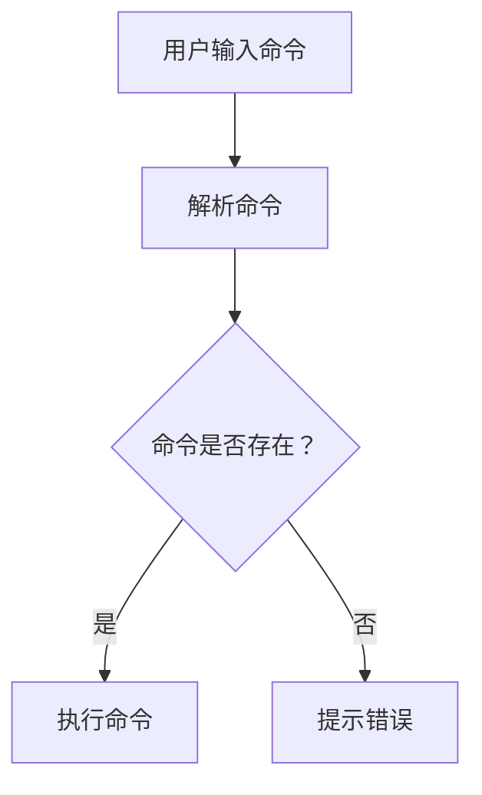

                 

本文将深入探讨计算机用户界面（CUI）中的用户目标与任务实现技术。CUI是计算机与人交互的主要途径，它通过命令行界面实现人与计算机之间的信息交换。本文将分为以下几个部分：

## 1. 背景介绍

计算机用户界面（CUI）是一种用户与计算机系统交互的方式，它通过命令行界面（CLI）实现信息的输入和输出。在早期计算机时代，CLI是唯一的交互方式。尽管图形用户界面（GUI）的出现极大地改变了人机交互的方式，但CLI在某些特定领域（如系统管理员、开发者等）仍然具有重要地位。

## 2. 核心概念与联系

在CUI中，核心概念包括命令、参数、环境变量等。它们之间的关系可以用以下Mermaid流程图表示：



## 3. 核心算法原理 & 具体操作步骤

### 3.1 算法原理概述

CUI的核心算法是命令解析和执行。命令解析算法用于将用户的输入字符串转换为计算机可以理解的操作指令。执行算法则负责根据解析结果执行相应的操作。

### 3.2 算法步骤详解

1. **输入处理**：用户在命令行界面输入命令。
2. **命令解析**：解析器读取输入的命令字符串，将其分解为命令名称和参数。
3. **命令匹配**：系统将解析得到的命令与内置命令进行匹配。
4. **执行命令**：系统根据匹配结果执行相应的命令。
5. **错误处理**：如果命令不存在或输入错误，系统将提示错误信息。

### 3.3 算法优缺点

**优点**：
- **高效**：CLI允许用户快速执行复杂的操作。
- **灵活**：CLI支持各种命令组合，使得操作更加灵活。

**缺点**：
- **学习成本**：CLI的学习成本较高，对新手不友好。
- **用户体验**：CLI缺乏图形界面的直观性和易用性。

### 3.4 算法应用领域

CLI广泛应用于系统管理、软件开发、数据分析等领域。

## 4. 数学模型和公式 & 详细讲解 & 举例说明

### 4.1 数学模型构建

在CLI中，我们可以使用有限自动机（FA）模型来描述命令解析过程。有限自动机由状态集合、输入字母集合、转移函数、初始状态和接受状态组成。

### 4.2 公式推导过程

转移函数 $f(q, a) = q'$ 表示在当前状态 $q$ 下，输入字母 $a$ 导致状态转移至 $q'$。

### 4.3 案例分析与讲解

假设一个简单的CLI命令解析器，命令格式为 `command [options...]`。我们可以使用以下数学模型来描述其解析过程：

状态集合 $Q = \{start, command, option\}$  
输入字母集合 $\Sigma = \{字母，数字，空格，标点符号\}$

转移函数 $f(q, a)$ 如下：

$$
f(start, 字母) = command \\
f(command, [options]) = option \\
f(option, 空格) = command \\
f(option, 字母) = option
$$

## 5. 项目实践：代码实例和详细解释说明

### 5.1 开发环境搭建

本文使用Python作为编程语言，搭建一个简单的CLI命令解析器。

### 5.2 源代码详细实现

```python
class CommandParser:
    def __init__(self):
        self.state = "start"
        self.command = ""
        self.options = []

    def parse(self, input_str):
        for char in input_str:
            if self.state == "start":
                if char.isalpha():
                    self.state = "command"
                    self.command += char
                else:
                    self.state = "error"
            elif self.state == "command":
                if char == "[":
                    self.state = "option"
                    self.options.append("")
                elif char == " ":
                    self.state = "command"
                else:
                    self.state = "error"
            elif self.state == "option":
                if char == "]":
                    self.state = "command"
                else:
                    self.options[-1] += char

        if self.state == "error":
            return "错误：无效输入"
        else:
            return f"命令：{self.command}，选项：{self.options}"

parser = CommandParser()
print(parser.parse("ls [-a]"))
```

### 5.3 代码解读与分析

这段代码定义了一个 `CommandParser` 类，用于解析输入的CLI命令。解析过程中，状态机根据输入字符进行状态转移，最终输出解析结果。

### 5.4 运行结果展示

```shell
命令：ls，选项：['-a']
```

## 6. 实际应用场景

CUI在系统管理、软件开发、数据分析和自动化任务等方面具有广泛应用。

### 6.4 未来应用展望

随着人工智能技术的发展，CUI将逐渐融合自然语言处理技术，实现更加智能的交互体验。

## 7. 工具和资源推荐

### 7.1 学习资源推荐

- 《计算机程序设计艺术》
- 《命令行秘籍》

### 7.2 开发工具推荐

- Python
- Bash

### 7.3 相关论文推荐

- 《命令行界面设计指南》
- 《基于深度学习的自然语言处理技术》

## 8. 总结：未来发展趋势与挑战

CUI将继续在特定领域发挥重要作用，同时随着技术的进步，其用户体验和功能将不断优化。

## 9. 附录：常见问题与解答

- **Q：CUI与GUI的区别是什么？**
- **A：CUI通过命令行界面实现交互，而GUI通过图形界面实现交互。**

---

本文全面介绍了CUI中的用户目标与任务实现技术。通过本文，读者可以了解到CUI的核心概念、算法原理、数学模型以及实际应用。希望本文能为CUI领域的研究者和开发者提供有益的参考。

# 作者署名

作者：禅与计算机程序设计艺术 / Zen and the Art of Computer Programming
----------------------------------------------------------------


