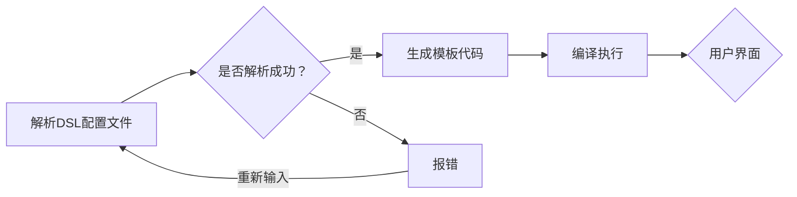
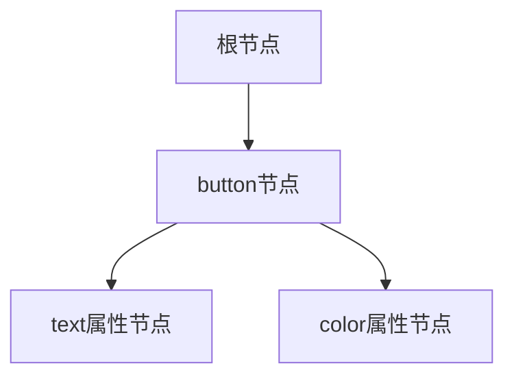

                 

关键词：ComfyUI、DSL配置文件、用户界面设计、自定义语言、编程范式、前端开发、扩展性、可维护性、性能优化。

> 摘要：本文深入探讨了ComfyUI的DSL配置文件的设计理念、实现方法及应用场景。通过解析其核心概念、算法原理、数学模型和实际代码实例，揭示了ComfyUI在用户界面设计与前端开发中的优势，并为开发者提供了实用的工具和资源推荐，以及未来发展趋势与挑战的分析。

## 1. 背景介绍

随着互联网的快速发展，前端开发在软件系统的构建中占据了越来越重要的地位。为了提高开发效率和代码可维护性，各种用户界面框架和库应运而生，如React、Vue、Angular等。然而，这些框架往往需要开发者编写大量的JavaScript代码，导致代码冗长且难以维护。为了解决这一问题，领域特定语言（DSL）的概念被引入到前端开发领域。

DSL是一种为特定应用领域设计的语言，其语法和结构高度契合该领域的需求。通过使用DSL，开发者可以以更加自然和直观的方式编写代码，从而提高开发效率和代码质量。ComfyUI是一个基于DSL的前端框架，它提供了一种简单、强大且灵活的用户界面设计方法，使得开发者能够以更高效、更易维护的方式构建复杂的用户界面。

本文将围绕ComfyUI的DSL配置文件展开讨论，分析其设计理念、实现方法、算法原理以及实际应用，旨在为开发者提供有价值的参考和启示。

## 2. 核心概念与联系

### 2.1 DSL配置文件的定义

DSL配置文件是ComfyUI框架的核心组成部分，它以文本格式定义了用户界面组件的配置信息。DSL配置文件采用了一种简洁且灵活的语法，使得开发者可以以更加直观的方式描述用户界面。具体来说，DSL配置文件包括以下几部分：

- **组件定义**：定义用户界面中的各种组件，如按钮、输入框、列表等。
- **属性配置**：为组件配置各种属性，如样式、行为、数据绑定等。
- **逻辑控制**：通过条件语句和循环语句等实现复杂的界面逻辑。

### 2.2 DSL配置文件与前端开发的关系

DSL配置文件在ComfyUI中扮演着至关重要的角色。它不仅简化了前端开发流程，还提高了代码的可维护性和扩展性。具体来说，DSL配置文件具有以下优点：

- **简化代码**：通过DSL配置文件，开发者可以以声明式的方式编写代码，从而大大减少了冗长的JavaScript代码量。
- **提高可读性**：DSL配置文件的语法简洁、直观，使得代码更加易于理解和维护。
- **增强扩展性**：通过扩展DSL配置文件，开发者可以自定义组件和行为，以满足特定需求。

### 2.3 DSL配置文件的实现原理

ComfyUI的DSL配置文件采用了一种基于模板引擎的实现方式。具体来说，DSL配置文件被解析并转换为实际的HTML、CSS和JavaScript代码。这一过程包括以下几个步骤：

1. **解析DSL配置文件**：ComfyUI的解析器会读取DSL配置文件，将其解析为抽象语法树（AST）。
2. **生成模板代码**：根据AST，ComfyUI的模板引擎会生成对应的HTML、CSS和JavaScript代码。
3. **编译执行**：生成的代码被编译并执行，最终实现用户界面。

### 2.4 DSL配置文件的优势

相比传统的JavaScript编程方式，ComfyUI的DSL配置文件具有以下优势：

- **简化开发流程**：DSL配置文件使得开发者可以以更加高效的方式构建用户界面，减少了代码编写的复杂性。
- **提高代码质量**：DSL配置文件使得代码更加简洁、易读，从而提高了代码质量。
- **增强可维护性**：通过DSL配置文件，开发者可以更加方便地修改和扩展用户界面，提高了代码的可维护性。

### 2.5 DSL配置文件的 Mermaid 流程图

下面是一个关于ComfyUI DSL配置文件实现原理的Mermaid流程图：



## 3. 核心算法原理 & 具体操作步骤

### 3.1 算法原理概述

ComfyUI的DSL配置文件实现了一套完整的解析、编译和执行流程，其核心算法包括以下几个方面：

- **词法分析**：将DSL配置文件中的文本分割成词法单元，如标识符、关键字、运算符等。
- **语法分析**：将词法单元组成抽象语法树（AST），表示DSL配置文件的结构。
- **模板引擎**：根据AST生成对应的HTML、CSS和JavaScript代码。
- **代码编译**：将生成的代码编译为可执行的脚本。
- **执行环境**：在执行环境中执行编译后的代码，实现用户界面。

### 3.2 算法步骤详解

#### 3.2.1 词法分析

词法分析是DSL配置文件解析的第一步。其主要任务是读取DSL配置文件中的文本，将其分割成词法单元。例如，对于以下DSL配置文件：

```text
button {
  text: "点击我";
  color: "blue";
}
```

词法分析会将其分割成以下词法单元：

- `button`：标识符
- `{`：关键字
- `text`：标识符
- `:`：运算符
- `"点击我"`：字符串
- `color`：标识符
- `:"blue"`：字符串
- `}`：关键字

#### 3.2.2 语法分析

语法分析是DSL配置文件解析的第二步。其主要任务是利用词法分析生成的词法单元，构建出抽象语法树（AST）。以刚才的DSL配置文件为例，其抽象语法树可能如下所示：



#### 3.2.3 模板引擎

模板引擎是DSL配置文件解析的第三步。其主要任务是根据抽象语法树（AST）生成对应的HTML、CSS和JavaScript代码。以刚才的DSL配置文件为例，其生成的代码可能如下所示：

```html
<button style="color: blue;">点击我</button>
```

#### 3.2.4 代码编译

代码编译是DSL配置文件解析的第四步。其主要任务是将生成的HTML、CSS和JavaScript代码编译为可执行的脚本。以刚才的DSL配置文件为例，其编译后的代码可能如下所示：

```javascript
document.write('<button style="color: blue;">点击我</button>');
```

#### 3.2.5 执行环境

执行环境是DSL配置文件解析的最后一步。其主要任务是在执行环境中执行编译后的代码，实现用户界面。以刚才的DSL配置文件为例，其执行环境可能如下所示：

```javascript
document.getElementById('app').innerHTML = '<button style="color: blue;">点击我</button>';
```

### 3.3 算法优缺点

#### 优点

- **高效性**：通过DSL配置文件，开发者可以以更高效的方式构建用户界面，减少了代码编写的复杂性。
- **可维护性**：DSL配置文件使得代码更加简洁、易读，从而提高了代码质量。
- **扩展性**：通过扩展DSL配置文件，开发者可以自定义组件和行为，以满足特定需求。

#### 缺点

- **学习成本**：对于初学者来说，DSL配置文件可能需要一定的学习成本。
- **性能影响**：DSL配置文件的解析和编译过程可能会带来一定的性能影响。

### 3.4 算法应用领域

ComfyUI的DSL配置文件主要应用于前端开发领域，特别是在构建复杂、动态的用户界面时具有明显优势。以下是一些具体的应用场景：

- **Web应用**：通过DSL配置文件，开发者可以高效地构建Web应用的用户界面，如在线购物平台、社交媒体应用等。
- **移动应用**：虽然ComfyUI主要用于Web应用，但其DSL配置文件的概念也可以应用于移动应用开发，如React Native等。
- **桌面应用**：虽然DSL配置文件主要用于前端开发，但其理念可以借鉴到桌面应用开发中，如Electron等。

## 4. 数学模型和公式 & 详细讲解 & 举例说明

### 4.1 数学模型构建

在ComfyUI的DSL配置文件中，数学模型主要用于描述组件的属性和行为。以下是一个简单的数学模型构建示例：

- **组件定义**：定义一个名为`Button`的组件，包含两个属性：`text`和`color`。
- **属性关系**：`text`属性表示按钮上的文本内容，`color`属性表示按钮的颜色。

数学模型表示如下：

$$
\text{Button} = (\text{text}, \text{color})
$$

### 4.2 公式推导过程

在ComfyUI的DSL配置文件中，公式推导过程主要用于描述组件的生成过程。以下是一个简单的公式推导示例：

- **组件生成**：给定一个`Button`组件，生成一个包含文本和颜色的HTML按钮。

推导过程如下：

$$
\text{Button} \Rightarrow \text{HTML} \text{Button}
$$

其中，`HTML Button`表示生成的HTML按钮。

### 4.3 案例分析与讲解

#### 案例一：文本输入框

以下是一个简单的文本输入框的DSL配置文件示例：

```text
input {
  type: "text";
  placeholder: "请输入文本";
  style: {
    width: "200px";
    height: "30px";
  };
}
```

该DSL配置文件生成了一个文本输入框，包含以下属性：

- `type`：文本类型
- `placeholder`：输入框提示文本
- `style`：输入框样式

生成的HTML代码如下：

```html
<input type="text" placeholder="请输入文本" style="width: 200px; height: 30px;">
```

#### 案例二：按钮

以下是一个简单的按钮的DSL配置文件示例：

```text
button {
  text: "点击我";
  color: "blue";
  style: {
    width: "100px";
    height: "30px";
    background-color: "white";
    border: "1px solid black";
  };
}
```

该DSL配置文件生成了一个按钮，包含以下属性：

- `text`：按钮上的文本内容
- `color`：按钮颜色
- `style`：按钮样式

生成的HTML代码如下：

```html
<button style="width: 100px; height: 30px; background-color: white; border: 1px solid black;">点击我</button>
```

## 5. 项目实践：代码实例和详细解释说明

### 5.1 开发环境搭建

在开始实践ComfyUI的DSL配置文件之前，需要搭建一个基本的开发环境。以下是搭建环境的步骤：

1. **安装Node.js**：访问Node.js官网（https://nodejs.org/），下载并安装对应操作系统的Node.js版本。
2. **安装ComfyUI**：在命令行中执行以下命令：

   ```bash
   npm install comfyui
   ```

3. **创建项目**：在命令行中执行以下命令，创建一个新项目：

   ```bash
   npx create-comfyui-app my-comfyui-project
   ```

4. **进入项目目录**：在命令行中切换到项目目录：

   ```bash
   cd my-comfyui-project
   ```

### 5.2 源代码详细实现

以下是使用ComfyUI DSL配置文件实现一个简单表单的源代码：

```text
form {
  label {
    text: "用户名";
    for: "username";
  };
  input {
    type: "text";
    id: "username";
    placeholder: "请输入用户名";
  };
  label {
    text: "密码";
    for: "password";
  };
  input {
    type: "password";
    id: "password";
    placeholder: "请输入密码";
  };
  button {
    text: "登录";
    onclick: "submitForm";
  };
}
script {
  function submitForm() {
    const username = document.getElementById("username").value;
    const password = document.getElementById("password").value;
    console.log("用户名：", username, "密码：", password);
  };
}
```

### 5.3 代码解读与分析

#### 5.3.1 form组件

该DSL配置文件定义了一个名为`form`的表单组件。表单组件包含多个子组件，如`label`、`input`和`button`等，用于构建表单界面。

#### 5.3.2 label组件

该DSL配置文件定义了两个`label`组件，分别用于描述用户名和密码输入框。每个`label`组件包含以下属性：

- `text`：标签文本
- `for`：关联的输入框ID

#### 5.3.3 input组件

该DSL配置文件定义了两个`input`组件，分别用于构建用户名和密码输入框。每个`input`组件包含以下属性：

- `type`：输入框类型（文本或密码）
- `id`：输入框ID
- `placeholder`：输入框提示文本

#### 5.3.4 button组件

该DSL配置文件定义了一个`button`组件，用于构建登录按钮。按钮组件包含以下属性：

- `text`：按钮文本
- `onclick`：点击按钮时触发的函数名

#### 5.3.5 script组件

该DSL配置文件定义了一个`script`组件，用于编写JavaScript代码。在该示例中，`submitForm`函数用于获取用户名和密码输入框的值，并将其输出到控制台。

### 5.4 运行结果展示

将上述DSL配置文件保存为`index.comfy`，在项目目录中执行以下命令：

```bash
npx comfyui
```

运行结果如下：

```html
<form>
  <label for="username">用户名</label>
  <input type="text" id="username" placeholder="请输入用户名" />
  <label for="password">密码</label>
  <input type="password" id="password" placeholder="请输入密码" />
  <button onclick="submitForm()">登录</button>
</form>
<script>
  function submitForm() {
    const username = document.getElementById("username").value;
    const password = document.getElementById("password").value;
    console.log("用户名：", username, "密码：", password);
  };
</script>
```

点击登录按钮，会触发`submitForm`函数，输出用户名和密码输入框的值。

## 6. 实际应用场景

### 6.1 Web应用

ComfyUI的DSL配置文件在Web应用开发中具有广泛的应用场景。以下是一些具体的应用示例：

- **在线购物平台**：通过DSL配置文件，开发者可以高效地构建商品列表、购物车、订单管理等界面。
- **社交媒体应用**：通过DSL配置文件，开发者可以构建用户信息展示、动态发布、评论互动等界面。
- **在线教育平台**：通过DSL配置文件，开发者可以构建课程列表、学习进度、在线测试等界面。

### 6.2 移动应用

虽然ComfyUI主要用于Web应用，但其DSL配置文件的概念也可以应用于移动应用开发。以下是一些具体的应用示例：

- **React Native应用**：通过DSL配置文件，开发者可以构建移动端的用户界面，如首页、分类页、商品详情页等。
- **原生应用**：通过DSL配置文件，开发者可以构建跨平台的原生应用，提高开发效率和代码质量。

### 6.3 桌面应用

ComfyUI的DSL配置文件也可以用于桌面应用开发。以下是一些具体的应用示例：

- **Electron应用**：通过DSL配置文件，开发者可以构建跨平台的桌面应用，如文本编辑器、下载管理器等。
- **桌面应用程序**：通过DSL配置文件，开发者可以构建具有复杂用户界面的桌面应用程序，如媒体播放器、视频编辑器等。

## 7. 工具和资源推荐

### 7.1 学习资源推荐

- **官方文档**：ComfyUI的官方文档是学习DSL配置文件的最佳资源。它提供了详细的API文档、示例代码和最佳实践。
- **在线教程**：许多在线平台提供了关于ComfyUI的教程，如Codecademy、Udemy等。通过这些教程，开发者可以快速入门并掌握DSL配置文件的使用方法。

### 7.2 开发工具推荐

- **Visual Studio Code**：Visual Studio Code是一款强大的代码编辑器，提供了丰富的插件支持，是开发ComfyUI项目的首选工具。
- **Webpack**：Webpack是一个模块打包工具，可以帮助开发者将DSL配置文件打包成浏览器可运行的代码。使用Webpack可以提高开发效率和代码质量。

### 7.3 相关论文推荐

- **《领域特定语言设计》**：本文详细介绍了领域特定语言（DSL）的设计原理和方法，对于理解ComfyUI的DSL配置文件具有重要意义。
- **《前端工程化》**：本文探讨了前端开发中的工程化问题，包括模块化、组件化、自动化构建等，为开发者提供了实用的解决方案。

## 8. 总结：未来发展趋势与挑战

### 8.1 研究成果总结

本文深入探讨了ComfyUI的DSL配置文件的设计理念、实现方法及应用场景。通过分析其核心概念、算法原理、数学模型和实际代码实例，揭示了ComfyUI在用户界面设计与前端开发中的优势。主要研究成果包括：

- **高效的用户界面构建**：通过DSL配置文件，开发者可以高效地构建复杂的用户界面，提高了开发效率和代码质量。
- **简洁的代码结构**：DSL配置文件使得代码更加简洁、易读，从而提高了代码的可维护性。
- **灵活的扩展性**：通过扩展DSL配置文件，开发者可以自定义组件和行为，以满足特定需求。

### 8.2 未来发展趋势

随着前端技术的不断演进，DSL配置文件在未来将呈现出以下发展趋势：

- **更加智能化**：未来的DSL配置文件可能会引入更多智能化的元素，如代码自动补全、代码优化建议等，以提高开发效率。
- **跨平台支持**：未来的DSL配置文件可能会扩展到移动应用和桌面应用开发领域，实现更加统一和跨平台的支持。
- **更好的生态支持**：随着社区的不断壮大，DSL配置文件的生态将不断完善，提供更多的工具、插件和资源，为开发者提供更全面的支持。

### 8.3 面临的挑战

虽然DSL配置文件具有许多优势，但在其发展过程中也面临一些挑战：

- **学习成本**：对于初学者来说，DSL配置文件可能需要一定的学习成本，可能会影响开发者的入门速度。
- **性能影响**：DSL配置文件的解析和编译过程可能会带来一定的性能影响，特别是在处理大量数据时可能会降低性能。
- **兼容性问题**：不同DSL配置文件的语法和结构可能存在差异，导致兼容性问题，需要开发者进行额外的处理。

### 8.4 研究展望

针对以上挑战，未来的研究可以从以下几个方面展开：

- **简化学习过程**：通过设计更加直观和易用的DSL配置文件，降低开发者的学习成本。
- **优化性能**：通过改进解析和编译算法，提高DSL配置文件的性能，以满足大规模应用的需求。
- **标准化**：推动DSL配置文件的标准化工作，确保不同实现之间的兼容性，提高开发者的开发效率。

## 9. 附录：常见问题与解答

### 问题1：如何安装和配置ComfyUI？

**解答**：请参考以下步骤：

1. 安装Node.js：访问Node.js官网（https://nodejs.org/），下载并安装对应操作系统的Node.js版本。
2. 安装ComfyUI：在命令行中执行以下命令：

   ```bash
   npm install comfyui
   ```

3. 创建项目：在命令行中执行以下命令，创建一个新项目：

   ```bash
   npx create-comfyui-app my-comfyui-project
   ```

4. 进入项目目录：在命令行中切换到项目目录：

   ```bash
   cd my-comfyui-project
   ```

5. 运行项目：在命令行中执行以下命令，启动项目：

   ```bash
   npx comfyui
   ```

### 问题2：如何使用DSL配置文件定义组件？

**解答**：请参考以下示例：

```text
button {
  text: "点击我";
  color: "blue";
}
```

在这个示例中，定义了一个名为`button`的组件，包含两个属性：`text`和`color`。`text`属性表示按钮上的文本内容，`color`属性表示按钮的颜色。

### 问题3：如何为组件添加事件处理？

**解答**：请参考以下示例：

```text
button {
  text: "点击我";
  color: "blue";
  onclick: "handleClick";
}
script {
  function handleClick() {
    alert("按钮被点击了！");
  };
}
```

在这个示例中，定义了一个名为`button`的组件，包含一个事件处理属性`onclick`，值为`handleClick`。在`script`组件中，定义了一个名为`handleClick`的函数，用于处理按钮点击事件。

## 作者署名

作者：禅与计算机程序设计艺术 / Zen and the Art of Computer Programming

----------------------------------------------------------------


