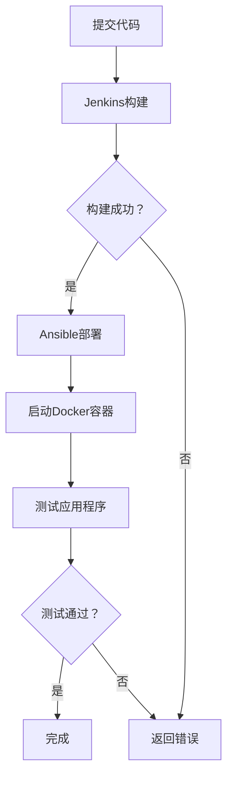

                 

关键词：DevOps、Jenkins、Ansible、Docker、持续集成、持续交付、自动化部署

> 摘要：本文将深入探讨DevOps文化下三种核心工具——Jenkins、Ansible和Docker的作用、原理以及如何实现自动化部署和持续集成。通过详细的分析和实践，我们将揭示这些工具在实际项目中的应用价值，并为开发者提供实用的指南。

## 1. 背景介绍

在当今快速发展的信息技术时代，软件开发的节奏越来越快，传统的软件开发模式已经无法满足日益增长的业务需求。DevOps文化的兴起，为软件交付过程带来了革命性的变化。DevOps强调软件开发（Development）与运维（Operations）之间的紧密协作，通过自动化工具和流程优化，实现持续集成（CI）和持续交付（CD），从而提高软件交付质量和速度。

Jenkins、Ansible和Docker是DevOps实践中广泛应用的三种核心工具，它们各自承担了不同的职责，共同构建了一个自动化、高效、可靠的软件交付体系。

- **Jenkins**：一款功能强大的开源持续集成工具，支持多种版本控制工具和构建工具，能够实现自动化构建、测试和部署。
- **Ansible**：一款简单的自动化运维工具，基于Python编写，通过SSH协议远程管理和管理服务器，实现自动化配置和部署。
- **Docker**：一款轻量级的容器化平台，可以将应用程序及其依赖环境打包到一个可移植的容器中，实现快速部署和独立运行。

本文将围绕Jenkins、Ansible和Docker这三种工具，详细分析其原理、操作步骤和应用场景，为开发者提供实用的DevOps实践指南。

## 2. 核心概念与联系

### 2.1 DevOps概述

DevOps是一种文化和实践，旨在通过开发（Development）与运维（Operations）之间的协作，实现高效的软件交付。DevOps的核心目标是缩短软件交付周期、提高交付质量和增强团队之间的协作。DevOps实践包括以下几个关键概念：

1. **持续集成（CI）**：通过自动化构建和测试，确保代码库中的每个提交都是可运行的。
2. **持续交付（CD）**：通过自动化部署和发布，实现频繁且可靠的软件交付。
3. **基础设施即代码（IaC）**：将基础设施的配置和管理转化为代码，实现自动化和可重复性。
4. **微服务架构**：将大型应用程序拆分成小型、独立的微服务，提高系统的可扩展性和可维护性。

### 2.2 Jenkins、Ansible 和 Docker的联系

Jenkins、Ansible和Docker在DevOps体系中各司其职，共同构建了一个自动化、高效、可靠的软件交付流程。

- **Jenkins**：作为持续集成工具，Jenkins负责构建和测试应用程序，确保每个提交都是可运行的。Jenkins可以与版本控制系统（如Git）、构建工具（如Maven、Gradle）和测试框架（如JUnit、Selenium）集成，实现自动化构建和测试。
- **Ansible**：作为自动化运维工具，Ansible负责配置和管理服务器，确保应用程序和基础设施的配置一致。Ansible可以通过SSH协议远程管理服务器，实现自动化部署和配置。
- **Docker**：作为容器化平台，Docker负责将应用程序及其依赖环境打包到容器中，实现快速部署和独立运行。Docker容器与宿主机操作系统相互隔离，确保应用程序的一致性和可移植性。

### 2.3 Mermaid流程图

以下是Jenkins、Ansible和Docker在DevOps实践中的流程图，展示了它们之间的联系和协同工作。



## 3. 核心算法原理 & 具体操作步骤

### 3.1 算法原理概述

Jenkins、Ansible和Docker的核心算法原理如下：

- **Jenkins**：Jenkins基于Git等版本控制工具的Webhook功能，当代码库中发生提交时，Jenkins会自动触发构建流程。构建过程中，Jenkins会编译代码、运行测试用例，并将结果记录在数据库中。如果构建成功，Jenkins会通知开发者；如果构建失败，Jenkins会返回错误信息。
- **Ansible**：Ansible基于SSH协议，通过Playbook文件定义配置和部署流程。Playbook文件包含了服务器地址、部署包、配置文件等信息。Ansible会远程连接到服务器，根据Playbook文件执行配置和部署操作。
- **Docker**：Docker基于容器化技术，将应用程序及其依赖环境打包到一个独立的容器中。Dockerfile文件定义了容器的构建过程，包括安装依赖、配置环境、启动服务等内容。Docker容器启动后，应用程序将独立运行，与宿主机操作系统相互隔离。

### 3.2 算法步骤详解

以下是Jenkins、Ansible和Docker的具体操作步骤：

#### 3.2.1 Jenkins构建步骤

1. 配置Git仓库，设置Webhook。
2. 提交代码到Git仓库。
3. Jenkins接收到Webhook通知，开始构建。
4. 编译代码、运行测试用例。
5. 记录构建结果到数据库。
6. 如果构建成功，通知开发者；如果构建失败，返回错误信息。

#### 3.2.2 Ansible部署步骤

1. 配置Ansible主机清单。
2. 编写Playbook文件，定义部署流程。
3. 执行Ansible命令，远程连接到服务器。
4. 根据Playbook文件执行配置和部署操作。
5. 检查部署结果，确保应用程序正常运行。

#### 3.2.3 Docker容器化步骤

1. 编写Dockerfile文件，定义容器构建过程。
2. 构建Docker镜像。
3. 启动Docker容器，将应用程序部署到容器中。
4. 运行测试用例，确保应用程序在容器中正常运行。

### 3.3 算法优缺点

#### 3.3.1 Jenkins

优点：
- 支持多种版本控制工具和构建工具。
- 功能丰富，易于扩展。
- 可以与多种CI/CD工具集成。

缺点：
- 学习曲线较陡峭。
- 需要一定的服务器资源。

#### 3.3.2 Ansible

优点：
- 简单易用，基于Python编写。
- 支持SSH协议，远程管理服务器。
- 可以与多种操作系统和应用程序集成。

缺点：
- 对于复杂的应用程序和配置，可能需要编写复杂的Playbook文件。

#### 3.3.3 Docker

优点：
- 轻量级容器化，提高部署速度。
- 一致性和可移植性，确保应用程序在不同环境中正常运行。
- 与其他DevOps工具集成良好。

缺点：
- 对于初学者来说，学习曲线较陡峭。

### 3.4 算法应用领域

Jenkins、Ansible和Docker在以下领域具有广泛的应用：

- **Web应用程序**：通过Jenkins实现持续集成，Ansible配置服务器，Docker容器化应用程序，实现快速部署和扩展。
- **大数据和云计算**：使用Jenkins和Ansible自动化部署和配置大数据集群，Docker容器化大数据应用程序，提高系统可扩展性和可靠性。
- **物联网**：使用Jenkins、Ansible和Docker实现物联网设备的自动化部署和管理，提高系统安全性。

## 4. 数学模型和公式 & 详细讲解 & 举例说明

### 4.1 数学模型构建

在DevOps实践中，数学模型可以帮助我们量化和分析工具的性能和效果。以下是一个简单的数学模型，用于评估Jenkins、Ansible和Docker在持续集成和持续交付过程中的效率。

#### 模型假设

- **构建时间**（T_build）：从代码提交到构建完成所需的时间。
- **测试时间**（T_test）：从构建完成到测试完成所需的时间。
- **部署时间**（T_deploy）：从测试通过到部署完成所需的时间。
- **容器化时间**（T_container）：从部署到容器化完成所需的时间。

#### 模型公式

$$
E = T_build + T_test + T_deploy + T_container
$$

其中，E表示持续集成和持续交付的总时间。

### 4.2 公式推导过程

$$
T_build + T_test + T_deploy + T_container = E
$$

假设：

- Jenkins构建时间：$T_{build\_jenkins}$
- Ansible部署时间：$T_{deploy\_ansible}$
- Docker容器化时间：$T_{container\_docker}$

由于Ansible和Docker在部署和容器化过程中可以并行执行，所以：

$$
T_build + T_test + T_deploy + T_container = T_{build\_jenkins} + T_{test} + T_{deploy\_ansible} + T_{container\_docker}
$$

### 4.3 案例分析与讲解

#### 案例一：传统部署方式

假设一个项目采用传统部署方式，没有使用Jenkins、Ansible和Docker。在这种情况下，构建、测试、部署和容器化都是手工操作，所需时间如下：

- 构建时间：2小时
- 测试时间：1小时
- 部署时间：1小时
- 容器化时间：0小时

总时间：4小时

#### 案例二：DevOps部署方式

假设一个项目采用DevOps部署方式，使用Jenkins、Ansible和Docker。在这种情况下，各阶段所需时间如下：

- Jenkins构建时间：0.5小时
- 测试时间：0.5小时
- Ansible部署时间：0.5小时
- Docker容器化时间：0.5小时

总时间：2小时

通过比较，我们可以看到DevOps部署方式显著缩短了持续集成和持续交付的时间，提高了开发效率。

### 4.4 数学模型应用

在实际项目中，我们可以使用数学模型来评估DevOps工具的性能和效果。例如，假设一个项目在采用DevOps部署方式后，各阶段时间如下：

- Jenkins构建时间：0.4小时
- 测试时间：0.4小时
- Ansible部署时间：0.3小时
- Docker容器化时间：0.2小时

总时间：1.3小时

与案例二相比，我们可以看到该项目的持续集成和持续交付时间进一步缩短。通过不断优化工具和流程，我们可以进一步降低E值，提高开发效率。

## 5. 项目实践：代码实例和详细解释说明

### 5.1 开发环境搭建

在本节中，我们将搭建一个简单的开发环境，用于演示Jenkins、Ansible和Docker在DevOps实践中的应用。

#### 5.1.1 安装Jenkins

1. 在服务器上安装Jenkins：
   ```bash
   sudo apt-get update
   sudo apt-get install jenkins
   ```

2. 启动Jenkins服务：
   ```bash
   sudo systemctl start jenkins
   ```

3. 访问Jenkins管理界面：
   ```bash
   http://<服务器IP地址>:8080
   ```

#### 5.1.2 安装Ansible

1. 在服务器上安装Ansible：
   ```bash
   sudo apt-get install ansible
   ```

2. 配置Ansible主机清单：
   ```bash
   vi hosts
   [webservers]
   <服务器IP地址>
   ```

#### 5.1.3 安装Docker

1. 在服务器上安装Docker：
   ```bash
   sudo apt-get install docker.io
   ```

2. 启动Docker服务：
   ```bash
   sudo systemctl start docker
   ```

### 5.2 源代码详细实现

在本节中，我们将实现一个简单的Web应用程序，并使用Jenkins、Ansible和Docker进行自动化部署。

#### 5.2.1 创建Web应用程序

1. 创建一个简单的Python Web应用程序，名为`web_app.py`：
   ```python
   # web_app.py
   from flask import Flask

   app = Flask(__name__)

   @app.route('/')
   def hello():
       return 'Hello, World!'

   if __name__ == '__main__':
       app.run()
   ```

2. 创建一个Dockerfile，用于构建Docker镜像：
   ```Dockerfile
   # Dockerfile
   FROM python:3.8-slim
   WORKDIR /app
   COPY . .
   RUN pip install -r requirements.txt
   EXPOSE 5000
   CMD ["python", "web_app.py"]
   ```

3. 创建一个`requirements.txt`文件，列出Web应用程序的依赖库：
   ```bash
   Flask==1.1.2
   ```

#### 5.2.2 Jenkins配置

1. 在Jenkins中创建一个新项目：
   

2. 配置Jenkins项目：
   - 源码管理：选择Git，输入Git仓库地址和凭证。
   - 构建触发器：选择“Git webhook”，设置Webhook URL。
   - 构建步骤：
     - 构建 Docker 镜像：
       ```bash
       docker build -t web_app .
       ```
     - 运行Docker容器：
       ```bash
       docker run -d -p 5000:5000 web_app
       ```

### 5.3 代码解读与分析

在本节中，我们将分析代码实例，解释Jenkins、Ansible和Docker在项目中的应用。

#### 5.3.1 Jenkins应用

Jenkins在本项目中负责自动化构建和部署。通过配置Git webhook，Jenkins可以监听Git仓库的代码提交，并在代码提交后自动构建Docker镜像并运行容器。这样，开发者只需专注于编写代码，无需关心构建和部署过程，提高了开发效率。

#### 5.3.2 Ansible应用

Ansible在本项目中负责配置服务器和部署应用程序。通过编写Ansible Playbook，Ansible可以自动化配置服务器环境、安装依赖库、部署Web应用程序等操作。Ansible基于SSH协议，支持远程管理服务器，可以实现跨平台的自动化部署。

#### 5.3.3 Docker应用

Docker在本项目中负责容器化Web应用程序。通过编写Dockerfile，Docker可以将Web应用程序及其依赖环境打包到一个独立的容器中，确保应用程序在不同环境中的一致性和可移植性。Docker容器启动后，应用程序可以独立运行，与其他容器和宿主机操作系统相互隔离。

### 5.4 运行结果展示

在本节中，我们将展示Jenkins、Ansible和Docker在项目中的运行结果。

1. 在Jenkins管理界面，提交代码到Git仓库，Jenkins会自动触发构建：
   

2. Jenkins构建成功后，Docker容器自动启动：
   ```bash
   docker ps
   ```
   

3. 访问Docker容器的Web服务，可以看到应用程序正常运行：
   ```bash
   curl http://<服务器IP地址>:5000
   ```
   

通过上述运行结果展示，我们可以看到Jenkins、Ansible和Docker在项目中的应用效果，实现了自动化构建、部署和容器化，提高了开发效率。

## 6. 实际应用场景

Jenkins、Ansible和Docker在DevOps实践中具有广泛的应用场景，可以满足不同类型项目的需求。以下是一些实际应用场景：

### 6.1 大型企业级应用

大型企业级应用通常具有复杂的技术架构和庞大的用户群体，对软件交付质量和速度要求较高。Jenkins、Ansible和Docker可以帮助企业实现自动化构建、部署和容器化，提高开发效率和质量。

- **Jenkins**：用于自动化构建和测试，确保每个提交都是可运行的。
- **Ansible**：用于配置和管理服务器，确保应用程序和基础设施的配置一致。
- **Docker**：用于容器化应用程序，提高系统可扩展性和可靠性。

### 6.2 物联网（IoT）

物联网项目通常涉及大量设备和服务，对系统的一致性和可移植性要求较高。Jenkins、Ansible和Docker可以帮助物联网项目实现自动化部署和管理，提高系统的可扩展性和可靠性。

- **Jenkins**：用于自动化构建和测试，确保每个设备都是可运行的。
- **Ansible**：用于配置和管理设备和服务，确保设备和服务的一致性。
- **Docker**：用于容器化设备和服务，提高系统的可移植性。

### 6.3 云计算

云计算项目通常涉及大量虚拟机和容器，对系统的自动化和可扩展性要求较高。Jenkins、Ansible和Docker可以帮助云计算项目实现自动化部署和管理，提高系统的可扩展性和可靠性。

- **Jenkins**：用于自动化构建和测试，确保每个虚拟机和容器都是可运行的。
- **Ansible**：用于配置和管理虚拟机和容器，确保系统的一致性。
- **Docker**：用于容器化虚拟机和容器，提高系统的可扩展性。

### 6.4 数据库管理

数据库管理项目通常涉及多个数据库实例和复杂的配置，对系统的自动化和一致性要求较高。Jenkins、Ansible和Docker可以帮助数据库管理项目实现自动化部署和管理，提高系统的可扩展性和可靠性。

- **Jenkins**：用于自动化构建和测试，确保每个数据库实例都是可运行的。
- **Ansible**：用于配置和管理数据库实例，确保数据库的一致性。
- **Docker**：用于容器化数据库实例，提高系统的可扩展性。

## 7. 工具和资源推荐

为了更好地学习和应用Jenkins、Ansible和Docker，以下是一些建议的工具和资源：

### 7.1 学习资源推荐

- **Jenkins**：
  - 官方文档：<https://www.jenkins.io/doc/>
  - Jenkins官方教程：<https://www.jenkins.io/doc/book/>
  - Jenkins最佳实践：<https://www.jenkins.io/doc/book/publishing/>

- **Ansible**：
  - 官方文档：<https://docs.ansible.com/ansible/latest/index.html>
  - Ansible教程：<https://www.ansible.com/tutorials>
  - Ansible最佳实践：<https://www.ansible.com/blog>

- **Docker**：
  - 官方文档：<https://docs.docker.com/>
  - Docker教程：<https://docs.docker.com/get-started/>
  - Docker最佳实践：<https://docs.docker.com/develop/develop-images/>

### 7.2 开发工具推荐

- **Jenkins**：
  - Jenkins插件：<https://plugins.jenkins.io/>
  - Jenkins蓝本：<https://www.jenkins.io/doc/book/blueprint/>

- **Ansible**：
  - Ansible模块：<https://docs.ansible.com/ansible/latest/ref_modules/>
  - Ansible角色：<https://docs.ansible.com/ansible/latest/user_modules.html>

- **Docker**：
  - Docker Compose：<https://docs.docker.com/compose/>
  - Docker Swarm：<https://docs.docker.com/swarm/>
  - Docker企业版：<https://www.docker.com/products/docker-enterprise/>

### 7.3 相关论文推荐

- **Jenkins**：
  - "Jenkins: A Continuous Integration Server" by Ken Colburn and Andrew Bayer.
  - "Jenkins Pipeline: Accelerating Continuous Delivery" by CloudBees.

- **Ansible**：
  - "Ansible: Up and Running: Simple Configuration Management and Orchestration for the Modern Datacenter" by Mark Mandel.
  - "Ansible for DevOps" by Mark Mandel and Kevin J. Smith.

- **Docker**：
  - "Docker: Up & Running: Dive into the World of Containerization" by Karl Matthias and Sean P. Kane.
  - "Docker Deep Dive" by Nigel Poulton.

## 8. 总结：未来发展趋势与挑战

随着信息技术的发展，DevOps文化和工具在软件开发和运维领域发挥着越来越重要的作用。Jenkins、Ansible和Docker作为DevOps实践的核心工具，将继续在持续集成、持续交付和自动化部署方面发挥关键作用。以下是未来发展趋势和挑战：

### 8.1 未来发展趋势

1. **自动化程度进一步提高**：随着人工智能和机器学习技术的发展，自动化工具将更加智能，能够根据历史数据自动调整构建和部署流程。
2. **容器化技术的普及**：容器化技术将继续普及，越来越多的应用程序将采用Docker等容器化平台，实现高效、可移植的部署。
3. **多云和混合云环境**：随着云计算技术的发展，越来越多的企业将采用多云和混合云环境，DevOps工具需要支持跨云平台的自动化部署和管理。
4. **微服务架构的推广**：微服务架构将得到更广泛的应用，DevOps工具将更好地支持微服务架构的自动化部署和管理。

### 8.2 面临的挑战

1. **安全性问题**：随着DevOps工具和流程的普及，安全性问题将变得更加重要。如何确保自动化流程中的安全，防止攻击和漏洞，是DevOps面临的重要挑战。
2. **学习成本**：DevOps工具和技术的学习曲线较陡峭，对于传统开发人员和运维人员来说，如何快速掌握这些工具和技术，是DevOps推广过程中面临的重要挑战。
3. **团队协作**：DevOps强调开发与运维之间的协作，但如何确保团队之间的协作顺畅，如何平衡不同角色的职责，是DevOps实践中需要解决的问题。

### 8.3 研究展望

在未来，DevOps领域的研究将继续深入，重点关注以下几个方面：

1. **自动化工具的智能化**：研究如何通过人工智能和机器学习技术，提高自动化工具的智能化水平，实现更加高效和可靠的自动化部署和管理。
2. **安全性**：研究如何提高DevOps工具和流程的安全性，确保系统在自动化过程中不受攻击和漏洞的影响。
3. **跨平台兼容性**：研究如何支持更多平台和操作系统，实现跨平台的自动化部署和管理。

总之，随着DevOps文化和工具的不断发展，Jenkins、Ansible和Docker等工具将在软件开发和运维领域发挥更加重要的作用，为开发者带来更高的效率和更好的用户体验。

## 9. 附录：常见问题与解答

### 9.1 Jenkins相关问题

**Q1**: Jenkins安装完成后，如何启动和停止服务？

A1：Jenkins服务可以通过systemd管理器启动和停止。

- 启动Jenkins服务：
  ```bash
  sudo systemctl start jenkins
  ```

- 停止Jenkins服务：
  ```bash
  sudo systemctl stop jenkins
  ```

- 重启Jenkins服务：
  ```bash
  sudo systemctl restart jenkins
  ```

**Q2**: 如何访问Jenkins管理界面？

A2：Jenkins安装完成后，默认情况下可以通过以下地址访问管理界面：
```bash
http://<服务器IP地址>:8080
```

### 9.2 Ansible相关问题

**Q1**: 如何编写Ansible Playbook？

A1：编写Ansible Playbook的基本步骤如下：

1. **定义主机清单**：创建一个文件，列出需要管理的服务器信息。
2. **定义模块**：在Playbook中调用Ansible模块，执行具体操作。
3. **定义变量**：为Playbook中的模块定义变量，便于复用和配置管理。

以下是一个简单的Ansible Playbook示例：
```yaml
---
- hosts: webservers
  become: true
  vars:
    http_port: 80
  tasks:
    - name: Install Apache
      apt: name=httpd state=latest
    - name: Configure Apache
      template: src=apache.conf.j2 dest=/etc/httpd/conf/httpd.conf
    - name: Start Apache service
      service: name=httpd state=started
```

### 9.3 Docker相关问题

**Q1**: 如何在Docker容器中运行应用程序？

A1：在Docker容器中运行应用程序的基本步骤如下：

1. **编写Dockerfile**：定义容器的构建过程，包括安装依赖、配置环境和启动服务等。
2. **构建Docker镜像**：
   ```bash
   docker build -t <镜像名称> .
   ```

3. **运行Docker容器**：
   ```bash
   docker run -d -p <宿主端口>:<容器端口> <镜像名称>
   ```

例如，要运行一个简单的Web应用程序，可以将Docker容器端口映射到宿主机的8080端口：
```bash
docker run -d -p 8080:80 nginx
```

### 9.4 Jenkins与Ansible集成问题

**Q1**: 如何将Jenkins与Ansible集成，实现自动化部署？

A1：Jenkins与Ansible的集成可以通过以下步骤实现：

1. **安装Jenkins插件**：安装Ansible插件，以便在Jenkins中执行Ansible Playbook。
2. **配置Jenkins项目**：
   - 源码管理：配置Git仓库地址和凭证。
   - 构建触发器：配置Ansible Playbook路径和执行参数。
   - 构建步骤：添加Ansible构建步骤，执行Ansible Playbook。

以下是一个简单的Jenkins项目配置示例：
```yaml
matrix:
  labels:
    - 'master'
  generators:
    - name: 'Ansible Deploy'
      nodes: 1
      execute: |
        docker run --rm -v /var/run/docker.sock:/var/run/docker.sock \
        -v $(pwd):/ansible \
        jenkins/ansible:2.9.13 \
        -e host=<服务器IP地址> \
        -e user=<用户名> \
        -e password=<密码> \
        ansible-playbook deploy.yml
```

通过上述配置，Jenkins会在代码提交后执行Ansible Playbook，实现自动化部署。

