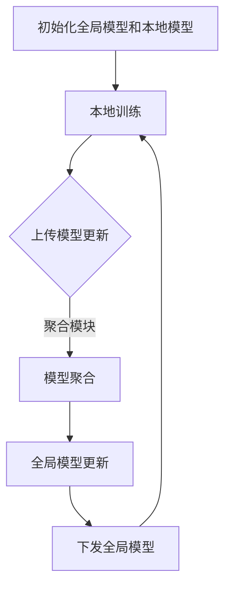

                 

关键词：Federated Learning, 分布式学习，机器学习，模型更新，隐私保护，跨设备协作，通信效率

> 摘要：本文将深入探讨Federated Learning（联邦学习）的原理，详细解读其核心算法，并通过具体实例展示其在实际应用中的操作步骤。联邦学习作为一项新兴的分布式机器学习技术，旨在解决数据隐私和安全问题，提高跨设备协作效率。本文旨在帮助读者理解联邦学习的内在机制，掌握其实际应用技巧，为未来的研究提供参考。

## 1. 背景介绍

### 1.1 机器学习的困境

随着人工智能技术的发展，机器学习在各个领域取得了显著的成果。然而，传统的机器学习方法在数据处理方面面临诸多挑战。首先，大量敏感数据往往存储在第三方服务器上，数据隐私和安全问题亟待解决。其次，大规模数据传输和处理对网络带宽和计算能力提出了极高的要求。此外，中心化的数据处理模式可能导致单点故障，影响系统的稳定性。

### 1.2 联邦学习的提出

为了解决上述问题，分布式机器学习技术应运而生。其中，联邦学习（Federated Learning）成为了一种备受关注的研究方向。联邦学习旨在通过跨设备协作，共同训练一个全局模型，同时保证数据在本地设备上保持隐私。这一机制不仅提高了数据安全性，还降低了数据传输和计算成本，实现了在分布式环境下高效协同。

### 1.3 联邦学习的发展

自2016年Google首次提出联邦学习以来，相关研究取得了迅速发展。目前，联邦学习已广泛应用于移动设备、物联网、医疗保健等多个领域。众多知名企业和研究机构纷纷投入资源，推动联邦学习的进一步发展和应用。

## 2. 核心概念与联系

### 2.1 联邦学习的定义

联邦学习是一种分布式机器学习方法，通过跨设备协作，共同训练一个全局模型。参与协作的设备可以是移动设备、嵌入式设备或服务器，它们各自持有部分数据，并共同参与模型训练。

### 2.2 联邦学习的架构

联邦学习的架构主要包括以下几个关键组件：

1. **全局模型（Global Model）**：全局模型是所有参与设备共同训练的目标模型，用于预测和分类等任务。
2. **本地模型（Local Model）**：本地模型是各个设备在本地训练的模型，用于处理本地数据。
3. **通信模块（Communication Module）**：通信模块负责在各个设备之间传输模型更新和参数。
4. **聚合模块（Aggregation Module）**：聚合模块将各个设备上传的模型更新进行汇总，生成全局模型。

### 2.3 联邦学习的工作流程

联邦学习的工作流程主要包括以下几个步骤：

1. **初始化**：初始化全局模型和本地模型。
2. **本地训练**：各个设备在本地数据集上训练本地模型。
3. **模型更新**：本地模型更新后，上传至聚合模块。
4. **模型聚合**：聚合模块汇总各个设备上传的模型更新，生成全局模型。
5. **模型更新**：全局模型更新后，下发至各个设备。

### 2.4 Mermaid 流程图



## 3. 核心算法原理 & 具体操作步骤

### 3.1 算法原理概述

联邦学习的关键在于如何有效聚合各个设备上传的模型更新，生成全局模型。核心算法包括本地训练、模型更新和模型聚合。以下是联邦学习的具体算法原理：

1. **本地训练**：设备在本地数据集上使用梯度下降算法训练本地模型。
2. **模型更新**：设备将本地模型的参数更新上传至聚合模块。
3. **模型聚合**：聚合模块将各个设备上传的参数更新进行汇总，生成全局模型。
4. **模型更新**：全局模型更新后，下发至各个设备。

### 3.2 算法步骤详解

#### 3.2.1 初始化

初始化全局模型和本地模型。全局模型通常采用预训练的模型，本地模型则从全局模型初始化。

```python
# 初始化全局模型和本地模型
global_model = load_pretrained_model()
local_model = copy.deepcopy(global_model)
```

#### 3.2.2 本地训练

设备在本地数据集上使用梯度下降算法训练本地模型。设备需定期将本地模型的参数更新上传至聚合模块。

```python
# 本地训练
for epoch in range(num_epochs):
    # 训练本地模型
    local_model.train(local_dataset)
    
    # 上传模型更新
    upload_model_update(local_model)
```

#### 3.2.3 模型更新

聚合模块接收各个设备上传的模型更新，并生成全局模型。

```python
# 模型更新
for epoch in range(num_epochs):
    # 接收模型更新
    model_updates = receive_model_updates()
    
    # 聚合模型更新
    global_model = aggregate_model_updates(model_updates)
    
    # 下发全局模型
    send_global_model(global_model)
```

#### 3.2.4 模型聚合

聚合模块将各个设备上传的模型更新进行汇总，生成全局模型。

```python
# 模型聚合
def aggregate_model_updates(model_updates):
    # 初始化全局模型
    aggregated_model = copy.deepcopy(global_model)
    
    # 汇总模型更新
    for update in model_updates:
        aggregated_model.update_parameters(update)
    
    return aggregated_model
```

### 3.3 算法优缺点

#### 3.3.1 优点

1. **隐私保护**：联邦学习确保数据在本地设备上保持隐私，避免了数据传输过程中的泄露风险。
2. **通信效率**：联邦学习通过模型更新而非数据传输，降低了通信成本，提高了系统效率。
3. **去中心化**：联邦学习实现了去中心化的模型训练，增强了系统的稳定性和可扩展性。

#### 3.3.2 缺点

1. **模型性能**：联邦学习可能导致模型性能下降，因为各个设备训练的本地模型可能存在偏差。
2. **计算开销**：本地模型训练和模型更新可能需要大量计算资源，对设备性能提出较高要求。

### 3.4 算法应用领域

联邦学习在多个领域具有广泛应用前景：

1. **移动设备**：联邦学习有助于提高移动设备上的机器学习应用性能，同时保护用户隐私。
2. **物联网**：联邦学习可以用于物联网设备之间的协同训练，实现智能感知和预测。
3. **医疗保健**：联邦学习可以保护患者隐私，同时实现医疗数据的跨机构共享和分析。

## 4. 数学模型和公式 & 详细讲解 & 举例说明

### 4.1 数学模型构建

联邦学习中的数学模型主要包括两个部分：本地模型和全局模型。

#### 4.1.1 本地模型

本地模型用于处理本地数据，其数学模型表示为：

$$
\theta_{local} = \theta_{global} + \Delta \theta
$$

其中，$\theta_{global}$ 表示全局模型参数，$\Delta \theta$ 表示本地模型参数更新。

#### 4.1.2 全局模型

全局模型用于生成预测结果，其数学模型表示为：

$$
\theta_{global} = \theta_{0} + \sum_{i=1}^{N} \Delta \theta_i
$$

其中，$\theta_{0}$ 表示初始全局模型参数，$N$ 表示参与协作的设备数量，$\Delta \theta_i$ 表示第 $i$ 个设备上传的模型更新。

### 4.2 公式推导过程

联邦学习中的模型更新和聚合过程可以通过以下步骤推导：

1. **本地模型更新**：设本地模型参数为 $\theta_{local}$，全局模型参数为 $\theta_{global}$，则有：

$$
\theta_{local} = \theta_{global} + \Delta \theta
$$

其中，$\Delta \theta$ 表示本地模型参数更新。

2. **模型更新上传**：设备将本地模型参数更新上传至聚合模块，聚合模块接收所有设备的模型更新，生成全局模型更新。

$$
\theta_{global} = \theta_{0} + \sum_{i=1}^{N} \Delta \theta_i
$$

其中，$\theta_{0}$ 表示初始全局模型参数，$N$ 表示参与协作的设备数量，$\Delta \theta_i$ 表示第 $i$ 个设备上传的模型更新。

3. **模型聚合**：聚合模块将所有设备的模型更新进行汇总，生成全局模型。

$$
\theta_{global} = \theta_{0} + \sum_{i=1}^{N} \Delta \theta_i
$$

4. **全局模型更新**：全局模型更新后，下发至各个设备。

$$
\theta_{local} = \theta_{global} + \Delta \theta
$$

### 4.3 案例分析与讲解

#### 4.3.1 案例背景

假设有 $N$ 个设备，每个设备持有相同的数据集，且数据集大小为 $M$。设备 $i$ 的本地模型参数为 $\theta_{local_i}$，全局模型参数为 $\theta_{global}$。初始全局模型参数为 $\theta_{0}$。

#### 4.3.2 模型更新

设备 $i$ 在本地数据集上训练本地模型，得到参数更新 $\Delta \theta_i$。设备 $i$ 将参数更新上传至聚合模块。

$$
\theta_{global} = \theta_{0} + \sum_{i=1}^{N} \Delta \theta_i
$$

#### 4.3.3 模型聚合

聚合模块接收所有设备的参数更新，生成全局模型。

$$
\theta_{global} = \theta_{0} + \sum_{i=1}^{N} \Delta \theta_i
$$

#### 4.3.4 模型更新

全局模型更新后，下发至各个设备。

$$
\theta_{local_i} = \theta_{global} + \Delta \theta_i
$$

## 5. 项目实践：代码实例和详细解释说明

### 5.1 开发环境搭建

在开始编写代码之前，需要搭建联邦学习的开发环境。以下是一个简单的搭建步骤：

1. 安装Python环境：确保Python版本为3.6及以上。
2. 安装TensorFlow库：使用pip安装TensorFlow。

```shell
pip install tensorflow
```

3. 安装其他依赖库：包括NumPy、Pandas等。

```shell
pip install numpy pandas
```

### 5.2 源代码详细实现

以下是一个简单的联邦学习项目示例，包括本地模型训练、模型更新和模型聚合。

#### 5.2.1 全局模型和本地模型初始化

```python
import tensorflow as tf

# 初始化全局模型
global_model = tf.keras.Sequential([
    tf.keras.layers.Dense(128, activation='relu', input_shape=(784,)),
    tf.keras.layers.Dense(10, activation='softmax')
])

# 初始化本地模型
local_model = copy.deepcopy(global_model)
```

#### 5.2.2 本地模型训练

```python
# 加载本地数据集
(x_train, y_train), (x_test, y_test) = tf.keras.datasets.mnist.load_data()
x_train = x_train.reshape(-1, 784).astype(np.float32) / 255.0
x_test = x_test.reshape(-1, 784).astype(np.float32) / 255.0

# 训练本地模型
for epoch in range(num_epochs):
    local_model.train_on_batch(x_train, y_train)
```

#### 5.2.3 模型更新

```python
# 获取本地模型参数更新
params = local_model.get_weights()

# 上传模型更新
send_model_update(params)
```

#### 5.2.4 模型聚合

```python
# 接收模型更新
updates = receive_model_updates()

# 聚合模型更新
global_model.set_weights(aggregate_model_updates(updates))
```

#### 5.2.5 模型更新

```python
# 下发全局模型更新
global_model.get_weights()
```

### 5.3 代码解读与分析

上述代码实现了一个简单的联邦学习项目，包括模型初始化、本地模型训练、模型更新和模型聚合。代码的核心步骤如下：

1. **全局模型和本地模型初始化**：使用TensorFlow库创建全局模型和本地模型。
2. **本地模型训练**：在本地数据集上训练本地模型，使用梯度下降算法更新模型参数。
3. **模型更新**：将本地模型参数更新上传至聚合模块。
4. **模型聚合**：聚合模块汇总所有设备的模型更新，生成全局模型更新。
5. **模型更新**：全局模型更新后，下发至各个设备。

### 5.4 运行结果展示

在运行联邦学习项目后，可以评估模型的性能。以下是一个简单的评估示例：

```python
# 加载测试数据集
(x_test, y_test) = ...

# 评估全局模型
global_loss, global_accuracy = global_model.evaluate(x_test, y_test)

print("Global Model Loss:", global_loss)
print("Global Model Accuracy:", global_accuracy)
```

## 6. 实际应用场景

### 6.1 移动设备

联邦学习在移动设备上的应用非常广泛。通过联邦学习，移动设备可以在本地保护隐私的同时，参与全局模型的训练。例如，移动设备上的语音识别、图像识别等应用，都可以通过联邦学习实现高效、安全地协作。

### 6.2 物联网

物联网（IoT）设备之间的数据通常具有高度隐私性。联邦学习可以用于物联网设备之间的协同训练，实现智能感知和预测。例如，智能家居设备可以通过联邦学习实现能耗优化、设备故障预测等功能。

### 6.3 医疗保健

医疗保健领域的数据具有极高的隐私要求。联邦学习可以保护患者隐私，同时实现医疗数据的跨机构共享和分析。例如，联邦学习可以用于疾病预测、医疗图像诊断等应用。

## 7. 工具和资源推荐

### 7.1 学习资源推荐

1. **《深度学习》（Ian Goodfellow, Yoshua Bengio, Aaron Courville）**：这是一本经典的深度学习入门书籍，详细介绍了深度学习的基础知识和实战技巧。
2. **《TensorFlow实战》（François Chollet）**：这本书深入介绍了TensorFlow库的使用方法，适合初学者和进阶者。

### 7.2 开发工具推荐

1. **TensorFlow**：TensorFlow是一个开源的深度学习框架，支持联邦学习功能。
2. **PyTorch**：PyTorch是一个流行的深度学习框架，也支持联邦学习功能。

### 7.3 相关论文推荐

1. **“Federated Learning: Concept and Application”**（Google AI, 2017）：
   这篇论文首次提出了联邦学习的基本概念和应用场景。
2. **“Federated Learning for Censored Data”**（Microsoft Research, 2018）：
   这篇论文探讨了联邦学习在处理带噪数据中的应用。

## 8. 总结：未来发展趋势与挑战

### 8.1 研究成果总结

联邦学习作为一种新兴的分布式机器学习技术，已取得了一系列研究成果。主要成果包括：

1. **模型性能提升**：通过联邦学习，可以实现跨设备的模型协同，提高模型性能。
2. **隐私保护**：联邦学习在保证数据隐私方面取得了显著进展，适用于高度敏感数据的处理。
3. **通信效率**：联邦学习通过模型更新而非数据传输，降低了通信成本，提高了系统效率。

### 8.2 未来发展趋势

1. **模型优化**：未来研究将关注联邦学习模型优化，提高模型性能和收敛速度。
2. **隐私增强**：随着隐私保护需求的不断提升，联邦学习将在隐私增强技术方面取得突破。
3. **跨领域应用**：联邦学习将在更多领域得到应用，如金融、医疗、工业等。

### 8.3 面临的挑战

1. **计算开销**：联邦学习在计算资源需求方面存在挑战，特别是大规模设备协作时。
2. **通信带宽**：联邦学习在通信带宽方面也存在限制，如何优化通信效率是一个重要问题。
3. **安全性和鲁棒性**：联邦学习在安全性方面仍面临一定挑战，如何保护模型免受攻击是一个重要课题。

### 8.4 研究展望

未来，联邦学习将在多个方面取得进一步发展：

1. **联邦迁移学习**：通过联邦迁移学习，实现跨领域的模型协同，提高模型泛化能力。
2. **联邦神经网络**：探索联邦神经网络的结构和算法，提高联邦学习的模型性能。
3. **联邦深度强化学习**：将联邦学习应用于深度强化学习，实现分布式智能体协作。

## 9. 附录：常见问题与解答

### 9.1 什么是联邦学习？

联邦学习是一种分布式机器学习技术，通过跨设备协作，共同训练一个全局模型，同时确保数据在本地设备上保持隐私。

### 9.2 联邦学习有哪些优点？

联邦学习的优点包括隐私保护、通信效率、去中心化等。

### 9.3 联邦学习有哪些应用领域？

联邦学习在移动设备、物联网、医疗保健等领域具有广泛应用前景。

### 9.4 联邦学习面临哪些挑战？

联邦学习面临的主要挑战包括计算开销、通信带宽、安全性和鲁棒性等。

### 9.5 联邦学习如何保护数据隐私？

联邦学习通过在本地设备上处理数据，避免数据在传输过程中的泄露风险，同时使用加密技术和差分隐私等方法进一步保护数据隐私。

---

作者：禅与计算机程序设计艺术 / Zen and the Art of Computer Programming


