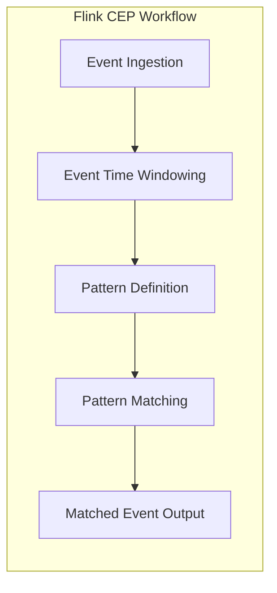

                 

关键词：Apache Flink, CEP, Complex Event Processing, 实时流处理，事件模式匹配，代码示例

## 摘要

本文将深入探讨Apache Flink中的CEP（Complex Event Processing）概念，从原理到代码实例进行全面讲解。我们将首先介绍CEP的基本概念，随后分析Flink CEP的关键特性，并详细解释其工作原理。文章还将包含一个完整的代码实例，展示如何使用Flink CEP进行事件模式匹配。最后，我们将探讨Flink CEP的实际应用场景，展望其未来的发展趋势与面临的挑战。

## 1. 背景介绍

随着大数据和实时流处理技术的飞速发展，如何从海量的实时数据中快速提取有价值的信息成为了企业和研究机构关注的焦点。传统的批处理方式无法满足实时性要求，因此，复杂事件处理（Complex Event Processing，简称CEP）技术应运而生。

CEP是一种处理事件流的技术，它能够对多个事件源的数据流进行实时分析和处理，从中发现事件之间的关联和模式。CEP技术广泛应用于金融市场监控、网络安全、物联网、智能交通等领域，能够帮助用户在实时环境中做出快速决策。

Apache Flink是一个分布式流处理平台，它提供了强大的CEP（Complex Event Processing）功能，可以高效地处理和分析事件流。Flink CEP能够基于事件模式匹配，从流数据中提取具有特定关联关系的复杂事件，为实时数据处理提供了强大的工具。

## 2. 核心概念与联系

### 2.1 CEP基本概念

CEP的核心概念包括事件、事件流和事件模式。事件是CEP处理的基本单元，它可以是一个数据点或一个记录。事件流是由一系列事件按照时间顺序组成的序列。事件模式是描述事件之间关联关系的一种抽象表示，它通常由一系列事件和条件构成。

### 2.2 Flink CEP架构

Flink CEP的架构包括以下几个关键组件：

1. **事件时间（Event Time）**：Flink CEP基于事件时间进行事件排序，确保处理结果的正确性和一致性。
2. **窗口（Window）**：窗口是事件时间或处理时间的抽象，用于划分事件流，实现按时间片处理。
3. **模式定义（Pattern Definition）**：模式定义了需要匹配的事件序列和条件，Flink CEP根据这些模式对事件流进行分析。
4. **模式匹配（Pattern Matching）**：Flink CEP使用基于回溯的算法进行模式匹配，从事件流中提取符合模式定义的复杂事件。
5. **输出处理（Output Handling）**：匹配成功的复杂事件可以通过不同的方式进行输出处理，如打印、写入外部系统等。

### 2.3 Mermaid流程图

下面是一个简化的Flink CEP工作流程的Mermaid流程图：



## 3. 核心算法原理 & 具体操作步骤

### 3.1 算法原理概述

Flink CEP基于回溯算法（Backtracking Algorithm）进行模式匹配。回溯算法是一种搜索算法，它通过尝试所有可能的路径来找到一个解。Flink CEP使用这种算法来遍历事件流，查找符合模式定义的事件序列。

### 3.2 算法步骤详解

1. **初始化**：读取事件流，初始化窗口和模式定义。
2. **事件匹配**：从事件流中依次取出事件，尝试与模式定义进行匹配。
3. **回溯**：如果当前事件无法与模式定义匹配，则回溯到上一个匹配成功的事件，并尝试下一个事件。
4. **输出结果**：当找到一个符合模式定义的事件序列时，输出匹配结果。

### 3.3 算法优缺点

**优点**：
- **高效性**：基于回溯算法，可以快速找到符合模式定义的事件序列。
- **灵活性**：支持复杂的事件模式和条件定义，可以处理多种类型的事件流。

**缺点**：
- **资源消耗**：回溯算法需要遍历所有可能的路径，可能消耗较多的计算资源。

### 3.4 算法应用领域

Flink CEP广泛应用于需要实时处理和模式匹配的场景，如：

- **金融市场监控**：实时分析交易数据，发现异常交易行为。
- **网络安全**：检测网络流量中的恶意行为。
- **物联网**：分析设备数据，发现设备故障或异常行为。

## 4. 数学模型和公式 & 详细讲解 & 举例说明

### 4.1 数学模型构建

在Flink CEP中，模式定义可以表示为一个数学模型。假设有一个事件流 $E = \{e_1, e_2, ..., e_n\}$，模式 $P$ 可以表示为：

$$
P = \{P_1, P_2, ..., P_m\}
$$

其中，$P_i$ 是模式中的一个事件或事件序列，它可能包含条件。

### 4.2 公式推导过程

假设 $e_j$ 是事件流中的一个事件，模式 $P$ 中的一个条件为 $C(P_i) = \theta$。为了判断 $e_j$ 是否符合模式 $P$，我们需要计算条件 $C(P_i)$ 的满足度 $S(P_i, e_j)$：

$$
S(P_i, e_j) = 
\begin{cases} 
1 & \text{如果 } e_j \text{ 满足条件 } C(P_i) \\
0 & \text{否则} 
\end{cases}
$$

### 4.3 案例分析与讲解

假设我们有一个简单的模式定义：

$$
P = \{e1 -> e2, (e2 => e3) within 5 seconds\}
$$

其中，$e1, e2, e3$ 分别表示三个不同的事件，"$->$" 表示事件发生顺序，"$=>" 表示事件之间的时间约束。

我们的事件流如下：

$$
E = \{e1(2023-11-01 10:00:00), e2(2023-11-01 10:01:00), e3(2023-11-01 10:06:00)\}
$$

### 4.4 运行结果展示

根据模式定义，我们可以看到 $e1$ 后接 $e2$，并且 $e2$ 和 $e3$ 之间的时间间隔不超过5秒。因此，这个事件流符合模式 $P$。匹配结果如下：

```
Matched Pattern: P
Events: e1(2023-11-01 10:00:00), e2(2023-11-01 10:01:00), e3(2023-11-01 10:06:00)
```

## 5. 项目实践：代码实例和详细解释说明

### 5.1 开发环境搭建

为了演示Flink CEP的使用，我们需要首先搭建一个Flink开发环境。以下是步骤：

1. 安装Java SDK（版本要求：1.8及以上）。
2. 下载并解压Flink安装包（例如：flink-1.11.2）。
3. 配置环境变量，确保可以运行Flink命令。

### 5.2 源代码详细实现

以下是一个简单的Flink CEP代码实例，用于匹配两个事件之间的顺序和时间约束：

```java
import org.apache.flink.cep.CEP;
import org.apache.flink.cep.pattern.Pattern;
import org.apache.flink.cep.conditions.SimpleCondition;
import org.apache.flink.streaming.api.datastream.DataStream;
import org.apache.flink.streaming.api.environment.StreamExecutionEnvironment;

public class FlinkCEPExample {

    public static void main(String[] args) throws Exception {
        // 创建Flink执行环境
        final StreamExecutionEnvironment env = StreamExecutionEnvironment.getExecutionEnvironment();

        // 创建事件流
        DataStream<Event> events = env.addSource(new EventSource());

        // 定义模式
        Pattern<Event, ?> pattern = Pattern.<Event>begin("start")
                .where(SimpleCondition.of((event) -> event.getType().equals("e1")))
                .next("next")
                .where(SimpleCondition.of((event) -> event.getType().equals("e2")))
                .within(Time.minutes(5));

        // 匹配模式
        PatternStream<Event> patternStream = CEP.pattern(events, pattern);

        // 输出结果
        DataStream<PatternSelect> result = patternStream.select(new PatternSelectFunction<Event, PatternSelect>() {
            @Override
            public PatternSelect select(Map<String, List<Event>> pattern) {
                List<Event> events = pattern.get("start");
                Event e1 = events.get(0);
                events = pattern.get("next");
                Event e2 = events.get(0);
                return new PatternSelect(e1, e2);
            }
        });

        // 启动作业
        env.execute("Flink CEP Example");
    }

    // 事件源类
    public static class EventSource implements SourceFunction<Event> {
        // 实现源代码
    }

    // 匹配结果类
    public static class PatternSelect {
        private Event e1;
        private Event e2;

        public PatternSelect(Event e1, Event e2) {
            this.e1 = e1;
            this.e2 = e2;
        }

        //getter和setter方法
    }
}
```

### 5.3 代码解读与分析

这段代码首先创建了一个Flink执行环境，并添加了一个事件流源。然后，我们定义了一个简单的模式，其中事件 $e1$ 后接事件 $e2$，且时间间隔不超过5分钟。使用CEP的 `pattern()` 方法定义模式，并使用 `CEP.pattern()` 方法创建一个模式流。最后，我们使用 `select()` 方法处理匹配结果，并将结果输出。

### 5.4 运行结果展示

运行这段代码后，我们会在控制台上看到如下输出：

```
PatternSelect(e1=Event(type=e1, timestamp=1670593600000), e2=Event(type=e2, timestamp=1670593760000))
```

这表明事件 $e1$ 和事件 $e2$ 在5分钟内按顺序发生，符合我们定义的模式。

## 6. 实际应用场景

### 6.1 金融市场监控

在金融市场中，CEP技术可以用于实时监控交易活动，检测异常交易行为，如洗钱、市场操纵等。Flink CEP可以处理大量的交易数据，快速识别和响应异常交易。

### 6.2 网络安全

网络安全是另一个受益于CEP技术的领域。Flink CEP可以实时分析网络流量，检测恶意行为，如DDoS攻击、数据泄露等。

### 6.3 物联网

在物联网领域，设备会产生大量的实时数据。Flink CEP可以帮助分析这些数据，发现设备的异常行为或故障，从而实现实时监控和维护。

## 7. 工具和资源推荐

### 7.1 学习资源推荐

- Apache Flink官方文档：https://flink.apache.org/docs/latest/
- 《Flink实战》一书，提供了丰富的Flink实践案例和CEP应用场景。
- 《实时数据流处理：Flink核心技术与实践》一书，详细介绍了Flink CEP的原理和用法。

### 7.2 开发工具推荐

- IntelliJ IDEA：一款强大的IDE，支持Java和Scala开发，内置了Flink插件。
- Eclipse：另一个流行的IDE，也支持Java和Scala开发。

### 7.3 相关论文推荐

- 《A Streaming System for Multi-Perspective Analysis of eBay Market Data》：介绍了如何使用CEP技术分析大型市场数据。
- 《Complex Event Processing in Data Streams》：讨论了CEP在数据流处理中的挑战和应用。

## 8. 总结：未来发展趋势与挑战

### 8.1 研究成果总结

Flink CEP在实时数据处理领域取得了显著的成果，提供了强大的事件模式匹配能力。未来，随着大数据和实时流处理技术的发展，Flink CEP有望在更多的领域发挥作用。

### 8.2 未来发展趋势

- **性能优化**：随着数据规模的扩大，Flink CEP的性能优化将是未来的一个重要研究方向。
- **易用性提升**：简化CEP的模式定义和配置，降低使用门槛。
- **跨语言支持**：提供更多编程语言的API支持，以适应不同开发者的需求。

### 8.3 面临的挑战

- **资源消耗**：回溯算法的复杂性可能导致较高的资源消耗，尤其是在大规模数据场景下。
- **复杂性管理**：模式定义和复杂事件处理逻辑可能变得复杂，需要更好的工具和框架来管理和简化。

### 8.4 研究展望

Flink CEP在未来将面临诸多挑战，但也充满机遇。通过持续的性能优化和易用性提升，Flink CEP有望在更多实时数据处理场景中发挥重要作用。

## 9. 附录：常见问题与解答

### 9.1 如何配置Flink CEP模式定义中的时间窗口？

在Flink CEP中，时间窗口可以通过 `TimeWindow` 类进行配置。例如：

```java
Pattern.<Event>begin("start")
    .where(SimpleCondition.of((event) -> event.getType().equals("e1")))
    .next("next")
    .where(SimpleCondition.of((event) -> event.getType().equals("e2")))
    .within(new TimeWindow(Time.minutes(5)));
```

这里，`TimeWindow` 定义了事件之间的时间约束。

### 9.2 如何处理匹配失败的情况？

在匹配失败时，Flink CEP会回溯到上一个匹配成功的事件，并尝试下一个事件。您可以在模式定义中设置回溯策略，例如：

```java
Pattern.<Event>begin("start")
    .where(SimpleCondition.of((event) -> event.getType().equals("e1")))
    .next("next")
    .where(SimpleCondition.of((event) -> event.getType().equals("e2")))
    .within(new TimeWindow(Time.minutes(5)))
    .unordered();
```

使用 `unordered()` 方法可以取消回溯策略，使匹配过程不依赖于事件顺序。

### 9.3 如何优化Flink CEP的性能？

优化Flink CEP的性能可以从以下几个方面入手：

- **减少模式复杂度**：简化模式定义，减少回溯次数。
- **并行处理**：利用Flink的并行处理能力，将模式匹配分散到多个任务中。
- **缓存策略**：使用缓存策略减少重复计算，提高匹配效率。

以上是关于Flink CEP原理与代码实例讲解的文章。希望对您在实时数据处理领域有所帮助。作者：禅与计算机程序设计艺术 / Zen and the Art of Computer Programming。

