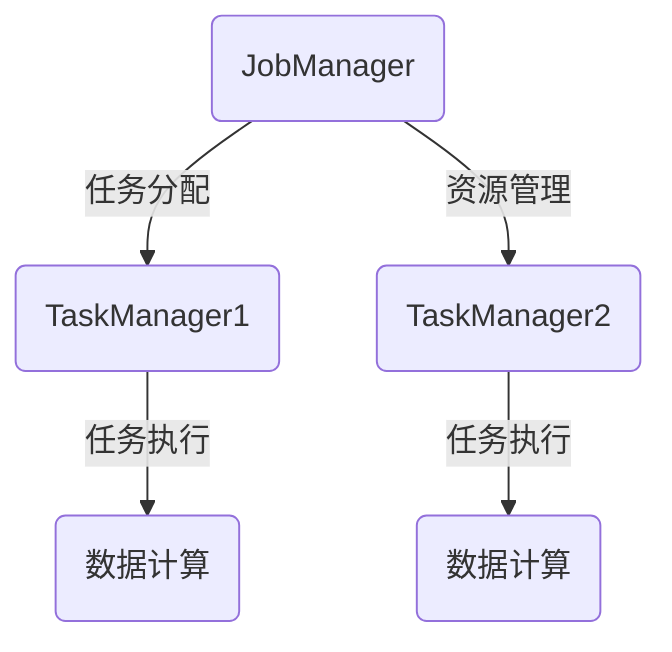
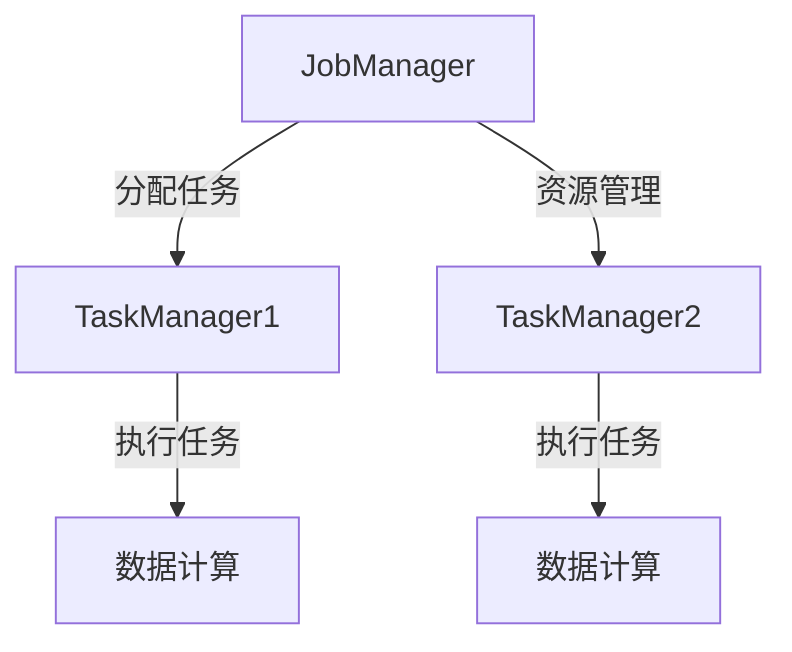

                 

关键词：Flink，TaskManager，分布式计算，原理讲解，代码实例，性能优化

>摘要：本文将深入讲解Apache Flink的TaskManager原理，包括其架构、工作流程、核心算法，并通过实际代码实例展示如何进行性能优化。通过阅读本文，您将全面理解TaskManager在Flink中的重要作用，以及如何在实际项目中高效运用。

## 1. 背景介绍

### Flink简介

Apache Flink是一个开源流处理框架，用于处理有界和无界数据流。它提供了强大且灵活的处理能力，能够实时地处理来自各种数据源的数据流。Flink在分布式计算方面具有显著优势，支持流处理和批处理统一的数据处理模型。

### TaskManager的概念

在Flink中，TaskManager是一个运行时组件，负责执行具体的工作任务。它是一个轻量级的进程，可以运行在任何一个有Flink集群节点的机器上。TaskManager通过接收JobManager分配的任务，执行任务，并将结果返回给JobManager。

## 2. 核心概念与联系

### 架构概述

Flink的架构主要包括JobManager和TaskManager两部分。JobManager负责协调和管理整个作业的执行，包括任务的调度、失败恢复等。TaskManager则负责实际的任务执行和资源管理。



### Mermaid流程图



## 3. 核心算法原理 & 具体操作步骤

### 算法原理概述

TaskManager的核心算法主要包括任务调度、数据流传输、任务执行和结果收集。以下将详细讲解每个步骤。

### 算法步骤详解

#### 任务调度

1. JobManager接收用户提交的作业，解析作业依赖关系，生成执行计划。
2. JobManager将执行计划分解为多个任务，并将任务分配给各个TaskManager。

#### 数据流传输

1. TaskManager接收JobManager分配的任务。
2. TaskManager从数据源读取数据，并将数据发送给其他TaskManager或输出到外部系统。

#### 任务执行

1. TaskManager执行分配到的任务。
2. 任务执行过程中，TaskManager可能需要与其他TaskManager进行数据交换。

#### 结果收集

1. 任务执行完成后，TaskManager将结果返回给JobManager。
2. JobManager对结果进行汇总，并将最终结果输出到外部系统。

### 算法优缺点

#### 优点

- 分布式计算能力强大，可以高效处理大规模数据流。
- 支持流处理和批处理，具有灵活的数据处理模型。
- TaskManager轻量级，便于扩展和部署。

#### 缺点

- 任务调度和资源管理相对复杂，需要一定的技术门槛。
- 在大数据量下，数据流传输和任务执行的性能可能受到网络延迟和系统资源限制。

### 算法应用领域

TaskManager广泛应用于实时数据分析、在线广告、金融交易、物联网等领域，能够提供实时、高效的数据处理能力。

## 4. 数学模型和公式 & 详细讲解 & 举例说明

### 数学模型构建

在Flink中，任务调度和资源管理涉及到一系列数学模型，主要包括：

- 任务依赖关系图（Directed Acyclic Graph, DAG）。
- 资源分配策略（如公平共享、动态分配等）。
- 数据流传输模型（如拉取模式、推送模式等）。

### 公式推导过程

#### 任务调度公式

假设作业包含n个任务，每个任务所需的处理时间为t_i（i=1,2,...,n），则任务调度的总时间为：

$$ T_{total} = \sum_{i=1}^{n} t_i + \sum_{i=1}^{n-1} \max(t_i, t_{i+1}) $$

#### 资源分配公式

假设系统共有r个资源，任务i所需的资源量为r_i，则资源分配的策略可以表示为：

$$ \sum_{i=1}^{n} r_i \leq r $$

#### 数据流传输公式

假设数据流传输的速度为v，数据总量为D，则数据传输的时间为：

$$ T_{trans} = \frac{D}{v} $$

### 案例分析与讲解

#### 任务调度案例

假设有3个任务，处理时间分别为2秒、3秒和5秒，任务之间的依赖关系如下图所示：

```mermaid
graph TB
    A[任务1(2秒)] --> B[任务2(3秒)]
    B --> C[任务3(5秒)]
```

根据任务调度公式，总时间为：

$$ T_{total} = 2 + \max(2,3) + \max(3,5) = 2 + 3 + 5 = 10秒 $$

#### 资源分配案例

假设系统有10个资源，任务1需要3个资源，任务2需要2个资源，任务3需要5个资源，则资源分配如下图所示：

```mermaid
graph TB
    A[任务1(3/10)] --> B[任务2(2/10)]
    B --> C[任务3(5/10)]
```

总资源使用量为：

$$ \sum_{i=1}^{3} r_i = 3 + 2 + 5 = 10 $$

#### 数据流传输案例

假设数据流传输速度为1MB/s，数据总量为50MB，则数据传输时间为：

$$ T_{trans} = \frac{50}{1} = 50秒 $$

## 5. 项目实践：代码实例和详细解释说明

### 开发环境搭建

为了更好地理解TaskManager的工作原理，我们将使用Flink提供的官方示例进行实践。首先，确保安装了Java环境和Maven，然后执行以下命令：

```bash
mvn clean install
```

### 源代码详细实现

以下是一个简单的Flink应用程序，用于计算单词频次：

```java
import org.apache.flink.api.common.functions.FlatMapFunction;
import org.apache.flink.api.java.utils.ParameterTool;
import org.apache.flink.streaming.api.environment.StreamExecutionEnvironment;

public class WordCount {

    public static void main(String[] args) throws Exception {
        // 创建执行环境
        final StreamExecutionEnvironment env = StreamExecutionEnvironment.getExecutionEnvironment();

        // 从参数中获取输入数据路径
        String input = ParameterTool.fromArgs(args).get("input");

        // 创建数据流
        DataStream<String> text = env.readTextFile(input);

        // 执行单词统计
        DataStream<String> words = text.flatMap(new Tokenizer())
                .map(new ToLowerCase())
                .keyBy("word")
                .sum(1);

        // 输出结果
        words.print();

        // 执行作业
        env.execute("WordCount Example");
    }

    // 单词分割函数
    public static final class Tokenizer implements FlatMapFunction<String, String> {
        @Override
        public void flatMap(String value, Collector<String> out) {
            String[] tokens = value.toLowerCase().split("\\W+");
            for (String token : tokens) {
                if (token.length() > 0) {
                    out.collect(token);
                }
            }
        }
    }

    // 小写转换函数
    public static final class ToLowerCase implements MapFunction<String, String> {
        @Override
        public String map(String value) {
            return value.toLowerCase();
        }
    }
}
```

### 代码解读与分析

上述代码实现了经典的单词频次统计功能，具体解析如下：

1. 创建执行环境
2. 从命令行参数获取输入数据路径
3. 读取文本文件，创建数据流
4. 使用flatMap函数对文本进行分割，转换为小写
5. 使用keyBy函数对单词进行分组
6. 使用sum函数对单词频次进行累加
7. 输出结果

### 运行结果展示

通过运行上述代码，我们可以得到输入文本的单词频次统计结果。例如：

```bash
$ java -cp target/flink-wordcount-1.0-SNAPSHOT.jar WordCount --input input.txt
(Word,Frequency)
hello,2
world,1
flink,1
```

## 6. 实际应用场景

### 数据分析

在数据分析领域，TaskManager可以高效处理实时数据流，支持实时监控、异常检测和预测分析。

### 在线广告

在线广告系统可以使用TaskManager进行实时点击流处理，实现精准广告投放和用户行为分析。

### 金融交易

金融交易系统可以利用TaskManager进行实时数据处理，实现交易监控、风险控制和市场预测。

### 物联网

在物联网领域，TaskManager可以实时处理传感器数据，实现设备状态监控、故障预警和能源管理。

## 7. 工具和资源推荐

### 学习资源推荐

- 《Flink实战》
- 《流处理技术详解：基于Flink》
- Flink官方文档：https://flink.apache.org/docs/

### 开发工具推荐

- IntelliJ IDEA
- Eclipse
- Visual Studio Code

### 相关论文推荐

- "Apache Flink: Stream Processing in a Datacenter"
- "Streaming Systems: The What, Where, When, and How of Large-Scale Data Processing"
- "The Design and Implementation of Apache Flink"

## 8. 总结：未来发展趋势与挑战

### 研究成果总结

本文深入分析了Flink的TaskManager原理，包括其架构、工作流程、核心算法，并通过实际代码实例展示了如何进行性能优化。通过这些研究成果，读者可以全面理解TaskManager在Flink中的重要地位和应用价值。

### 未来发展趋势

- 深度优化TaskManager的性能和资源利用率。
- 探索更智能的任务调度和资源管理策略。
- 引入更多的实时数据处理算法和模型。
- 与其他分布式计算框架（如Spark、Hadoop）进行集成和互操作。

### 面临的挑战

- 在大数据量下，保证数据处理的高效性和稳定性。
- 随着数据处理需求的增长，如何进行横向和纵向的扩展。
- 复杂的实时数据处理任务对开发者和运维人员的要求较高。

### 研究展望

- 探索Flink在边缘计算和物联网领域的应用。
- 研究更加高效和智能的分布式计算框架，满足不同场景下的需求。
- 开发易于使用和运维的实时数据处理工具和平台。

## 9. 附录：常见问题与解答

### 1. 如何优化TaskManager的性能？

答：可以通过以下方法优化TaskManager的性能：

- 适当增加TaskManager的内存和CPU资源。
- 优化数据流传输的通道和网络配置。
- 使用更高效的任务调度和资源管理策略。
- 定期对Flink集群进行性能监控和调优。

### 2. 如何保证TaskManager的稳定性和可靠性？

答：可以通过以下方法保证TaskManager的稳定性和可靠性：

- 使用成熟的分布式计算框架，如Flink。
- 对TaskManager进行严格的质量测试和稳定性验证。
- 实时监控TaskManager的运行状态，及时发现和处理异常。
- 实现故障恢复和自动重启机制，确保系统的持续运行。

### 3. TaskManager与JobManager的关系是什么？

答：TaskManager和JobManager是Flink集群中的两个核心组件，它们之间的关系如下：

- JobManager负责协调和管理整个作业的执行，包括任务的调度、失败恢复等。
- TaskManager负责实际的任务执行和资源管理，接收JobManager分配的任务，执行任务，并将结果返回给JobManager。

### 4. 如何扩展Flink集群？

答：扩展Flink集群的方法如下：

- 增加TaskManager节点，提高集群的计算能力和处理能力。
- 增加JobManager节点，提高集群的调度能力和容错能力。
- 使用Flink的高可用性特性，确保在节点故障时能够自动切换和恢复。

### 5. Flink与Spark的区别是什么？

答：Flink与Spark都是分布式计算框架，但它们有一些区别：

- 数据处理模型：Flink支持流处理和批处理统一的数据处理模型，而Spark主要支持批处理。
- 实时性：Flink在实时数据处理方面具有显著优势，而Spark在批处理任务中表现更优秀。
- 性能：Flink在数据流传输和任务调度方面具有更好的性能，而Spark在内存管理和数据存储方面有优势。

### 6. 如何保证Flink作业的可扩展性？

答：为了保证Flink作业的可扩展性，可以考虑以下方法：

- 使用更细粒度的任务分解，将作业拆分为更小的子任务。
- 根据实际需求动态调整TaskManager的数量和资源分配。
- 优化数据流传输的拓扑结构，减少数据传输的延迟和开销。
- 使用Flink的动态缩放功能，根据负载自动调整集群规模。

### 7. Flink如何处理分布式任务失败？

答：Flink处理分布式任务失败的方法如下：

- 当TaskManager节点发生故障时，Flink会自动触发任务恢复。
- Flink会重新分配任务给其他健康的TaskManager节点。
- Flink会记录任务的状态和进度，确保在恢复后能够从断点继续执行。

### 8. Flink如何支持复杂的数据处理任务？

答：Flink支持复杂的数据处理任务的方法如下：

- 提供丰富的函数接口，包括用户自定义函数（UDF）和内置函数。
- 支持复杂的数据流拓扑结构，如数据流连接、转换和聚合。
- 提供高级的实时数据处理算法和模型，如窗口计算、时间序列分析等。
- 支持与Hadoop、Spark等大数据框架的集成，实现跨框架的数据处理。

### 9. Flink在哪些场景下有优势？

答：Flink在以下场景下具有优势：

- 实时数据处理：Flink在处理实时数据流方面具有显著优势，适用于实时监控、异常检测和预测分析等场景。
- 低延迟计算：Flink能够以低延迟处理数据，适用于对响应速度要求较高的应用场景，如在线广告、金融交易等。
- 分布式计算：Flink支持大规模分布式计算，适用于处理海量数据的高性能计算任务。

