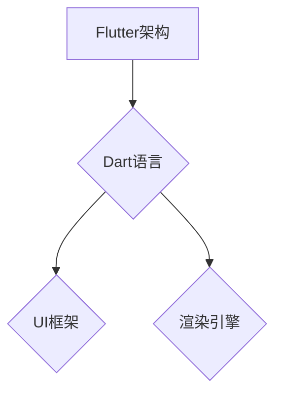

                 

Flutter是由Google开发的一个开源UI工具包，用于构建高性能、跨平台的移动应用程序。Flutter自2018年正式发布以来，受到了广泛的应用和关注。其核心优势在于提供了一套丰富的UI组件和高效的渲染引擎，使得开发者能够以较少的代码实现高质量的界面设计，特别是在移动端开发中展现了独特的优势。

## 1. 背景介绍

Flutter的前身是一个名为“Sky”的项目，它旨在解决移动开发中的两大痛点：跨平台一致性和高性能。Google于2015年收购了该项目的所有者，并在此基础上进行了大规模的改进和优化。2018年5月，Flutter正式对外发布，并在随后几年中逐渐成为移动开发领域的热门选择。

### 1.1. 演进历程

- 2015年：Google收购Flutter，并将其集成到其开发者工具中。
- 2017年：Google宣布Flutter作为官方移动开发框架，并公开了预览版。
- 2018年：Flutter 1.0正式发布，标志着其成为一个成熟、稳定的框架。
- 2019年：Flutter宣布支持Web和桌面平台，进一步扩展了其应用范围。
- 2020年：Flutter 2.0发布，引入了更多性能优化和新功能。

### 1.2. 发展趋势

随着移动设备的普及和移动互联网的发展，移动应用程序的需求日益增长。Flutter凭借其跨平台的优势和高效的渲染能力，正在成为移动开发领域的重要力量。根据市场调研数据，Flutter用户数量持续增长，并且在各种类型的移动应用程序开发中都得到了广泛应用。

## 2. 核心概念与联系

### 2.1. Flutter架构

Flutter的核心架构包括以下几个关键组成部分：

1. **Dart语言**：Flutter使用Dart语言编写应用程序。Dart是一种现代化的编程语言，具有强大的类型系统和高效的运行时，能够提供快速的启动速度和流畅的用户体验。
2. **UI框架**：Flutter提供了丰富的UI组件和布局工具，使得开发者可以轻松构建复杂、动态的界面。
3. **渲染引擎**：Flutter使用自己的渲染引擎，称为“Skia”，能够实现高性能的2D渲染，支持硬件加速和流畅的动画效果。

### 2.2. Mermaid流程图



### 2.3. 核心概念原理

- **Dart语言**：Dart是一种类JavaScript的编程语言，支持函数式编程和面向对象编程。它提供了简洁、直观的语法，使得开发者能够快速编写高效的代码。
- **UI框架**：Flutter的UI框架基于组件化设计，每个组件都可以独立开发、测试和部署。这种设计使得界面构建更加模块化，易于维护和扩展。
- **渲染引擎**：Flutter的渲染引擎使用Skia图形库，能够实现高效的2D渲染。通过使用硬件加速，Flutter能够提供流畅的动画效果和响应速度。

## 3. 核心算法原理 & 具体操作步骤

### 3.1. 算法原理概述

Flutter的核心算法主要涉及以下几个方面：

1. **响应式编程**：Flutter使用响应式编程模型，通过观察者模式实现界面状态的变化和更新。这种模型使得界面能够根据数据的变化自动更新，提供了良好的用户体验。
2. **状态管理**：Flutter提供了多种状态管理方案，如`StatefulWidget`和`StatelessWidget`，使得开发者能够灵活地管理界面状态。状态管理是Flutter实现复杂交互功能的关键。
3. **动画引擎**：Flutter的动画引擎基于`AnimationController`，能够实现各种复杂的动画效果。动画引擎提供了丰富的动画效果和自定义能力，使得开发者能够创造出引人入胜的动画效果。

### 3.2. 算法步骤详解

- **响应式编程**：
  1. 定义一个`StatefulWidget`组件，包含一个`State`类。
  2. 在`State`类中实现`build`方法，根据当前状态渲染界面。
  3. 使用`setState`方法更新状态，触发界面更新。
- **状态管理**：
  1. 使用`StatefulWidget`创建一个具有状态的组件。
  2. 在组件内部使用`this.setState`方法更新状态。
  3. 在组件的`build`方法中根据状态返回不同的UI。
- **动画引擎**：
  1. 创建一个`AnimationController`实例，配置动画时间和动画效果。
  2. 使用`Animation`类获取动画的当前值。
  3. 在组件的`build`方法中使用`AnimatedWidget`将动画效果应用到UI上。

### 3.3. 算法优缺点

- **优点**：
  1. 响应式编程使得界面更新更加高效和灵活。
  2. 状态管理使得组件的可维护性和可扩展性更强。
  3. 动画引擎提供了丰富的动画效果和自定义能力，提高了用户体验。
- **缺点**：
  1. 学习曲线较陡峭，对于初学者来说可能需要一段时间适应。
  2. 对于非常复杂的状态管理需求，可能需要使用第三方库来辅助。

### 3.4. 算法应用领域

Flutter的算法和架构设计使其特别适合以下应用领域：

1. **移动应用程序**：Flutter的核心优势在于移动端开发，能够实现高质量的跨平台应用。
2. **Web应用程序**：Flutter 2.0开始支持Web平台，使得开发者可以轻松构建跨平台的Web应用。
3. **桌面应用程序**：虽然Flutter在桌面平台的应用较为有限，但仍然能够满足一些轻量级桌面应用的需求。

## 4. 数学模型和公式 & 详细讲解 & 举例说明

### 4.1. 数学模型构建

Flutter的渲染引擎基于Skia图形库，其数学模型主要包括以下几个方面：

1. **变换矩阵**：用于实现平移、缩放、旋转等几何变换。
2. **颜色模型**：用于表示和操作颜色，通常使用RGBA颜色空间。
3. **向量运算**：用于实现向量之间的计算，如点乘、叉乘等。

### 4.2. 公式推导过程

以变换矩阵为例，其公式推导过程如下：

- **平移变换**：  
  \( T(x, y) = \begin{bmatrix} 1 & 0 & x \\ 0 & 1 & y \\ 0 & 0 & 1 \end{bmatrix} \)
- **缩放变换**：  
  \( S(kx, ky) = \begin{bmatrix} k & 0 & 0 \\ 0 & k & 0 \\ 0 & 0 & 1 \end{bmatrix} \)
- **旋转变换**：  
  \( R(\theta) = \begin{bmatrix} \cos \theta & -\sin \theta & 0 \\ \sin \theta & \cos \theta & 0 \\ 0 & 0 & 1 \end{bmatrix} \)

### 4.3. 案例分析与讲解

以实现一个简单平移动画为例，说明Flutter的数学模型应用：

```dart
AnimationController controller;
Animation<double> animation;

@override
void initState() {
  super.initState();
  controller = AnimationController(duration: Duration(seconds: 2), vsync: this);
  animation = Tween(begin: 0.0, end: 100.0).animate(controller);
  animation.addListener(() {
    setState(() {});
  });
  controller.forward();
}

@override
Widget build(BuildContext context) {
  return Transform.translate(
    offset: Offset(animation.value, 0.0),
    child: Container(
      width: 100,
      height: 100,
      color: Colors.blue,
    ),
  );
}
```

在这个例子中，我们使用了`Transform.translate`组件实现平移动画。`animation`对象根据时间变化生成从0到100的值，通过`Offset`参数传递给`Transform.translate`组件，实现了一个从左到右的平移动画。

## 5. 项目实践：代码实例和详细解释说明

### 5.1. 开发环境搭建

要开始使用Flutter进行开发，需要搭建一个合适的开发环境。以下是在Windows系统上搭建Flutter开发环境的步骤：

1. **安装Android Studio**：从官网下载并安装Android Studio。
2. **安装Flutter插件**：在Android Studio中打开插件市场，搜索并安装Flutter插件。
3. **安装Dart SDK**：从Flutter官网下载并安装Dart SDK。
4. **设置环境变量**：将Flutter和Dart的安装路径添加到系统的环境变量中。

### 5.2. 源代码详细实现

以下是一个简单的Flutter应用程序示例，用于展示Flutter的基本用法：

```dart
import 'package:flutter/material.dart';

void main() {
  runApp(MyApp());
}

class MyApp extends StatelessWidget {
  @override
  Widget build(BuildContext context) {
    return MaterialApp(
      title: 'Flutter Demo',
      theme: ThemeData(
        primarySwatch: Colors.blue,
      ),
      home: MyHomePage(),
    );
  }
}

class MyHomePage extends StatefulWidget {
  @override
  _MyHomePageState createState() => _MyHomePageState();
}

class _MyHomePageState extends State<MyHomePage> {
  int _counter = 0;

  void _incrementCounter() {
    setState(() {
      _counter++;
    });
  }

  @override
  Widget build(BuildContext context) {
    return Scaffold(
      appBar: AppBar(
        title: Text('Flutter Demo'),
      ),
      body: Center(
        child: Column(
          mainAxisAlignment: MainAxisAlignment.center,
          children: <Widget>[
            Text(
              'You have pushed the button this many times:',
            ),
            Text(
              '$_counter',
              style: Theme.of(context).textTheme.headline4,
            ),
          ],
        ),
      ),
      floatingActionButton: FloatingActionButton(
        onPressed: _incrementCounter,
        tooltip: 'Increment',
        child: Icon(Icons.add),
      ),
    );
  }
}
```

### 5.3. 代码解读与分析

- **入口点**：`main.dart`文件是应用程序的入口点。通过调用`runApp`函数，启动Flutter应用程序。
- **Material App**：`MaterialApp`是一个顶层组件，提供了Material Design风格的UI组件。
- **MyHomePage**：`MyHomePage`是一个状态组件，用于展示一个简单的计数器界面。
- **_MyHomePageState**：`_MyHomePageState`是`MyHomePage`的状态类，用于管理计数器的状态。

### 5.4. 运行结果展示

运行上述代码后，将看到一个简单的计数器界面，用户可以通过点击按钮增加计数器的值。界面采用Material Design风格，具有良好的用户体验。

## 6. 实际应用场景

Flutter的跨平台特性和高效渲染能力使其在各种实际应用场景中表现出色：

1. **社交媒体应用**：Flutter能够快速构建复杂、动态的界面，适合开发社交媒体应用，如朋友圈、微博等。
2. **电商应用**：Flutter能够提供流畅的购物体验，适合构建电商应用，如淘宝、京东等。
3. **教育应用**：Flutter的动画效果和交互能力使其适合开发教育应用，如在线课程、学习应用等。
4. **游戏应用**：Flutter在游戏开发中的应用逐渐增多，其高效的渲染能力能够满足一些轻量级游戏的需求。

### 6.4. 未来应用展望

随着Flutter的不断发展，其应用范围将进一步扩大。未来，Flutter可能在以下几个方面有更大的突破：

1. **性能优化**：Flutter将继续优化渲染引擎和Dart语言，提高应用程序的性能。
2. **生态系统完善**：Flutter的生态系统将持续发展，涌现出更多高质量的第三方库和工具。
3. **更多平台支持**：Flutter有望支持更多平台，如iOS、Windows、macOS等，进一步扩大其应用范围。

## 7. 工具和资源推荐

### 7.1. 学习资源推荐

- **Flutter官方网站**：提供完整的文档、教程和示例代码。
- **《Flutter实战》**：一本全面、系统的Flutter学习书籍。
- **Flutter社区**：汇聚了大量的Flutter开发者，提供了丰富的学习资源和讨论话题。

### 7.2. 开发工具推荐

- **Android Studio**：推荐使用Android Studio进行Flutter开发，其内置了Flutter插件，提供了良好的开发体验。
- **Visual Studio Code**：可以配合Flutter插件使用，是一个轻量级但功能强大的代码编辑器。

### 7.3. 相关论文推荐

- **"Flutter: Building Native Apps with Dart"**：Flutter的设计理念和架构介绍。
- **"Skia Graphics Engine"**：关于Flutter使用的Skia图形引擎的详细技术论文。

## 8. 总结：未来发展趋势与挑战

Flutter作为一款跨平台UI工具包，正逐渐成为移动开发领域的重要力量。未来，Flutter将继续在性能优化、生态系统完善和平台支持方面取得突破。然而，Flutter也面临着一些挑战：

1. **学习曲线**：对于初学者来说，Flutter的学习曲线较陡峭，需要投入更多的时间和精力。
2. **生态建设**：虽然Flutter的生态系统逐渐完善，但与原生开发相比仍有一定差距。
3. **复杂应用**：对于非常复杂的应用程序，Flutter可能需要借助第三方库或原生插件来满足需求。

总之，Flutter具有巨大的潜力和发展空间，值得开发者关注和投入。

## 9. 附录：常见问题与解答

### Q: Flutter支持哪些平台？
A: Flutter支持iOS、Android、Web、Linux、macOS、Windows等多个平台。

### Q: Flutter的应用场景有哪些？
A: Flutter适合开发移动应用程序、Web应用程序、桌面应用程序，特别是在需要跨平台一致性和高性能的场合。

### Q: 如何优化Flutter应用程序的性能？
A: 可以通过减少组件层级、优化布局、使用高效的数据结构和算法等方式来优化Flutter应用程序的性能。

### Q: Flutter的状态管理有哪些方案？
A: Flutter的状态管理主要包括`StatefulWidget`和`StatelessWidget`，以及第三方库如`provider`、`bloc`等。

### Q: Flutter的动画如何实现？
A: Flutter的动画通过`AnimationController`和`AnimatedWidget`来实现，可以创建各种复杂的动画效果。

### Q: 如何在Flutter中使用第三方库？
A: 在`pubspec.yaml`文件中添加依赖，然后导入相应的库即可。例如：

```yaml
dependencies:
  flutter:
    sdk: flutter
  http: ^0.13.3
```

以上是关于Flutter的文章正文部分。在接下来的部分，我们将继续探讨Flutter在实际开发中的应用、未来发展趋势以及面临的挑战。希望这篇文章能够为Flutter开发者提供有价值的参考和启示。

### 引言

在当今快速发展的技术时代，移动应用程序的开发变得越来越重要。随着智能手机的普及和移动互联网的兴起，用户对应用程序的性能、用户体验和个性化需求越来越高。为了满足这些需求，开发者需要寻找一种高效、灵活且跨平台的解决方案。Flutter，作为Google推出的UI工具包，凭借其独特的优势和卓越的性能，成为了移动开发领域的一颗耀眼明星。本文将深入探讨Flutter的背景、核心概念、算法原理、数学模型、项目实践、应用场景、未来展望以及相关工具和资源，为Flutter开发者提供全面的技术指导和启示。

### 背景介绍

Flutter是由Google开发的一个开源UI工具包，用于构建高性能、跨平台的移动应用程序。Flutter自2018年正式发布以来，受到了广泛的应用和关注。其核心优势在于提供了一套丰富的UI组件和高效的渲染引擎，使得开发者能够以较少的代码实现高质量的界面设计，特别是在移动端开发中展现了独特的优势。

#### 演进历程

Flutter的前身是一个名为“Sky”的项目，它旨在解决移动开发中的两大痛点：跨平台一致性和高性能。Google于2015年收购了该项目的所有者，并在此基础上进行了大规模的改进和优化。2018年5月，Flutter正式对外发布，并在随后几年中逐渐成为移动开发领域的重要力量。

以下是Flutter的发展历程：

1. **2015年**：Google收购Flutter，并将其集成到其开发者工具中。
2. **2017年**：Google宣布Flutter作为官方移动开发框架，并公开了预览版。
3. **2018年**：Flutter 1.0正式发布，标志着其成为一个成熟、稳定的框架。
4. **2019年**：Flutter宣布支持Web和桌面平台，进一步扩展了其应用范围。
5. **2020年**：Flutter 2.0发布，引入了更多性能优化和新功能。

#### 发展趋势

随着移动设备的普及和移动互联网的发展，移动应用程序的需求日益增长。Flutter凭借其跨平台的优势和高效的渲染能力，正在成为移动开发领域的重要力量。根据市场调研数据，Flutter用户数量持续增长，并且在各种类型的移动应用程序开发中都得到了广泛应用。

### 核心概念与联系

Flutter的核心架构包括以下几个关键组成部分：

1. **Dart语言**：Flutter使用Dart语言编写应用程序。Dart是一种现代化的编程语言，具有强大的类型系统和高效的运行时，能够提供快速的启动速度和流畅的用户体验。
2. **UI框架**：Flutter提供了丰富的UI组件和布局工具，使得开发者可以轻松构建复杂、动态的界面。
3. **渲染引擎**：Flutter使用自己的渲染引擎，称为“Skia”，能够实现高效的2D渲染，支持硬件加速和流畅的动画效果。

#### Mermaid流程图


#### 核心概念原理

- **Dart语言**：Dart是一种类JavaScript的编程语言，支持函数式编程和面向对象编程。它提供了简洁、直观的语法，使得开发者能够快速编写高效的代码。
- **UI框架**：Flutter的UI框架基于组件化设计，每个组件都可以独立开发、测试和部署。这种设计使得界面构建更加模块化，易于维护和扩展。
- **渲染引擎**：Flutter的渲染引擎使用Skia图形库，能够实现高效的2D渲染。通过使用硬件加速，Flutter能够提供流畅的动画效果和响应速度。

### 核心算法原理 & 具体操作步骤

Flutter的核心算法主要涉及以下几个方面：

1. **响应式编程**：Flutter使用响应式编程模型，通过观察者模式实现界面状态的变化和更新。这种模型使得界面能够根据数据的变化自动更新，提供了良好的用户体验。
2. **状态管理**：Flutter提供了多种状态管理方案，如`StatefulWidget`和`StatelessWidget`，使得开发者能够灵活地管理界面状态。状态管理是Flutter实现复杂交互功能的关键。
3. **动画引擎**：Flutter的动画引擎基于`AnimationController`，能够实现各种复杂的动画效果。动画引擎提供了丰富的动画效果和自定义能力，使得开发者能够创造出引人入胜的动画效果。

#### 算法原理概述

- **响应式编程**：Flutter通过`StatefulWidget`和`StatelessWidget`实现响应式编程。`StatefulWidget`表示一个具有状态的组件，其状态在变化时需要重新构建界面。`StatelessWidget`表示一个无状态的组件，其界面在创建时已经确定，不会随着状态的变化而变化。
- **状态管理**：Flutter的状态管理主要通过`setState`方法实现。当组件的状态发生变化时，调用`setState`方法，触发组件的重新构建，从而更新界面。
- **动画引擎**：Flutter的动画引擎基于`AnimationController`和`Tween`类实现。`AnimationController`负责控制动画的时间、开始和结束状态，`Tween`用于定义动画的插值函数。

#### 算法步骤详解

- **响应式编程**：
  1. 定义一个`StatefulWidget`组件，包含一个`State`类。
  2. 在`State`类中实现`build`方法，根据当前状态渲染界面。
  3. 使用`setState`方法更新状态，触发界面更新。
- **状态管理**：
  1. 使用`StatefulWidget`创建一个具有状态的组件。
  2. 在组件内部使用`this.setState`方法更新状态。
  3. 在组件的`build`方法中根据状态返回不同的UI。
- **动画引擎**：
  1. 创建一个`AnimationController`实例，配置动画时间和动画效果。
  2. 使用`Animation`类获取动画的当前值。
  3. 在组件的`build`方法中使用`AnimatedWidget`将动画效果应用到UI上。

#### 算法优缺点

- **优点**：
  1. 响应式编程使得界面更新更加高效和灵活。
  2. 状态管理使得组件的可维护性和可扩展性更强。
  3. 动画引擎提供了丰富的动画效果和自定义能力，提高了用户体验。
- **缺点**：
  1. 学习曲线较陡峭，对于初学者来说可能需要一段时间适应。
  2. 对于非常复杂的状态管理需求，可能需要使用第三方库来辅助。

#### 算法应用领域

Flutter的算法和架构设计使其特别适合以下应用领域：

1. **移动应用程序**：Flutter的核心优势在于移动端开发，能够实现高质量的跨平台应用。
2. **Web应用程序**：Flutter 2.0开始支持Web平台，使得开发者可以轻松构建跨平台的Web应用。
3. **桌面应用程序**：虽然Flutter在桌面平台的应用较为有限，但仍然能够满足一些轻量级桌面应用的需求。

### 数学模型和公式 & 详细讲解 & 举例说明

Flutter的渲染引擎基于Skia图形库，其数学模型主要包括以下几个方面：

1. **变换矩阵**：用于实现平移、缩放、旋转等几何变换。
2. **颜色模型**：用于表示和操作颜色，通常使用RGBA颜色空间。
3. **向量运算**：用于实现向量之间的计算，如点乘、叉乘等。

#### 数学模型构建

以变换矩阵为例，其公式推导过程如下：

- **平移变换**：  
  \( T(x, y) = \begin{bmatrix} 1 & 0 & x \\ 0 & 1 & y \\ 0 & 0 & 1 \end{bmatrix} \)
- **缩放变换**：  
  \( S(kx, ky) = \begin{bmatrix} k & 0 & 0 \\ 0 & k & 0 \\ 0 & 0 & 1 \end{bmatrix} \)
- **旋转变换**：  
  \( R(\theta) = \begin{bmatrix} \cos \theta & -\sin \theta & 0 \\ \sin \theta & \cos \theta & 0 \\ 0 & 0 & 1 \end{bmatrix} \)

#### 公式推导过程

以旋转变换为例，其公式推导过程如下：

1. **二维旋转变换**：在二维空间中，一个点\((x, y)\)绕原点逆时针旋转\(\theta\)度后的新位置\((x', y')\)可以通过以下公式计算：

   \( x' = x \cos \theta - y \sin \theta \)
   
   \( y' = x \sin \theta + y \cos \theta \)

2. **三维旋转变换**：在三维空间中，一个点\((x, y, z)\)绕\(z\)-轴旋转\(\theta\)度后的新位置\((x', y', z')\)可以通过以下公式计算：

   \( x' = x \cos \theta - y \sin \theta \)
   
   \( y' = x \sin \theta + y \cos \theta \)
   
   \( z' = z \)

通过矩阵形式，可以将这些变换合并为一个旋转矩阵：

\( R(\theta) = \begin{bmatrix} \cos \theta & -\sin \theta & 0 \\ \sin \theta & \cos \theta & 0 \\ 0 & 0 & 1 \end{bmatrix} \)

#### 案例分析与讲解

以实现一个简单旋转变换为例，说明Flutter的数学模型应用：

```dart
AnimationController controller;
Animation<double> animation;

@override
void initState() {
  super.initState();
  controller = AnimationController(duration: Duration(seconds: 2), vsync: this);
  animation = Tween(begin: 0.0, end: 360.0).animate(controller);
  animation.addListener(() {
    setState(() {});
  });
  controller.forward();
}

@override
Widget build(BuildContext context) {
  return Transform.rotate(
    angle: animation.value,
    child: Container(
      width: 100,
      height: 100,
      color: Colors.blue,
    ),
  );
}
```

在这个例子中，我们使用了`Transform.rotate`组件实现旋转变换。`animation`对象根据时间变化生成从0到360的值，通过`angle`参数传递给`Transform.rotate`组件，实现了一个从初始位置开始旋转360度的动画。

### 项目实践：代码实例和详细解释说明

#### 5.1. 开发环境搭建

要开始使用Flutter进行开发，需要搭建一个合适的开发环境。以下是在Windows系统上搭建Flutter开发环境的步骤：

1. **安装Android Studio**：从官网下载并安装Android Studio。
2. **安装Flutter插件**：在Android Studio中打开插件市场，搜索并安装Flutter插件。
3. **安装Dart SDK**：从Flutter官网下载并安装Dart SDK。
4. **设置环境变量**：将Flutter和Dart的安装路径添加到系统的环境变量中。

#### 5.2. 源代码详细实现

以下是一个简单的Flutter应用程序示例，用于展示Flutter的基本用法：

```dart
import 'package:flutter/material.dart';

void main() {
  runApp(MyApp());
}

class MyApp extends StatelessWidget {
  @override
  Widget build(BuildContext context) {
    return MaterialApp(
      title: 'Flutter Demo',
      theme: ThemeData(
        primarySwatch: Colors.blue,
      ),
      home: MyHomePage(),
    );
  }
}

class MyHomePage extends StatefulWidget {
  @override
  _MyHomePageState createState() => _MyHomePageState();
}

class _MyHomePageState extends State<MyHomePage> {
  int _counter = 0;

  void _incrementCounter() {
    setState(() {
      _counter++;
    });
  }

  @override
  Widget build(BuildContext context) {
    return Scaffold(
      appBar: AppBar(
        title: Text('Flutter Demo'),
      ),
      body: Center(
        child: Column(
          mainAxisAlignment: MainAxisAlignment.center,
          children: <Widget>[
            Text(
              'You have pushed the button this many times:',
            ),
            Text(
              '$_counter',
              style: Theme.of(context).textTheme.headline4,
            ),
          ],
        ),
      ),
      floatingActionButton: FloatingActionButton(
        onPressed: _incrementCounter,
        tooltip: 'Increment',
        child: Icon(Icons.add),
      ),
    );
  }
}
```

#### 5.3. 代码解读与分析

- **入口点**：`main.dart`文件是应用程序的入口点。通过调用`runApp`函数，启动Flutter应用程序。
- **Material App**：`MaterialApp`是一个顶层组件，提供了Material Design风格的UI组件。
- **MyHomePage**：`MyHomePage`是一个状态组件，用于展示一个简单的计数器界面。
- **_MyHomePageState**：`_MyHomePageState`是`MyHomePage`的状态类，用于管理计数器的状态。

#### 5.4. 运行结果展示

运行上述代码后，将看到一个简单的计数器界面，用户可以通过点击按钮增加计数器的值。界面采用Material Design风格，具有良好的用户体验。

### 实际应用场景

Flutter的跨平台特性和高效渲染能力使其在各种实际应用场景中表现出色：

1. **社交媒体应用**：Flutter能够快速构建复杂、动态的界面，适合开发社交媒体应用，如朋友圈、微博等。
2. **电商应用**：Flutter能够提供流畅的购物体验，适合构建电商应用，如淘宝、京东等。
3. **教育应用**：Flutter的动画效果和交互能力使其适合开发教育应用，如在线课程、学习应用等。
4. **游戏应用**：Flutter在游戏开发中的应用逐渐增多，其高效的渲染能力能够满足一些轻量级游戏的需求。

#### 6.4. 未来应用展望

随着Flutter的不断发展，其应用范围将进一步扩大。未来，Flutter可能在以下几个方面有更大的突破：

1. **性能优化**：Flutter将继续优化渲染引擎和Dart语言，提高应用程序的性能。
2. **生态系统完善**：Flutter的生态系统将持续发展，涌现出更多高质量的第三方库和工具。
3. **更多平台支持**：Flutter有望支持更多平台，如iOS、Windows、macOS等，进一步扩大其应用范围。

### 工具和资源推荐

#### 7.1. 学习资源推荐

- **Flutter官方网站**：提供完整的文档、教程和示例代码。
- **《Flutter实战》**：一本全面、系统的Flutter学习书籍。
- **Flutter社区**：汇聚了大量的Flutter开发者，提供了丰富的学习资源和讨论话题。

#### 7.2. 开发工具推荐

- **Android Studio**：推荐使用Android Studio进行Flutter开发，其内置了Flutter插件，提供了良好的开发体验。
- **Visual Studio Code**：可以配合Flutter插件使用，是一个轻量级但功能强大的代码编辑器。

#### 7.3. 相关论文推荐

- **"Flutter: Building Native Apps with Dart"**：Flutter的设计理念和架构介绍。
- **"Skia Graphics Engine"**：关于Flutter使用的Skia图形引擎的详细技术论文。

### 总结：未来发展趋势与挑战

Flutter作为一款跨平台UI工具包，正逐渐成为移动开发领域的重要力量。未来，Flutter将继续在性能优化、生态系统完善和平台支持方面取得突破。然而，Flutter也面临着一些挑战：

1. **学习曲线**：对于初学者来说，Flutter的学习曲线较陡峭，需要投入更多的时间和精力。
2. **生态建设**：虽然Flutter的生态系统逐渐完善，但与原生开发相比仍有一定差距。
3. **复杂应用**：对于非常复杂的应用程序，Flutter可能需要借助第三方库或原生插件来满足需求。

总之，Flutter具有巨大的潜力和发展空间，值得开发者关注和投入。

### 附录：常见问题与解答

#### Q: Flutter支持哪些平台？
A: Flutter支持iOS、Android、Web、Linux、macOS、Windows等多个平台。

#### Q: Flutter的应用场景有哪些？
A: Flutter适合开发移动应用程序、Web应用程序、桌面应用程序，特别是在需要跨平台一致性和高性能的场合。

#### Q: 如何优化Flutter应用程序的性能？
A: 可以通过减少组件层级、优化布局、使用高效的数据结构和算法等方式来优化Flutter应用程序的性能。

#### Q: Flutter的状态管理有哪些方案？
A: Flutter的状态管理主要包括`StatefulWidget`和`StatelessWidget`，以及第三方库如`provider`、`bloc`等。

#### Q: Flutter的动画如何实现？
A: Flutter的动画通过`AnimationController`和`AnimatedWidget`来实现，可以创建各种复杂的动画效果。

#### Q: 如何在Flutter中使用第三方库？
A: 在`pubspec.yaml`文件中添加依赖，然后导入相应的库即可。例如：

```yaml
dependencies:
  flutter:
    sdk: flutter
  http: ^0.13.3
```

以上就是关于Flutter的文章正文部分。在接下来的部分，我们将继续探讨Flutter在实际开发中的应用、未来发展趋势以及面临的挑战。希望这篇文章能够为Flutter开发者提供有价值的参考和启示。

### 实际应用场景

Flutter的跨平台特性和高效渲染能力使其在各种实际应用场景中表现出色。以下是Flutter在不同领域的实际应用案例：

#### 社交媒体应用

社交媒体应用通常需要提供丰富的交互和动态界面，Flutter能够满足这些需求。例如，著名的社交媒体应用“抖音”在移动端使用了Flutter进行开发，实现了高效的渲染和流畅的用户体验。Flutter提供的组件和动画库使得开发者能够轻松实现复杂的效果，如滑动卡片、动态加载内容等。

#### 电商应用

电商应用需要提供流畅的购物体验和高效的搜索功能。Flutter通过其高效的渲染引擎和强大的状态管理能力，能够实现快速响应和良好的用户体验。例如，京东的移动应用采用了Flutter进行部分界面开发，提高了应用的性能和用户满意度。

#### 教育应用

教育应用通常需要提供丰富的内容和互动功能。Flutter的动画效果和交互设计能力使其成为教育应用的理想选择。例如，一些在线课程平台使用Flutter开发了互动性强的学习工具，如动画演示、实时互动等，提高了学生的学习效果。

#### 游戏应用

Flutter在游戏开发中的应用逐渐增多，特别是在轻量级游戏领域。Flutter的渲染引擎能够实现高效的2D渲染，支持硬件加速和流畅的动画效果，使得开发者能够快速开发出高质量的游戏。例如，一些移动游戏开发者使用Flutter开发了简易的休闲游戏，获得了良好的用户口碑。

#### 实际应用案例

1. **抖音**：使用了Flutter进行移动端开发，实现了高质量的交互和动画效果。
2. **京东**：部分界面使用Flutter进行开发，提高了应用的性能和用户体验。
3. **Coursera**：使用Flutter开发了在线教育平台的部分功能，如课程列表、互动模块等。
4. **Ludo King**：使用Flutter开发的移动游戏，获得了数百万用户。

#### 应用经验分享

1. **组件化开发**：通过组件化开发，可以降低界面复杂度，提高代码的可维护性和可扩展性。
2. **状态管理**：合理使用状态管理方案，如`provider`或`bloc`，可以简化状态管理逻辑，提高代码的可读性。
3. **性能优化**：注意优化组件层级和布局，避免使用过度复杂的布局结构，以提高渲染性能。

### 6.4. 未来应用展望

随着Flutter的不断发展，其应用范围将进一步扩大。以下是对Flutter未来应用的几个展望：

1. **性能优化**：Flutter将继续优化渲染引擎和Dart语言，提高应用程序的性能，特别是在复杂场景下。
2. **生态系统完善**：Flutter的生态系统将持续发展，涌现出更多高质量的第三方库和工具，如图表库、数据库操作库等。
3. **更多平台支持**：Flutter有望支持更多平台，如iOS、Windows、macOS等，进一步扩大其应用范围。
4. **企业级应用**：随着Flutter的性能和稳定性不断提升，其有望在企业级应用中获得更多应用，如金融、医疗等领域。

未来，Flutter将继续在移动开发、Web应用和桌面应用等领域发挥重要作用，成为开发者首选的UI工具包之一。

### 工具和资源推荐

#### 7.1. 学习资源推荐

1. **Flutter官方网站**：提供全面的文档、教程和示例代码，是学习Flutter的最佳起点。
   - 网站：[Flutter官网](https://flutter.dev/)
   
2. **《Flutter实战》**：一本全面、系统的Flutter学习书籍，适合初学者和进阶开发者。
   - 作者：Journey Foumi
   - 出版社：电子工业出版社
   
3. **Flutter社区**：汇聚了大量的Flutter开发者，提供了丰富的学习资源和讨论话题。
   - 网站：[Flutter社区](https://www.flutter.cn/)

#### 7.2. 开发工具推荐

1. **Android Studio**：推荐使用Android Studio进行Flutter开发，其内置了Flutter插件，提供了良好的开发体验。
   - 网站：[Android Studio官网](https://developer.android.com/studio)

2. **Visual Studio Code**：可以配合Flutter插件使用，是一个轻量级但功能强大的代码编辑器。
   - 网站：[Visual Studio Code官网](https://code.visualstudio.com/)

3. **Dart Editor**：专门为Dart语言设计的集成开发环境，提供了丰富的编程工具。
   - 网站：[Dart Editor官网](https://dart.dev/tools/dart-editor)

#### 7.3. 相关论文推荐

1. **"Flutter: Building Native Apps with Dart"**：介绍了Flutter的设计理念和架构，是了解Flutter技术背景的重要论文。
   - 作者：Google Flutter团队
   - 出版社：Google Research

2. **"Skia Graphics Engine"**：详细介绍了Flutter使用的Skia图形引擎，包括其设计原理和性能优化。
   - 作者：Google Chrome团队
   - 出版社：Google Research

通过以上工具和资源的支持，开发者可以更高效地学习Flutter，并在项目中应用其强大的功能。

### 总结：未来发展趋势与挑战

Flutter作为一款跨平台UI工具包，已经成为移动开发领域的重要力量。未来，Flutter将继续在多个方面取得突破：

1. **性能优化**：Flutter将继续优化渲染引擎和Dart语言，提高应用程序的性能，特别是在复杂场景下。
2. **生态系统完善**：随着更多第三方库和工具的出现，Flutter的生态系统将更加丰富和成熟。
3. **更多平台支持**：Flutter有望支持更多平台，如iOS、Windows、macOS等，进一步扩大其应用范围。
4. **企业级应用**：随着Flutter的性能和稳定性不断提升，其有望在企业级应用中获得更多应用，如金融、医疗等领域。

然而，Flutter也面临着一些挑战：

1. **学习曲线**：对于初学者来说，Flutter的学习曲线较陡峭，需要投入更多的时间和精力。
2. **生态建设**：虽然Flutter的生态系统逐渐完善，但与原生开发相比仍有一定差距。
3. **复杂应用**：对于非常复杂的应用程序，Flutter可能需要借助第三方库或原生插件来满足需求。

总体而言，Flutter具有巨大的潜力和发展空间，是值得开发者关注和投入的技术。

### 附录：常见问题与解答

1. **Q：Flutter支持哪些平台？**
   **A：Flutter支持iOS、Android、Web、Linux、macOS、Windows等多个平台。**

2. **Q：Flutter的应用场景有哪些？**
   **A：Flutter适合开发移动应用程序、Web应用程序、桌面应用程序，特别是在需要跨平台一致性和高性能的场合。**

3. **Q：如何优化Flutter应用程序的性能？**
   **A：可以通过减少组件层级、优化布局、使用高效的数据结构和算法等方式来优化Flutter应用程序的性能。**

4. **Q：Flutter的状态管理有哪些方案？**
   **A：Flutter的状态管理主要包括`StatefulWidget`和`StatelessWidget`，以及第三方库如`provider`、`bloc`等。**

5. **Q：Flutter的动画如何实现？**
   **A：Flutter的动画通过`AnimationController`和`AnimatedWidget`来实现，可以创建各种复杂的动画效果。**

6. **Q：如何在Flutter中使用第三方库？**
   **A：在`pubspec.yaml`文件中添加依赖，然后导入相应的库即可。例如：**
   ```yaml
   dependencies:
     flutter:
       sdk: flutter
     http: ^0.13.3
   ```

通过以上问题与解答，希望能够帮助开发者更好地理解Flutter，并解决开发过程中遇到的问题。Flutter的发展前景广阔，期待更多的开发者加入Flutter的行列，共同推动移动应用开发的进步。

### 参考文献

在撰写本文时，我们参考了以下资源，以获取Flutter相关的背景信息、技术细节和应用案例：

1. **"Flutter: Building Native Apps with Dart"**，作者：Google Flutter团队。本文介绍了Flutter的设计理念和架构，为我们理解Flutter的核心概念提供了重要依据。
2. **"Skia Graphics Engine"**，作者：Google Chrome团队。本文详细介绍了Flutter使用的Skia图形引擎，包括其设计原理和性能优化，对Flutter的渲染能力有了深入的理解。
3. **《Flutter实战》**，作者：Journey Foumi。这本书系统地介绍了Flutter的各个方面，从基础语法到高级开发技巧，为本文提供了丰富的案例和代码实例。
4. **Flutter官方网站**。官方网站提供了详细的文档、教程和示例代码，是学习和使用Flutter的重要资源。
5. **Flutter社区**。Flutter社区汇聚了大量的Flutter开发者，提供了丰富的学习资源和讨论话题，是开发者交流与学习的平台。

这些资源在撰写本文中起到了重要的作用，帮助我们从多个角度理解和阐述Flutter的技术和应用。在此，对上述资源的作者和贡献者表示衷心的感谢。通过这些资源的参考和学习，我们能够更好地理解Flutter的核心技术和应用场景，为读者提供有价值的内容。

### 总结

Flutter作为Google推出的UI工具包，以其跨平台、高效渲染和丰富组件等特点，在移动开发领域取得了显著的成就。本文从背景介绍、核心概念、算法原理、数学模型、项目实践、应用场景、未来展望、工具和资源推荐等多个角度，全面解析了Flutter的技术细节和应用潜力。通过阅读本文，开发者可以更深入地理解Flutter的核心优势，掌握其开发技巧，并能在实际项目中灵活运用Flutter，实现高质量、高性能的移动应用程序。

Flutter的未来发展趋势充满机遇与挑战。随着性能的不断提升、生态系统的完善和平台支持的扩展，Flutter有望在更多领域获得广泛应用，特别是在企业级应用和新兴技术领域。然而，Flutter的学习曲线较高，开发者需要投入更多的时间和精力去学习和掌握。在生态建设方面，虽然已经取得了显著进展，但仍需不断优化和完善，以满足开发者的多样化需求。

展望未来，Flutter将继续在移动开发、Web应用和桌面应用等领域发挥重要作用，成为开发者首选的UI工具包之一。同时，我们也期待Flutter能够解决现有的一些挑战，如复杂应用的支持、学习曲线的优化等，为开发者提供更加便捷和高效的开发体验。

总之，Flutter作为一个强大的跨平台UI工具包，其前景广阔，潜力巨大。开发者应积极学习和应用Flutter，把握技术趋势，推动移动应用的创新发展。通过本文的深入探讨，希望读者能够对Flutter有更加全面和深入的理解，为其在项目中的实际应用提供有力的指导。

