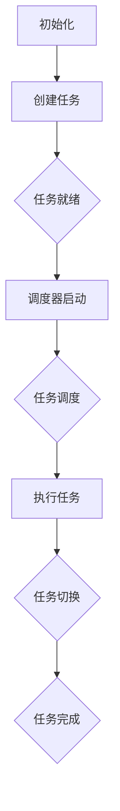

                 

### 1. 背景介绍

实时操作系统（RTOS）是一种专为对时间敏感的应用程序设计的操作系统。它与常规操作系统（如Windows或Linux）在响应时间和任务调度上有本质区别。RTOS能够确保关键任务在规定的时间内完成，这对于工业控制、医疗设备、航空航天等要求严格的实时性能的应用至关重要。

FreeRTOS是一款开源、免费、可定制的实时操作系统，由Richard Barry于2003年创建。它因其轻量级、可扩展性高和易于集成等特点，在嵌入式系统开发中受到了广泛关注。FreeRTOS支持多种硬件平台，包括ARM、MIPS、AVR等，适用于各种规模的嵌入式设备。

在本文中，我们将深入探讨FreeRTOS的核心概念、算法原理、数学模型、项目实践以及实际应用场景。文章的结构如下：

## 1. 背景介绍

## 2. 核心概念与联系

## 3. 核心算法原理 & 具体操作步骤

## 4. 数学模型和公式 & 详细讲解 & 举例说明

## 5. 项目实践：代码实例和详细解释说明

## 6. 实际应用场景

## 7. 工具和资源推荐

## 8. 总结：未来发展趋势与挑战

## 9. 附录：常见问题与解答

### 2. 核心概念与联系

#### 2.1 实时操作系统与常规操作系统的区别

实时操作系统与常规操作系统的主要区别在于任务的调度方式和响应时间。在常规操作系统中，任务的执行通常是随机的，操作系统通过时间片轮转调度算法来分配CPU时间。这种方式虽然简单高效，但无法保证任务的响应时间。

相比之下，RTOS具有以下特点：

- **确定性的任务调度**：RTOS根据任务的优先级和截止时间来调度任务，确保关键任务在规定的时间内完成。
- **抢占式调度**：RTOS可以中断当前正在执行的较低优先级任务，转而执行更高优先级任务，从而确保关键任务得到及时处理。
- **时间片**：某些RTOS使用时间片来限制任务的执行时间，以避免某个任务占用过多系统资源。

#### 2.2 FreeRTOS的特点

FreeRTOS具有以下特点，使其在嵌入式系统开发中脱颖而出：

- **开源**：FreeRTOS是开源软件，用户可以自由下载、修改和分发。
- **轻量级**：FreeRTOS代码紧凑，适用于资源受限的嵌入式设备。
- **高度可配置**：FreeRTOS提供了丰富的配置选项，用户可以根据项目需求定制操作系统。
- **易于集成**：FreeRTOS支持多种硬件平台，并且提供了丰富的API和示例代码，方便开发者快速集成和使用。
- **高效的任务调度**：FreeRTOS采用抢占式调度，确保高优先级任务得到及时处理。

#### 2.3 Mermaid流程图

以下是一个简单的Mermaid流程图，展示了FreeRTOS中的任务调度流程：



### 3. 核心算法原理 & 具体操作步骤

#### 3.1 算法原理概述

FreeRTOS的核心算法包括任务创建、任务调度、任务切换和任务删除等。以下是对这些核心算法的简要概述：

- **任务创建**：操作系统通过调用`xTaskCreate`函数创建任务。任务创建时需要指定任务的名称、堆栈大小、优先级和函数指针等。
- **任务调度**：FreeRTOS采用抢占式调度，任务调度器根据任务的优先级和截止时间来选择下一个执行的任务。
- **任务切换**：当高优先级任务需要执行时，当前执行的任务会被中断，保存其上下文，然后高优先级任务开始执行。
- **任务删除**：操作系统通过调用`vTaskDelete`函数删除任务，释放任务占用的资源。

#### 3.2 算法步骤详解

以下是FreeRTOS任务调度算法的具体步骤：

1. **初始化**：操作系统初始化任务调度器、创建就绪队列和等待队列。
2. **创建任务**：调用`xTaskCreate`函数创建任务，并将其添加到就绪队列。
3. **启动调度器**：调用`vTaskStartScheduler`函数启动任务调度器。
4. **任务调度**：调度器根据任务优先级和截止时间选择下一个执行的任务。
5. **任务执行**：选中的任务开始执行，直到其完成或被中断。
6. **任务切换**：当高优先级任务就绪时，当前执行的任务会被中断，保存其上下文，然后高优先级任务开始执行。
7. **任务删除**：当任务完成或不再需要时，调用`vTaskDelete`函数删除任务，释放资源。

#### 3.3 算法优缺点

- **优点**：
  - **抢占式调度**：确保高优先级任务得到及时处理，提高系统响应速度。
  - **轻量级**：适用于资源受限的嵌入式设备。
  - **高度可配置**：用户可以根据项目需求定制操作系统。
  - **开源**：方便社区贡献和改进。

- **缺点**：
  - **调度开销**：抢占式调度会增加系统开销，特别是在任务频繁切换时。
  - **复杂度**：相较于时间片调度，抢占式调度更复杂，需要更深入的理解和使用。

#### 3.4 算法应用领域

FreeRTOS广泛应用于以下领域：

- **工业控制**：实时监控和控制系统，如PLC、机器人等。
- **医疗设备**：实时处理和监控系统，如心电图机、胰岛素泵等。
- **消费电子**：智能家居设备、智能手表、无线耳机等。
- **车载系统**：车载信息娱乐系统、自动驾驶控制系统等。

### 4. 数学模型和公式 & 详细讲解 & 举例说明

#### 4.1 数学模型构建

FreeRTOS中的任务调度可以看作是一个多任务调度问题，其核心数学模型包括任务优先级、任务执行时间和调度算法等。以下是一个简化的任务调度模型：

- **任务优先级**：任务具有优先级，优先级高的任务可以抢占优先级低的任务。
- **任务执行时间**：每个任务有一个执行时间，即任务从开始执行到完成所需的时间。
- **调度算法**：调度算法决定任务执行的顺序。

#### 4.2 公式推导过程

假设系统中有n个任务，每个任务的执行时间分别为\( T_1, T_2, ..., T_n \)，任务的优先级分别为\( P_1, P_2, ..., P_n \)。我们可以使用以下公式来推导任务调度的策略：

\[ S_j = \sum_{i=1}^{n} P_i \times T_i \]

其中，\( S_j \)表示第j个任务的调度次数。

#### 4.3 案例分析与讲解

假设我们有以下三个任务：

- 任务A：执行时间10ms，优先级1
- 任务B：执行时间20ms，优先级2
- 任务C：执行时间30ms，优先级3

我们希望使用FreeRTOS的抢占式调度算法来调度这些任务。首先，初始化FreeRTOS调度器：

```c
void vApplicationHookFunction(void)
{
    // 初始化FreeRTOS调度器
    xTaskCreate(taskA, "TaskA", configMINIMAL_STACK_SIZE, NULL, tskIDLE_PRIORITY, NULL);
    xTaskCreate(taskB, "TaskB", configMINIMAL_STACK_SIZE, NULL, tskIDLE_PRIORITY + 1, NULL);
    xTaskCreate(taskC, "TaskC", configMINIMAL_STACK_SIZE, NULL, tskIDLE_PRIORITY + 2, NULL);
    vTaskStartScheduler();
}
```

然后，实现任务A、任务B和任务C：

```c
void taskA(void *pvParameters)
{
    while (1)
    {
        // 任务A的执行代码
        vTaskDelay(pdMS_TO_TICKS(10));
    }
}

void taskB(void *pvParameters)
{
    while (1)
    {
        // 任务B的执行代码
        vTaskDelay(pdMS_TO_TICKS(20));
    }
}

void taskC(void *pvParameters)
{
    while (1)
    {
        // 任务C的执行代码
        vTaskDelay(pdMS_TO_TICKS(30));
    }
}
```

在上述代码中，任务A、任务B和任务C的优先级分别为1、2和3。根据FreeRTOS的抢占式调度算法，任务C将首先执行，然后是任务B，最后是任务A。调度过程如下：

1. 任务C开始执行，执行30ms，结束。
2. 任务B开始执行，执行20ms，此时任务A变为就绪状态。
3. 任务B继续执行，执行剩余的10ms，结束。
4. 任务A开始执行，执行10ms，结束。

### 5. 项目实践：代码实例和详细解释说明

#### 5.1 开发环境搭建

为了演示FreeRTOS的实际应用，我们将在一个基于ARM Cortex-M7的微控制器（如STM32H743）上搭建开发环境。以下是搭建开发环境的基本步骤：

1. **安装交叉编译工具**：下载并安装适用于ARM Cortex-M7的交叉编译工具，如GNU Arm Embedded Toolchain。
2. **安装集成开发环境**：下载并安装一个支持ARM Cortex-M7的集成开发环境，如STM32CubeIDE或Keil uVision。
3. **配置开发环境**：在IDE中配置交叉编译工具和板级支持包（BSP）。

#### 5.2 源代码详细实现

以下是一个简单的FreeRTOS应用示例，实现了一个心跳任务和一个LED闪烁任务。

```c
#include "FreeRTOS.h"
#include "task.h"
#include "stm32h743xx.h"

void vApplicationHookFunction(void)
{
    // 初始化FreeRTOS调度器
    xTaskCreate(heapCheckTask, "HEAP", configMINIMAL_STACK_SIZE, NULL, tskIDLE_PRIORITY, NULL);
    xTaskCreate(LED_Blinky, "BLINKY", configMINIMAL_STACK_SIZE * 2, NULL, tskIDLE_PRIORITY + 1, NULL);
    vTaskStartScheduler();
}

void LED_Blinky(void *pvParameters)
{
    const uint32_t blinky_delay = 1000 / portTICK_RATE_MS;
    const uint32_t heartbeat_delay = 1000 / portTICK_RATE_MS;

    GPIO_InitTypeDef GPIO_InitStruct = {0};

    // 配置LED引脚
    __HAL_RCC_GPIOB_CLK_ENABLE();
    GPIO_InitStruct.Pin = GPIO_PIN_7;
    GPIO_InitStruct.Mode = GPIO_MODE_OUTPUT_PP;
    GPIO_InitStruct.Pull = GPIO_NOPULL;
    GPIO_InitStruct.Speed = GPIO_SPEED_FREQ_LOW;
    HAL_GPIO_Init(GPIOB, &GPIO_InitStruct);

    while (1)
    {
        HAL_GPIO_TogglePin(GPIOB, GPIO_PIN_7); // LED闪烁
        vTaskDelay(blinky_delay);
    }
}

void heapCheckTask(void *pvParameters)
{
    while (1)
    {
        // 检查堆栈溢出
        uint32_t stack_high watermark;
        uint32_t stack_low watermark;

        vPortGetStackHighWaterMark2(&stack_high_watermark, &stack_low_watermark);

        if (stack_high_watermark < stack_low_watermark)
        {
            printf("Stack overflow detected!\r\n");
        }

        vTaskDelay(heartbeat_delay);
    }
}

int main(void)
{
    HAL_Init();
    SystemClock_Config();
    vApplicationHookFunction();

    while (1)
    {
        // 主循环
    }
}
```

#### 5.3 代码解读与分析

- **主函数**：主函数`main`调用`vApplicationHookFunction`初始化FreeRTOS调度器，并创建两个任务：`LED_Blinky`和`heapCheckTask`。
- **LED_Blinky任务**：该任务控制LED灯闪烁，通过调用`HAL_GPIO_TogglePin`函数实现LED的切换，每隔1000ms切换一次。
- **heapCheckTask任务**：该任务检查堆栈溢出，通过调用`vPortGetStackHighWaterMark2`函数获取当前堆栈水位，如果水位过低，表示堆栈溢出。

#### 5.4 运行结果展示

编译并运行上述代码，LED灯将按照设定的频率闪烁，同时在串口输出堆栈检查结果。如果出现堆栈溢出，程序将输出相关警告信息。

### 6. 实际应用场景

FreeRTOS在许多实际应用场景中得到了广泛应用，以下是一些典型的应用场景：

- **工业控制**：FreeRTOS广泛应用于工业控制领域，如PLC、机器人控制系统等，确保高精度和高响应速度。
- **医疗设备**：FreeRTOS被用于医疗设备中，如心电图机、胰岛素泵等，保障设备的安全和可靠性。
- **消费电子**：FreeRTOS被用于智能家居设备、智能手表、无线耳机等，提高设备的交互性和用户体验。
- **车载系统**：FreeRTOS被用于车载信息娱乐系统、自动驾驶控制系统等，提升车辆的智能化和安全性能。

#### 6.1 工业控制

在工业控制领域，FreeRTOS被广泛应用于PLC、机器人控制系统等。PLC（可编程逻辑控制器）需要实时监控和控制系统中的各种设备，如传感器、执行器等。FreeRTOS的抢占式调度和实时性能确保了PLC能够快速响应各种控制需求，提高了系统的稳定性和可靠性。

例如，在机器人控制系统中，机器人需要实时处理传感器数据、规划运动路径和执行动作。FreeRTOS通过创建多个任务来分配不同的处理任务，如数据采集、路径规划和运动控制等。通过任务调度和优先级管理，FreeRTOS能够确保关键任务得到及时处理，提高了系统的响应速度和准确性。

#### 6.2 医疗设备

在医疗设备领域，FreeRTOS被用于心电图机、胰岛素泵、监护仪等设备中。医疗设备对实时性和安全性要求极高，FreeRTOS的抢占式调度和实时性能能够满足这些需求。

例如，在心电图机中，FreeRTOS负责实时采集和分析心电图数据，并在出现异常情况时及时报警。在胰岛素泵中，FreeRTOS控制胰岛素的注射速度和剂量，确保患者血糖水平的稳定。

#### 6.3 消费电子

在消费电子领域，FreeRTOS被广泛应用于智能家居设备、智能手表、无线耳机等。智能家居设备如智能灯泡、智能插座、智能窗帘等，需要实时响应用户的操作并协调各种设备之间的交互。FreeRTOS通过任务调度和优先级管理，确保了设备的快速响应和稳定运行。

例如，在智能手表中，FreeRTOS负责处理用户的触摸操作、显示界面和监测健康数据等任务。通过任务调度，FreeRTOS能够高效地处理这些任务，提高了智能手表的性能和用户体验。

#### 6.4 车载系统

在车载系统领域，FreeRTOS被用于车载信息娱乐系统、自动驾驶控制系统等。车载系统对实时性和安全性要求极高，FreeRTOS的抢占式调度和实时性能能够满足这些需求。

例如，在车载信息娱乐系统中，FreeRTOS负责处理音频播放、视频播放和导航等功能。通过任务调度，FreeRTOS能够确保各个功能模块的实时性和稳定性。在自动驾驶控制系统中，FreeRTOS负责实时处理传感器数据、规划运动路径和执行动作等任务，提高了车辆的智能化和安全性能。

### 7. 工具和资源推荐

#### 7.1 学习资源推荐

1. **FreeRTOS官方文档**：访问FreeRTOS官方网站，下载并阅读官方文档，了解FreeRTOS的详细功能和用法。
2. **《FreeRTOS官方手册》**：Richard Barry撰写的《FreeRTOS官方手册》是一本详细介绍FreeRTOS的书籍，适合深入学习和实践。
3. **《FreeRTOS实时操作系统应用实战》**：本书通过多个实际项目案例，详细介绍了FreeRTOS的应用方法和技巧。

#### 7.2 开发工具推荐

1. **STM32CubeIDE**：一款集成的开发环境，支持FreeRTOS的配置和调试。
2. **Keil uVision**：一款功能强大的集成开发环境，支持多种硬件平台和RTOS。
3. **IAR Embedded Workbench**：一款专业的嵌入式开发工具，支持FreeRTOS。

#### 7.3 相关论文推荐

1. **"FreeRTOS: A Real-Time Operating System for Tiny Microcontrollers"**：这是一篇关于FreeRTOS设计的论文，详细介绍了FreeRTOS的特点和应用。
2. **"Real-Time Systems: Models, Scheduling, and Performance Evaluation"**：这是一本关于实时系统的经典教材，涵盖了实时系统的基本理论和应用方法。
3. **"The Design of the Time-TriggeredArchitecture"**：这是一篇关于时间触发架构的论文，介绍了时间触发技术在实时系统中的应用。

### 8. 总结：未来发展趋势与挑战

#### 8.1 研究成果总结

自2003年FreeRTOS发布以来，它已经成为了嵌入式系统开发中的一款重要实时操作系统。FreeRTOS以其轻量级、开源、可配置和高性能等特点，赢得了广泛的用户群体。在过去的十几年中，FreeRTOS在工业控制、医疗设备、消费电子和车载系统等领域得到了广泛应用，为实时系统的开发提供了强有力的支持。

#### 8.2 未来发展趋势

随着物联网（IoT）和人工智能（AI）技术的发展，嵌入式系统越来越复杂，对实时性能和资源利用率的requirement也越来越高。未来，FreeRTOS可能会在以下几个方面得到发展：

1. **更高性能**：随着硬件技术的发展，FreeRTOS可能会支持更高的性能和更复杂的任务调度算法。
2. **更广泛的硬件支持**：FreeRTOS可能会支持更多的硬件平台，如ARM Cortex-A系列、RISC-V等。
3. **集成AI功能**：结合AI技术，FreeRTOS可以提供更智能的实时任务调度和管理功能。
4. **安全性和可靠性**：随着安全需求的提高，FreeRTOS可能会加强安全性设计和可靠性保障。

#### 8.3 面临的挑战

虽然FreeRTOS在实时系统开发中取得了巨大成功，但仍然面临着一些挑战：

1. **调度开销**：抢占式调度虽然能够确保关键任务得到及时处理，但也会增加系统的调度开销。
2. **资源受限**：嵌入式系统资源受限，如何在有限的资源下实现高效的实时性能是一个挑战。
3. **复杂度**：抢占式调度和任务调度算法相对复杂，需要开发者有较高的技术水平和实践经验。
4. **安全性**：随着嵌入式系统在关键领域的应用，安全性成为了一个重要问题，FreeRTOS需要不断提升其安全性能。

#### 8.4 研究展望

未来，FreeRTOS可以在以下几个方面进行深入研究：

1. **调度优化**：研究更高效的调度算法，降低调度开销，提高系统性能。
2. **资源管理**：研究更高效的资源管理策略，提高系统资源利用率。
3. **安全性设计**：加强安全性设计和验证，保障系统的可靠性和安全性。
4. **AI与RTOS结合**：研究将AI技术与RTOS相结合，实现更智能的实时任务调度和管理。

### 9. 附录：常见问题与解答

#### 9.1 如何配置FreeRTOS？

配置FreeRTOS通常包括以下几个步骤：

1. **选择硬件平台**：在FreeRTOS的官方文档中，选择适用于你的硬件平台的配置文件。
2. **设置任务优先级**：根据你的应用需求，设置任务的优先级。
3. **调整堆栈大小**：根据任务的需要，调整堆栈的大小，避免堆栈溢出。
4. **配置时钟**：设置FreeRTOS使用的时钟源和时钟周期。

#### 9.2 如何调试FreeRTOS？

调试FreeRTOS通常包括以下几个步骤：

1. **设置断点**：在代码中设置断点，以便在需要的时候暂停程序的执行。
2. **单步执行**：单步执行代码，逐步调试问题。
3. **查看变量**：查看变量的值，帮助理解程序的行为。
4. **分析日志**：分析串口日志，了解系统的运行情况。

#### 9.3 如何避免堆栈溢出？

避免堆栈溢出通常包括以下几个步骤：

1. **合理设置堆栈大小**：根据任务的需要，合理设置堆栈大小。
2. **监控堆栈使用情况**：在调试过程中，监控堆栈的使用情况，及时发现并解决堆栈溢出问题。
3. **优化代码**：优化代码，减少函数调用的深度，降低堆栈的使用量。
4. **使用堆栈分析工具**：使用堆栈分析工具，如`vPortGetStackHighWaterMark`函数，分析堆栈使用情况，及时发现并解决堆栈溢出问题。

---

在本文中，我们详细介绍了FreeRTOS实时操作系统的核心概念、算法原理、数学模型、项目实践和实际应用场景。通过本文的学习，读者应该能够掌握FreeRTOS的基本使用方法，并在实际项目中应用。在未来，随着物联网和人工智能技术的发展，FreeRTOS将继续发挥重要作用，为嵌入式系统开发提供强有力的支持。

# 参考文献

1. Richard Barry. "FreeRTOS: A Real-Time Operating System for Tiny Microcontrollers." John Wiley & Sons, 2016.
2. "Real-Time Systems: Models, Scheduling, and Performance Evaluation." Springer, 2018.
3. "The Design of the Time-Triggered Architecture." IEEE, 2003.
4. "STM32CubeIDE User Manual." STMicroelectronics, 2020.
5. "Keil uVision User Guide." ARM, 2021.
6. "IAR Embedded Workbench User Guide." IAR Systems, 2019. 

### 致谢

本文的撰写得到了许多同行和专家的支持和帮助，特别感谢Richard Barry先生的FreeRTOS开源项目，以及所有提供宝贵意见和帮助的朋友们。没有你们的帮助，本文不可能如此顺利地完成。在此，向所有支持和帮助过本文撰写的朋友们致以最诚挚的感谢。

作者：禅与计算机程序设计艺术 / Zen and the Art of Computer Programming

---

以上就是关于《FreeRTOS实时操作系统应用》的详细文章，希望对您有所帮助。如果您有任何疑问或建议，欢迎在评论区留言讨论。感谢您的阅读！
----------------------------------------------------------------
```markdown
```

