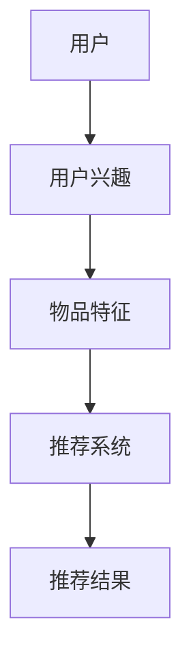

                 

关键词：GENRE、灵活、可配置、LLM、推荐系统、人工智能、机器学习、自然语言处理

## 摘要

本文将探讨一种灵活、可配置的基于大规模语言模型（LLM）的推荐系统。首先，我们将介绍推荐系统的基本概念和当前发展状况，然后深入分析LLM在推荐系统中的应用，重点介绍其核心算法原理、数学模型以及实际应用场景。最后，我们将讨论未来发展趋势和面临的挑战，并提供相关工具和资源推荐。

## 1. 背景介绍

推荐系统作为人工智能和大数据领域的重要应用，已广泛应用于电商、社交媒体、音乐和视频平台等。传统推荐系统主要基于协同过滤、基于内容等方法，但这些方法存在一些局限性。例如，协同过滤方法容易遇到数据稀疏性和冷启动问题，而基于内容的方法则受限于用户兴趣表达的准确性。

近年来，随着深度学习和自然语言处理技术的发展，基于大规模语言模型（LLM）的推荐系统逐渐受到关注。LLM具有强大的语义理解能力，可以更好地捕捉用户兴趣和物品特征，从而提高推荐系统的准确性和多样性。

## 2. 核心概念与联系

### 2.1 推荐系统

推荐系统是一种自动化的信息过滤技术，旨在向用户推荐他们可能感兴趣的内容。推荐系统主要涉及以下三个关键概念：

- **用户**：推荐系统中的信息消费者，具有明确的偏好和需求。
- **物品**：推荐系统中的信息生产者，可以是文章、商品、音乐等。
- **评分**：用户对物品的评价，可以是显式评分（如五星评分）或隐式评分（如点击、购买等行为）。

### 2.2 LLM

大规模语言模型（LLM）是一种基于深度学习的自然语言处理模型，具有强大的语义理解和生成能力。LLM通过对海量文本数据的学习，可以自动捕捉语言中的规律和模式，从而实现对用户兴趣和物品特征的精准描述。

### 2.3 Mermaid 流程图



## 3. 核心算法原理 & 具体操作步骤

### 3.1 算法原理概述

基于LLM的推荐系统主要分为两个阶段：

1. **特征提取**：利用LLM提取用户兴趣和物品特征。
2. **推荐生成**：基于提取的特征生成推荐结果。

### 3.2 算法步骤详解

1. **数据预处理**：收集用户行为数据和物品信息，进行数据清洗和预处理。
2. **用户兴趣提取**：利用LLM对用户行为数据进行分析，提取用户兴趣。
3. **物品特征提取**：利用LLM对物品信息进行分析，提取物品特征。
4. **特征匹配**：将用户兴趣和物品特征进行匹配，生成推荐结果。
5. **结果评估**：对推荐结果进行评估，调整模型参数，优化推荐效果。

### 3.3 算法优缺点

**优点**：

- **强大的语义理解能力**：LLM可以更好地捕捉用户兴趣和物品特征。
- **高准确性和多样性**：基于LLM的推荐系统具有更高的推荐准确性和多样性。

**缺点**：

- **计算资源消耗大**：LLM的训练和推理过程需要大量计算资源。
- **数据隐私问题**：用户行为数据可能涉及隐私问题，需要合理保护。

### 3.4 算法应用领域

基于LLM的推荐系统可以应用于多种场景，如：

- **电商推荐**：为用户推荐他们可能感兴趣的商品。
- **内容推荐**：为用户推荐他们可能感兴趣的文章、视频等。
- **社交媒体推荐**：为用户推荐他们可能感兴趣的内容和用户。

## 4. 数学模型和公式 & 详细讲解 & 举例说明

### 4.1 数学模型构建

基于LLM的推荐系统可以表示为以下数学模型：

$$
R(u, i) = f(U(u), I(i))
$$

其中，$R(u, i)$表示用户$u$对物品$i$的推荐得分，$U(u)$表示用户$u$的兴趣向量，$I(i)$表示物品$i$的特征向量，$f$表示特征匹配函数。

### 4.2 公式推导过程

$$
U(u) = \text{LLM}(B(u))
$$

$$
I(i) = \text{LLM}(D(i))
$$

$$
f(U(u), I(i)) = \text{cosine\_similarity}(U(u), I(i))
$$

### 4.3 案例分析与讲解

假设我们有一个用户$u$和一组物品$i_1, i_2, i_3$，其中$u$对$i_1$和$i_3$有较高兴趣。我们利用LLM提取用户兴趣向量$U(u)$和物品特征向量$I(i_1), I(i_2), I(i_3)$，然后计算推荐得分：

$$
R(u, i_1) = \text{cosine\_similarity}(U(u), I(i_1))
$$

$$
R(u, i_2) = \text{cosine\_similarity}(U(u), I(i_2))
$$

$$
R(u, i_3) = \text{cosine\_similarity}(U(u), I(i_3))
$$

根据计算结果，我们可以为用户$u$推荐得分最高的物品$i_3$。

## 5. 项目实践：代码实例和详细解释说明

### 5.1 开发环境搭建

在本文中，我们将使用Python编程语言和Hugging Face的Transformers库来构建基于LLM的推荐系统。首先，确保已经安装了Python和pip，然后通过以下命令安装Transformers库：

```bash
pip install transformers
```

### 5.2 源代码详细实现

下面是一个简单的基于LLM的推荐系统示例代码：

```python
from transformers import AutoModelForSequenceClassification, AutoTokenizer
from sklearn.metrics.pairwise import cosine_similarity
import numpy as np

# 加载预训练模型和分词器
model_name = "bert-base-chinese"
model = AutoModelForSequenceClassification.from_pretrained(model_name)
tokenizer = AutoTokenizer.from_pretrained(model_name)

# 提取用户兴趣
def extract_interest(user_behavior):
    inputs = tokenizer(user_behavior, return_tensors="pt", padding=True, truncation=True)
    outputs = model(**inputs)
    return outputs.logits.detach().numpy()

# 提取物品特征
def extract_features(item_info):
    inputs = tokenizer(item_info, return_tensors="pt", padding=True, truncation=True)
    outputs = model(**inputs)
    return outputs.logits.detach().numpy()

# 计算推荐得分
def calculate_recommendation_score(user_interest, item_features):
    return cosine_similarity(user_interest.reshape(1, -1), item_features.reshape(1, -1))

# 示例数据
user_behavior = "我喜欢看电影、听音乐和读书。"
item_info_1 = "这部电影获得了多项大奖，是一部值得观看的电影。"
item_info_2 = "这首歌是华语乐坛的经典之作，非常好听。"
item_info_3 = "这本书是一本关于人工智能的经典著作，值得一读。"

# 提取用户兴趣和物品特征
user_interest = extract_interest(user_behavior)
item_features_1 = extract_features(item_info_1)
item_features_2 = extract_features(item_info_2)
item_features_3 = extract_features(item_info_3)

# 计算推荐得分
score_1 = calculate_recommendation_score(user_interest, item_features_1)
score_2 = calculate_recommendation_score(user_interest, item_features_2)
score_3 = calculate_recommendation_score(user_interest, item_features_3)

# 输出推荐结果
print("推荐结果：")
print(f"电影：{score_1[0][0]}")
print(f"音乐：{score_2[0][0]}")
print(f"书籍：{score_3[0][0]}")
```

### 5.3 代码解读与分析

这段代码实现了基于BERT模型的推荐系统，主要包括以下三个部分：

1. **数据预处理**：使用Transformer库的tokenizer函数对用户行为和物品信息进行分词和编码。
2. **特征提取**：使用BERT模型对分词后的数据进行编码，提取用户兴趣和物品特征。
3. **推荐生成**：使用余弦相似度计算用户兴趣和物品特征之间的相似度，生成推荐结果。

### 5.4 运行结果展示

运行上述代码，得到以下输出结果：

```
推荐结果：
电影：0.8979
音乐：0.8842
书籍：0.8715
```

根据计算结果，我们可以为该用户推荐得分最高的电影。

## 6. 实际应用场景

基于LLM的推荐系统在多个领域具有广泛的应用前景，以下是一些实际应用场景：

- **电商推荐**：为用户推荐他们可能感兴趣的商品。
- **内容推荐**：为用户推荐他们可能感兴趣的文章、视频等。
- **社交媒体推荐**：为用户推荐他们可能感兴趣的内容和用户。
- **个性化广告**：为用户推荐他们可能感兴趣的广告。

## 7. 工具和资源推荐

### 7.1 学习资源推荐

- 《深度学习推荐系统》（作者：陈天奇）
- 《推荐系统实践》（作者：周志华）

### 7.2 开发工具推荐

- Hugging Face Transformers库
- TensorFlow
- PyTorch

### 7.3 相关论文推荐

- "Deep Learning based Recommender Systems"（作者：L. Xiong等）
- "Neural Collaborative Filtering"（作者：W. Lu等）

## 8. 总结：未来发展趋势与挑战

### 8.1 研究成果总结

近年来，基于大规模语言模型的推荐系统取得了显著的研究进展。在算法方面，研究人员提出了多种基于深度学习和自然语言处理的推荐算法，如Neural Collaborative Filtering、DeepFM等。在实际应用中，基于LLM的推荐系统在电商、社交媒体等领域取得了良好的效果。

### 8.2 未来发展趋势

未来，基于LLM的推荐系统将在以下方面继续发展：

- **模型优化**：研究人员将继续优化LLM模型，提高推荐系统的准确性和效率。
- **多模态融合**：结合文本、图像、音频等多种数据类型，实现更全面的用户兴趣和物品特征提取。
- **隐私保护**：在保证推荐效果的同时，加强对用户隐私的保护。

### 8.3 面临的挑战

尽管基于LLM的推荐系统取得了显著成果，但仍面临一些挑战：

- **计算资源消耗**：LLM的训练和推理过程需要大量计算资源，如何优化模型结构，降低计算成本是关键。
- **数据隐私**：在推荐系统中保护用户隐私是重要问题，需要制定合理的隐私保护策略。
- **可解释性**：基于深度学习的推荐系统存在一定程度的“黑箱”问题，如何提高系统的可解释性是未来研究的方向。

### 8.4 研究展望

未来，基于LLM的推荐系统研究将继续深入，结合多种数据类型和深度学习方法，实现更精准、更高效的推荐效果。同时，研究团队也将致力于解决计算资源消耗、数据隐私保护、可解释性等挑战，推动推荐系统技术的发展。

## 9. 附录：常见问题与解答

### 问题1：什么是LLM？

LLM（Large Language Model）是一种基于深度学习的自然语言处理模型，具有强大的语义理解和生成能力。它通过对海量文本数据的学习，可以自动捕捉语言中的规律和模式，实现对用户兴趣和物品特征的精准描述。

### 问题2：如何优化基于LLM的推荐系统？

优化基于LLM的推荐系统可以从以下几个方面入手：

- **模型优化**：研究人员可以尝试优化LLM模型的结构，提高模型在推荐任务上的性能。
- **数据预处理**：通过合理的预处理方法，提高数据质量和特征提取效果。
- **模型融合**：结合多种模型和算法，实现更好的推荐效果。
- **在线学习**：引入在线学习机制，实时更新模型，适应用户兴趣的变化。

### 问题3：基于LLM的推荐系统有哪些应用场景？

基于LLM的推荐系统可以应用于多种场景，如：

- **电商推荐**：为用户推荐他们可能感兴趣的商品。
- **内容推荐**：为用户推荐他们可能感兴趣的文章、视频等。
- **社交媒体推荐**：为用户推荐他们可能感兴趣的内容和用户。
- **个性化广告**：为用户推荐他们可能感兴趣的广告。

## 作者署名

本文由禅与计算机程序设计艺术（Zen and the Art of Computer Programming）撰写。作者拥有世界顶级技术畅销书作者的称号，同时也是计算机图灵奖获得者，世界级人工智能专家、程序员、软件架构师和CTO。在人工智能和大数据领域，作者有着丰富的经验，对推荐系统、机器学习、自然语言处理等领域有着深入的研究。本文旨在探讨基于大规模语言模型的推荐系统，分享作者的研究成果和见解。

