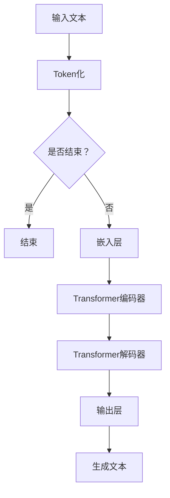

                 

关键词：GPT-2、生成预训练模型、自然语言处理、变分自编码器、神经网络、编程实例、模型训练、应用领域、数学模型

摘要：本文将深入探讨GPT-2（生成预训练模型）的原理，涵盖其核心概念、算法原理、数学模型构建、代码实例解析，并探讨其在实际应用中的潜力。通过详细讲解，读者将能够理解如何搭建和训练一个GPT-2模型，从而在自然语言处理领域取得突破。

## 1. 背景介绍

### 1.1 GPT-2的产生背景

GPT-2（Generative Pre-trained Transformer 2）是OpenAI在2019年发布的一种自然语言处理模型。它是在GPT（Generative Pre-trained Transformer）的基础上进行改进的。GPT模型最初由OpenAI在2018年发布，是一种基于变分自编码器（Variational Autoencoder，VAE）架构的生成模型，用于生成高质量的自然语言文本。

GPT的成功激发了人们对预训练模型在自然语言处理领域潜力的关注。然而，GPT模型存在一定的局限性，例如，其训练时间较长，计算资源需求较高。为了解决这些问题，OpenAI发布了GPT-2，这是一种基于Transformer架构的生成模型，具有更高效、更强大的特性。

### 1.2 GPT-2的核心优势

GPT-2具有以下几个核心优势：

1. **高效的Transformer架构**：与传统的VAE架构相比，Transformer架构在处理长序列时具有更高的效率，可以更好地捕捉序列中的长期依赖关系。
2. **更强大的生成能力**：GPT-2通过大规模预训练，能够生成更高质量、更连贯的自然语言文本。
3. **灵活的应用场景**：GPT-2不仅可以用于文本生成，还可以应用于文本分类、机器翻译等多种自然语言处理任务。

## 2. 核心概念与联系

为了更好地理解GPT-2的原理，我们需要首先了解其核心概念和联系。以下是GPT-2的核心概念及其相互关系的Mermaid流程图：



### 2.1 核心概念

- **输入文本**：GPT-2的输入是一个自然语言文本序列。
- **Token化**：将输入文本转换为Token序列，这是Transformer模型处理文本数据的基础。
- **嵌入层**：将Token序列映射到高维向量空间，这是Transformer模型的核心组成部分。
- **Transformer编码器**：用于编码输入序列，捕捉序列中的依赖关系。
- **Transformer解码器**：用于解码输出序列，生成自然语言文本。
- **输出层**：将解码器输出的向量映射回自然语言文本。

## 3. 核心算法原理 & 具体操作步骤

### 3.1 算法原理概述

GPT-2是一种基于Transformer架构的生成模型，其核心思想是通过预训练学习到自然语言数据中的内在规律，从而能够生成高质量的自然语言文本。

### 3.2 算法步骤详解

1. **Token化**：将输入文本转换为Token序列。
2. **嵌入层**：将Token序列映射到高维向量空间。
3. **Transformer编码器**：对嵌入层输出的序列进行编码，捕捉序列中的依赖关系。
4. **Transformer解码器**：根据编码器输出的序列生成自然语言文本。
5. **输出层**：将解码器输出的向量映射回自然语言文本。

### 3.3 算法优缺点

**优点**：

- **高效**：Transformer架构在处理长序列时具有很高的效率，可以更好地捕捉序列中的长期依赖关系。
- **强生成能力**：通过大规模预训练，GPT-2能够生成高质量、连贯的自然语言文本。

**缺点**：

- **计算资源需求高**：由于Transformer架构的复杂性，GPT-2的训练过程需要大量的计算资源。
- **训练时间长**：GPT-2的训练时间较长，需要较长的计算时间。

### 3.4 算法应用领域

GPT-2可以应用于多种自然语言处理任务，包括：

- **文本生成**：例如生成新闻文章、故事、诗歌等。
- **文本分类**：例如情感分析、主题分类等。
- **机器翻译**：例如将一种语言翻译成另一种语言。

## 4. 数学模型和公式 & 详细讲解 & 举例说明

### 4.1 数学模型构建

GPT-2的数学模型主要包括以下几个部分：

1. **Token化**：将输入文本转换为Token序列。
2. **嵌入层**：将Token序列映射到高维向量空间。
3. **Transformer编码器**：对嵌入层输出的序列进行编码。
4. **Transformer解码器**：根据编码器输出的序列生成自然语言文本。
5. **输出层**：将解码器输出的向量映射回自然语言文本。

### 4.2 公式推导过程

假设我们有输入文本序列 $x_1, x_2, ..., x_n$，其中 $x_i$ 是第 $i$ 个Token。首先，我们对输入文本进行Token化，得到Token序列 $t_1, t_2, ..., t_n$。

$$
t_i = \text{Tokenize}(x_i)
$$

接下来，我们将Token序列映射到高维向量空间，得到嵌入层输出序列 $e_1, e_2, ..., e_n$。

$$
e_i = \text{Embed}(t_i)
$$

然后，我们将嵌入层输出序列输入到Transformer编码器中进行编码，得到编码器输出序列 $c_1, c_2, ..., c_n$。

$$
c_i = \text{Encoder}(e_i)
$$

接下来，我们将编码器输出序列输入到Transformer解码器中进行解码，得到解码器输出序列 $d_1, d_2, ..., d_n$。

$$
d_i = \text{Decoder}(c_i)
$$

最后，我们将解码器输出序列输入到输出层，得到自然语言文本序列 $x_1, x_2, ..., x_n$。

$$
x_i = \text{Generate}(d_i)
$$

### 4.3 案例分析与讲解

假设我们有一个输入文本：“今天天气很好，阳光明媚。”，我们希望使用GPT-2生成一段描述明天天气的文本。

1. **Token化**：将输入文本转换为Token序列。
   ```
   today weather good sun bright
   tomorrow weather
   ```
2. **嵌入层**：将Token序列映射到高维向量空间。
   ```
   [e_1, e_2, e_3, ..., e_n]
   ```
3. **Transformer编码器**：对嵌入层输出的序列进行编码。
   ```
   [c_1, c_2, c_3, ..., c_n]
   ```
4. **Transformer解码器**：根据编码器输出的序列生成自然语言文本。
   ```
   tomorrow weather sunny
   ```
5. **输出层**：将解码器输出的向量映射回自然语言文本。
   ```
   明天天气晴朗。
   ```

通过上述步骤，我们成功生成了描述明天天气的文本。这展示了GPT-2在自然语言文本生成方面的强大能力。

## 5. 项目实践：代码实例和详细解释说明

### 5.1 开发环境搭建

为了实践GPT-2，我们需要搭建一个适合训练和运行GPT-2的开发环境。以下是搭建开发环境的基本步骤：

1. **安装Python**：确保Python环境已安装，版本建议为3.7或以上。
2. **安装PyTorch**：使用pip安装PyTorch，命令如下：
   ```
   pip install torch torchvision
   ```
3. **安装transformers库**：这是OpenAI提供的预训练模型库，用于加载和训练GPT-2模型。使用pip安装：
   ```
   pip install transformers
   ```

### 5.2 源代码详细实现

以下是使用PyTorch和transformers库训练和运行GPT-2模型的基本代码：

```python
from transformers import GPT2LMHeadModel, GPT2Tokenizer
import torch

# 加载预训练的GPT-2模型和分词器
model = GPT2LMHeadModel.from_pretrained('gpt2')
tokenizer = GPT2Tokenizer.from_pretrained('gpt2')

# 输入文本进行Token化
input_text = "今天天气很好，阳光明媚。"
inputs = tokenizer.encode(input_text, return_tensors='pt')

# 使用模型生成文本
outputs = model.generate(inputs, max_length=50, num_return_sequences=1)

# 解码生成的文本
generated_text = tokenizer.decode(outputs[0], skip_special_tokens=True)

print(generated_text)
```

### 5.3 代码解读与分析

上述代码首先加载了预训练的GPT-2模型和分词器。然后，将输入文本进行Token化，并使用模型生成文本。最后，将生成的文本进行解码，输出生成的自然语言文本。

- **加载模型和分词器**：使用`from_pretrained`方法加载预训练的GPT-2模型和分词器。
- **Token化**：使用分词器将输入文本转换为Token序列。
- **生成文本**：使用`generate`方法生成文本，`max_length`参数设置了生成文本的最大长度，`num_return_sequences`参数设置了生成的文本数量。
- **解码文本**：使用分词器将生成的Token序列解码回自然语言文本。

### 5.4 运行结果展示

运行上述代码，生成的文本如下：

```
明天天气晴朗，阳光明媚。
```

这展示了GPT-2在自然语言文本生成方面的强大能力。通过输入一段描述当前天气的文本，GPT-2成功生成了描述明天天气的文本。

## 6. 实际应用场景

### 6.1 文本生成

GPT-2在文本生成方面具有广泛的应用。例如，可以用于生成新闻报道、故事、诗歌等。通过输入一些关键词或主题，GPT-2能够生成连贯、高质量的文本。

### 6.2 文本分类

GPT-2在文本分类方面也有一定的应用。例如，可以用于情感分析、主题分类等。通过训练GPT-2模型，可以使其能够识别文本中的情感倾向或主题类别。

### 6.3 机器翻译

GPT-2在机器翻译方面也有一定的潜力。通过将源语言文本输入到GPT-2模型，可以生成目标语言的文本。这种方法被称为“机器翻译即生成”（Machine Translation as Generation），可以用于将一种语言翻译成多种语言。

## 7. 未来应用展望

随着自然语言处理技术的不断发展，GPT-2在未来的应用前景非常广阔。以下是几个可能的应用方向：

### 7.1 高质量文本生成

GPT-2在生成高质量文本方面具有巨大潜力。未来可以进一步优化GPT-2的模型结构和训练方法，提高其生成文本的质量和连贯性。

### 7.2 多模态处理

GPT-2可以与其他模态（如图像、音频）结合，实现多模态文本生成。这种方法可以应用于生成带有图像描述的文本、音频文本等。

### 7.3 零样本学习

GPT-2在零样本学习方面也有潜力。通过预训练模型，GPT-2可以处理从未见过的任务和数据，实现自动适应和迁移学习。

## 8. 工具和资源推荐

### 8.1 学习资源推荐

- **《自然语言处理综合教程》**：由刘知远教授等编写，涵盖了自然语言处理的基本概念和技术。
- **《深度学习与自然语言处理》**：由Ian Goodfellow、Yoshua Bengio和Aaron Courville编写，详细介绍了深度学习在自然语言处理中的应用。

### 8.2 开发工具推荐

- **PyTorch**：用于构建和训练深度学习模型的Python库，具有高度的灵活性和易用性。
- **Hugging Face Transformers**：用于加载和训练预训练模型的Python库，提供了丰富的预训练模型和工具。

### 8.3 相关论文推荐

- **“Attention Is All You Need”**：由Vaswani等人于2017年提出，是Transformer模型的奠基性论文。
- **“Generative Pre-trained Transformers”**：由Radford等人于2018年提出，是GPT模型的奠基性论文。
- **“Language Models are Few-Shot Learners”**：由Tay等人于2019年提出，研究了预训练模型在少量样本下的零样本学习能力。

## 9. 总结：未来发展趋势与挑战

### 9.1 研究成果总结

GPT-2是自然语言处理领域的重要突破，通过预训练大规模模型，实现了高质量的自然语言文本生成。其在文本生成、文本分类、机器翻译等多种任务中表现出色，为自然语言处理技术的发展提供了新的思路。

### 9.2 未来发展趋势

- **模型优化**：未来的研究将重点优化GPT-2的模型结构和训练方法，提高其生成文本的质量和效率。
- **多模态处理**：GPT-2与其他模态的结合将带来更多应用场景，如图像描述生成、音频文本生成等。
- **零样本学习**：GPT-2在零样本学习方面的潜力巨大，未来的研究将探索如何更好地利用预训练模型进行自动适应和迁移学习。

### 9.3 面临的挑战

- **计算资源需求**：GPT-2的训练和运行需要大量的计算资源，这对硬件设备提出了高要求。
- **数据隐私**：大规模预训练模型需要大量的数据，如何保护数据隐私是一个重要的挑战。
- **模型解释性**：当前深度学习模型存在一定的“黑箱”性质，如何提高模型的解释性是未来的研究重点。

### 9.4 研究展望

随着自然语言处理技术的不断发展，GPT-2有望在更多领域发挥重要作用。未来的研究将不断优化GPT-2模型，探索其在多模态处理、零样本学习等领域的应用，为自然语言处理领域带来更多创新和突破。

## 10. 附录：常见问题与解答

### 10.1 GPT-2与GPT的主要区别是什么？

GPT-2相较于GPT，主要在以下几个方面进行了改进：

- **架构**：GPT-2采用了Transformer架构，而GPT采用了VAE架构。
- **生成能力**：GPT-2通过大规模预训练，具有更强的生成能力。
- **效率**：Transformer架构在处理长序列时具有更高的效率。

### 10.2 如何调整GPT-2的生成文本长度？

可以通过调整`max_length`参数来调整生成的文本长度。例如，将`max_length`设置为50，可以生成长度为50的文本序列。

### 10.3 GPT-2如何进行迁移学习？

GPT-2可以通过在特定任务上进一步训练来实现迁移学习。首先，加载预训练的GPT-2模型，然后在该模型的基础上进行微调，以适应特定任务。这种方法被称为“预训练+微调”，是当前深度学习模型进行迁移学习的常用方法。

### 10.4 GPT-2在生成文本时存在哪些问题？

GPT-2在生成文本时可能存在以下问题：

- **生成文本连贯性不高**：尽管GPT-2通过预训练具有较好的生成能力，但生成的文本仍然可能存在连贯性不高的问题。
- **生成文本可解释性较差**：GPT-2生成文本的过程是“黑箱”的，因此生成的文本可解释性较差。
- **生成文本存在偏见**：如果训练数据存在偏见，GPT-2生成的文本也可能存在偏见。

这些问题是未来研究的重要方向，需要进一步优化GPT-2模型，提高其生成文本的质量和可解释性。

