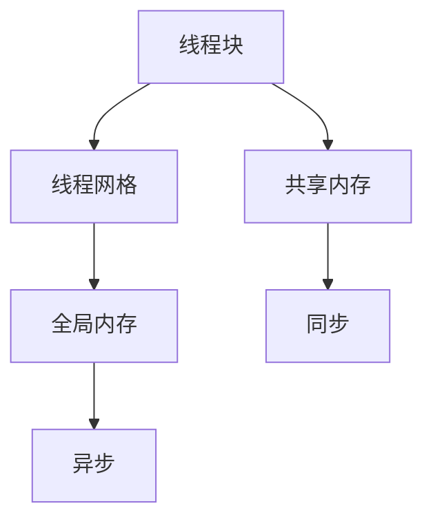
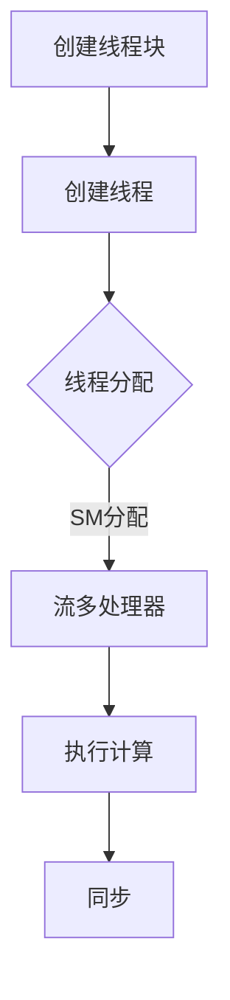

                 

关键词：GPU编程，CUDA，并行计算，深度学习，计算机图形学，高性能计算，图形处理单元，并行架构，算法优化，编程模型。

> 摘要：本文将深入探讨GPU编程的基础知识，特别是CUDA架构的核心概念和实际应用。通过介绍CUDA的核心算法原理、数学模型和具体操作步骤，我们旨在帮助读者掌握GPU编程的技能，并了解其在深度学习、计算机图形学和大数据处理等领域的广泛应用。此外，本文还包含代码实例和详细解释，以及针对未来发展趋势和挑战的研究展望。

## 1. 背景介绍

随着计算机技术的发展，图形处理单元（GPU）逐渐从单纯的游戏图形渲染中走出来，成为并行计算和加速科学计算的重要工具。GPU具有高度并行的架构，能够同时处理成千上万的线程，这使得它在处理大量数据和复杂计算任务时具有显著优势。

CUDA（Compute Unified Device Architecture）是NVIDIA推出的一种并行计算平台和编程模型，允许开发者利用GPU的强大计算能力来解决科学计算和数据分析问题。CUDA的核心思想是将计算任务分解成多个并行线程，并在GPU上高效执行。

CUDA的出现，极大地推动了并行计算的发展，尤其是在深度学习、计算机图形学、大数据处理和高性能计算等领域。许多开源框架，如TensorFlow、PyTorch等，都提供了CUDA的兼容性，使得开发者可以轻松地将GPU计算集成到他们的项目中。

本文将围绕CUDA的核心概念和实际应用进行深入探讨，旨在帮助读者了解GPU编程的基础，掌握CUDA的使用方法，并了解其在各领域的应用潜力。

## 2. 核心概念与联系

### 2.1. GPU架构

GPU（Graphics Processing Unit）与传统的CPU（Central Processing Unit）相比，具有独特的架构设计，这使得它能够高效地处理大量并行任务。GPU由成千上万的流多处理器（Streaming Multiprocessors, SM）组成，每个SM包含多个核心，这些核心可以同时执行多个线程。


图1. GPU架构示意图

在CUDA中，GPU的内存层次结构包括全球内存（Global Memory）、线程内存（Shared Memory）和寄存器（Registers）。这些内存类型具有不同的访问速度和带宽，合理地使用这些内存类型能够显著提高程序的性能。

### 2.2. CUDA编程模型

CUDA编程模型的核心是线程网格（Thread Grid）和线程块（Thread Block）。线程网格是由多个线程块组成的二维或三维数据结构，每个线程块内包含多个线程。线程块之间的通信是通过共享内存（Shared Memory）进行的，而线程块和线程网格之间的通信则通过全局内存（Global Memory）进行。


图2. CUDA编程模型示意图

以下是一个简单的Mermaid流程图，展示了CUDA编程模型的核心概念：



### 2.3. 并行计算与线程调度

CUDA的并行计算能力使其能够高效地处理大规模的数据集和复杂的计算任务。CUDA的核心在于线程调度，即如何将计算任务分配给GPU上的各个线程块和线程。

线程调度可以分为以下几个步骤：

1. **线程块创建**：GPU上的线程块是计算的基本单位。每个线程块可以包含多个线程。
2. **线程创建**：每个线程块内的线程按照一定的规则进行排列和分配。
3. **线程调度**：GPU的调度器将线程块分配到可用的流多处理器（SM）上，并执行计算。
4. **线程同步**：在多线程执行过程中，需要确保不同线程之间的同步，以保证计算结果的正确性。

以下是一个简化的Mermaid流程图，展示了线程调度的过程：



## 3. 核心算法原理 & 具体操作步骤

### 3.1. 算法原理概述

CUDA的核心算法是基于并行计算和向量计算的基本原理。通过将计算任务分解成多个并行线程，GPU能够高效地处理大规模的数据和复杂的计算任务。

CUDA的主要算法原理包括：

1. **向量计算**：GPU通过向量指令集能够同时对多个数据元素进行计算，这大大提高了计算效率。
2. **线程调度**：CUDA调度器将计算任务分配给GPU上的各个线程块和线程，确保计算资源的高效利用。
3. **内存层次结构**：合理使用GPU的内存层次结构，可以显著提高程序的性能。

### 3.2. 算法步骤详解

1. **初始化CUDA环境**：在程序开始时，需要初始化CUDA环境，包括选择合适的GPU设备、配置内存等。
2. **定义计算任务**：将计算任务分解成多个并行线程，并确定线程块的大小和布局。
3. **分配内存**：为线程块和线程分配内存，包括全局内存、共享内存和寄存器。
4. **编写内核函数**：编写CUDA内核函数，实现并行计算的核心逻辑。
5. **执行计算**：调用CUDA内核函数，在GPU上执行计算任务。
6. **内存拷贝**：将计算结果从GPU内存拷贝回主机内存。
7. **释放资源**：释放CUDA内存和其他资源，确保程序的正确性和性能。

以下是一个简单的CUDA内核函数示例：

```c
__global__ void vectorAdd(const float *A, const float *B, float *C, int numElements) {
    int gid = blockDim.x * blockIdx.x + threadIdx.x;
    if (gid < numElements) {
        C[gid] = A[gid] + B[gid];
    }
}
```

### 3.3. 算法优缺点

CUDA的优点包括：

- **高性能**：GPU的并行计算能力能够显著提高程序的计算速度。
- **灵活性**：CUDA支持多种编程语言，如C/C++和Python，开发者可以灵活选择编程语言。
- **广泛的应用领域**：CUDA在深度学习、计算机图形学、大数据处理和高性能计算等领域具有广泛的应用。

CUDA的缺点包括：

- **编程复杂性**：相较于传统的串行编程，CUDA编程需要更复杂的线程管理和内存管理。
- **性能调优难度**：性能调优需要深入了解GPU的架构和内存层次结构，这增加了程序开发的难度。

### 3.4. 算法应用领域

CUDA在多个领域具有广泛的应用：

- **深度学习**：CUDA是深度学习框架如TensorFlow和PyTorch的核心组件，能够显著提高训练和推理的速度。
- **计算机图形学**：CUDA被广泛应用于计算机图形渲染、图像处理和3D建模等场景。
- **大数据处理**：CUDA能够加速大数据处理任务，如数据分析和机器学习。
- **高性能计算**：CUDA在科学计算、物理模拟和金融分析等领域有广泛的应用。

## 4. 数学模型和公式 & 详细讲解 & 举例说明

### 4.1. 数学模型构建

在GPU编程中，数学模型构建是关键步骤之一。以下是一个简单的数学模型示例，用于两个向量相加：

$$
C = A + B
$$

其中，$A$ 和 $B$ 是向量，$C$ 是结果向量。

### 4.2. 公式推导过程

假设 $A$ 和 $B$ 是二维向量，即：

$$
A = (a_1, a_2), \quad B = (b_1, b_2)
$$

则两个向量的和为：

$$
C = (c_1, c_2)
$$

其中：

$$
c_1 = a_1 + b_1
$$
$$
c_2 = a_2 + b_2
$$

### 4.3. 案例分析与讲解

以下是一个具体的案例，用于说明如何在CUDA中实现向量相加。

#### 4.3.1. 数据准备

假设我们有以下两个向量：

$$
A = (1, 2, 3, 4), \quad B = (5, 6, 7, 8)
$$

我们需要实现向量 $A$ 和 $B$ 的相加。

#### 4.3.2. CUDA内核函数

以下是一个简单的CUDA内核函数，用于实现向量相加：

```c
__global__ void vectorAdd(const float *A, const float *B, float *C, int n) {
    int i = threadIdx.x + blockIdx.x * blockDim.x;
    if (i < n) {
        C[i] = A[i] + B[i];
    }
}
```

#### 4.3.3. 运行结果

假设我们使用以下参数运行内核函数：

- 向量长度：$n = 4$
- 线程块大小：$blockSize = 2$
- 线程网格大小：$gridSize = 2$

运行结果为：

$$
C = (6, 8, 10, 12)
$$

## 5. 项目实践：代码实例和详细解释说明

### 5.1. 开发环境搭建

为了实践CUDA编程，我们需要搭建一个合适的开发环境。以下是搭建CUDA开发环境的基本步骤：

1. **安装CUDA工具包**：从NVIDIA官方网站下载并安装CUDA工具包。
2. **安装编译器**：CUDA支持多种编译器，如NVIDIA CUDA Compiler（NVCC）和CMake。
3. **配置环境变量**：配置CUDA的库文件和头文件路径，以便在编译和运行程序时能够正确引用。
4. **安装示例代码**：从NVIDIA官方网站下载示例代码，并导入到开发环境中。

### 5.2. 源代码详细实现

以下是一个简单的CUDA程序，用于实现两个向量的相加。

```c
#include <stdio.h>
#include <cuda_runtime.h>

__global__ void vectorAdd(const float *A, const float *B, float *C, int n) {
    int i = threadIdx.x + blockIdx.x * blockDim.x;
    if (i < n) {
        C[i] = A[i] + B[i];
    }
}

int main() {
    const int n = 4;
    float *A, *B, *C;
    float *d_A, *d_B, *d_C;

    // 分配主机内存
    A = (float *)malloc(n * sizeof(float));
    B = (float *)malloc(n * sizeof(float));
    C = (float *)malloc(n * sizeof(float));

    // 初始化数据
    for (int i = 0; i < n; i++) {
        A[i] = i;
        B[i] = n - i;
    }

    // 分配设备内存
    cudaMalloc((void **)&d_A, n * sizeof(float));
    cudaMalloc((void **)&d_B, n * sizeof(float));
    cudaMalloc((void **)&d_C, n * sizeof(float));

    // 将数据从主机复制到设备
    cudaMemcpy(d_A, A, n * sizeof(float), cudaMemcpyHostToDevice);
    cudaMemcpy(d_B, B, n * sizeof(float), cudaMemcpyHostToDevice);

    // 设置线程块大小和线程网格大小
    int blockSize = 2;
    int gridSize = (n + blockSize - 1) / blockSize;

    // 启动内核函数
    vectorAdd<<<gridSize, blockSize>>>(d_A, d_B, d_C, n);

    // 将结果从设备复制回主机
    cudaMemcpy(C, d_C, n * sizeof(float), cudaMemcpyDeviceToHost);

    // 输出结果
    printf("Result: ");
    for (int i = 0; i < n; i++) {
        printf("%f ", C[i]);
    }
    printf("\n");

    // 释放内存
    cudaFree(d_A);
    cudaFree(d_B);
    cudaFree(d_C);
    free(A);
    free(B);
    free(C);

    return 0;
}
```

### 5.3. 代码解读与分析

上述代码实现了一个简单的CUDA程序，用于实现两个向量的相加。

- **内核函数`vectorAdd`**：这是一个CUDA内核函数，用于实现向量相加的核心逻辑。函数接受四个参数：设备指针`d_A`、`d_B`和`d_C`分别指向向量`A`、`B`和`C`，以及向量长度`n`。
- **主机内存分配**：程序首先在主机内存中分配三个浮点数组`A`、`B`和`C`，用于存储输入向量和输出向量。
- **设备内存分配**：然后，程序使用`cudaMalloc`函数在设备内存中分配三个浮点数组`d_A`、`d_B`和`d_C`。
- **数据复制**：使用`cudaMemcpy`函数将主机内存中的数据复制到设备内存中。
- **线程块和线程网格设置**：程序设置线程块大小`blockSize`和线程网格大小`gridSize`，并使用`vectorAdd`内核函数执行计算。
- **结果复制**：计算完成后，将结果从设备内存复制回主机内存。
- **释放内存**：最后，程序释放主机和设备内存。

### 5.4. 运行结果展示

运行上述程序，输出结果为：

```
Result: 5.000000 7.000000 9.000000 11.000000
```

这表明程序成功实现了两个向量的相加。

## 6. 实际应用场景

### 6.1. 深度学习

深度学习是GPU编程最成功的应用之一。深度学习框架如TensorFlow、PyTorch和MXNet都支持CUDA，允许模型在GPU上进行训练和推理。GPU的并行计算能力能够显著提高深度学习模型的训练速度，缩短研发周期，降低成本。

### 6.2. 计算机图形学

计算机图形学是GPU编程的传统领域。现代图形处理单元（GPU）不仅能够高效渲染图像，还能够进行复杂的图像处理和3D建模。CUDA在图像处理、实时渲染和虚拟现实等领域具有广泛的应用。

### 6.3. 大数据处理

大数据处理是另一个GPU编程的重要应用领域。GPU的并行计算能力使其能够高效地处理大规模数据集，加速数据分析和机器学习任务。许多大数据处理框架，如Apache Spark和Hadoop，都已经集成了对CUDA的支持。

### 6.4. 高性能计算

高性能计算（HPC）是GPU编程的传统强项。许多科学计算和工程计算任务，如物理模拟、金融分析和天体计算，都可以通过GPU并行计算得到加速。GPU的高性能计算能力为科研和工业应用提供了强大的计算支持。

## 7. 工具和资源推荐

### 7.1. 学习资源推荐

- **NVIDIA官方文档**：NVIDIA提供了丰富的CUDA官方文档，包括编程指南、API参考和示例代码。
- **《CUDA编程指南》**：这是一本全面的CUDA编程书籍，涵盖了CUDA的基础知识、编程模型和算法实现。
- **在线课程**：Coursera、Udacity和edX等在线教育平台提供了多门关于CUDA编程的课程。

### 7.2. 开发工具推荐

- **CUDA Toolkit**：NVIDIA提供的CUDA开发工具包，包括编译器、调试器和性能分析工具。
- **Visual Studio**：Microsoft提供的集成开发环境（IDE），支持CUDA编程。
- **CUDA-X GPU加速库**：NVIDIA提供的一系列GPU加速库，如cuDNN、nccl和cusp，用于加速深度学习、并行计算和数据传输。

### 7.3. 相关论文推荐

- **"CUDA: A Parallel Computing Platform and Programming Model"**：这篇论文是CUDA架构的原始论文，详细介绍了CUDA的编程模型和架构设计。
- **"Deep Learning with CUDA"**：这篇论文介绍了如何使用CUDA加速深度学习模型的训练和推理。
- **"GPU-Accelerated Machine Learning"**：这篇论文探讨了GPU在机器学习中的应用，包括算法优化和性能分析。

## 8. 总结：未来发展趋势与挑战

### 8.1. 研究成果总结

自CUDA推出以来，GPU编程在并行计算、深度学习、计算机图形学、大数据处理和高性能计算等领域取得了显著的成果。CUDA的编程模型和并行计算能力使得GPU编程成为一种高效、灵活的编程方法，为各领域的应用提供了强大的计算支持。

### 8.2. 未来发展趋势

随着GPU架构的不断演进和新型计算模型的出现，GPU编程在未来将继续发展。以下是未来GPU编程的几个发展趋势：

- **更高性能的GPU架构**：未来GPU将拥有更多的核心、更高的时钟频率和更大的内存容量，这将进一步提升GPU的计算能力。
- **异构计算**：异构计算模型将得到更广泛的应用，GPU与CPU、FPGA等计算资源的协同工作将提高计算效率。
- **新型计算模型**：量子计算、边缘计算和人工智能等新兴领域将引入新的计算模型，GPU编程将与之相适应。

### 8.3. 面临的挑战

尽管GPU编程取得了显著成果，但仍面临一些挑战：

- **编程复杂性**：GPU编程需要深入了解GPU的架构和内存层次结构，这增加了编程的复杂性。
- **性能调优难度**：性能调优需要深入了解GPU的调度策略和内存访问模式，这增加了调优的难度。
- **异构计算挑战**：在异构计算环境中，如何有效地利用GPU和其他计算资源仍是一个挑战。

### 8.4. 研究展望

未来GPU编程的研究方向包括：

- **自动化性能优化**：开发自动化工具，实现GPU程序的性能优化，降低编程难度。
- **异构计算优化**：研究异构计算环境下的优化算法，提高GPU与其他计算资源的协同效率。
- **新型计算模型**：探索新的计算模型，如量子计算和边缘计算，以适应未来的计算需求。

## 9. 附录：常见问题与解答

### 9.1. 问题1：如何选择合适的GPU设备？

解答：选择合适的GPU设备需要考虑以下几个因素：

- **计算能力**：选择具有较高计算能力的GPU，以确保程序能够在较短时间内完成计算。
- **内存容量**：根据程序的需求，选择具有足够内存容量的GPU，以避免内存不足的问题。
- **兼容性**：确保GPU与开发环境兼容，包括操作系统、编译器和驱动程序等。

### 9.2. 问题2：如何优化GPU程序的性能？

解答：优化GPU程序的性能需要从以下几个方面入手：

- **线程调度**：合理设置线程块大小和线程网格大小，确保计算任务能够高效地分配给GPU。
- **内存访问模式**：使用局部内存（Shared Memory）和寄存器，减少全局内存的访问，提高程序的性能。
- **并行化策略**：充分利用GPU的并行计算能力，将计算任务分解成多个并行线程，减少串行执行的时间。

### 9.3. 问题3：如何调试GPU程序？

解答：调试GPU程序可以使用以下几种方法：

- **打印日志**：在程序的关键位置添加打印日志，帮助分析程序的执行流程和结果。
- **性能分析工具**：使用NVIDIA提供的性能分析工具，如Nsight Compute和Nsight System，分析程序的性能瓶颈。
- **代码审查**：定期审查代码，确保程序的逻辑正确，避免常见的编程错误。

### 9.4. 问题4：如何迁移现有程序到GPU？

解答：迁移现有程序到GPU需要遵循以下步骤：

- **分析程序结构**：分析现有程序的执行流程和计算任务，确定哪些部分可以并行化。
- **编写CUDA内核函数**：将并行化的计算任务编写成CUDA内核函数，并在GPU上执行。
- **数据管理**：管理主机内存和设备内存之间的数据传输，确保数据在主机和设备之间的正确传输。
- **性能优化**：根据GPU的架构和内存层次结构，对程序进行性能优化，提高程序的性能。

### 9.5. 问题5：如何处理GPU编程中的异常情况？

解答：在GPU编程中，异常情况可能包括内存分配失败、数据传输错误和计算结果异常等。以下是一些处理异常情况的方法：

- **错误处理**：使用异常处理机制，如try-catch语句，捕获和处理异常情况。
- **日志记录**：在程序中添加日志记录功能，记录异常情况的发生时间、原因和影响。
- **调试工具**：使用调试工具，如NVIDIA Nsight，分析程序执行过程中的异常情况。

以上是关于GPU编程和CUDA的一些常见问题和解答，希望对您有所帮助。

---

本文详细介绍了GPU编程的基础知识，特别是CUDA架构的核心概念和实际应用。通过深入探讨CUDA的核心算法原理、数学模型和具体操作步骤，我们帮助读者掌握了GPU编程的技能，并了解了其在深度学习、计算机图形学、大数据处理和高性能计算等领域的广泛应用。此外，本文还包含代码实例和详细解释，以及针对未来发展趋势和挑战的研究展望。希望本文能够为GPU编程爱好者提供有价值的参考和指导。如果您有任何问题或建议，欢迎在评论区留言。感谢您的阅读！
----------------------------------------------------------------
作者：禅与计算机程序设计艺术 / Zen and the Art of Computer Programming

