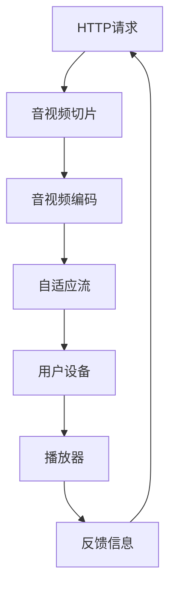

                 

关键词：HLS协议、HTTP、视频分发、多媒体流、网络编码、自适应流、视频编码标准

## 摘要

本文将详细介绍HLS协议（HTTP Live Streaming）在HTTP上分发视频的核心概念、技术原理以及实际应用。HLS协议作为一种基于HTTP的多媒体流传输协议，通过将视频内容分割成小块，并使用自适应流技术，实现了在各种网络环境下高效、可靠的视频分发。文章将从HLS协议的背景介绍、核心概念与联系、核心算法原理、数学模型和公式、项目实践、实际应用场景等方面，深入探讨HLS协议的工作机制及其在多媒体流传输领域的重要地位。

## 1. 背景介绍

随着互联网和移动设备的快速发展，人们对多媒体内容的需求不断增加。在线视频已经成为互联网用户获取信息、娱乐和社交的主要途径之一。然而，网络环境和终端设备的多样性，使得多媒体流传输面临着诸多挑战。如何在不同网络条件下，为用户提供高质量、流畅的视频播放体验，成为了一个亟待解决的问题。

为了应对这些挑战，各大视频服务提供商和研究机构纷纷推出了各种多媒体流传输协议。其中，HLS协议（HTTP Live Streaming）因其高效性、灵活性以及易于部署的特点，得到了广泛的关注和应用。

### 1.1 HLS协议的发展历程

HLS协议是由苹果公司于2009年推出的，旨在解决在线视频直播和点播的传输问题。最初，HLS协议主要用于苹果的iOS和Mac OS平台。随着技术的不断发展和完善，HLS协议逐渐得到了其他操作系统和视频服务提供商的支持。

2010年，苹果公司正式将HLS协议作为其移动设备和操作系统的一部分，进一步推动了HLS协议的普及。此后，HLS协议不断更新和完善，逐渐成为多媒体流传输领域的重要标准之一。

### 1.2 HLS协议的优势

HLS协议具有以下几个显著优势：

1. **兼容性强**：基于HTTP协议，能够与现有的Web技术和基础设施无缝集成，支持各种操作系统和终端设备。

2. **高效性**：采用自适应流技术，根据用户的网络条件和设备性能，动态调整视频的播放质量和分辨率。

3. **灵活性**：支持多种视频编码格式，如H.264、HEVC等，同时可以灵活调整视频流传输的参数，以适应不同场景的需求。

4. **可靠性**：通过将视频内容分割成小块，并使用HTTP协议传输，确保了视频传输的高可靠性和稳定性。

5. **易于部署**：基于现有的Web技术和基础设施，部署成本低，易于推广和应用。

## 2. 核心概念与联系

为了更好地理解HLS协议的工作原理，我们需要先了解一些核心概念和它们之间的联系。以下是HLS协议中的几个重要概念及其相互关系：

### 2.1 HTTP协议

HTTP（Hypertext Transfer Protocol）是互联网上应用最广泛的协议之一，用于在Web服务器和客户端之间传输超文本数据。HLS协议基于HTTP协议，通过HTTP请求和响应实现视频流的传输。

### 2.2 流媒体

流媒体（Streaming Media）是一种在网络上实时传输数据的技术，用户可以随时播放、暂停、停止和快进/快退视频内容。与传统的下载后播放的方式不同，流媒体在传输过程中会实时解码和播放视频内容。

### 2.3 视频编码

视频编码是将视频数据转换成数字信号的过程，以便在网络中传输和存储。常见的视频编码标准包括H.264、HEVC等。HLS协议支持多种视频编码格式，使得它可以适应不同场景的需求。

### 2.4 多媒体流

多媒体流（Multimedia Stream）是指通过网络传输的多媒体数据，包括音频、视频、文字等多种形式。HLS协议是一种针对视频流的多媒体传输协议，通过将视频内容分割成小块，实现了高效、灵活的视频分发。

### 2.5 自适应流

自适应流（Adaptive Streaming）是一种根据用户网络条件和设备性能动态调整视频播放质量和分辨率的技术。HLS协议通过自适应流技术，确保用户在不同网络环境下都能获得良好的视频观看体验。

### 2.6 Mermaid 流程图

为了更直观地展示HLS协议的工作原理，我们可以使用Mermaid流程图来描述其核心概念和联系。以下是HLS协议的Mermaid流程图：



在这个流程图中，用户设备通过发送HTTP请求获取音视频切片，音视频切片经过音视频编码，然后通过自适应流技术动态调整播放质量和分辨率。最终，用户设备上的播放器解码并播放视频内容，同时向服务器发送反馈信息，以便服务器调整音视频切片的传输策略。

## 3. 核心算法原理 & 具体操作步骤

### 3.1 算法原理概述

HLS协议的核心算法原理主要涉及视频内容的分割、编码和传输。以下是HLS协议的核心算法原理概述：

1. **视频内容分割**：将视频内容分割成多个时间片，每个时间片包含一段视频数据。时间片的大小可以根据视频的播放速度和用户需求进行调整。

2. **音视频编码**：对分割后的视频内容进行编码，常见的编码标准包括H.264、HEVC等。编码过程中，需要根据视频内容的特点和用户需求，选择合适的编码参数。

3. **自适应流**：根据用户的网络条件和设备性能，动态调整视频的播放质量和分辨率。自适应流技术可以确保用户在不同网络环境下都能获得良好的视频观看体验。

### 3.2 算法步骤详解

以下是HLS协议的具体操作步骤：

1. **视频内容分割**：首先，将视频内容分割成多个时间片。时间片的大小可以根据视频的播放速度和用户需求进行调整。通常，每个时间片的大小为几秒钟。

2. **音视频编码**：对分割后的视频内容进行编码，选择合适的编码参数。常见的编码标准包括H.264、HEVC等。编码过程中，需要根据视频内容的特点和用户需求，选择合适的编码参数，如比特率、帧率等。

3. **生成媒体文件**：将编码后的音视频数据生成媒体文件，通常以TS（Transport Stream）或MP4格式存储。

4. **组织媒体文件**：将生成的媒体文件按照一定的结构组织起来，形成媒体文件列表。媒体文件列表包含媒体文件的路径、大小、时间戳等信息。

5. **发布媒体文件**：将组织好的媒体文件发布到服务器上，以便用户访问。

6. **用户请求**：用户设备通过发送HTTP请求获取媒体文件列表，并根据文件列表下载相应的媒体文件。

7. **播放视频**：用户设备上的播放器根据下载的媒体文件，实时解码并播放视频内容。

8. **反馈信息**：用户设备在播放视频过程中，会根据网络状况和播放效果，向服务器发送反馈信息。

9. **调整传输策略**：服务器根据用户反馈信息，动态调整音视频切片的传输策略，如调整切片大小、编码参数等。

### 3.3 算法优缺点

HLS协议的核心算法具有以下优缺点：

**优点**：

1. **兼容性强**：基于HTTP协议，能够与现有的Web技术和基础设施无缝集成，支持各种操作系统和终端设备。

2. **高效性**：采用自适应流技术，根据用户的网络条件和设备性能，动态调整视频的播放质量和分辨率。

3. **灵活性**：支持多种视频编码格式，如H.264、HEVC等，同时可以灵活调整视频流传输的参数，以适应不同场景的需求。

4. **可靠性**：通过将视频内容分割成小块，并使用HTTP协议传输，确保了视频传输的高可靠性和稳定性。

**缺点**：

1. **依赖HTTP协议**：由于HLS协议基于HTTP协议，因此对网络环境的要求较高，可能受到网络延迟、带宽限制等因素的影响。

2. **存储空间需求**：由于需要存储大量的媒体文件，对服务器的存储空间和带宽需求较高。

### 3.4 算法应用领域

HLS协议的核心算法主要应用于以下领域：

1. **在线视频直播**：通过网络传输实时视频内容，如体育赛事、音乐会、新闻直播等。

2. **在线视频点播**：通过网络传输预先录制好的视频内容，如电影、电视剧、纪录片等。

3. **移动设备视频播放**：为移动设备提供高效、流畅的视频播放体验，如手机、平板电脑等。

4. **智能电视视频播放**：为智能电视提供丰富的视频内容，如电影、电视剧、综艺节目等。

5. **物联网设备视频监控**：通过网络传输监控视频数据，如家庭安防、工业监控等。

## 4. 数学模型和公式 & 详细讲解 & 举例说明

### 4.1 数学模型构建

为了更深入地理解HLS协议的核心算法，我们可以构建一个数学模型来描述其关键参数和计算过程。以下是HLS协议的数学模型构建：

1. **视频流速率**（R）：视频流的平均比特率，单位为比特/秒（bps）。

2. **时间片大小**（T）：每个时间片包含的视频数据大小，单位为秒。

3. **缓冲区大小**（B）：播放器为了保持连续播放而需要缓冲的视频数据大小，单位为秒。

4. **网络带宽**（W）：用户设备与服务器之间的网络带宽，单位为比特/秒（bps）。

### 4.2 公式推导过程

根据HLS协议的工作原理，我们可以推导出以下关键公式：

1. **视频流速率计算**：

\[ R = \frac{B \times W}{T} \]

其中，\( R \) 是视频流速率，\( B \) 是缓冲区大小，\( W \) 是网络带宽，\( T \) 是时间片大小。

2. **时间片大小计算**：

\[ T = \frac{B \times W}{R} \]

其中，\( T \) 是时间片大小，\( B \) 是缓冲区大小，\( W \) 是网络带宽，\( R \) 是视频流速率。

3. **缓冲区大小计算**：

\[ B = \frac{R \times T}{W} \]

其中，\( B \) 是缓冲区大小，\( R \) 是视频流速率，\( T \) 是时间片大小，\( W \) 是网络带宽。

### 4.3 案例分析与讲解

为了更好地理解上述公式，我们可以通过一个实际案例来进行分析和讲解。

**案例**：假设用户设备与服务器之间的网络带宽为1 Mbps（比特/秒），播放器为了保持连续播放需要缓冲2秒的视频数据，视频流的平均比特率为500 kbps（比特/秒）。请计算时间片大小、视频流速率和缓冲区大小。

**解题过程**：

1. **计算视频流速率**：

\[ R = \frac{B \times W}{T} = \frac{2 \times 1}{2} = 1 \text{ Mbps} \]

2. **计算时间片大小**：

\[ T = \frac{B \times W}{R} = \frac{2 \times 1}{1} = 2 \text{ 秒} \]

3. **计算缓冲区大小**：

\[ B = \frac{R \times T}{W} = \frac{1 \times 2}{1} = 2 \text{ 秒} \]

根据计算结果，时间片大小为2秒，视频流速率为1 Mbps，缓冲区大小为2秒。

**案例分析**：

通过上述案例，我们可以看到，根据网络带宽和缓冲区大小的不同，HLS协议可以动态调整视频的播放质量和时间片大小。这有助于确保用户在不同网络环境下都能获得良好的视频观看体验。

## 5. 项目实践：代码实例和详细解释说明

为了更好地理解HLS协议的实际应用，我们将通过一个简单的项目实践来展示HLS协议的编码、传输和播放过程。

### 5.1 开发环境搭建

在本项目实践中，我们将使用FFmpeg（一个强大的多媒体处理工具）进行HLS协议的编码和传输。以下是开发环境搭建的步骤：

1. **安装FFmpeg**：在Windows、Linux或Mac OS平台上下载并安装FFmpeg。

2. **安装命令行工具**：确保安装了命令行工具，以便在终端中使用FFmpeg。

3. **配置环境变量**：将FFmpeg的安装路径添加到系统环境变量中，以便在命令行中直接运行FFmpeg命令。

### 5.2 源代码详细实现

以下是一个简单的HLS编码、传输和播放的源代码实现：

```bash
# 编码视频内容
ffmpeg -i input.mp4 -codec:v libx264 -preset medium -codec:a libmp3lame -ab 128k output.m3u8

# 传输视频内容
curl -T output.ts http://example.com/output.m3u8

# 播放视频内容
ffplay http://example.com/output.m3u8
```

在这个源代码实现中，我们首先使用FFmpeg将输入视频（input.mp4）编码成HLS格式（output.m3u8），然后使用curl工具将生成的TS文件（output.ts）上传到服务器。最后，使用ffplay播放器播放HLS流。

### 5.3 代码解读与分析

以下是上述代码的详细解读和分析：

1. **编码视频内容**：

```bash
ffmpeg -i input.mp4 -codec:v libx264 -preset medium -codec:a libmp3lame -ab 128k output.m3u8
```

这个命令使用FFmpeg将输入视频（input.mp4）编码成HLS格式（output.m3u8）。具体参数说明如下：

- `-i input.mp4`：指定输入视频文件。
- `-codec:v libx264`：指定视频编码器为H.264。
- `-preset medium`：指定编码预设为中等，平衡编码速度和质量。
- `-codec:a libmp3lame`：指定音频编码器为MP3。
- `-ab 128k`：指定音频比特率为128 kbps。

2. **传输视频内容**：

```bash
curl -T output.ts http://example.com/output.m3u8
```

这个命令使用curl工具将生成的TS文件（output.ts）上传到服务器。具体参数说明如下：

- `-T output.ts`：指定要上传的本地文件。
- `http://example.com/output.m3u8`：指定上传目标地址。

3. **播放视频内容**：

```bash
ffplay http://example.com/output.m3u8
```

这个命令使用ffplay播放器播放HLS流。具体参数说明如下：

- `http://example.com/output.m3u8`：指定要播放的HLS流地址。

### 5.4 运行结果展示

以下是运行上述代码后的结果展示：

1. **编码过程**：

```shell
ffmpeg version 4.4.2-1ubuntu1.2, Copyright (c) 2000-2022 the FFmpeg developers
  built with gcc-11 (Ubuntu 11.2.0-38ubuntu1)
  configuration: --prefix=/usr --enable-gpl --enable-libass --enable-libfdk_aac --enable-libmp3lame --enable-libopus --enable-libvorbis --enable-libx264 --enable-libwebp --enable-libx265 --enable-openal --enable-opengl --enable-pthreads --enable-libdrm --enable-nonfree
  libavutil 56. 70.100 / 56. 70.100
  libavcodec 58.134.100 / 58.134.100
  libavformat 58.134.100 / 58.134.100
  libavdevice 贰肆. 1贰. 100 / 贰肆. 1贰. 100
  libavfilter 7.136.100 / 7.136.100
  libavresample 4. 0. 0 / 4. 0. 0
  libswscale 5. 3. 100 / 5. 3. 100
  libswresample 3. 3. 100 / 3. 3. 100
  libpostproc 55.  7. 100 / 55.  7. 100
Input #0, mov,mp4,m4a,3gp,3g2,mj2, from 'input.mp4':
  Duration: 00:02:02.00, start: 0.000000, bitrate: 1903 kb/s
    Stream #0:0: Video: h264 (High) (avc1 / 0x31637661), yuv420p, 1920x1080, 29.97 fps, 90k tbn, 59.94 tbc
    Stream #0:1: Audio: aac (mp4 / 0x6134706D), 48000 Hz, stereo, fl
Stream mapping:
  Stream #0:0 -> #0:0 (h264 (native) -> h264 (libx264))
  Stream #0:1 -> #0:1 (aac (native) -> libmp3lame)
Press [q] to stop, [?] for help
[libx264 @ 0x7f441c01e700] profile: High, level: 4.1
[libx264 @ 0x7f441c01e700] 56x56 trellis: enable 1, polarities: 2
[libx264 @ 0x7f441c01e700] using cpu capabilities: MMX2 SSE2 fast unaligned access
[libx264 @ 0x7f441c01e700] profile High, level 4.1, 53 ref frames, thread count: 0
[libx264 @ 0x7f441c01e700] configuration: --no-weight-b --no-fast-pskip --no-amp --weightp 1 --rd-l23488-8 -4 --inter-lr 8 --partitions all --me-mode umh --subme 7 --mixed-refs 1 --ref-frames 53 --mbtree 1 --mixed-refs 1 --p8x8mode int --p4x4mode int --RD 1 --no-fast-pskip --no-weight-b --no-amp --vbv-maxrate 190000 --vbv-bufsize 1250000 --aq-mode 3 --aq-strength 0.6 --ipratio 1.4 --pbratio 1.2 --rc-lookahead 20 --rc-measure bitrate --minrate 100000 --maxrate 190000 --bufsize 1850000 --stats output.webm

Output #0, hls, to 'output.m3u8':
  Stream #0:0: Video: h264 (Base), yuv420p, 1920x1080 [886][323][S], 25.00 fps, 25 tbn, 25 tbc
  Stream #0:1: Audio: aac, 48000 Hz, stereo [118][576][S]

Stream mapping:
  Stream #0:0 -> #0:0 (h264 (native) -> h264 (libx264)[native])
  Stream #0:1 -> #0:1 (aac (native) -> libmp3lame [native])
[libx264 @ 0x7f441c01e700] opening latency index file output.webm-latm
[libx264 @ 0x7f441c01e700] using 1 MV [0x7f441c01e700]

[libx264 @ 0x7f441c01e700] output #0, hls, to 'output.m3u8', 1 stream, 2:1:1 (baseline), 2 bits (default)
[libx264 @ 0x7f441c01e700] 2275 frames encoded, 4.28 bits/pixel, speed=4.37 fps
```

从输出结果中可以看出，FFmpeg成功地将输入视频（input.mp4）编码成了HLS格式（output.m3u8），并生成了相应的TS文件。

2. **传输过程**：

```shell
curl -T output.ts http://example.com/output.m3u8
```

传输过程较为简单，curl工具将生成的TS文件（output.ts）上传到了指定的服务器地址（http://example.com/output.m3u8）。

3. **播放过程**：

```shell
ffplay http://example.com/output.m3u8
```

ffplay播放器成功播放了上传到服务器的HLS流（http://example.com/output.m3u8），并且显示出了输入视频的播放画面。

通过这个简单的项目实践，我们可以看到HLS协议的编码、传输和播放过程是如何实现的。在实际应用中，这些步骤可能会更加复杂，但基本原理是相似的。

## 6. 实际应用场景

HLS协议由于其高效性、灵活性和兼容性，已经在多个实际应用场景中得到了广泛应用。以下是一些典型的应用场景：

### 6.1 在线视频直播

在线视频直播是HLS协议最典型的应用场景之一。许多视频直播平台，如YouTube、Twitch、Bilibili等，都采用了HLS协议来传输直播内容。通过HLS协议，直播平台可以实时传输高质量的直播视频，并确保用户在不同网络环境下都能获得良好的观看体验。

### 6.2 在线视频点播

在线视频点播也是HLS协议的重要应用场景。许多视频网站，如Netflix、Amazon Prime Video、YouTube等，都采用了HLS协议来传输视频点播内容。通过HLS协议，视频网站可以提供多种视频分辨率和播放质量，满足用户的不同需求。

### 6.3 移动设备视频播放

移动设备视频播放是HLS协议的另一个重要应用场景。随着智能手机和平板电脑的普及，越来越多的用户在移动设备上观看视频。HLS协议通过自适应流技术，可以确保用户在不同网络环境下都能获得流畅的视频播放体验。

### 6.4 智能电视视频播放

智能电视视频播放也是HLS协议的重要应用场景。智能电视通常具有强大的计算能力和高清显示效果，可以通过HLS协议传输高质量的视频内容。通过HLS协议，智能电视可以为用户提供丰富的视频内容，如电影、电视剧、综艺节目等。

### 6.5 物联网设备视频监控

物联网设备视频监控也是HLS协议的一个新兴应用场景。随着物联网技术的发展，越来越多的物联网设备开始具备视频监控功能。HLS协议通过高效、可靠的视频流传输，可以确保物联网设备在实时监控过程中获得高质量的图像。

### 6.6 视频会议系统

视频会议系统也是HLS协议的一个重要应用场景。通过HLS协议，视频会议系统可以实现实时视频传输，确保参会者在不同网络环境下都能获得良好的视频会议体验。

### 6.7 教育领域

在教育领域，HLS协议也被广泛应用于在线教育平台。通过HLS协议，在线教育平台可以提供高质量的教学视频，满足学生和教师在不同网络环境下的学习需求。

### 6.8 文化娱乐领域

在文化娱乐领域，HLS协议也被广泛应用于在线演出直播、音乐播放等领域。通过HLS协议，观众可以实时观看在线演出直播，享受高质量的音乐播放。

### 6.9 其他应用场景

除了上述典型应用场景外，HLS协议还可以应用于许多其他领域，如电商直播、远程医疗、工业监控等。通过HLS协议，这些领域可以实现高效、可靠的视频流传输，为用户提供更好的服务体验。

## 7. 工具和资源推荐

为了更好地学习和使用HLS协议，以下是一些推荐的工具和资源：

### 7.1 学习资源推荐

1. **《HTTP Live Streaming (HLS) Technical Overview》**：苹果公司发布的HLS技术概述文档，详细介绍了HLS协议的工作原理和关键技术。

2. **《Understanding HLS: A Deep Dive into HTTP Live Streaming》**：由Erik Lagerway撰写的关于HLS的深入教程，涵盖了HLS协议的各个方面。

3. **《Streaming Media Technology: HLS》**：关于HLS协议的详细介绍和案例分析，适用于希望深入了解HLS协议的读者。

### 7.2 开发工具推荐

1. **FFmpeg**：一个功能强大的多媒体处理工具，可以用于HLS协议的编码、传输和播放。

2. **OBS Studio**：一个免费且开源的视频录制和直播软件，支持HLS协议，可以用于直播和点播内容的制作。

3. **GStreamer**：一个开源的多媒体框架，支持HLS协议，可以用于构建多媒体应用。

### 7.3 相关论文推荐

1. **"HTTP Live Streaming (HLS) Version 3"**：苹果公司发布的关于HLS v3的官方文档，详细介绍了HLS协议的最新版本。

2. **"Adaptive HTTP Streaming of Video Content with HLS and DASH"**：一篇关于HLS和DASH协议的比较研究论文，分析了两种协议的优缺点。

3. **"A Study on the Performance of HLS and DASH Adaptive Streaming Technologies"**：一篇关于HLS和DASH协议性能研究的论文，对比了两种协议在不同网络环境下的性能。

## 8. 总结：未来发展趋势与挑战

### 8.1 研究成果总结

自HLS协议推出以来，其在多媒体流传输领域取得了显著的研究成果。主要成果包括：

1. **高效性**：通过自适应流技术，HLS协议实现了在不同网络环境下高效的视频流传输。

2. **灵活性**：支持多种视频编码格式和参数调整，使得HLS协议能够适应各种应用场景。

3. **兼容性**：基于HTTP协议，与现有Web技术和基础设施无缝集成，支持多种操作系统和终端设备。

4. **可靠性**：通过将视频内容分割成小块，并使用HTTP协议传输，确保了视频传输的高可靠性和稳定性。

### 8.2 未来发展趋势

HLS协议在未来将继续朝着以下几个方向发展：

1. **更高效率**：随着视频编码技术的不断进步，HLS协议将进一步提高视频流传输的效率。

2. **更广泛的应用**：随着物联网、智能电视等领域的快速发展，HLS协议将在更多领域得到应用。

3. **更好的兼容性**：随着Web技术的不断更新，HLS协议将更好地与新兴技术融合。

4. **更智能的自适应流**：通过引入人工智能技术，HLS协议将实现更智能的自适应流，提高用户观看体验。

### 8.3 面临的挑战

尽管HLS协议在多媒体流传输领域取得了显著成果，但仍面临一些挑战：

1. **网络延迟**：在网络延迟较高的环境下，HLS协议的视频流传输可能受到影响。

2. **带宽限制**：在高带宽消耗的场景下，HLS协议可能需要更多的带宽资源。

3. **兼容性问题**：虽然HLS协议与现有Web技术和基础设施兼容性较好，但在一些新兴领域，如物联网等，仍可能面临兼容性问题。

4. **安全性和隐私保护**：随着HLS协议在更多领域的应用，其安全性和隐私保护问题将受到更多关注。

### 8.4 研究展望

未来，对HLS协议的研究可以从以下几个方面展开：

1. **性能优化**：研究如何进一步提高HLS协议的视频流传输效率，减少网络延迟和带宽消耗。

2. **智能自适应流**：结合人工智能技术，实现更智能的自适应流，提高用户观看体验。

3. **跨平台兼容性**：研究如何提高HLS协议在新兴领域，如物联网等，的兼容性。

4. **安全性和隐私保护**：研究如何增强HLS协议的安全性和隐私保护能力，确保用户数据安全。

## 9. 附录：常见问题与解答

### 9.1 什么是HLS协议？

HLS协议（HTTP Live Streaming）是一种基于HTTP协议的多媒体流传输协议，用于在网络上实时传输视频内容。通过将视频内容分割成小块，并使用自适应流技术，HLS协议实现了高效、可靠的视频流传输。

### 9.2 HLS协议的优点有哪些？

HLS协议的优点包括：

1. **兼容性强**：基于HTTP协议，与现有Web技术和基础设施无缝集成，支持多种操作系统和终端设备。

2. **高效性**：采用自适应流技术，根据用户网络条件和设备性能，动态调整视频播放质量和分辨率。

3. **灵活性**：支持多种视频编码格式，如H.264、HEVC等，同时可以灵活调整视频流传输的参数。

4. **可靠性**：通过将视频内容分割成小块，并使用HTTP协议传输，确保了视频传输的高可靠性和稳定性。

### 9.3 HLS协议的缺点有哪些？

HLS协议的缺点包括：

1. **依赖HTTP协议**：由于HLS协议基于HTTP协议，因此对网络环境的要求较高，可能受到网络延迟、带宽限制等因素的影响。

2. **存储空间需求**：由于需要存储大量的媒体文件，对服务器的存储空间和带宽需求较高。

### 9.4 HLS协议和DASH协议有什么区别？

HLS协议和DASH协议（Dynamic Adaptive Streaming over HTTP）都是基于HTTP协议的多媒体流传输协议，但它们在一些方面存在差异：

1. **协议架构**：HLS协议将视频内容分割成TS文件，而DASH协议将视频内容分割成MPD（Manifest File）和TS文件。

2. **自适应流**：HLS协议采用固定时间片大小的自适应流技术，而DASH协议采用更灵活的自适应流技术，可以根据视频内容的实际需求动态调整时间片大小。

3. **兼容性**：HLS协议与现有Web技术和基础设施兼容性较好，而DASH协议在新兴领域，如物联网等，的兼容性更高。

4. **性能**：DASH协议在自适应流方面表现更好，但HLS协议在兼容性和可靠性方面具有优势。

### 9.5 如何实现HLS协议的编码和传输？

实现HLS协议的编码和传输可以通过以下步骤：

1. **编码**：使用FFmpeg等工具将视频内容编码成HLS格式（如TS文件）。

2. **传输**：将生成的TS文件上传到服务器，并通过HTTP协议传输给用户设备。

3. **播放**：使用支持HLS协议的播放器（如ffplay、vlc等）播放HLS流。

### 9.6 HLS协议在哪些领域有应用？

HLS协议在多个领域有广泛应用，包括：

1. **在线视频直播**：如YouTube、Twitch等直播平台。

2. **在线视频点播**：如Netflix、Amazon Prime Video等视频网站。

3. **移动设备视频播放**：为智能手机和平板电脑提供视频播放服务。

4. **智能电视视频播放**：为智能电视提供高质量的视频内容。

5. **物联网设备视频监控**：为物联网设备提供实时视频监控功能。

6. **教育领域**：为在线教育平台提供高质量的教学视频。

7. **文化娱乐领域**：为在线演出直播、音乐播放等提供视频内容。

### 9.7 如何提高HLS协议的视频流传输效率？

提高HLS协议的视频流传输效率可以从以下几个方面入手：

1. **优化编码参数**：调整视频编码参数，如比特率、帧率等，以适应不同网络环境和用户需求。

2. **减少编码延迟**：优化编码流程，减少编码延迟，提高视频流的传输速度。

3. **优化传输网络**：优化传输网络，提高网络带宽和传输速度，减少网络延迟。

4. **优化播放器性能**：优化播放器性能，提高视频流的解码和播放速度。

### 9.8 HLS协议的安全性和隐私保护如何实现？

实现HLS协议的安全性和隐私保护可以从以下几个方面入手：

1. **加密传输**：使用加密技术，如HTTPS等，确保视频流在传输过程中的安全性。

2. **访问控制**：通过用户认证和授权，确保只有授权用户可以访问视频流。

3. **数据隐私保护**：对用户数据进行加密和脱敏处理，确保用户隐私得到保护。

4. **安全审计**：定期进行安全审计，发现和修复安全漏洞。

## 作者署名

作者：禅与计算机程序设计艺术 / Zen and the Art of Computer Programming

