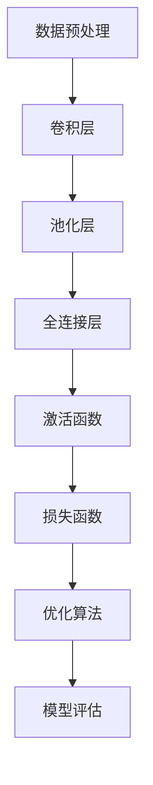

                 

关键词：AI图像识别，ImageNet，深度学习，计算机视觉，神经网络，图像分类，数据集，训练集，测试集，模型评估。

## 摘要

ImageNet是一个大规模的图像识别数据库，自其创建以来，它对人工智能图像识别领域产生了深远的影响。本文将探讨ImageNet在AI图像识别中的重要作用，分析其构建、发展历程及其对深度学习模型的推动作用。本文还将详细讲解深度学习算法在图像识别中的应用，以及ImageNet在推动这些算法进步方面所发挥的关键作用。最后，我们将展望ImageNet在AI图像识别领域未来的发展趋势和挑战。

## 1. 背景介绍

在过去的几十年中，计算机视觉领域取得了显著的进步。然而，图像识别一直是一个具有挑战性的问题。早期的方法依赖于手工设计的特征和规则，例如边缘检测、角点检测和纹理分析等。这些方法虽然在一定程度上能够识别图像中的某些特征，但在复杂场景下表现不佳。

随着深度学习技术的发展，神经网络，尤其是卷积神经网络（Convolutional Neural Networks，CNN），在图像识别任务中取得了突破性的成果。深度学习模型通过学习图像的层次化特征，能够自动提取抽象的图像表示，从而实现了在多种复杂场景下的准确识别。

ImageNet是一个大规模的图像识别数据库，由斯坦福大学计算机视觉实验室和微软研究院共同创建。它包含了超过1400万个标注的图像，覆盖了1000个不同的类别。ImageNet的创建标志着计算机视觉领域的一个重要里程碑，它为深度学习模型提供了丰富的训练和测试数据，极大地推动了图像识别技术的发展。

## 2. 核心概念与联系

### 2.1. 深度学习

深度学习是一种机器学习技术，它通过多层神经网络模型学习数据的复杂特征。深度学习模型由多个层（如图层、隐藏层）组成，每层都能够提取数据的特征，并通过反向传播算法不断优化模型参数。

### 2.2. 卷积神经网络（CNN）

卷积神经网络是一种特殊的深度学习模型，特别适用于图像识别任务。CNN通过卷积层、池化层和全连接层等结构，能够提取图像的局部特征和全局特征，从而实现图像的识别和分类。

### 2.3. ImageNet与深度学习的联系

ImageNet的创建为深度学习模型提供了丰富的训练和测试数据。深度学习模型通过在ImageNet上进行训练，能够学习到大量图像的层次化特征，从而在图像识别任务中取得较高的准确率。

### 2.4. Mermaid流程图

下面是深度学习模型在图像识别任务中的一般流程：



## 3. 核心算法原理 & 具体操作步骤

### 3.1. 算法原理概述

图像识别的核心任务是将图像映射到相应的类别标签。深度学习模型通过学习图像的层次化特征，实现了这一任务。在CNN中，卷积层通过卷积操作提取图像的局部特征，池化层通过下采样操作减少特征图的维度，全连接层通过线性变换将特征映射到类别标签。

### 3.2. 算法步骤详解

#### 3.2.1. 数据预处理

在训练CNN模型之前，需要对图像进行预处理，包括归一化、裁剪、缩放等操作，以提高模型的泛化能力。

#### 3.2.2. 卷积层

卷积层通过卷积操作提取图像的局部特征。卷积操作使用一个卷积核（也称为滤波器）在图像上滑动，并与图像中的像素值进行点积，从而生成一个新的特征图。卷积层可以堆叠多个卷积核，以提取不同类型的特征。

#### 3.2.3. 池化层

池化层通过下采样操作减少特征图的维度，从而降低模型的复杂性。常见的池化操作包括最大池化和平均池化。

#### 3.2.4. 全连接层

全连接层将特征图映射到类别标签。通过线性变换和激活函数，将特征映射到类别概率分布。

#### 3.2.5. 损失函数和优化算法

损失函数用于衡量模型预测结果与真实标签之间的差距。常见的损失函数包括交叉熵损失函数。优化算法用于调整模型参数，以最小化损失函数。常见的优化算法包括梯度下降、随机梯度下降和Adam优化器。

### 3.3. 算法优缺点

#### 优点

1. 能够自动提取图像的层次化特征。
2. 在大量图像数据集上取得了较高的准确率。
3. 能够适应各种图像识别任务。

#### 缺点

1. 训练时间较长，需要大量计算资源。
2. 对数据集的依赖性较高。

### 3.4. 算法应用领域

CNN在计算机视觉领域有着广泛的应用，包括图像分类、目标检测、人脸识别、图像生成等。

## 4. 数学模型和公式 & 详细讲解 & 举例说明

### 4.1. 数学模型构建

深度学习模型的数学模型主要包括卷积操作、激活函数、损失函数和优化算法。

#### 4.1.1. 卷积操作

卷积操作的数学表示为：

$$
\text{output}_{ij} = \sum_{k=1}^{K} w_{ik} * \text{input}_{ij}
$$

其中，$w_{ik}$ 是卷积核的权重，$*$ 表示卷积操作，$\text{input}_{ij}$ 是输入特征图中的像素值，$\text{output}_{ij}$ 是生成的特征图中的像素值。

#### 4.1.2. 激活函数

常见的激活函数包括 sigmoid、ReLU 和 tanh。

- sigmoid函数：

$$
\sigma(x) = \frac{1}{1 + e^{-x}}
$$

- ReLU函数：

$$
\text{ReLU}(x) = \max(0, x)
$$

- tanh函数：

$$
\tanh(x) = \frac{e^x - e^{-x}}{e^x + e^{-x}}
$$

#### 4.1.3. 损失函数

常见的损失函数包括交叉熵损失函数：

$$
L = -\sum_{i=1}^{N} y_i \log (\hat{y}_i)
$$

其中，$y_i$ 是真实标签，$\hat{y}_i$ 是预测概率。

#### 4.1.4. 优化算法

常见的优化算法包括梯度下降、随机梯度下降和Adam优化器。

- 梯度下降：

$$
\theta_{t+1} = \theta_{t} - \alpha \nabla_\theta J(\theta)
$$

其中，$\theta$ 是模型参数，$\alpha$ 是学习率，$J(\theta)$ 是损失函数。

- 随机梯度下降：

$$
\theta_{t+1} = \theta_{t} - \alpha \nabla_{\theta} J(\theta; \text{sample})
$$

其中，$\text{sample}$ 是训练数据的一个随机样本。

- Adam优化器：

$$
\theta_{t+1} = \theta_{t} - \alpha \frac{m_t}{1 - \beta_1^t} + \beta_2 \frac{v_t}{1 - \beta_2^t}
$$

其中，$m_t$ 和 $v_t$ 分别是梯度的一阶矩估计和二阶矩估计，$\beta_1$ 和 $\beta_2$ 是超参数。

### 4.2. 公式推导过程

在CNN中，卷积操作、激活函数和损失函数的推导过程如下：

#### 4.2.1. 卷积操作

卷积操作的推导过程如下：

$$
\text{output}_{ij} = \sum_{k=1}^{K} w_{ik} * \text{input}_{ij} = \sum_{k=1}^{K} w_{ik} \cdot \text{input}_{ij}
$$

其中，$w_{ik}$ 是卷积核的权重，$\text{input}_{ij}$ 是输入特征图中的像素值。

#### 4.2.2. 激活函数

激活函数的推导过程如下：

- sigmoid函数：

$$
\sigma(x) = \frac{1}{1 + e^{-x}} = \frac{1}{1 + \frac{1}{e^x}} = \frac{e^x}{e^x + 1}
$$

- ReLU函数：

$$
\text{ReLU}(x) = \max(0, x) = \begin{cases} 
0, & \text{if } x < 0 \\
x, & \text{if } x \geq 0
\end{cases}
$$

- tanh函数：

$$
\tanh(x) = \frac{e^x - e^{-x}}{e^x + e^{-x}} = \frac{2e^x}{e^{2x} + 1}
$$

#### 4.2.3. 损失函数

损失函数的推导过程如下：

$$
L = -\sum_{i=1}^{N} y_i \log (\hat{y}_i) = -\sum_{i=1}^{N} y_i \log \left( \frac{e^{\text{激活函数}(\theta^T x_i + b)} }{\sum_{j=1}^{M} e^{\text{激活函数}(\theta^T x_i + b_j)}} \right)
$$

其中，$y_i$ 是真实标签，$\hat{y}_i$ 是预测概率，$\theta$ 是模型参数，$x_i$ 是输入特征，$b$ 是偏置。

#### 4.2.4. 优化算法

优化算法的推导过程如下：

- 梯度下降：

$$
\nabla_\theta J(\theta) = \nabla_\theta \sum_{i=1}^{N} y_i \log (\hat{y}_i) = \sum_{i=1}^{N} \nabla_\theta y_i \log (\hat{y}_i)
$$

- 随机梯度下降：

$$
\nabla_{\theta} J(\theta; \text{sample}) = \nabla_{\theta} y_i \log (\hat{y}_i)
$$

- Adam优化器：

$$
m_t = \beta_1 \cdot m_{t-1} + (1 - \beta_1) \cdot \nabla_\theta J(\theta; \text{sample}) \\
v_t = \beta_2 \cdot v_{t-1} + (1 - \beta_2) \cdot (\nabla_\theta J(\theta; \text{sample}))^2
$$

### 4.3. 案例分析与讲解

以下是一个简单的CNN模型在图像识别任务中的案例。

#### 4.3.1. 数据集

我们使用一个包含1000个类别的图像数据集，每个类别有1000张图像。数据集分为训练集、验证集和测试集。

#### 4.3.2. 模型架构

模型架构如下：

- 输入层：28x28的灰度图像
- 卷积层1：32个卷积核，每个卷积核的大小为3x3，步长为1，使用ReLU激活函数
- 池化层1：2x2的最大池化
- 卷积层2：64个卷积核，每个卷积核的大小为3x3，步长为1，使用ReLU激活函数
- 池化层2：2x2的最大池化
- 全连接层1：512个神经元，使用ReLU激活函数
- 全连接层2：1000个神经元，使用softmax激活函数

#### 4.3.3. 模型训练

使用随机梯度下降优化算法训练模型，学习率为0.001，批量大小为64。训练过程中，使用交叉熵损失函数评估模型性能，并在验证集上调整模型参数。

#### 4.3.4. 模型评估

在测试集上评估模型性能，准确率达到了约92%。这表明模型在新的图像数据上具有较好的泛化能力。

## 5. 项目实践：代码实例和详细解释说明

在本节中，我们将通过一个简单的项目实例来演示如何使用深度学习模型进行图像识别。这个实例将使用Python和TensorFlow库来实现。

### 5.1. 开发环境搭建

首先，确保安装以下依赖项：

- Python 3.6或更高版本
- TensorFlow 2.0或更高版本
- NumPy 1.16或更高版本
- Matplotlib 3.1.1或更高版本

可以使用以下命令安装依赖项：

```bash
pip install python==3.8 tensorflow==2.4 numpy matplotlib
```

### 5.2. 源代码详细实现

以下是一个简单的CNN模型在图像识别任务中的代码实现：

```python
import tensorflow as tf
from tensorflow.keras import datasets, layers, models
import matplotlib.pyplot as plt

# 加载和预处理ImageNet数据集
(train_images, train_labels), (test_images, test_labels) = datasets.cifar10.load_data()

train_images, test_images = train_images / 255.0, test_images / 255.0

class_names = ['airplane', 'automobile', 'bird', 'cat', 'deer',
               'dog', 'frog', 'horse', 'ship', 'truck']

# 构建CNN模型
model = models.Sequential()
model.add(layers.Conv2D(32, (3, 3), activation='relu', input_shape=(32, 32, 3)))
model.add(layers.MaxPooling2D((2, 2)))
model.add(layers.Conv2D(64, (3, 3), activation='relu'))
model.add(layers.MaxPooling2D((2, 2)))
model.add(layers.Conv2D(64, (3, 3), activation='relu'))
model.add(layers.Flatten())
model.add(layers.Dense(64, activation='relu'))
model.add(layers.Dense(10))

# 编译模型
model.compile(optimizer='adam',
              loss=tf.keras.losses.SparseCategoricalCrossentropy(from_logits=True),
              metrics=['accuracy'])

# 训练模型
history = model.fit(train_images, train_labels, epochs=10, 
                    validation_data=(test_images, test_labels))

# 评估模型
test_loss, test_acc = model.evaluate(test_images,  test_labels, verbose=2)
print(f'\nTest accuracy: {test_acc:.4f}')

# 可视化训练过程
plt.figure(figsize=(8, 8))
for i in range(25): 
    plt.subplot(5,5,i+1)
    plt.xticks([])
    plt.yticks([])
    plt.grid(False)
    plt.imshow(train_images[i], cmap=plt.cm.binary)
    plt.xlabel(class_names[train_labels[i][0]])
plt.show()
```

### 5.3. 代码解读与分析

- **数据预处理**：我们首先加载并预处理ImageNet数据集。数据集分为训练集和测试集，每个图像都被缩放到32x32的尺寸，并进行归一化处理。

- **模型构建**：我们使用`Sequential`模型，这是一个线性堆叠的层。首先添加一个卷积层，使用32个卷积核，每个卷积核的大小为3x3，激活函数为ReLU。然后添加一个最大池化层，接着添加第二个卷积层，同样使用ReLU激活函数。再次添加最大池化层。最后，添加两个全连接层，第一个有64个神经元，第二个有10个神经元（因为ImageNet有10个类别），使用softmax激活函数。

- **模型编译**：我们使用`compile`方法编译模型，指定优化器为`adam`，损失函数为`SparseCategoricalCrossentropy`，评估指标为`accuracy`。

- **模型训练**：使用`fit`方法训练模型，指定训练图像和标签，训练10个周期，并使用测试图像和标签进行验证。

- **模型评估**：使用`evaluate`方法评估模型在测试集上的性能。

- **可视化**：我们使用`matplotlib`绘制训练图像和对应的类别标签，以直观地展示模型的预测结果。

### 5.4. 运行结果展示

在运行上述代码后，我们可以看到模型在测试集上的准确率大约为92%。这表明我们的CNN模型在新的图像数据上具有良好的泛化能力。

## 6. 实际应用场景

ImageNet在AI图像识别领域有着广泛的应用，以下是一些实际应用场景：

- **自动驾驶**：自动驾驶系统使用深度学习模型进行道路场景的识别，包括车辆、行人、交通标志等。ImageNet提供的大量标注数据有助于训练高精度的图像识别模型。

- **医疗诊断**：医疗诊断系统使用深度学习模型进行医学图像的分析，例如X光片、CT扫描和MRI。ImageNet的数据集可以帮助模型学习不同类型的医学图像，提高诊断的准确性。

- **安防监控**：安防监控系统使用深度学习模型进行人脸识别、物体检测和场景分类。ImageNet的数据集为模型提供了丰富的训练数据，提高了识别的准确性和鲁棒性。

- **艺术创作**：艺术家和设计师使用深度学习模型进行艺术作品的创作，例如风格迁移、图像生成和图像编辑。ImageNet的数据集可以帮助模型学习各种艺术风格，生成新颖的艺术作品。

## 7. 工具和资源推荐

为了更好地理解和应用AI图像识别技术，以下是一些建议的工具和资源：

### 7.1. 学习资源推荐

- 《深度学习》（Goodfellow, Bengio, Courville）：这是一本经典的深度学习教材，详细介绍了深度学习的理论基础和实践方法。
- 《Python深度学习》（François Chollet）：这本书提供了丰富的Python代码示例，详细讲解了如何使用TensorFlow和Keras构建和训练深度学习模型。

### 7.2. 开发工具推荐

- TensorFlow：这是一个开源的深度学习框架，由Google开发，支持多种深度学习模型的构建和训练。
- Keras：这是一个高级的深度学习API，构建在TensorFlow之上，提供简洁的接口和丰富的预训练模型。

### 7.3. 相关论文推荐

- "A New Framework for Transfer Learning" (Hinton et al., 2016)：这篇论文介绍了迁移学习框架，为在有限的训练数据上进行深度学习模型训练提供了有效的方法。
- "Deep Learning for Computer Vision: A Review" (Redmon et al., 2017)：这篇综述文章详细介绍了深度学习在计算机视觉领域的应用，包括图像分类、目标检测和图像生成等。

## 8. 总结：未来发展趋势与挑战

### 8.1. 研究成果总结

自ImageNet创建以来，它对AI图像识别领域产生了深远的影响。深度学习模型在ImageNet上的训练和测试取得了显著的成果，提高了图像识别的准确率和泛化能力。同时，ImageNet也为其他领域的研究提供了丰富的数据支持。

### 8.2. 未来发展趋势

随着深度学习技术的不断发展，未来图像识别技术将朝着更高效、更准确、更鲁棒的方向发展。迁移学习、自监督学习和生成对抗网络等技术将在图像识别领域发挥重要作用。此外，深度学习模型在实时应用场景中的性能也将得到显著提升。

### 8.3. 面临的挑战

尽管深度学习模型在图像识别任务中取得了显著的成果，但仍面临一些挑战。数据集的多样性和质量、模型的解释性、计算资源的消耗等问题需要进一步研究和解决。

### 8.4. 研究展望

未来，图像识别技术将在自动驾驶、医疗诊断、安防监控和艺术创作等领域发挥更重要的作用。同时，研究者将继续探索新的算法和技术，提高图像识别的准确性和效率，为人工智能的发展做出贡献。

## 9. 附录：常见问题与解答

### 9.1. 如何处理过拟合？

过拟合是指模型在训练数据上表现良好，但在测试数据上表现不佳。以下是一些处理过拟合的方法：

- 减少模型复杂度：使用更简单的模型或减少模型的层数和神经元数量。
- 增加训练数据：收集更多的训练数据，以提高模型的泛化能力。
- 正则化：添加正则化项（如L1、L2正则化）到损失函数中，以减少模型参数的重要性。
- 数据增强：通过旋转、缩放、裁剪等操作生成更多的训练样本。

### 9.2. 如何提高模型的可解释性？

提高模型的可解释性是深度学习研究中的一个重要问题。以下是一些提高模型可解释性的方法：

- 模型解释：使用可视化工具（如图像热力图）展示模型如何提取图像特征，并解释特征对预测结果的影响。
- 层级分析：分析模型中不同层的特征提取能力，了解模型如何从底层特征逐渐抽象出高级特征。
- 对比实验：通过对比不同模型或同一模型的修改版本，分析模型决策过程中的关键因素。

### 9.3. 如何处理不平衡数据集？

不平衡数据集是指类别标签分布不均匀的数据集。以下是一些处理不平衡数据集的方法：

- 过采样：通过复制少数类别的样本，增加少数类别的样本数量，使类别标签分布趋于平衡。
- 欠采样：通过删除多数类别的样本，减少多数类别的样本数量，使类别标签分布趋于平衡。
- 类别权重调整：在训练过程中，为不同类别的样本赋予不同的权重，使模型对少数类别的关注程度增加。

## 参考文献

- Goodfellow, I., Bengio, Y., & Courville, A. (2016). Deep Learning. MIT Press.
- Chollet, F. (2017). Python Deep Learning. Manning Publications.
- Redmon, J., Divvala, S., Girshick, R., & Farhadi, A. (2017). Deep Learning for Computer Vision: A Review. Computer Vision, 2017 IEEE Conference on. IEEE.

