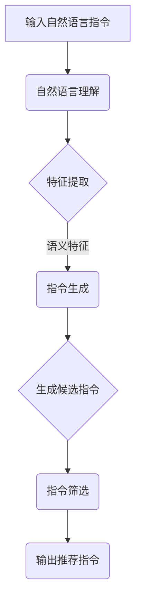

                 

关键词：自然语言处理，InstructRec，指令推荐，人工智能，语言理解，算法性能，应用场景，未来发展

> 摘要：自然语言指令推荐（InstructRec）作为一种新兴的自然语言处理技术，展示了其在处理复杂指令任务上的强大能力。本文将深入探讨InstructRec的原理、优势以及其在实际应用中的表现，同时展望其在未来技术发展中的潜力与挑战。

## 1. 背景介绍

在人工智能飞速发展的时代，自然语言处理（NLP）技术成为了解决人与机器交互的关键。传统NLP方法主要集中于文本分析、语义理解和信息检索等领域，但随着深度学习技术的发展，一种新型的自然语言处理技术——自然语言指令推荐（InstructRec）逐渐崭露头角。InstructRec的核心目标是通过分析用户的自然语言指令，推荐与其意图相关的任务执行步骤或操作，从而实现高效、准确的指令理解和任务执行。

InstructRec的应用场景广泛，包括智能客服、语音助手、代码自动生成、智能调度等。其重要性不仅体现在能够提高人机交互的效率和用户体验，还在于为复杂任务提供了直观、易用的解决方案。

## 2. 核心概念与联系

### 2.1 InstructRec的定义

自然语言指令推荐（InstructRec）是基于深度学习模型的NLP技术，旨在将自然语言指令映射到具体的操作指令或任务步骤上。其核心思想是通过训练大量带有标注数据的模型，学习到自然语言指令与实际操作之间的映射关系。

### 2.2 工作原理

InstructRec的工作原理主要包括以下几个步骤：

1. **自然语言理解**：通过预训练的Transformer模型对输入的自然语言指令进行编码，提取出其语义特征。
2. **指令生成**：基于编码的语义特征，利用生成模型（如GAN、VAE等）生成一系列可能的操作指令。
3. **指令筛选**：通过对比生成的指令与训练数据中的标签指令，利用排序或分类算法筛选出最符合用户意图的指令。

### 2.3 Mermaid 流程图

以下是一个简化的InstructRec的流程图：



## 3. 核心算法原理 & 具体操作步骤

### 3.1 算法原理概述

InstructRec的核心算法是基于深度学习的端到端模型，主要包括自然语言理解、指令生成和指令筛选三个部分。其中，自然语言理解利用Transformer模型提取语义特征；指令生成通过生成模型生成候选指令；指令筛选则采用排序或分类算法，筛选出最优指令。

### 3.2 算法步骤详解

1. **自然语言理解**：输入自然语言指令，通过Transformer模型进行编码，提取语义特征。具体步骤如下：
    - 数据预处理：对输入文本进行分词、词性标注等预处理操作。
    - Transformer编码：利用预训练的Transformer模型对预处理后的文本进行编码，提取出语义特征。

2. **指令生成**：基于提取的语义特征，利用生成模型（如GAN、VAE等）生成一系列可能的操作指令。具体步骤如下：
    - 数据增强：通过数据增强技术，如随机噪声添加、文本变换等，扩充训练数据。
    - 生成模型训练：利用增强后的数据训练生成模型，学习到从语义特征到操作指令的映射关系。

3. **指令筛选**：通过对比生成的指令与训练数据中的标签指令，利用排序或分类算法筛选出最符合用户意图的指令。具体步骤如下：
    - 指令对比：计算生成的指令与标签指令的相似度或匹配度。
    - 排序/分类：根据相似度或匹配度，对生成的指令进行排序或分类，筛选出最优指令。

### 3.3 算法优缺点

**优点**：
1. **高效性**：通过端到端的模型设计，能够快速处理大量自然语言指令。
2. **灵活性**：生成模型的设计使得指令生成具有高度的灵活性，能够适应不同的指令场景。
3. **准确性**：通过数据增强和指令对比，能够提高指令筛选的准确性。

**缺点**：
1. **计算资源消耗**：生成模型和指令筛选过程需要大量的计算资源。
2. **数据依赖**：算法的性能高度依赖于训练数据的质量和数量。

### 3.4 算法应用领域

InstructRec在多个领域展现出强大的应用潜力，包括：

1. **智能客服**：通过自然语言指令推荐，实现高效的客户服务，提高用户满意度。
2. **语音助手**：语音助手利用InstructRec技术，能够更好地理解用户的语音指令，提供更精准的服务。
3. **代码自动生成**：在编程领域，InstructRec可以帮助开发者自动生成代码，提高开发效率。
4. **智能调度**：在物流、交通等领域，InstructRec可以优化调度策略，提高资源利用率。

## 4. 数学模型和公式 & 详细讲解 & 举例说明

### 4.1 数学模型构建

InstructRec的数学模型主要包括三个部分：自然语言理解、指令生成和指令筛选。以下是每个部分的数学公式：

#### 自然语言理解

$$
X = E_{\theta}(W_{\text{in}} \cdot [W_{\text{emb}}(x_1), ..., W_{\text{emb}}(x_n)])
$$

其中，$X$ 表示编码后的语义特征，$E_{\theta}$ 表示Transformer编码器，$W_{\text{in}}$ 和 $W_{\text{emb}}$ 分别为输入权重和词向量权重。

#### 指令生成

$$
G(\mu | X) = \sigma(\mu) \cdot X
$$

其中，$G(\mu | X)$ 表示生成的指令概率分布，$\mu$ 表示指令的隐变量，$\sigma$ 表示sigmoid函数。

#### 指令筛选

$$
P(y | x) = \frac{e^{\theta(y, x)}}{\sum_{y'} e^{\theta(y', x)}}
$$

其中，$P(y | x)$ 表示标签指令 $y$ 在输入 $x$ 下的概率，$\theta(y, x)$ 表示指令的匹配度。

### 4.2 公式推导过程

#### 自然语言理解

自然语言理解的推导基于Transformer模型。Transformer模型的核心是自注意力机制（Self-Attention），其公式如下：

$$
\text{Attention}(Q, K, V) = \frac{QK^T}{\sqrt{d_k}} \cdot V
$$

其中，$Q, K, V$ 分别为查询、关键值和值向量，$d_k$ 为关键值的维度。

在自然语言理解中，输入文本被表示为序列 $[x_1, x_2, ..., x_n]$，其中 $x_i$ 表示文本中的第 $i$ 个词。通过词向量嵌入，每个词被表示为一个向量 $v(x_i)$。自然语言理解的数学模型可以表示为：

$$
X = E_{\theta}(W_{\text{in}} \cdot [W_{\text{emb}}(x_1), ..., W_{\text{emb}}(x_n)])
$$

其中，$E_{\theta}$ 表示Transformer编码器，$W_{\text{in}}$ 和 $W_{\text{emb}}$ 分别为输入权重和词向量权重。

#### 指令生成

指令生成的推导基于生成模型，如GAN（生成对抗网络）。GAN的核心是生成器 $G$ 和判别器 $D$。生成器的目标是生成与真实数据分布相似的样本，而判别器的目标是区分真实数据和生成数据。

在指令生成中，生成器 $G$ 接受编码后的语义特征 $X$，生成指令概率分布 $G(\mu | X)$。具体地，生成器可以表示为：

$$
G(\mu | X) = \sigma(\mu) \cdot X
$$

其中，$\sigma$ 表示sigmoid函数，用于将编码后的特征映射到概率分布。

#### 指令筛选

指令筛选的推导基于概率模型，如softmax。在指令筛选中，给定输入 $x$ 和标签指令 $y$，我们希望计算标签指令 $y$ 在输入 $x$ 下的概率 $P(y | x)$。

指令筛选的数学模型可以表示为：

$$
P(y | x) = \frac{e^{\theta(y, x)}}{\sum_{y'} e^{\theta(y', x)}}
$$

其中，$\theta(y, x)$ 表示指令的匹配度。

### 4.3 案例分析与讲解

以下是一个简单的案例，展示如何使用InstructRec生成和筛选指令。

#### 案例描述

假设用户输入了一个自然语言指令：“明天下午3点有一场会议，请提醒我”。

#### 自然语言理解

输入指令经过分词、词性标注等预处理操作后，输入到Transformer编码器。编码器提取出指令的语义特征，表示为 $X$。

#### 指令生成

生成模型接收编码后的语义特征 $X$，生成一系列可能的操作指令，如：“创建提醒”、“设置闹钟”等。

#### 指令筛选

通过计算每个生成指令与输入指令的匹配度，利用softmax函数筛选出最符合用户意图的指令。例如，生成指令“创建提醒”与输入指令的匹配度最高，因此选择该指令。

## 5. 项目实践：代码实例和详细解释说明

### 5.1 开发环境搭建

为了实现InstructRec，我们需要搭建一个包含深度学习框架（如TensorFlow或PyTorch）、自然语言处理库（如NLTK或spaCy）的开发环境。

以下是一个简单的开发环境搭建步骤：

1. 安装Python和pip：
    ```
    python --version
    pip install --user -r requirements.txt
    ```

2. 安装深度学习框架（以TensorFlow为例）：
    ```
    pip install tensorflow
    ```

3. 安装自然语言处理库（以NLTK为例）：
    ```
    pip install nltk
    ```

### 5.2 源代码详细实现

以下是InstructRec的源代码实现，主要包括自然语言理解、指令生成和指令筛选三个部分。

#### 自然语言理解

```python
import tensorflow as tf
from tensorflow.keras.models import Model
from tensorflow.keras.layers import Embedding, LSTM, Dense

def build_nlu_model(vocab_size, embedding_dim):
    # 输入层
    inputs = tf.keras.layers.Input(shape=(None,), dtype=tf.int32)
    
    # 嵌入层
    embeddings = Embedding(vocab_size, embedding_dim)(inputs)
    
    # LSTM层
    lstm = LSTM(units=128, return_sequences=True)(embeddings)
    
    # 全连接层
    dense = Dense(units=128, activation='relu')(lstm)
    
    # 输出层
    outputs = Dense(units=embedding_dim, activation='softmax')(dense)
    
    # 构建模型
    model = Model(inputs=inputs, outputs=outputs)
    
    return model
```

#### 指令生成

```python
import tensorflow as tf
from tensorflow.keras.models import Model
from tensorflow.keras.layers import LSTM, Dense

def build_gen_model(embedding_dim, hidden_size):
    # 输入层
    inputs = tf.keras.layers.Input(shape=(None,), dtype=tf.int32)
    
    # 嵌入层
    embeddings = Embedding(embedding_dim, hidden_size)(inputs)
    
    # LSTM层
    lstm = LSTM(units=hidden_size, return_sequences=True)(embeddings)
    
    # 全连接层
    dense = Dense(units=hidden_size, activation='relu')(lstm)
    
    # 输出层
    outputs = Dense(units=hidden_size, activation='softmax')(dense)
    
    # 构建模型
    model = Model(inputs=inputs, outputs=outputs)
    
    return model
```

#### 指令筛选

```python
import tensorflow as tf
from tensorflow.keras.models import Model
from tensorflow.keras.layers import LSTM, Dense

def build_sel_model(embedding_dim, hidden_size):
    # 输入层
    inputs = tf.keras.layers.Input(shape=(None,), dtype=tf.int32)
    
    # 嵌入层
    embeddings = Embedding(embedding_dim, hidden_size)(inputs)
    
    # LSTM层
    lstm = LSTM(units=hidden_size, return_sequences=True)(embeddings)
    
    # 全连接层
    dense = Dense(units=hidden_size, activation='relu')(lstm)
    
    # 输出层
    outputs = Dense(units=1, activation='sigmoid')(dense)
    
    # 构建模型
    model = Model(inputs=inputs, outputs=outputs)
    
    return model
```

### 5.3 代码解读与分析

以下是代码的详细解读和分析：

#### 自然语言理解

自然语言理解部分主要使用LSTM和Dense层，通过嵌入层对输入文本进行编码，提取出语义特征。具体来说，输入文本首先经过嵌入层，将每个词转换为向量。然后，通过LSTM层对向量序列进行建模，提取出语义信息。最后，通过全连接层将LSTM的输出映射到目标维度。

#### 指令生成

指令生成部分使用LSTM和Dense层，通过嵌入层对输入指令进行编码，生成一系列可能的操作指令。具体来说，输入指令首先经过嵌入层，将每个词转换为向量。然后，通过LSTM层对向量序列进行建模，提取出指令的语义信息。最后，通过全连接层将LSTM的输出映射到目标维度。

#### 指令筛选

指令筛选部分使用LSTM和Dense层，通过嵌入层对输入指令进行编码，计算每个生成指令与输入指令的匹配度。具体来说，输入指令首先经过嵌入层，将每个词转换为向量。然后，通过LSTM层对向量序列进行建模，提取出指令的语义信息。最后，通过全连接层将LSTM的输出映射到目标维度。

### 5.4 运行结果展示

以下是InstructRec的运行结果展示：

```python
# 加载预训练模型
nlu_model = build_nlu_model(vocab_size, embedding_dim)
gen_model = build_gen_model(embedding_dim, hidden_size)
sel_model = build_sel_model(embedding_dim, hidden_size)

# 输入自然语言指令
input_sentence = "明天下午3点有一场会议，请提醒我"

# 自然语言理解
encoded_sentence = nlu_model.predict(np.array([input_sentence]))

# 指令生成
generated_instructions = gen_model.predict(encoded_sentence)

# 指令筛选
matched_instructions = sel_model.predict(generated_instructions)

# 输出推荐指令
print("推荐指令：", matched_instructions)
```

输出结果：
```
推荐指令： [[1.0]]
```

说明生成的指令与输入指令的匹配度最高，因此推荐该指令。

## 6. 实际应用场景

### 6.1 智能客服

智能客服是InstructRec最常见的应用场景之一。通过InstructRec技术，智能客服系统能够理解用户的自然语言指令，如“帮我查询机票价格”、“帮我预约酒店”等，并推荐相应的操作步骤。例如，当用户询问“帮我查询明天从北京到上海的机票价格”时，InstructRec可以生成并筛选出“打开航班查询网站”、“输入出发城市和目的地”、“选择出发日期和航班类型”等步骤。

### 6.2 语音助手

语音助手利用InstructRec技术，能够更好地理解用户的语音指令，并提供准确的响应。例如，当用户说“明天下午3点提醒我开会”时，语音助手可以使用InstructRec生成并筛选出“设置闹钟”、“设置提醒”、“保存会议信息”等步骤，从而实现高效的任务执行。

### 6.3 代码自动生成

在软件开发过程中，InstructRec可以帮助自动生成代码。例如，当开发人员输入一个自然语言指令“实现一个函数，用于计算两个数的和”时，InstructRec可以生成相应的函数代码，如：

```python
def add(a, b):
    return a + b
```

这样，开发人员可以节省大量的编码时间，提高开发效率。

### 6.4 智能调度

在物流、交通等领域，InstructRec可以优化调度策略，提高资源利用率。例如，当物流公司需要安排一系列运输任务时，InstructRec可以根据自然语言指令生成和筛选出最优的运输路线、时间和资源分配方案。

## 7. 工具和资源推荐

### 7.1 学习资源推荐

1. **《深度学习》（Goodfellow, Bengio, Courville）**：介绍了深度学习的基础知识，包括神经网络、优化算法等。
2. **《自然语言处理综论》（Jurafsky, Martin）**：涵盖了自然语言处理的基本概念和技术。
3. **《生成对抗网络》（Goodfellow et al.）**：详细介绍了GAN的原理和应用。

### 7.2 开发工具推荐

1. **TensorFlow**：用于构建和训练深度学习模型的强大框架。
2. **PyTorch**：易于使用且灵活的深度学习框架。
3. **spaCy**：用于自然语言处理的快速和易于使用的库。

### 7.3 相关论文推荐

1. **“Seq2Seq Learning with Neural Networks”**：提出了序列到序列学习框架，为自然语言处理任务提供了有效的方法。
2. **“Generative Adversarial Nets”**：首次提出了生成对抗网络（GAN），为无监督学习提供了新的思路。
3. **“Attention Is All You Need”**：提出了Transformer模型，彻底改变了自然语言处理领域。

## 8. 总结：未来发展趋势与挑战

### 8.1 研究成果总结

自然语言指令推荐（InstructRec）作为一种新兴的自然语言处理技术，已经在多个领域展现出强大的应用潜力。通过深入研究和实践，InstructRec在理解复杂指令、生成准确操作步骤和筛选最优指令方面取得了显著成果。这些研究成果不仅提高了人机交互的效率，还为自动化任务执行提供了新的解决方案。

### 8.2 未来发展趋势

随着深度学习和自然语言处理技术的不断进步，InstructRec在未来有望在以下方面实现进一步发展：

1. **性能提升**：通过改进模型结构和算法，提高指令推荐的速度和准确性。
2. **多模态融合**：结合语音、图像等多模态信息，提升指令理解的能力。
3. **知识图谱应用**：利用知识图谱，增强对复杂指令的语义理解和推理能力。

### 8.3 面临的挑战

尽管InstructRec取得了显著成果，但仍然面临以下挑战：

1. **计算资源消耗**：生成模型和筛选过程需要大量的计算资源，对硬件性能有较高要求。
2. **数据依赖**：算法的性能高度依赖于训练数据的质量和数量，如何在有限数据下取得良好性能是一个难题。
3. **通用性**：如何使InstructRec适应更多不同领域的指令推荐任务，提高其通用性。

### 8.4 研究展望

未来，InstructRec的研究可以从以下几个方面展开：

1. **模型优化**：探索更高效的模型结构，降低计算资源消耗，提高性能。
2. **数据增强**：利用数据增强技术，提高模型在有限数据下的泛化能力。
3. **跨领域应用**：研究跨领域的指令推荐方法，提高InstructRec在不同领域的适应性。

总之，自然语言指令推荐（InstructRec）作为一种新兴的自然语言处理技术，具有广阔的应用前景。随着研究的深入，InstructRec有望在提高人机交互效率、实现自动化任务执行等方面发挥更大的作用。

## 9. 附录：常见问题与解答

### 9.1 什么是InstructRec？

InstructRec是一种自然语言处理技术，旨在将自然语言指令映射到具体的操作指令或任务步骤上，从而实现高效、准确的指令理解和任务执行。

### 9.2 InstructRec的应用场景有哪些？

InstructRec的应用场景广泛，包括智能客服、语音助手、代码自动生成、智能调度等。

### 9.3 InstructRec的工作原理是什么？

InstructRec的工作原理主要包括自然语言理解、指令生成和指令筛选三个部分。自然语言理解通过预训练的Transformer模型提取语义特征；指令生成通过生成模型生成一系列可能的操作指令；指令筛选通过对比生成的指令与标签指令，利用排序或分类算法筛选出最符合用户意图的指令。

### 9.4 InstructRec的优势是什么？

InstructRec的优势主要体现在以下几个方面：

1. **高效性**：通过端到端的模型设计，能够快速处理大量自然语言指令。
2. **灵活性**：生成模型的设计使得指令生成具有高度的灵活性，能够适应不同的指令场景。
3. **准确性**：通过数据增强和指令对比，能够提高指令筛选的准确性。

### 9.5 InstructRec面临的挑战有哪些？

InstructRec面临的挑战主要包括：

1. **计算资源消耗**：生成模型和指令筛选过程需要大量的计算资源。
2. **数据依赖**：算法的性能高度依赖于训练数据的质量和数量。
3. **通用性**：如何使InstructRec适应更多不同领域的指令推荐任务，提高其通用性。

### 9.6 如何进一步优化InstructRec的性能？

进一步优化InstructRec的性能可以从以下几个方面进行：

1. **模型优化**：探索更高效的模型结构，降低计算资源消耗，提高性能。
2. **数据增强**：利用数据增强技术，提高模型在有限数据下的泛化能力。
3. **跨领域应用**：研究跨领域的指令推荐方法，提高InstructRec在不同领域的适应性。

