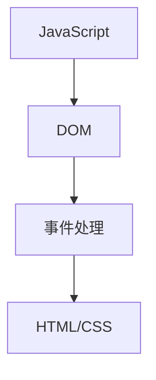

                 

关键词：JavaScript，前端开发，交互性，DOM操作，事件处理，网站开发

> 摘要：本文将深入探讨JavaScript在网站开发中的应用，介绍如何使用JavaScript为网站添加交互性，从基础概念到实际操作，帮助读者掌握JavaScript的核心技巧，实现丰富多彩的网页效果。

## 1. 背景介绍

在网页开发的世界中，JavaScript无疑是一种不可或缺的脚本语言。它不仅为网站带来了动态效果，还极大地增强了用户的交互体验。在现代网页开发中，JavaScript不仅仅用于简单的网页交互，还广泛应用于复杂的前端框架和库，如React、Vue和Angular等。这些框架和库利用JavaScript的高灵活性和广泛支持，使得开发者能够以更高效、更便捷的方式构建复杂的单页面应用程序。

本文将围绕JavaScript的核心概念和应用展开，旨在帮助读者从入门到进阶，全面掌握JavaScript的技巧和知识。我们将从JavaScript的基本概念开始，逐步深入，通过实际操作，使读者能够学会如何为网站添加交互性，实现从静态到动态的华丽转变。

## 2. 核心概念与联系

### 2.1 JavaScript基本概念

JavaScript是一种直译式脚本语言，用于实现网页的动态效果和交互性。它由ECMA International制定的标准（ECMAScript）定义，并得到了广泛的浏览器支持。

#### 2.1.1 解释执行

JavaScript是解释型语言，这意味着它的代码在运行时由浏览器中的JavaScript引擎逐行解释并执行，而不是先编译成机器代码再执行。

#### 2.1.2 单线程与异步编程

JavaScript是单线程的，这意味着它一次只能执行一个任务。然而，通过异步编程（如使用`setTimeout`和`async/await`），JavaScript能够实现并行操作，从而提升性能和响应能力。

#### 2.1.3 对象模型

JavaScript的核心是对象模型，它支持变量、函数、数组、对象等基本数据结构。通过对象模型，JavaScript能够灵活地操作和表示复杂的数据结构。

### 2.2 DOM（文档对象模型）

DOM是JavaScript操作网页的核心接口。它将整个网页结构抽象为一系列对象，使得开发者能够方便地操作页面元素。

#### 2.2.1 节点类型

DOM节点包括元素节点、属性节点和文本节点等。每个节点都有自己的属性和方法，使得开发者可以通过JavaScript动态修改页面内容。

#### 2.2.2 DOM操作

JavaScript通过DOM API提供了丰富的操作方法，包括选择器、添加、删除和修改节点等。这些操作使得动态网页成为可能。

### 2.3 事件处理

事件处理是JavaScript实现交互性的关键。它允许网页对用户操作（如点击、按键、滚动等）做出响应。

#### 2.3.1 事件流

事件流描述了事件在页面中传递和处理的过程，包括捕获阶段和冒泡阶段。

#### 2.3.2 事件监听器

事件监听器是绑定到DOM节点上的函数，当触发特定事件时会被调用。通过事件监听器，JavaScript能够实现页面的交互功能。

### 2.4 JavaScript与HTML/CSS的关系

JavaScript与HTML和CSS紧密相连。HTML提供结构，CSS提供样式，而JavaScript则通过操作DOM和事件处理，将静态页面变为动态交互式网页。

### 2.5 Mermaid流程图

以下是一个简化的Mermaid流程图，展示了JavaScript、DOM和事件处理之间的关系：



## 3. 核心算法原理 & 具体操作步骤

### 3.1 算法原理概述

JavaScript的核心算法原理主要包括以下几个方面：

- **变量和函数**：JavaScript使用变量来存储数据，函数则是一段可复用的代码块，用于处理数据和执行操作。
- **DOM操作**：通过DOM API，JavaScript能够动态修改网页结构，如添加、删除和修改节点。
- **事件处理**：通过事件监听器，JavaScript能够响应用户操作，实现网页的交互性。
- **异步编程**：JavaScript利用异步编程，如`Promise`和`async/await`，实现非阻塞操作，提升网页性能。

### 3.2 算法步骤详解

下面将详细介绍如何使用JavaScript实现网页的交互性：

#### 3.2.1 创建HTML结构

首先，我们需要创建一个简单的HTML页面，包括一个按钮和一个显示结果的`div`元素。

```html
<!DOCTYPE html>
<html lang="en">
<head>
    <meta charset="UTF-8">
    <title>JavaScript交互性示例</title>
</head>
<body>
    <button id="myButton">点击我</button>
    <div id="result">结果将显示在这里</div>
    <script src="script.js"></script>
</body>
</html>
```

#### 3.2.2 编写JavaScript代码

接下来，在`script.js`文件中编写JavaScript代码，实现按钮点击后的交互效果。

```javascript
// 获取按钮和结果元素
const button = document.getElementById('myButton');
const result = document.getElementById('result');

// 绑定点击事件监听器
button.addEventListener('click', function() {
    // 更新结果元素的内容
    result.textContent = '按钮被点击了！';
});
```

这段代码首先获取了按钮和结果元素，然后通过`addEventListener`方法绑定了一个点击事件监听器。当按钮被点击时，事件监听器会被触发，将结果元素的文本内容更新为"按钮被点击了！"。

### 3.3 算法优缺点

- **优点**：
  - **动态性**：JavaScript能够实现网页的动态效果，增强用户体验。
  - **交互性**：通过事件处理，JavaScript能够响应用户操作，实现交互式网页。
  - **灵活性**：JavaScript可以操作DOM，动态修改网页结构，适应不同的应用场景。

- **缺点**：
  - **兼容性问题**：不同的浏览器可能对JavaScript的支持存在差异，需要额外处理兼容性问题。
  - **安全性**：JavaScript代码可能被恶意利用，需要采取适当的安全措施。

### 3.4 算法应用领域

JavaScript广泛应用于网页开发、服务器端开发、移动应用开发等领域：

- **网页开发**：JavaScript用于实现网页的动态效果和交互性，如表单验证、轮播图、动画等。
- **服务器端开发**：Node.js基于JavaScript，用于构建服务器端应用程序，如API接口、实时聊天系统等。
- **移动应用开发**：JavaScript可以用于构建跨平台的移动应用，如React Native、Flutter等。

## 4. 数学模型和公式 & 详细讲解 & 举例说明

### 4.1 数学模型构建

在JavaScript中，数学模型通常通过变量和函数来构建。以下是一个简单的例子：

```javascript
// 定义变量
let a = 5;
let b = 10;

// 定义函数
function add(a, b) {
    return a + b;
}

// 调用函数
let sum = add(a, b);
console.log(sum); // 输出 15
```

在这个例子中，我们定义了两个变量`a`和`b`，以及一个求和函数`add`。通过调用函数，我们可以得到两个数的和。

### 4.2 公式推导过程

以下是一个简单的数学公式的推导过程：

$$
(a+b)^2 = a^2 + 2ab + b^2
$$

推导过程如下：

1. 首先，我们将`a`和`b`相加，得到`a + b`。
2. 然后，我们将`a + b`乘以自己，得到$(a + b)^2$。
3. 接下来，我们将$(a + b)^2$展开，得到$a^2 + 2ab + b^2$。

### 4.3 案例分析与讲解

以下是一个简单的JavaScript代码示例，用于计算两个数的平均值：

```javascript
// 定义变量
let x = 10;
let y = 20;

// 定义函数
function average(x, y) {
    return (x + y) / 2;
}

// 调用函数
let avg = average(x, y);
console.log(avg); // 输出 15
```

在这个例子中，我们定义了两个变量`x`和`y`，以及一个求平均值的函数`average`。通过调用函数，我们可以得到两个数的平均值。这个例子展示了如何使用变量和函数构建数学模型，并进行计算。

## 5. 项目实践：代码实例和详细解释说明

### 5.1 开发环境搭建

在开始实践之前，我们需要搭建一个简单的开发环境。以下是具体的步骤：

1. 安装Node.js：访问Node.js官网（https://nodejs.org/），下载并安装最新版本的Node.js。
2. 安装一个代码编辑器：推荐使用Visual Studio Code（VS Code），它是一款功能强大的代码编辑器，支持多种编程语言。
3. 创建一个新项目：在VS Code中创建一个新文件夹，命名为`web-interactive`。在该文件夹中，创建一个`index.html`文件和一个`script.js`文件。

### 5.2 源代码详细实现

以下是`index.html`和`script.js`文件的代码：

**index.html**

```html
<!DOCTYPE html>
<html lang="en">
<head>
    <meta charset="UTF-8">
    <title>JavaScript交互性示例</title>
    <style>
        body {
            font-family: Arial, sans-serif;
            margin: 0;
            padding: 0;
            display: flex;
            justify-content: center;
            align-items: center;
            height: 100vh;
            background-color: #f5f5f5;
        }
        button {
            padding: 10px 20px;
            font-size: 16px;
            background-color: #007bff;
            color: white;
            border: none;
            border-radius: 5px;
            cursor: pointer;
        }
        button:hover {
            background-color: #0056b3;
        }
        #result {
            margin-top: 20px;
            font-size: 18px;
        }
    </style>
</head>
<body>
    <button id="myButton">点击我</button>
    <div id="result">结果将显示在这里</div>
    <script src="script.js"></script>
</body>
</html>
```

**script.js**

```javascript
// 获取按钮和结果元素
const button = document.getElementById('myButton');
const result = document.getElementById('result');

// 绑定点击事件监听器
button.addEventListener('click', function() {
    // 更新结果元素的内容
    result.textContent = '按钮被点击了！';
});
```

### 5.3 代码解读与分析

- **HTML结构**：该HTML文件定义了一个简单的页面结构，包括一个按钮和一个`div`元素。按钮用于触发交互，`div`元素用于显示结果。
- **CSS样式**：CSS样式用于美化页面，包括按钮的样式和页面布局。按钮在鼠标悬停时会有颜色变化，使页面更加生动。
- **JavaScript代码**：JavaScript代码负责实现按钮点击后的交互效果。首先，通过`getElementById`方法获取按钮和`div`元素。然后，通过`addEventListener`方法绑定一个点击事件监听器。当按钮被点击时，事件监听器会被触发，将`div`元素的文本内容更新为"按钮被点击了！"。

### 5.4 运行结果展示

当运行上述代码时，我们会在浏览器中看到一个简单的网页。点击按钮后，`div`元素的文本内容会更新为"按钮被点击了！"，实现了网页的交互效果。

## 6. 实际应用场景

### 6.1 在线购物网站

在线购物网站通常使用JavaScript实现各种动态效果，如商品轮播、购物车功能、搜索建议等。通过JavaScript，购物网站能够提供更加丰富的用户体验。

### 6.2 社交媒体平台

社交媒体平台广泛使用JavaScript实现用户互动，如动态加载、实时聊天、点赞和分享等功能。通过JavaScript，社交媒体平台能够提供实时、流畅的用户体验。

### 6.3 金融服务网站

金融服务网站使用JavaScript实现账户管理、交易记录、风险评估等功能。通过JavaScript，金融服务网站能够提供高效、安全的用户体验。

### 6.4 未来应用展望

随着前端框架和库的不断发展，JavaScript在未来的应用场景将更加广泛。预计会出现更多基于JavaScript的跨平台开发框架，使得开发者能够更高效地构建复杂的应用程序。同时，JavaScript的性能和安全性也将得到进一步提升，为各类应用提供更好的支持。

## 7. 工具和资源推荐

### 7.1 学习资源推荐

- 《JavaScript 高级程序设计》：这是一本经典的JavaScript入门书籍，全面介绍了JavaScript的核心概念和应用。
- 《You Don't Know JS》：这是一系列深入讲解JavaScript各个方面的书籍，包括异步编程、数组、对象等。

### 7.2 开发工具推荐

- Visual Studio Code：一款功能强大的代码编辑器，支持多种编程语言和开发插件。
- Chrome DevTools：一款强大的开发者工具，用于调试和优化网页性能。

### 7.3 相关论文推荐

- 《JavaScript 的未来发展方向》：该论文探讨了JavaScript在未来的发展方向和挑战，为开发者提供了有价值的参考。
- 《JavaScript 性能优化》：该论文介绍了JavaScript的性能优化策略，帮助开发者提高网页性能。

## 8. 总结：未来发展趋势与挑战

### 8.1 研究成果总结

JavaScript作为前端开发的核心技术，已经在网页开发中发挥了重要作用。随着前端框架和库的不断发展，JavaScript的应用场景将更加广泛，从网页开发扩展到移动应用、服务器端开发等。

### 8.2 未来发展趋势

- **跨平台开发**：JavaScript将在跨平台开发中发挥更大作用，通过React Native、Flutter等框架，开发者能够构建功能丰富的跨平台应用。
- **性能提升**：随着JavaScript引擎的优化，JavaScript的性能将得到显著提升，为复杂应用提供更好的支持。
- **安全性增强**：JavaScript将在安全性方面得到进一步加强，减少恶意代码的风险。

### 8.3 面临的挑战

- **浏览器兼容性**：尽管JavaScript得到了广泛的支持，但不同浏览器对JavaScript的支持存在差异，开发者需要处理兼容性问题。
- **安全性**：JavaScript代码可能被恶意利用，开发者需要采取适当的安全措施，如输入验证、输出编码等。

### 8.4 研究展望

随着前端开发技术的不断进步，JavaScript将在未来的开发中发挥更加重要的作用。研究者将继续探索JavaScript的新特性、优化策略和安全机制，为开发者提供更好的支持。

## 9. 附录：常见问题与解答

### 9.1 JavaScript是什么？

JavaScript是一种直译式脚本语言，用于实现网页的动态效果和交互性。

### 9.2 什么是DOM？

DOM（文档对象模型）是JavaScript操作网页的核心接口，将整个网页结构抽象为一系列对象，使得开发者能够方便地操作页面元素。

### 9.3 什么是事件处理？

事件处理是JavaScript实现交互性的关键。它允许网页对用户操作（如点击、按键、滚动等）做出响应。

### 9.4 如何在HTML中引用JavaScript代码？

在HTML文件中，可以通过`<script>`标签引用JavaScript代码。例如：

```html
<script src="script.js"></script>
```

这将引用一个名为`script.js`的JavaScript文件。

### 9.5 如何获取DOM元素？

可以通过`getElementById`、`querySelector`等DOM API获取DOM元素。例如：

```javascript
const element = document.getElementById('myElement');
const element = document.querySelector('#myElement');
```

这将获取一个ID为`myElement`的DOM元素。

### 9.6 如何绑定事件监听器？

可以通过`addEventListener`方法绑定事件监听器。例如：

```javascript
const element = document.getElementById('myElement');
element.addEventListener('click', function() {
    // 事件处理逻辑
});
```

这将给一个ID为`myElement`的DOM元素绑定一个点击事件监听器。

