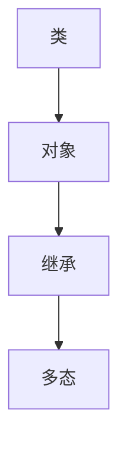
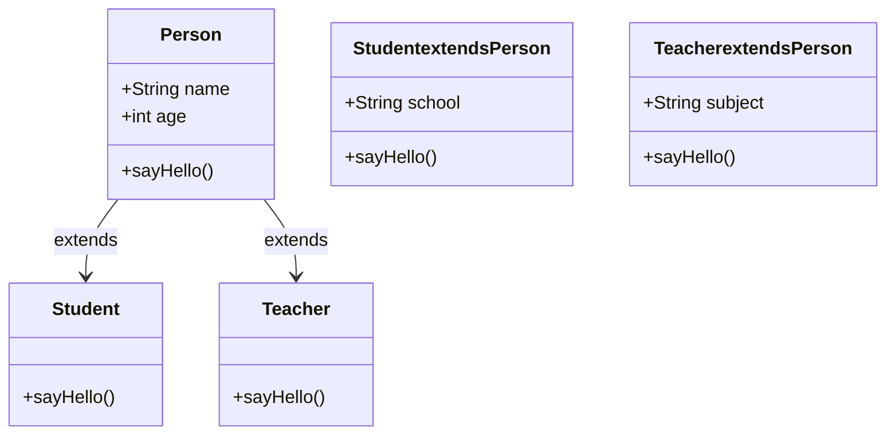

                 

在当今的软件开发领域，JavaScript 作为一种多用途的编程语言，其重要性日益凸显。本文将深入探讨 JavaScript 的两个高级主题：面向对象编程和 AJAX，旨在帮助开发者更好地理解和应用这些技术，以提升软件开发的效率和质量。

## 关键词

- JavaScript
- 面向对象编程
- AJAX
- Web 开发
- 程序设计

## 摘要

本文首先介绍了 JavaScript 的基本概念和历史背景，然后深入探讨了面向对象编程的原理和实践，包括类的创建、继承和多态等关键概念。接着，文章详细讲解了 AJAX 技术的工作原理、优缺点，以及如何在 JavaScript 中实现 AJAX 请求。最后，文章总结了面向对象编程和 AJAX 在现代 Web 开发中的应用，并展望了未来的发展趋势。

## 1. 背景介绍

JavaScript 是一种轻量级的脚本语言，起源于 1995 年。它最初被设计用来为网页添加交互性，例如实现简单的表单验证和动画效果。随着时间的推移，JavaScript 的功能不断扩展，逐渐成为 Web 开发不可或缺的一部分。

### 1.1 JavaScript 基本概念

JavaScript 的基本概念包括变量、数据类型、运算符、流程控制、函数等。变量是存储数据的容器，数据类型包括数字、字符串、布尔值、对象等。运算符用于对变量进行操作，流程控制语句用于实现条件分支和循环。函数是一段可重复使用的代码块，用于执行特定的任务。

### 1.2 JavaScript 历史背景

JavaScript 的历史可以追溯到 1995 年，当时 Netscape Navigator 浏览器引入了这项技术。最初，JavaScript 主要用于实现简单的网页交互，例如弹窗和验证表单。随着 Web 技术的不断发展，JavaScript 的功能逐渐增强，支持更复杂的逻辑和交互。2009 年，Google 推出了 Node.js，使 JavaScript 能够在服务器端运行，进一步拓展了其应用场景。

## 2. 核心概念与联系

面向对象编程（OOP）是一种编程范式，它将数据和操作数据的方法封装在一起，形成对象。面向对象编程的核心概念包括类、对象、继承、多态等。

### 2.1 类与对象

类是对象的蓝图，它定义了对象的属性和方法。对象是类的实例，可以通过类创建。例如：

```javascript
class Person {
  constructor(name, age) {
    this.name = name;
    this.age = age;
  }
  sayHello() {
    console.log(`Hello, my name is ${this.name} and I am ${this.age} years old.`);
  }
}

const person1 = new Person('Alice', 30);
person1.sayHello(); // 输出：Hello, my name is Alice and I am 30 years old.
```

在上面的例子中，`Person` 是一个类，它有两个属性 `name` 和 `age`，以及一个方法 `sayHello`。`person1` 是 `Person` 类的一个实例，通过 `new` 关键字创建。

### 2.2 继承

继承是面向对象编程的一个重要特性，它允许一个类继承另一个类的属性和方法。例如：

```javascript
class Student extends Person {
  constructor(name, age, grade) {
    super(name, age);
    this.grade = grade;
  }
  sayHello() {
    console.log(`Hello, my name is ${this.name} and I am ${this.age} years old.`);
  }
}

const student1 = new Student('Bob', 20, '大一');
student1.sayHello(); // 输出：Hello, my name is Bob and I am 20 years old.
```

在上面的例子中，`Student` 类继承了 `Person` 类的属性和方法，并添加了一个新的属性 `grade`。

### 2.3 多态

多态是指同一操作在不同类型的对象上可以有不同的行为。例如：

```javascript
class Animal {
  speak() {
    console.log('动物在叫');
  }
}

class Dog extends Animal {
  speak() {
    console.log('汪汪汪');
  }
}

class Cat extends Animal {
  speak() {
    console.log('喵喵喵');
  }
}

const animal1 = new Dog();
const animal2 = new Cat();

animal1.speak(); // 输出：汪汪汪
animal2.speak(); // 输出：喵喵喵
```

在上面的例子中，`Dog` 和 `Cat` 类都继承了 `Animal` 类的 `speak` 方法，但它们有不同的实现。

### 2.4 Mermaid 流程图

下面是一个简单的 Mermaid 流程图，展示了面向对象编程的核心概念：



## 3. 核心算法原理 & 具体操作步骤

面向对象编程的算法原理主要基于类和对象的概念。下面是面向对象编程的四个基本步骤：

### 3.1 算法原理概述

1. 定义类：类是对象的模板，用于定义对象的属性和方法。
2. 创建对象：使用 `new` 关键字创建类的实例，即对象。
3. 继承：通过 `extends` 关键字实现类的继承，子类可以继承父类的属性和方法。
4. 多态：通过方法的重写实现多态，子类可以重写父类的方法，使其具有不同的行为。

### 3.2 算法步骤详解

1. **定义类**：使用 `class` 关键字定义类，并在类内部使用 `constructor` 方法初始化属性。
2. **创建对象**：使用 `new` 关键字创建类的实例。
3. **继承**：使用 `extends` 关关键字实现类的继承，子类可以继承父类的属性和方法。
4. **多态**：通过方法的重写实现多态，子类可以重写父类的方法。

### 3.3 算法优缺点

**优点**：
1. **代码复用**：通过继承和封装，可以减少代码重复。
2. **易于维护**：面向对象编程使得代码结构更加清晰，易于维护。
3. **降低耦合度**：通过封装和抽象，可以降低模块间的耦合度。

**缺点**：
1. **性能开销**：面向对象编程引入了额外的性能开销，例如构造函数和原型链。
2. **学习成本**：面向对象编程需要理解类、对象、继承和多态等概念，学习成本较高。

### 3.4 算法应用领域

面向对象编程广泛应用于各种编程语言和领域，包括 Web 开发、桌面应用开发、游戏开发等。在 Web 开发中，面向对象编程有助于构建复杂的应用程序，并提高代码的可维护性和可复用性。

## 4. 数学模型和公式

面向对象编程的数学模型可以看作是对象图和类图的组合。对象图表示实际的对象及其关系，类图表示类及其继承关系。

### 4.1 数学模型构建

面向对象编程的数学模型主要包括以下部分：

1. **对象图**：对象图表示实际的对象及其关系。对象是类的实例，每个对象都有自己的属性和方法。
2. **类图**：类图表示类及其继承关系。类是对象的模板，类之间可以通过继承关系建立层次结构。

### 4.2 公式推导过程

面向对象编程的公式推导过程主要基于类和对象的关系。具体公式如下：

1. **类的关系**：类之间的关系可以通过继承表示，公式为：
   \[ C_2 \in C_1 \]
   其中，\( C_1 \) 和 \( C_2 \) 是两个类，表示 \( C_2 \) 继承自 \( C_1 \)。
2. **对象的关系**：对象之间的关系可以通过关联表示，公式为：
   \[ O_1 \rightarrow O_2 \]
   其中，\( O_1 \) 和 \( O_2 \) 是两个对象，表示 \( O_1 \) 和 \( O_2 \) 之间有单向关联。

### 4.3 案例分析与讲解

下面是一个简单的案例，展示面向对象编程的数学模型：



在这个案例中，`Person` 是一个基类，`Student` 和 `Teacher` 是继承自 `Person` 的子类。`Student` 和 `Teacher` 都有 `sayHello` 方法，但实现不同。

## 5. 项目实践：代码实例和详细解释说明

下面通过一个简单的项目实例，展示面向对象编程在 JavaScript 中的实现。

### 5.1 开发环境搭建

1. 安装 Node.js：从 [Node.js 官网](https://nodejs.org/) 下载并安装 Node.js。
2. 安装 npm：Node.js 默认包含 npm，无需另行安装。
3. 初始化项目：在项目目录中运行 `npm init` 命令，生成 `package.json` 文件。

### 5.2 源代码详细实现

```javascript
// Person.js
class Person {
  constructor(name, age) {
    this.name = name;
    this.age = age;
  }
  sayHello() {
    console.log(`Hello, my name is ${this.name} and I am ${this.age} years old.`);
  }
}

// Student.js
class Student extends Person {
  constructor(name, age, grade) {
    super(name, age);
    this.grade = grade;
  }
  sayHello() {
    console.log(`Hello, my name is ${this.name} and I am ${this.age} years old, I am in grade ${this.grade}.`);
  }
}

// Teacher.js
class Teacher extends Person {
  constructor(name, age, subject) {
    super(name, age);
    this.subject = subject;
  }
  sayHello() {
    console.log(`Hello, my name is ${this.name} and I am ${this.age} years old, I teach ${this.subject}.`);
  }
}

// index.js
const person1 = new Person('Alice', 30);
person1.sayHello(); // 输出：Hello, my name is Alice and I am 30 years old.

const student1 = new Student('Bob', 20, '大一');
student1.sayHello(); // 输出：Hello, my name is Bob and I am 20 years old, I am in grade 大一.

const teacher1 = new Teacher('Charlie', 40, '数学');
teacher1.sayHello(); // 输出：Hello, my name is Charlie and I am 40 years old, I teach 数学。
```

### 5.3 代码解读与分析

在这个项目中，我们定义了三个类：`Person`、`Student` 和 `Teacher`。`Person` 是一个基类，包含 `name` 和 `age` 两个属性以及一个 `sayHello` 方法。`Student` 和 `Teacher` 是继承自 `Person` 的子类，分别添加了 `grade` 和 `subject` 属性，并重写了 `sayHello` 方法。

通过继承和多态，我们能够实现代码的复用，同时保持代码的清晰和可维护性。在这个案例中，`Student` 和 `Teacher` 的 `sayHello` 方法具有不同的实现，但它们都继承了 `Person` 的 `sayHello` 方法。

### 5.4 运行结果展示

在命令行中运行 `node index.js`，可以看到以下输出：

```
Hello, my name is Alice and I am 30 years old.
Hello, my name is Bob and I am 20 years old, I am in grade 大一.
Hello, my name is Charlie and I am 40 years old, I teach 数学。
```

## 6. 实际应用场景

面向对象编程和 AJAX 在现代 Web 开发中有着广泛的应用。下面是几个实际应用场景：

### 6.1 Web 应用程序

在 Web 应用程序中，面向对象编程有助于组织和管理复杂的业务逻辑。例如，在电子商务平台上，我们可以使用面向对象编程来定义商品、订单、用户等类，并实现相关的业务功能。

### 6.2 移动应用

在移动应用开发中，面向对象编程有助于实现模块化和可复用的代码。例如，在 React Native 或 Flutter 中，我们可以使用面向对象编程来构建可重用的组件。

### 6.3 服务器端开发

在服务器端开发中，AJAX 技术可以帮助实现动态数据和交互。例如，在 RESTful API 开发中，我们可以使用 AJAX 技术来获取和提交数据，从而实现客户端与服务器端的实时通信。

### 6.4 未来应用展望

随着 Web 技术的不断发展和创新，面向对象编程和 AJAX 将继续在软件开发中发挥重要作用。未来，我们可能会看到更多的面向对象编程框架和工具的出现，以及更高效、更安全的 AJAX 实现方案。

## 7. 工具和资源推荐

### 7.1 学习资源推荐

1. 《JavaScript 高级程序设计》：一本经典的 JavaScript 学习书籍，全面介绍了 JavaScript 的核心概念和编程技巧。
2. 《You Don't Know JS》：一套深入浅出的 JavaScript 学习指南，涵盖了 JavaScript 的各个方面。

### 7.2 开发工具推荐

1. Visual Studio Code：一款功能强大的代码编辑器，支持 JavaScript 的各种扩展。
2. Node.js：一款用于服务器端开发的 JavaScript 运行环境。

### 7.3 相关论文推荐

1. "A Platform for Embedded Internet Applications"：一篇关于 AJAX 技术的论文，介绍了 AJAX 的原理和应用。
2. "JavaScript: The Good Parts"：一篇关于 JavaScript 语言特性的论文，深入探讨了 JavaScript 的优点和局限性。

## 8. 总结：未来发展趋势与挑战

面向对象编程和 AJAX 是现代 Web 开发的两个核心技术，它们为开发者提供了强大的功能和灵活性。随着 Web 技术的不断发展，面向对象编程和 AJAX 将继续在软件开发中发挥重要作用。未来，我们可能会看到更多的面向对象编程框架和工具的出现，以及更高效、更安全的 AJAX 实现方案。

然而，面向对象编程和 AJAX 也面临着一些挑战。例如，面向对象编程可能导致代码复杂度增加，而 AJAX 技术需要解决安全问题。因此，开发者需要不断学习和适应这些新技术，以应对未来的挑战。

## 9. 附录：常见问题与解答

### 9.1 什么是面向对象编程？

面向对象编程（OOP）是一种编程范式，它将数据和操作数据的方法封装在一起，形成对象。面向对象编程的核心概念包括类、对象、继承、多态等。

### 9.2 什么是 AJAX？

AJAX 是一种基于异步请求的 Web 开发技术，它允许浏览器与服务器进行异步通信，从而实现动态更新网页内容。AJAX 的核心是使用 JavaScript 发送请求并处理响应。

### 9.3 面向对象编程的优点有哪些？

面向对象编程的优点包括代码复用、易于维护、降低耦合度等。面向对象编程有助于构建复杂的应用程序，并提高代码的可维护性和可复用性。

### 9.4 AJAX 的优缺点是什么？

AJAX 的优点包括实现动态更新、提高用户体验、降低服务器负载等。缺点包括安全性问题、浏览器兼容性问题等。

## 作者署名

作者：禅与计算机程序设计艺术 / Zen and the Art of Computer Programming
```

