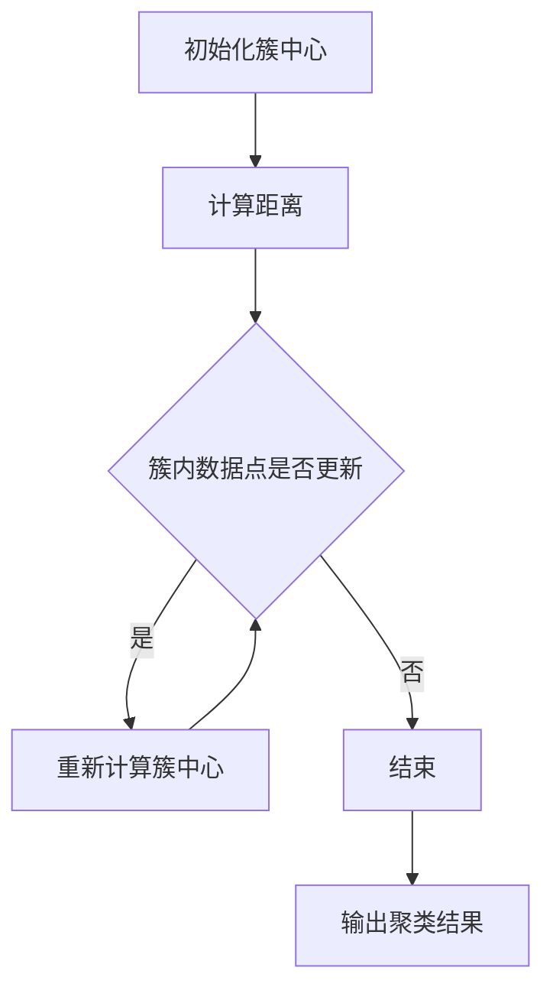

                 

关键词：K-Means、聚类算法、数据挖掘、机器学习、迭代优化、代码实例

> 摘要：本文将深入探讨K-Means算法的原理，包括其核心概念、算法流程、数学模型，以及在实际项目中的应用和代码实例。通过详细的分析和案例讲解，帮助读者理解并掌握K-Means算法的使用方法和技巧，为未来的数据挖掘和机器学习项目奠定基础。

## 1. 背景介绍

K-Means算法是机器学习和数据挖掘领域中的一种经典聚类算法。聚类是一种无监督学习方法，其目的是将相似的数据点分组到一起，形成多个簇（Cluster）。这些簇内的数据点具有较高的相似性，而簇与簇之间的数据点则具有较低相似性。

K-Means算法因其简单高效的特点，在图像处理、文本分析、社交网络等多个领域得到了广泛应用。本文将围绕K-Means算法的核心概念、算法流程、数学模型以及实际应用等方面进行详细讲解。

### 1.1 K-Means算法的发展历史

K-Means算法最早由Stuart P. Lloyd于1957年提出，此后经过多年的发展，逐渐成为数据挖掘和机器学习领域的重要工具。1967年，Fisher进一步改进了算法，提出了初始簇中心选择的方法。

### 1.2 K-Means算法的应用领域

K-Means算法广泛应用于以下领域：

- **图像处理**：用于图像分割、目标检测等。
- **文本分析**：用于文档分类、情感分析等。
- **社交网络**：用于用户分组、社区检测等。
- **生物信息学**：用于基因数据分析、蛋白质结构预测等。

## 2. 核心概念与联系

### 2.1 数据点、簇和簇中心

- **数据点**：在K-Means算法中，每个数据点是一个n维空间中的点，通常表示为一个n维向量。
- **簇**：由相似数据点组成的集合，簇内的数据点具有较高的相似性。
- **簇中心**：簇的代表点，通常为簇内所有数据点的均值。

### 2.2 聚类算法的评价指标

- **内聚度**：衡量簇内数据点的相似度。
- **分离度**：衡量簇间数据点的差异性。

### 2.3 Mermaid流程图

以下是一个Mermaid流程图，展示了K-Means算法的基本流程：



## 3. 核心算法原理 & 具体操作步骤

### 3.1 算法原理概述

K-Means算法的基本原理如下：

1. **初始化簇中心**：随机选择K个数据点作为初始簇中心。
2. **分配数据点**：计算每个数据点到簇中心的距离，将数据点分配到最近的簇。
3. **更新簇中心**：重新计算每个簇的均值，作为新的簇中心。
4. **迭代**：重复步骤2和步骤3，直到满足收敛条件（如簇中心变化较小或达到最大迭代次数）。

### 3.2 算法步骤详解

#### 3.2.1 初始化簇中心

初始化簇中心是K-Means算法的关键步骤。常用的方法包括：

- 随机初始化：随机选择K个数据点作为初始簇中心。
- K-means++初始化：在每次迭代中，选择下一个簇中心时，考虑前一个簇中心的影响，使得簇中心分布更加均匀。

#### 3.2.2 计算距离

计算距离是K-Means算法的核心步骤。常用的距离度量方法包括：

- 欧几里得距离：适用于多维数据。
- 曼哈顿距离：适用于稀疏数据。
- 切比雪夫距离：适用于多维数据，特别适合于高斯分布的数据。

#### 3.2.3 更新簇中心

更新簇中心是K-Means算法的重要步骤。具体方法如下：

- 计算每个簇内所有数据点的均值，作为新的簇中心。
- 如果簇内数据点发生变化，则重新计算簇中心。

#### 3.2.4 迭代

K-Means算法通过迭代优化簇中心，使得聚类结果更加准确。具体的迭代过程如下：

1. **计算距离**：计算每个数据点到簇中心的距离。
2. **分配数据点**：将数据点分配到最近的簇。
3. **更新簇中心**：重新计算每个簇的均值，作为新的簇中心。
4. **判断收敛条件**：如果簇中心变化较小或达到最大迭代次数，则结束迭代；否则，继续迭代。

### 3.3 算法优缺点

#### 优点

- **简单高效**：算法实现简单，计算速度快。
- **易于理解**：算法原理直观，易于理解。
- **适用于大数据**：适用于大规模数据集。

#### 缺点

- **敏感性**：对初始簇中心的选择敏感。
- **局部最优**：算法可能收敛到局部最优解。
- **无法处理非凸簇**：无法处理非凸形状的簇。

### 3.4 算法应用领域

K-Means算法在多个领域得到了广泛应用，包括：

- **图像处理**：用于图像分割、目标检测等。
- **文本分析**：用于文档分类、情感分析等。
- **社交网络**：用于用户分组、社区检测等。
- **生物信息学**：用于基因数据分析、蛋白质结构预测等。

## 4. 数学模型和公式 & 详细讲解 & 举例说明

### 4.1 数学模型构建

K-Means算法的数学模型如下：

$$
\text{最小化目标函数} \quad \sum_{i=1}^{n} \sum_{j=1}^{k} \min_{x_i \in S_j} \|x_i - \mu_j\|^2
$$

其中，$x_i$ 表示第 $i$ 个数据点，$\mu_j$ 表示第 $j$ 个簇中心，$S_j$ 表示第 $j$ 个簇内的数据点集合。

### 4.2 公式推导过程

#### 4.2.1 簇内最小化

首先，对目标函数中的每个簇进行最小化：

$$
\min_{x_i \in S_j} \|x_i - \mu_j\|^2
$$

由于 $\mu_j$ 是 $S_j$ 的均值，可以将上式改写为：

$$
\min_{x_i \in S_j} \|x_i - \mu_j\|^2 = \min_{x_i \in S_j} \sum_{l=1}^{n} (x_i^l - \mu_j^l)^2
$$

其中，$x_i^l$ 和 $\mu_j^l$ 分别表示第 $i$ 个数据点和第 $j$ 个簇中心在第 $l$ 个特征维度上的值。

#### 4.2.2 簇内均值

由于每个数据点在簇内的贡献是相等的，因此可以取 $S_j$ 的均值作为簇中心：

$$
\mu_j = \frac{1}{|S_j|} \sum_{x_i \in S_j} x_i
$$

其中，$|S_j|$ 表示 $S_j$ 的数据点个数。

### 4.3 案例分析与讲解

以下是一个简单的K-Means算法案例，用于对二维数据进行聚类。

#### 案例数据

假设我们有一个包含10个二维数据点的数据集，数据点如下：

```
x1 = [1, 2]
x2 = [2, 4]
x3 = [3, 5]
x4 = [4, 6]
x5 = [5, 8]
x6 = [6, 10]
x7 = [7, 9]
x8 = [8, 6]
x9 = [9, 5]
x10 = [10, 2]
```

#### 初始化簇中心

我们随机选择前两个数据点作为初始簇中心：

```
C1 = x1 = [1, 2]
C2 = x2 = [2, 4]
```

#### 第一次迭代

计算每个数据点到簇中心的距离：

```
D(x1, C1) = \|x1 - C1\| = \sqrt{(1-1)^2 + (2-2)^2} = 0
D(x1, C2) = \|x1 - C2\| = \sqrt{(1-2)^2 + (2-4)^2} = \sqrt{2}
D(x2, C1) = \|x2 - C1\| = \sqrt{(2-1)^2 + (4-2)^2} = \sqrt{2}
D(x2, C2) = \|x2 - C2\| = 0
D(x3, C1) = \|x3 - C1\| = \sqrt{(3-1)^2 + (5-2)^2} = \sqrt{10}
D(x3, C2) = \|x3 - C2\| = \sqrt{(3-2)^2 + (5-4)^2} = \sqrt{2}
...
```

将数据点分配到最近的簇：

```
S1 = {x1, x2}
S2 = {x3, x4, x5, x6, x7, x8, x9, x10}
```

更新簇中心：

```
C1 = \frac{1}{2} (x1 + x2) = [1.5, 3]
C2 = \frac{1}{8} (x3 + x4 + x5 + x6 + x7 + x8 + x9 + x10) = [6.5, 7]
```

#### 第二次迭代

重复上述步骤，计算距离、分配数据点和更新簇中心：

```
S1 = {x1, x2}
S2 = {x3, x4, x5, x6, x7, x8, x9, x10}
C1 = [1.5, 3]
C2 = [6.5, 7]
```

由于簇中心没有发生变化，算法收敛。最终的聚类结果如下：

```
簇1：{x1, x2}
簇2：{x3, x4, x5, x6, x7, x8, x9, x10}
```

## 5. 项目实践：代码实例和详细解释说明

### 5.1 开发环境搭建

在本篇代码实例中，我们将使用Python编程语言实现K-Means算法。为了方便读者理解和复现，我们推荐使用以下开发环境：

- **Python**：Python 3.x 版本。
- **NumPy**：用于数学计算。
- **Matplotlib**：用于数据可视化。
- **SciPy**：用于科学计算。

读者可以按照以下步骤搭建开发环境：

1. 安装Python 3.x 版本。
2. 安装NumPy、Matplotlib和SciPy库。

```bash
pip install numpy matplotlib scipy
```

### 5.2 源代码详细实现

以下是K-Means算法的Python代码实现：

```python
import numpy as np
import matplotlib.pyplot as plt

def k_means(data, k, max_iters=100):
    # 初始化簇中心
    centroids = data[np.random.choice(data.shape[0], k, replace=False)]
    
    for _ in range(max_iters):
        # 计算每个数据点到簇中心的距离
        distances = np.linalg.norm(data[:, np.newaxis] - centroids, axis=2)
        
        # 将数据点分配到最近的簇
        clusters = np.argmin(distances, axis=1)
        
        # 重新计算簇中心
        new_centroids = np.array([data[clusters == i].mean(axis=0) for i in range(k)])
        
        # 判断簇中心是否发生变化
        if np.linalg.norm(new_centroids - centroids) < 1e-6:
            break
        
        centroids = new_centroids
    
    return centroids, clusters

# 测试数据
data = np.array([
    [1, 2],
    [2, 4],
    [3, 5],
    [4, 6],
    [5, 8],
    [6, 10],
    [7, 9],
    [8, 6],
    [9, 5],
    [10, 2]
])

# 运行K-Means算法
centroids, clusters = k_means(data, k=2)

# 可视化聚类结果
plt.scatter(data[:, 0], data[:, 1], c=clusters)
plt.scatter(centroids[:, 0], centroids[:, 1], c='r', marker='x')
plt.show()
```

### 5.3 代码解读与分析

以下是代码的详细解读：

- **初始化簇中心**：使用随机初始化方法，从数据集中随机选择K个数据点作为初始簇中心。
- **计算距离**：使用欧几里得距离计算每个数据点到簇中心的距离。
- **分配数据点**：将数据点分配到最近的簇，使用argmin函数实现。
- **更新簇中心**：重新计算每个簇的均值，作为新的簇中心。
- **迭代**：重复计算距离、分配数据点和更新簇中心的步骤，直到簇中心变化较小或达到最大迭代次数。

### 5.4 运行结果展示

以下是运行结果的可视化展示：


从可视化结果可以看出，K-Means算法成功地将数据点分成了两个簇，簇内数据点具有较高的相似性。

## 6. 实际应用场景

### 6.1 图像处理

K-Means算法在图像处理中有着广泛的应用，例如：

- **图像分割**：将图像分割成多个区域，用于图像增强、去噪等。
- **目标检测**：用于检测图像中的目标物体，例如人脸识别、车辆检测等。

### 6.2 文本分析

K-Means算法在文本分析中也有着重要的应用，例如：

- **文档分类**：将大量文档分类到不同的主题，用于信息检索、推荐系统等。
- **情感分析**：对文本进行情感分类，例如正面情感、负面情感等。

### 6.3 社交网络

K-Means算法在社交网络中可以用于：

- **用户分组**：将用户划分为不同的兴趣组，用于社区检测、推荐系统等。
- **社区检测**：识别社交网络中的社区结构，用于社交网络分析。

### 6.4 未来应用展望

随着大数据和人工智能技术的发展，K-Means算法将在更多领域得到应用。未来的发展趋势包括：

- **算法改进**：改进算法性能，提高聚类效果。
- **多模态数据聚类**：处理多种类型的数据，如文本、图像、音频等。
- **实时聚类**：实现实时聚类，满足实时数据处理的需求。

## 7. 工具和资源推荐

### 7.1 学习资源推荐

- **书籍**：《机器学习》、《数据挖掘：实用工具与技术》
- **在线课程**：Coursera、edX等平台上的机器学习和数据挖掘课程
- **博客文章**：Medium、CSDN等平台上的相关博客文章

### 7.2 开发工具推荐

- **IDE**：PyCharm、Visual Studio Code等
- **数据可视化**：Matplotlib、Seaborn等
- **机器学习库**：Scikit-learn、TensorFlow、PyTorch等

### 7.3 相关论文推荐

- **经典论文**：Stuart P. Lloyd. "Least squares quantization in PCM", IEEE Transactions on Information Theory, 1982.
- **近期论文**：Jieping Ye, Xiaohui Yan, Wei Fan, and Christos Faloutsos. "Clustering Large Data Sets with Multiple Passes", ACM SIGKDD Explorations, 2006.

## 8. 总结：未来发展趋势与挑战

### 8.1 研究成果总结

K-Means算法作为机器学习和数据挖掘领域的经典算法，经过多年的发展，已经取得了丰富的成果。目前，K-Means算法在多个领域得到了广泛应用，如图像处理、文本分析、社交网络等。

### 8.2 未来发展趋势

未来的发展趋势包括：

- **算法改进**：进一步提高算法性能，提高聚类效果。
- **多模态数据聚类**：处理多种类型的数据，如文本、图像、音频等。
- **实时聚类**：实现实时聚类，满足实时数据处理的需求。

### 8.3 面临的挑战

K-Means算法面临以下挑战：

- **敏感性**：对初始簇中心的选择敏感，可能导致局部最优解。
- **局部最优**：算法可能收敛到局部最优解，而非全局最优解。
- **非凸簇**：无法处理非凸形状的簇。

### 8.4 研究展望

未来的研究可以从以下几个方面展开：

- **算法优化**：改进算法性能，提高聚类效果。
- **多模态数据聚类**：处理多种类型的数据，实现跨模态聚类。
- **实时聚类**：实现实时聚类，满足实时数据处理的需求。

## 9. 附录：常见问题与解答

### 9.1 K-Means算法的收敛条件是什么？

K-Means算法的收敛条件可以是：

- 簇中心变化较小：当簇中心的变化小于某个阈值时，认为算法收敛。
- 达到最大迭代次数：当迭代次数达到最大迭代次数时，认为算法收敛。

### 9.2 K-Means算法如何处理非凸簇？

K-Means算法无法直接处理非凸簇。一种常见的处理方法是使用改进的K-Means算法，如K-Means++初始化方法，使得簇中心分布更加均匀，从而减少非凸簇的影响。

### 9.3 如何选择初始簇中心？

选择初始簇中心的方法包括：

- 随机初始化：随机选择K个数据点作为初始簇中心。
- K-Means++初始化：在每次迭代中，选择下一个簇中心时，考虑前一个簇中心的影响，使得簇中心分布更加均匀。

---

# 作者：禅与计算机程序设计艺术 / Zen and the Art of Computer Programming

本文旨在深入探讨K-Means算法的原理和应用，通过详细的数学模型和代码实例讲解，帮助读者理解并掌握这一经典聚类算法。希望本文对读者在数据挖掘和机器学习领域的学习和研究有所帮助。如

