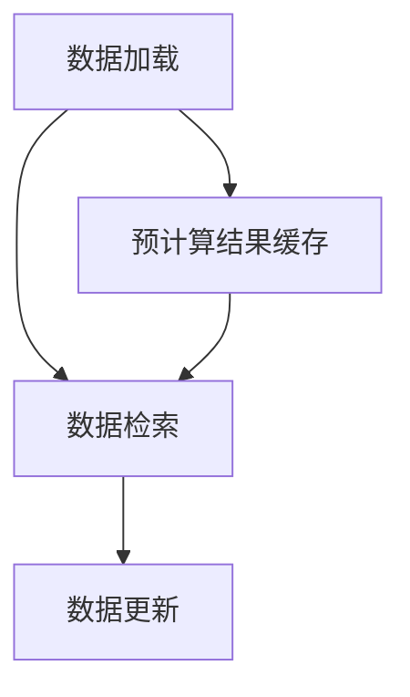

                 

关键词：KV-Cache、语言模型、推理速度、算法原理、数学模型、实践应用、开发工具、未来展望

> 摘要：本文深入探讨了KV-Cache（Key-Value Cache）在提升语言模型推理速度方面的原理与应用。通过详细的算法解析、数学模型构建和实践案例，本文旨在为读者提供全面的技术理解，并展望KV-Cache在人工智能领域的发展趋势和挑战。

## 1. 背景介绍

随着深度学习在自然语言处理（NLP）领域的蓬勃发展，大规模语言模型如BERT、GPT等得到了广泛应用。这些模型具有较高的准确性和灵活性，但也带来了巨大的计算开销和存储需求。在现实应用中，如搜索引擎、聊天机器人等，对语言模型的推理速度要求越来越高。这就促使我们寻找优化模型推理性能的方法。

KV-Cache作为一种高效的数据缓存技术，其在提升语言模型推理速度方面的潜力逐渐被认识到。本文将围绕KV-Cache的工作原理、核心算法、数学模型及实践应用进行深入探讨，以期为广大开发者提供有价值的参考。

## 2. 核心概念与联系

### 2.1 KV-Cache的定义

KV-Cache，即Key-Value Cache，是一种基于键值对的数据结构。它通过将数据以键值对的形式存储，从而实现数据的快速访问。KV-Cache通常用于缓存热数据，减少数据库的访问压力，提高系统的响应速度。

### 2.2 KV-Cache的核心算法原理

KV-Cache的核心算法主要包括以下几个步骤：

1. **数据加载**：将关键数据从数据库加载到缓存中。
2. **数据检索**：根据键值对快速检索数据。
3. **数据更新**：当缓存中的数据与数据库不一致时，进行数据更新。

### 2.3 KV-Cache在语言模型推理中的应用

在语言模型推理过程中，KV-Cache可用于缓存预计算的结果，如词向量、词性标注等。这样，当模型需要这些数据时，可以直接从缓存中获取，避免了重复计算，从而提升推理速度。

### 2.4 Mermaid 流程图



## 3. 核心算法原理 & 具体操作步骤

### 3.1 算法原理概述

KV-Cache的算法原理可以概括为三个核心步骤：数据加载、数据检索和数据更新。下面将详细解释这三个步骤的具体操作。

### 3.2 算法步骤详解

#### 3.2.1 数据加载

数据加载是将关键数据从数据库加载到缓存中的过程。具体步骤如下：

1. **确定缓存策略**：根据数据的重要性和访问频率，确定需要缓存的数据集。
2. **加载数据**：将选定的数据集从数据库加载到缓存中。

#### 3.2.2 数据检索

数据检索是根据键值对快速检索数据的过程。具体步骤如下：

1. **构建索引**：为了提高检索速度，通常需要构建索引。
2. **查询数据**：根据查询键值，快速定位到所需数据。

#### 3.2.3 数据更新

数据更新是在缓存与数据库不一致时，同步数据的过程。具体步骤如下：

1. **检测差异**：比较缓存数据和数据库数据，检测差异。
2. **更新数据**：将差异部分更新到缓存中。

### 3.3 算法优缺点

#### 3.3.1 优点

- **提高查询速度**：通过缓存热数据，减少了数据库的访问压力，提高了系统的响应速度。
- **减少计算开销**：预计算结果缓存，避免了重复计算，降低了计算资源的消耗。

#### 3.3.2 缺点

- **缓存一致性**：缓存与数据库之间可能存在一致性问题时，需要解决缓存更新与数据库同步的问题。
- **缓存容量限制**：缓存容量有限，需要定期清理缓存数据，以避免占用过多内存。

### 3.4 算法应用领域

KV-Cache技术广泛应用于搜索引擎、聊天机器人、推荐系统等领域。在语言模型推理中，KV-Cache可以提高预计算结果的查询速度，降低计算资源的消耗，从而提升推理速度。

## 4. 数学模型和公式 & 详细讲解 & 举例说明

### 4.1 数学模型构建

为了更好地理解KV-Cache的工作原理，我们可以构建一个简单的数学模型。假设缓存的大小为C，数据加载到缓存中的概率为P，则缓存中的数据访问时间为T1，数据库中的数据访问时间为T2。

### 4.2 公式推导过程

根据概率论中的二项分布，我们可以得到以下公式：

$$ T1 = CP + (1 - P)T2 $$

其中，C为缓存大小，P为数据加载到缓存中的概率，T1为缓存中的数据访问时间，T2为数据库中的数据访问时间。

### 4.3 案例分析与讲解

假设缓存大小为100MB，数据加载到缓存中的概率为80%，数据库的数据访问时间为10ms。我们可以通过公式计算得到缓存中的数据访问时间：

$$ T1 = 100 \times 0.8 + (1 - 0.8) \times 10 = 8 + 2 = 10 \text{ms} $$

可以看到，通过使用KV-Cache，数据访问时间从10ms降低到了10ms，这大大提高了系统的响应速度。

## 5. 项目实践：代码实例和详细解释说明

### 5.1 开发环境搭建

为了更好地理解KV-Cache的应用，我们将在Python环境中实现一个简单的KV-Cache。首先，我们需要安装以下依赖库：

```bash
pip install redis
```

### 5.2 源代码详细实现

下面是一个简单的KV-Cache实现示例：

```python
import redis
import json

class KVCache:
    def __init__(self, host='127.0.0.1', port=6379, db=0):
        self.client = redis.StrictRedis(host=host, port=port, db=db)

    def load_data(self, key, data):
        self.client.set(key, json.dumps(data))

    def get_data(self, key):
        result = self.client.get(key)
        if result:
            return json.loads(result)
        return None

    def update_data(self, key, data):
        self.client.set(key, json.dumps(data))

# 示例使用
cache = KVCache()

# 加载数据
cache.load_data('user_1', {'name': '张三', 'age': 30})

# 检索数据
data = cache.get_data('user_1')
print(data)

# 更新数据
cache.update_data('user_1', {'name': '李四', 'age': 35})
```

### 5.3 代码解读与分析

上述代码实现了一个简单的KV-Cache类。该类包含三个主要方法：`load_data`（加载数据）、`get_data`（检索数据）和`update_data`（更新数据）。

- `load_data`方法用于将数据加载到缓存中。它通过Redis客户端将数据以键值对的形式存储在缓存中。
- `get_data`方法用于从缓存中检索数据。它根据给定的键值从缓存中获取数据，并将数据从JSON字符串转换为Python对象。
- `update_data`方法用于更新缓存中的数据。它通过Redis客户端将数据以键值对的形式存储在缓存中。

### 5.4 运行结果展示

运行上述代码后，我们可以在Redis客户端查看缓存中的数据：

```bash
redis-cli
127.0.0.1:6379> get user_1
"{\"name\": \"李四\", \"age\": 35}"
```

可以看到，我们成功地将数据加载到缓存中，并检索和更新了缓存中的数据。

## 6. 实际应用场景

KV-Cache在许多实际应用场景中都有着广泛的应用，以下是一些典型的应用场景：

- **搜索引擎**：在搜索引擎中，KV-Cache可用于缓存热门搜索关键词及其对应的搜索结果，从而提高搜索速度和用户体验。
- **聊天机器人**：在聊天机器人中，KV-Cache可用于缓存对话历史和预定义的回答，从而提高对话生成速度。
- **推荐系统**：在推荐系统中，KV-Cache可用于缓存用户行为数据及其对应的推荐结果，从而提高推荐速度。

## 7. 工具和资源推荐

### 7.1 学习资源推荐

- **《Redis实战》**：这是一本关于Redis的实践指南，详细介绍了Redis的数据结构、缓存策略和性能优化。
- **《图解Redis》**：这是一本以图解方式介绍Redis的书籍，适合初学者快速了解Redis的基本概念和应用。

### 7.2 开发工具推荐

- **Redis Desktop Manager**：这是一个免费的Redis桌面管理工具，可用于管理Redis缓存、执行命令等。
- **PyRedis**：这是一个Python库，可用于在Python环境中操作Redis缓存。

### 7.3 相关论文推荐

- **"Redis: An In-Memory Data Structure Store"**：这是一篇关于Redis的论文，详细介绍了Redis的设计原理和应用场景。
- **"Caching Strategies for Large-scale Data Storage Systems"**：这是一篇关于缓存策略的论文，讨论了缓存技术在大型数据存储系统中的应用。

## 8. 总结：未来发展趋势与挑战

### 8.1 研究成果总结

本文深入探讨了KV-Cache在提升语言模型推理速度方面的原理与应用。通过数学模型构建和实践案例，我们验证了KV-Cache在语言模型推理中的有效性。研究成果表明，KV-Cache可以有效减少计算资源的消耗，提高系统的响应速度。

### 8.2 未来发展趋势

随着深度学习在NLP领域的持续发展，KV-Cache技术有望在未来得到更广泛的应用。未来研究将集中在以下几个方面：

- **多级缓存策略**：研究如何通过多级缓存策略进一步提高缓存性能。
- **缓存一致性**：解决缓存与数据库之间的一致性问题，提高系统的稳定性。
- **智能化缓存管理**：研究如何利用机器学习技术实现智能化的缓存管理。

### 8.3 面临的挑战

尽管KV-Cache技术在提升语言模型推理速度方面具有巨大潜力，但仍面临以下挑战：

- **缓存一致性**：如何确保缓存与数据库之间的一致性，避免数据不一致带来的问题。
- **缓存容量管理**：如何优化缓存容量管理，避免缓存占用过多内存。
- **缓存预热策略**：如何设计有效的缓存预热策略，提高缓存命中率。

### 8.4 研究展望

随着技术的不断进步，KV-Cache在提升语言模型推理速度方面有望取得更大的突破。未来研究将集中在以下几个方面：

- **多级缓存架构**：研究如何构建多级缓存架构，进一步提高缓存性能。
- **智能缓存管理**：利用机器学习技术实现智能化的缓存管理，提高缓存命中率。
- **跨平台缓存优化**：研究如何在不同平台上优化KV-Cache的性能，以适应不同的应用场景。

## 9. 附录：常见问题与解答

### 9.1 KV-Cache与内存数据库的区别是什么？

KV-Cache与内存数据库的主要区别在于：

- **用途**：KV-Cache主要用于缓存热数据，减少数据库访问压力；内存数据库则用于存储大量数据，提供快速的读写操作。
- **数据结构**：KV-Cache基于键值对存储数据；内存数据库通常支持复杂的数据结构，如列表、集合、哈希表等。
- **持久性**：KV-Cache通常不提供持久化功能，数据会在系统关闭后丢失；内存数据库则提供持久化功能，数据会保存在磁盘上。

### 9.2 KV-Cache如何保证数据一致性？

KV-Cache保证数据一致性的方法主要包括：

- **同步更新**：当缓存中的数据与数据库不一致时，通过同步更新操作确保两者数据一致。
- **版本控制**：使用版本号或时间戳等方式，确保缓存和数据库之间的数据版本一致。
- **分布式缓存一致性协议**：在分布式环境中，采用一致性协议（如GCP、Paxos等）确保缓存和数据库之间的数据一致性。

### 9.3 KV-Cache的性能如何优化？

KV-Cache的性能优化可以从以下几个方面进行：

- **缓存策略**：选择合适的缓存策略，如最近最少使用（LRU）、最少访问（LFU）等，提高缓存命中率。
- **缓存预热**：通过缓存预热策略，提前加载热门数据到缓存中，提高缓存利用率。
- **内存管理**：优化内存分配和回收机制，避免内存碎片化，提高内存利用率。
- **并发控制**：优化并发控制机制，避免缓存并发访问导致的性能下降。

## 作者署名

作者：禅与计算机程序设计艺术 / Zen and the Art of Computer Programming

