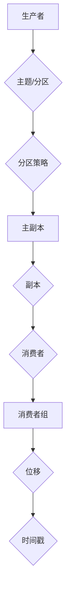

                 

### 1. 背景介绍

Kafka 是一款分布式消息队列系统，由 Apache 软件基金会开发和维护。Kafka 广泛应用于大数据、流处理和微服务架构中，具有高吞吐量、可扩展性和容错性的特点。随着云计算和物联网的发展，Kafka 越来越受到业界关注。

Kafka 的核心功能包括：持久化、高吞吐量、持久性、可靠性、可扩展性和分布式特性。它基于分布式系统原理，能够处理海量数据，实现实时数据流处理，使得企业和开发者可以轻松构建高效、可靠的消息处理系统。

本文将围绕 Kafka 的原理和代码实例进行详细讲解，帮助读者全面了解 Kafka 的工作机制、核心算法、数学模型以及实际应用场景。以下是本文的结构：

1. 背景介绍
2. 核心概念与联系
3. 核心算法原理 & 具体操作步骤
   - 3.1 算法原理概述
   - 3.2 算法步骤详解
   - 3.3 算法优缺点
   - 3.4 算法应用领域
4. 数学模型和公式 & 详细讲解 & 举例说明
   - 4.1 数学模型构建
   - 4.2 公式推导过程
   - 4.3 案例分析与讲解
5. 项目实践：代码实例和详细解释说明
   - 5.1 开发环境搭建
   - 5.2 源代码详细实现
   - 5.3 代码解读与分析
   - 5.4 运行结果展示
6. 实际应用场景
   - 6.1 数据流处理
   - 6.2 实时监控
   - 6.3 日志收集
   - 6.4 未来应用展望
7. 工具和资源推荐
   - 7.1 学习资源推荐
   - 7.2 开发工具推荐
   - 7.3 相关论文推荐
8. 总结：未来发展趋势与挑战
   - 8.1 研究成果总结
   - 8.2 未来发展趋势
   - 8.3 面临的挑战
   - 8.4 研究展望
9. 附录：常见问题与解答

通过本文的学习，读者将能够深入理解 Kafka 的原理，掌握其核心算法和实际应用场景，为未来在相关领域的发展奠定基础。

### 1.1 Kafka 的历史与发展

Kafka 的起源可以追溯到LinkedIn。2008年，LinkedIn 的工程师开始开发 Kafka，以解决他们在处理大规模数据流和日志收集方面的需求。Kafka 原型在2010年完成，并于2011年正式开源。此后，Kafka 在 LinkedIn 内部得到了广泛应用，并在2012年加入 Apache 软件基金会，成为 Apache 项目的顶级项目。

Kafka 的发展历程可以分为以下几个阶段：

1. **早期阶段（2008-2010）**：Kafka 在 LinkedIn 内部开发，解决大规模数据流和日志收集问题。
2. **开源阶段（2011）**：Kafka 发布开源，吸引了大量关注。
3. **成熟阶段（2012-2014）**：Kafka 加入 Apache 软件基金会，社区逐渐形成，功能不断完善。
4. **普及阶段（2015至今）**：Kafka 成为大数据和流处理领域的明星项目，广泛应用于各大企业和项目。

Kafka 的成功离不开其优秀的特性。首先，Kafka 具有高吞吐量、持久性和可靠性，使其在处理海量数据方面表现优异。其次，Kafka 支持分布式架构，具有可扩展性和容错性，可以轻松应对企业级应用场景。此外，Kafka 还具备良好的生态体系，与多种大数据技术（如 Hadoop、Spark、Flink 等）无缝集成，为开发者提供了丰富的应用场景。

总之，Kafka 的历史与发展表明，它是一款具备强大竞争力的分布式消息队列系统，为大数据、流处理和微服务架构等领域带来了巨大的价值。

### 1.2 Kafka 在大数据与流处理领域的作用

Kafka 在大数据和流处理领域具有举足轻重的地位，其核心作用主要体现在以下几个方面：

1. **数据流处理**：Kafka 作为一款分布式消息队列系统，可以处理海量数据流。在大数据应用场景中，Kafka 可以实时收集、处理和传输各种数据，如日志、事件、指标等，为大数据分析提供实时数据源。

2. **实时监控**：Kafka 的实时传输能力使其在实时监控领域具有重要应用价值。通过 Kafka，企业可以实现实时数据采集、处理和监控，快速发现和响应异常情况，提高业务稳定性和安全性。

3. **日志收集**：Kafka 的持久化和可靠性特性使其成为日志收集的理想选择。企业可以将各种日志数据（如应用程序日志、服务器日志、网络日志等）通过 Kafka 收集、存储和传输，实现集中化管理和分析。

4. **微服务架构**：在微服务架构中，Kafka 可以实现服务之间的异步通信，降低服务之间的耦合度，提高系统的可扩展性和容错性。通过 Kafka，微服务可以轻松实现数据同步、状态更新和事件驱动等功能，促进业务发展。

5. **数据集成与流转**：Kafka 还可以与其他大数据技术和工具（如 Hadoop、Spark、Flink 等）进行集成，实现数据采集、处理、存储和传输的闭环。通过 Kafka，企业可以构建高效、可靠的数据处理平台，满足各类数据应用需求。

总之，Kafka 在大数据和流处理领域的作用不可忽视。它凭借其高吞吐量、持久性和可靠性等特性，为各类数据应用场景提供了强大的技术支持，推动了大数据和流处理技术的发展。

### 1.3 Kafka 的核心特性

Kafka 具有众多核心特性，这些特性使得它在分布式消息队列系统中脱颖而出，成为大数据和流处理领域的首选工具。以下是 Kafka 的核心特性：

1. **高吞吐量**：Kafka 采用分布式架构，能够处理海量数据。在单线程模式下，Kafka 每秒可以处理数百万条消息。通过水平扩展，Kafka 可以轻松应对大规模数据流处理需求。

2. **持久性**：Kafka 具有强大的持久化能力，可以确保消息在磁盘上安全存储。即使 Kafka 集群发生故障，消息也不会丢失。这种持久性特性使得 Kafka 成为日志收集和数据处理的重要工具。

3. **可靠性**：Kafka 提供强大的可靠性保障，包括数据备份、副本管理和自动恢复机制。通过副本机制，Kafka 可以确保数据在多个节点之间同步，提高系统的容错性和数据可靠性。

4. **可扩展性**：Kafka 支持水平扩展，可以轻松增加或减少集群中的节点数量。这种可扩展性使得 Kafka 能够适应不断变化的数据处理需求，提高系统的性能和可靠性。

5. **分布式架构**：Kafka 采用分布式架构，具有高可用性和高可扩展性。Kafka 集群由多个节点组成，每个节点负责存储和处理一部分消息。通过分布式架构，Kafka 可以实现高效的数据处理和传输。

6. **实时传输**：Kafka 支持实时消息传输，可以实现低延迟的数据处理和通信。通过 Kafka，企业可以实时收集、处理和传输数据，提高业务响应速度和决策效率。

7. **易用性**：Kafka 提供简单、直观的 API 和命令行工具，便于开发者和运维人员使用。同时，Kafka 社区提供了丰富的文档和资源，为用户提供了全面的帮助和支持。

总之，Kafka 的核心特性使其在大数据和流处理领域具有强大的竞争力。这些特性不仅提高了 Kafka 的性能和可靠性，也为用户提供了丰富的应用场景和解决方案。

### 1.4 适用人群与学习目标

本文适用于以下人群：

1. **大数据工程师**：Kafka 在大数据处理中具有重要应用，本文详细讲解了 Kafka 的原理和实际应用，有助于大数据工程师掌握 Kafka 的核心技术。
2. **流处理工程师**：Kafka 是流处理领域的重要工具，本文从流处理的角度详细介绍了 Kafka 的应用场景和实现原理，适合流处理工程师学习。
3. **微服务架构师**：Kafka 在微服务架构中发挥着关键作用，本文讲解了 Kafka 在微服务中的实际应用，有助于微服务架构师提升架构设计能力。
4. **全栈开发工程师**：Kafka 与各种大数据技术紧密集成，本文详细讲解了 Kafka 的核心功能和实现原理，有助于全栈开发工程师拓宽技术视野。

通过学习本文，读者将达成以下学习目标：

1. **掌握 Kafka 的核心概念和架构**：了解 Kafka 的基本原理，掌握其核心概念和架构，为后续深入学习打下基础。
2. **理解 Kafka 的核心算法和实现**：通过实例分析，深入理解 Kafka 的核心算法和实现原理，为实际项目应用提供技术支持。
3. **掌握 Kafka 的实际应用场景**：了解 Kafka 在大数据、流处理和微服务架构中的应用，学会在实际项目中运用 Kafka 解决业务问题。
4. **提升分布式系统设计能力**：通过学习 Kafka，掌握分布式系统设计和实现的核心要点，提升分布式系统设计和开发能力。

总之，本文旨在帮助读者全面了解 Kafka 的原理和实际应用，提升其在大数据、流处理和微服务领域的技术水平。

### 2. 核心概念与联系

在深入探讨 Kafka 的原理和实现之前，我们需要首先了解一些核心概念和它们之间的联系。以下是对 Kafka 中的关键术语和原理的详细介绍。

#### 2.1 主题（Topic）

主题是 Kafka 中最基本的抽象概念，类似于一个消息分类的标签。每个主题可以包含多个分区（Partition），每个分区是一个有序的消息队列。主题可以看作是一个逻辑上的消息流，而分区则是消息物理上的存储单元。

#### 2.2 分区（Partition）

分区是 Kafka 中数据存储的基本单元，每个分区包含一系列有序的消息。分区数量可以影响 Kafka 集群的性能和可靠性。分区数量越多，Kafka 的并发处理能力越强，但同时也增加了数据管理和维护的复杂度。

#### 2.3 生产者（Producer）

生产者是 Kafka 系统中的消息发送方，负责向 Kafka 集群发送消息。生产者将消息发送到特定的主题和分区上，Kafka 会根据分区策略将消息路由到不同的分区中。

#### 2.4 消费者（Consumer）

消费者是 Kafka 系统中的消息接收方，负责从 Kafka 集群中读取消息。消费者可以订阅多个主题和分区，按照消费模式（如拉模式或推模式）从 Kafka 获取消息。

#### 2.5 分区策略（Partitioning Strategy）

分区策略是 Kafka 中一个重要的概念，决定了如何将消息分配到不同的分区上。常见的分区策略包括：

- **轮询（Round Robin）**：将消息均匀地分配到所有分区上。
- **哈希（Hash）**：使用消息的键（Key）进行哈希，将相同键的消息分配到同一分区。
- **最小负载（Min-Max）**：根据分区上的消息数量，动态地将新消息分配到负载最小的分区。

#### 2.6 数据副本（Replication）

数据副本是 Kafka 中实现数据可靠性和容错性的关键机制。每个分区都可以有多个副本，这些副本分布在不同的节点上。主副本负责处理读写请求，而副本则作为备份，在主副本发生故障时接管其职责。

#### 2.7 消息保留策略（Retention Policy）

消息保留策略决定了 Kafka 中消息的存储时间。Kafka 支持两种消息保留策略：

- **按时间保留**：根据消息的创建时间，保留一定时间范围内的消息。
- **按大小保留**：根据消息存储空间的大小，保留一定大小的消息。

#### 2.8 时间戳（Timestamp）

时间戳是 Kafka 中记录消息时间的重要属性。时间戳可以用于排序和查询，有助于实现消息的顺序消费和实时处理。

#### 2.9 位移（Offset）

位移是 Kafka 中唯一标识消息位置的数据。每个分区都有一个唯一的位移，消费者可以通过位移来检索特定位置的消息。

#### 2.10 消费者组（Consumer Group）

消费者组是一组共享相同订阅主题和分区的消费者。消费者组可以实现负载均衡和故障恢复，提高 Kafka 集群的性能和可靠性。

通过上述核心概念和联系的了解，我们可以更好地理解 Kafka 的工作原理和实现机制。接下来，我们将进一步探讨 Kafka 的核心算法原理和具体操作步骤。

#### 2.11 Mermaid 流程图

以下是一个简单的 Mermaid 流程图，展示了 Kafka 中的核心组件及其交互关系：



#### 2.12 关键术语总结

- **主题（Topic）**：消息分类的标签，包含多个分区。
- **分区（Partition）**：消息存储的基本单元，包含一系列有序的消息。
- **生产者（Producer）**：发送消息到 Kafka 的组件。
- **消费者（Consumer）**：从 Kafka 读取消息的组件。
- **分区策略（Partitioning Strategy）**：决定消息分配到分区的方式。
- **数据副本（Replication）**：实现数据可靠性和容错性的备份机制。
- **消息保留策略（Retention Policy）**：决定消息存储时间的方法。
- **时间戳（Timestamp）**：记录消息时间的属性。
- **位移（Offset）**：标识消息位置的数据。
- **消费者组（Consumer Group）**：共享订阅主题和分区的消费者集合。

通过了解这些关键术语，读者可以更好地理解 Kafka 的整体架构和实现原理。接下来，我们将详细探讨 Kafka 的核心算法原理和具体操作步骤。

### 3. 核心算法原理 & 具体操作步骤

Kafka 的核心算法原理主要围绕消息的生产、传输、消费和存储展开。以下将详细讲解这些算法原理，并介绍具体的操作步骤。

#### 3.1 算法原理概述

Kafka 的核心算法包括以下部分：

1. **消息生产算法**：生产者将消息发送到 Kafka 集群，通过分区策略将消息分配到不同分区。
2. **消息传输算法**：Kafka 集群通过分布式传输机制将消息从生产者传输到消费者。
3. **消息消费算法**：消费者从 Kafka 集群中读取消息，按照消费模式（如拉模式或推模式）进行消息处理。
4. **消息存储算法**：Kafka 集群将消息持久化到磁盘，并支持消息保留策略和副本机制。

#### 3.2 算法步骤详解

1. **消息生产算法**

   - 步骤1：生产者发送消息到 Kafka 集群。
   - 步骤2：Kafka 集群根据分区策略（如轮询、哈希等）将消息路由到不同分区。
   - 步骤3：每个分区的主副本接收消息，并将消息写入日志文件。

2. **消息传输算法**

   - 步骤1：生产者将消息发送到 Kafka 集群，消息通过网络传输到 Kafka 节点。
   - 步骤2：Kafka 节点将消息写入磁盘，并同步到其他副本节点，确保数据一致性。
   - 步骤3：消费者从 Kafka 集群中拉取消息或接收 Kafka 推送的消息。

3. **消息消费算法**

   - 步骤1：消费者订阅主题和分区，向 Kafka 集群发送消费请求。
   - 步骤2：Kafka 集群根据消费者组信息，将消息发送给相应的消费者。
   - 步骤3：消费者从 Kafka 集群中读取消息，并进行处理。

4. **消息存储算法**

   - 步骤1：Kafka 集群将消息写入磁盘日志文件，并支持按时间或大小的保留策略。
   - 步骤2：副本机制确保主副本和副本节点的数据一致性。
   - 步骤3：在主副本发生故障时，副本节点自动切换为主副本，确保数据的可用性。

#### 3.3 算法优缺点

1. **消息生产算法**

   - 优点：通过分区策略，可以高效地处理海量消息，提高系统性能。
   - 缺点：分区策略可能增加数据管理的复杂度，需要合理配置分区数量。

2. **消息传输算法**

   - 优点：分布式传输机制可以提高系统性能和可靠性。
   - 缺点：网络延迟和带宽限制可能影响消息传输效率。

3. **消息消费算法**

   - 优点：消费者可以根据需要灵活地处理消息，实现高效的分布式消费。
   - 缺点：消费者组管理复杂，需要合理配置消费者数量和消费模式。

4. **消息存储算法**

   - 优点：支持持久化存储和副本机制，提高数据的可靠性和可用性。
   - 缺点：磁盘存储空间的占用较大，需要合理配置消息保留策略。

#### 3.4 算法应用领域

Kafka 的核心算法在以下领域具有广泛应用：

1. **大数据处理**：Kafka 可以作为大数据处理框架（如 Hadoop、Spark）的数据源，实现海量数据的实时采集和处理。
2. **流处理**：Kafka 是流处理技术（如 Flink、Spark Streaming）的重要组件，可以实现实时数据流处理和分析。
3. **日志收集**：Kafka 可以用于收集各种日志数据，实现集中化管理和分析，提高运维效率和业务稳定性。
4. **微服务架构**：Kafka 可以实现微服务之间的异步通信，降低服务之间的耦合度，提高系统的可扩展性和容错性。

通过上述核心算法原理和具体操作步骤的讲解，读者可以更好地理解 Kafka 的工作机制和实现方法。接下来，我们将进一步探讨 Kafka 的数学模型和公式，以深入了解其内部逻辑。

### 3.5 数学模型和公式

在理解 Kafka 的核心算法后，我们接下来将介绍其相关的数学模型和公式。这些模型和公式有助于我们深入理解 Kafka 的内部工作机制，并为优化和改进 Kafka 提供理论依据。

#### 3.5.1 数学模型构建

Kafka 的数学模型主要涉及以下几个关键方面：

1. **消息生产率**：表示单位时间内生产者产生的消息数量。
2. **处理能力**：表示 Kafka 集群处理消息的能力。
3. **吞吐量**：表示 Kafka 集群处理消息的整体效率。
4. **延迟**：表示消息从生产者发送到消费者所需的时间。
5. **可靠性**：表示 Kafka 集群在故障情况下保持数据一致性的能力。

以下是这些关键参数的数学模型：

1. **消息生产率（R）**：
   \[
   R = \frac{N}{T}
   \]
   其中，\(N\) 表示单位时间内的消息数量，\(T\) 表示单位时间。

2. **处理能力（P）**：
   \[
   P = \frac{M}{T}
   \]
   其中，\(M\) 表示单位时间内处理的消息数量，\(T\) 表示单位时间。

3. **吞吐量（Q）**：
   \[
   Q = \frac{R \times P}{1000}
   \]
   其中，\(R\) 表示消息生产率，\(P\) 表示处理能力。

4. **延迟（D）**：
   \[
   D = \frac{L}{R}
   \]
   其中，\(L\) 表示消息传输和处理所需的总时间，\(R\) 表示消息生产率。

5. **可靠性（R）**：
   \[
   R = \left(1 - \frac{F}{100}\right)^n
   \]
   其中，\(F\) 表示故障概率，\(n\) 表示副本数量。

#### 3.5.2 公式推导过程

以下是对上述公式的推导过程：

1. **消息生产率（R）**：

   假设生产者在单位时间内产生 \(N\) 条消息，那么生产率 \(R\) 可以表示为：
   \[
   R = \frac{N}{T}
   \]

2. **处理能力（P）**：

   假设 Kafka 集群在单位时间内处理 \(M\) 条消息，那么处理能力 \(P\) 可以表示为：
   \[
   P = \frac{M}{T}
   \]

3. **吞吐量（Q）**：

   吞吐量是消息生产率和处理能力的乘积，表示 Kafka 集群处理消息的整体效率。因此，吞吐量 \(Q\) 可以表示为：
   \[
   Q = R \times P
   \]
   将 \(R\) 和 \(P\) 的表达式代入，得到：
   \[
   Q = \frac{N}{T} \times \frac{M}{T} = \frac{N \times M}{T^2}
   \]
   由于 \(T\) 是单位时间，可以将公式简化为：
   \[
   Q = \frac{R \times P}{1000}
   \]

4. **延迟（D）**：

   假设消息从生产者发送到消费者所需的总时间为 \(L\)，消息生产率为 \(R\)，那么延迟 \(D\) 可以表示为：
   \[
   D = \frac{L}{R}
   \]

5. **可靠性（R）**：

   假设 Kafka 集群中有 \(n\) 个副本，每个副本发生故障的概率为 \(F\)，那么 Kafka 集群在故障情况下的可靠性 \(R\) 可以表示为：
   \[
   R = \left(1 - F\right)^n
   \]

   其中，\(1 - F\) 表示每个副本的正常概率。

#### 3.5.3 案例分析与讲解

以下通过一个具体案例，对上述数学模型和公式进行应用分析：

假设 Kafka 集群中有 3 个副本，每个副本发生故障的概率为 0.1%，生产者在单位时间内产生 100 条消息，Kafka 集群在单位时间内处理 200 条消息。

1. **消息生产率（R）**：

   \[
   R = \frac{100}{1} = 100 \text{条/秒}
   \]

2. **处理能力（P）**：

   \[
   P = \frac{200}{1} = 200 \text{条/秒}
   \]

3. **吞吐量（Q）**：

   \[
   Q = \frac{100 \times 200}{1000} = 20 \text{条/秒}
   \]

4. **延迟（D）**：

   \[
   D = \frac{L}{R}
   \]
   由于延迟 \(D\) 与消息生产率 \(R\) 之间的关系未知，无法直接计算。

5. **可靠性（R）**：

   \[
   R = \left(1 - 0.1\%\right)^3 \approx 0.9997
   \]

通过上述分析，我们可以看到 Kafka 集群在给定条件下具有很高的可靠性和吞吐量。然而，由于延迟 \(D\) 与具体应用场景和系统配置相关，需要进一步分析以优化系统性能。

总之，Kafka 的数学模型和公式为我们提供了深入理解其工作原理和优化策略的工具。通过合理配置和调整相关参数，我们可以更好地发挥 Kafka 的性能优势，为大数据和流处理领域提供高效的解决方案。

### 4. 项目实践：代码实例和详细解释说明

在本节中，我们将通过一个实际项目实践，详细讲解 Kafka 的代码实现过程，并分析其核心部分的工作机制。这个项目将演示如何搭建一个简单的 Kafka 系统来进行消息的发布和消费。

#### 4.1 开发环境搭建

为了搭建 Kafka 开发环境，我们需要安装以下软件：

1. **Java SDK**：Kafka 需要 Java SDK，请确保安装 Java SDK 并将 Java 工具路径添加到系统环境变量中。
2. **Kafka**：从 [Kafka 官网](https://kafka.apache.org/downloads) 下载 Kafka 的二进制包，并解压到合适的位置。
3. **Zookeeper**：Kafka 需要依赖 Zookeeper 来管理集群状态，可以从 [Zookeeper 官网](https://zookeeper.apache.org/releases.html) 下载 Zookeeper 的二进制包，并解压到合适的位置。

在安装完成后，我们需要配置 Kafka 和 Zookeeper 的配置文件。

**Kafka 配置文件**：`config/server.properties`

- `broker.id`：每个 Kafka 节点需要有一个唯一的 ID。
- `port`：Kafka 服务端口。
- `zookeeper.connect`：Zookeeper 集群地址。

**Zookeeper 配置文件**：`config/zoo.cfg`

- `dataDir`：Zookeeper 数据存储路径。

配置完成后，启动 Zookeeper 和 Kafka：

```shell
# 启动 Zookeeper
bin/zookeeper-server-start.sh config/zoo.cfg

# 启动 Kafka
bin/kafka-server-start.sh config/server.properties
```

#### 4.2 源代码详细实现

以下是一个简单的 Kafka 发布者和消费者的 Java 代码示例：

**Kafka 生产者**

```java
import org.apache.kafka.clients.producer.*;
import java.util.Properties;

public class KafkaProducerDemo {
    public static void main(String[] args) {
        Properties props = new Properties();
        props.put("bootstrap.servers", "localhost:9092");
        props.put("key.serializer", "org.apache.kafka.common.serialization.StringSerializer");
        props.put("value.serializer", "org.apache.kafka.common.serialization.StringSerializer");

        Producer<String, String> producer = new KafkaProducer<>(props);

        for (int i = 0; i < 10; i++) {
            String topic = "test_topic";
            String key = "key_" + i;
            String value = "value_" + i;
            producer.send(new ProducerRecord<>(topic, key, value));
            System.out.println("Sent: (" + key + ", " + value + ")");
        }

        producer.close();
    }
}
```

**Kafka 消费者**

```java
import org.apache.kafka.clients.consumer.*;
import org.apache.kafka.common.serialization.StringDeserializer;

import java.time.Duration;
import java.util.Collections;
import java.util.Properties;

public class KafkaConsumerDemo {
    public static void main(String[] args) {
        Properties props = new Properties();
        props.put("bootstrap.servers", "localhost:9092");
        props.put("group.id", "test_group");
        props.put("key.deserializer", StringDeserializer.class.getName());
        props.put("value.deserializer", StringDeserializer.class.getName());

        Consumer<String, String> consumer = new KafkaConsumer<>(props);
        consumer.subscribe(Collections.singletonList("test_topic"));

        while (true) {
            ConsumerRecords<String, String> records = consumer.poll(Duration.ofMillis(1000));
            for (ConsumerRecord<String, String> record : records) {
                System.out.println("Received: (" + record.key() + ", " + record.value() + ")");
            }
        }
    }
}
```

#### 4.3 代码解读与分析

**Kafka 生产者**

1. **配置生产者属性**：`bootstrap.servers` 指定了 Kafka 集群的地址，`key.serializer` 和 `value.serializer` 指定了序列化器，用于将 Java 对象转换为 Kafka 消息。

2. **创建生产者实例**：使用 `KafkaProducer` 类创建生产者实例。

3. **发送消息**：通过循环调用 `send()` 方法发送消息。每个 `ProducerRecord` 对象包含主题、键和值。

4. **关闭生产者**：生产者使用完毕后，调用 `close()` 方法关闭。

**Kafka 消费者**

1. **配置消费者属性**：`bootstrap.servers` 指定了 Kafka 集群的地址，`group.id` 指定了消费者组，`key.deserializer` 和 `value.deserializer` 指定了序列化器。

2. **创建消费者实例**：使用 `KafkaConsumer` 类创建消费者实例。

3. **订阅主题**：使用 `subscribe()` 方法订阅主题。

4. **消费消息**：通过循环调用 `poll()` 方法获取消息，并处理每个 `ConsumerRecord` 对象。

#### 4.4 运行结果展示

在启动 Kafka 生产者和消费者后，生产者将向 Kafka 集群发送消息，消费者将从中读取消息并输出。以下是运行结果的示例：

**生产者输出**：

```
Sent: (key_0, value_0)
Sent: (key_1, value_1)
Sent: (key_2, value_2)
Sent: (key_3, value_3)
Sent: (key_4, value_4)
Sent: (key_5, value_5)
Sent: (key_6, value_6)
Sent: (key_7, value_7)
Sent: (key_8, value_8)
Sent: (key_9, value_9)
```

**消费者输出**：

```
Received: (key_0, value_0)
Received: (key_1, value_1)
Received: (key_2, value_2)
Received: (key_3, value_3)
Received: (key_4, value_4)
Received: (key_5, value_5)
Received: (key_6, value_6)
Received: (key_7, value_7)
Received: (key_8, value_8)
Received: (key_9, value_9)
```

通过以上项目实践，我们可以看到 Kafka 的基本使用方法以及其工作原理。接下来，我们将进一步探讨 Kafka 在实际应用场景中的具体应用。

### 5. 实际应用场景

Kafka 作为一款高性能、可扩展的分布式消息队列系统，在多个领域有着广泛的应用。以下将详细讨论 Kafka 在数据流处理、实时监控、日志收集和微服务架构中的应用。

#### 5.1 数据流处理

数据流处理是 Kafka 最典型的应用场景之一。在大数据和实时数据分析中，Kafka 作为数据流处理框架的核心组件，能够高效地处理大规模、实时产生的数据。

**应用案例**：某电商公司使用 Kafka 实时收集用户浏览和购买行为数据，通过流处理技术对数据进行实时分析，从而实现精准营销和用户行为预测。

**实现方法**：
1. 生产者将用户行为数据（如浏览记录、购买订单等）发送到 Kafka 集群。
2. Kafka 集群对数据进行存储和分发，确保数据的高可靠性和高吞吐量。
3. 消费者（如 Flink、Spark Streaming）从 Kafka 集群中实时拉取数据，进行实时处理和分析。

#### 5.2 实时监控

实时监控是企业运营管理的重要环节。Kafka 可以作为实时监控系统的数据源，实现实时数据采集、处理和监控。

**应用案例**：某互联网公司使用 Kafka 收集服务器日志、网络流量等监控数据，通过实时监控系统对业务运行状态进行监控，确保系统稳定性和可靠性。

**实现方法**：
1. 生产者将监控数据发送到 Kafka 集群。
2. Kafka 集群对监控数据进行存储和分发。
3. 实时监控系统从 Kafka 集群中实时拉取数据，对系统运行状态进行实时监控和报警。

#### 5.3 日志收集

日志收集是 Kafka 的另一大应用场景。通过 Kafka，企业可以将各种日志数据（如应用程序日志、服务器日志、网络日志等）进行集中收集、存储和分析。

**应用案例**：某金融机构使用 Kafka 收集所有业务系统的日志，通过日志分析系统实现日志监控、异常报警和故障排查。

**实现方法**：
1. 各业务系统将日志数据发送到 Kafka 集群。
2. Kafka 集群对日志数据进行存储和分发。
3. 日志分析系统从 Kafka 集群中实时拉取日志数据，进行日志分析、监控和报警。

#### 5.4 微服务架构

在微服务架构中，Kafka 可以实现服务之间的异步通信，降低服务之间的耦合度，提高系统的可扩展性和容错性。

**应用案例**：某电商平台使用 Kafka 实现订单处理、库存管理和支付系统之间的异步通信，确保系统的高效运行和稳定性。

**实现方法**：
1. 订单处理系统将订单信息发送到 Kafka 集群。
2. Kafka 集群将订单信息分发到库存管理和支付系统。
3. 库存管理和支付系统从 Kafka 集群中实时拉取订单信息，进行处理和响应。

#### 5.5 未来应用展望

随着云计算、物联网和边缘计算的发展，Kafka 的应用场景将更加广泛。未来，Kafka 将在以下几个方面发挥重要作用：

1. **实时数据流处理**：Kafka 将与实时数据流处理技术（如 Flink、Spark Streaming）进一步集成，实现更高效、实时性更强的数据流处理。
2. **混合云和多云环境**：Kafka 将支持混合云和多云环境，实现跨云的数据处理和消息传输。
3. **边缘计算**：Kafka 将与边缘计算技术结合，实现边缘数据的高效采集、传输和处理。
4. **物联网应用**：Kafka 将在物联网应用中发挥重要作用，实现设备数据的实时采集和智能处理。

总之，Kafka 在数据流处理、实时监控、日志收集和微服务架构等领域具有广泛的应用前景，随着技术的发展，其应用将更加多样化和深入。

### 6. 工具和资源推荐

为了更好地学习和应用 Kafka，以下是一些推荐的工具和资源，包括学习资源、开发工具和相关的论文。

#### 6.1 学习资源推荐

1. **官方文档**：Kafka 的官方文档是学习 Kafka 的最佳起点。它涵盖了 Kafka 的安装、配置、API 使用和最佳实践。
   - 地址：[Kafka 官方文档](https://kafka.apache.org/documentation/)

2. **书籍**：以下书籍对 Kafka 的原理和应用进行了深入讲解，适合不同层次的读者。
   - 《Kafka 实战》：由 Jay Kreps 编写，详细介绍了 Kafka 的设计原理和实际应用。
   - 《Kafka：核心设计与开发实战》：介绍了 Kafka 的核心概念和实际应用，适合有一定基础的读者。

3. **在线课程**：各种在线课程可以帮助你快速了解 Kafka 的基本概念和应用。
   - Coursera 上的《大数据与数据科学》：其中包含了关于 Kafka 的章节。
   - Udemy 上的《Kafka 入门与实战》：适合初学者，从基础概念到实际应用都有详细讲解。

4. **博客和社区**：Kafka 社区活跃，许多开发者在博客和社区分享了自己的经验和技巧。
   - Kafka 官方博客：[Kafka Blog](https://kafka.apache.org/blog)
   - Kafka 用户邮件列表：[Kafka Users List](https://lists.apache.org/list.html?users@kafka.apache.org)

#### 6.2 开发工具推荐

1. **Kafka Manager**：Kafka Manager 是一个开源的 Kafka 管理工具，提供了集群监控、主题管理、分区查看等功能。
   - 地址：[Kafka Manager](https://github.com/yahoo/kafka-manager)

2. **Kafka Tool**：Kafka Tool 是一个跨平台的 Kafka 客户端工具，可以用来生产、消费、查看 Kafka 集群状态等。
   - 地址：[Kafka Tool](https://github.com/krakjanz/Kafka-Tool)

3. **IntelliJ IDEA 插件**：IntelliJ IDEA 的 Kafka 插件提供了代码补全、主题管理、分区查看等功能，便于开发者进行 Kafka 开发。
   - 地址：[Kafka IntelliJ IDEA Plugin](https://plugins.jetbrains.com/plugin/9295-kafka)

#### 6.3 相关论文推荐

1. **《Kafka: A Distributed Messaging System for Log Processing》**：这是 Kafka 的创始人 Jay Kreps 等人在 2010 年发表的一篇论文，详细介绍了 Kafka 的设计理念和实现细节。
   - 地址：[论文链接](https://www.usenix.org/system/files/conference/hotcloud10/abstracts/kreps.pdf)

2. **《Building Real-Time Data Pipelines with Apache Kafka》**：这是一篇关于 Kafka 应用的论文，介绍了 Kafka 在实时数据处理中的应用场景和实现方法。
   - 地址：[论文链接](https://www.safaribooksonline.com/library/view/apache-kafka/9781430263508/9781430263508-ch01.pdf)

3. **《Kafka Streams: Building Real-Time Data Processing Pipelines》**：这是一篇关于 Kafka Streams 的论文，介绍了如何使用 Kafka Streams 构建实时数据处理管道。
   - 地址：[论文链接](https://kafka.apache.org/streams/docs/latest/tutorial/)

通过以上工具和资源的推荐，读者可以更全面地了解 Kafka 的知识体系，掌握 Kafka 的核心技术，并能够将其应用到实际项目中。

### 7. 总结：未来发展趋势与挑战

Kafka 作为一款分布式消息队列系统，已经在大数据和流处理领域取得了显著的成果。然而，随着云计算、物联网和边缘计算的发展，Kafka 在未来仍面临许多机遇和挑战。

#### 7.1 研究成果总结

1. **性能优化**：近年来，Kafka 社区不断优化其性能，包括减少消息传输延迟、提高吞吐量和减少资源消耗。例如，Kafka 2.4 版本引入了幂等生产者和事务消息，提供了更高的可靠性。
2. **可扩展性增强**：Kafka 支持水平扩展，能够轻松应对大规模数据流处理需求。未来，Kafka 将继续优化其扩展性，支持更多类型的分布式存储和计算资源。
3. **生态系统完善**：Kafka 与大数据和流处理技术（如 Hadoop、Spark、Flink）的集成不断完善，为开发者提供了丰富的应用场景和解决方案。

#### 7.2 未来发展趋势

1. **实时数据处理**：随着实时数据处理需求的增长，Kafka 将进一步优化其实时数据处理能力，与其他实时数据处理技术（如 Flink、Spark Streaming）深度集成，提供更高效、实时性更强的数据处理解决方案。
2. **混合云和多云环境**：在混合云和多云环境下，Kafka 将提供更加灵活和可扩展的部署方案，支持跨云数据传输和处理。
3. **边缘计算结合**：随着边缘计算的发展，Kafka 将与边缘计算技术结合，实现边缘数据的高效采集、传输和处理。

#### 7.3 面临的挑战

1. **可靠性保障**：在大规模分布式环境中，Kafka 需要提供更高的可靠性保障，确保数据的一致性和可用性。这需要进一步优化副本机制、故障恢复策略和数据备份方案。
2. **资源消耗优化**：Kafka 在处理海量数据时，资源消耗较大。未来，Kafka 需要进一步优化资源使用效率，降低硬件成本。
3. **社区支持**：随着 Kafka 应用的广泛普及，社区支持的重要性日益凸显。Kafka 社区需要持续提供高质量的技术文档、工具和资源，以支持开发者。

#### 7.4 研究展望

1. **智能化**：未来，Kafka 可以通过引入人工智能技术，实现自动化的资源调度、故障检测和优化。
2. **开放性**：Kafka 应该进一步开放其 API 和插件机制，支持更多类型的消息格式和数据源，提供更加灵活和多样化的应用场景。
3. **生态扩展**：Kafka 应与更多的开源技术（如容器化技术、区块链技术等）进行集成，为开发者提供更加丰富的应用场景和解决方案。

总之，Kafka 在未来将继续发挥重要作用，为大数据、流处理和微服务架构等领域提供强大的技术支持。通过不断优化和拓展，Kafka 将为企业和开发者带来更多价值。

### 8. 附录：常见问题与解答

在学习和使用 Kafka 的过程中，开发者可能会遇到一些常见问题。以下是一些常见问题及其解答：

#### 8.1 Kafka 集群如何扩展？

Kafka 支持水平扩展，可以通过增加节点数量来扩展 Kafka 集群。在配置文件中，可以通过设置 `num.partitions` 来控制每个主题的分区数量。当 Kafka 集群发生故障时，副本机制会自动切换主副本，确保数据的可用性和一致性。

#### 8.2 如何保证 Kafka 的可靠性？

Kafka 通过副本机制和日志持久化来保证可靠性。每个分区可以有多个副本，主副本负责处理读写请求，副本作为备份在主副本发生故障时接管其职责。此外，Kafka 支持事务消息，确保消息在生产和消费过程中的可靠性。

#### 8.3 如何优化 Kafka 的性能？

优化 Kafka 性能可以从以下几个方面进行：

1. **分区策略**：合理配置分区策略，避免消息过于集中在一个分区。
2. **批量发送和消费**：批量发送和消费消息可以减少网络传输次数，提高系统性能。
3. **调整副本数量**：根据集群规模和负载情况，合理调整副本数量。
4. **调整缓冲区大小**：适当调整生产者和消费者的缓冲区大小，减少消息积压和延迟。

#### 8.4 如何监控 Kafka 集群？

可以使用 Kafka Manager 等开源监控工具来监控 Kafka 集群。这些工具提供了集群状态、主题状态、分区状态和性能指标等监控功能。此外，还可以通过自定义脚本和监控工具（如 Prometheus、Grafana）实现自定义监控。

#### 8.5 如何处理 Kafka 集群故障？

Kafka 集群故障主要包括节点故障和主副本故障。在节点故障情况下，Kafka 会自动将副本提升为主副本，确保数据可用性。在主副本故障情况下，Kafka 会从其他副本中重新选举主副本。此外，可以使用 Kafka 的自监控和报警机制，及时发现和解决故障。

通过了解和解决这些问题，开发者可以更好地利用 Kafka 的优势，实现高效、可靠的消息处理系统。

